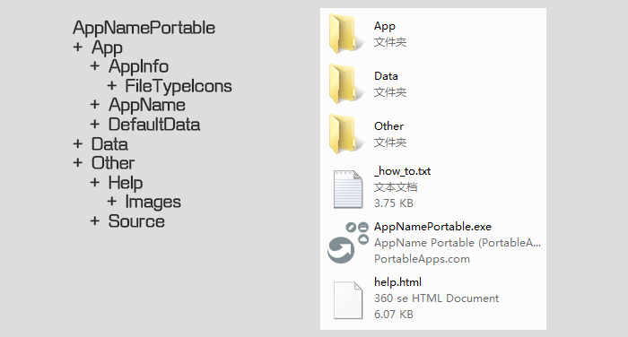

# 用PAL制作便携软件（一）
PortableApps.com是一个提供各种便携式应用程序的网站。PortableApps.com是由John T. Haller所成立的。

该站点的网址是：[https://portableapps.com](https://portableapps.com/)

PortableApps.com提供许多免费的、常用的Windows应用程序，可以在可移动介质（如：U盘）中使用，用户数据均存储在该应用程序所在目录的子文件夹中，并允许用户升级或移动软件而不会影响数据，即我们所说的便携式应用程序（或称便携软件）。

PortableApps.com发布的便携式应用程序，可在PortableApps.com Platform菜单上找到，这些应用程序的安装程序均遵循以下惯例：使用以.paf.exe扩展名结尾的文件名，包括HTML文档并在Data目录中存储数据等。

那么，如何制作类似PortableApps.com发布的便携式应用程序呢？

简单的说，我们需要分三步：

第一步，按照PortableApps.com Format的要求，准备相关资料。

PortableApps.com Format是一种简单的规范，用于管理文件和目录布局以及便携式应用程序的操作行为。

第二步，使用PortableApps.com Launcher，制作使应用程序便携化的启动程序。

PortableApps.com Launcher（简称为PAL，便携式应用程序的启动程序的制作工具）用于通过处理路径重定向，环境变量更改，文件和目录移动，配置文件路径更新以及配置的类似更改，来使应用程序便携化，而无需编写自定义代码或更改基本应用程序。

第三步，使用PortableApps.comInstaller，将制作好的便携式应用程序打包成.paf.exe格式，以便于交流、发布、备份。

PortableApps.comInstaller是一个打包工具。

这三个步骤中，主要的工作是第一步，一般需要通过虚拟机（Virtualbox、VMware Workstation）、监控软件（Total Uninstall、RegShot），来配合完成。

# 用PAL制作便携软件（二）—— 目录和文件布局
每个便携式应用程序的基本目录布局，由一个主目录AppNamePortable组成，该目录包含三个目录：App，Data和Other。

- AppNamePortable
	- App
		- AppInfo
			- FileTypeIcons
		- AppName
		- DefaultData
	- Data
	- Other
		- Help
			- Images
		- Source

## AppNamePortable目录
包含主应用程序启动程序（通常名为AppNamePortable.exe，简称启动程序）和主帮助文件help.html。默认情况下，此目录中除了App、Data、Other文件夹和主应用程序启动程序、主帮助文件外，不存在其他文件。

### App目录
包含构成应用程序本身的所有二进制文件和其他文件，通常位于名为AppName的目录中。

AppInfo目录，包含该应用程序在PortableApps.com Platform上用于显示详细信息的appinfo.ini配置文件以及菜单中使用的图标。它还可能包含用于PortableApps.com Launcher（简称PAL）的launcher.ini配置文件。

AppName目录，应用程序。

DefaultData目录，用来放置Data目录中的默认文件。通常，启动程序在运行时将检查Data目录中是否有一组文件，如果没有，将复制该组文件从DefaultData目录到Data目录中，以便应用程序运行时使用。

### Data目录
包含应用程序的所有用户数据，包括通常存储在APPDATA中的本地安装应用程序的设置，配置和其他数据。PortableApps.com发布的应用程序，通常包含settings目录中的设置，profiles目录中的Mozilla应用程序的配置文件。Data目录中不应包含任何应用程序组件（二进制文件等）。启动程序或应用程序必须能够重新创建Data目录及其中所有必需的文件（如果缺少）。

### Other目录
包含主程序以外其他类别的文件。

Help目录：包含help.html使用的其他图像和其他文件，其中帮助文件的图像将包含在Help子目录中的Images子目录中。

Source目录：包含任何源代码或源代码许可以及PortableApps.com安装程序的源文件（如果需要），例如：AppNamePortable.exe启动程序的源代码；一个readme.txt文件，详细说明了启动程序的使用情况；许可证信息和其他文件。

# 用PAL制作便携软件（三）—— AppInfo.ini（应用配置）
便携式应用程序通过AppInfo.ini详细内容，将该应用程序的配置信息提供给PortableApps.com平台。

- AppNamePortable
	- App
		- AppInfo
			- FileTypeIcons
			- AppInfo.ini
			- Installer.ini
			- AppCompactor.ini

在AppNamePortable主目录下的App目录中，AppInfo目录包含appinfo.ini文件以及菜单中使用的所有图标。

## appinfo.ini文件
appinfo.ini文件一般包含以下示例内容：

~~~ini
[Format]
Type=PortableApps.comFormat
Version=3.5

[Details]
Name=AppName Portable
AppID=AppNamePortable
BaseAppName=AppName
Publisher=App Developer & PortableApps.com
Homepage=PortableApps.com/AppNamePortable
Donate=example.com/donate
Category=Utilities
Description=AppName Portable is a tool that does something.
Language=Multilingual
Trademarks='thing'is a trademark of XYZ Inc
InstallType=

[License]
Shareable=true
OpenSource=true
Freeware=true
CommercialUse=true
EULAVersion=1

[Version]
PackageVersion=1.2.0.1
DisplayVersion=1.2 Release 1

[SpecialPaths]
Plugins=NONE
~~~

在appinfo.ini文件中，包含\[Format]、\[Details]、\[License]、\[Version]等区段，每个区段下面由若干参数及参数值组成，每个参数占一行，具体说明如下（注意：请勿在这些区段的参数、参数值中使用双引号）：

### [Format]区段
==**Type=PortableApps.comFormat**==，是appinfo.ini的文件类型（仅PortableApps.comFormat有效）。  

==**Version=3.5**==，是文件所在格式的版本（当前为3.5）。

### [Details]区段
==**Name=AppName Portable**==，是将在PortableApps.com菜单中显示的应用程序名称。  

==**AppID=AppNamePortable**==，是应用程序的全局唯一ID。AppID可能包含字母，数字，句点（.），短划线（-），加号（+）和下划线（\_）。其中PortableApps.com发布的应用程序以AppNamePortable格式命名；其他实体发布的应用必须以AppNamePortable-example.com格式命名，其中example.com是其官网域名；PortableApps.com上的个人发布的，且不会使其成为官方PortableApps.com版本的应用，必须以AppNamePortable-username格式命名，其中username是PortableApps.com用户名。

==**BaseAppName=AppName**==（可选），是基本应用程序的名称（如果它与启动器名称不同）。这应该仅在特定应用程序中的启动程序需要时使用。如果不需要，它应该被排除在appinfo.ini之外。

==**Publisher=App Developer & PortableApps.com**==，是应用程序发布者的名称，因为它会出现在PortableApps.com平台版本的悬停提示中以及应用程序详细信息中，所以如果您要重新打包由其他人编写的应用程序，应该列出它们。

==**Homepage=PortableApps.com/AppNamePortable**==，是所制作的便携式应用程序的主页

==**Donate=example.com/donate**==，是一个页面的URL，用于支持开发应用程序的捐赠

==**Category=Utilities**==，应用程序在PortableApps.com平台的类别。只能使用以下有效的条目的英文格式：Accessibility辅助功能， Development开发，Education教育，Games游戏，Graphics & Pictures图形和图片，Internet互联网， Music & Video音乐和视频，Office办公室，Security安全 或 Utilities公用事业。

==**Description=AppName Portable is a tool.**==，是应用程序的简要描述，最多512个字符。

==**Language=Multilingual**==，是应用程序可用的语言。如果应用程序是多语言的，则应将其指定为多语言。语言字符串必须采用以下英文格式：Afrikaans, Albanian, Arabic, Armenian, Basque, Belarusian, Bosnian, Breton, Bulgarian, Catalan, Cibemba, Croatian, Czech, Danish, Dutch, Efik, English（英文）, EnglishGB, Esperanto, Estonian, Farsi, Finnish, French, Galician, Georgian, German, Greek, Hebrew, Hindi, Hungarian, Icelandic, Igbo, Indonesian, Irish, Italian, Japanese, Khmer, Korean, Kurdish, Latvian, Lithuanian, Luxembourgish, Macedonian, Malagasy, Malay, Mongolian, Norwegian, NorwegianNynorsk, Pashto, Polish, Portuguese, PortugueseBR, Romanian, Russian, Serbian, SerbianLatin, SimpChinese（简体中文）, Slovak, Slovenian, Spanish, SpanishInternational, Swahili, Swedish, Thai, TradChinese（繁体中文）, Turkish, Ukrainian, Uzbek, Valencian, Vietnamese, Welsh, Yoruba。

==**Trademarks=’thing’ is a trademark of XYZ Inc**==（可选），是商标的说明信息。例如，thing是XYZ Inc的商标。请注意，此字段中的双引号将转换为单引号。

==**InstallType=**==（可选）：是您希望应用程序在菜单中列为特定安装类型。对于某些按语言打包的应用程序（如Mozilla Firefox），可以在此行中指定语言。在具有可选组件的安装程序中，安装程序会根据installer.ini中的详细信息自动更新此行。InstallType将在PortableApps.com平台上，显示在应用程序的详细信息中。

### [License]区段
\[License]区段所有值都为true或false，请勿在这些字段中包含双引号。

- ==**Shareable=true**==，是否允许将应用程序复制、传播（不包含Data目录）  
- ==**OpenSource=true**==，是否完全开源软件  
- ==**Freeware=true**==，是否免费软件  
- ==**CommercialUse=true**==，是否允许在商业环境中使用该应用程序。
- ==**EULAVersion=true**==（可选），用于指示在您包含EULA.txt并要求用户同意安装许可时使用的最终用户许可协议的版本。如果您使用的是EULA并省略此条目，则将使用默认值1。

### [Version]区段
\[Version]区段，请勿在这些字段中包含双引号。

==**PackageVersion**==：是软件包本身的版本。这必须是1.2.3.4格式，没有其他字符，并且必须在每个公开发布时递增。  

==**DisplayVersion**==：通常用于描述版本。因此，发布的应用程序可能具有2.4版本2的DisplayVersion，但是PackageVersion为2.4.0.2。

### [SpecialPaths]区段（可选）
==**Plugins=NONE**==（可选），是用户添加的应用程序的插件目录的路径，如果它位于App目录中（就像Firefox之类的应用程序一样）。当安装程序计算升级需要多少可用空间时，将排除此路径。如果没有plugins目录，则应从appinfo.ini中省略此值。

~~~ini
[Dependencies]
UsesGhostscript=optional
UsesJava=no
UsesDotNetVersion=

[Control]
Icons=1
Start=AppNamePortable.exe
Extractlcon=App\AppName\AppName.exe
ExtractName=App\AppName\AppName.exe
BaseAppID=%BASELAUNCHERPATH%App\AppName\AppName.exe
BaseApplD64=%BASELAUNCHERPATH%App\AppName64\AppName.exe

[Associations]
FileTypes=html,htm,xhtml,xhtm,xht,shtml
FileTypeCommandLine=/Open=%1
FileTypeCommandLine-extension=/OpenExtension=%1
Protocols=http,https,gtp,gopher
ProtocolCommandLine=--protocolhandler=%1
ProtocolCommandLine-protocol=--http:%1
SendTo=true
SendToCommandLine=-multiplefiles *%
Shell=true
ShellCommand=/idlist,%1,%L

[FileTypeIcons]
swf=video
ttp=custom
qwe=app
AllOtherIcons=image
~~~

### [Dependencies]区段（可选）
==**UsesGhostscript=optional**==（可选），指定便携式应用程序是否使用Ghostscript Portable。如果需要，此值应设置为yes。如果不需要，应省略或设置为no。如果Ghostscript添加了可选功能但正常操作不需要，则应将此值设置为optional。

==**UsesJava=no**==（可选），指定便携式应用程序是否使用Java Portable。如果需要，此值应设置为yes。如果不需要，应省略或设置为no。如果Java添加了可选功能但正常操作不需要，则应将此值设置为optional。不推荐使用的true / false值，将被解释为yes / no。

==**UsesDotNetVersion=**==（可选），指定应用程序所需的.NET框架的最低版本。如果需要，应将此值设置为应用程序所需的最低版本（例如：1.1,2.0,3.0,3.5,4.0）。如果需要特定版本的特定Service Pack，则可以在版本号之后添加（例如：2.0SP2,3.0SP1）。如果使用4.0，则假定应用程序仅需要客户端配置文件。如果它需要完整的框架，那么可以指定为4.0F。对于可以在.NET 2.0和4.0 / 4.5上运行的应用程序，还有一个特殊值2-4，它可以在Windows Vista上通过Windows 10开箱即用。如果不需要.NET，则应省略此值。请注意，PortableApps.com目前仅接受目前在.NET 2和4上运行的应用程序，因为它们适用于所有Windows Vista和更高版本的PC。将来会添加其他.NET版本。

### [Control]区段
\[Control]区段：（==请勿在这些字段中包含双引号==）

==**Icons=1**==，是应用程序在PortableApps.com菜单中具有的图标数  

==**Start=AppNamePortable.exe**==，是执行以相对于AppNamePortable目录启动应用程序的命令行。这通常是AppNamePortable.exe。

==**ExtractIcon=App\AppName\AppName.exe**==（可选），如果AppInfo目录中的有应用程序的appicon.ico，则使用ExtractIcon（可选）。这应该仅在特定应用程序中使用，因为它会导致应用程序访问速度变慢。如果不需要，它应该被排除在appinfo.ini之外。此选项仅适用于具有单个图标的应用。  

==**ExtractName=App\AppName\AppName.exe**==（可选），如果应用程序的相应名称不是appinfo.ini中指示的便携式启动器的名称，则使用ExtractName（可选）。这应该仅在特定应用程序中使用，因为它会导致应用程序访问速度变慢。如果不需要，它应该被排除在appinfo.ini之外。此选项仅适用于具有单个图标的应用。

==**BaseAppID=%BASELAUNCHERPATH%\App\AppName\AppName.exe**==（可选），是应用程序在32位系统上运行时Windows用于任务栏固定的应用程序ID。添加此项将允许平台版本16及更高版本创建可用于本地的可用快捷方式。  

==**BaseAppID64=%BASELAUNCHERPATH%\App\AppName64\AppName.exe**==（可选）；是应用程序在64位系统上运行时Windows用于任务栏固定的应用程序ID。添加此项将允许平台版本16及更高版本创建可用于本地的可用快捷方式。

### [Associations]区段
\[Associations]区段（可选）：此部分允许便携式应用程序通知平台，它能够打开哪些类型的文件（文档，音频文件等）或协议（http，torrent等）。==对于不需要将自己与任何文件或协议关联的应用程序，应省略此部分==。

==**FileTypes=html,htm,xhtml,xhtm,xht,shtml**==（可选），是应用程序能够打开的以逗号分隔的文件类型扩展名列表。示例包括txt，html，doc等。

==**FileTypeCommandLine=/Open=%1**==（可选），是一个命令行参数，应该传递给AppNamePortable.exe启动程序，以便应用程序正确打开文件。％1表示文件传递的点。对于大多数只能通过将文件传递给启动器来打开文件的应用程序，FileTypeCommandLine是不必要的，应该省略。

==**FileTypeCommandLine-extension=/OpenExtension=%1**==（可选），是一个命令行参数，应该传递给AppNamePortable.exe启动程序，以便应用程序正确打开特定文件类型，扩展名为给定文件类型（例如：FileTypeCommandLine-html =或FileTypeCommandLine-DOC =）。％1表示文件传递的点。仅当给定应用程序针对不同文件类型具有不同的命令行并且将覆盖指示的扩展名的标准FileTypeCommandLine时，才需要FileTypeCommandLine扩展。对于大多数应用程序，这是不必要的，应该省略。

==**Protocols=http,https,gtp,gopher**==（可选），是应用程序能够处理的以逗号分隔的协议列表。示例包括http，mailto，torrent等。

==**ProtocolCommandLine=–protocolhandler=%1**==（可选），是一个命令行参数，应该传递给AppNamePortable.exe启动程序，以便应用程序正确打开协议。％1表示将传递文件，URL或字符串的点。

==**ProtocolCommandLine-protocol=–http:%1**==（可选），是一个命令行参数，应该传递给AppNamePortable.exe启动程序，以便应用程序正确打开特定协议，并且’protocol’是要打开的给定协议（例如：ProtocolCommandLine-http =或ProtocolCommandLine-洪流=）。％1表示将传递文件，URL或字符串的点。仅当给定应用程序针对不同协议具有不同的命令行并且将覆盖所指示协议的标准ProtocolCommandLine时，才需要ProtocolCommandLine协议。对于大多数应用程序，这是不必要的，应该省略。

==**SendTo=true**==（可选），设置为true时，指示是否应在Windows Send To子菜单中显示给定的应用程序。这仅适用于一小部分应用程序（例如防病毒软件），通常应省略。

==**SendToCommandLine=-multiplefiles “%1″**==（可选），是一个命令行参数，应该传递给AppNamePortable.exe启动程序，以便应用程序正确处理SendTo命令中发送的任何内容。％1表示文件/路径将被传递的点。

==**Shell=true**==（可选），设置为true时，表示给定的应用程序是否应作为Windows shell提供。这仅适用于非常具体的，通常应该省略。

==**ShellCommand=/idlist,%I,%L**==（可选），是一个命令行参数，应该传递给AppNamePortable.exe启动程序，以便应用程序正确处理Windows发送给shell的％I和％L变量。

### [FileTypeIcons]区段（可选）
\[FileTypeIcons]区段（可选）：此部分允许便携式应用程序为应用程序可以处理的任何文件类型定义自定义图标，这些文件类型在前面描述的\[Associations]部分中列出。只有未在PortableApps.com平台中内置的文件类型才需要此部分。内置文件类型和类别如下：

~~~txt
archive:7z,bzip2,cab,gz,gzip,rar,tar,zip,wim,XZ,z

audio:aac,aif,iff,flac,m3u,m3u8,m4a,mid,midi,mp3,mpa,ogg,pls,ra,wav,wv

calendar:ical,icalendar,ics,ifb,vcs

chart:(no defaults)

code:ada,ads,adb,asm,asp,aspx,au3,bas,c,cmake,h,hpp,hxx,cpp,cc,cs,css,d,
diff,patch,es,iss,java,js,jsp,lua,m,mak,nsi,nsh,pas,inc,pl,pm,plx,php,php3,
phtml,pro,psl,py,pyw,r,rb,rbw,rc,sql,vb,vbs,xml,xsml,xsl,xsd,wsdl

contact:vcard,vcf

database:db,odb,sqlite

diskimage:cue,img,iso

drawing:ai,eps,odg,otp,sda,sdd,sgv,std,svg.svgz,sxd

document:abw,djvu,doc,docm,docx,dotx,dotm,fodt,odt,ott,pdf,rtf,stw,sxw,uot,ps

ebook:azw,cbr,cbz,epub,Irf,Irx,lit,mobi

font:fnt,otf,ttf

image:ani,bmp,cur,ico,jpg,jpeg,gif,ora,pcx,png,psd,tif,tiff,xcf

java:jar

presentation:odp,otp,sxi,sti,sxd,pps,ppsx,ppt,pptm,pptx,pot,sdd,sdp

spreadsheet:gnumeric,ods,ots,sxc,stc,xls,xlc,xim,xlw,xlk,sdc,csv,xlsx,xlsm

text:cfg,inf,ini,log,nfo,txt,text

torrent:torrent

video:3gp,asf,avi,flv,mp4,m4v,mpe,mpeg,mpg,mkv,mov,ogm,qt,rm,rmvb,webm,wmv

webpage:html,htm,mht,mhtml,shtml,xhtml,xhtm,xht
~~~

对于不在该列表上的文件类型，\[FileTypeIcons]应该包含每个需要关联自定义图标的文件类型的一个条目。每个条目可以设置为上面的类别（archive存档，audio音频，calendar日历等），’app’表示应该使用便携式应用程序的主图标，或’custom’表示相关图标将包含在App \ AppInfo \下FileTypeIcons目录中，如下面的图标部分所述。\[Associations]部分中包含的，但未由平台定义或此处列出的任何关联文件类型，将默认为“app”图标。

\[FileTypeIcons]  

==**swf=video**==，文件类型swf将具有用于其文件的平台内置视频图标  

==**ttp=custom**==，文件类型ttp将包含自定义图标在App \ AppInfo \ FileTypeIcons目录中。  

==**qwe=app**==，文件类型sqe将具有用于其文件的应用程序的主appicon.ico图标  

==**AllOtherIcons=image**==，用作所有与应用程序关联但未由平台或FileTypeIcons部分定义的任何图标。对于像图像查看器这样的应用程序来说，它可以支持数百种不常见的图像格式，而无需为每种格式写出条目，或者必须使用应用程序的主图标。

# 用PAL制作便携软件（四）—— 图标

- AppNamePortable
	- App
		- AppInfo
			- FileTypeIcons
			- AppInfo.ini
			- Installer.ini
			- AppCompactor.ini

在AppNamePortable\App\AppInfo目录中，可以找到便携软件安装程序的图标，和便携软件在PortableApps.com菜单中使用的图标。图标包含ICO和PNG格式。主图标名为appicon.ico，appicon_16.png，appicon_32.png，appicon_75.png（非必要）和appicon_128.png（非必要）。

如果应用程序还使用多个图标（如上所述），则这些附加图标将命名为appicon1.ico（appicon1_16.png和appicon1_32.png），appicon2.ico等。这些数字对应于控件中的Start1，Start2等部分。==请注意，75px和128px图标是可选的，安装程序无需编译。但是，鼓励大家将这些高分辨率图标包含在平台即将推出的功能中，以便在Windows 10上的安装程序中使用==。

PNG图标分别为16×16,32×32,75×75和128×128，并采用具有Alpha透明度的True Color格式。

ICO文件采用Windows ICO格式，如果需要，包含以下6种必需格式以及可选的Vista格式：  
- 16px – 256色（8位）  
- 32px – 256色（8位）  
- 48px – 256色（8位）  
- 16px – 真彩色+Alpha（32位/XP格式）  
- 32px – 真彩色+Alpha（32位/XP格式）  
- 48px – 真彩色+Alpha（32位/XP格式）  
- 256px – 真彩色 + Alpha PNG（32位PNG/Vista格式）==可选/推荐==

==256px alpha大小是可选的，但建议使用。Windows Vista/7/8使用它来显示大图标和超大图标。==

ExtractIcon注 – 如果在appinfo.ini中使用\[Control]部分的ExtractIcon功能，图标的appicon.ico和PNG版本将不会被使用，可能会被省略。

除应用程序图标外，其他文件类型图标将存储在AppNamePortable\App\AppInfo\FileTypeIcons目录中，这些是与此应用程序一起使用的自定义图标，如前面提到的appinfo.ini的\[FileTypeIcons]区段中所定义的。对于\[FileTypeIcons]部分中的每个参数，FileTypeIcons目录中都应包含关联的ICO和PNG文件。这些图标命名格式与主应用程序图标的命名相似。

如前面的例子，如果在\[FileTypeIcons]中将’ttp’设置为’custom’，则文件ttp.ico，ttp_16.png，ttp_32.png和ttp_128.png将放在AppNamePortable\App\AppInfo\FileTypeIcons目录中。

对于特殊的AllOtherIcons条目，将使用AllOtherIcons.ico，AllOtherIcons_16.png，AllOtherIcons_32.png，AllOtherIcons_128.png的文件。

# 用PAL制作便携软件（五）—— AppCompactor 和 appcompactor.ini
请注意，官方发行版中已部分弃用PortableApps.com AppCompactor。使用PortableApps.com AppCompactor进行压缩，会导致防病毒引擎的误报率增加。

PortableApps.com AppCompactor用于缩小便携应用程序安装包的体积。

## AppCompactor.ini
通常，AppCompactor在设置中是完全自动的，只需要在便携式应用程序的AppNamePortable目录上运行。

有时，某些软件与AppCompactor不兼容，其自动进程无法检测到不兼容性；有时，对于某些应用程序的特殊文件，AppCompactor并不会处理它们，在这些情况下，可以使用AppCompactor.ini。

- AppNamePortable
	- App
		- AppInfo
			- FileTypeIcons
			- AppInfo.ini
			- Installer.ini
			- AppCompactor.ini

把AppCompactor.ini与AppInfo.ini和Installer.ini一起放在AppInfo目录中。该文件的示例及相关说明如下：

~~~ini
[PortableApps.comAppCompactor]  
FilesExcluded = msvcm90.dll | msvcp90.dll | mscvr90.dll  
AdditionalExtensionsExcluded = PYD | IRC  
AdditionalExtensionsIncluded = example | beta
~~~

### [PortableApps.comAppCompactor]区段
\[PortableApps.comAppCompactor]区段：如果您不打算使用PortableApps.com AppCompactor缩小应用程序或不需要更改其标准压缩设置，则应省略此区段。

==**FilesExcluded**==：是您希望AppCompactor运行时，排除或不处理的任何文件。请注意，默认情况下（Visual C ++运行时9.0）以及相同文件的7.1,8.0和10.0版本排除了示例中列出的文件。

==**AdditionalExtensionsExcluded**==：是您希望压缩时，排除的任何其他类型的文件（或扩展名）。

==**AdditionalExtensionsIncluded**==：是您希望压缩时，包含的任何其他类型的文件（或扩展名）。

==**CompressionFileSizeCutOff**==：是忽略压缩文件的分块大小，以字节为单位。默认值为4096，表示忽略大小为4K的文件。

# 用PAL制作便携软件（六）—— Installer 和 installer.ini

- AppNamePortable
	- App
		- AppInfo
			- FileTypeIcons
			- AppInfo.ini
			- Installer.ini
			- AppCompactor.ini

PortableApps.com Installer从前面提到的appinfo.ini文件以及可选的installer.ini文件中获取其需要的配置信息，其中installer.ini文件也位于AppInfo目录中。

## installer.ini文件
installer.ini文件允许对应用程序的安装过程进行详细的设置，也可以设置其他可选内容。

installer.ini包括：（请注意，此示例仅用于说明可能的选项，使用时请自行筛选。整个installer.ini是可选的。如果省略，则将替换App和其他目录，并且安装程序将是单一语言（在appinfo.ini中指定）或多语言，并包括所有支持的语言。安装程序的源代码不会包含在内。）

~~~ini
[CheckRunning]
CloseEXE=Custom.exe
CloseName=AppName

[Source]
IncludeInstallerSource=false

[MainDirectories]
RemoveAppDirectory=true
RemoveOtherDirectory=true

[OptionalComponents]
OptionalComponents=true
MainSectionTitle=AppName Portable (English)[Required]
MainSectionDescription=Install the portable app
OptionalSectionTitle=Additional Languages
OptionalSectionDescription=Add multilingual support for this app
OptionalSectionSelectedInstallType=Multilingual
OptionalSectionNotSelectedlnstallType=English
OptionalSectionPreSelectedlfNonEnglishInstall=true
OptionalSectionInstalledWhenSilent=true
OptionalDirectory1=
OptionalFile1=

[CopyLocalFiles]
CopyLocalFiles=true
CopyFromRegPath=HKLM\Software\AppName
CopyFromRegKey=AppPath
CopyFromRegRemoveDirectories=2
CopyFromDirectory=%PROGRAMFILES%\AppName
CopyToDirectory=App\AppName
~~~

### [CheckRunning]区段（可选）
\[CheckRunning]区段（可选）：  

==**CloseEXE**==（可选）：允许您分配自定义EXE以检查升级时间。如果EXE与appinfo.ini中Control-Start选项中指定的EXE相同，则应从installer.ini中省略此条目。如果您不想检查是否有任何正在运行，您可以设置CloseEXE = NONE（使用大写），但这应该谨慎，因为用户可能会尝试在运行时升级您的应用程序。

==**CloseName**==（可选）：允许您为升级时将关闭的内容指定其他名称。如果名称与appinfo.ini中指定的便携式应用程序的名称相同，则应从installer.ini中省略此条目。

### [Source]区段（可选）
\[Source]区段（可选）：  

==**IncludeInstallerSource**==（可选）：允许您将PortableApps.com安装程序的源包含在便携式应用程序中，方法是将其设置为true。

### [MainDirectories]区段（可选）
\[MainDirectories]区段（可选）：  

==**RemoveAppDirectory，RemoveDataDirectory和RemoveOtherDirectory**==（可选）：允许您通过在现有应用程序上安装新版本的应用程序来指定在升级时是删除还是保留这些目录。默认情况下，将删除App和Other目录，并保留Data目录。如果您希望使用这些默认值，则应省略installer.ini的此部分。（请注意，您可以保留下面的特定目录和文件）

### [OptionalComponents]区段（可选）
\[OptionalComponents]区段（可选）：

==**OptionalComponents**==：设置为true时，这使安装程序具有可选部分。这通常用于在应用程序中安装其他语言。

==**MainSectionTitle**==（可选）：指定将为安装程序的第一部分显示的名称。默认情况下，它将从appinfo.ini读取AppName Portable，读取“AppName Portable（English）\[Required]”。如果您对默认值满意，则应省略此条目。

==**MainSectionDescription**==（可选）：指定将为安装程序的第一部分显示的说明。默认情况下，它将显示为“安装便携式应用程序”。如果您对默认值满意，则应省略此条目。

==**OptionalSectionTitle**==（可选）：指定将为安装程序的第二个/可选部分显示的名称。默认情况下，它将显示“其他语言”。如果您对默认值满意，则应省略此条目。

==**OptionalSectionDescription**==（可选）：指定将为安装程序的第二个/可选部分显示的描述。默认情况下，它将显示“为此应用添加多语言支持”。如果您对默认值满意，则应省略此条目。

==**OptionalSectionSelectedInstallType**==（可选）：指定将写入appinfo.ini的InstallType，如果用户使用可选部分安装应用程序，则显示在PortableApps.com平台中。默认情况下，它将显示为“多语言”。如果您对默认值满意，则应省略此条目。

==**OptionalSectionNotSelectedInstallType**==（可选）：指定将写入appinfo.ini的InstallType，如果用户安装不带可选部分的应用程序，则显示在PortableApps.com平台中。默认情况下，它将显示为“英语”。如果您对默认值满意，则应省略此条目。

==**OptionalSectionPreSelectedIfNonEnglishInstall**==（可选）：指定在用户选择以非英语语言运行安装程序时是否默认选择可选节。默认值为true。如果您对默认值满意，则应省略此条目。

==**OptionalSectionInstalledWhenSilent**==（可选）：指定当从平台的应用程序安装程序启动时，安装程序以静默方式运行时是否安装了可选节。当可选组件不是其他语言时，此条目默认为true。

==**OptionalDirectory1**==：允许您指定哪些目录是安装程序的可选部分的一部分。OptionalDirectory1和更高版本可供使用。路径应该是相对的。因此，如果您希望安装程序的可选部分的目录App \ AppName \ locales部分，则在此部分中设置OptionalDirectory1 = App \ AppName \ locales。

==**OptionalFile1**==：允许您指定哪些特定文件是安装程序的可选部分的一部分。OptionalFile1和更高版本可供使用。路径应该是相对的。因此，如果您想要安装程序的可选部分的文件App \ AppName \ * .lang是您在本节中设置OptionalFile1 = App \ AppName \ * .lang。

==可选部分注意：必须使用OptionalDirectory1或OptionalFile1指定包含在安装程序可选部分中的文件（如果有）==。

### [CopyLocalFiles]区段（可选）
\[CopyLocalFiles]区段（可选）：此部分用于从应用程序的本地安装中复制文件。

==**CopyLocalFiles**==：用于指示此部分已启用。它应该设置为true。

==**CopyFromRegPath**==：在注册表中的键中指示本地文件的路径时，将使用CopyFromRegPath。通常，这将采用HKLM \ Software \ AppName的形式。

==**CopyFromRegKey**==与==**CopyFromRegPath**==一起使用。它指示应该使用上面的注册表路径中的密钥。

==**CopyFromRegRemoveDirectories**==：用于指示要从Key读入的目录数量，以到达应该复制的目录。如果Key指示文件而不是目录的路径，则应将其增加1。例如，如果Key通常指向C：\ Program Files \ AppName \ bin \ AppName.exe，并且您希望复制C：\ Program Files \ AppName中的所有文件，则将其设置为2：one以删除文件名AppName.exe和一个从路径中删除’bin’目录。

==**CopyFromDirectory**==：用于指示要复制到便携式应用程序的本地目录。如果与上面的注册表项一起使用，如果注册表项缺失或未指向有效路径，则它将用作后备。此条目通常采用％PROGRAMFILES％\ AppName格式。有几个环境变量可用，包括：％PROGRAMFILES％，％COMMONFILES％，％DESKTOP％，％WINDIR％，％SYSDIR％，％APPDATA％，％LOCALAPPDATA％和％TEMP％。

==**CopyToDirectory**==：指示便携式应用程序中文件将被复制到的相对路径。这通常采用App \ AppName的形式。如果该目录不存在，则将创建该目录。

~~~ini
[DownloadFiles]
AdditionalInstallSize=
DownloadURL=
DownloadKnockURL=
DownloadName=
DownloadFilename=
DownloadMD5=
DownloadTo=
AdvancedExtractlTo=
AdvancedExtractlFilter=
DoubleExtractFilename=
DoubleExtractITo=
DoubleExtractIFilter=
Download2URL=
Download2KnockURL=
Download2Name=
Download2Filename=
Download2MD5=
Download2To=
Download2AdvancedExtractITo=
Download2AdvancedExtractIFilter=
Download2DoubleExtractFilename=
Download2DoubleExtract1To=
Download2DoubleExtract1Filter=
CustomCodeUses7zip=

[Languages]
ENGLISH=true
~~~

### [DownloadFiles]区段（可选）
\[DownloadFiles]区段（可选）：

此部分用于从Internet下载和选择性地提取文件。

**AdditionalInstallSize**：用于指定将添加到安装程序中包含的文件的文件的大小。该条目应仅为数字，并且以KB为单位DownloadURL指定要下载的文件的URL。

DownloadURL specifies the URL to the file that will be downloaded. It is normally in the form \http://example.com/path/filename

**DownloadURL**：它通常采用http://example.com/path/filename格式

**DownloadKnockURL**：指定在下载DownloadURL指定的文件之前必须下载的URL。

**DownloadName**：是下载文件时将显示的名称。这必须是有效的DOS名称，不应包含特殊字符，如：，“，\等。

**DownloadFilename**：是在本地使用时将使用的文件的名称。这应该与DownloadURL中的文件名相同。它通常采用filename.exe或filename.zip的形式。

**DownloadMD5**：用于指定下载文件的MD5哈希值。这允许安装程序验证自创建安装程序后文件未更改。==高度推荐使用此条目==。

**DownloadTo**：如果下载的文件应该按原样复制到便携式应用程序中，则可以选择使用DownloadTo。该条目通常采用App \ AppName格式。此条目不能与后面的提取条目一起使用。

**DownloadCachedByPAc**：用于在PortableApps.com缓存实时下载时向PortableApps.com平台指示。安装程序本身不会使用缓存，但会在通过PortableApps.com平台的App Store安装或更新时使用。

**AdvancedExtract1To**和**AdvancedExtract1Filter**：用于从ZIP文件以及许多安装程序EXE进行更高级的提取。AdvancedExtractTo条目应指定文件在已安装的便携式应用程序中的相对路径（通常为App \ AppName）。AdvancedExtractFilter条目用于指定要提取的文件的过滤器，其格式与7-zip使用的格式相同。一些示例包括所有文本文件的\* .txt，所有文件的\_，\_ a\*用于包含字母a的文件，sc目录中所有cpp文件的Src \ * .cpp等。\*\*可用于指示递归中存档中的所有文件（包括子目录）。最多可以输入10个条目。AdvancedExtract＃支持使用指示应用程序的根目录。

==请注意，在将较旧的PA.c格式应用程序编译为较新格式时，已弃用的Extract1To等配置会自动转换为AdvancedExtract1To等配置==

当下载的文件包含存档中的存档时，将使用==**DoubleExtractFilename**==。DoubleExtractFilename应设置为存档内的存档名称。例如，如果要下载名为setup.exe的文件，该文件包含其中包含所需文件的文件data.zip，则DoubleExtractFilename将设置为data.zip。DoubleExtractTo和DoubleExtractFilter在提取的存档上执行，格式与上面的AdvancedExtract1To和AdvancedExtract1Filter相同。最多可使用10个条目。DoubleExtract支持使用指示应用程序的根目录。

==**Download2URL，Download2KnockURL，Download2Name，Download2Filename，Download2MD5，Download2To，Download2CachedByPAc**==：用于第二个可下载文件的目的与没有2的对应文件相同。

==**Download2AdvancedExtract1To，Download2AdvancedExtract1Filter，Download2DoubleExtractFilename，Download2DoubleExtract1To，Download2DoubleExtract1Filter**==：为第二个可下载文件服务的目的与上面的对应文件相同，没有Download2前缀。

如果需要在自定义代码中从命令行调用7z.exe，可以将==**CustomCodeUses7zip**==设置为true。==请注意，如果设置了AdvancedExtract1To，DoubleExtract1To，Download2AdvancedExtract1To或Download2DoubleExtract1To，则会自动包含7z==。

### [Languages]区段（可选）
\[Languages]区段（可选）：  

每个条目用于指定当用户正在安装便携式应用程序时该语言是否可用，并且appinfo.ini设置为Multilingual。如果省略此部分，则包括所有语言。如果包含此部分，则至少需要ENGLISH =。所有其他语言都是可选的，默认为false。

~~~ini
[DirectoriesToPreserve]
PreserveDirectory1=

[DirectoriesToRemove]
RemoveDirectory1=

[FilesToPreserve]
PreserveFile1=

[FilesToRemove]
RemoveFile1=
~~~

#### [DirectoriesToPreserve]区段（可选）
\[DirectoriesToPreserve]区段（可选）：

此部分指定即使在升级时将某个给定目录（App，Data，Other）设置为要删除的目录也将保留。最多可以使用PreserveDirectory1，PreserveDirectory2等形式的10个条目。每个应该在应用程序内的相对路径中。如果您希望保留目录App \ AppName \ plugins，则会在此部分中将其作为PreserveDirectory1 = App \ AppName \ plugins输入。如果没有目录需要保留，则应省略此部分。

#### [DirectoriesToRemove]区段（可选）
\[DirectoriesToRemove]区段（可选）：

此部分指定即使在升级时不删除给定目录（App，Data，Other）也将删除的目录。最多可以使用RemoveDirectory1，RemoveDirectory2等形式的10个条目。每个应该在应用程序内的相对路径中。如果要删除目录App \ AppName \ locales，则会在此部分中将其作为RemoveDirectory1 = App \ AppName \ locales输入。如果不需要删除目录，则应省略此部分。

#### [FilesToPreserve]区段（可选）
\[FilesToPreserve]区段（可选）：

此部分指定即使在升级时将某个目录（App，Data，Other）设置为删除，也将保留的文件。最多可提供10个PreserveFile1，PreserveFile2等形式的条目。每个应该在应用程序内的相对路径中。如果您希望保留文件App \ AppName \ * .hlp，则在本节中将其作为PreserveFile1 = App \ AppName \ * .hll输入。如果没有文件需要保留，则应省略此部分。

#### [FilesToRemove]区段（可选）
\[FilesToRemove]区段（可选）：

此部分指定即使在升级时除了给定目录（App，Data，Other）外将删除的文件。最多可以使用RemoveFile1，RemoveFile2等形式的10个条目。每个应该在应用程序内的相对路径中。如果您希望删除文件App \ AppName \ \* .lang，它将在此部分中作为RemoveFile1 = App \ AppName \ * .lang输入。如果不需要删除文件，则应省略此部分。

通过在App \ AppInfo目录中包含EULA.txt文件，可以在PortableApps.com安装程序中显示最终用户许可协议（EULA）或其他许可文件。PortableApps.com安装程序将自动定位并配置它以供使用。请确保许可证是Unicode格式而不是ANSI格式。

通过在Other \ Source目录中包含名为PortableApps.comInstallerCustom.nsh的文件，安装程序可能包含自定义代码。  

此文件在NSIS中编码，可包含3个宏：CustomCodePreInstall（在安装前运行），CustomCodePostInstall（在安装后运行）和CustomCodeOptionalCleanup（如果未选择安装程序的可选部分，则在安装开始时运行），当现有应用程序可能包含可选部分时，旨在用于应用程序升级。除了标准的NSIS功能外，还提供以下NSIS功能：ConfigRead，ConfigReadS，ConfigWrite，ConfigWriteS，GetParent，GetRoot，VersionCompare和NSIS的LogicLib功能。请确保该文件是Unicode编码（不是ANSI / DOS）。

PortableApps.com安装程序代码本身不应在其作为PortableApps.com安装程序的范围内直接更改。与往常一样，源代码在GPL下可用，可以自由修改并在其他GPL许可的作品中使用。

PortableApps.com格式的应用程序的每个版本都必须使用当前的PortableApps.com安装程序。如果正在编译具有更长开发和测试时间的更大应用程序，并且在测试发布期间发布了新版本的PortableApps.com安装程序，则可以保留应用程序当前正在使用的安装程序版本，前提是新版本在发布使用旧版本的应用程序的当天，安装程序版本不到30天。

PortableApps.com安装程序将在AppInfo目录中存储的名为pac_installer_log.ini的文件中记录有关安装程序生成和实际应用程序安装的信息。应通过适当的gitignore配置从git存储库中排除此文件。日志文件中的详细信息包括安装程序是否已运行，创建安装程序包的时间，应用程序实际安装的时间，用于生成安装程序的安装程序向导的版本，安装程序运行时的安装程序版本，以及将来可能添加的其他日志信息。除官方PortableApps.com安装程序外，不得更改或删除此文件。便携式应用程序可以利用此文件来跟踪安装时间和正确的安装方法。

# 用PAL制作便携软件（七）—— 插件安装程序
PortableApps.com安装程序还可用于将插件添加到便携式应用程序中。这是通过App \ AppInfo目录中名为plugininstaller.ini的文件来完成的。

此文件可以包含上述appinfo.ini和installer.ini文件中的所有条目，并将其合并为一个文件。

文件的一个附加内容在\[Details]部分中，其中创建了一个名为==**PluginName =**==的条目。这里填写插件的名称，例如：Adobe Flash for Firefox Portable。

对于插件安装程序，\[MainDirectories]删除选项都默认为false。

如果插件需要EULA，而不是EULA.txt，则应使用PluginEULA.txt文件。

要创建插件安装程序，首先创建类似于插件所使用的可移植应用程序的目录布局，包括App，App \ AppName，Data，Other等目录。然后，只将要包含在插件安装程序中的文件放在适当的位置。除了plugininstaller.ini之外，App \ AppInfo目录应该是空的，因为它仅由主应用程序使用。任何自定义代码都应位于Other \ Source中名为PortableApps.comInstallerPluginCustom.nsh的文件中。最后，创建一个文件plugininstaller.ini，其中的条目通常位于上面的appinfo.ini和installer.ini中，并正常编译。

此外，可以通过向详细信息部分添加条目==**PluginType = CommonFiles**==来安装到X：\ PortableApps \ CommonFiles的CommonFiles安装程序。这适用于由PortableApps.com指定的多个应用程序（例如Java）使用的特定插件。在这种情况下，App的\[MainDirectories]删除选项默认设置为true，并将删除整个X：\ PortableApps \ CommonFiles \ AppID目录（通常是CommonFiles插件所需的目录）。

# 学习制作PAL的launcher.ini文件（一）
用PAL制作便携软件，重点在于编辑、制作launcher.ini文件。

PortableApps.com Launcher，简称PAL，便携软件启动程序的制作工具，通常它需要通过App\AppInfo\Launcher目录下的AppNamePortable.ini（每个软件都有以自己名称命名的AppNamePortable.ini文件，AppName为软件名称，我们统一称之为便携软件的启动配置文件，即launcher.ini），才能制作了位于根目录的AppNamePortable.exe（便携软件启动程序）。

在这里，我们明确了：  
- PortableApps.com Launcher：便携软件启动程序的制作工具。  
- AppNamePortable.exe：便携软件运行时的启动程序，由制作工具生成。  
- AppNamePortable.ini：或称launcher.ini，便携软件的启动配置文件。

**重点在于编辑、制作launcher.ini文件。**

## launcher.ini文件的基本组成
下面我们就先了解一下launcher.ini文件的基本组成

**[Launch]：基本配置参数区段**

**[Activate]：加载类型参数区段**

**[LiveMode]：本地模式参数区段**

**[Environment]：环境及位置参数区段**

**注册表参数区段**，告诉便携软件启动程序AppNamePortable.exe如何处理注册表，包含以下5项  
- [RegistryKeys]  
- [RegistryValueWrite]  
- [RegistryCleanupIfEmpty]  
- [RegistryCleanupForce]  
- [RegistryValueBackupDelete]  
- [QtKeysCleanup]

**文件处理参数区段**，告诉便携软件启动程序AppNamePortable.exe如何处理文件，包含以下2项  
- [FileWriteN]  
- [FilesMove]

**文件夹处理参数区段**，告诉便携软件启动程序AppNamePortable.exe如何处理文件夹，包含以下3项  
- [DirectoriesMove]  
- [DirectoriesCleanupIfEmpty]  
- [DirectoriesCleanupForce]

**语言设置参数区段**  
- [Language]  
- [LanguageStrings]  
- [LanguageFile]

**[ServiceN]：服务、驱动参数区段**，便携软件启动程序所需的系统服务或驱动程序。

# 学习制作PAL的launcher.ini文件（二）
使用PAL制作便携软件，重点在于编辑、制作launcher.ini文件。

## [Launch]区段 包含的参数
1、**AppName（可选）**，新版本已经弃用此参数。

2、**ProgramExecutable（必选）**，在AppNamePortable\App目录下，主程序的路径。

- 举例：ProgramExecutable=AppName\AppName.exe

3、**ProgramExecutableWhenParameters（可选）**，指定了此参数，具有覆盖ProgramExecutable的效果。

4、**ProgramExecutable64（可选）**，64位系统时，在AppNamePortable\App目录下，主程序的路径。

5、**ProgramExecutableWhenParameters64（可选）**，指定了此参数，具有覆盖ProgramExecutable的效果。

6、**CommandLineArguments（可选**），指定需要执行的批处理文件的目录。

- 举例：CommandLineArguments=’-d “%PAL:DataDir%\settings”‘

7、**WorkingDirectory（可选）**，是否必须从某个工作目录运行应用程序。

- 举例：WorkingDirectory=%PAL:AppDir%\AppName

8、**MinOS（可选）**，指定运行应用程序的最低环境。  
- MinOS（可选） = none（默认） / 2000 / XP / 2003 / Vista / 2008 / 7 / 2008 R2 ：

9、**MaxOS（可选）**，指定运行应用程序的最高环境。  
- MaxOS（可选） = none（默认）/ 2000 / XP / 2003 / Vista / 2008 / 7 / 2008 R2

10、**RunAsAdmin（可选）**，是否需要管理员权限。  
- **RunAsAdmin（可选）** = force / try / compile-force / none（默认）：是否需要管理员权限 
- **RunAsAdmin2000（可选）** = force / try / none（默认）  
- **RunAsAdminXP（可选）** = force / try / none（默认）  
- **RunAsAdmin2003（可选）** = force / try / none（默认）  
- **RunAsAdminVista（可选）** = force / try / none（默认）  
- **RunAsAdmin2008（可选）** = force / try / none（默认）  
- **RunAsAdmin7（可选）** = force / try / none（默认）  
- **RunAsAdmin2008R2（可选）** = force / try / none（默认）

11、**CleanTemp（可选）**，是否清理便携软件产生的临时文件  
- CleanTemp（可选） = true（默认） / false

12、**SinglePortableAppInstance（可选）**，是否允许多个启动器运行。  
- SinglePortableAppInstance（可选） = true / false（默认）

13、**SingleAppInstance（可选）**，只希望运行应用程序的一个实例，省略此值。  
- SingleAppInstance（可选） = true（默认） / false

14、**CloseEXE（可选）**，关闭除了主程序以外的，其他影响主程序启动的程序或进程

15、**SplashTime（可选）**，启动画面时间。  
- SplashTime（可选） = 1500（默认，毫秒）

16、**LaunchAppAfterSplash（可选）**，是否需要启动画面  
- LaunchAppAfterSplash（可选） = true / false（默认）

17、**WaitForProgram（可选）**，是否需要启动程序等待应用程序的结束。  
- WaitForProgram（可选） = true（默认） / false

18、**WaitForOtherInstances（可选）**，应用程序是单实例，且无法自行重启的设置为false。  
- WaitForOtherInstances（可选） = true（默认） / false

19、**WaitForEXEN（可选）**：结束便携软件时，除了关闭主程序，可能还需要关闭其他相关的进程

20、**RefreshShellIcons（可选）**，清理应用程序关联的文件扩展名。  
- RefreshShellIcons（可选） = before / after / both / none（默认）

21、**HideCommandLineWindow（可选）**，是否隐藏命令行窗口  
- HideCommandLineWindow（可选） = true / false（默认）

22、**DirectoryMoveOK（可选**），是否允许便携软件的路径改变，如果该改变并不会影响便携软件运行的话，建议选择yes  
- DirectoryMoveOK（可选） = yes / warn（默认） / no

22、**NoSpacesInPath（可选**），是否允许路径中包含空格。  
- NoSpacesInPath（可选） = true / false（默认）

23、**SupportsUNC（可选**），设置启动器是否支持从UNC路径运行。  
- SupportsUNC（可选） = yes / warn（默认） / no

# 学习制作PAL的launcher.ini文件（三）
## [Activate]区段
\[Activate]区段，主要包含以下参数：  

注意：对此区段的任何更改都需要重新编译启动程序，即使用PAL重新生成AppNamePortable.exe。

1、**Registry（可选）**，是否会读取和写入注册表。  
- Registry（可选）= true / false（默认）

2、**Java（可选）**，便携程序是否使用Java。  
- Java（可选）= none（默认）, find or require

**3、XML（可选）**，是否使用XML文本或XML属性。  
- XML（可选）= true / false（默认）

## [LiveMode]区段
\[LiveMode]区段，主要包含以下参数：

1、**CopyApp（可选）**，是否需要从可写入的目录中运行应用程序  
- CopyApp（可选）= true（默认）/ false

2、**CopyData（可选）**，新版本已经弃用此参数。

## [Environment]区段
\[Environment]区段，主要包含以下参数：  

注意：此区段用于设置环境变量。每个参数均用“%参数名称%=参数值”表示。

### 驱动器变量

1、**PAL:Drive**，表示便携软件所在的驱动器的盘符，包含冒号。

- 举例：如果便携软件在C盘，则%PAL:Drive%的值即为“C:”

2、**PAL:LastDrive**，表示便携软件最近一次运行时，所在的驱动器的盘符，包含冒号。

3、**PAL:DriveLetter**，表示便携软件所在的驱动器的盘符字母，不含冒号。

4、**PAL:LastDriveLetter**，表示便携软件最近一次运行时，所在的驱动器的盘符字母，不含冒号。

### 目录变量

1、**PAL:AppDir**，表示便携式应用程序的App目录的路径。

- 举例：如果便携软件的主程序在X:\PortableApps\AppNamePortable\App中，则%PAL:AppDir%的值即为X:\PortableApps\AppNamePortable

2、**PAL:DataDir**，表示便携式应用程序的Data目录的路径。

3、**JAVA_HOME**，如果Java存在的话，表示Java目录的路径

4、**PortableApps.comDocuments**，PortableApps.com文档目录，通常为X：\Documents，此目录可能不存在。

5、**PortableApps.comPictures**，PortableApps.com图片目录，通常为X:\Documents\Pictures，此目录可能不存在。

6、**PortableApps.comMusic**，PortableApps.com音乐目录，通常为X:\Documents\Music，此目录可能不存在。

7、**PortableApps.comVideos**，PortableApps.com视频目录，通常为X:\Documents\Videos，此目录可能不存在。

8、**PAL:PortableAppsDir**，PortableApps.com所有软件的父目录，通常为X:\PortableApps。

9、**PAL:PortableAppsBaseDir**

10、**PAL:LastPortableAppsBaseDir**

11、**USERPROFILE**，在XP、2000系统中，特指路径C:\Documents and Settings\Username；在Vista以上系统中，特指路径C:\Users\Username。

12、**ALLUSERSPROFILE**，在XP、2000系统中，特指路径C:\Documents and Settings\All Users；在Vista以上系统中，特指路径C:\ProgramData。

13、**ALLUSERSAPPDATA**，在XP、2000系统中，特指路径C:\Documents and Settings\All Users\Application Data；在Vista以上系统中，特指路径C:\ProgramData。

14、**LOCALAPPDATA**，在XP、2000系统中，特指路径C:\Documents and Settings\Username\Local Settings\Application Data；在Vista以上系统中，特指路径C:\Users\Username\AppData\Local。

15、**APPDATA**，在XP、2000系统中，特指路径C:\Documents and Settings\Username\Application Data；在Vista以上系统中，特指路径C:\Users\Username\AppData\Roaming。

16、**DOCUMENTS**，在XP、2000系统中，特指路径C:\Documents and Settings\Username\My Documents；在Vista以上系统中，特指路径C:\Users\Username\Documents。

17、**TEMP**，为系统默认或指定的temp临时目录。

### 目录变量的局部表示

1、**PAL:PackagePartialDir**，一般表示\PortableApps\AppNamePortable，与完整的目录变量PAL:AppDir相比，没有盘符和冒号。

2、**PAL:LastPackagePartialDir**，同上。

### 语言变量

这些变量用于语言切换，变量的值只能在下表中选取和使用。

1. PortableApps.comLanguageCode的值可选“en”, “pt”, “pt-br”等  
2. PortableApps.comLocaleCode2的值可选“en”, “pt”, “pt”等  
3. PortableApps.comLocaleCode3的值可选“eng”, “por”, “por”等  
4. PortableApps.comLocaleglibc的值可选“en_US”, “pt”, “pt_BR”等  
5. PortableApps.comLocaleID的值可选“1033”, “2070”, “1046”等  
6. PortableApps.comLocaleWinName的值可选“LANG_ENGLISH”, “LANG_PORTUGUESE”, “LANG_PORTUGUESEBR”等  
7. PortableApps.comLocaleName的值可选“English”, “Portuguese”, “PortugueseBR” 等  
8. PAL:LanguageCustom，在\[Language]和\[LanguageStrings]区段中加入的自定义变量。

# 使用Portableapps.com Launcher制作便携软件 实例教程
## 使用Portableapps.com Launcher制作便携软件:以Evernote Portable为例
PortableApps.com Launcher（以下简称PAL）是PortableApps.com开发的便携软件制作工具。本质而言，它是一个NSIS代码生成器，让使用者不需要直接写代码便可以制作NSIS便携软件。 在制作便携软件前，我们需要准备如下工具：

一个虚拟机软件，例如 VMWare ，Windows Virtual PC，或者免费的 VirtualBox 。在虚拟机中安装 Windows XP ，Windows 7 系统，如果有条件，建议同时安装 64 位系统以便进一步测试。装好系统后，切勿安装任何额外软件、运行库，在最纯净的环境下建立快照，此后每次测试软件，均从此快照启动。

一个软件行为监控软件，例如 Total Uninstall，或者免费的 RegShot 。安装到虚拟机内。

下载 PortableApps.com Launcher 和 NSIS Portable Unicode。将它们安装到同一目录。例如：  
- X:\PortableApps\PortableApps.comLauncher  
- X:\PortableApps\NSISPortable

PAL模板 （PortableApps.com Application Template）。

### 1. 分析
将 Evernote 安装程序拷贝到虚拟机内，运行 Total Uninstall （或 RegShot）扫描系统，安装程序，再次扫描，对比快照。 通过对比，可发现Evernote在 %APPDATA% 、 %LOCALAPPDATA% 以及NT6.0以上的 LocalLow 中写入文件，在注册表 HKCU\Software\Evernote 中写入键值， HKCU\Software\Evernote\Evernote\EvernotePath 的值为Evernote数据库的位置。 在虚拟机中提取纯净的程序文件，位于： C:\Program Files\Evernote 。

我们要制作这样一个便携软件启动器（Launcher）： Launcher启动——备份本地数据——导入便携数据——将数据库路径写入注册表——启动主程序——主程序退出——导出便携软件数据——清理便携软件垃圾——恢复本地数据——Launcher退出。

### 2. AppInfo
下载PAL模板，解压后，重命名AppNamePortable为EvernotePortable。在App下新建Evernote目录，将提取出的程序文件复制到此处。 创建 App\AppInfo\appinfo.ini ，此目录下的文件主要是为PortableApps.com Platform提供信息，使用PAL创建便携软件，此目录是不可缺少的。）在appinfo.ini中这样写：

~~~ini
[Format]  
Type=PortableApps.comFormat  
Version=2.0

[Details]  
Name=Evernote Portable  
AppID=EvernotePortable  
Publisher=David Pi  
Description=Evernote is a suite of software and services designed for notetaking and archiving.  
Homepage=www.portableappc.com/portableapps/evernote-portable/  
Category=Office  
Language=SimpChinese

[Control]  
Start=EvernotePortable.exe

[License]  
Shareable=true  
OpenSource=false  
Freeware=true  
CommercialUse=false

[Version]  
DisplayVersion=4.5.0.5229  
PackageVersion=4.5.0.5229
~~~

你也可以使用 PortableApps.com Development Toolkit 方便地定制appinfo.ini。 导出Evernote.exe的图标（可以使用IconLover），保存为 App\AppInfo\appicon.ico ，并导出为appicon_16.png（16px），appicon_32.png（32px），appicon_128.png（128px，非必须）。

### 3. Launcher.ini
创建 App\Appinfo\Launcher\EvernotePortable.ini ，这个INI是制作便携软件的关键，它告诉PAL如何使我们的软件便携化。

~~~ini
[Launch]  
ProgramExecutable=Evernote\Evernote.exe  
;主程序位置  
CloseEXE=EvernoteTray.exe  
;除了Evernote.exe，当EvernoteTray.exe正在运行时，便携软件也拒绝启动。  
WaitForExe1=EvernoteTray.exe  
;当Evernote.exe关闭后，等待EvernoteTray.exe结束才真正结束便携软件。  
DirectoryMoveOK=yes  
;路径改变并不会影响便携软件运行，因此检测到路径改变时不提示警告。

[Activate]  
Registry=true  
;表示本软件需要写注册表

[DirectoriesMove]  
-=%LOCALAPPDATA%\Evernote  
;当软件启动时，原%LOCALAPPDATA%\Evernote会被重命名（备份）为%LOCALAPPDATA%\Evernote-Backup-by-EvernotePortable，  
;当软件结束时，%LOCALAPPDATA%\Evernote会被删除，  
;%LOCALAPPDATA%\Evernote-Backup-by-EvernotePortable 被重命名（恢复）  
;为%LOCALAPPDATA%\Evernote。（-=）的意思是程序结束时不将  
;%LOCALAPPDATA%\Evernote备份到便携软件Data目录，因为这几个目录主要是日志、  
;临时文件，没有备份到便携设备的必要。如果需要备份到Data目录，则将“-”指定为其他名称。下同。  
-=%APPDATA%\Evernote  
-=%USERPROFILE%\AppData\LocalLow\Evernote

[DirectoriesCleanupIfEmpty]  
1=%LOCALAPPDATA%\EvernoteEvernote  
;如为空目录，则在结束时删除目录，避免留下垃圾文件。下同  
2=%LOCALAPPDATA%\Evernote  
3=%APPDATA%\Evernote  
4=%USERPROFILE%\AppData\LocalLow\Evernote

[RegistryKeys]  
EvernotePortable=HKCU\Software\Evernote  
;在程序启动时，HKCU\Software\Evernote被重命名为  
;HKCU\Software\Evernote-Backup-by-EvernotePortable，  
;Data\settings\EvernotePortable.reg 被导入注册表，在程  
;序结束后，反过来导出便携软件键值，恢复本机注册表项。

[RegistryValueWrite]  
HKCU\Software\Evernote\Evernote\EvernotePath=REG_SZ:%PAL:DataDir%  
;在程序启动时，在HKCU\Software\Evernote\Evernote\EvernotePath 中写入便携  
;软件Data目录路径，以将数据库目录设定为便携软件的Data。更多PAL专有变量请参阅文档。

[RegistryCleanupIfEmpty]  
1=HKCU\Software\Evernote  
;如为空项，则在结束时删除，避免留下注册表垃圾。
~~~

### 4. DefaultData
Evernote便携版是不能通过官方来自动升级的，因此，我们需要修改程序的默认设置，关闭自动升级选项。通过观察注册表，可知自动升级主要由2个键值控制。在程序第一次运行时，需要将这两个键值设为0，以关闭默认升级。 新建 App\DefaultData\settings\EvernotePortable.reg ，写入如下内容：

~~~txt
Windows Registry Editor Version 5.00

[HKEY_CURRENT_USERSoftwareEvernoteEvernote]  
“UpdateToPreReleaseVersion”=dword:00000000  
“CheckForUpdatesAtLaunch”=dword:00000000
~~~

DeafultData目录中的所有内容，会在首次运行时被复制到Data目录后导入。从而达到修改默认设置的目的。

### 5. Custom Code
Evernote的便携化基本完成了。但是，Evernote有一个残余进程EvernoteClipper.exe，并不会在程序结束后自动退出。PAL并没有结束进程的功能，因此需要用到一段Custom Code。在 App\AppInfo\Launcher 目录下新建Custom.nsh，写入如下内容：

~~~txt
${SegmentFile}

${SegmentPrePrimary}  
KillProcDLL::KillProc “EvernoteClipper.exe”  
!macroend

${SegmentPostPrimary}  
KillProcDLL::KillProc “EvernoteClipper.exe”  
!macroend
~~~

在程序启动与退出时结束EvernoteClipper.exe进程（可能需要额外安装NSIS的KillPorcDLL插件）。 这里列出了更多可供使用的Segment。

### 6. 编译与封包
在 PortableApps.com Launcher 中载入 EvernotePortable 目录，按下一步编译。如果成功，会在 EvernotePortable 目录下生成 EvernotePortable.exe。 至此便携软件已经制作完毕。

# 便携软件制作入门教程及实例
## 准备工作
1. 一个虚拟机：这是用来构建一个纯净的系统来安装程序的。可以用VMWare Workstation，或者免费的Virtual Box。虚拟机安装好后，装一个纯净的操作系统（注意：一定要干净哦！最好除了系统什么软件都没。什么VC++、.NET之类的补丁一个都没打过。），做一个快照，以后每次要做一个便携软件就恢复到这个纯净的快照先（或者用Deep Freeze把系统冻住o(∩_∩)o ，这样重启虚拟机就恢复了，比较省事。缺点是有可能对某些软件安装有影响，比方说需要重启的）。 
2. 一个行为监控软件：用来监视软件安装后对系统做了哪些改动。可以用Total Uninstall，或者免费的RegShot，或者 VMWare ThinApp。下载好安装在虚拟机里（我个人觉得ThinApp最好，不怕安装过程中重启，而且会自己帮你把文件提出来）。 
3. PortableApps.com Launcher 和 NSIS Portable Unicode：最关键的两个工具。下载下来后，将它们安装到同一目录。例如： X:\PortableApps\PortableApps.comLauncher X:\PortableApps\NSISPortable 
4. PortableApps.com Development Toolkit：这个不是必须的，但是很有用，强烈建议下载（除非你是代码狂人）。 
5. PAL模板 （PortableApps.com Application Template）：熟练以后这个也不是必须的，但是初学的时候，用模版改改比较省事，而且不太会出错（其实熟练以后一样可以用模版改改的，省事省心啊！）。 
6. 一个网址：http://portableapps.com/manuals/PortableApps.comLauncher/ ，这个是portablapps的用户手册，很多时候要到这里来查资料的。 
7. 一个提取图标的软件。例如IconWorkshop之类的，这个选择太多了，自己找吧。

## 制作
第一步，用前面准备好的行为监控软件给系统做第一个快照。这里不同的软件操作不一样，我就不一一讲了，不难的。

第二步，安装准备制作成便携软件的软件。我就以IconWorkshop为例。全部都安装好以后运行一次，把文件类型关联取消掉，联机注册、自动更新之类的取消掉。当然也可以不运行，安装好结束。

第三步，用监控软件做第二个快照，并对比两次快照。通过两次快照的对比，可以看到IconWorkshop在%ProgramDir%（也就是“Program Files”）底下创建了了一个名为“IconWorkshop”的文件夹，里面是它的程序文件。另外在%AppData%和%LocalAppData%这几个位置都写了文件。另外注册表方面，则是在“HKCU\Software”下增加了“Axialis”这个项。这一步如果用VMWare Thinapp就很省事了，因为它会帮你把所有的改动都提取出来。

关于两个变量%AppData%和%LocalAppData%，这两个都是PAL的系统变量，分别代表这些文件夹位置：

- LOCALAPPDATA：
	- C:\Documents and Settings\Username\Local Settings\Application Data on XP and 2000
	- C:\Users\Username\AppData\Local on Vista and Win7

- APPDATA:
	- C:\Documents and Settings\Username\Application Data on XP and 2000
	- C:\Users\Username\AppData\Roaming on Vista and Win7

更多变量参见该网址：http://portableapps.chrismorgan.info/launcher/manual/ref/envsub/ 

第四步，把之前准备好的PAL模版解压出来，并改名。将下载好的“PortableApps.com_Application_Template_X.X.zip”解压开，会得到一个名为“AppNamePortable”的文件夹，将它重命名，用你的软件的名称替换“AppName”，本例中将“AppNamePortable”改成“IconWorkshopPortable”。

第五步，把程序文件复制到“App”文件夹下。我这里把“Program Files”下的整个“IconWorkshop”文件夹复制到“IconWorkshopPortable\App”中。

第六步，提取程序图标和注册表。这里就用IconWorkshop把它主程序的图标提取出来，保存到“IconWorkshopPortable\App\Appinfo\Appicon.ico”,并将其导出成 16x16 的 png文件“Appicon_16.png”、32x32 的 “Appicon_32.png” 和 128x128（非必须） 的 “Appicon_128.png”。运行“Regedit”，把“HKCU\Software\Axialis”导出成“IconWorkshopPortable.reg”备用。

第七步，提取Application Data。前面已经知道IconWorkshop会在%AppData%和%LocalAppData%这几个位置写文件，再仔细分析后发现，安装完成后，只有“%AppData%\Axialis\IconWorkshop\Color Swatches\”底下有一个“IconWorkshopSwatches”文件的，另外几个只建了个空的文件夹。

在“IconWorkshopPortable\App”下建一个文件夹“DefaultData”（DefaultData的作用：顾名思义，它是存放默认数据的地方，当便携软件第一次运行时，会先把它里面的内容拷到“AppNamePortable\Data”中再运行），在里面建个目录，自己起个名字，我这里为了后面好分辨叫“Appdata”，并把整个“%AppData%\Axialis\IconWorkshop”底下的“Color Swatches\IconWorkshopSwatches”目录下拷进去（不连前面的“Axialis\IconWorkshop一起拷进去的原因见底下Launcher.ini部分”）。

第八步，准备注册表文件。编辑之前准备好的“IconWorkshopPortable.reg”，把一些无用的信息删除掉，特别是注意下有没有关于程序路径设置的项，有的话要好好分析，没用的删，有用的另外记录下来再删，后面要写进脚本里的。然后把它复制到“DefaultData\settings”底下。

第九步，生成Appinfo.ini。这一步有两种方法：一种是直接在“Appinfo”下新建个“Appinfo.ini”，把代码写进去；另一种则是利用前面准备的“PortableApps.com Development Toolkit”，运行后打开自己做的软件目录，如“IconWorkshopPortable”，然后点击“Edit details”,一项项输进去，再保存就OK了。得到类似这样的一个“Appinfo.ini”：

~~~ini
[Format]
Type=PortableApps.comFormat
Version=2.0

[Details]
Name=IconWorkshop Portable
AppID=IconWorkshopPortable
Publisher=Shuewood Forest & PortableApps.com
Homepage=PortableApps.com/IconWorkshopPortable
Category=Graphics & Pictures
Description=IconWorkshop is a tool for icon edit.
Language=Multilingual
Trademarks=Axialis IconWorkshop

[License]
Shareable=false
OpenSource=false
Freeware=false
CommercialUse=false

[Version]
PackageVersion=6.8.0.0
DisplayVersion=6.8.0.0

[Control]
Icons=1
Start=IconWorkshopPortable.exe
~~~

第十步，写Launcher.ini。这是最难的一步，也是最关键的一步。它告诉PAL怎么把我们的软件便携化。细分为以下几步：

1. 创建“App\Appinfo\Launcher\AppNamePortable.ini”。这里的文件名要和上面“Appinfo.ini”中的“AppID”相同。例如：“App\Appinfo\Launcher\IconWorkshopPortable.ini”。

2. 写代码。这里有一个样例：

~~~ini
[Launch]
ProgramExecutable=AppName\AppName.exe    
;主程序位置
CloseEXE=AppNameTray.exe    
;除了AppName.exe，当AppNameTray.exe正在运行时，便携软件也拒绝启动。
WaitForExe1=AppNameTray.exe    
;当AppName.exe关闭后，等待AppNameTray.exe结束才真正结束便携软件。
DirectoryMoveOK=yes    
;路径改变并不会影响便携软件运行，因此检测到路径改变时不提示警告。

[Activate]
Registry=true 
;表示本软件需要写注册表

[DirectoriesMove]
-=%LOCALAPPDATA%\AppName   
;当软件启动时，原%LOCALAPPDATA%\AppName会被重命名（备份）为%LOCALAPPDATA%\AppName-Backup-by-AppNamePortable，
;当软件结束时，%LOCALAPPDATA%\AppName会被删除，
;%LOCALAPPDATA%\AppName-Backup-by-AppNamePortable 被重命名（恢复）为%LOCALAPPDATA%\AppName
;（-=）的意思是程序结束时不将%LOCALAPPDATA%\AppName备份到便携软件Data目录，因为这几个目录主要是日志、
;临时文件，没有备份到便携设备的必要。如果需要备份到Data目录，则将“-”指定为其他名称。
-=%APPDATA%\AppName
-=%USERPROFILE%\AppData\LocalLow\AppName

[DirectoriesCleanupIfEmpty]
1=%LOCALAPPDATA%\AppNameAppName   
;如为空目录，则在结束时删除目录，避免留下垃圾文件。下同
2=%LOCALAPPDATA%\AppName
3=%APPDATA%\AppName
4=%USERPROFILE%\AppData\LocalLow\AppName

[RegistryKeys]
AppNamePortable=HKCU\Software\AppName   
;在程序启动时，HKCU\Software\AppName被重命名为
;HKCU\Software\AppName-Backup-by-AppNamePortable，
;Data\settings\AppNamePortable.reg 被导入注册表，在程
;序结束后，反过来导出便携软件键值，恢复本机注册表项。

[RegistryValueWrite]
HKCU\Software\AppName\AppName\AppNamePath=REG_SZ:%PAL:DataDir%  
;在程序启动时，在HKCU\Software\AppName\AppName\AppNamePath 中写入便携软件Data目录路径，以将数据库目录设定为便携软件的Data。更多PAL专有变量请参阅文档。  

[RegistryCleanupIfEmpty]
1=HKCU\Software\AppName   
;如为空项，则在结束时删除，避免留下注册表垃圾。
~~~

在本例中生成的“IconWorkshopPortable.ini”如下：

~~~ini
[Launch]
ProgramExecutable=IconWorkshop\IconWorkshop.exe
DirectoryMoveOK=yes 

[Activate]
Registry=true 

[DirectoriesMove]
-=%LOCALAPPDATA%\Axialis\IconWorkshop
;这个目录存的都是临时性的文件，不保存它，用完就删，所以等号前用“-”
Appdata=%APPDATA%\Axialis\IconWorkshop
;这里要调用DefaultData底下的Appdata，所以名字要一样，等号前用目录的名称
;这里的基本原则就是：不准备保留也不影响使用的用“-”，需要从DefaultData或者保留修改的起个名字。
;还有需要注意的是，当便携软件运行时，会自己生成“%APPDATA%\Axialis\IconWorkshop”目录，再把内容拷进去
;所以在保存原有目录内容时，上面两个层级的目录别拷进去。

[DirectoriesCleanupIfEmpty]
1=%LOCALAPPDATA%\Axialis
2=%APPDATA%\Axialis
;这里是防止系统因为没装过Axialis的其它软件，在删除IconWorkshop目录后，留下Axialis目录

[RegistryKeys]
IconWorkshopPortable=HKCU\Software\Axialis\IconWorkshop
;这里起了名字而没用用“-”是因为需要用这个名字来备份原注册表，用完还要还原的！

[RegistryCleanupIfEmpty]
1=HKCU\Software\Axialis
;这里的目的和上面文件夹的目的是一样的
~~~

具体各项的意义和其他参数见准备工作第六项的网址。

经过上面的步骤，整个便携软件的准备工作就差不多了。但是如果碰上有的软件结束后有后台进程不会自己结束掉的情况，就需要一个额外的步骤了。

额外步骤，写Custom Code。在“App\Appinfo\Launcher”下创建“Custom.nsh”,并写入内容。例如上面提到的需要关闭进程的，可以这么写：

~~~txt
${SegmentFile}

${SegmentPrePrimary}

KillProcDLL::KillProc “AppNameBackground.exe”

!macroend

${SegmentPostPrimary}

KillProcDLL::KillProc “AppNameBackground.exe”

!macroend
~~~

在程序启动与退出时结束AppNameBackground.exe进程（可能需要额外安装NSIS的KillPorcDLL插件）。

更多可使用的Segments请参看：[http://portableapps.chrismorgan.info/launcher/manual/advanced/segments/#segments](http://portableapps.chrismorgan.info/launcher/manual/advanced/segments/#segments)

最终步骤，编译与封包。准备工作都到位了以后，最终步骤就简单了。在 PortableApps.com Launcher 中载入 AppNamePortable 目录，按下一步编译。如果成功，会在 AppNamePortable 目录下生成 AppNamePortable.exe。

需要注意的是，准备步骤的第三步一定要把两个软件放在一起，[因为PortableApps.com](http://xn--portableapps-yf5st28g.com/) Launcher需要调用NISI的。

其实最后生成便携软件的就是NISI，[前面的步骤都是让PortableApps.com](http://xn--portableapps-di6t204tylqqv4bie1epbuauy1awvn.com/) Launcher准备NISI的脚本，所以牛人直接用NISI写PortableApp也是可以的。

# 便携软件制作入门教程及实例
## 一、为什么要做便携软件：

    我个人属于爱折腾的，成天重装系统，而重装后装软件又是件麻烦事，加上我对系统有洁癖，就喜欢上了用便携软件（PortableApp）。但是很多软件不一定下得到便携版的，于是就学者开始自己制作便携软件了。

## 二、准备工作：
我是按照PortableApps的规范来做便携软件的，所以需要用到的工具有：

**1、一个虚拟机**：这是用来构建一个纯净的系统来安装程序的。可以用VMWare Workstation，或者免费的[Virtual Box](https://www.virtualbox.org/ "VirtualBox")。虚拟机安装好后，装一个**纯净**的操作系统（注意：一定要干净哦！最好除了系统什么软件都没。什么VC++、.NET之类的补丁一个都没打过。），做一个快照，以后每次要做一个便携软件就恢复到这个纯净的快照先（或者用Deep Freeze把系统冻住o(∩_∩)o ，这样重启虚拟机就恢复了，比较省事。缺点是有可能对某些软件安装有影响，比方说需要重启的）。

**2、一个行为监控软件**：用来监视软件安装后对系统做了哪些改动。可以用Total Uninstall，或者免费的[RegShot](https://portableapps.com/apps/utilities/regshot_portable "RegShot")，或者 VMWare ThinApp。下载好安装在虚拟机里（我个人觉得ThinApp最好，不怕安装过程中重启，而且会自己帮你把文件提出来）。

**3、[PortableApps.com Launcher](https://portableapps.com/apps/development/portableapps.com_launcher "portableapps.com_launcher") 和 [NSIS Portable Unicode](https://portableapps.com/apps/development/nsis_portable "nsis_portable")**：最关键的两个工具。下载下来后，将它们安装到同一目录。例如：
- X:\PortableApps\PortableApps.comLauncher
- X:\PortableApps\NSISPortable

**4、[PortableApps.com Development Toolkit](https://portableapps.com/node/27502 "PortableApps.com Development Toolkit")**：这个不是必须的，但是很有用，强烈建议下载（除非你是代码狂人）。

**5、[PAL模板](https://portableapps.com/development "PortableApps.com Application Template") （PortableApps.com Application Template）**：熟练以后这个也不是必须的，但是初学的时候，用模版改改比较省事，而且不太会出错（其实熟练以后一样可以用模版改改的，省事省心啊！）。

**6、一个网址**：[http://portableapps.com/manuals/PortableApps.comLauncher/](https://portableapps.com/manuals/PortableApps.comLauncher/) ，这个是portablapps的用户手册，很多时候要到这里来查资料的。

**7、一个提取图标的软件。**例如IconWorkshop之类的，这个选择太多了，自己找吧。

## 三、制作：（进入正题了）

**第一步，用前面准备好的行为监控软件给系统做第一个快照。**这里不同的软件操作不一样，我就不一一讲了，不难的。

**第二步，安装准备制作成便携软件的软件。**我就以IconWorkshop为例。全部都安装好以后运行一次，把文件类型关联取消掉，联机注册、自动更新之类的取消掉。当然也可以不运行，安装好结束。

**第三步，用监控软件做第二个快照，并对比两次快照。**通过两次快照的对比，可以看到IconWorkshop在%ProgramDir%（也就是“Program Files”）底下创建了了一个名为“IconWorkshop”的文件夹，里面是它的程序文件。另外在%AppData%和%LocalAppData%这几个位置都写了文件。另外注册表方面，则是在“HKCU\Software”下增加了“Axialis”这个项。这一步如果用VMWare Thinapp就很省事了，因为它会帮你把所有的改动都提取出来。

关于两个变量%AppData%和%LocalAppData%，这两个都是PAL的系统变量，分别代表这些文件夹位置：

**LOCALAPPDATA**：
- C:\Documents and Settings\Username\Local Settings\Application Data on XP and 2000,
- C:\Users\Username\AppData\Local on Vista and Win7.

**APPDATA**:
- C:\Documents and Settings\Username\Application Data on XP and 2000, 
- C:\Users\Username\AppData\Roaming on Vista and Win7.

更多变量参见该网址：[http://portableapps.chrismorgan.info/launcher/manual/ref/envsub/](https://portableapps.chrismorgan.info/launcher/manual/ref/envsub/) 

**第四步，把之前准备好的PAL模版解压出来，并改名。**将下载好的“PortableApps.com_Application_Template_X.X.zip”解压开，会得到一个名为“AppNamePortable”的文件夹，将它重命名，用你的软件的名称替换“AppName”，本例中将“AppNamePortable”改成“IconWorkshopPortable”。

**第五步，把程序文件复制到“App”文件夹下。**我这里把“Program Files”下的整个“IconWorkshop”文件夹复制到“IconWorkshopPortable\App”中。

**第六步，提取程序图标和注册表。**这里就用IconWorkshop把它主程序的图标提取出来，保存到“IconWorkshopPortable\App\Appinfo\Appicon.ico”,并将其导出成 16×16 的 png文件“Appicon_16.png”、32×32 的 “Appicon_32.png” 和 128×128（非必须） 的 “Appicon_128.png”。运行“Regedit”，把“HKCU\Software\Axialis”导出成“IconWorkshopPortable.reg”备用。

**第七步，提取Application Data。**前面已经知道IconWorkshop会在%AppData%和%LocalAppData%这几个位置写文件，再仔细分析后发现，安装完成后，只有“%AppData%\Axialis\IconWorkshop\Color Swatches\”底下有一个“IconWorkshopSwatches”文件的，另外几个只建了个空的文件夹。

在“IconWorkshopPortable\App”下建一个文件夹“DefaultData”（DefaultData的作用：顾名思义，它是存放默认数据的地方，当便携软件第一次运行时，会先把它里面的内容拷到“AppNamePortable\Data”中再运行），在里面建个目录，自己起个名字，我这里为了后面好分辨叫“Appdata”，并把整个“%AppData%\Axialis\IconWorkshop”底下的“Color Swatches\IconWorkshopSwatches”目录下拷进去（不连前面的“Axialis\IconWorkshop一起拷进去的原因见底下Launcher.ini部分”）。

**第八步，准备注册表文件。**编辑之前准备好的“IconWorkshopPortable.reg”，把一些无用的信息删除掉，特别是注意下有没有关于程序路径设置的项，有的话要好好分析，没用的删，有用的另外记录下来再删，后面要写进脚本里的。然后把它复制到“DefaultData\settings”底下。

**第九步，生成Appinfo.ini。**这一步有两种方法：一种是直接在“Appinfo”下新建个“Appinfo.ini”，把代码写进去；另一种则是利用前面准备的“PortableApps.com Development Toolkit”，运行后打开自己做的软件目录，如“IconWorkshopPortable”，然后点击“Edit details”,一项项输进去，再保存就OK了。得到类似这样的一个“Appinfo.ini”：

~~~ini
[Format]
Type=PortableApps.comFormat
Version=2.0

[Details]
Name=IconWorkshop Portable
AppID=IconWorkshopPortable
Publisher=Shuewood Forest & PortableApps.com
Homepage=PortableApps.com/IconWorkshopPortable
Category=Graphics & Pictures
Description=IconWorkshop is a tool for icon edit.
Language=Multilingual
Trademarks=Axialis IconWorkshop

[License]
Shareable=false
OpenSource=false
Freeware=false
CommercialUse=false

[Version]
PackageVersion=6.8.0.0
DisplayVersion=6.8.0.0

[Control]
Icons=1
Start=IconWorkshopPortable.exe
~~~

   **第十步，写Launcher.ini。**这是最难的一步，也是最关键的一步。它告诉PAL怎么把我们的软件便携化。细分为以下几步：
1. 创建“App\Appinfo\Launcher\AppNamePortable.ini”。这里的文件名要和上面“Appinfo.ini”中的“AppID”相同。例如：“App\Appinfo\Launcher\IconWorkshopPortable.ini”。

2. 写代码。这里有一个样例：

~~~ini
[Launch]
ProgramExecutable=AppName\AppName.exe    
;主程序位置

CloseEXE=AppNameTray.exe    
;除了AppName.exe，当AppNameTray.exe正在运行时，便携软件也拒绝启动。

WaitForExe1=AppNameTray.exe    
;当AppName.exe关闭后，等待AppNameTray.exe结束才真正结束便携软件。

DirectoryMoveOK=yes    
;路径改变并不会影响便携软件运行，因此检测到路径改变时不提示警告。

[Activate]
Registry=true 
;表示本软件需要写注册表

[DirectoriesMove]
-=%LOCALAPPDATA%\AppName   
;当软件启动时，原%LOCALAPPDATA%\AppName会被重命名（备份）为%LOCALAPPDATA%\AppName-Backup-by-AppNamePortable，
;当软件结束时，%LOCALAPPDATA%\AppName会被删除，
;%LOCALAPPDATA%\AppName-Backup-by-AppNamePortable 被重命名（恢复）为%LOCALAPPDATA%\AppName
;（-=）的意思是程序结束时不将%LOCALAPPDATA%\AppName备份到便携软件Data目录，因为这几个目录主要是日志、
;临时文件，没有备份到便携设备的必要。如果需要备份到Data目录，则将“-”指定为其他名称。

-=%APPDATA%\AppName
-=%USERPROFILE%\AppData\LocalLow\AppName

[DirectoriesCleanupIfEmpty]
1=%LOCALAPPDATA%\AppNameAppName   
;如为空目录，则在结束时删除目录，避免留下垃圾文件。下同

2=%LOCALAPPDATA%\AppName
3=%APPDATA%\AppName
4=%USERPROFILE%\AppData\LocalLow\AppName

[RegistryKeys]
AppNamePortable=HKCU\Software\AppName   
;在程序启动时，HKCU\Software\AppName被重命名为
;HKCU\Software\AppName-Backup-by-AppNamePortable，
;Data\settings\AppNamePortable.reg 被导入注册表，在程
;序结束后，反过来导出便携软件键值，恢复本机注册表项。

[RegistryValueWrite]
HKCU\Software\AppName\AppName\AppNamePath=REG_SZ:%PAL:DataDir%  
;在程序启动时，在HKCU\Software\AppName\AppName\AppNamePath 中写入便携软件Data目录路径，以将数据库目录设定为便携软件的Data。更多PAL专有变量请参阅文档。  

[RegistryCleanupIfEmpty]
1=HKCU\Software\AppName   
;如为空项，则在结束时删除，避免留下注册表垃圾。
~~~

在本例中生成的“IconWorkshopPortable.ini”如下：

~~~ini
[Launch]
ProgramExecutable=IconWorkshop\IconWorkshop.exe
DirectoryMoveOK=yes

[Activate]
Registry=true

[DirectoriesMove]
-=%LOCALAPPDATA%\Axialis\IconWorkshop
;这个目录存的都是临时性的文件，不保存它，用完就删，所以等号前用“-”
Appdata=%APPDATA%\Axialis\IconWorkshop
;这里要调用DefaultData底下的Appdata，所以名字要一样，等号前用目录的名称
;这里的基本原则就是：不准备保留也不影响使用的用“-”，需要从DefaultData或者保留修改的起个名字。
;还有需要注意的是，当便携软件运行时，会自己生成“%APPDATA%\Axialis\IconWorkshop”目录，再把内容拷进去
;所以在保存原有目录内容时，上面两个层级的目录别拷进去。

[DirectoriesCleanupIfEmpty]
1=%LOCALAPPDATA%\Axialis
2=%APPDATA%\Axialis
;这里是防止系统因为没装过Axialis的其它软件，在删除IconWorkshop目录后，留下Axialis目录

[RegistryKeys]
IconWorkshopPortable=HKCU\Software\Axialis\IconWorkshop
;这里起了名字而没用用“-”是因为需要用这个名字来备份原注册表，用完还要还原的！

[RegistryCleanupIfEmpty]
1=HKCU\Software\Axialis
;这里的目的和上面文件夹的目的是一样的
~~~

具体各项的意义和其他参数见准备工作第六项的网址。

经过上面的步骤，整个便携软件的准备工作就差不多了。但是如果碰上有的软件结束后有后台进程不会自己结束掉的情况，就需要一个额外的步骤了。

**额外步骤，写Custom Code。**在“App\Appinfo\Launcher”下创建“Custom.nsh”,并写入内容。例如上面提到的需要关闭进程的，可以这么写：

~~~txt
${SegmentFile}

${SegmentPrePrimary}
KillProcDLL::KillProc “AppNameBackground.exe”
!macroend

${SegmentPostPrimary}
KillProcDLL::KillProc “AppNameBackground.exe”
!macroend
~~~

在程序启动与退出时结束AppNameBackground.exe进程（可能需要额外安装NSIS的[KillPorcDLL](http://nsis.sourceforge.net/KillProcDLL_plug-in "KillProcDLL")插件）。

更多可使用的Segments请参看：[http://portableapps.chrismorgan.info/launcher/manual/advanced/segments/#segments](https://portableapps.chrismorgan.info/launcher/manual/advanced/segments/#segments)

**最终步骤，编译与封包。**准备工作都到位了以后，最终步骤就简单了。在 PortableApps.com Launcher 中载入 AppNamePortable 目录，按下一步编译。如果成功，会在 AppNamePortable 目录下生成 AppNamePortable.exe。如下图：

需要注意的是，准备步骤的第三步一定要把两个软件放在一起，因为PortableApps.com Launcher需要调用NISI的。

其实最后生成便携软件的就是NISI，前面的步骤都是让PortableApps.com Launcher准备NISI的脚本，所以牛人直接用NISI写PortableApp也是可以的。

# 使用NSIS制作便携软件：以PotPlayer Portable为例
**前言**

正如[上一篇文章](http://www.portableappc.com/guide/pal-guide/)所言，我推荐大家使用P.A.L来制作便携软件，重新制作轮子是没有必要的。关于便携软件的多个难点，例如多实例、进程控制、非正常退出恢复、临时复制到本地运行、环境变量、路径替换等等，在P.A.L中都有相当成熟的解决方案，用户只用填写一个ini，而不需要考虑便携软件是怎样运行的。省时省力、稳定可靠是其优点。但是，有的时候我们不得不编写一段自定义代码 (custom code)才能实现某些要求，或者你是个代码狂人，喜欢看到自己指尖的代码编译成屏幕上运行的程序，那么就必须接触P.A.L的母体——NSIS。

Nullsoft 脚本安装系统（Nullsoft Scriptable Install System）是一个开放源代码的安装程序制作工具，（Nullsoft 也是WinAmp的制作方）。使用一种制作安装程序的语言来制作一种从不需要安装的程序——PortableApps，再适合不过了。因为从本质来讲，Portableapps的运行原理，其实就是在程序启动时进行一次“安装”，在程序结束后进行一次“卸载”（当然这个时间一般非常快）。PortableApps Launcher的主要对象无非是注册表项与文件，而处理这些，正是NSIS的长项。NSIS语言简明易懂，特别擅长处理windows系统中的进程、注册表与文件。以下以PotPlayer Portable为例，浅谈使用NSIS制作便携软件的一般流程。

## 要做什么？

通过虚拟机观察得知，当PotPlayerMini.exe同目录存在PotPlayerMini.ini时，PotPlayer将配置保存在此ini中，否则，则将配置保存在注册表中。

因此，我们可以有两种选择：让PotPlayer保存配置在注册表，并在结束时导出为reg文件；或者保证其运行时目录下存在PotPlayerMini.ini，在结束后将PotPlayerMini.ini移至 Data 目录（程序与配置分离原则）。后一种选择的优点是，PotPlayer Portable 可以与系统中安装的PotPlayer 或其它位置的PotPlayer Portable 同时运行，不会互相干扰。因此我选择了保存配置进 ini 的方案。

另外，我希望PotPlayer Portable首次运行时显示XMP-Gray-Tab 这个皮肤，而不是默认的棒子文皮肤。因此，需要创建一个DefaultData。

## 前期准备

创建 PotPlayerPortable 文件夹，创建 App\AppInfo ，App\DefaultData ， App\PotPlayer ，Sources 。如右图。

将PotPlayer 程序文件放在 App\PotPlayer 目录中。

在 App\DefaultData 中创建 PotPlayerMini.ini ，写入：

~~~ini
[Settings]
LastSkinName=[smilefly]XMP-Gray-Tab.dsf ;定义默认皮肤
~~~

提取 PotPlayer 图标，保存为：App\AppInfo\appicon.ico 。

在 Source\中创建 PotPlayerPortable.nsi ，开始敲代码吧。以下分为3段讲解这个nsi文件。

## 定义变量
将固定的文件、注册表项以变量的形式在文件头部声明，不但可以少敲些文字，也有利于减少笔误。

~~~text
; David Pi
; PortableAppC.com

; **************************************************************************
; === 定义变量 ===
; **************************************************************************

	!define VER 		"1.5.29599.0" 			; launcher 的版本
	!define APPNAME 	"PotPlayer" 			; 程序全名
	!define APP 		"PotPlayer" 			; 程序短名称（不带空格）
	!define APPEXE 		"PotPlayerMini.exe" 	; 主程序
	!define APPDIR 		"App\PotPlayer"			 ; 主程序路径
	!define APPSWITCH 	``						 ; 默认运行参数

;--- 声明注册表 ---

	!define REGKEY1 "HKEY_CURRENT_USER\Software\Daum"
	;其实对于 PotPlayer Portable 的制作并不需要修改注册表，作为示例而加上。

; ---声明目录 ---

	!define LOCALDIR1 "$EXEDIR\App\PotPlayer\Capture"
	!define PORTABLEDIR1 "$EXEDIR\Data\Capture"
	; 截图目录，保存到Data\

	!define LOCALDIR2 "$EXEDIR\App\PotPlayer\log"
	; 日志目录，结束后清除

	!define LOCALDIR3 "$EXEDIR\App\PotPlayer\Playlist"
	!define PORTABLEDIR3 "$EXEDIR\Data\Playlist"
	; 播放列表，保存到Data\

; ---声明文件 ---

	!define LOCALFILE1 "$EXEDIR\App\PotPlayer\PotPlayerMini.ini" 		;运行时位置
	!define PORTABLEFILE1 "$EXEDIR\Data\settings\PotPlayerMini.ini" 	;关闭后保存位置
	!define DEFAULTFILE1 "$EXEDIR\App\DefaultData\PotPlayerMini.ini" 	;默认设置

	!define STATUS "$EXEDIR\Data\settings\${APP}Portable-RunningStatus.ini" ;这个文件，是判断便携软件是否正在运行、以及上一次是否正常退出的依据。

; **************************************************************************
; === 压缩选项 ===
; **************************************************************************

SetCompressor /SOLID lzma
SetCompressorDictSize 32

; **************************************************************************
; === 基本信息 ===
; **************************************************************************

Name "${APPNAME} Portable"
OutFile "..\${APP}Portable.exe"
Icon "..\App\Appinfo\AppIcon.ico"

; **************************************************************************
; === 版本信息 ===
; **************************************************************************

Caption "${APPNAME} Portable"
VIProductVersion "${VER}"
VIAddVersionKey ProductName "${APPNAME} Portable"
VIAddVersionKey Comments "Allows ${APPNAME} to be run from a removable drive."
VIAddVersionKey CompanyName "PortableAppC.com"
VIAddVersionKey LegalCopyright "David Pi"
VIAddVersionKey FileDescription "${APPNAME} Portable"
VIAddVersionKey FileVersion "${VER}"
VIAddVersionKey ProductVersion "${VER}"
VIAddVersionKey InternalName "${APPNAME} Portable"
VIAddVersionKey LegalTrademarks ""
VIAddVersionKey OriginalFilename "${APP}Portable.exe"

; **************************************************************************
; === 头文件 ===
; **************************************************************************

!include "LogicLib.nsh"
!include "Registry.nsh"
!include "TextFunc.nsh"
!insertmacro GetParameters

; **************************************************************************
; === 其它运行选项 ===
; **************************************************************************

WindowIcon Off
SilentInstall Silent
AutoCloseWindow True
RequestExecutionLevel user
~~~

## 运行阶段

~~~txt
; **************************************************************************
; ==== 运行 ====
; **************************************************************************
Section "Main"

;CheckDirExe:
	IfFileExists "$EXEDIR\${APPDIR}\${APPEXE}" +3
	MessageBox MB_OK|MB_ICONEXCLAMATION `${APPNAME} Portable无法启动，请重新安装${APPNAME} Portable。$\n错误：找不到$EXEDIR\${APPDIR}\${APPEXE}。`
	Abort

;CheckRunExe:
	FindProcDLL::FindProc "${APPEXE}"
		${If} $R0 == "0"
			Goto CheckGoodExit ;无第二实例，正常启动
		${Else}
			MessageBox MB_OK|MB_IconStop "另一个${APPNAME}正在运行，请在执行${APPNAME} Portable前关闭${APPNAME}！"
			Abort
		${Endif}

CheckGoodExit:
	IfFileExists "${STATUS}" 0 SplashLogo ;假如正常退出，此文件不应该存在
	MessageBox MB_OK|MB_ICONEXCLAMATION `上一次${APPNAME} Portable在本机结束时未能执行数据恢复，现在将执行恢复并重新启动。`
	Call Restore

SplashLogo:
	ReadINIStr $0 "$EXEDIR\${APP}Portable.ini" "${APP}Portable" "DisableSplashScreen"
	StrCmp $0 "true" Backup
	WriteINIStr "$EXEDIR\${APP}Portable.ini" "${APP}Portable" "DisableSplashScreen" "false"
	InitPluginsDir
	File /oname=$PLUGINSDIR\splash.bmp "Splash.bmp"
	newadvsplash::show /NOUNLOAD 1000 300 200 1 /L $PLUGINSDIR\splash.bmp

Backup:
	CreateDirectory "$EXEDIR\Data\settings"
	WriteINIStr "${STATUS}" "${APP}Portable" "DeadInPeace" "false" ;写入状态文件
	;备份本地注册表:
		{registry::DeleteKey} "${REGKEY1}-BackupBy${APP}Portable" $R0
		${registry::MoveKey} "${REGKEY1}" "${REGKEY1}-BackupBy${APP}Portable" $R0
		Sleep 50
	;恢复便携软件注册表:
		${registry::RestoreKey} "$EXEDIR\Data\settings\${APP}.reg" $R0
		Sleep 50
	;清扫工作，假如用户直接运行了App\PotPlayer中的程序，就会生成这些文件，影响后面的工作:
		RMDir /r ${LOCALDIR1}
		RMDir /r ${LOCALDIR2}
		RMDir /r ${LOCALDIR3}
		Delete ${LOCALFILE1}
	;恢复本地文件:
		IfFileExists "${PORTABLEFILE1}" +2
		CopyFiles /silent "${DEFAULTFILE1}" "$EXEDIR\Data\settings\" ;首次运行时，复制默认配置
		Rename "${PORTABLEDIR1}" "${LOCALDIR1}"
		Rename "${PORTABLEDIR3}" "${LOCALDIR3}"
		Rename "${PORTABLEFILE1}" "${LOCALFILE1}" ;将用户配置移动到程序目录中去

;启动主程序:
	SetOutPath "$EXEDIR\${APPDIR}"
	${GetParameters} $R0
	ExecWait `"$EXEDIR\${APPDIR}\${APPEXE}"${APPSWITCH} $R0` ；等待程序结束

;程序结束，开始恢复
	Call Restore

End:
	${registry::Unload}
	newadvsplash::stop /WAIT
SectionEnd
~~~

## 恢复工作
Restore 函数：之所以不将 Restore 写入 Section ，而是写成 Function ,是为了方便“CheckGoodExit”段的调用。

~~~txt
Function Restore

;导出注册表：
	Delete "$EXEDIR\Data\settings\${APP}.reg"
	CreateDirectory "$EXEDIR\Data\settings"
	{registry::SaveKey} "${REGKEY1}" "$EXEDIR\Data\settings\${APP}.reg" "/A=1" $R0

;恢复注册表:
	${registry::DeleteKey} "${REGKEY1}" $R0
	${registry::MoveKey} "${REGKEY1}-BackupBy${APP}Portable" "${REGKEY1}" $R0
	${registry::DeleteKeyEmpty} "${REGKEY1}" $R0

;备份用户配置:
	RMDir /r "${PORTABLEDIR1}"
	Rename "${LOCALDIR1}" "${PORTABLEDIR1}"
	RMDir /r "${PORTABLEDIR3}"
	Rename "${LOCALDIR3}" "${PORTABLEDIR3}"
	RMDir /r "${PORTABLEFILE1}"
	Rename "${LOCALFILE1}" "${PORTABLEFILE1}"
	RMDir /r "${LOCALDIR2}" ;清除Log文件

	Delete "${STATUS}" ;正常退出,删除状态文件

FunctionEnd
~~~

## 完成
就是这么简单。打开NSIS，选择 Compile NSI scripts ，把保存的nsi文件拖进去，编译成功后，在 PotPlayerPortable 根目录则会生成 PotPlayerPortable.exe。

如果你希望制作的便携软件更好地在[PortableApps.com 软件平台](https://portableapps.com/download)运行，可以参考[上一篇文章](http://www.portableappc.com/guide/pal-guide/)编写appinfo.ini。

请注意，以上的代码只是最基础的示例，如果你希望制作更加强大、完善的便携软件，以下材料也许有帮助。

## 也许有帮助的材料
-   [NSIS 官方文档](http://nsis.sourceforge.net/Docs/Contents.html)
-   [NSIS 插件列表](http://nsis.sourceforge.net/Category:Plugins)
-   [Winamp论坛NSIS讨论区](http://forums.winamp.com/forumdisplay.php?f=65)
-   [PortableAppZ提供的示例模板](http://dl.dbank.com/c0gtkhg1xp)
-   [Windows Live Writer的示例模板](http://dl.dbank.com/c0iia9ipib)
-   PortableApps.com提供的大部分开源软件。阅读其 Other\Source 中的源代码将会非常有帮助。

# 使用Portableapps.com Launcher制作便携软件：以Evernote Portable为例
PortableApps.com Launcher（以下简称PAL）是PortableApps.com开发的便携软件制作工具。本质而言，它是一个NSIS代码生成器，让使用者不需要直接写代码便可以制作NSIS便携软件。大多数情况下，PAL都可以满足我们的需求，重新制作轮子是没有必要的。PortableApps.com Launcher制作的便携软件每次运行时都会读取App\Appinfo\Launcher中的ini文件，因此开发者的工作主要是编写这个ini文件。以下由Evernote Portable的制作为例阐述一般流程。

## 准备

在制作便携软件前，我们需要准备如下工具：

1.  一个虚拟机软件，例如 VMWare ，[Windows Virtual PC](https://www.microsoft.com/windows/virtual-pc/)，或者免费的 [VirtualBox](https://www.virtualbox.org/) 。在虚拟机中安装 Windows XP ，Windows 7 系统，如果有条件，建议同时安装 64 位系统以便进一步测试。装好系统后，切勿安装任何额外软件、运行库，在最纯净的环境下建立快照，此后每次测试软件，均从此快照启动。
2.  一个软件行为监控软件，例如 [Total Uninstall](http://www.portableappc.com/utilities/total-uninstall-portable/ "Total Uninstall 便携版 | Total Uninstall Portable Multilingual")，或者免费的 [RegShot](https://portableapps.com/apps/utilities/regshot_portable) 。安装到虚拟机内。
3.  下载 [PortableApps.com Launcher](https://portableapps.com/apps/development/portableapps.com_launcher) 和 [NSIS Portable Unicode](https://portableapps.com/apps/development/nsis_portable)。将它们安装到同一目录。例如：
    -   X:\PortableApps\PortableApps.comLauncher
    -   X:\PortableApps\NSISPortable
4.  [PAL模板](https://portableapps.com/development) （PortableApps.com Application Template）。

## 分析

将 Evernote 安装程序拷贝到虚拟机内，运行 Total Uninstall （或 RegShot）扫描系统，安装程序，再次扫描，对比快照。

通过对比，可发现Evernote在  %APPDATA%  、  %LOCALAPPDATA%  以及NT6.0以上的 LocalLow 中写入文件，在注册表 HKCU\Software\Evernote 中写入键值， HKCU\Software\Evernote\Evernote\EvernotePath 的值为Evernote数据库的位置。

在虚拟机中提取纯净的程序文件，位于： C:\Program Files\Evernote 。

我们要制作这样一个便携软件启动器（Launcher）：

Launcher启动——备份本地数据——导入便携数据——将数据库路径写入注册表——启动主程序——主程序退出——导出便携软件数据——清理便携软件垃圾——恢复本地数据——Launcher退出。

## AppInfo

下载[PAL模板](https://portableapps.com/development)，解压后，重命名AppNamePortable为EvernotePortable。在App下新建Evernote目录，将提取出的程序文件复制到此处。

创建 App\AppInfo\appinfo.ini ，此目录下的文件主要是为[PortableApps.com Platform](https://portableapps.com/download)提供信息，使用PAL创建便携软件，此目录是不可缺少的。）在appinfo.ini中这样写：

~~~ini
[Format]
Type=PortableApps.comFormat
Version=2.0

[Details]
Name=Evernote Portable
AppID=EvernotePortable
Publisher=David Pi
Description=Evernote is a suite of software and services designed for notetaking and archiving.
Homepage=www.portableappc.com/portableapps/evernote-portable/
Category=Office
Language=SimpChinese

[Control]
Start=EvernotePortable.exe

[License]
Shareable=true
OpenSource=false
Freeware=true
CommercialUse=false

[Version]
DisplayVersion=4.5.0.5229
PackageVersion=4.5.0.5229
~~~

你也可以使用 [PortableApps.com Development Toolkit](https://portableapps.com/node/27502) 方便地定制appinfo.ini。

导出Evernote.exe的图标（推荐使用Icon Workshop），保存为 App\AppInfo\appicon.ico ，并导出为_appicon_16.png_（16px），_appicon_32.png_（32px），_appicon_128.png_（128px，非必须）。

## Launcher.ini

创建 App\Appinfo\Launcher\EvernotePortable.ini ，这个INI是制作便携软件的关键，它告诉PAL如何使我们的软件便携化。

~~~ini
[Launch]
ProgramExecutable=Evernote\Evernote.exe    
;主程序位置
CloseEXE=EvernoteTray.exe    
;除了Evernote.exe，当EvernoteTray.exe正在运行时，便携软件也拒绝启动。
WaitForExe1=EvernoteTray.exe    
;当Evernote.exe关闭后，等待EvernoteTray.exe结束才真正结束便携软件。
DirectoryMoveOK=yes    
;    路径改变并不会影响便携软件运行，因此检测到路径改变时不提示警告。

[Activate]
Registry=true 
;    表示本软件需要写注册表

[DirectoriesMove]
-=%LOCALAPPDATA%\Evernote   
;    当软件启动时，原%LOCALAPPDATA%\Evernote会被重命名（备份）为
;    %LOCALAPPDATA%\Evernote-Backup-by-EvernotePortable，当软
;    件结束时，%LOCALAPPDATA%\Evernote会被删除，
;    %LOCALAPPDATA%\Evernote-Backup-by-EvernotePortable 被重命名（恢复）
;    为%LOCALAPPDATA%\Evernote。（-=）的意思是程序结束时不将
;    %LOCALAPPDATA%\Evernote备份到便携软件Data目录，因为这几个目录主要是日志、
;    临时文件，没有备份到便携设备的必要。如果需要备份到Data目录，则将“-”指定为其
;    他名称。下同。
-=%APPDATA%\Evernote
-=%USERPROFILE%\AppData\LocalLow\Evernote

[DirectoriesCleanupIfEmpty]
1=%LOCALAPPDATA%\EvernoteEvernote   
;    如为空目录，则在结束时删除目录，避免留下垃圾文件。下同
2=%LOCALAPPDATA%\Evernote
3=%APPDATA%\Evernote
4=%USERPROFILE%\AppData\LocalLow\Evernote

[RegistryKeys]
EvernotePortable=HKCU\Software\Evernote   
;    在程序启动时，HKCU\Software\Evernote被重命名为
;    HKCU\Software\Evernote-Backup-by-EvernotePortable，
;    Data\settings\EvernotePortable.reg 被导入注册表，在程
;    序结束后，反过来导出便携软件键值，恢复本机注册表项。

[RegistryValueWrite]
HKCU\Software\Evernote\Evernote\EvernotePath=REG_SZ:%PAL:DataDir%  
;    在程序启动时，在HKCU\Software\Evernote\Evernote\EvernotePath 中写入便携
;    软件Data目录路径，以将数据库目录设定为便携软件的Data。更多PAL专有变量请参阅文档。

[RegistryCleanupIfEmpty]
1=HKCU\Software\Evernote   
;    如为空项，则在结束时删除，避免留下注册表垃圾。
~~~

## DefaultData

Evernote便携版是不能通过官方来自动升级的，因此，我们需要修改程序的默认设置，关闭自动升级选项。通过观察注册表，可知自动升级主要由2个键值控制。在程序第一次运行时，需要将这两个键值设为0，以关闭默认升级。

新建 App\DefaultData\settings\EvernotePortable.reg ，写入如下内容：

~~~txt
Windows Registry Editor Version 5.00

[HKEY_CURRENT_USERSoftwareEvernoteEvernote]
“UpdateToPreReleaseVersion”=dword:00000000
“CheckForUpdatesAtLaunch”=dword:00000000
~~~

DeafultData目录中的所有内容，会在首次运行时被复制到Data目录后导入。从而达到修改默认设置的目的。

## Custom Code

Evernote的便携化基本完成了。但是，Evernote有一个残余进程EvernoteClipper.exe，并不会在程序结束后自动退出。PAL并没有结束进程的功能，因此需要用到一段Custom Code。在 App\AppInfo\Launcher 目录下新建Custom.nsh，写入如下内容：

~~~txt
${SegmentFile}

${SegmentPrePrimary}
KillProcDLL::KillProc “EvernoteClipper.exe”
!macroend

${SegmentPostPrimary}
KillProcDLL::KillProc “EvernoteClipper.exe”
!macroend
~~~

在程序启动与退出时结束EvernoteClipper.exe进程（可能需要额外安装NSIS的[KillPorcDLL](http://nsis.sourceforge.net/KillProcDLL_plug-in)插件）。

[这里列出了更多可供使用的Segment](https://portableapps.chrismorgan.info/launcher/manual/advanced/segments/#segments)。

## 编译与封包

在 PortableApps.com Launcher 中载入 EvernotePortable 目录，按下一步编译。如果成功，会在 EvernotePortable 目录下生成 EvernotePortable.exe。

至此便携软件已经制作完毕，为便于使用与分发，可使用[PortableApps.com AppCompactor](https://portableapps.com/apps/utilities/portableapps.com_appcompactor)减小软件体积，使用[PortableApps.com Installer](https://portableapps.com/apps/development/portableapps.com_installer)制作成安装（自解压）包。

## 相关链接

1.  [PortableApps.com Launcher](https://portableapps.com/apps/development/portableapps.com_launcher)
2.  [NSIS Portable](https://portableapps.com/apps/development/nsis_portable)
3.  [PortableApps.com AppCompactor](https://portableapps.com/apps/utilities/portableapps.com_appcompactor)
4.  [PortableApps.com Installer](https://portableapps.com/apps/development/portableapps.com_installer)
5.  [PortableApps.com Launcher 官方文档](https://portableapps.chrismorgan.info/launcher/manual/)

