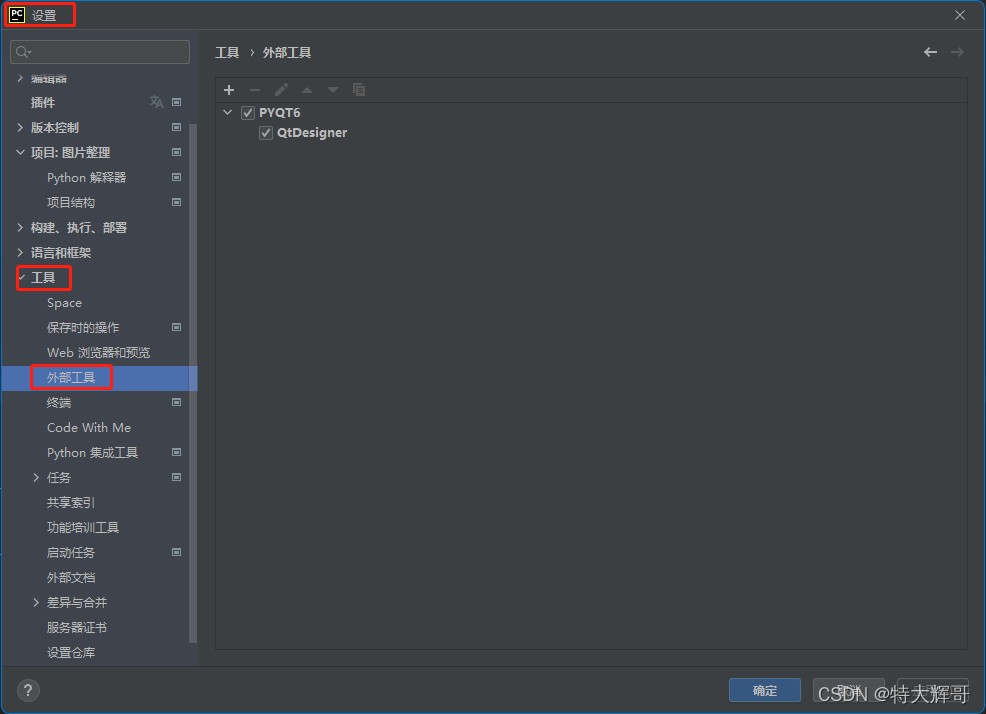
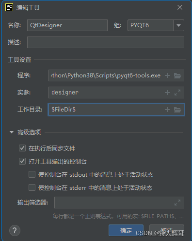
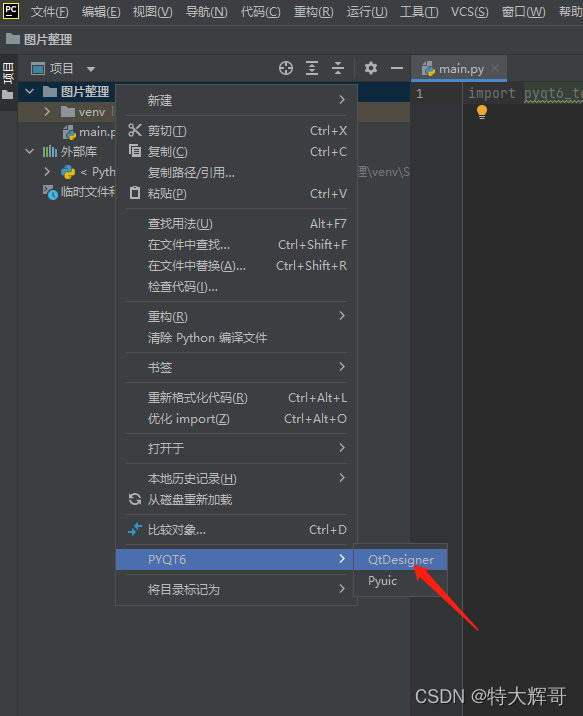
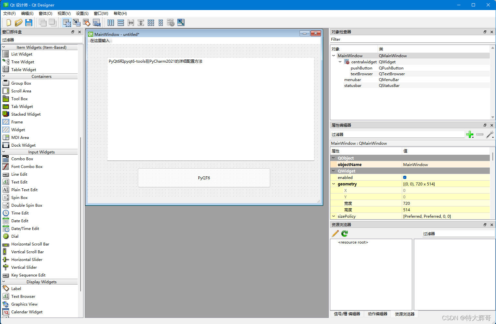
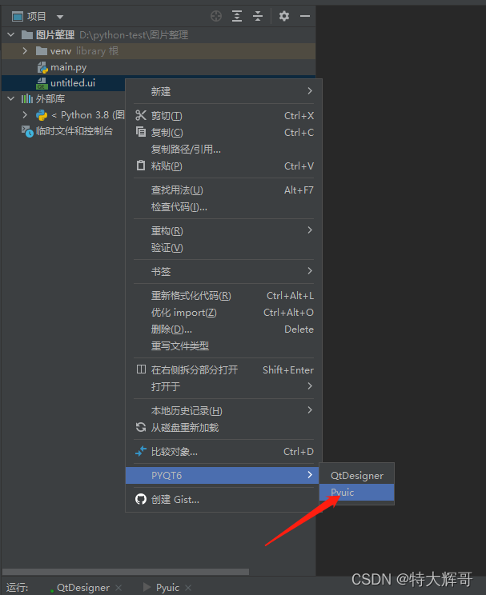
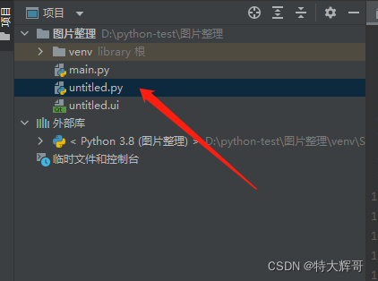
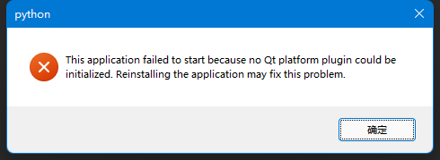
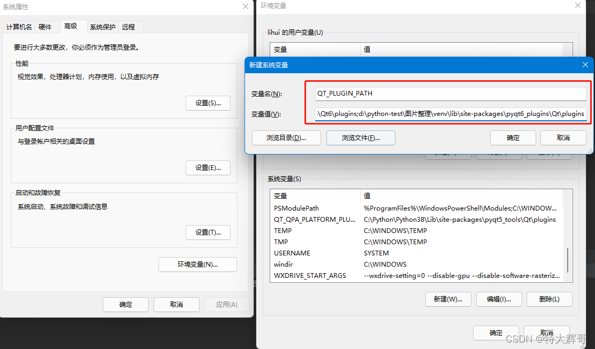
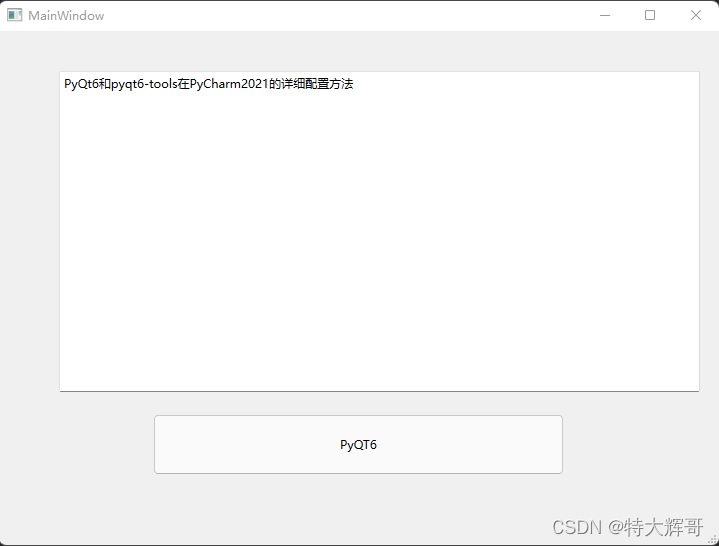

#PyQt6和pyqt6-tools在PyCharm2021的详细配置方法

剪辑自: https://blog.csdn.net/weixin_43439916/article/details/122221459

刚开始使用Pycharm，并不是太熟悉，PyQt6也是第一次使用，安装完以后却发现pyqt6-tools里没有Dsigner.exe，网上搜索半天，现在把详细配置过程记录下来。

# 1、安装PyQt6和pyqt6-tools
安装方法和之前没什么区别，可以在控制台输入：
~~~powershell
pip install PyQt6 PyQt6-tools
~~~
如果出现以下提示：
~~~powershell
WARNING: You are using pip version 21.1.2; however, version 21.3.1 is available.
You should consider upgrading via the 'c:\python\python38\python.exe -m pip install --upgrade pip' command.
~~~
则把绿色部分复制到控制台运行一下即可。

再次输入==pip install PyQt6 PyQt6-tools==，直到出现==Successfully installed== ，说明安装成功了。

可以用pip show + 包名显示详细信息。
~~~powershell
pip show PyQt6
~~~
和
~~~powershell
pip show pyqt6-tools
~~~

~~~powershell
Name: PyQt6
Version: 6.1.0
Summary: Python bindings for the Qt cross platform application toolkit
Home-page: https://www.riverbankcomputing.com/software/pyqt/
Author: Riverbank Computing Limited
Author-email: info@riverbankcomputing.com
License: GPL v3
Location: c:\python\python38\lib\site-packages
Requires: PyQt6-Qt6, PyQt6-sip
Required-by: pyqt6-plugins, pyqt6-tools
~~~

# 2、在Pycharm里配置Designer.exe
打开Pycharm，按快捷键Ctrl+Atl+S，打开设置界面，然后在工具选项里找到外部工具。

## 2.1、配置Designer.exe
点左上角的+号添加新工具，
名称：可以自定义，我填的QtDesigner
组：可以自定义，也可以默认，我填的PYQT6
描述：可填可不填
工具设置：
程序：填Python目录下的\Scripts\pyqt6-tools.exe
实参：这个要注意，必须填designer
工作目录：==\$FileDir$== 这个表示你在哪个文件夹打开的designer，生成的ui文件就在哪个文件夹。
点确定保存。

## 2.2 配置Pyuic
然后再次点左上角的+号添加Pyuic，这个是把designer生成的UI文件转化问py文件的工具。
名称：可以自定义，我填的Pyuic
组：可以自定义，也可以默认，我填的PYQT6
描述：可填可不填
工具设置：
程序：填Python目录下的\Scripts\pyuic6.exe
实参：注意，这里要填==\$FileName$ -o $FileNameWithoutExtension$.py==
工作目录：==\$FileDir$== # 生成的py文件和ui文件在同一目录。
点确定保存。

## 下面让我们测试一下
在项目文件夹上点右键，找到Designer

建一个窗口，拖一个文本框和一个按钮进去，保存成ui文件，因为测试，我使用的是默认名称untitled.ui。

在untitled.ui文件上点右键，找到Pyuic，

点击Pyuic后，将会生成一个和untitled.ui同名的untitled.py文件。

我们新建一个main.py文件，在文件里输入：
~~~python
import sys
from PyQt6.QtWidgets import QApplication, QMainWindow
from untitled import Ui_MainWindow

if __name__ == '__main__':
    app = QApplication(sys.argv)
    myw = QMainWindow()
    myWin = Ui_MainWindow().setupUi(myw)
    myw.show()
    sys.exit(app.exec())
~~~

~~~python
if __name__ == '__main__':
    import sys
    from PyQt5.QtWidgets import QApplication, QMainWindow
    import pics_ui_rc # 导入添加的资源（根据实际情况填写文件名）
    app = QApplication(sys.argv)
    MainWindow = QMainWindow()
    ui = Ui_MainWindow()
    ui.setupUi(MainWindow)
    MainWindow.show()
    sys.exit(app.exec_())
~~~

然后shift+F10运行，咔~！报错了！

网上搜了一下，这个错误是因为程序找不到plugins文件夹导致的，需要设置环境变量。
这时问题又来了，网上全是PyQt5的教程，在PyQt6已经失效了，但是这也难不住我，刚才designer已经可以运行，说明操作系统是可以找到plugins文件夹的，既然操作系统知道这个文件夹在哪，那么打开Powershell，cd到pyqt6-tools.exe所在的文件夹，运行命令：
~~~powershell
pyqt6-tools.exe designer
~~~
显示如下信息：
~~~powershell
PS D:\python-test\图片整理\venv\Scripts> .\pyqt6-tools.exe designer
DISPLAY is not set
LD_LIBRARY_PATH is not set
PYQTDESIGNERPATH: ;
PYTHONPATH: D:\python-test\图片整理\venv\Scripts\pyqt6-tools.exe;C:\Python\Python38\python38.zip;C:\Python\Python38\DLLs;C:\Python\Python38\lib;C:\Python\Python38;d:\python-test\图片整理\venv;d:\python-test\图片整理\venv\lib\site-packages;;PATH: D:\python-test\图片整理\venv\Scripts\pyqt6-tools.exe;C:\Python\Python38\python38.zip;C:\Python\Python38\DLLs;C:\Python\Python38\lib;C:\Python\Python38;d:\python-test\图片整理\venv;d:\python-test\图片整理\venv\lib\site-packages;;d:\python-test\图片整理\venv\lib\site-packages\PyQt6\Qt6\bin;C:\Program Files (x86)\Common Files\Oracle\Java\javapath;C:\Python\Python38\Scripts\;C:\Python\Python38\;C:\WINDOWS\system32;C:\WINDOWS;C:\WINDOWS\System32\Wbem;C:\WINDOWS\System32\WindowsPowerShell\v1.0\;C:\WINDOWS\System32\OpenSSH\;C:\Program Files\dotnet\;C:\Program Files\Microsoft SQL Server\130\Tools\Binn\;C:\Program Files\Microsoft SQL Server\Client SDK\ODBC\170\Tools\Binn\;C:\WINDOWS\system32;C:\WINDOWS;C:\WINDOWS\System32\Wbem;C:\WINDOWS\System32\WindowsPowerShell\v1.0\;C:\WINDOWS\System32\OpenSSH\;D:\Program Files\apache-maven-3.6.3\bin\;C:\Program Files (x86)\Java\jdk1.8.0_202\bin\;C:\Program Files (x86)\Java\jdk1.8.0_202\jre\bin\;C:\Program Files\Google\Chrome\Application;C:\Users\lihui\AppData\Local\Microsoft\WindowsApps;C:\Users\lihui\AppData\Local\Programs\Microsoft VS Code\bin;C:\Users\lihui\.dotnet\tools;C:\Program Files\JetBrains\PyCharm 2021.3\bin;C:\Program Files\JetBrains\PyCharm Community Edition 2021.3\bin;d:\python-test\图片整理\venv\Scripts;
QML2_IMPORT_PATH is not set
QT_DEBUG_PLUGINS is not set
QT_PLUGIN_PATH: ;D:\python-test\图片整理\venv\Lib\site-packages\PyQt6\Qt6\plugins;d:\python-test\图片整理\venv\lib\site-packages\pyqt6_plugins\Qt\plugins
~~~
我们看最后一行，QT_PLUGIN_PATH，带plugins单词，欧克，就用这个了！
打开我们熟悉的环境变量，把最后一行的变量名和两个值都复制进去。

确定x3，重启Pycharm，运行main.py文件，
奈斯！窗口出现了！

# 后记
网上搜教程的时候看到使用搜狗输入法，同时运行程序会出现一个错误
~~~powershell
libpng warning: iCCP: cHRM chunk does not match sRGB
~~~
只要切换输入法再运行就可以了。
十年没写过程序了，但是python是真的好玩！
在工作之余，多掌握几个工具，能极大提升工作效率，我现在已经在用python处理excel表格，节省了大量时间。
偶尔也会爬一些图片和小说。
娱乐工作两不误，哈哈！