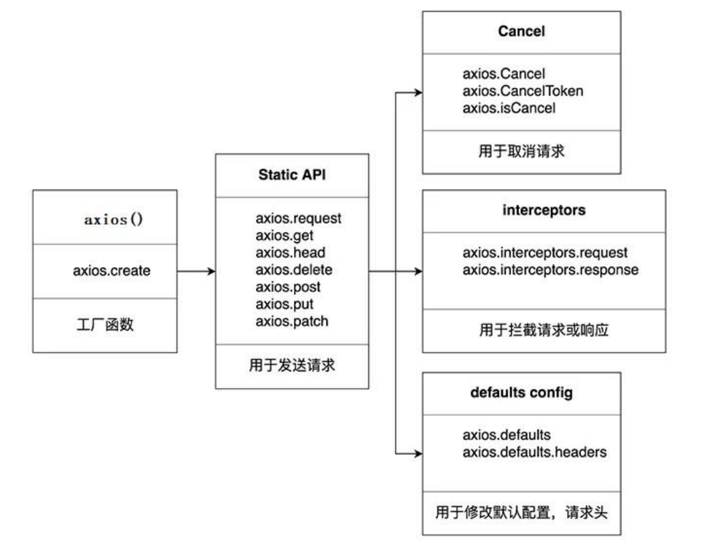
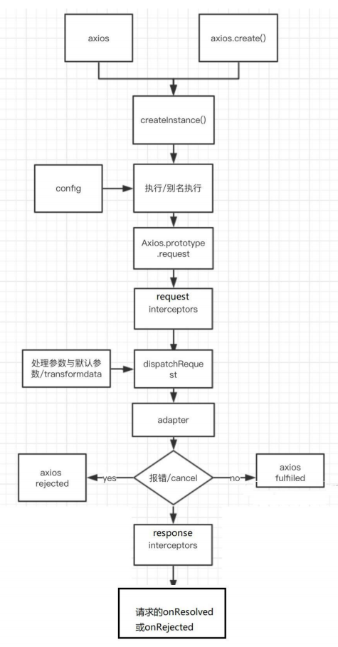
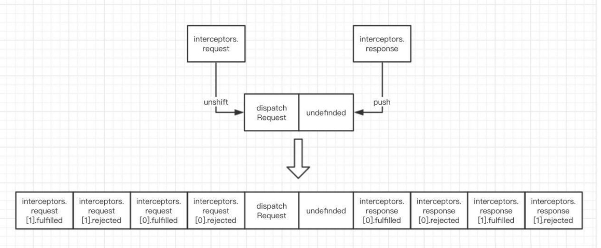

# Axios 学习笔记
---

# 第 1 章 axios 的理解和使用
---

## 1.1. axios 是什么?

1. 前端最流行的 ajax 请求库
2. react/vue 官方都推荐使用 axios 发 ajax 请求
3. 文档: [https://github.com/axios/axios](https://github.com/axios/axios)
4. Axios 中文文档：[https://www.axios-http.cn/](https://www.axios-http.cn/)

## 1.2. axios 特点

1. 基于 xhr + promise 的异步 ajax 请求库
2. 浏览器端/node 端都可以使用
3. 支持请求/响应拦截器
4. 支持请求取消
5. 请求/响应数据转换
6. 批量发送多个请求

## 1.3. axios 常用语法

- axios(config): 通用/最本质的发任意类型请求的方式
- axios(url[, config]): 可以只指定 url 发 get 请求
- axios.request(config): 等同于 axios(config)
- axios.get(url[, config]): 发 get 请求
- axios.delete(url[, config]): 发 delete 请求
- axios.post(url[, data, config]): 发 post 请求
- axios.put(url[, data, config]): 发 put 请求
- axios.defaults.xxx: 请求的默认全局配置
- axios.interceptors.request.use(): 添加请求拦截器
- axios.interceptors.response.use(): 添加响应拦截器
- axios.create([config]): 创建一个新的 axios(它没有下面的功能)
- axios.Cancel(): 用于创建取消请求的错误对象
- axios.CancelToken(): 用于创建取消请求的 token 对象
- axios.isCancel(): 是否是一个取消请求的错误
- axios.all(promises): 用于批量执行多个异步请求
- axios.spread(): 用来指定接收所有成功数据的回调函数的方法



## 1.4. 难点语法的理解和使用

### 1.4.1. axios.create(config) 

1. 根据指定配置创建一个新的 axios, 也就就每个新 axios 都有自己的配置
2. 新 axios 只是没有取消请求和批量发请求的方法, 其它所有语法都是一致的
3. 为什么要设计这个语法?
    - 需求: 项目中有部分接口需要的配置与另一部分接口需要的配置不太一样, 如何处理
    - 解决: 创建 2 个新 axios, 每个都有自己特有的配置, 分别应用到不同要求的接口请求中

**拦截器函数/ajax 请求/请求的回调函数的调用顺序**

1. 说明: 调用 axios()并不是立即发送 ajax 请求, 而是需要经历一个较长的流程
2. 流程: 请求拦截器2 => 请求拦截器1 => 发ajax请求 => 响应拦截器1 => 响
应拦截器 2 => 请求的回调
3. 注意: 此流程是通过 promise 串连起来的, 请求拦截器传递的是 config, 响应
拦截器传递的是 response

### 1.4.2. 取消请求

1. **基本流程**

- 配置 cancelToken 对象
- 缓存用于取消请求的 cancel 函数
- 在后面特定时机调用 cancel 函数取消请求
- 在错误回调中判断如果 error 是 cancel, 做相应处理

2. **实现功能**

- 点击按钮, 取消某个正在请求中的请求

# 第 2 章 axios 源码分析
---

## 2.1. 源码目录结构

```txt
├── /dist/ # 项目输出目录
├── /lib/ # 项目源码目录
│ ├── /adapters/ # 定义请求的适配器 xhr、http
│ │ ├── http.js # 实现 http 适配器(包装 http 包)
│ │ └── xhr.js # 实现 xhr 适配器(包装 xhr 对象)
│ ├── /cancel/ # 定义取消功能
│ ├── /core/ # 一些核心功能
│ │ ├── Axios.js # axios 的核心主类
│ │ ├── dispatchRequest.js # 用来调用 http 请求适配器方法发送请求的函数
│ │ ├── InterceptorManager.js # 拦截器的管理器
│ │ └── settle.js # 根据 http 响应状态，改变 Promise 的状态
│ ├── /helpers/ # 一些辅助方法
│ ├── axios.js # 对外暴露接口
│ ├── defaults.js # axios 的默认配置
│ └── utils.js # 公用工具
├── package.json # 项目信息
├── index.d.ts # 配置 TypeScript 的声明文件
└── index.js # 入口文件
```

## 2.2. 源码分析

### 2.2.1. axios 与 Axios 的关系 ?

1. 从语法上来说: axios 不是 Axios 的实例
2. 从功能上来说: axios 是 Axios 的实例
3. axios 是 Axios.prototype.request 函数 bind()返回的函数
4. axios 作为对象有 Axios 原型对象上的所有方法, 有 Axios 对象上所有属性

### 2.2.2. instance 与 axios 的区别?

1. **相同**: 

- 都是一个能发任意请求的函数: request(config)
- 都有发特定请求的各种方法: get() / post() / put() / delete()
- 都有默认配置和拦截器的属性: defaults / interceptors

2. **不同**:

- 默认配置很可能不一样
- instance 没有 axios 后面添加的一些方法: create() / CancelToken() / all()

### 2.2.3. axios 运行的整体流程?



1. 整体流程: 

- request(config) ==> dispatchRequest(config) ==> xhrAdapter(config)

2. request(config): 

- 将请求拦截器 / dispatchRequest() / 响应拦截器 通过 promise 链串连起来, 返回 promise

3. dispatchRequest(config): 

- 转换请求数据 ===> 调用 xhrAdapter()发请求 ===> 请求返回后转换响应数据. 返回 promise

4. xhrAdapter(config): 

- 创建 XHR 对象, 根据 config 进行相应设置, 发送特定请求, 并接收响应数据, 返回 promise 

### 2.2.4. axios 的请求/响应拦截器是什么?



1. **请求拦截器**: 

- 在真正发送请求前执行的回调函数
- 可以对请求进行检查或配置进行特定处理
- 成功的回调函数, 传递的默认是 config (也必须是)
- 失败的回调函数, 传递的默认是 error

2. **响应拦截器**:

- 在请求得到响应后执行的回调函数
- 可以对响应数据进行特定处理
- 成功的回调函数, 传递的默认是 response
- 失败的回调函数, 传递的默认是 error

### 2.2.5. axios 的请求/响应数据转换器是什么?

1. **请求转换器**: 对请求头和请求体数据进行特定处理的函数
    
    ```js
    if (utils.isObject(data)) {
        setContentTypeIfUnset(headers, 'application/json;charset=utf-8');
        return JSON.stringify(data);
    }
    ```

2. **响应转换器**: 将响应体 json 字符串解析为 js 对象或数组的函数

    ```js
    response.data = JSON.parse(response.data)
    ```

### 2.2.6. response 的整体结构

```js
{
    data,
    status,
    statusText,
    headers,
    config,
    request
 }
```

### 2.2.7. error 的整体结构

```js
{
    message,
    response,
    request,
}
```

### 2.2.8. 如何取消未完成的请求?

1. 当配置了 cancelToken 对象时, 保存 cancel 函数

- 创建一个用于将来中断请求的 cancelPromise
- 并定义了一个用于取消请求的 cancel 函数
- 将 cancel 函数传递出来

2. 调用 cancel() 取消请求

- 执行 cacel 函数, 传入错误信息 message
- 内部会让 cancelPromise 变为成功, 且成功的值为一个 Cancel 对象
- 在 cancelPromise 的成功回调中中断请求, 并让发请求的 proimse 失败, 失败的 reason 为 Cancel 对象

# Axios 使用
---

## Axios 配置

```html
<script src="https://cdn.bootcdn.net/ajax/libs/axios/0.21.1/axios.min.js"></script>
```

## Axios 基本使用

```html
<!doctype html>
<html lang="en">
<head>
    <meta charset="UTF-8">
    <meta name="viewport" content="width=device-width, user-scalable=no, initial-scale=1.0, maximum-scale=1.0, minimum-scale=1.0">
    <meta http-equiv="X-UA-Compatible" content="ie=edge">
    <title>axios基本使用</title>
    <link crossorigin="anonymous" href="https://cdn.bootcss.com/twitter-bootstrap/3.3.7/css/bootstrap.min.css" rel="stylesheet">
    <script src="https://cdn.bootcdn.net/ajax/libs/axios/0.21.1/axios.min.js"></script>
</head>
<body>
    <div class="container">
        <h2 class="page-header">基本使用</h2>
        <button class="btn btn-primary"> 发送GET请求 </button>
        <button class="btn btn-warning" > 发送POST请求 </button>
        <button class="btn btn-success"> 发送 PUT 请求 </button>
        <button class="btn btn-danger"> 发送 DELETE 请求 </button>
    </div>
    <script>
        // 获取按钮
        const btns = document.querySelectorAll('button');

        // 第一个
        btns[0].onclick = function(){
            // 发送 AJAX 请求
            axios({
                // 请求类型
                method: 'GET',
                // URL
                url: 'http://localhost:3000/posts/2',
            }).then(response => {
                console.log(response);
            });
        }

        // 添加一篇新的文章
        btns[1].onclick = function(){
            // 发送 AJAX 请求
            axios({
                // 请求类型
                method: 'POST',
                // URL
                url: 'http://localhost:3000/posts',
                // 设置请求体
                data: {
                    title: "今天天气不错, 还挺风和日丽的",
                    author: "张三"
                }
            }).then(response => {
                console.log(response);
            });
        }

        // 更新数据
        btns[2].onclick = function(){
            // 发送 AJAX 请求
            axios({
                // 请求类型
                method: 'PUT',
                // URL
                url: 'http://localhost:3000/posts/3',
                // 设置请求体
                data: {
                    title: "今天天气不错, 还挺风和日丽的",
                    author: "李四"
                }
            }).then(response => {
                console.log(response);
            });
        }

        // 删除数据
        btns[3].onclick = function(){
            // 发送 AJAX 请求
            axios({
                // 请求类型
                method: 'delete',
                // URL
                url: 'http://localhost:3000/posts/3',
            }).then(response => {
                console.log(response);
            });
        }
    </script>
</body>
</html>
```

## Axios 其他方式发送请求

```js
// 发送 GET 请求
btns[0].onclick = function(){
    // axios()
    axios.request({
        method:'GET',
        url: 'http://localhost:3000/comments'
    }).then(response => {
        console.log(response);
    })
}

// 发送 POST 请求
btns[1].onclick = function(){
    // axios()
    axios.post(
        'http://localhost:3000/comments', 
        {
            "body": "喜大普奔",
            "postId": 2
        }).then(response => {
            console.log(response);
        })
}
```

## Axios 配置对象详细说明

这些是创建请求时可以用的配置选项。只有 `url` 是必需的。如果没有指定 `method`，请求将默认使用 `GET` 方法。

```js
{
  // `url` 是用于请求的服务器 URL
  url: '/user',

  // `method` 是创建请求时使用的方法
  method: 'get', // 默认值

  // `baseURL` 将自动加在 `url` 前面，除非 `url` 是一个绝对 URL。
  // 它可以通过设置一个 `baseURL` 便于为 axios 实例的方法传递相对 URL
  baseURL: 'https://some-domain.com/api/',

  // `transformRequest` 允许在向服务器发送前，修改请求数据
  // 它只能用于 'PUT', 'POST' 和 'PATCH' 这几个请求方法
  // 数组中最后一个函数必须返回一个字符串， 一个Buffer实例，ArrayBuffer，FormData，或 Stream
  // 你可以修改请求头。
  transformRequest: [function (data, headers) {
    // 对发送的 data 进行任意转换处理

    return data;
  }],

  // `transformResponse` 在传递给 then/catch 前，允许修改响应数据
  transformResponse: [function (data) {
    // 对接收的 data 进行任意转换处理

    return data;
  }],

  // 自定义请求头
  headers: {'X-Requested-With': 'XMLHttpRequest'},

  // `params` 是与请求一起发送的 URL 参数
  // 必须是一个简单对象或 URLSearchParams 对象
  params: {
    ID: 12345
  },

  // `paramsSerializer`是可选方法，主要用于序列化`params`
  // (e.g. https://www.npmjs.com/package/qs, http://api.jquery.com/jquery.param/)
  paramsSerializer: function (params) {
    return Qs.stringify(params, {arrayFormat: 'brackets'})
  },

  // `data` 是作为请求体被发送的数据
  // 仅适用 'PUT', 'POST', 'DELETE 和 'PATCH' 请求方法
  // 在没有设置 `transformRequest` 时，则必须是以下类型之一:
  // - string, plain object, ArrayBuffer, ArrayBufferView, URLSearchParams
  // - 浏览器专属: FormData, File, Blob
  // - Node 专属: Stream, Buffer
  data: {
    firstName: 'Fred'
  },
  
  // 发送请求体数据的可选语法
  // 请求方式 post
  // 只有 value 会被发送，key 则不会
  data: 'Country=Brasil&City=Belo Horizonte',

  // `timeout` 指定请求超时的毫秒数。
  // 如果请求时间超过 `timeout` 的值，则请求会被中断
  timeout: 1000, // 默认值是 `0` (永不超时)

  // `withCredentials` 表示跨域请求时是否需要使用凭证
  withCredentials: false, // default

  // `adapter` 允许自定义处理请求，这使测试更加容易。
  // 返回一个 promise 并提供一个有效的响应 （参见 lib/adapters/README.md）。
  adapter: function (config) {
    /* ... */
  },

  // `auth` HTTP Basic Auth 基础验证
  auth: {
    username: 'janedoe',
    password: 's00pers3cret'
  },

  // `responseType` 表示浏览器将要响应的数据类型
  // 选项包括: 'arraybuffer', 'document', 'json', 'text', 'stream'
  // 浏览器专属：'blob'
  responseType: 'json', // 默认值

  // `responseEncoding` 表示用于解码响应的编码 (Node.js 专属)
  // 注意：忽略 `responseType` 的值为 'stream'，或者是客户端请求
  // Note: Ignored for `responseType` of 'stream' or client-side requests
  responseEncoding: 'utf8', // 默认值

  // `xsrfCookieName` 是 xsrf token 的值，被用作 cookie 的名称
  xsrfCookieName: 'XSRF-TOKEN', // 默认值

  // `xsrfHeaderName` 是带有 xsrf token 值的http 请求头名称
  xsrfHeaderName: 'X-XSRF-TOKEN', // 默认值

  // `onUploadProgress` 允许为上传处理进度事件
  // 浏览器专属
  onUploadProgress: function (progressEvent) {
    // 处理原生进度事件
  },

  // `onDownloadProgress` 允许为下载处理进度事件
  // 浏览器专属
  onDownloadProgress: function (progressEvent) {
    // 处理原生进度事件
  },

  // `maxContentLength` 定义了node.js中允许的HTTP响应内容的最大字节数
  maxContentLength: 2000,

  // `maxBodyLength`（仅Node）定义允许的http请求内容的最大字节数
  maxBodyLength: 2000,

  // `validateStatus` 定义了对于给定的 HTTP状态码是 resolve 还是 reject promise。
  // 如果 `validateStatus` 返回 `true` (或者设置为 `null` 或 `undefined`)，
  // 则promise 将会 resolved，否则是 rejected。
  validateStatus: function (status) {
    return status >= 200 && status < 300; // 默认值
  },

  // `maxRedirects` 定义了在node.js中要遵循的最大重定向数。
  // 如果设置为0，则不会进行重定向
  maxRedirects: 5, // 默认值

  // `socketPath` 定义了在node.js中使用的UNIX套接字。
  // e.g. '/var/run/docker.sock' 发送请求到 docker 守护进程。
  // 只能指定 `socketPath` 或 `proxy` 。
  // 若都指定，这使用 `socketPath` 。
  socketPath: null, // default

  // `httpAgent` and `httpsAgent` define a custom agent to be used when performing http
  // and https requests, respectively, in node.js. This allows options to be added like
  // `keepAlive` that are not enabled by default.
  httpAgent: new http.Agent({ keepAlive: true }),
  httpsAgent: new https.Agent({ keepAlive: true }),

  // `proxy` 定义了代理服务器的主机名，端口和协议。
  // 您可以使用常规的`http_proxy` 和 `https_proxy` 环境变量。
  // 使用 `false` 可以禁用代理功能，同时环境变量也会被忽略。
  // `auth`表示应使用HTTP Basic auth连接到代理，并且提供凭据。
  // 这将设置一个 `Proxy-Authorization` 请求头，它会覆盖 `headers` 中已存在的自定义 `Proxy-Authorization` 请求头。
  // 如果代理服务器使用 HTTPS，则必须设置 protocol 为`https`
  proxy: {
    protocol: 'https',
    host: '127.0.0.1',
    port: 9000,
    auth: {
      username: 'mikeymike',
      password: 'rapunz3l'
    }
  },

  // see https://axios-http.com/zh/docs/cancellation
  cancelToken: new CancelToken(function (cancel) {
  }),

  // `decompress` indicates whether or not the response body should be decompressed 
  // automatically. If set to `true` will also remove the 'content-encoding' header 
  // from the responses objects of all decompressed responses
  // - Node only (XHR cannot turn off decompression)
  decompress: true // 默认值
}
```

## Axios 默认配置

```js
//获取按钮
const btns = document.querySelectorAll('button');
//默认配置
axios.defaults.method = 'GET';//设置默认的请求类型为 GET
axios.defaults.baseURL = 'http://localhost:3000';//设置基础 URL
axios.defaults.params = {id:100};
axios.defaults.timeout = 3000;//

btns[0].onclick = function(){
    axios({
        url: '/posts'
    }).then(response => {
        console.log(response);
    })
}
```

## Axios 创建实例对象

```js
//获取按钮
const btns = document.querySelectorAll('button');

//创建实例对象  /getJoke
const duanzi = axios.create({
    baseURL: 'https://api.apiopen.top',
    timeout: 2000
});

const onather = axios.create({
    baseURL: 'https://b.com',
    timeout: 2000
});

//这里  duanzi 与 axios 对象的功能几近是一样的
// duanzi({
//     url: '/getJoke',
// }).then(response => {
//     console.log(response);
// });

duanzi.get('/getJoke').then(response => {
    console.log(response.data)
})
```

## Axios 拦截器

在请求或响应被 `then` 或 `catch` 处理前拦截它们。

```js
// 添加请求拦截器
axios.interceptors.request.use(function (config) {
    // 在发送请求之前做些什么
    return config;
  }, function (error) {
    // 对请求错误做些什么
    return Promise.reject(error);
  });

// 添加响应拦截器
axios.interceptors.response.use(function (response) {
    // 2xx 范围内的状态码都会触发该函数。
    // 对响应数据做点什么
    return response;
  }, function (error) {
    // 超出 2xx 范围的状态码都会触发该函数。
    // 对响应错误做点什么
    return Promise.reject(error);
  });
```

如果你稍后需要移除拦截器，可以这样：

```js
const myInterceptor = axios.interceptors.request.use(function () {/*...*/});
axios.interceptors.request.eject(myInterceptor);
```

可以给自定义的 axios 实例添加拦截器。

```js
const instance = axios.create();
instance.interceptors.request.use(function () {/*...*/});
```

---

```js
// Promise
// 设置请求拦截器  config 配置对象
axios.interceptors.request.use(function (config) {
    console.log('请求拦截器 成功 - 1号');
    //修改 config 中的参数
    config.params = {a:100};
    return config;
}, function (error) {
    console.log('请求拦截器 失败 - 1号');
    return Promise.reject(error);
});

axios.interceptors.request.use(function (config) {
    console.log('请求拦截器 成功 - 2号');
    //修改 config 中的参数
    config.timeout = 2000;
    return config;
}, function (error) {
    console.log('请求拦截器 失败 - 2号');
    return Promise.reject(error);
});

// 设置响应拦截器
axios.interceptors.response.use(function (response) {
    console.log('响应拦截器 成功 1号');
    return response.data;
    // return response;
}, function (error) {
    console.log('响应拦截器 失败 1号')
    return Promise.reject(error);
});

axios.interceptors.response.use(function (response) {
    console.log('响应拦截器 成功 2号')
    return response;
}, function (error) {
    console.log('响应拦截器 失败 2号')
    return Promise.reject(error);
});

//发送请求
axios({
    method: 'GET',
    url: 'http://localhost:3000/posts'
}).then(response => {
    console.log('自定义回调处理成功的结果');
    console.log(response);
}).catch(reason => {
    console.log('自定义失败回调');
});
```

## Axios 取消请求

### AbortController

从 `v0.22.0` 开始，Axios 支持以 fetch API 方式—— `AbortController` 取消请求：

```js
const controller = new AbortController();

axios.get('/foo/bar', {
   signal: controller.signal
}).then(function(response) {
   //...
});
// 取消请求
controller.abort()
```

### CancelToken

还可以使用 `cancel token` 取消一个请求。

- Axios 的 cancel token API 是基于被撤销 cancelable promises proposal。
- 此 API 从 v0.22.0 开始已被==弃用==，不应在新项目中使用。

可以使用 `CancelToken.source` 工厂方法创建一个 cancel token ，如下所示：

```js
const CancelToken = axios.CancelToken;
const source = CancelToken.source();

axios.get('/user/12345', {
  cancelToken: source.token
}).catch(function (thrown) {
  if (axios.isCancel(thrown)) {
    console.log('Request canceled', thrown.message);
  } else {
    // 处理错误
  }
});

axios.post('/user/12345', {
  name: 'new name'
}, {
  cancelToken: source.token
})

// 取消请求（message 参数是可选的）
source.cancel('Operation canceled by the user.');
```

也可以通过传递一个 executor 函数到 `CancelToken` 的构造函数来创建一个 cancel token：

```js
const CancelToken = axios.CancelToken;
let cancel;

axios.get('/user/12345', {
  cancelToken: new CancelToken(function executor(c) {
    // executor 函数接收一个 cancel 函数作为参数
    cancel = c;
  })
});

// 取消请求
cancel();
```

注意: 可以使用同一个 cancel token 或 signal 取消多个请求。

在过渡期间，您可以使用这两种取消 API，即使是针对同一个请求：

```js
const controller = new AbortController();

const CancelToken = axios.CancelToken;
const source = CancelToken.source();

axios.get('/user/12345', {
  cancelToken: source.token,
  signal: controller.signal
}).catch(function (thrown) {
  if (axios.isCancel(thrown)) {
    console.log('Request canceled', thrown.message);
  } else {
    // 处理错误
  }
});

axios.post('/user/12345', {
  name: 'new name'
}, {
  cancelToken: source.token
})

// 取消请求 (message 参数是可选的)
source.cancel('Operation canceled by the user.');
// 或
controller.abort(); // 不支持 message 参数
```

---

```js
// 获取按钮
const btns = document.querySelectorAll('button');
// 2.声明全局变量
let cancel = null;
// 发送请求
btns[0].onclick = function(){
    // 检测上一次的请求是否已经完成
    if(cancel !== null){
        // 取消上一次的请求
        cancel();
    }
    axios({
        method: 'GET',
        url: 'http://localhost:3000/posts',
        // 1. 添加配置对象的属性
        cancelToken: new axios.CancelToken(function(c){
            // 3. 将 c 的值赋值给 cancel
            cancel = c;
        })
    }).then(response => {
        console.log(response);
        //将 cancel 的值初始化
        cancel = null;
    })
}

// 绑定第二个事件取消请求
btns[1].onclick = function(){
    cancel();
}
```

# Axios 源码分析

## Axios 对象创建过程实现

```js
//构造函数
function Axios(config){
    //初始化
    this.defaults = config;//为了创建 default 默认属性
    this.intercepters = {
        request: {},
        response: {}
    }
}
//原型添加相关的方法
Axios.prototype.request = function(config){
    console.log('发送 AJAX 请求 请求的类型为 '+ config.method);
}
Axios.prototype.get = function(config){
    return this.request({method: 'GET'});
}
Axios.prototype.post = function(config){
    return this.request({method: 'POST'});
}

//声明函数
function createInstance(config){
    //实例化一个对象
    let context = new Axios(config);// context.get()  context.post()  但是不能当做函数使用 context() X
    //创建请求函数
    let instance = Axios.prototype.request.bind(context);// instance 是一个函数 并且可以 instance({})  此时 instance 不能 instance.get X
    //将 Axios.prototype 对象中的方法添加到instance函数对象中
    Object.keys(Axios.prototype).forEach(key => {
        instance[key] = Axios.prototype[key].bind(context);// this.default  this.interceptors
    });
    //为 instance 函数对象添加属性 default 与 interceptors
    Object.keys(context).forEach(key => {
        instance[key] = context[key];
    });
    return instance;
}

let axios = createInstance();
//发送请求
// axios({method:'POST'});
axios.get({});
axios.post({});
```

## Axios 发送请求实现

```js
// axios 发送请求   axios  Axios.prototype.request  bind
//1. 声明构造函数
function Axios(config){
    this.config = config;
}
Axios.prototype.request = function(config){
    //发送请求
    //创建一个 promise 对象
    let promise = Promise.resolve(config);
    //声明一个数组
    let chains = [dispatchRequest, undefined];// undefined 占位
    //调用 then 方法指定回调
    let result = promise.then(chains[0], chains[1]);
    //返回 promise 的结果
    return result;
}

//2. dispatchRequest 函数
function dispatchRequest(config){
    //调用适配器发送请求
    return xhrAdapter(config).then(response => {
        //响应的结果进行转换处理
        //....
        return response;
    }, error => {
        throw error;
    });
}

//3. adapter 适配器
function xhrAdapter(config){
    console.log('xhrAdapter 函数执行');
    return new Promise((resolve, reject) => {
        //发送 AJAX 请求
        let xhr = new XMLHttpRequest();
        //初始化
        xhr.open(config.method, config.url);
        //发送
        xhr.send();
        //绑定事件
        xhr.onreadystatechange = function(){
            if(xhr.readyState === 4){
                //判断成功的条件
                if(xhr.status >= 200 && xhr.status < 300){
                    //成功的状态
                    resolve({
                        //配置对象
                        config: config,
                        //响应体
                        data: xhr.response,
                        //响应头
                        headers: xhr.getAllResponseHeaders(), //字符串  parseHeaders
                        // xhr 请求对象
                        request: xhr,
                        //响应状态码
                        status: xhr.status,
                        //响应状态字符串
                        statusText: xhr.statusText
                    });
                }else{
                    //失败的状态
                    reject(new Error('请求失败 失败的状态码为' + xhr.status));
                }
            }
        }
    });
}


//4. 创建 axios 函数
let axios = Axios.prototype.request.bind(null);
axios({
    method:'GET',
    url:'http://localhost:3000/posts'
}).then(response => {
    console.log(response);
});
```

## Axios 拦截器模拟实现

```js
//构造函数
function Axios(config){
    this.config = config;
    this.interceptors = {
        request: new InterceptorManager(),
        response: new InterceptorManager(),
    }
}
//发送请求  难点与重点
Axios.prototype.request = function(config){
    //创建一个 promise 对象
    let promise = Promise.resolve(config);
    //创建一个数组
    const chains = [dispatchRequest, undefined];
    //处理拦截器
    //请求拦截器 将请求拦截器的回调 压入到 chains 的前面  request.handles = []
    this.interceptors.request.handlers.forEach(item => {
        chains.unshift(item.fulfilled, item.rejected);
    });
    //响应拦截器
    this.interceptors.response.handlers.forEach(item => {
        chains.push(item.fulfilled, item.rejected);
    });

    // console.log(chains);
    //遍历
    while(chains.length > 0){
        promise = promise.then(chains.shift(), chains.shift());
    }

    return promise;
}

//发送请求
function dispatchRequest(config){
    //返回一个promise 队形
    return new Promise((resolve, reject) => {
        resolve({
            status: 200,
            statusText: 'OK'
        });
    });
}

//创建实例
let context = new Axios({});
//创建axios函数
let axios = Axios.prototype.request.bind(context);
//将 context 属性 config interceptors 添加至 axios 函数对象身上
Object.keys(context).forEach(key => {
    axios[key] = context[key];
});

//拦截器管理器构造函数
function InterceptorManager(){
    this.handlers = [];
}
InterceptorManager.prototype.use = function(fulfilled, rejected){
    this.handlers.push({
        fulfilled,
        rejected
    })
}


//以下为功能测试代码
// 设置请求拦截器  config 配置对象
axios.interceptors.request.use(function one(config) {
    console.log('请求拦截器 成功 - 1号');
    return config;
}, function one(error) {
    console.log('请求拦截器 失败 - 1号');
    return Promise.reject(error);
});

axios.interceptors.request.use(function two(config) {
    console.log('请求拦截器 成功 - 2号');
    return config;
}, function two(error) {
    console.log('请求拦截器 失败 - 2号');
    return Promise.reject(error);
});

// 设置响应拦截器
axios.interceptors.response.use(function (response) {
    console.log('响应拦截器 成功 1号');
    return response;
}, function (error) {
    console.log('响应拦截器 失败 1号')
    return Promise.reject(error);
});

axios.interceptors.response.use(function (response) {
    console.log('响应拦截器 成功 2号')
    return response;
}, function (error) {
    console.log('响应拦截器 失败 2号')
    return Promise.reject(error);
});


//发送请求
axios({
    method: 'GET',
    url: 'http://localhost:3000/posts'
}).then(response => {
    console.log(response);
});
```

## Axios 取消请求功能模拟实现

```js
//构造函数
function Axios(config){
    this.config = config;
}
//原型 request 方法
Axios.prototype.request = function(config){
    return dispatchRequest(config);
}
//dispatchRequest 函数
function dispatchRequest(config){
    return xhrAdapter(config);
}
//xhrAdapter
function xhrAdapter(config){
    //发送 AJAX 请求
    return new Promise((resolve, reject) => {
        //实例化对象
        const xhr = new XMLHttpRequest();
        //初始化
        xhr.open(config.method, config.url);
        //发送
        xhr.send();
        //处理结果
        xhr.onreadystatechange = function(){
            if(xhr.readyState === 4){
                //判断结果
                if(xhr.status >= 200 && xhr.status < 300){
                    //设置为成功的状态
                    resolve({
                        status: xhr.status,
                        statusText: xhr.statusText
                    });
                }else{
                    reject(new Error('请求失败'));
                }
            }
        }
        //关于取消请求的处理
        if(config.cancelToken){
            //对 cancelToken 对象身上的 promise 对象指定成功的回调
            config.cancelToken.promise.then(value => {
                xhr.abort();
                //将整体结果设置为失败
                reject(new Error('请求已经被取消'))
            });
        }
    })
}

//创建 axios 函数
const context = new Axios({});
const axios = Axios.prototype.request.bind(context);

//CancelToken 构造函数
function CancelToken(executor){
    //声明一个变量
    var resolvePromise;
    //为实例对象添加属性
    this.promise = new Promise((resolve) => {
        //将 resolve 赋值给 resolvePromise
        resolvePromise = resolve
    });
    //调用 executor 函数
    executor(function(){
        //执行 resolvePromise 函数
        resolvePromise();
    });
}

//获取按钮 以上为模拟实现的代码
const btns = document.querySelectorAll('button');
//2.声明全局变量
let cancel = null;
//发送请求
btns[0].onclick = function(){
    //检测上一次的请求是否已经完成
    if(cancel !== null){
        //取消上一次的请求
        cancel();
    }

    //创建 cancelToken 的值
    let cancelToken = new CancelToken(function(c){
        cancel = c;
    });

    axios({
        method: 'GET',
        url: 'http://localhost:3000/posts',
        //1. 添加配置对象的属性
        cancelToken: cancelToken
    }).then(response => {
        console.log(response);
        //将 cancel 的值初始化
        cancel = null;
    })
}

//绑定第二个事件取消请求
btns[1].onclick = function(){
    cancel();
}
```