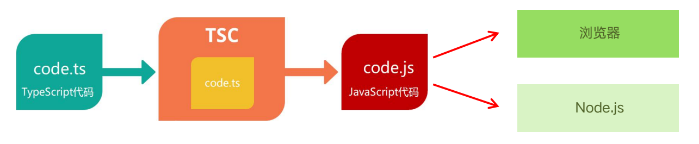
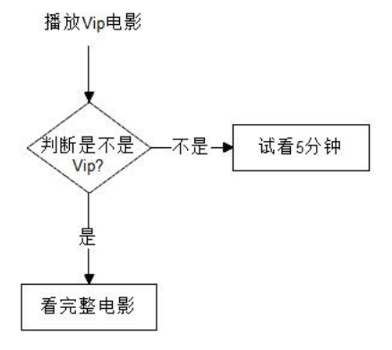
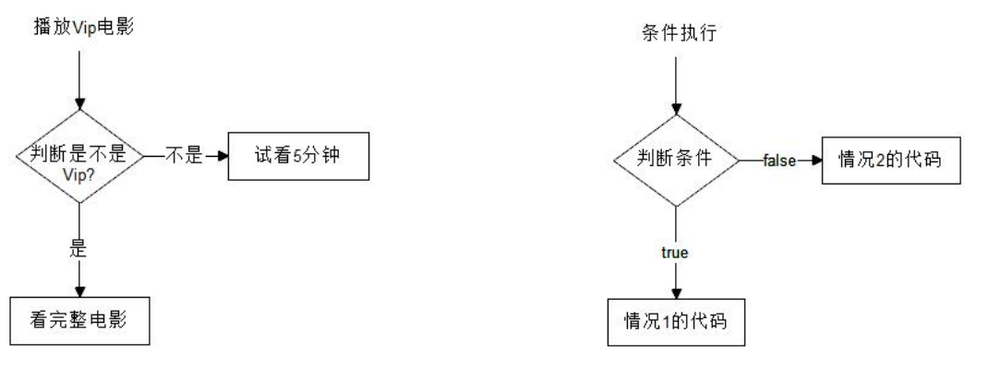
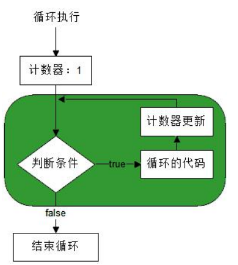
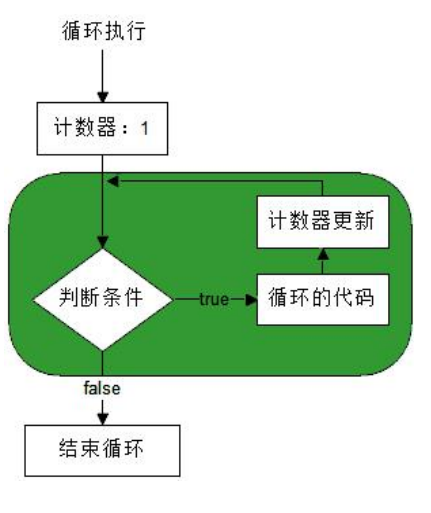
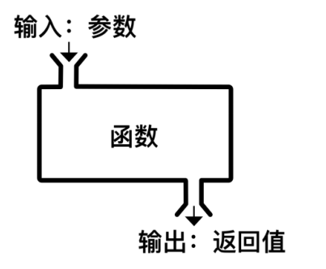
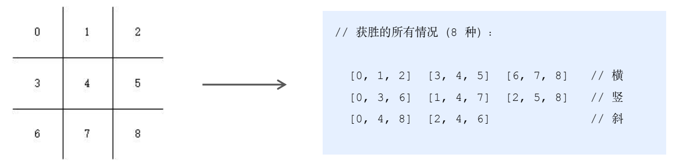

# TypeScript 学习笔记

---

# 第一章 TypeScript 初体验

---

## 1. TypeScript 概述

- JavaScript 是什么
- TypeScript 是什么
- TypeScript 相比 JavaScript 的优势

### 1.1 JavaScript 是什么

**JavaScript**（缩写：JS）是一种运行在客户端（比如：浏览器）中的编程语言。

当应用于浏览器时，为网站提供动态交互特性，**让网页“动”起来**。

JavaScript 的运行环境：

1. 浏览器 
2. Node.js

Node.js 让 JavaScript 摆脱了浏览器的束缚，可以实现服务端/桌面端编程等。

**其他**： 微信小程序、微信小游戏 等等。

**总结**：JavaScript 既能运行在 **浏览器** 中，也可以运行在 **Node.js** 中，前后端通吃，无所不能。

### 1.2 TypeScript 是什么

==TypeScript==（简称：TS）是 JavaScript 的==超集==（JS 有的 TS 都有）。

TypeScript = **Type** + JavaScript（为 JS 添加了==类型系统==）。

TypeScript 是**微软**开发的开源编程语言，设计目标是==开发大型应用==。可以在任何浏览器、任何计算机、任何操作系统上运行。

### 1.3 TypeScript 相比 JS 的优势

JS 的类型系统存在“先天缺陷” ，绝大部分错误都是类型错误（ Uncaught TypeError ）。

- 优势一：==类型化思维方式==，使得开发更加严谨，提前发现错误，==减少改 Bug 时间==。
- 优势二：类型系统提高了代码可读性，并使==维护和重构代码更加容易==。
- 优势三：==补充==了接口、枚举等开发大型应用时 ==JS 缺失的功能==。
- Vue 3 源码使用 TS 重写，释放出重要信号：TS 是趋势。
- Angular 默认支持 TS；React 与 TS 完美配合，是很多大型项目的首选。

## 2. 开发工具准备

### 2.1 开发工具介绍

1. 写代码的工具：Visual Studio Code（简称：VSCode），微软开发的代码编辑工具。

2. 运行 TS / JS 代码的工具：Node.js，一个基于 Chrome 浏览器 V8 解析引擎的 JavaScript 运行环境。
- 说明：本课程中，TypeScript 基础知识，使用 Node.js 来运行。

### 2.2 安装 VSCode

1. 按照步骤引导安装即可。
2. 安装中文汉化插件：Chinese (Simplified) Language Pack for Visual Studio Code
3. 点击右下角弹出的对话框，重启（Restart）VSCode。

### 2.3 安装 Node.js

1. 按照步骤引导安装即可。
2. 在终端（黑窗口）中输入：`node --version`，验证是否安装成功（注意：需要重启VSCode）。
3. 如果打印出版本信息说明安装成功。

### 2.4 安装解析 TS 的工具包

**问题**：为什么要安装这个工具包？

**答案**：

- Node.js/浏览器，只认识 JS 代码，不认识 TS 代码。
- 需要先将 TS 代码转化为 JS，然后就可以在 Node.js/浏览器中运行了。

**安装步骤**：

1. 打开 VSCode 终端。
2. 输入安装命令： npm i -g typescript 敲回车，来安装（注意：需要联网）。

==typescript==：就是用来解析 TS 的工具包。提供了 tsc 命令，实现了 TS -> JS 的转化。

==npm==：用来安装前端开发中用到的包，是安装 Node.js 时自动安装的。

==i==（install）：表示安装。

==-g==（--global）：全局标识，可以在任意目录中使用该工具。



## 3. 第一个 TS 文件

### 3.1 步骤


1. 创建ts文件：
   
   - 在桌面中创建文件夹：code。
   - 在文件夹上点击鼠标右键，然后点击 Open With Code（用VSCode打开文件夹）。
   - 在 VSCode 中新建ts文件：hello==.ts==（注意：==文件后缀名为 .ts==）。

2. 写代码：在 hello.ts 文件中，写入以下代码，并保存。
   
   ```ts
    console.log('Hello TS')
   ```

问题1：TS 代码能直接在 Node.js 里面运行吗？  ==不能==

问题2：该如何处理呢？  ==1 TS代码 -> JS代码   2 执行 JS==

3. 执行代码，分两步：
   
   1. TS代码 -> JS代码：在当前目录打开终端，输入命令 tsc hello.ts 敲回车。
   2. 执行JS：输入命令 node hello.js（注意：后缀为 .js）。

**解释**：

- `tsc hello.ts` 会生成一个 hello.js 文件。
- `node hello.js` 表示执行这个 JS 文件中的代码。

### 3.2 简化执行TS的步骤

**问题**：每次修改代码后，都要重复执行两个命令才能执行 TS 代码，太繁琐。

**执行 TS 代码的两个步骤**：

1. tsc hello.ts
2. node hello.js

**简化方式**：使用 `ts-node` 包，“直接”在 Node.js 中执行 TS 代码。

- 安装命令：`npm i –g ts-node`。
- 使用方式：`ts-node hello.ts`。

**解释**：

- ts-node 包内部偷偷的将 TS -> JS，然后，执行 JS 代码。
- ts-node 包提供了命令 `ts-node`，用来执行 TS 代码。

现在只需一步：

```sh
ts-node hello.ts
```

## 4. 注释和输出语句

### 4.1 注释

==注释是对代码的解释说明==，用来帮助阅读和理解代码。

**注意**：注释的内容是不会执行的。

推荐在写代码时，添加代码注释，增加代码的可读性。

**注释有两种形式**：

1. 单行注释 
2. 多行注释。

形式一：单行注释

```ts
// 两个斜线，表示单行注释，只能注释这一行内容
// 这是第二行注释
// 快捷键：ctrl + /
```

形式二：多行注释

```ts
/*这是多行注释
可以注释多行内容
快捷键：shift + alt + a */
```

### 4.2 输出语句

**作用**：在终端（黑窗口）中打印信息。

Node.js 会执行我们写的代码，为了能够知道代码执行的结果，就需要使用输出语句，将结果打印出来。

```ts
console.log('Hello TS')
```

**解释**：

- console 表示控制台，在 Node.js 中，指的是终端（黑窗口）。
- 小括号中的内容，表示要打印的信息。

### 总结

1. TypeScript 是 JS 的==超集==，为 JS 添加了==类型系统==。相比 JS，开发体验更友好，==提前发现错误==，Bug更少，增加开发的幸福度。
2. JavaScript 的两个运行环境是什么？  1 浏览器 2 Node.js
3. TypeScript 能直接在浏览器或 Node.js 中执行吗？  不能
4. 如何将 ts 编译为 js？  tsc hello.ts -> hello.js
5. 如何简化执行 ts 代码？  ts-node hello.ts
6. 代码注释有哪两种？  1 单行注释 2 多行注释
7. 在控制台打印信息的代码是什么？  console.log()

# 第二章 变量和数据类型

---

## 1. 什么是变量

通俗的讲：变量，是用来==存储数据的容器==，并且是可以==变化==的。

## 2. 变量的使用

### 2.1 基本使用

变量的使用分为两步：1 声明变量并指定类型 2 给变量赋值。

第一步：声明变量并指定类型

```ts
let age: number;
```

**解释**：

- let 是 TS 的关键字，用来声明变量。
- age 是程序员自己定义的变量名称。
- : number 用来指定变量 age 为数值类型。
- 注意：分号是可选的，可省略。

第二步：给变量赋值

```ts
age = 18
```

**解释**：

- 使用==等号（=）==来给变量 age 赋值

### 2.2 简化形式

- 声明变量的同时就赋值（变量的初始化）：

```ts
let age: number = 18
```

### 变量的使用总结

变量的两种使用方式：1 先声明后赋值 2 声明的同时并赋值（推荐）

- 第一种：先声明后赋值

```ts
// 1 声明变量并指定类型
let age: number
// 2 赋值
age = 18
```

- 第二种：声明的同时并赋值（推荐）

```ts
let age: number = 18
```

注意：声明变量的时候要==指定变量的类型==。

## 3. 类型注解

### 3.1 什么是类型注解

**示例代码**：

```ts
let age: number = 18
```

代码中的 : `number` 就是类型注解。

### 3.2 作用

==类型注解==：是一种==为变量添加类型约束==的方式。

**重要**：==约定了什么类型，就只能给变量赋什么类型的值==。

```ts
// × 错误演示
age = 'Hello TS'
```

**额外说明**：VSCode 中代码下方的红色波浪线表示代码报错，出 Bug 了。

## 4. 命名规则和规范

### 4.1 变量的命名规则

变量名称只能出现：==数字、字母、下划线（_）、美元符号（$），并且不能以 数字 开头==。

```ts
let age: number = 18
```

以下示例中变量名称是否正确：

```ts
let 2b // X
let $name // √
let first_name // √
let @email // X
```

**注意**：==变量名称区分大小写==。

```ts
// age 和 Age 是两个不同的变量
let age: number = 18
let Age: number = 20
```

### 4.2 变量的命名规范

代码就是程序员的脸面，规范的代码，能让人觉得专业、优雅。

**推荐**：变量名称要有意义，顾名思义。

```ts
// 有意义，推荐
let age: number = 18
// 无意义，不推荐
let a: number = 18
```

**推荐**：使用驼峰命名法（首字母小写，后面每个单词首字母大写）。

```ts
let cityName
let yourAge
```

### 总结

**规则**：变量名称只能出现 ==数字、字母、下划线（_）、美元符号（$），并且不能以 数字 开头==。

**注意**：变量名称==区分大小写==。

**规范**：变量名称要有意义，顾名思义。

**推荐**：使用驼峰命名法（首字母小写，后面每个单词首字母大写）。

### 案例:交换变量的值

需求：交换两个变量的值（提示：借助于第三个变量）。

```ts
// 变量1：
let num1: number = 33
// 变量2：
let num2: number = 2
// 目标：num1 的值为2，num2 的值为33。
```

## 5. 数据类型概述

平时浏览的网页中都有什么形式的内容啊？  文字、图片、视频、音乐等

问题：计算机可以正确的处理这些内容，它是如何区分这些不同形式的内容呢？

回答：==数据类型==。

- TypeScript 中的数据类型分为两大类：1 原始类型（基本数据类型） 2 对象类型（复杂数据类型）。
- 常用的基本数据类型有 5 个：==number== / ==string== / ==boolean== / undefined / null。

```ts
// 变量 age 的类型是 number（数字类型）
let age: number = 18
```

```ts
// 此处的 'Hello TS' 是 string（字符串类型）
console.log('Hello TS')
```

## 6. 基本数据类型

### 6.1 数字类型

**数字类型**：包含整数值和浮点型（小数）值。

```ts
// 数字类型：整数
let age: number = 18
// 数字类型：小数
let score: number = 99.9
```

当然，从另一个维度来看，也可以包含：正数和负数。

```ts
// 正数，+直接省略即可
let salary: number = +10000
// 负数
let salaryWithGirlfriend: number = -2000
```

### 6.2 字符串类型

**字符串**：由零个或多个字符串联而成的，用来表示文本信息。

```ts
console.log('Hello TS')
console.log('') // 空字符串
```

字符串可以使用==单引号（'）或双引号（"）==，**推荐**：使用==单引号==。

```ts
'Hello TS' // 推荐
"Hello TS"
```

字符串类型的类型注解为：string，声明变量时要添加类型注解。

```ts
let food: string = '糖葫芦'
```

### 6.3 布尔类型

**布尔类型**，用来表示==真==或==假==。

只有两个值，分别是： ==true 和 false。true 表示真，false 表示假==。

布尔类型的类型注解为：==boolean== 。

```ts
// 真
let isStudying: boolean = true
// 假
let isPlayingGame: boolean = false
```

### 6.4 undefined、null

**共同特点**：只有一个值，值为类型本身。

==undefined== 类型的值为： undefined。

==null== 类型的值为：null。

```ts
// 类型注解为：undefined
let u: undefined = undefined
// 类型注解为：null
let n: null = null
```

undefined：表示==声明但未赋值的变量值==（找不到值）。

```ts
let u: undefined
console.log(u) // 变量u的值为 undefined
```

null：表示==声明了变量并已赋值，值为 null==（能找到，值就是 null）。

### 总结

TypeScript 中常用的基本数据类型有 5 个。

分别是：number（数字类型）/ string（字符串类型）/ boolean（布尔类型）/ undefined / null。

重点是：==number== / ==string== / ==boolean==。

补充概念：这些类型的值，也叫做==字面量==， 也就是从字面上就能看出来它是什么。

```ts
18 // 数字字面量
'保温杯里泡枸杞' // 字符串字面量
true / false // 布尔字面量
undefined
null
```

# 第三章 TypeScript 运算符

---

## 1. 运算符概述

==运算符==也称为操作符，用来==实现==赋值（=）、算术运算、比较等==功能的符号==。

**常用的运算符**：

- 算术运算符
- 赋值运算符
- 递增/递减运算符
- 比较运算符
- 逻辑运算符

## 2. 算术运算符

### 2.1 概述

算术运算符包含：==加（+）、减（-）、乘（*）、除（/）==。

算术运算符：进行算术运算时使用的符号，用于两个数值之间的计算。

```ts
// 加
console.log(1 + 2) // 3
// 减
console.log(2 - 1) // 1
// 乘
console.log(2 * 3) // 6
// 除
console.log(4 / 2) // 2
```

### 2.2 加号的其他作用

注意：+ 号，不仅可以用于**加法计算**，还能实现==字符串拼接==。

```ts
// 字符串拼接（拼串）
console.log('周杰' + '伦') // 结果为：'周杰伦'
```

思考以下代码的结果：

```ts
console.log(1 + 2) // 结果为：3
console.log(1 + '2') // 结果为：'12'
console.log('1' + 2) // 结果为：'12'
```

规律：加号两边**只要有一边是字符串**，就执行字符串拼接。

### 2.3 加号引发的思考

思考：加号可以跟字符串一起使用，那其他算术运算符（- * /）可以吗？

```ts
console.log(2 - '1') // 报错：算术运算符的右侧必须是数字类型。
```

**注意**：除加号以外，其他**算术运算符只应该跟数字类型一起使用**。

其他方式：==将字符串类型转换为数字类型==。

```ts
console.log(2 - +'1')
// +'1' 表示将 '1'（string） => 1（number）
// 所以，2 - +'1' ==> 2 - 1 ==> 结果为：1
```

**记住**：在字符串前面添加 + 号，可以==将 string 转化为 number==（==字符串内容为数字时才有意义==）。

## 3. 赋值运算符

赋值运算符：将等号右边的值赋值给它左边的变量，比如：==等号（=）==。

```ts
// 等号：将 18 赋值给左侧的变量 age
let age: number = 18
```

需求：明年老师 19 岁，让变量 age 变成 19。

```ts
age = age + 1
```

顺序：1 先执行等号右边的代码 2 将计算结果赋值给等号左边的变量。

除了等号（=）之外，还包括：==加等（+=）、减等（-=）、乘等（*=）、除等（/=）==。

```ts
age += 1
```

**说明**：其他几个（减等、乘等、除等）同理。

## 4. 自增和自减运算符

==自增（++）==运算符是 ==+= 1== 的简化形式；==自减（--）==运算符是 ==-= 1== 的简化形式。

比如：让 age 的值变为 19，该如何处理？

```ts
let age: number = 18
age += 1 // 加等
```

更简洁的方式：++

```ts
age++
```

**解释**：age++ 会让变量 age 的值加 1。

**作用**：自增（++）运算符用来实现变量的值加 1；自减（--）运算符实现变量的值减 1。

**注意**：++ 或 --，只能让变量的值增加或减少 1。

## 5. 比较运算符

比较运算符：用于==比较两个数据的值==，并返回其比较的结果，结果为==布尔类型==。

比较运算符包含 6 个：

- ==大于（>）==
- ==大于等于（>=）==
- ==小于（<）
- ==小于等于（<=）==
- ==等于（===）==
- ==不等于（!==）==

给出以下示例的结果：

```ts
// 大于
console.log(1 > 2) // 结果为：false
// 大于等于
console.log(3 >= 2) // 结果为：true
// 小于
console.log(1 < 2) // 结果为：true
// 小于等于
console.log(3 <= 2) // 结果为：false
// 相等
console.log(3 === 4) // 结果为：false
// 不相等
console.log(3 !== 4) // 结果为：true
```

问题1：比较运算符有什么用？  ==比较两个数据的值==

问题2：比较结果是什么类型？  ==布尔类型==

**注意**：比较运算符常用于**数字类型**的比较。

## 6. 逻辑运算符

生活中，我们常用：==并且、或者、不是== 这样的词语，来描述一些事情。

情况一：有钱 ==并且== 漂亮（ 两个条件同时满足 ）。 

情况二：有钱 ==或者== 漂亮（ 只要某一个条件满足 ）。

情况三：==不是== 男的（ 取反 ）。

与逻辑运算符一一对应：==与==（并且）、==或==（或者）、==非==（不是）。

逻辑运算符通常用于==布尔类型==的计算，并且==结果也是布尔类型==。

与（逻辑与），用 `&&` 符号来表示。当 `&&` 两边的值==同时为true==，结果才为`true`；否则，为false。

```ts
true && false // 结果为：false
```

**示例**：

```ts
// 与
console.log(2 > 1 && 2 >= 2) // 结果为：true
```

或（逻辑或），用 `||` 符号来表示。当 `||` 两边的值==只要有一个为true==，结果就为`true`；否则，为false。

```ts
true || false // 结果为：true
```

示例：

```ts
// 或
console.log(3 < 2 || 1 <= 2) // 结果为：true
```

非（逻辑非），符号为 `!`（叹号），表示==取反==，即：true→false 而 false→true。

```ts
!true // 结果为：false
```

**示例**：

```ts
// 非
console.log(!false || false) // 结果为：true
```

### 总结

- 两个条件同时满足时，再执行操作，用什么？  ==逻辑与 &&==
- 只要有一个条件满足时，就执行操作，用什么？  ==逻辑或 ||==
- 逻辑非，表示什么作用？  ==取反 !==

# 第四章 TypeScript 语句

---

## 1. 条件语句

### 1.1 概述

生活中，打开网站看电影：1 免费电影 2 Vip 电影。

播放 Vip 电影时，首先会判断是不是 Vip：

- 如果是 Vip，就可以看完整电影；
- 如果不是 Vip，只能试看5分钟。



**条件语句**：==根据判断条件的结果==（真或假），来执行不同的代码，从而==实现不同功能==。

条件执行时，首先判断条件是否满足。

- 如果 **条件满足**，就做某件事情（情况1）
- 如果 **条件不满足**，就做另外一件事情（情况2）



条件语句，也叫分支语句，不同的情况就是不同的分支。

### 1.2 if 语句

在 TypeScript 中 `if` 语句就是==实现条件判断==的。

**if 语句的语法**：

```ts
if (判断条件) {
    条件满足时，要做的事情
}
```

**解释**：

- 判断条件：布尔类型（true 或 false）。
- 如果 判断条件 为真，就执行 要做的事情；
- 否则，如果判断条件为假，则不执行花括号中的代码。

补充概念说明：**语句**，是一个完整的句子，用来使某件事情发生（或实现某个功能）。

### 1.3 else 语句

在 TypeScript 中 `else` 语句必须配合 `if` 语句来使用。

`else` 语句表示：**条件不满足**，要做的事情（`if` 语句的对立面）。

**else 语句的语法**：

```ts
if (判断条件) {
    条件满足时，要做的事情
} else {
    条件不满足，要做的事情
}
```

**解释**：

- 否则，如果 ==判断条件为假==，就执行 ==条件不满足时要做的事情==。

## 2. 三元运算符

三元运算符的作用与 if...else 语句类似。

**作用**：==根据判断条件的真假，得到不同的结果==。

**语法**：

```ts
结果 = 判断条件 ? 值1 : 值2
```

**解释**：

- 如果判断条件为==真，结果为 值1==；
- 否则，如果判断条件为==假，结果为 值2==。

**注意**：得到==结果的类型==由==值1==和==值2==的==类型==决定（值1和值2的类型相同）。

## 3. 循环语句

### 3.1 概述

生活中，经常重复做某件事情，比如：

1. 上学时作业写 3 遍。
2. 女朋友说：爱我就对我说 100 遍“我爱你”。

在 TypeScript 中，要实现==重复做某件事情==，就需要用到==循环语句==，来减少重复劳动提升效率。

### 3.2 for 循环

在 TypeScript 中，`for` 循环就是实现==重复做某件事情==的循环语句。

注意：`for` 循环是 TS 基础知识的==重难点==，语法比较复杂。

**for 循环的组成**：

1. 初始化语句：声明计数器变量用来记录循环次数（执行一次）。
2. 判断条件：判断循环次数是否达到目标次数。
3. 计数器更新：完成一次循环让计数器数量加1。
4. 循环体：循环的代码，也就是要重复做的事情。



### 3.3 for 循环的基本使用

**语法**：

```ts
for (初始化语句; 判断条件; 计数器更新) {
    循环体
}
```

**解释**：

- 初始化语句：声明==计数器变量==，记录循环次数。
- 判断条件：判断==循环次数==是否达到目标次数。
- 计数器更新：==计数器数量加1==。
- 循环体：重复执行的代码，也就是==要重复做的事情==。

```ts
// 作业写 3 遍：
for (let i: number = 1; i <= 3; i++) {
    console.log('北冥有鱼，其名为鲲。鲲之大，一锅装不下')
}
```

### 3.4 for 循环的执行过程

意义：`for` 循环的语法比较复杂，搞明白代码执行顺序，才是真正理解并掌握了 `for` 循环。

1. 初始化语句：==只会执行一次==。
2. 重复执行的部分：==判断条件、循环的代码、计数器更新==（绿色框框）。



### 3.5 断点调试

疑问：老师是如何知道 for 循环执行过程的呢？  ==断点调试==

==借助断点调试，观察代码的执行过程==。

断点（Breakpoint）：程序暂停的位置（调试时，程序运行到此处，就会暂停）。

### 3.6 break和continue

`break` 和 `continue` 常用在循环语句中，用来改变循环的执行过程。

for 循环执行的特点是：==连续且不间断==。

例子：买了 5 个包子，吃包子。

```ts
for (let i: number = 1; i <= 5; i++) {
    console.log('正在吃第' + i + '个包子')
}
```

`break` 能够让循环提前结束（==终止循环==）。

例子：买了 5 个包子，吃包子。

场景：吃到（没吃）第3个饱了，剩下的就不吃了。

```ts
for (let i: number = 1; i <= 5; i++) {
    if (i === 3) {
        break
    }
    console.log('正在吃第' + i + '个包子')
}
```

`continue` 能够让循环间断执行（==跳过本次循环，继续下一次循环==）。

例子：买了 5 个包子，吃包子。

场景：吃到第3个有虫子，这个就不再吃了，但没吃饱，继续吃下一个。

```ts
for (let i: number = 1; i <= 5; i++) {
    if (i === 3) {
        continue
    }
    console.log('正在吃第' + i + '个包子')
}
```

# 第五章 TypeScript 数组

---

## 1. 数组概述

问题1：存储一个人的名字，怎么存？  声明一个字符串类型的变量

```ts
let name1: string = '迪丽热巴' 
```

问题2：存储三个人的名字，怎么存？  声明三个字符串类型的变量

```ts
let name1: string = '迪丽热巴'
let name2: string = '古力娜扎'
let name3: string = '马尔扎哈'
```

问题3：如何是存储一个班级中所有人的名字呢？

==存储多个数据==时，声明多个变量就太繁琐了。

**数组**，是用于==存放多个数据的集合==。

有数组：只需要使用一个数组（[]），就可以存储任意多个数据。

```ts
let names: string[] = ['迪丽热巴', '古力娜扎', '马尔扎哈']
```

没有数组：存储三个人的名字，就需要三个字符串类型的变量。

```ts
let name1: string = '迪丽热巴'
let name2: string = '古力娜扎'
let name3: string = '马尔扎哈'
```

注意：数组中，通常是==相同类型==的数据。

## 2. 创建数组

创建数组有两种语法形式。

**语法一**（推荐）：

```ts
let names: string[] = []
```

`[]`（中括号）表示数组。如果数组中没有内容，就是一个==空数组==。

数组的类型注解由两部分组成：==类型+[]==。此处表示字符串类型的数组（==只能==出现字符串类型）。

```ts
let names: string[] = ['迪丽热巴']
```

数组，多个元素之间使用==逗号（,）==分隔。

数组中的每一项内容称为：==元素==。

**语法二**（不推荐）：

```ts
let names: string[] = new Array()
```

功能与 `[]` 相同，但是更加繁琐：

```ts
let names: string[] = []
```

数组中有数据时：

```ts
let names: string[] = new Array('迪丽热巴', '古力娜扎', '马尔扎哈')
// 相当于：
let names: string[] = ['迪丽热巴', '古力娜扎', '马尔扎哈']
```

## 3. 数组长度和索引

### 3.1 概述

生活中，我们经常会排队（比如：排队吃饭）。

队伍的特征：1 长度 2 顺序和序号（队伍中的每个人）。

我们可以把数组想象成这个队伍，因为==数组也有长度==，也有==顺序==并且数组中的每个元素也有==序号==。

### 3.2 数组长度

**数组长度**：表示数组中元素的个数，通过数组的 `length` 属性来获取。

```ts
let foods: string[] = ['煎饼', '馒头', '米饭']
```

**获取数组长度**：

```ts
console.log(foods.length) // 3
```

### 3.3 数组索引

数组中的每个元素都有自己的序号。

我们把数组中元素的序号，称为：==索引（下标）==，数组中的元素与索引一一对应。

注意：==数组索引是从 0 开始的==。

```ts
let foods: string[] = ['煎饼', '馒头', '米饭']
// 数组的索引分别为：       0      1      2
```

问题：该数组的长度（`length`）和最大索引之间有什么关系？ **最大索引**为：`length - 1`

### 总结

数组是==有序==的集合，用来存储多个数据。

问题1：如何获取数组长度？  ==foods.length==

问题2：数组索引是从几开始的？  ==索引从 0 开始==

## 4. 取值和存值

### 4.1 取值

从数组中，==获取==到某一个元素的值，就是从数组中==取值==。（比如，获取最爱的食物 – 煎饼）

```ts
let foods: string[] = ['煎饼', '馒头', '米饭']
// 数组的索引分别为：       0      1      2
```

数组中的元素与索引是一一对应的，==通过索引获取到某一个元素的值==。

**语法**：

```ts
数组名称[索引]
```

比如，获取到最爱的食物 – 煎饼：

```ts
console.log(foods[0]) // 煎饼
```

### 4.2 存值

如果要==修改==数组中某个元素的值，就要使用数组==存值==。（比如，不爱吃馒头，将馒头替换为包子）

```ts
let foods: string[] = ['煎饼', '馒头', '米饭']
// 数组的索引分别为：       0      1      2
```

**技巧**：==先获取==到要修改的元素，然后，==再存值==。

**语法**：

```ts
数组名称[索引] = 新值
```

比如，将馒头替换为包子：

```ts
foods[1] = '包子'
console.log(foods) // ['煎饼', '包子', '米饭']
```

### 4.3 添加元素

存值的语法是：==数组名称[索引] = 新值==，根据==索引是否存在==，有两种功能：1 修改元素 2 ==添加==元素。

```ts
let foods: string[] = ['煎饼', '馒头', '米饭']
// 数组的索引分别为：       0      1      2
```

1. 如果==索引存==在，就表示：==修改元素==。

```ts
foods[1] = '包子'
```

2. 如果==索引不存在==，就表示：==添加元素==。

```ts
foods[3] = '油泼面'
console.log(foods) // ['煎饼', '馒头', '米饭', '油泼面']
```

添加元素的通用写法：==数组名称[数组长度] = 新值==

## 5. 遍历数组

**遍历数组**，也就是把数组中的所有元素挨个获取一次（比如，计算数组中所有数字的和）。

```ts
let nums: number[] = [100, 200, 300]
// 索引分别为：          0    1    2
```

通过==数组取值==的方式，就可以一个个取出来：

```ts
console.log(nums[0]) // 100
console.log(nums[1]) // 200
console.log(nums[2]) // 300
```

存在问题：太繁琐，相似的代码==重复==多次。

==重复做某件事情==，可以使用 `for` 循环。

重复取值的规律：索引号自增（每次加1 ），而 for 循环的==计数器i==也是自增的。

推荐，使用`for`循环遍历数组：

```ts
for (let i: number = ?; i <= nums.length – 1 ; i++) {
    console.log(nums[i])
}
```

注意1：因为==数组索引是从0开始的==，所以计数器==i==的默认值为==0==。

注意2：应该根据数组长度来计算，公式为==数组长度减一==，也就是：`nums.length – 1`（最大索引）。

优势：不管数组中元素的数量怎么变化，for循环的判断条件不需要改动。

==简化判断条件==（计数器i的值为整数，所以，i<=2 与 i<3 作用相同）：

```ts
for (let i: number = 0; i < nums.length; i++) {
console.log(nums[i])
}
```

### 总结

**遍历数组**，也就是把数组中的所有元素挨个获取一次。

问题1：如果要遍历数组应该使用什么语句？  `for`循环语句

问题2：for循环计数器的默认值是多少？  默认值为：==0==

问题3：for循环的判断条件是什么？  ==i < nums.length==

# 第六章 TypeScript 函数基础

---

## 1. 函数概述

需求：计算数组nums中所有元素的和。

```ts
let nums: number[] = [1, 3, 5]

let sum: number = 0
    for (let i: number = 0; i < nums.length; i++) {
    sum += nums[i]
}
console.log(sum)
```

问题：如果还要计算其他数组（nums2）中所有元素的和呢？ 拷贝一份代码，修改

```ts
let nums2: number[] = [2, 4, 6]
```

**存在的问题**：相似的代码重复写，代码冗余。

**正确的姿势**：使用==函数==来==包装（封装）==相似的代码，==在需要的时候调用函数==，相似的代码不再重复写。

```ts
function getSum(nums: number[]) {
    let sum: number = 0
        for (let i: number = 0; i < nums.length; i++) {
        sum += nums[i]
    }
    console.log(sum)
}
getSum(nums1) // 计算nums1中所有元素的和
getSum(nums2) // 计算nums2中所有元素的和
```

所谓**函数**，就是==声明一次==但却可以==调用任意多次的一段代码==。

**意义**：实现代码==复用==，提升开发效率。

**封装**：将一段代码包装起来，隐藏细节。

## 2. 函数的使用

函数的使用分为两步：1 ==声明==函数 2 ==调用==函数 （类比变量）。

第一步：**声明函数**

```ts
function 函数名称() {
    函数体
}
```

**解释**：

- **函数名称**：推荐以动词开头，因为函数表示做一件事情，实现一个功能。
- **函数体**：表示要实现功能的代码，复用的代码。

第二步：**调用函数**

```ts
函数名称()
```

比如，调用 sing 函数：

```ts
sing()
```

**注意**：==只有调用函数后，函数中的代码才会执行==。

### 总结

1. 函数的基本使用分为哪两步？  1 ==声明==函数 2 ==调用==函数
2. 声明函数的关键字是什么？  ==function==
3. 不调用函数，函数中的代码会执行吗？  不会

```ts
// 1 声明函数
function sing() {
    console.log('五环之歌')
}
// 2 调用函数
sing()
```

## 3. 函数参数

### 3.1 概述

需求：让唱歌的函数（sing），每次调用时，“唱”不同的歌。

```ts
function sing() {
    console.log('五环之歌')
}

sing() // 五环之歌
sing() // 五环之歌
```

原因：函数（sing）中歌曲名称是固定值。

存在的问题：函数（sing）只能“唱”固定的歌，太死板，没有体现出函数==复用==的灵活性。

使用==函数参数==来实现：

```ts
// 调用函数时，告诉函数要唱的歌曲名称
sing('五环之歌')
sing('探清水河')

// 声明函数时，接收传入的歌曲名称
function sing(songName: string) {
    console.log(songName)
}
```

函数（sing）中歌曲名称：固定值 → 动态传入的值。

**函数参数的作用**：增加了函数的==灵活性、通用性==，针对相同的功能，能够适应更多的数据（值）。

### 3.2 形参和实参

函数参数分为两部分：1 形参 2 实参。

1. ==形参==：声明函数时指定的参数，放在声明函数的==小括号中==（挖坑）。

```ts
function sing(songName: string) { }
```

语法：==形参名称: 类型注解==，类似于变量声明，但是没有赋值。

作用：指定函数可接收的数据。

然后，就可以在函数体中，像使用变量一样使用形参了。

2. ==实参==：调用函数时传入的参数，放在调用函数的小括号中（填坑）。

```ts
sing('五环之歌')
```

实参是一个具体的值（比如：‘字符串’、18、[]等），用来赋值给形参。

**形参和实参的总结**：

- 声明函数时的参数，叫什么？作用？  形参，指定函数能够接收什么数据。
- 调用函数时的参数，叫什么？作用？  实参，是一个具体的值，用来赋值给形参。

通过形参和实参的配合，函数可以接收动态数据，从而让函数变得更加灵活、强大。

### 3.3 其他说明

1. 根据具体的功能，函数参数可以有多个，参数之间使用==逗号（,）==来分隔。

```ts
function fn(name: string, age: number) { }
fn('刘老师', 18)
```

2. ==实参和形参按照顺序，一一对应==。

```ts
function fn(name: string, age: number) { }
fn('刘老师', 18) // name -> '刘老师', age -> 18
```

3. ==实参必须符合形参的类型要求，否则会报错！==

```ts
function sing(songName: string) {}
sing(18) // 报错！ 形参要求是 string 类型，但是，实参是 number 类型。
```

**技巧**：==调用函数时，鼠标放在函数名称上，会显示该函数的参数以及类型==。

### 总结

- 函数形参是 string 类型，调用该函数时传入 18 对吗？  不对，因为实参不符合形参的类型要求
- 函数有多个参数时，多个参数之间用什么符号分隔？  逗号
- 以下代码会报错吗？  报错！因为函数sing要求有一个参数，但是没有传

```ts
function sing(songName: string) { }
sing() // 报错
```

## 4. 函数返回值

### 4.1 概述

==函数返回值==的作用：==将函数内部计算的结果返回==，以便于使用该结果继续参与其他的计算。

需求：计算以下两次调用结果的和。

```ts
getSum([1, 3, 5]) // 9
getSum([10, 100, 1000]) // 1110
getSum([1, 3, 5]) + getSum([10, 100, 1000]) // 9 + 1110 => 1119
```

**关键点**：==拿到函数（getSum）内部计算出来的结果==，然后，才能进行后续的加法计算。

**注意**：如果没有指定函数的返回值，那么，==函数返回值的默认类型为 void==（空，什么都没有）。

### 4.2 基本使用

**步骤**：1 指定返回值类型 2 指定返回值

1. ==指定返回值类型==

```ts
function fn(): 类型注解 {

}
```

在声明函数的小括号后面，通过 : ==类型注解== 指定。

```ts
function fn(): number {

}
```

2. ==指定返回值==

```ts
function fn(): 类型注解 {
    return 返回值
}
```

在函数体中，使用 `return` 关键字来返回函数执行的结果。

```ts
function fn(): number {
    return 18
}
```

**注意**：==返回值必须符合返回值类型的类型要求，否则会报错！==

1. 使用变量接收函数返回值

```ts
let result: 类型注解 = fn()
```

使用变量接收函数返回值的时候，相当于：直接将返回值赋值给变量。

```ts
let result: number = 18
```

**注意**：变量（result）的类型与函数（fn）的返回值类型要一致。

然后，就可以使用这个变量（返回值），继续进行其他计算了。

2. 直接使用函数调用的结果（返回值），进行其他计算

```ts
console.log( fn() * 10 )
```

总结：

- 使用哪个关键字来指定返回值？  ==return==
- 以下代码是否正确？ 错误！因为返回值18不符合返回值类型string的要求

```ts
function foo(): string {
    return 18
}
```

- 如果函数（getSum）返回了数组中所有元素的和，以下代码表示什么？  计算两个结果的和

```ts
getSum([1, 3, 5]) + getSum([10, 100, 1000])
```

### 4.3 return 的说明

1. ==将函数内部的计算结果返回==。
2. 终止函数代码执行，即：==return 后面的代码不会执行==。

```ts
function fn(): number {
    return 18
    console.log('我不会执行，放在这，没有意义')
}
```

3. ==return 只能在函数中使用==，否则会报错。

4. return 可以单独使用（后面可以不跟内容），==用来刻意终止函数的执行==。

```ts
function play(age: number): void {
    if (age < 18) {
        return
    }
    console.log('网吧上网好爽啊，王者、吃鸡两不误')
}
play(16) // 情况1：进入if后return，后续代码不执行
play(20) // 情况2：不进if，直接打印内容： 网吧上网好爽啊，王者、吃鸡两不误
```

**注意**：如果函数没有返回值，默认返回值类型是：`void`（空），可省略不写。

```ts
function play(age: number) { /* ... */ }
```

**return 的总结**：

- 能否在函数外面使用 return？ ==不能==
- return 后面不跟内容，单独使用，表示什么？  ==刻意终止函数代码执行==
- return 后面的代码会执行吗？  ==不会执行==
- 函数没有返回值，默认返回值类型是什么？  ==void==

## 函数基础总结

函数，即：==声明一次==但却可以==调用任意多次的一段代码==。

通过将要实现的功能，使用函数封装起来，实现代码==复用==，提升开发效率。

函数的三种主要内容： 1 参数 2 函数体 3 返回值。

**简化过程**：

1. 输入（参数） -- 可选
2. 处理（函数体）
3. 输出（返回值）-- 可选



# 第七章 TypeScript 函数进阶

---

## 1. 函数调试

### 1.1 基本操作

==借助断点调试，观察代码的执行过程==。

关键点：1 在哪个位置打断点？ 2 如何调试？

一．断点位置：函数调用所在位置。

二．调试函数常用按钮：

- 单步调试：表示执行下一行代码，但是，==遇到函数调用时，进入函数内部==。
- 单步跳出：表示==跳出当前函数==（函数中的代码执行完成），继续执行函数调用后的下一行代码。

### 1.2 函数的执行过程

**示例**：

```ts
function work() {
    console.log('早上9点开始工作')
    play()
    console.log('晚上6点结束工作')
}
function play() {
    console.log('早上9:30开始吃鸡')
    console.log('晚上5:30结束吃鸡')
}
work()
```

**结论1**：函数里面，还可以继续调用其他函数。

**结论2**：函数，按照顺序一行行的执行代码，当遇到调用其他函数时，先完成该函数调用，再继续执行代码。

## 2. 变量作用域

一个变量的作用域指的是：代码中定义变量的区域，它决定了变量的使用范围。

在 TS（或JS）中，函数可以形成作用域，叫做：函数作用域。

根据范围的不同，变量可以分为两种：1 局部变量 2 全局变量。

**局部变量**：表示在==函数内部==声明的变量，该变量==只能在函数内部使用==。

```ts
function fn() {
    // 变量 num 是局部变量
    let num: number = 1
    console.log(num) // 此处能访问到变量 num
}
fn()
console.log(num) // 问题：此处能访问到变量 num 吗？ 不能
```

**全局变量**：表示在==函数外部==声明的变量，该变量==在当前 ts 文件的任何地方都可以使用==。

```ts
// 变量 num 是全局变量
let num: number = 1
function fn() {
    console.log(num) // 问题：此处能访问到变量 num 吗？  能
}
fn()
console.log(num) // 问题：此处能访问到变量 num 吗？  能
```

# 第八章 TypeScript 对象

---

## 1. 对象概述

生活中，对象是一个具体的事物，比如：你的电脑、你的手机、古力娜扎、周杰伦（周董）等都是对象。

程序员都知道：**万物皆对象**。

这些具体的事物，都有自己的特征和行为：

**特征**：

```txt
你的电脑：尺寸、重量、价格等
你的手机：品牌、屏幕大小、颜色等
古力娜扎：年龄、身高、三围等
```

**行为**：

```txt
你的电脑：浏览网页、写代码等
你的手机：播放视频、吃鸡等
古力娜扎：演电影、配音等
```

TypeScript 中的对象，是对生活中具体事物的抽象，使得我们可以通过代码来描述具体的事物。

TS 中的对象，也是由特征和行为组成的，它们有各自专业的名称：==属性==（特征）和==方法==（行为）。

**理解 TS 中的对象**：==一组相关属性和方法的集合，并且是无序的==。

```ts
// 演示对象：
{
    name: '周杰伦',
    gender: '男',
    height: 175,
    sing: funtion () {
        console.log('故事的小黄花 从出生那年就飘着')
    }
}
```

需求：使用 TS 代码描述周杰伦。

**方案一：使用多个变量**

```ts
let name: string = '周杰伦'
let gender: string = '男'
let height: number = 175
function sing() { ... }
```

**缺点**：一个变量只能存储一个数据，多个变量之间没有任何关联（相关性）。

**方案二：使用数组，一次可以存储多个数据**

```ts
['周杰伦', '男', 175, function sing() { ... }]
```

**缺点**：不知道数组中的每个元素表示什么。

==正确姿势==：使用对象，对象在描述事物（一组相关数据）时，结构更加清晰、明了。

```ts
{ name: '周杰伦', gender: '男', height: 175, sing: function () { ... }}
```

### 总结

**对象**：==一组相关属性和方法的集合，并且是无序的==。

在 TS 中，如果要描述一个事物或一组相关数据，就可以使用对象来实现。

## 2. 创建对象

**注意**：先学习对象的基本使用，再学习对象的类型注解（对象的类型注解类似于对象自身的语法）。

**对象的语法**：

```ts
let person = {}
```

此处的 `{}`（花括号、大括号）表示对象。而对象中没有属性或方法时，称为：空对象。

对象中的属性或方法，采用==键值对==的形式，键、值之间使用冒号（`:`）来配对。

```ts
let person = {
    键1: 值1, 
    键2: 值2
}
```

```ts
let person = {
    name: '刘老师',
    age: 18
}
```

键（key）→ 名称 ，值（value）→ 具体的数据。

多个键值对之间，通过逗号（`,`）来分隔（类比数组）。

现在，对象`person`具有两个属性：

```ts
let person = { name: '刘老师', age: 18 }
```

属性和方法的区别：==值是不是函数==，如果是，就称为方法；否则，就是普通属性。

```ts
let person = {
    sayHi: function () {
        console.log('大家好，我是一个方法')
    }
}
```

**注意**：函数用作方法时可以省略function后面的函数名称，也叫做匿名函数。

函数没有名称，如何调用？ 此处的sayHi相当于函数名称，将来通过对象的sayHi就可以调用了。

==如果一个函数是单独出现的，没有与对象关联，我们称为函数；否则，称为方法==。

### 总结

对象中的属性或方法，采用键值对的形式，因此，==对象是无序键值对的集合==。

- 使用什么符号创建对象？  花括号（`{}`）
- 键（key）、值（value）之间通过什么符号配对？  冒号（`:`）
- 多个属性或方法之间使用什么符号分隔？  逗号（`,`）
- 属性和方法的区别？  值是不是函数

## 3. 接口

### 3.1 对象的类型注解

TS 中的==对象是结构化==的，结构简单来说==就是对象有什么属性或方法==。

在使用对象前，就可以根据需求，提前设计好对象的结构。

比如，创建一个对象，包含姓名、年龄两个属性。

思考过程：1 对象的结构包含姓名、年龄两个属性 2 姓名 → 字符串类型，年龄 → 数值类型 3 创建对象。

```ts
let person: {
    name: string;
    age: number;
}
```

```ts
person = {
    name: '刘老师',
    age: 18
}
```

这就是对象的结构化类型（上侧），即：对该对象值（下侧）的结构进行类型约束。

或者说：==建立一种契约，约束对象的结构==。

**语法说明**：

对象类型注解的语法类似于对象自身的语法。

**注意**：键值对中的==值是类型==！（因为这是对象的类型注解）。

**注意**：多个键值对之间使用分号（;）分隔，并且分号可省略。

### 总结

TS 中的==对象是结构化==的，在使用对象前，就可以根据需求，提前设计好对象的结构。

对象的结构化类型（类型注解）：==建立一种契约，约束对象的结构==。

注意点：类型注解中键值对的值为==类型==！

### 3.2 对象方法的类型注解

问题：如何给对象中的方法，添加类型注解？

技巧：鼠标放在变量名称上，VSCode 就会给出该变量的类型注解。

```ts
let person: {
    sayHi: () => void
    sing: (name: string) => void
    sum: (num1: number, num2: number) => number
}
```

箭头（=>）左边小括号中的内容：表示方法的参数类型。

箭头（=>）右边的内容：表示方法的返回值类型。

方法类型注解的关键点：1 参数 2 返回值

**注意**：技巧是辅助，更重要的是理解。

### 3.3 接口的使用

直接在对象名称后面写类型注解的坏处：1 代码结构不简洁 2 无法复用类型注解。

**接口**：为对象的类型注解命名，并为你的代码建立契约来约束对象的结构。

**语法**：

```ts
interface IUser {
    name: string
    age: number
}
```

```ts
let p1: IUser = {
    name: 'jack',
    age: 18
}
```

`interface` 表示接口，接口名称约定以`I`开头。

**推荐**：使用接口来作为对象的类型注解。

## 4. 取值和存值

### 4.1 取值

取值，即：拿到对象中的属性或方法并使用。

获取对象中的属性，称为：访问属性。

获取对象中的方法**并调用**，称为：调用方法。

- 访问属性

```ts
let jay = { name: '周杰伦', height: 175 }
```

**需求**：获取到对象（jay）的name属性。

```ts
console.log(jay.name)
```

**说明**：通过`点语法（.）`就可以访问对象中的属性。

**技巧**：在输入点语法时，利用 VSCode 给出来的提示，利用上下键快速选择要访问的属性名称。

- 调用方法

```ts
let jay = {
    sing: function () {
        console.log('故事的小黄花 从出生那年就飘着')
    }
}
```

**需求**：调用对象（jay）的sing方法，让他唱歌。

```ts
jay.sing()
```

说明：通过`点语法（.）`就先拿到方法名称，然后，通过==小括号==调用方法。

**补充说明**：

```ts
console.log(参数1, 参数2, ...)
```

实际上，console 是一个对象，而 log 是该对象提供的一个方法。

并且，log 方法可以有多个参数。

```ts
console.log('我叫', jay.name)
```

### 总结

通过什么符号，来访问对象中的属性或方法？ `点语法（.）`

**注意**：方法需要调用，所以，通过点语法拿到方法名称后，不要忘记使用小括号调用！

**技巧**：通过点语法，访问对象属性时，利用VSCode出来的提示，快速选择要访问的属性或方法。

该技巧很实用，特别是访问别人创建的对象时（比如：console对象）。

### 4.2 存值

**存值**，即修改（设置）对象中属性的值。

```ts
let jay = { name: '周杰伦', height: 175 }
```

**需求**：将对象（jay）的name属性的值修改为'周董'。

```ts
jay.name = '周董'
```

**解释**：先通过点语法获取到name属性，然后，将新值'周董'==赋值==给该属性。

```ts
console.log(jay.name) // 周董
```

**注意**：设置的新值，也必须符合该属性的类型要求！

**注意**：几乎不会修改对象中的方法。

## 总结

对象是对现实生活中具体事物（特征和行为）的抽象，可以使用对象来描述这些具体的事物。

对象包含：1 属性 2 方法。

简单来说：对象就是无序键值对的集合。

对象是结构化的，它的类型注解就是从对象的结构（属性、方法）出发，进行类型约束和检查。

**推荐**：使用==接口==来作为对象的类型注解，==建立一种契约，约束对象的结构==。

TS中的数据类型分为两大类：1 原始类型（基本数据类型） 2 对象类型（复杂数据类型）。

常用的基本数据类型有 5 个：number / string / boolean / undefined / null。

==复杂数据类型==：object（对象、数组）、function（函数）。

## 5. 内置对象

### 5.1 概述

对象的两种来源：1 自己创建 2 其他人创建（编程语言自带或第三方）。

内置对象，是 TS/JS 自带的一些基础对象，提供了TS开发时所需的基础或必要的能力。

已经用过的内置对象：数组。

1. 学习内置对象，需要学什么？ 常用属性和方法
2. 怎么学？ 查文档

### 5.2 学习方式 - 查文档

**注意**：内置对象中提供了非常多的方法或属性，以满足开发中各种各样的需求。

编程不是死记硬背，而是掌握一定的技巧，==查文档==就是最重要的一个。

**文档地址**：MDN（更标准） / W3school（国内）

### 总结

内置对象，是 TS/JS 自带的一些基础对象，提供了TS开发时所需的基础或必要的能力。

学什么？  学内置对象中的属性或方法。

怎么学？查文档，文档地址：MDN（更标准） / W3school（国内）

### 5.3 数组对象

数组是 TS 中最常用、最重要的内置对象之一，掌握数组的常用操作能够显著提升开发效率。

数组的常用操作：添加、删除、遍历、过滤等。

重点学习：1 属性（length） 2 方法（push、forEach、some）。

#### 数组对象 - length

`length` 属性：获取数组长度。

```ts
let songs: string[] = ['五环之歌', '探清水河', '晴天']
```

获取数组长度：

```ts
songs.length
```

#### 数组对象 - push

`push` 方法：添加元素（在数组最后一项元素的后面添加）。

```ts
let songs: string[] = ['五环之歌', '探清水河', '晴天']
```

使用 `push` 方法：

```ts
songs.push('痒')
```

原来的方式：使用数组长度作为索引

```ts
songs[songs.length] = '痒' // => songs[3] = '痒'
```

#### 数组对象 - forEach

`forEach` 方法：遍历数组。

```ts
let songs: string[] = ['五环之歌', '探清水河', '晴天']
```

原来的方式：使用 `for` 循环遍历数组

```ts
for (let i: number = 0; i < songs.length; i++) {
    console.log('索引为', i, '元素为', songs[i])
}
```

使用 `forEach`：

```ts
songs.forEach(function (item, index) {
    console.log('索引为', index, '元素为', item)
})
```

**`forEach` 的使用说明**：

**注意**：`forEach` 方法的参数是一个函数，这种函数也称为**回调函数**。

`forEach` 方法的执行过程：遍历整个数组，为数组的每一项元素，调用一次回调函数。

回调函数的两个参数：

1. `item` 表示数组中的每个元素，相当于 `songs[i]`。
2. `index` 表示索引，相当于 i。

**`forEach` 方法的说明**：

疑问：不需要为==回调函数==的参数或返回值指定类型注解吗？

**注意**：此处的回调函数，是作为 `forEach` 方法的==实参==传入，不应该指定类型注解！

`forEach` 方法，可以根据当前数组的类型，自动推导出回调函数中参数的类型。

**注意**：回调函数中的参数可以用任意名称，并且，如果没有用到，可以省略。

```ts
songs.forEach(function (a, b) {}) // OK! a  数组元素 b  索引
songs.forEach(function (item) {}) // OK! 索引没用到，直接省略
```

#### 数组对象 - some

需求：判断数组中是否包含大于10的数字。

```ts
let nums: number[] = [1, 12, 9, 8, 6]
```

使用 `forEach`：

```ts
let has: boolean = false
nums.forEach(function (num) {
    if (num > 10) {
        has = true
    }
})
```

问题：遍历整个数组（循环执行了5次），无法中间停止，这种情况下，效率低。

`some 方法`：遍历数组，查找是否有一个满足条件的元素（如果有，就可以停止循环）。

**循环特点**：==根据回调函数的返回值==，决定是否停止循环。如果返回 true，就停止；返回 false，就继续循环。

```ts
nums.some(function (num) {
    if (num > 10) {
        return true
    }
    return false
})
```

**`some` 方法的==返回值==**：布尔值。如果找到满足条件的元素，结果为 true; 否则，为 false。

==查找是否包含满足条件的元素时，使用 `some`；对数组中每个元素都进行相同的处理时，就用 `forEach`。==

## 补充：TS 的类型推论

在 TS 中，某些没有明确指出类型的地方，类型推论会帮助提供类型。

换句话说：由于类型推论的存在，这些地方，类型注解可以省略不写！

发生类型推论的2种常见场景：1 声明变量并初始化时 2 决定函数返回值时。

```ts
let age: number = 18 // => let age = 18
function sum(num1: number, num2: number): number { return num1 + num2 }
// =>
function sum(num1: number, num2: number) { return num1 + num2 }
```

**注意**：这两种情况下，==类型注解可以省略不写==！

**推荐**：==能省略类型注解的地方，就省略==（偷懒、充分利用TS类型推论的能力，提升开发效率）。

学习的时候，培养大家去建立==类型思维==；出师了，可以去繁就简。

# 第九章 Web 开发

---

## 1. Web 开发基础

### 1.1 概述

下棋游戏（XXOO）是通过 Web（网页）开发实现的，因此，我们要学习 Web 开发的相关知识。

Web 开发涵盖以下内容：HTML、CSS、JavaScript。

三者之间的关系：

- （结构）HTML 负责创建页面结构。
- （样式）CSS 负责美化页面结构（相当于化妆）。
- （行为）JavaScript 负责让页面“动”起来，解锁更多动效。

### 1.2 HTML

HTML（Hyper Text Markup Language，即：超文本标记语言）负责创建页面结构。

创建第一个 HTML 步骤：

1. 创建 a.html 文件。
2. 快速生成 HTML 基本骨架：在文件中输入英文叹号（!），然后，按 `tab` 键。
3. 创建按钮标签：在 `body` 标签中，输入 `button`，按 tab 键。
4. 打开 HTML 页面：在文件夹中找到页面文件，双击打开。

**注意**：页面中可见的内容，写在 `body` 标签中。

```html
<div></div> 布局标签（独占一行）
<p></p> 段落标签（存放文字）
<h1></h1> 标题标签
<button></button> 按钮标签
 图片标签
...
```

### 1.3 CSS

CSS（Cascading Style Sheets，即：层叠样式表）负责美化页面结构。

**使用 CSS 的三种方式**：

1. style 属性：在 HTML 标签中，通过 `style 属性`来添加样式。

```html
<p style="color: red; font-size: 50px;">天青色等烟雨 ...</p>
```

2. style 标签：在 head 标签中，创建 s`tyle 标签`。

```html
<style>
    /* 标签选择器 */
    p { color: red; }
</style>
```

**技巧**： 先通过选择器获取标签，再设置样式。

**常用的 CSS 选择器**：

```css
/* 标签选择器 */
p { color: red; }
/* id 选择器 */
#txt { font-size: 50px; }
/* 类（名）选择器 –- 推荐 */
.cls { backgroud-color: pink; }
```

**推荐**：使用 `类选择器` 来给标签添加样式！

3. CSS 文件：创建 `.css 文件`，将样式放在该文件中，然后在 head 中通过 link 标签引入该文件。

```html
<link ref="stylesheet" href="./index.css" />
```

### 总结

**作用**：美化页面结构。

**使用方式**：

1. HTML 标签的 style 属性。
2. style 标签（在 head 标签中创建）。
3. CSS 文件（在 head 中通过 link 标签引入）。

**常用的 CSS 选择器**：

```css
p { color: red; } /* 标签选择器 */
#txt { font-size: 50px; } /* id 选择器 */
.cls { backgroud-color: pink; } /* 类（名）选择器 –- 推荐 */
```

### 1.4 浏览器中使用 JavaScript

JavaScript（简称：JS），负责让页面“动”起来，为页面添加动效。

**使用 JS 的两种方式**：

1. script 标签：在 body 标签的最后面，创建 `script 标签`。

**注意**：console.log 方法打印的内容，需要在==浏览器控制台==中查看。

打开控制台（console）的方式：在页面中点击鼠标右键，选择“检查”，切换到 Console 面板。

2. 独立 js文件：创建 `index.js` 文件，在 body 标签的最后面，通过 `script 标签`引入。

```html
<script src="./index.js"></script>
```

### 1.5 自动刷新浏览器

问题：每次修改页面内容后，都要手动刷新浏览器，才能看到修改后的内容。

**解决方式**：使用 VSCode 的 `Live Server` 插件，实现==自动刷新浏览器==。

**作用**：监视 html 或引入的 css、js 的变化，在保存文件时，该插件就会帮我们自动刷新浏览器。

如何使用？  **注意**：不再双击打开 html 页面！

**使用方式**：在 html 文件中，点击鼠标右键，再点击 `Open with Live Server` 按钮即可。

注意：html 文件所在的文件夹名称==不要包含中文==，否则，打开页面失败，插件功能无法生效！

## 2. 浏览器中运行TS

**注意**：浏览器中只能运行 JS，**无法直接运行 TS**，因此，需要将 TS 转化为 JS 然后再运行。

**浏览器中运行 TS 的步骤**：

1. 使用命令 `tsc index.ts` 将 ts 文件转化为 js 文件。
2. 在页面中，使用 script 标签引入生成的 js 文件（注意是 js 文件）。

```html
<script src="./index.js"></script>
```

问题：每次修改 ts 文件后，都要重新运行 tsc 命令将 ts 转化为 js 。

**解决方式**：使用 tsc 命令的==监视模式==。

```sh
tsc --watch index.ts
```

**解释**： `--watch` 表示启用监视模式，只要重新保存了 ts 文件，就会自动调用 tsc 将 ts 转化为 js。

## 3. DOM 操作

DOM（Document Object Modal）：文档对象模型。

DOM 是浏览器提供的（**浏览器特有**），专门用来**操作网页内容**的一些 JS 对象。

**目的**：让我们可以使用 JS/TS 代码来操作页面（HTML）内容，让页面“动”起来，从而实现 Web 开发。

HTML：超文本标记语言，用来创建网页结构。

**两者的关系**：浏览器根据 HTML 内容创建相应的 DOM 对象，也就是：每个 HTML 标签都有对应的 DOM 对象。

### 3.1 概述

学习四个常用 DOM 操作：1 获取 DOM 元素（DOM 对象） 2 设置样式 3 设置内容 4 绑定（解绑）事件。

DOM 操作的套路（技巧）：==先找人 后做事==。

- 找人：获取 DOM 元素。
- 做事：设置样式、内容、绑定（解绑）事件。

```js
document.title = '等你下课'
```

比如： 将 p 标签中的内容修改为：天青色等烟雨而我在等你。

步骤： 1 获取 p 元素 2 设置内容。

### 总结

DOM 是浏览器提供的（**浏览器特有**），专门用来**操作网页内容**的一些 JS 对象（API）。

通过 DOM 操作，可以让 JS/TS 控制页面（HTML）内容，让页面“动”起来，从而实现 Web 开发。

HTML 标签和 DOM 的关系：每个 HTML 标签都有对应的 DOM 对象。

DOM 操作的套路（技巧）：先找人 后做事。

### 3.2 获取元素(单个)

**常用方法有两个**：

- `querySelector(selector)` 作用：获取某==一个== DOM 元素。

- `querySelectorAll(selector)` 作用：同时获取==多个== DOM 元素。
1. 获取一个 DOM 元素：

```js
document.querySelector(selector)
```

`document` 对象：文档对象（整个页面），是操作页面内容的入口对象。

`selector` 参数：是一个 CSS 选择器（标签、类、id 选择器等）。

**作用**：查询（获取）与选择器参数匹配的 DOM 元素，但是，只能获取到==第一个==！

**推荐**：使用 `id` 选择器（唯一）。

```js
let title = document.querySelector('#title')
```

**解释**：获取页面中 id 为 title 的 DOM 元素。

### 类型断言

问题：调用 querySelector() 通过 id 选择器获取 DOM 元素时，拿到的元素类型都是 `Element`。

因为无法根据 id 来确定元素的类型，所以，该方法就返回了一个宽泛的类型：元素（Element）类型。

不管是 h1 还是 img 都是元素。

导致新问题：无法访问 img 元素的 src 属性了。

因为：Element 类型只包含所有元素共有的属性和方法（比如：id 属性）。

**解决方式**：使用==类型断言==，来手动指定**更加具体**的类型（比如，此处应该比 Element 类型更加具体）。

**语法**：

```js
值 as 更具体的类型
```

比如：

```js
let img = document.querySelector('#image') as HTMLImageElement
```

**解释**：我们确定 id="image" 的元素是图片元素，所以，我们将类型指定为 HTMLImageElement。

**技巧**：通过 `console.dir()` 打印 DOM 元素，在属性的最后面，即可看到该元素的类型。

### 总结

类型断言：手动指定**更加具体（精确）**的类型。

使用场景：当你比 TS 更了解某个值的类型，并且需要指定更具体的类型时。

```js
// document.querySelector() 方法的返回值类型为： Element
// 如果是 h1 标签：
let title = document.querySelector('#title') as HTMLHeadingElement
// 如果是 img 标签：
let image = document.querySelector('#image') as HTMLImageElement
```

技巧：通过 `console.dir()` 打印 DOM 对象，来查看该元素的类型。

### 3.3 获取元素(多个)

2. 获取多个 DOM 元素：

```js
document.querySelectorAll(selector)
```

**作用**：获取==所有==与选择器参数匹配的 DOM 元素，返回值是一个列表。

**推荐**：使用 `class 选择器`。

示例：

```js
let list = document.querySelectorAll('.a')
```

**解释**：获取页面中所有 class 属性包含 a 的元素。

### 3.4 操作文本内容

**读取**：

```js
dom.innerText
```

**设置**：

```js
dom.innerText = '等你下课'
```

**注意**：需要通过==类型断言==来指定 DOM 元素的具体类型，才可以使用 innerText 属性。

**注意**：设置内容时，会**覆盖原来的内容**。如何实现追加内容（比如，青花瓷 → 青花瓷 – 周杰伦）？

```js
dom.innerText = dom.innerText + ' – 周杰伦'
// 简化
dome.innerText += ' – 周杰伦'
```

### 3.5 操作样式

**两种方式**：

- `dom.style` 属性：行内样式操作，可以设置每一个样式属性（比如，字体大小、文字颜色等）。
- `dom.classList` 属性：类样式操作，也就是操作类名，比如，添加类名、移除类名等。

---

1. `style` 属性（行内样式）

**读取**：

```js
dom.style.样式名称
```

**设置**：

```js
dom.style.样式名称 = 样式值
```

**说明**：所有的样式名称都与 CSS 相通，但命名规则为驼峰命名法。

```js
dom.style.fontSize = '30px'
dom.style.display = 'none'
```

---

2. `classList` 属性（类样式）

包含三个常用方法：添加、移除、判断是否存在。

**添加**：

```js
dom.classList.add(类名1, 类名2, ...)
```

**参数表示**：==要添加的类名，可以同时添加多个==。

比如：

```js
<p class="a"></p>
dom.classList.add('b', 'c') // 添加 class 样式 ==> class="a b c"
```

**移除**：

```js
dom.classList.remove(类名1, 类名2, ...)
```

**参数表示**：==要移除的类名，可以同时移除多个==。

比如：

```js
<p class="a b c"></p>
dom.classList.remove('a', 'c') // 移除 class 样式 ==> class="b"
```

**判断类名是否存在**：

```js
let has = dom.classList.contains(类名)
```

**参数表示**：==要判断存在的类名==。

比如：

```js
<p class="b"></p>
dom.classList.contains('a') // false
dom.classList.contains('b') // true
```

### 总结

类样式（classList）的操作有三种：

```js
// 添加
dom.classList.add('a', 'b')
// 移除
dom.classList.remove('b', 'c')
// 判断是否存在
let has = dom.classList.contains('a')
```

### 3.5 操作事件

在浏览网页时，我们经常会通过移入鼠标、点击鼠标、敲击键盘等操作，来使用网站提供的功能。

如果要让我们自己实现这样的功能，就需要通过==操作事件==来实现了。

实际上，移入鼠标、点击鼠标、敲击键盘等，都是常见的 DOM 事件。

**操作事件的两个方法**：

- `addEventListener` 添加（绑定）事件。
- `removeEventListener` 移除（解绑）事件。

---

1. `addEventListener` 添加事件

**作用**：给 DOM 元素添加事件。

```js
dom.addEventListener(事件名称, 事件处理程序)
```

**事件名称**：字符串，比如：'click'（鼠标点击事件）、'mouseenter'（鼠标进入事件）。

**事件处理程序**：回调函数，指定要实现的功能，该函数会在触发事件时调用。

示例：鼠标点击按钮，打印内容。

```js
btn.addEventListener('click', function () {
    console.log('鼠标点击事件触发了')
})
```

==事件对象==（event），是事件处理程序（回调函数）的参数。

**表示**：与当前事件相关的信息，比如：事件类型（type）、触发事件的 DOM 元素（target）等。

```js
btn.addEventListener('click', function (event) {
    console.log(event.type) // click
    console.log(event.target) // btn 元素
})
```

---

2. `removeEventListener` 移除事件

**作用**：移除给 DOM 元素添加的事件，移除后，事件就不再触发了。

```js
dom.removeEventListener(事件名称, 事件处理程序)
```

**事件名称**：同添加事件的第一个参数。

**事件处理程序**：**必须要跟添加事件时的事件处理程序是同一个**，否则无法移除！

**正确方式**：

```js
function handleClick() {}
btn.addEventListener('click', handleClick)
btn.removeEventListener('click', handleClick)
```

**说明**：添加和移除事件时，事件处理程序是同一个，都是函数 handleClick。

**错误演示**：

```js
btn.addEventListener('click', function () {})
btn.removeEventListener('click', function () {})
```

**注意**：以上两个函数虽然长的一样，却是不同的函数（双胞胎，不是同一个人）。

---

如果事件只需要==触发一次==，可以在添加事件时处理。

**处理方式**：传入第三个参数，将 `once` 属性设置为 true。

```ts
btn.addEventListener('click', function () {}, { once: true })
```

`once` ：如果值为 true，会在触发事件后，自动将事件移除，达到只触发一次的目的。

### 移除事件总结

当 DOM 元素的事件不再使用时，就可以通过 `removeEventListener` 方法移除事件。

**注意**：**添加和移除的事件处理程序必须是同一个**，否则无法移除！

```ts
function handleClick() {}
btn.addEventListener('click', handleClick)
btn.removeEventListener('click', handleClick)
```

如果事件只需要==触发一次==，可以在添加事件时，通过 once 属性来实现。

```ts
btn.addEventListener('click', function () {}, { once: true })
```

### 函数声明形式的事件处理程序说明

1. 可以先使用函数，再声明函数。

```ts
btn.addEventListener('click', handleClick)
function handleClick() {}
```

**原因**：函数声明在当前 ts 文件中的任意位置都有定义。

```ts
// 1 先调用函数
fn()
// 2 再声明函数
function fn() {}
```

---

2. 使用事件对象参数时，应该==指定类型注解==，否则，访问事件对象的属性时没有任何提示。

```ts
btn.addEventListener('click', handleClick)
function handleClick(event: MouseEvent) {
    console.log(event.target)
}
```

**技巧**：使用原始方式（匿名回调函数）查看参数类型。

### 总结

函数声明在当前 ts 文件中的任意位置都有定义。

```ts
btn.addEventListener('click', handleClick)
function handleClick() {}
```

```ts
fn() // 先调用函数
function fn() {} // 再声明函数
```

在函数声明形式的事件处理程序中，使用事件对象时，应该指定参数类型。

```ts
btn.addEventListener('click', handleClick)
function handleClick(event: MouseEvent) {}
```

# 第十章 下棋游戏

---

## 1. 游戏准备

### 1.1 游戏演示

玩法：两个玩家，一个玩家使用（X），一个玩家使用（O），轮流在棋盘上下棋（点击单元格）。

获胜条件：横、竖、斜（对角线）三个棋子相同。

平局：棋盘满子，但是，不满足任何一种获胜条件。

### 1.2 游戏模板说明

重点：运用学到的 TS 知识，来开发下棋游戏。

游戏的模板（HTML、CSS），已准备好，直接使用即可。

模板（HTML、CSS）的说明：

1. 下一步提示：给游戏面板（#bord）标签，添加 x 或 o 类名。
2. 下棋（点击单元格）：给单元格（.cell）标签，添加 x 或 o 类名。
3. 展示和隐藏获胜信息：设置获胜信息面板（#message）标签的样式属性 display。

## 2. 点击下棋

### 2.1 单元格点击

效果：点击棋盘的任意单元格，单元格显示 X（默认）。

1. 获取到所有的单元格列表。
2. 遍历单元格列表，给每一个单元格添加点击事件。
3. 给当前被点击的单元格添加类名 x。

优化（1）：防止单元格重复点击，在添加事件时，使用 once 属性，让单元格只能被点击一次。

优化（2）：使用函数声明形式的事件处理程序（代码多了后，代码结构会更清晰）。

### 2.2 切换玩家

效果：玩家（X）和玩家（O）轮流交替下棋。

1. 创建一个存储当前玩家的变量（currentPlayer），默认值为：x。
2. 将添加给单元格时写死的类名 x ，替换为变量（currentPlayer）的值。
3. 切换到另一个玩家：在添加类名（下棋完成一步）后，根据当前玩家，得到另外一个玩家。
4. 处理下一步提示：移除游戏面板中的 x 和 o 类名，添加下一个玩家对应的类名。

### 枚举

使用变量（currentPlayer）处理当前玩家，存在的问题：

变量的类型是 string，它的值可以是任意字符串。

如果不小心写错了（o  0），代码不会报错，但功能就无法实现了，并且很难找错。

也就是：string 类型的变量，取值太宽泛，无法很好的限制值为 x 和 o。

==枚举==是组织有关联数据的一种方式（比如，x 和 o 就是有关联的数据）。

使用场景：当变量的值，**只能是几个固定值中的一个**，应该使用==枚举==来实现。

**注意**：==JS 中没有枚举==，这是 TS 为了弥补 JS 自身不足而新增的。

---

**创建枚举的语法**：

```ts
enum 枚举名称 { 成员1, 成员2, ... }
```

示例：

```ts
enum Gender { Female, Male }
enum Player { X, O }
```

约定枚举名称、成员名称以大写字母开头。

多个成员之间使用逗号（,）分隔。

**注意**：枚举中的成员，根据功能自己指定！

**注意**：枚举中的成员不是键值对！

---

**使用枚举**：

==枚举是一种类型==，因此，可以其作为变量的类型注解。

```ts
enum Gender { Female, Male }
let userGender: Gender
```

访问枚举（Gender）中的成员，作为变量（userGender）的值：

```ts
userGender = Gender.Female
userGender = Gender.Male
```

**注意**：==枚举成员是只读的==，也就是说枚举中的成员可以访问，但是不能赋值！

```ts
Gender.Female = '男' // 错误！
```

---

**枚举的基本使用总结**：

枚举是组织有关联数据的一种方式。

使用场景：当变量的值，**只能是几个固定值中的一个**，应该使用==枚举==来实现。

```ts
enum Gender { Female, Male }
let userGender: Gender = Gender.Male
```

**注意点**：==枚举中的成员是只读的==，因此，只能访问不能赋值！

---

问题：将枚举成员赋值给变量，变量的值是什么呢？

```ts
enum Gender { Female, Male }
let userGender: Gender = Gender.Female
console.log(userGender) // ? 0
```

**枚举成员是有值的**，默认为：从 0 开始自增的数值。

我们把，枚举成员的值为数字的枚举，称为：==数字枚举==。

当然，也可以给枚举中的成员初始化值。

```ts
enum Gender { Female = 1, Male } // Female => 1 Male => 2
enum Gender { Female = 1, Male = 100 } // Female => 1 Male => 100
```

---

==字符串枚举==：枚举成员的值是字符串。

```ts
enum Gender { Female = '女', Male = '男' }
```

**注意**：字符串枚举没有自增长行为，因此，==每个成员必须有初始值==。

```ts
console.log(Gender.Female) // 女
console.log(Gender.Male) // 男
```

---

**两种常用的枚举总结**：

1. 数字枚举：枚举成员的值为数字，默认情况下就是数字枚举。

```ts
enum Gender { Female, Male }
enum Gender { Female = 100, Male } // 初始化成员的值
```

**特点**：成员的值是从 0 开始自增的数值。

2. 字符串枚举：枚举成员的值为字符串。

```ts
enum Gender { Female = '女', Male = '男' }
```

**特点**：没有自增行为，需要为每一个成员赋值！

==枚举是一组有名字的常量（只读）的集合==。

### 2.3 使用枚举修改当前玩家

效果：使用枚举代替原来的字符串类名（x 和 o）。

1. 创建字符串枚举（Player），提供 X 和 O 两个成员。
2. 将成员 X 的值设置为：'x'（类名）；将成员 O 的值设置为：'o'（类名）。
3. 将变量（currentPlayer）的类型设置为 Player 枚举类型，默认值为 Player.X。
4. 将所有用到 x 和 o 的地方全部使用枚举成员代替。

## 3. 游戏判赢

### 3.1 判赢的思路

思路：判断棋盘中，横、竖、斜（对角线）是否存在三个相同的 x 或 o。

只要有一个满足条件，就说明 x 或 o 获胜了。

如果所有单元格都有内容，但没有获胜的情况，就说明是平局。

如何判断？

单元格元素列表（cells）中，每个单元格元素都有自己的索引，如下图所示：



使用==单元格索引==，来表示每种获胜情况（使用==数组==来存储，比如：[0, 1, 2]）。

然后，使用一个“大”数组（外层），来存储这 8 种情况（因为每次判赢都要判断所有情况）。

判断过程：遍历这个大数组，分别判断每一种情况对应的 3 个单元格元素，是否都是相同的 x 或 o 类名。

只要有一种情况满足，就说明获胜了。

### 分析判赢数组

数组的基本结构：

```ts
[ 元素1, 元素2, ... ]
```

判赢数组：每个元素又是数组（二维数组，概念知道即可）。

```ts
let winsArr = [
    [0, 1, 2], [3, 4, 5], ...
]
```

只要是数组用法都一样，比如：

```ts
// 访问数组元素：
winsArr[0] // [0, 1, 2]
winsArr[0][1] // 1
```

### 单元格元素列表说明

单元格元素列表（cells），实际上是一个==伪数组==。

伪数组的特征：具有长度（length）属性和索引。

伪数组的操作：1 通过索引获取元素 2 使用 for 循环遍历（推荐使用 forEach 方法） 。

1. 通过索引获取元素

```ts
console.log(cells[0])
console.log(cells[1])
```

2. 使用 for 循环遍历

```ts
for (let i = 0; i < cells.length; i++) {
    console.log(cells[i])
}
```

### 3.2 封装判赢函数

封装函数，主要考虑：参数和返回值。

该函数的返回值是什么？  布尔值（判断==是否==获胜）

该函数的有参数吗？是什么？  当前玩家

说明：判赢，就是在判断==当前玩家==下棋后是否获胜（玩家没下棋，不可能获胜，不需要判断）。

```ts
// 声明函数：
function checkWin(player: Player): boolean {}
// 调用函数：
let isWin = checkWin(currentPlayer)
```

技巧：如果想不到返回值和参数，可以反推，也就是从如何调用函数的角度来分析。

问题：什么时候判赢？ 玩家点击单元格下棋后

1. 声明函数（checkWin），指定参数（player），类型注解为：Player 枚举。
2. 指定返回值：现在函数中写死返回 true 或 false。
3. 在给单元格添加类名后（下棋后），调用函数 checkWin，拿到函数返回值。
4. 判断函数返回值是否为 true，如果是，说明当前玩家获胜了。

### 3.3 实现判赢函数

思路：遍历判赢数组，分别判断每种情况对应的 3 个单元格元素，是否同时包含当前玩家的类名。

问题：使用哪种方式遍历数组呢？

==只要有一种情况满足==，就表示玩家获胜，后续的情况就没有必要再遍历，因此，数组遍历时可以终止。

判赢函数的返回值是布尔类型，如果玩家获胜（有一种情况满足），就返回 true；否则，返回 false。

数组的 some 方法：1 遍历数组时可终止 2 方法返回值为 true 或 false。

思路：遍历判赢数组，分别判断每种情况对应的 3 个单元格元素，是否同时包含当前玩家的类名。

1. **使用 some 方法遍历数组**，并将 some 方法的返回值作为判赢函数的返回结果。
2. 在 some 方法的回调函数中，获取到每种获胜情况对应的 3 个单元格元素。
3. 判断这 3 个单元格元素是否==同时包含==当前玩家的类名。
4. 如果包含（玩家获胜），就在回调函数中返回 true 停止循环；否则，返回 false，继续下一次循环。

### 3.4 优化判赢函数

1. 去掉判赢函数的中间变量（isWin、cell1、cell2、cell3）。
2. 封装函数（hasClass）：判断 DOM 元素是否包含某个类名。

### 3.5 判断平局

思路：创建变量（steps），记录已下棋的次数，判断 steps 是否等于 9，如果等于说明平局。

注意：先判赢，再判断平局！

1. 创建变量（steps），默认值为 0。
2. 在玩家下棋后，让 steps 加 1。
3. 在判赢的代码后面，判断 steps 是否等于 9。
4. 如果等于 9 说明是平局，游戏结束，就直接 return，不再执行后续代码。

### 3.6 展示获胜信息

效果：在获胜或平局时，展示相应信息。

1. 获取到与获胜信息相关的两个 DOM 元素：1 #message 2 #winner。
2. 显示获胜信息面板（通过 style 属性实现）。
3. 展示获胜信息：如果获胜，展示“x 赢了！”或“o 赢了！”；如果是平局，展示“平局”。

## 4. 重新游戏

效果：点击重新开始按钮，重新开始下棋游戏。

说明：重新开始游戏，实际上就是要==重置游戏中的所有数据==，恢复到初始状态。

比如：隐藏获胜信息、重置下棋次数、清空棋盘等等。

1. 获取到重新开始按钮（#restart），并绑定点击事件。
2. 在点击事件中，重置游戏数据。
3. 隐藏获胜信息、清空棋盘、移除单元格点击事件、重新给单元格绑定点击事件。
4. 重置下棋次数、重置默认玩家为 x、重置下棋提示为 x。

**优化重新游戏功能**：

原来，下棋分为：1 第一次游戏 2 重新开始游戏。

现在，将第一次游戏，也看做是“重新开始游戏”，就可以去掉第一次游戏时重复的初始化操作了。

1. 将重新开始按钮的事件处理程序修改为：函数声明形式（startGame）。
2. 直接调用函数（startGame），来开始游戏。
3. 移除变量 steps、currentPlayer 的默认值，并添加明确的类型注解。
4. 移除给单元格绑定事件的代码。

## 总结

**下棋游戏（XXOO）**

1. 使用学到的 ==TS== 、Web 开发知识，从零开始完成了下棋游戏。
2. TS 知识：变量声明、枚举、类型断言、函数（参数、返回值）等。
3. 枚举：是一组有名字的常量的集合，用来组织有关联的数据。
4. 类型断言：在我们比 TS 更明确变量的类型时，来指定具体类型。
5. 函数封装：主要考虑参数和返回值，也就是接收要处理的数据，返回处理后的结果。
6. 实现功能：分步骤实现，完成一步，验证一步（先实现，再优化）。
7. DOM 操作：获取元素、添加移除事件、事件对象、样式操作、文本内容。
8. 伪数组：具有长度（length）属性和索引（长得像、操作也像数组）。

```ts
// 玩家枚举
enum Player {
  X = 'x',
  O = 'o'
}

// 判赢数组
let winsArr = [
  [0, 1, 2], [3, 4, 5], [6, 7, 8],  // 横
  [0, 3, 6], [1, 4, 7], [2, 5, 8],  // 竖
  [0, 4, 8], [2, 4, 6]                // 斜
]
// 单元格列表
let cells = document.querySelectorAll('.cell')
// 游戏面板
let gameBord = document.querySelector('#bord')
// 获胜信息面板
let message = document.querySelector('#message') as HTMLDivElement
// 获胜者
let winner = document.querySelector('#winner') as HTMLParagraphElement
// 重新开始按钮
let restart = document.querySelector('#restart') as HTMLButtonElement
// 当前玩家
let currentPlayer: Player
// 记录已下棋的次数
let steps: number

// 调用该函数来初始化游戏数据，开始游戏
startGame()

// 重新开始游戏
restart.addEventListener('click', startGame)

// 开始游戏
function startGame() {
  // 隐藏获胜信息
  message.style.display = 'none'
  // 重置下棋次数
  steps = 0
  // 重置默认玩家为 x
  currentPlayer = Player.X
  // 重置下棋提示为 x
  gameBord.classList.remove(Player.X, Player.O)
  gameBord.classList.add(Player.X)

  cells.forEach(function (item) {
    let cell = item as HTMLDivElement
    // 清空棋盘
    cell.classList.remove(Player.X, Player.O)
    // 移除单元格点击事件、重新给单元格绑定点击事件
    cell.removeEventListener('click', clickCell)
    cell.addEventListener('click', clickCell, { once: true })
  })
}

// 单元格click 事件处理程序
function clickCell(event: MouseEvent) {
  let target = event.target as HTMLDivElement
  target.classList.add(currentPlayer)
  // 记录下棋次数
  steps++

  // 调用判赢函数判断是否获胜
  let isWin = checkWin(currentPlayer)
  if (isWin) {
    message.style.display = 'block'
    winner.innerText = currentPlayer + ' 赢了！'
    return
  }

  // 判断平局
  if (steps === 9) {
    message.style.display = 'block'
    winner.innerText = '平局'
    return
  }

  // 根据当前玩家，得到另外一个玩家
  currentPlayer = currentPlayer === Player.X ? Player.O : Player.X
  // 处理下一步提示
  gameBord.classList.remove(Player.X, Player.O)
  gameBord.classList.add(currentPlayer)
}

// 判赢函数
function checkWin(player: Player) {
  return winsArr.some(function (item) {
    // 获取到每种获胜情况对应的 3 个单元格元素
    let cellIndex1 = item[0]
    let cellIndex2 = item[1]
    let cellIndex3 = item[2]

    // 3 判断这 3 个单元格元素是否同时包含当前玩家的类名
    if (
      hasClass(cells[cellIndex1], player) &&
      hasClass(cells[cellIndex2], player) &&
      hasClass(cells[cellIndex3], player)
    ) {
      return true
    }
    return false
  })
}

// 判断 DOM 元素是否包含某个类名
function hasClass(el: Element, name: string) {
  return el.classList.contains(name)
}
```