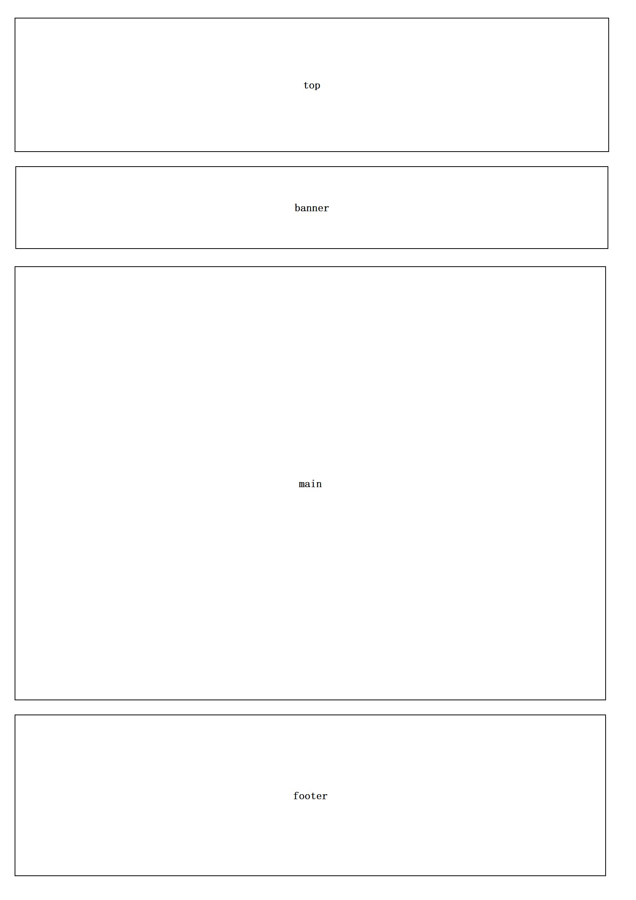
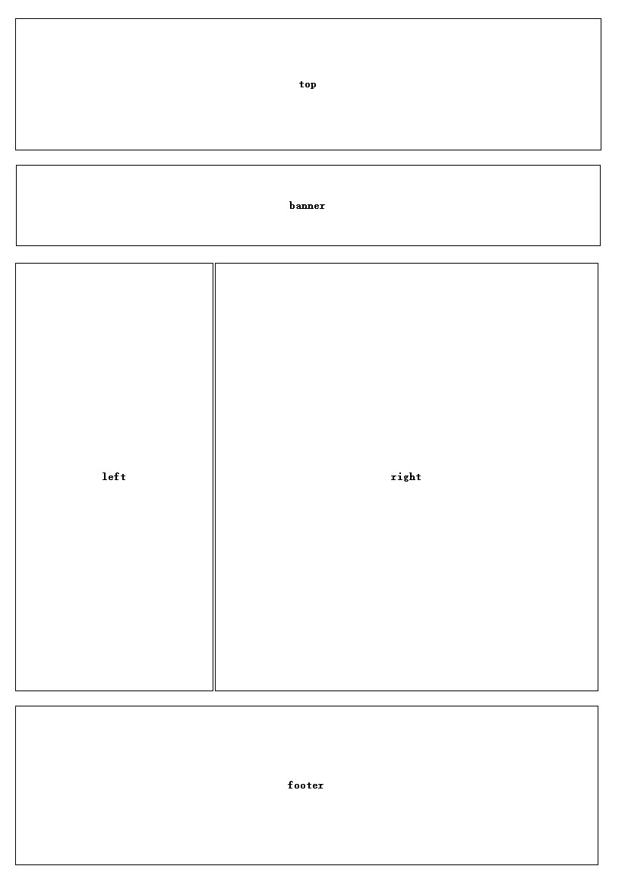
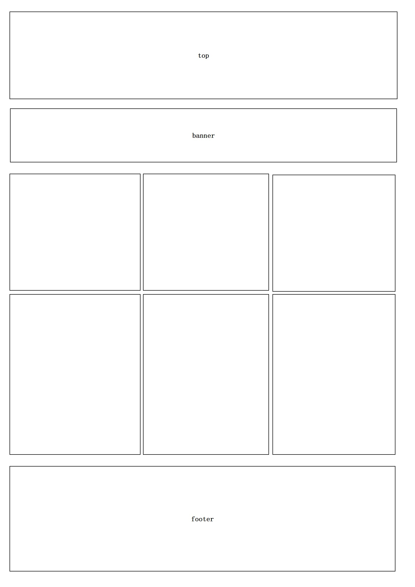

# 1、CSS导读 
---
## 1.1、CSS简介 
### 1.1.1、HTML的局限性 
HTML其实非常单纯，它只关注内容的语义。比如\<h1>表明这是一个大标题，\
表明这是一个段落，\表明这有一个图片，\<a>表明此处有链接。

虽然HTML可以做简单的样式，但是带来的是无尽的臃肿和繁琐。

### 1.1.2、CSS-网页的美容师 
CSS是层叠样式表(Cascading Style Sheets)的简称。
有时我们也会称之为CSS样式表或级联样式表。
CSS也是一种标记语言。

CSS主要用于设置HTML页面中的文本内容(字体、大小、对齐方式等)、图片的外形(宽高、边框样式、边距等)以及版面的布局和外观显示样式。

CSS让我们的网页更加丰富多彩，布局更加灵便自如。简单理解：CSS可以美化HTML，让HTML更漂亮，让页面布局更简单。

**总结：**
1. HTML主要做结构，显示元素内容
1. CSS可以美化HTML，布局网页
2. CSS最大的价值：由HTML专注去做结构呈现，样式交给CSS，即结构(HTML)与样式(CSS)相分离。

### 1.1.3、CSS语法规范
使用HTML时，需要遵从一定的规范，CSS也是如此。要想熟练地使用CSS对网页进行修饰，首先需要了解CSS样式规则。

CSS规则由两个主要的部分构成，选择器以及一条或多条声明。

### 1.1.4、CSS代码风格
#### 1、样式格式书写
1. 紧凑格式
~~~css
h3 {color: deeppink;font-size: 20px}
~~~

2. 展开格式
~~~css
h3 {
    color: pink;
    font-size: 20px;
}
~~~

==强烈推荐第二种，因为更直观==。

#### 2、样式大小写
~~~css
h3 {
    color: pink;
}
~~~

~~~css
h3 {
    COLOR: PINK;
}
~~~

强烈推荐样式选择器，属性名，属性值关键字全部使用小写字母，特殊情况除外。

#### 3、空格规范
~~~css
h3 {
    color: pink;
}
~~~

1. 属性值前面，冒号后面，保留一个空格
2. 选择器(标签)和大括号中间保留空格

## 1.2、CSS基础选择器
### 1.2.1、CSS选择器的作用
选择器(选择符)就是根据不同需求把把不同的标签选出来这就是选择器的作用。简单来说，就是选择标签用的。

### 1.2.2、选择器分类
选择器分为基础选择器和复合选择器两个大类。这里我们先讲解一下基础选择器。

- 基础选择器是由单个选择器组成的
- 基础选择器又包括：标签选择器、类选择器、id选择器和通配符选择器

### 1.2.3、标签选择器
==标签选择器(元素选择器)==是指用HTML标签名称作为选择器，按标签名称分类，为页面中某一类标签制定统一的CSS样式。
	
==语法==：
~~~css
标签名 {
    属性1: 属性值1;
    属性2: 属性值2;
    属性3: 属性值3;
    ...
}
~~~

==作用==：
标签选择器可以把某一类标签全部选择出来，比如所有的\
标签和所有的\标签。

==优点==：
能快速为页面中同类型的标签统一设置样式。

==缺点==:
不能设计差异化样式，只能选择全部的当前标签。

### 1.2.4、类选择器
如果想要差异化选择不同的标签，单独选一个或者几个标签，可以使用类选择器。

==语法==:
~~~css
.类名 {
    属性1: 属性值1;
    ...
}
~~~

示例:
~~~css
.red {
    color: red;
}
~~~

类选择器在HTML中以class属性表示，在CSS中，类选择器以一个"."号显示。

结构需要用class属性来调用定义的类。
~~~html

    变红色

~~~

注意：
1. 类选择器使用"."(英文点号)进行标识，后面紧跟类名(自定义，我们自己命名的)。
2. 可以理解为给这个标签起了一个名字，来表示。
3. 长名称或词组可以使用中横线来为选择器命名。
~~~css
.star-sing {
    color: green;
}
~~~
4. 不要使用纯数字、中文等命名，尽量使用英文字母来表示。
5. 命名要有意义，尽量使别人一眼就知道这个类名的目的。
6. 命名规范：见《Web前端开发规范手册.doc》。

记忆口诀：样式点定义，结构类调用。一个或多个，开发最常用。
	
### 案例：使用类选择器画盒子
~~~html
<head>
    
</head>
<body>
    
红色

    
绿色

    
红色

</body>
~~~

### 1.2.5、类选择器-多类名
我们可以给一个标签指定多个类名，从而达到更多的选择目的。这些类名都可以选出这个标签。

简单理解就是一个标签有多个名字。
	
#### 1、多类名使用方式
~~~css

    亚瑟

~~~
 1. 在标签class属性中写多个类名
 2. 多个类名中间必须用空格分开
 3. 这个标签就可以分别具有这些类名的样式
~~~html
<head>
    
</head>
<body>
    
红色

    
绿色

    
红色

</body>
~~~

#### 2、多类名开发中使用场景
 1. 可以把一些标签元素相同的样式(公共的部分)放到一个类里面
 2. 这些标签都可以调用这个公共的类，然后再调用自己独有的类
 3. 从而节省CSS代码，统一修改也非常方便
	
### 1.2.6、id选择器
id选择器可以为标有特定id的HTML元素指定特定的样式。

HTML元素以id属性来设置id选择器，CSS中id选择器以"#"来定义。

语法:
~~~css
#id名 {
    属性1: 属性值1;
    ...
}
~~~

例如，将id为nav的元素中的内容设置为红色。
~~~css
#nav {
    color: red;
}
~~~

~~~html

    迈克尔·杰克逊

~~~

注意：id属性只能在每个HTMl文档中出现一次。

口诀：==样式#定义，结构id调用。只能调用一次，别人切勿使用==。

id选择器和类选择器的区别：
1. 类选择器(class)好比人的名字，一个人可以有多个名字，同时一个名字也可以被多个人使用。
2. id选择器好比人的身份证号码，全中国是唯一的，不得重复。
3. id选择器和类选择器最大的区别就是在使用次数上。
4. 类选择器在修改样式中用的最多，id选择器一般用于页面唯一性的元素上，经常和JavaScript搭配使用。
		
### 1.2.7、通配符选择器
在CSS中，通配符选择器使用"*"定义，它表示选取页面中的所有元素(标签)。
语法：
~~~css
 * {
     属性1: 属性值1;
     ...
 }
~~~
- 通配符选择器不需要调用，自动就给所有的元素使用样式
- 特殊情况才使用，后面讲解使用场景(以下是清除所有的元素标签的内外边距)
~~~css
* {
    padding: 0;
    margin: 0;
}
~~~

### 1.2.8、基础选择器总结
|  基础选择器  |             作用              |                特点                |   使用情况   |        用法        |
| :----------: | :---------------------------: | :--------------------------------: | :----------: | :----------------: |
|  标签选择器  | 可以选出所有相同的标签，比如p |           不能差异化选择           |     较多     |  p {color: red;}   |
|   类选择器   |   可以选出一个或者多个标签    |           可根据需求选择           |    非常多    | .nav {color: red;} |
|   id选择器   |     一次只能选择一个标签      | ID属性只能在每个HTML文档中出现一次 | 一般和js搭配 | #nav {color: red;} |
| 通配符选择器 |        选择所有的标签         |      选择的太多，有部分不需要      | 特殊情况使用 |  * {color: red;}   |

- 每个基础选择器都有使用场景，都需要掌握
- 如果是修改样式，类选择器是使用最多的

## 1.3、CSS字体属性
CSS Fonts(字体)属性用于定义字体系列、大小、粗细和文字样式(如斜体)。

### 1.3.1、字体系列
CSS使用font-family属性定义文本的字体系列。
~~~css
p {font-family: "微軟雅黑";}
div {font-family: Arial,"Microsoft YaHei","微软雅黑";}
~~~

- 各种字体之间必须使用英文状态下的逗号隔开
- 一般情况下，如果有空格隔开的多个单词组成的字体，加引号
- 尽量使用系统默认自带字体，保证在任何用户的浏览器中都能正确显示
- 最常见的几个字体：body {font-family:'Microsoft
	YaHei',tahoma,arial,'Hiragino Sans GB';}
		
### 1.3.2、字体大小
CSS使用font-size属性定义字体大小。
~~~css
p {
    font-size: 20px;
}
~~~

- px(像素)大小是我们网页最常用的单位
- 谷歌浏览器默认的文字大小为16px
- 不同浏览器可能默认显示的字号大小不一致，我们尽量给一个明确的值，不要默认大小
- 可以给body指定整个页面文字的大小

注意：标题标签比较特殊，需要单独指定文字大小

### 1.3.3、字体粗细
CSS使用font-weight属性设置文本字体的粗细。
~~~css
p {
    font-weight: bold;
}
~~~
| 属性值  |                            描述                            |
| :-----: | :--------------------------------------------------------: |
| normal  |                      默认值(不加粗的)                      |
|  bold   |                      定义粗体(加粗的)                      |
| 100-900 | 400等同于normal，700等同于bold，注意这个数字后面不要跟单位 |

让标题只变大，不变粗：
~~~css
h2 {
    font-weight: normal;
}
~~~

或者：
~~~css
h2 {
    font - weight: normal;
}
~~~

在实际开发中，我们更喜欢用数字表示粗细。

### 1.3.4、文字样式
CSS使用font-style属性设置文本的风格。
~~~css
p {
    font - style: normal;
}
~~~

| 属性值 |                          作用                          |
| :----: | :----------------------------------------------------: |
| normal | 默认值，浏览器会显示标准的字体样式 font-style: normal; |
| italic |               浏览器会显示斜体的字体样式               |

==注意==：平时我们很少给文字加斜体，反而要给斜体标签(em,i)改为不倾斜字体。

### 1.3.5、字体复合属性
字体属性可以把以上文本样式综合来写，这样可以更节约代码：
~~~css
body {
    font: font - style font - weight font - size / line - height font - family;
}
~~~

- 使用font属性时，必须按上面语法格式中的顺序写，不能更换顺序，并且各个属性间以空格隔开
- 不需要设置的属性可以省略(取默认值)，但必须保留 fontsize 和 font-family 属性，否则font属性将不起作用
	
### 字体属性总结
|    属性     |   表示   |                               注意点                                |
| :---------: | :------: | :-----------------------------------------------------------------: |
|  font-size  |   字号   |              我们通常用的单位是px像素，一定要跟上单位               |
| font-family |   字体   |                   实际工作中按照团队约定来写字体                    |
| font-weight | 字体粗细 |  记住加粗是700或者bold，不加粗是normal或者400，记住数字,不要跟单位  |
| font-style  | 字体样式 |      记住斜体是italic，不倾斜是normal，工作中我们最常用normal       |
|    font     | 字体连写 | 1、字体连写是有顺序的，不能随意换位置 2、其中字号和字体必须同时出现 |

## 1.4、CSS文本属性
CSS Text(文本)属性可定义文本的外观，比如文本的颜色、对齐文本、装饰文本、文本缩进、行间距等。

### 1.4.1、文本颜色
color属性用于定义文本的颜色。
~~~css
div {
    color: red;
}
~~~

|      表示      |            属性值             |
| :------------: | :---------------------------: |
| 预定义的颜色值 |      red,green,blue,pink      |
|    十六进制    |    #ff0000,#ff6600,#29D794    |
|    RGB代码     | rgb(255,0,0)或rgb(100%,0%,0%) |

开发中最常用的是十六进制。

### 1.4.2、对齐文本
text-align属性常用于设置元素内文本内容的水平对齐方式。
~~~css
div {
    text - align: center;
}
~~~

| 属性值 |      解释      |
| :----: | :------------: |
|  left  | 左对齐(默认值) |
| right  |     右对齐     |
| center |    居中对齐    |

### 1.4.3、装饰文本
text-decoration属性规定添加到文本的修饰。可以给文本加下划线、删除线、上划线等。
~~~css
div {
    text-decoration: underline;
}
~~~

|    属性值    |             描述              |
| :----------: | :---------------------------: |
|     none     |   默认，没有装饰线(最常用)    |
|  underline   | 下划线，链接a自带下划线(常用) |
|   overline   |       上划线(几乎不用)        |
| line-through |        删除线(不常用)         |

重点记住如何添加下划线，如何删除下划线，其余了解即可。
	
### 1.4.4、文本缩进
text-indent属性用来指定文本的第一行的缩进，通常是将段落的首行缩进。
~~~css
div {
    text-indent: 10px;
}
~~~

通过设置该属性，所有元素的第一行都可以缩进一个给定的长度，甚至该长度可以是负值。
~~~css
p {
    text-indent: 2em;
}
~~~

em是一个相对单位，就是当前元素(font-size)1个文字的大小，如果当前元素没有设置大小，则会按照父元素的1个文字大小。

### 1.4.5、行间距
line-height属性用于设置行间的距离(行高)，可以控制文字行与行之间的距离。
~~~css
p {
    line-height: 26px;
}
~~~

行间距包括上间距、下间距和文本高度。
	
### CSS文本属性总结
|      属性       |   表示   |                        注意点                         |
| :-------------: | :------: | :---------------------------------------------------: |
|      color      | 文本颜色 |                  我们通常用十六进制                   |
|   text-align    | 文本对齐 |            可以设置文字水平方向的对齐方式             |
|   text-indent   | 文本缩进 | 通常我们用于段落首行缩进2个字的距离 text-indent: 2em; |
| text-decoration | 文本修饰 |        添加下划线 underline ; 取消下划线 none         |
|   text-height   |   行高   |                 控制行与行之间的距离                  |

## 1.5、CSS的引入方式
### 1.5.1、CSS的三种样式表
按照CSS样式书写的位置(或者引入的方式)不同，CSS样式表可以分为三大类：
1. 行内样式表(行内式)
2. 内部样式表(嵌入式)
3. 外部样式表(链接式)
		
### 1.5.2、内部样式表
内部样式表(内嵌样式表)是写到HTML页面内部，是将所有的CSS代码抽取出来，单独放到一个\
~~~

- \
</head>
<body>
    
</body>
~~~

#### 转换为行内元素：display:inline;
~~~html
<head>
    
</head>
<body>
    

        我是块级元素
    

</body>
~~~

#### 转换为行内块元素：display:inline-block;

## 2.4、CSS背景
通过CSS背景属性，可以给页面元素添加背景样式。

### 2.4.1、背景颜色
==background-color==属性定义了元素的背景颜色。
~~~css
background-color: 颜色值;
~~~

一般情况下元素背景颜色默认值是transparent(透明)，我们也可以手动指定背景颜色为透明色。
	
### 2.4.2、背景图片
==background-image==属性描述了元素的背景图像。实际开发常见于一些logo或者一些装饰性的小图片或者是超大的背景图片，优点是非常便于控制位置。(精灵图也是一种应用场景)
~~~css
background-image: none | url();
~~~

| 参数值 |              作用              |
| :----: | :----------------------------: |
|  none  |       无背景图片(默认的)       |
|  url   | 使用绝对或相对地址指定背景图片 |

### 2.4.3、背景平铺
如果需要在HTML页面上对背景进行平铺，可以只用background-repeat属性。
~~~css
background-repeat: repeat | no-repeat | repeat-x | repeat-y;
~~~

|  参数值   |                作用                |
| :-------: | :--------------------------------: |
|  repeat   | 背景图片在横向和纵向上平铺(默认的) |
| no-repeat |           背景图片不平铺           |
| repeat-x  |         背景图片在横向平铺         |
| repeat-y  |         背景图片在纵向平铺         |

### 2.4.4、背景图片位置
利用==background-position==属性可以改变图片在背景中的位置。
~~~css
background-position: x y;
~~~

参数代表的意思是：x坐标和y坐标。可以使用方位名词或者精确单位。

|  参数值  |   说明   |                解释                |
| :------: | :------: | :--------------------------------: |
|  length  |  百分数  | 由浮点数字和单位标识符组成的长度值 |
| position | 方位名词 | top 、center、left、right、bottom  |

1. 参数是方位名词
    - 如果指定的两个值都是方位名词，则两个值前后顺序无关，比如left top 和 top left 效果一致
    - 如果只指定了一个方位名词，另一个值省略，则第二个值默认居中对齐
2. 参数是精确单位
    - 如果参数值是精确坐标，那么第一个肯定是x坐标，第二个肯定是y坐标
    - 如果只指定一个数值，那么该数值一定是x坐标，另一个默认垂直居中
3. 参数是混合单位
    - 如果指定的两个值是精确单位和方位名词混合使用，则第一个值是x坐标，第二个值是y坐标
	
### 2.4.5、背景图像固定
==background-attachment==属性设置背景图像是否固定或者随着页面的其余部分滚动。

==background-attachment后期可以制作视差滚动效果==。
~~~css
background-attachment： scroll | fixed;
~~~

|  参数  |          作用          |
| :----: | :--------------------: |
| scroll | 背景图像随对象内容滚动 |
| fixed  |      背景图像固定      |

### 2.4.6、背景属性复合写法
为了简化背景属性的代码，我们可以将这些属性合并简写在同一个属性background中，从而节约代码量。

当使用简写属性时，没有特定的书写顺序，一般习惯约定顺序为：
~~~css
background: 背景颜色 背景图片地址 背景平铺 背景图像滚动 背景图片位置;
~~~
这是实际开发中，更提倡的写法。

### 2.4.7、背景色半透明
CSS3为我们提供了背景颜色半透明的效果。
~~~css
background: rgba(0, 0, 0, 0.3);
~~~

- 最后一个参数是alpha透明度，取值范围在0-1之间
- 我们习惯把0.3的0省掉，写为background: rgba(0, 0, 0, .3);
- 注意：背景半透明是指盒子背景半透明，盒子里面的内容不受影响
- CSS3新增属性，是IE9+版本浏览器才支持的
- 但是在实际开发中，我们不太关注兼容性写法了，可以放心使用
  
### 背景总结
|         属性         |      作用      |                        值                         |
| :------------------: | :------------: | :-----------------------------------------------: |
|   background-color   |    背景颜色    |          预定义的颜色值/十六进制/RGB代码          |
|   background-image   |    背景图片    |                   url(图片路径)                   |
|  background-repeat   |    是否平铺    |        repeat/no-repeat/repeat-x/repeat-y         |
| background-position  |    背景位置    |          length/position，分别是x和y坐标          |
| backgroundattachment |    背景附着    |         scroll(背景滚动) /fixed(背景固定)         |
|       背景简写       |   书写更简单   | 背景颜色 背景图片地址 背景平铺 背景滚动 背景位置; |
|      背景半透明      | 背景颜色半透明 |  background: rgba(0, 0, 0, 0.3); 后面必须是4个值  |

background-image属性描述了元素的背景图像。实际开发常见于一些logo或者一些装饰性的小图片或者是超大的背景图片，优点是非常便于控制位置。(精灵图也是一种应用场景)

## 2.5、CSS三大特性
CSS有三个非常重要的特性：==层叠性==、==继承性==、==优先级==。

### 2.5.1、层叠性
给相同选择器设置相同的样式，此时一个样式就会覆盖(层叠)另一个冲突的样式。层叠性主要解决样式冲突的问题。

层叠性原则：
- 样式冲突，遵循的原则是就近原则，哪个样式离结构近，就执行哪个样式
- 样式不冲突，不会层叠

### 2.5.2、继承性
CSS中的继承：子标签会继承父标签的某些样式，如文本颜色和字号。

- 恰当地使用继承可以简化代码，降低CSS样式的复杂性
- 子元素可以继承父元素的样式(text-，font-，line-这些元组开头的都可以继承，以及color属性)
  
### 2.5.3、行高的继承
~~~css
body {
    font: 12px/1.5 Microsoft YaHei;
}
~~~

- 行高可以跟单位也可以不跟单位
- 如果子元素没有设置行高，则会继承父元素的行高为1.5
- 此时子元素的行高是：当前子元素的文字大小*1.5
- body行高1.5，这样写最大的优势就是里面子元素可以根据自己文字大小自动调整行高

### 2.5.4、优先级
当同一个元素指定多个选择器，就会有优先级的产生。
- 选择器相同，则执行层叠性
- 选择器不同，则根据选择器权重执行

|        选择器        | 选择器权重 |
| :------------------: | :--------: |
|     继承 或者 *      |  0,0,0,0   |
|      元素选择器      |  0,0,0,1   |
| 类选择器，伪类选择器 |  0,0,1,0   |
|       ID选择器       |  0,1,0,0   |
|  行内样式 style=""   |  1,0,0,0   |
|  !important 重要的   |   无穷大   |

==注意==：
1. 权重是由4组数字组成，但是不会有进位
2. 可以理解为类选择器永远大于元素选择器，ID选择器永远大于类选择器，以此类推
3. 等级判断从左向右，如果某一位数值相同，则判断下一位数值
4. 可以简单记忆为：通配符和继承权重为0，标签选择器为1，类(伪类)选择器为10，id选择器为100，行内样式表为1000，!important为无穷大
5. 继承的权重是0，如果该元素没有直接选中，不管父元素权重多高，子元素得到的权重都是0

### 2.5.5、CSS权重叠加
权重叠加：如果是复合选择器，就会有权重叠加，需要计算权重。
- div ul li --------> 0,0,0,3
- .nav ul li --------> 0,0,1,2
- a:hover --------> 0,0,1,1
- .nav a --------> 0,0,1,1

	
# 3、盒子模型
---
## 3.1、盒子模型
### 3.1.1、看透网页布局的本质
网页布局过程：
1. 先准备好相关的网页元素，网页元素基本都是盒子Box
2. 利用CSS设置好盒子样式，然后摆放到相应位置
3. 往盒子里面装内容

网页布局的核心本质：利用CSS摆盒子。

### 3.1.2、盒子模型(Box Model)组成
所谓盒子模型，就是把HTML页面中的布局元素看成是一个矩形的盒子，也就是一个盛装内容的容器。

CSS盒子模型本质上是一个盒子，封装周围的HTML元素，它包括：边框、外边距、内边距和实际内容。

border边框，content内容，padding内边距，margin外边距

### 3.1.3、边框(border)
border可以设置元素的边框。边框由3部分组成：边框宽度(粗细)、边框样式、边框颜色
==语法==：
~~~css
border: border-width || border-style || border-color
~~~

|     属性     |                              作用                              |
| :----------: | :------------------------------------------------------------: |
| boeder-width |                     定义边框粗细，单位是px                     |
| border-style | 边框样式，重点记住 solid实线边框 dashed虚线边框 dotted点线边框 |
| border-color |                            边框颜色                            |

==边框的复合写法==：
~~~css
border: 1px solid red; 没有顺序
~~~

==边框分开写法==：
~~~css
border-top: 1px solid red; /*只设定上边框，其余同理*/
~~~

### 3.1.4、表格的细线边框
border-collapse属性控制浏览器绘制表格边框的方式。它控制香菱单元格的边框。

==语法==：
~~~css
border-collapse: collapse;
~~~

- collapse单词是合并的意思
- border-collapse: collapse; 表示相邻边框合并在一起
		
### 3.1.5、边框会影响盒子实际大小
边框会额外增加盒子的实际大小，因此我们有两种方案解决：
1. 测量盒子大小的时候，不量边框
2. 如果测量的时候包含了边框，则需要让width/height减去边框宽度
   
### 3.1.6、内边距(padding)
padding属性用于设置内边距，即边框与内容之间的距离。
|      属性      |   作用   |
| :------------: | :------: |
|  padding-left  | 左内边距 |
| padding-right  | 右内边距 |
|  padding-top   | 上内边距 |
| padding-bottom | 下内边距 |

padding简写属性，可以有一到四个值。
|           值的个数           |                                    表达意思                                     |
| :--------------------------: | :-----------------------------------------------------------------------------: |
|        padding: 5px;         |                       1个值，代表上下左右都有5像素内边距                        |
|      padding: 5px 10px;      |                2个值，代表上下内边距是5像素，左右内边距是10像素                 |
|   padding: 5px 10px 20px;    |           3个值，代表上内边距5像素，左右内边距10像素，下内边距20像素            |
| padding: 5px 10px 20px 30px; | 4个值，代表上内边距5像素，右内边距10像素，下内边距20像素，左内边距30像素 顺时针 |

以上4种情况，我们实际开发过程中都会遇到。

当我们给盒子指定padding值后，发生了两件事情：
1. 内容和边框有了距离，添加了内边距
2. padding影响了盒子的实际大小

如果盒子已经有了宽度和高度，此时再指定内边距，会撑大盒子。

==解决方案==：
- 如果保证盒子大小和效果图大小保持一致，则让width/height减去多出来的内边距大小即可。
- 如果盒子本身没有指定width/height属性，则此时padding不会撑开盒子。
	
### 3.1.7、外边距(margin)
margin属性用于设置外边距，即控制盒子和盒子之间的距离。
|     属性      |   作用   |
| :-----------: | :------: |
|  margin-left  | 左外边距 |
| margin-right  | 右外边距 |
|  margin-top   | 上外边距 |
| margin-bottom | 下外边距 |

margin间歇方式代表的意义跟padding完全一致。

外边距典型应用:
外边距可以让块级盒子水平居中，但是必须满足两个条件：
1. 盒子鼻祖指定了宽度(width)
2. 将盒子左右外边距都设置为auto
~~~css
.header {width: 960px; margin: 0 auto;}
~~~

常见的写法，以下三种都可以：
1. margin-left: auto; margin-right: auto;
2. margin: auto;
3. margin: 0 auto;

注意：以上方法是让块级元素水平居中，行内元素或者行内块元素水平居中给其父元素添加 text-align: center 即可。
	
### 3.1.8、外边距合并
使用margin定义块级元素的垂直外边距时，可能会出现外边距的合并。

#### 1、相邻元素垂直外边距的合并
当上下相邻的两个块元素(兄弟关系)相遇时，如果上面的元素有下外边距margin-bottom，下面的元素有上外边距margintop，则它们之间的垂直间距不是margin-bottom和margintop之和。取两个值中的较大者这种现象被称为相邻块元素垂直外边距的合并。

==解决方案==：尽量只给一个盒子添加margin值。

#### 2、嵌套块元素垂直外边距的塌陷
对于两个嵌套关系(父子关系)的块元素，父元素有上外边距同时子元素也有上外边距，此时父元素会塌陷较大的外边距值。

解决方案：
1. 可以为父元素定义上边框
2. 可以为父元素定义上内边距
3. 可以为父元素添加overflow: hidden;
	
### 3.1.9、清除内外边距
网页元素很多都带有默认的内外边距，而且不同浏览器默认的也不一致。因此我们在布局前，首先要清除下网页元素的内外边距。
~~~css
* {
    padding: 0;
    margin: 0;
}
~~~

==注意==：行内元素为了照顾兼容性，尽量只设置左右内外边距，不要设置上下内外边距。
但是转换为块级和行内块元素就可以了。
	
## 3.2、PS基本操作
Ctrl+O 打开图片 文件 ----> 打开
Ctrl+R 标尺 视图 ----> 标尺
右击标尺，选择像素
Ctrl+加号(+)可以放大视图，Ctrl+减号(-)可以缩小视图
按住空格，鼠标变成小手，可以拖动PS视图
用选区拖动，可以测量大小
Ctrl+D可以取消选区，或者在旁边空白处点击一下也可以取消选区
用吸管工具取色

## 3.3、综合案例：品优购快报
[品优购快报](D:\onenote\markdown笔记\资料\html5和zss3\3.3、综合案例：品优购快报)

## 3.4、圆角边框
在CSS3 中，新增了圆角边框样式，这样我们的盒子就可以变圆角了。
border-radius属性用于设置元素的外边框圆角。
语法：
~~~css
border-radius: length;
~~~

radius半径(圆的半径)原理：(椭)圆与边框的交集形成圆角效果。
- 参数可以为数值或百分比形式
- 如果是正方形，想要设置为一个圆，把数值修改为高度或者宽度的一半即可，或者直接写为50%
- 如果是个矩形，设置为高度的一半即可
- 该属性是一个简写属性，可以跟4个值，分别代表左上角、右上角、右下角、左下角
- 分开写：border-top-left-radius、border-top-rightradius、border-bottom-right-radius、border-bottomleft-radius

## 3.5、盒子阴影
在CSS3中新增了盒子阴影，我们可以使用==box-shadow==属性为盒子添加阴影。

==语法==:
~~~css
box-shadow: h-shadow v-shadow blur spread color;
~~~

|    值    |                 描述                 |
| :------: | :----------------------------------: |
| h-shadow |    必需，水平阴影的位置，允许负值    |
| v-shadow |    必需，垂直阴影的位置，允许负值    |
|   blur   |            可选，模糊距离            |
|  spread  |           可选，阴影的尺寸           |
|  color   |  可选，阴影的颜色，请参阅CSS颜色值   |
|  inset   | 可选，将外部阴影(outset)改为内部阴影 |

注意：
1. 默认的是外阴影，但是不可以写这个单词，否则会导致阴影无效
2. 盒子阴影不占空间，不会影响其他盒子排列
	
## 3.6、文字阴影
在CSS3中，我们可以使用text-shadow属性将阴影应用于文本。

==语法==：
~~~css
text-shadow: h-shadow v-shadow blur color;
~~~

|    值    |              描述               |
| :------: | :-----------------------------: |
| h-shadow |  必需,水平阴影的位置,允许负值   |
| v-shadow |  必需,垂直阴影的位置,允许负值   |
|   blur   |        可选，模糊的距离         |
|  color   | 可选，阴影的颜色，参阅CSS颜色值 |

# 4、CSS浮动
---
## 4.1、浮动(float)
### 4.1.1、传统网页布局的三种方式
CSS提供了三种传统布局方式(简单说，就是盒子如何进行排列组合)：
1. 普通流(标准流)
2. 浮动
3. 定位
   

4.1.2、标准流(普通流/文档流)
所谓标准流，就是标签按照规定好的默认方式排列
1. 块级元素会独占一行，从上向下顺序排列
     - 常用元素：div、hr、p、h1~h6、ul、ol、dl、form、table
2. 行内元素会按照顺序，从左到右顺序排列，碰到父元素边缘则自动换行
     - 常用元素：span、a、i、em等

以上都是标准流布局，我们前面学习的就是标准流，标准流是最基本的布局方式。
    
### 4.1.3、为什么需要浮动？
有很多的网页布局效果，标准流没有办法完成，此时就可以利用浮动完成布局。因为浮动可以改变元素标签默认的排列方式。

浮动最典型的应用：可以让多个块级元素在一行内排列显示。

==网页布局第一准则：多个块级元素纵向排列找标准流，多个块级元素横向排列找浮动==。

==网页布局第二准则：先设置盒子的大小，再设置盒子的位置==。

### 4.1.4、什么是浮动？
float属性用于创建浮动框，将其移动到一边，直到左边缘或右边缘触及包含块或另一个浮动框的边缘。

==语法==：
~~~css
选择器 {float: 属性值;}
~~~

| 属性值 |        描述        |
| :----: | :----------------: |
|  none  | 元素不浮动(默认值) |
|  left  |    元素向左浮动    |
| right  |    元素向右浮动    |

### 4.1.5、浮动特性
1. 浮动元素会脱离标准流(脱标)
2. 浮动的元素会在一行内显示并且元素顶部对齐
3. 浮动的元素会具有行内块元素的特性

设置了浮动(float)的元素最重要的特性：
1. 脱离标准普通流的控制(浮)移动到指定位置(动)，俗称脱标
2. 浮动的盒子不再保留原先的位置

**2、如果多个盒子都设置了浮动，则它们会按照属性值在一行内显示并且顶端对齐排列。**

==注意==：浮动的元素是相互贴靠在一起的(不会有缝隙)，如果父级宽度装不下这些浮动的盒子，多出的盒子会另起一行对齐。

**3、浮动的元素会具有行内块元素的特性。**

任何元素都可以浮动，不管原先是什么模式的元素，添加浮动之后都会具有行内块元素的特性。
- 如果块级盒子没有设置宽度，默认宽度和父级一样宽，但是添加浮动后，它的大小会根据内容来决定
- 浮动的盒子中间是没有缝隙的，是紧挨着一起的
- 行内元素同理
	
## 4.2、常见网页布局
### 4.2.1、常见网页布局

---

---

### 4.2.2、浮动布局注意点
1. **浮动和标准流的父盒子搭配。**
- 先用标准流的父盒子排列上下位置，之后内部子元素采取浮动排列左右位置
2. **一个元素浮动了，理论上其余的兄弟元素也要浮动。**
- 一个盒子里面有多个盒子，如果其中一个盒子浮动了，那么其他兄弟也应该浮动，以防止引起问题。
- 浮动的盒子只会影响浮动盒子后面的标准流，不会影响前面的标准流。
	
## 4.3、清除浮动
### 4.3.1、为什么要清除浮动？
由于父级盒子很多情况下，不方便给高度，但是子盒子浮动又不占有位置，最后父级盒子高度为0时，就会影响下面的标准流盒子。
- 由于浮动元素不再占用原文档流的位置，所以它会对后面的元素排版产生影响
  
### 4.3.2、清除浮动本质
- 清除浮动本质就是清除浮动元素造成的影响
- 如果父盒子本身有高度，则不需要清除浮动
- 清除浮动之后，父级就会根据浮动的子盒子自动检测高度。父级有了高度，就不会影响下面的标准流了
	

==语法==：
~~~css
选择器 {clear: 属性值;}
~~~

| 属性值 |                   描述                   |
| :----: | :--------------------------------------: |
|  left  | 不允许左侧有浮动元素(清除左侧浮动的影响) |
| right  | 不允许右侧有浮动元素(清除右侧浮动的影响) |
|  Both  |        同时清除左右两侧浮动的影响        |

我们实际工作中，几乎只用clear: both;

清除浮动的策略是：闭合浮动。
	
### 4.3.3、清除浮动方法
1. 额外标签法，也称为隔墙法，是W3C推荐的做法。
2. 父级添加overflow属性
3. 父级添加after伪元素
4. 父级添加双伪元素

#### 1、额外标签法
额外标签法会在浮动元素末尾添加一个空的标签。例如\
\
，或者其他标签(如\ 等)。

优点：通俗易懂，书写方便

缺点：添加许多无意义的标签，结构化较差

注意：要求这个新的空标签必须是块级标签。

#### 2、父级添加overflow
可以给父级添加overflow属性，将其属性值设为hidden、auto或者scroll。

==优点==：代码简洁

==缺点==：无法显示溢出部分
	
#### 3、:after伪元素
:after方式是额外标签法的升级版。也是给父元素添加。
~~~css
.clearfix:after {
        content: "";
        display: block;
        height: 0;
        clear: both;
        visibility: hidden;
}
.clearfix {           /*IE6、7专有*/
        *zoom: 1;
}
~~~

==优点==：没有增加标签，结构更简单

==缺点==：照顾低版本浏览器

#### 4、双伪元素清除浮动
也是给父元素添加
~~~css
.clearfix:before, .clear:after {
        content: "";
        display: table;
}
.clearfix:after {
        clear:both;
}
.clearfix {
        *zoom: 1;
}
~~~

==优点==：代码更简洁

==缺点==：照顾低版本浏览器
	
### 4.3.4、清除浮动总结
为什么需要清除浮动？
1. 父级没高度
2. 子盒子浮动了
3. 影响下面布局了，就应该清除浮动
   
|     清除浮动方式      |        优点        |               缺点                |
| :-------------------: | :----------------: | :-------------------------------: |
|  额外标签法(隔墙法)   | 通俗易懂，书写方便 | 添加许多无意义的标签，结构化较差  |
| 父级overflow: hidden; |      书写简单      |             溢出隐藏              |
|    父级after伪元素    |   结构语义化正确   | 由于IE6、7不支持after，兼容性问题 |
|     父级双伪元素      |   结构语义化正确   | 由于IE6、7不支持after，兼容性问题 |

## 4.4、PS切图
### 4.4.1、常见图片格式
1. jpg图像格式：JPEG(JPG)对色彩的信息保留较好，高清，颜色较多，我们产品类的图片经常用jpg格式。
2. gif图像格式：GIF格式最多只能储存256色，所以通常用来显示简单图形及字体，但是可以保存透明背景和动画效果，实际经常用于一些图片小动画效果。
3. png图像格式：一种新兴的网络图形格式，结合了GIF和JPEG的特点，具有存储形式丰富的特点，能够保存透明背景。如果想要切成背景透明的图片，请选择png格式。
4. PSD图像格式：Photoshop的专用格式，；里面可以存放图层、通道、遮罩等多种设计稿。对我们前端人员来说，最大的优点是：我们可以直接从上面复制文字，获得图片，还可以测量大小和距离。
	
### 4.4.2、图层切图
1. **利用切片选中图片**
    - 利用切片工具手动画出
2. **导出选中图片**
    - 文件菜单 ----> 导出 ----> 存储为web设备所用格式 ----> 选择我们要的图片格式 ----> 存储
    - 导出时切片要选择选中的切片，而不是所有切片

### 4.4.4、PS插件切图
Cutterman是一款运行在Photoshop中的插件，能够自动将你需要的图层进行输出，以替代传统的手工"导出web所用格式"以及使用切片工具进行挨个切图的繁琐流程。

注意：Cutterman插件要求PS必须是完整版，不能是绿色版。
	
# 5、CSS定位
---
## 5.1、定位
### 5.1.1、为什么需要定位
1. 浮动可以让多个块级盒子在一行没有缝隙地排列显示，经常用于横向排列盒子。
2. 定位则是可以让盒子自由的在某个盒子内移动位置或者固定在屏幕中的某一个位置，并且可以压住其他盒子。

### 5.1.2、定位组成
定位：将盒子定在某一个位置，所以定位也是在摆放盒子，按照定位的方式移动盒子。

定位=定位模式+边偏移

定位模式用于指定一个元素在文档中的定位方式。边偏移则决定了该元素的最终位置。

#### 1、定位模式
定位模式决定元素的定位方式，它通过CSS的position属性来设置，其值可以分为4个：

|    值    |   语义   |
|:--------:|:--------:|
|  Static  | 静态定位 |
| relative | 相对定位 |
| absolute | 绝对定位 |
|  Fixed   | 固定定位 |

#### 2、边偏移
边偏移就是定位的盒子移动到最终位置。有top、bottom、left和right4个属性。

| 边偏移属性 |     示例     |                      描述                      |
| :--------: | :----------: | :--------------------------------------------: |
|    top     |  top: 80px   | 顶端偏移量，定义元素相对于其父元素上边线的距离 |
|   Bottom   | bottom: 80px | 底部偏移量，定义元素相对于其父元素下边线的距离 |
|    left    |  left: 80px  | 左侧偏移量，定义元素相对于其父元素左边线的距离 |
|   right    | right: 80px  | 右侧偏移量，定义元素相对于其父元素右边线的距离 |

### 5.1.3、静态定位(static)
静态定位是元素默认的定位方式，无定位的意思。

==语法==：
~~~css
选择器 { position: static; }
~~~

- 静态定位按照标准流特性摆放位置，它没有边偏移
- 静态定位在布局时很少用到

### 5.1.4、相对定位(relative)
相对定位是元素在移动位置的时候，是相对于它原来的位置来说的。

==语法==：
~~~css
选择器 { position: relative; }
~~~
相对定位的特点：
1. 它是相对于自己原来的位置来移动的(移动位置的时候参照点是自己原来的位置)。
2. 原来在标准流的位置继续占有，后面的盒子仍然以标准流的方式对待它。(不脱标，继续保留原来的位置)
	
### 5.1.5、绝对定位(absolute)
绝对定位是元素在移动位置的时候，是相对于它祖先元素来说的。

==语法==：
~~~css
选择器 { position: absolute; }
~~~
绝对定位的特点：
1. 如果没有祖先元素或者祖先元素没有定位，则以浏览器为准定位。
2. 如果祖先元素有定位(相对、绝对、固定定位)，则以最近一级有定位的祖先元素为参考点移动位置。
3. 绝对定位不再占有原先的位置。(脱标)
   
### 5.1.6、子绝父相的由来
子绝父相：子级是绝对定位的话，父级要用相对定位。
1. 子级绝对定位，不会占有位置，可以放到父盒子里面的任何一个地方，不会影响其他的兄弟盒子。
2. 父盒子需要加定位限制子盒子在父盒子内显示。
3. 父盒子布局时，需要占有位置，因此父亲只能是相对定位。

这就是子绝父相的由来，所以相对定位经常用来作为绝对定位的父级。

总结：因为父级需要占有位置，因此是相对定位；子盒子不需要占有位置，则是绝对定位
	
### 5.1.7、固定定位(fixed)
固定定位是元素固定于浏览器可视区的位置，主要使用场景：可以在浏览器页面滚动时元素的位置不会改变。

语法：
~~~css
选择器 { position: fixed; }
~~~
固定定位的特点：
1. 以浏览器的可视窗口为参照点移动元素。
    - 跟父元素没有关系
    - 不随滚动条滚动
2. 固定定位不占有原先的位置

固定定位也是脱标的，其实固定定位也可以看作是一种特殊的绝对定位。

固定定位小技巧：固定在版心右侧位置

小算法：
1. 让固定定位的盒子 left: 50%; 走到浏览器可视区(也可以看作版心)的一半位置。
2. 让固定定位的盒子 margin-left: 版心宽度的一半距离; 多走版心宽度的一半位置。

就可以让固定定位的盒子与版心右侧对齐了。
	
### 5.1.8、粘性定位(sticky)
粘性定位可以被认为是相对定位和固定定位的混合。

语法：
~~~css
选择器 { position: sticky; top: 10px; }
~~~
粘性定位的特点：
1. 以浏览器可视窗口为参照点移动元素(固定定位特点)
2. 粘性定位占有原先的位置(相对定位特点)
3. 必须添加top、left、bottom、right中的一个才有效

跟页面滚动搭配使用，兼容性较差，IE不支持。
	
### 5.1.9、定位到总结
|     定位模式     |    是否脱标    |      移动位置      |  是否常用  |
| :--------------: | :------------: | :----------------: | :--------: |
|  static静态定位  |  否(占有位置)  |   不能使用边偏移   |    很少    |
| relative相对定位 |  否(占有位置)  | 相对于自身位置移动 |    常用    |
| absolute绝对定位 | 是(不占有位置) |   带有定位的父级   |    常用    |
|  fixed固定定位   | 是(不占有位置) |    浏览器可视区    |    常用    |
|  sticky粘性定位  |  否(占有位置)  |    浏览器可视区    | 当前阶段少 |

### 5.1.10、定位的叠放顺序(z-index)
在使用布局时，可能会出现盒子重叠的情况。此时，可以使用zindex来控制盒子的前后次序(z轴)。

语法：
~~~css
选择器 { z-index: 1; }
~~~
- 数值可以是正整数、负整数或0，默认是auto，数值越大，盒子越靠上
- 如果属性值相同，则按照书写顺序，后来居上
- 数字后面不能加单位
- 只有定位的盒子才有z-index属性
	
### 5.1.11、定位的拓展
#### 1、绝对定位的盒子居中
加了绝对定位的盒子不能通过 margin: 0 auto; 水平居中，但是可以通过以下计算方法实现水平和垂直居中。
1. left: 50%; 让盒子的左侧移动到父级元素的水平中心位置
2. margin-left: -100px; 让盒子向左移动自身宽度的一半

#### 2、定位的特殊特性
绝对定位和固定定位也和浮动类类似。
1. 行内元素添加绝对或者固定定位，可以直接设置高度和宽度。
2. 块级元素添加绝对或者固定定位，如果不给宽度或者高度，默认大小是内容的大小。

#### 3、脱标的盒子不会触发外边距塌陷
浮动元素、绝对定位(固定定位)元素都不会触发外边距合并的问题。

#### 4、绝对定位(固定定位)会完全压住盒子
浮动元素不同，只会压住它下面标准流的盒子，但是不会压住下面标准流盒子里面的文字(图片)

但是绝对定位(固定定位)会压住下面标准流所有的内容。

浮动之所以不会压住文字，是因为浮动产生的目的最初是为了做文字环绕的效果。文字围绕浮动元素。
	
## 5.2、综合案例：淘宝焦点图
[淘宝焦点图](D:\onenote\markdown笔记\资料\html5和zss3\5.2、综合案例)  

## 5.3、网页布局总结
通过盒子模型，清楚知道大部分html标签是一个盒子。

通过CSS浮动、定位可以让每个盒子排列成为网页。

一个完整的网页，是标准流、浮动、定位一起完成布局的，每个都有自己专门的用法。

#### 1、标准流
可以让盒子上下排列或者左右排列，垂直的块级盒子显示就用标准流布局。

#### 2、浮动
可以让多个块级元素一行显示或者左右对齐盒子，多个块级盒子水平显示就用浮动布局。

#### 3、定位
定位最大的特点是有层叠的概念，就是可以让多个盒子前后叠压来显示。如果元素自由在盒子内移动就用定位布局。

## 5.4、元素的显示与隐藏
### 5.4.1、display属性
display属性用于设置一个元素应如何显示。
- display: none;    隐藏对象
- display: block;    除了转换为块级元素之外，同时还有显示元素的意思

display隐藏元素后，不再占有原来的位置。

### 5.4.2、visibility可见性
- visibility属性用于指定一个元素应可见还是隐藏。
- visibility: visible; 元素可见
- visibility: hidden; 元素隐藏
- visibility隐藏元素后，继续占有原来的位置。

### 5.4.3、overflow溢出
overflow属性指定了如果内容溢出一个元素的框(超过其指定宽度及高度)时，会发生什么。

| 属性值  |                    描述                    |
| :-----: | :----------------------------------------: |
| visible |         不剪切内容，也不添加滚动条         |
| hidden  | 不显示超过对象尺寸的内容，超出的部分隐藏掉 |
| scroll  |      不管内容是否超出，总是显示滚动条      |
|  auto   |   超出自动显示滚动条，不超出不显示滚动条   |

一般情况下，我们都不想让溢出的内容显示出来，因为溢出的部分会影响布局。

但是如果有定位的盒子，请慎用overflow: hidden; 因为它会隐藏多余的部分。
	
# 6、CSS高级技巧
---
## 6.1、精灵图
### 6.1.1、为什么需要精灵图技术？
一个网页中往往会应用很多小的背景图作为修饰，当网页中的图像过多时，服务器就会频繁的接收和发送请求图片，造成服务器请求压力过大，这将大大降低页面的加载速度。

因此，为了有效地减少服务器接收和发送请求的次数，提高页面的加载速度，出现了CSS精灵技术(也称CSS Sprites、CSS雪碧)。

核心原理：将网页中的一些小背景图像整合到一张大图中，这样服务器只需要一次请求就可以了。

### 6.1.2、精灵图(sprites)的使用
使用精灵图核心：
1. 精灵技术主要针对于背景图片使用，就是把多个小背景图片整合到一张大图片中
2. 这个大图片也称为sprites精灵图或者雪碧图
3. 移动背景图片位置，此时可以使用background-position
4. 移动的距离就是这个目标图片的x和y轴坐标，注意网页中的坐标有所不同
5. 因为一般情况下都是往上往左边移动，所以数值是负值
6. 使用精灵图的时候需要精确测量，每个小背景图片的大小和位置

使用精灵图核心总结：
1. 精灵图主要针对于小的背景图片使用
2. 主要借助于背景位置来实现---background-position
3. 一般情况下精灵图都是负值(千万注意网页中的坐标：x轴右边是正值，左边是负值，y轴同理)
   
## 6.2、字体图标
### 6.2.1、字体图标的产生
字体图标使用场景：主要用于显示网页中通用、常用的一些小图标。

精灵图是有诸多优点的，但是缺点也很明显：
1. 图片文件还是比较大的
2. 图片本身放大和缩小会失真
3. 一旦图片制作完毕想要更换非常复杂

此时，有一种技术的出现很好地解决了以上问题，就是字体图标iconfont。
字体图标可以为前端工程师提供一种高效方便的图标使用方式，展示的是图标，本质属于字体。

### 6.2.2、字体图标的优点
- 轻量级：一个图标字体要比一系列的图像要小。一旦字体加载了，图标就会马上渲染出来，减少了服务器请求。
- 灵活性：本质其实是文字，可以很随意地改变颜色、产生阴影、透明效果、旋转等
- 兼容性：几乎支持所有的浏览器，请放心使用

==注意==：字体图标不能替代精灵技术，只是对工作中图标部分技术的提升和优化。

总结：
1. 如果遇到一些结构和样式比较简单的小图标，就用字体图标
2. 如果遇到一些结构样式比较复杂一些的小图片，就用精灵图
	
### 6.2.3、字体图标的引入
1. 把fonts文件夹放到页面根目录下
   - 不同浏览器所支持的字体格式是不一样的，字体图标之所以兼容，就是因为包含了主流浏览器支持的字体文件。
2. TrueType(.ttf)格式：ttf字体是Windows和Mac的最常见的字体，支持这种字体的浏览器有IE9+、Firefox3.5+、Chrome4+、Safari3+、Opera10+、iOS Mobile Safari4.2+
3. Web Open Font Format(.woff)格式：woff字体，支持这种字体的浏览器有：IE9+、Firefox3.5+、Chrome6+、Safari3.6+、Opera11.1+
4. Embedded Open Type(.eot)格式：eot字体是IE专用字体，支持这种字体的浏览器有IE4+
5. SVG(.svg)格式：svg字体是基于SVG字体渲染的一种格式，支持这种字体的浏览器有：Chrome4+、Safari3.1+、Opera10.0+、iOS Mobile Safari3.2+
6. 在CSS样式中全局声明字体：简单理解把这些字体文件通过CSS引入到我们的页面中。
一定注意字体文件路径的问题。
~~~css

~~~

#### 3. html标签内添加小图标
~~~html
 
~~~

#### 4. 给span指定字体样式
~~~css
span {
    font-family: "icomoon";
    font-size: 100px;
    color: pink;
}
~~~

### 6.2.4、字体图标的追加
如果工作中，原来的字体图标不够用了，我们需要添加新的字体图标到原来的字体文件中。

把压缩包里的selection.json重新上传，然后选中自己想要的新的图标，重新下载压缩包，并替换原来的文件即可。
	
## 6.3、CSS三角
### 6.3.1、CSS三角
~~~css
div {
    width: 0;
    height: 0;
    line-height: 0;
    font-size: 0;
    border: 50px solid transparent;
    border-top-color: pink;
}
~~~

### 案例：京东三角
~~~html

<body>
    

        
    

</body>
~~~

## 6.4、CSS用户界面
所谓的界面样式，就是更改一些用户操作样式，以便提高用户体验。

### 6.4.2、鼠标样式cursor
~~~css
li {cursor: pointer;}
~~~
设置或检索在对象移动的鼠标指针采用何种系统预定义的光标形状。
|   属性值    |   描述    |
| :---------: | :-------: |
|   default   | 小白 默认 |
|   pointer   |   小手    |
|    move     |   移动    |
|    text     |   文本    |
| not-allowed |   禁止    |

### 6.4.3、轮廓线outline
给表单添加 outline: 0; 或者 outline: none; 样式之后，就可以去掉默认的蓝色边框。
~~~css
input {
    outline: none;
}
~~~

### 6.4.4、防止拖拽文本域resize
实际开发中，我们文本域右下角是不可以拖拽的。
~~~css
textarea {
    resize: non
}
~~~

## 6.5、vertical-align属性应用
### 6.5.1、vertical-align属性应用
CSS的vertical-align属性使用场景：经常用于设置图片或者表单(行内块元素)和文字垂直对齐。

官方解释：用于设置一个元素的垂直对齐方式，但是它只针对行内元素或者行内块元素有效。
语法：
~~~css
vertical-align: baseline | top | middle | bottom
~~~

|    值    |                  描述                  |
| :------: | :------------------------------------: |
| baseline |     默认，元素放置在父元素的基线上     |
|   top    |  把元素顶端与行中最高的元素的顶端对齐  |
|  middle  |       把此元素放置在父元素的中部       |
|  bottom  | 把元素的顶端与行中最低的元素的顶端对齐 |

### 6.5.2、解决图片底部默认空白缝隙问题
bug：图片底侧会有一个空白缝隙，原因是行内块元素会和文字的基线对齐。

主要解决方法有两种：
1. 给图片添加vertical-align: middle | top | bottom等。 (提倡使用的)
2. 把图片转为块级元素 display: block;
   
## 6.6、溢出的文字省略号显示
### 6.6.1、单行文本溢出显示省略号
单行文本溢出显示省略号，必须满足三个条件：
~~~css
/*1、先强制一行内显示文本*/
white-space: nowrap;     (默认normal自动换行)
/*2、超出的部分隐藏*/
overflow: hidden;
/*3、文字用省略号替代超出的部分*/
text-overflow: ellipsis;
~~~

### 6.6.2、多行文本溢出显示省略号
多行文本溢出显示省略号，有较大兼容性问题，适合于webKit浏览器或移动端(移动端大部分是webkit内核)
~~~css
overflow: hidden;
text-overflow: ellipsis;
/*弹性伸缩盒子模型展示*/
display: -webkit-box;
/*限制在一个块元素显示的文本的行数*/
-webkit=line-clamp: 2;
/*设置或检索伸缩盒对象的子元素是排列方式*/
-weblit-box-orient: vertical;
~~~
更推荐让后台人员来做这个效果，因为后台人员可以设置显示多少个字，操作更简单。

## 6.7、常见布局技巧
### 6.7.1、margin负值的运用
1. 让每个盒子margin往左侧移动-1px正好压住相邻盒子边框
2. 鼠标经过某个盒子的时候，提高当前盒子的层级即可(如果没有定位，则加相对定位(保留位置)；如果有定位，则加zindex)
~~~html

<body>
    <ul>
        <li>1</li>
        <li>2</li>
        <li>3</li>
        <li>4</li>
        <li>5</li>
    </ul>
</body>
~~~

### 6.7.2、文字围绕浮动元素
巧妙运用浮动元素不会压住文字的特性。
~~~html

<body>
    

        

            
        

        
【集锦】热身赛-巴西0-1秘鲁 内马尔替补两人血染赛场

    

</body>
~~~

### 6.7.3、行内块的巧妙运用
~~~html

<body>
    

        <a href="#" class="prev">&lt;&lt;上一页</a>
        <a href="#" class="current">2</a>
        <a href="#">3</a>
        <a href="#">4</a>
        <a href="#">5</a>
        <a href="#">6</a>
        <a href="#" class="elp">...</a>
        <a href="#" class="next">&gt;&gt;下一页</a>
        到第 
        <input type="text">
        页
        <button>确定</button>
    

</body>
~~~

### 6.7.4、CSS三角强化
~~~css
width: 0;
height: 0;
border-color: transparent red transparent transparent;
border-style: solid;
border-width: 22px 8px 0 0;
~~~

~~~html

<body>
    

    

        
            ¥1650
            <i></i>
        
        ¥5650
    

</body>
~~~

## 6.8、CSS样式
### 京东初始化：
~~~css
/* 把我们所有标签的内外边距清零 */
* {
    margin: 0;
    padding: 0
}
/* em 和 i 斜体的文字不倾斜 */
em,
i {
    font-style: normal
}
/* 去掉li 的小圆点 */
li {
    list-style: none
}

img {
    /* border 0 照顾低版本浏览器 如果 图片外面包含了链接会有边框的问题 */
    border: 0;
    /* 取消图片底侧有空白缝隙的问题 */
    vertical-align: middle
}

button {
    /* 当我们鼠标经过button 按钮的时候，鼠标变成小手 */
    cursor: pointer
}

a {
    color: #666;
    text-decoration: none
}

a:hover {
    color: #c81623
}

button,
input {
    /* "\5B8B\4F53" 就是宋体的意思 这样浏览器兼容性比较好 */
    font-family: Microsoft YaHei, Heiti SC, tahoma, arial, Hiragino Sans GB, "\5B8B\4F53", sans-serif
}

body {
    /* CSS3 抗锯齿形 让文字显示的更加清晰 */
    -webkit-font-smoothing: antialiased;
    background-color: #fff;
    font: 12px/1.5 Microsoft YaHei, Heiti SC, tahoma, arial, Hiragino Sans GB, "\5B8B\4F53", sans-serif;
    color: #666
}

.hide,
.none {
    display: none
}
/* 清除浮动 */
.clearfix:after {
    visibility: hidden;
    clear: both;
    display: block;
    content: ".";
    height: 0
}

.clearfix {
    *zoom: 1
}
~~~

# 7、HTML5和CSS3提高
---
## 7.1、HTML5新特性
HTML5的新增特性主要是针对于以前的不足，增加了一些新的标签、新的表单和新的表单属性等。

这些新特性都有兼容性问题，基本是IE9+以上版本的浏览器才支持，如果不考虑兼容性问题，可以大量使用这些新特性。

声明：
1. 新特性增加了很多，但是我们专注于开发常用的新特性

### 7.1.1、新增语义化标签
以前布局，我们基本用div来做，div对于搜索引擎来说，是没有语义的。

**新增语义化标签：**
- \<header>：头部标签
- \<nav>：导航标签
- \<article>：内容标签
- \<section>：定义文档某个区域
- \<aside>：侧边栏标签
- \<footer>：尾部标签

~~~html

<body>
   <header>头部标签</header>
   <nav>导航栏标签</nav>
   <section>某个区域</section>
</body>
~~~

注意：
- 这种语义化标签主要是针对搜索引擎的
- 这些新标签在页面中可以使用多次
- 在IE9中，需要把这些元素转换为块级元素
- 其实，我们移动端更喜欢用这些标签
	
### 7.1.2、新增视频标签<vedio>
当前 \<vedio> 元素支持三种视频格式：MP4、WebM、Ogg，尽量使用mp4格式
|      浏览器       |                              MP4                               | WebM  |  Ogg  |
| :---------------: | :------------------------------------------------------------: | :---: | :---: |
| Internet Explorer |                              YES                               |  NO   |  NO   |
|      Chrome       |                              YES                               |  YES  |  YES  |
|      Firefox      | YES 从Firefox 21 版本开始 Linux系统从Firefox 30 系统开始 |  YES  |  YES  |
|      Safari       |                              YES                               |  NO   |  NO   |
|       Opera       |                  YES  从Opera 25 版本开始                   |  YES  |  YES  |

==语法==：
~~~html
<video src="文件地址" controls="controls"></video>

<video controls="controls" width="300">
    <source src="movie.mp4" type="video/mp4">
    <source src="movie.ogg" type="video/ogg">
    您的浏览器暂不支持video标签播放视频
</video>
~~~

**常见属性**：

|   属性   |         值          |                                   描述                                   |
| :------: | :-----------------: | :----------------------------------------------------------------------: |
| autoplay |      Autoplay       |       视频就绪自动播放(谷歌浏览器需要添加muted来解决自动播放问题)        |
| controls |      controls       |                            向用户显示播放控件                            |
|  width   |    pixels(像素)     |                              设置播放器宽度                              |
|  height  |    pixels(像素)     |                              设置播放器高度                              |
|   loop   |        Loop         |                    播放完是否继续播放该视频，循环播放                    |
| Preload  | auto (预先加载视频) | 规定是否预加载视频(如果有了autoplay，忽略该属性) none(不预先加载视频) |
|   src    |         Url         |                               视频url地址                                |
|  Poster  |       Imgurl        |                            加载等待画面的图片                            |
|  muted   |        muted        |                                 静音播放                                 |

### 7.1.3、新增音频标签<audio>
当前 \<audio> 元素支持三种音频格式：

|      浏览器       |  MP3  |  Wav  |  Ogg  |
| :---------------: | :---: | :---: | :---: |
| Internet Explorer |  YES  |  NO   |  NO   |
|      Chrome       |  YES  |  YES  |  YES  |
|      Firefox      |  YES  |  YES  |  YES  |
|      Safari       |  YES  |  YES  |  NO   |
|       Opera       |  YES  |  YES  |  YES  |

语法：
~~~html
<audio src="文件地址" controls="controls"></audio>

<audio controls="controls" width="300">
    <source src="movie.mp3" type="video/mp3">
    <source src="movie.ogg" type="video/ogg">
    您的浏览器暂不支持audio标签播放音频
</audio>
~~~

**常见属性**：

|   属性   |    值    |                      描述                      |
| :------: | :------: | :--------------------------------------------: |
| Autoplay | autoplay |     如果出现该属性，则音频在就绪后马上播放     |
| controls | controls | 如果出现该属性，则向用户显示控件，比如播放按钮 |
|   loop   |   loop   |  如果出现该属性，则每当音频结束时重新开始播放  |
|   src    |   url    |               要播放的音频的URL                |

多媒体标签总结：
1. 音频标签和视频标签使用方式基本一致
2. 浏览器支持情况不同
3. 谷歌浏览器把视频和音频自动播放禁止了
4. 我们可以给视频标签添加muted属性来静音播放视频，音频不可以(可以通过JavaScript解决)
5. 视频标签是重点，我们经常设置自动播放，不使用controls控件，循环和设置大小属性
		
### 7.1.4、新增input表单类型
|    属性值     |            说明             |
| :-----------: | :-------------------------: |
| type="email"  | 限制用户输入必须为Email类型 |
|  type="url"   |  限制用户输入必须为URL类型  |
|  type="date"  | 限制用户输入必须为日期类型  |
|  type="time"  | 限制用户输入必须为时间类型  |
| type="month"  |  限制用户输入必须为月类型   |
|  type="week"  |  限制用户输入必须为周类型   |
| type="number" | 限制用户输入必须为数字类型  |
|  type="tel"   |          手机号码           |
| type="search" |           搜索框            |
| type="color"  |    生成一个颜色选择表单     |

### 7.1.5、新增表单属性
|     属性     |    值     |                                                                                               说明                                                                                               |
| :----------: | :-------: | :----------------------------------------------------------------------------------------------------------------------------------------------------------------------------------------------: |
|   Required   | required  |                                                                              表单拥有该属性表示其内容不能为空，必填                                                                              |
| Placeholder  | 提示文本  |                                                                                表单的提示信息，存在默认值将不显示                                                                                |
|  autofocus   | autofocus |                                                                           自动聚焦属性，页面加载完后自动聚焦到指定表单                                                                           |
| autocomplete |  off/on   | 当用户在字段开始键入时，浏览器基于之前键入过的值，应该显示出在字段中填写的选项。 默认已经打开，如autocomplete="on"，关闭autocomplete="off"  需要放在表单内，同时加上name属性，同时成功提交 |
|   Multiple   | multiple  |                                                                                         可以多选文件提交                                                                                         |

## 7.2、CSS新特性
### 7.2.1、CSS3现状
- 新增的CSS3特性有兼容性问题，IE9+才支持
- 移动端支持优于PC端
- 不断改进中
- 应用相对广泛
- 现阶段主要学习：新增选择器和盒子模型 及其他特性
		
### 7.2.2、新增属性选择器
属性选择器可以根据元素特定的属性来选择元素，这样就可以不用借助于类或者id选择器。

|    选择符     |                 简介                  |
| :-----------: | :-----------------------------------: |
|    E[att]     |        选择具有att属性的E元素         |
| E[att="val"]  | 选择具有att属性且属性值等于val的E元素 |
| E[att^="val"] |  匹配具有att属性且值以val开头的E元素  |
| E[att$="val"] |  匹配具有att属性且值以val结尾的E元素  |
| E[att*="val"] |  匹配具有att属性且值中含有val的E元素  |
注意：==类选择器、属性选择器、伪类选择器，权重为10==.

### 7.2.3、新增结构伪类选择器
结构伪类选择器主要根据文档结构来选择元素，常用于根据父级选择器选择里面的子元素。

|      选择符      |             简介              |
| :--------------: | :---------------------------: |
|  E:first-child   |  匹配父元素中的第一个子元素E  |
|   E:last-child   | 匹配父元素中的最后一个子元素E |
|  E:nth-child(n)  |  匹配父元素中的第n个子元素E   |
| E:first-of-type  |       指定类型E的第一个       |
|  E:last-of-type  |      指定类型E的最后一个      |
| E:nth-of-type(n) |       指定类型E的第n个        |

nth-child(n)选择某个父元素的一个或多个特定的子元素
- n可以是数字、关键字和公式
- 如果跟的是数字，就是选择第n个子元素，里面数字从1开始...
- n可以是关键字：even偶数，odd奇数
- n可以是公式：常见的公式如下(如果n是公式，则从0开始计算，但是第0个元素或者超出的元素会被忽略)

| 公式  |       取值        |
| :---: | :---------------: |
|  2n   |       偶数        |
| 2n+1  |       奇数        |
|  5n   |    5 10 15 ...    |
|  n+5  | 从第5个开始到最后 |
| -n+5  | 前5个(包含第5个)  |

nth-child(n)和nth-of-type(n)的区别:
1. nth-child对父元素里面的所有孩子排序选择(序号是固定的)，先找第n个孩子，再看是否和E匹配
2. nth-of-type对父元素里面指定子元素进行排序选择，先去匹配E，然后再根据E找第n个孩子

==类选择器、属性选择器、伪类选择器，权重为10==.
	
### 7.2.4、新增伪元素选择器
伪元素选择器可以帮助我们利用CSS创建新标签元素，而不需要HTML标签，从而简化HTML结构。

|  选择符  |           简介           |
| :------: | :----------------------: |
| ::before | 在元素内部的前面插入内容 |
| ::after  | 在元素内部的后面插入内容 |

注意：
- before和after创建一个元素，但是属于行内内容
- 新创建的这个元素在文档树中是找不到的，所以我们称为伪元素
- 语法：element::before {}
- ==before和after必须有content属性==
- before在父元素内容的前面插入元素，after在父元素内容的后面插入元素
- ==伪元素选择器和标签选择器一样，权重为1==
	
### 伪元素选择器使用场景1：配合字体图标
~~~html
<html>
    <head>
     
    </head>
    <body> 
    

  
    </body>
</html>
~~~

### 伪元素选择器使用场景2：仿土豆效果
~~~html

    
<body>
    

        
    

    

        
    

    

        
    

    

        
    

</body>
~~~

### 7.2.5、CSS3盒子模型
CSS3中可以通过box-sizing来指定盒模型，有2个值：contentbox、border-box，这样我们计算盒子大小的方式也就发生了改变。

可以分成2种情况：
1. box-sizing: content-box; 盒子大小为width+padding+border(以前默认的)
2. box-sizing: border-box; 盒子大小为width

如果盒子模型我们改为了box-sizing: border-box，那padding和border就不会撑大盒子了(前提padding和border不会超过width宽度)

### 7.2.6、CSS3图片模糊处理
CSS3滤镜filter:将模糊或颜色偏移等图形效果应用于元素。
~~~css
filter: 函数(); 例如：filter: blur(5px); blur模糊处理，数值越大越模糊
~~~

### 7.2.7、计算盒子宽度calc函数
CSS3 calc函数：让你在声明CSS属性值时执行一些计算。
~~~css
width: calc(100% -80px);
~~~
括号里面可以通过 + - * / 来进行计算。
	
### 7.2.8、CSS3过渡
过渡(transition)是CSS3中具有颠覆性的特征之一，我们可以在不使用flash动画或者JavaScript的情况下，实现元素从一种样式变换为另一种样式的效果。

过渡动画：是从一个状态渐渐过渡到另外一个状态可以让我们的页面更好看，更动感十足，虽然，低版本浏览器不支持(IE9以下版本)，但是不会影响页面布局。

我们现在经常和:hover一起搭配使用。
~~~css
trasition: 要过渡的属性 花费时间 运动曲线 何时开始;
~~~
1. 属性：想要变化的CSS属性，宽度高度、颜色背景、内外边距都可以。如果想要所有属性都变化过渡，写一个all就可以。
2. 花费时间：单位是秒(必须写单位)，比如0.5s
3. 运动曲线：默认是ease (可以省略)
    - ease：逐渐慢下来
    - ease-in：加速
    - ease-out：减速
    - ease-in-out：先加速后减速
    - linear：匀速
4. 何时开始：单位是秒(必须写单位)，可以设置延迟触发时间，默认是0s (可以省略)
	过渡的使用口诀：谁做过度给谁加
	如果想要写多个属性，利用逗号进行分隔：
	transition: width .5s, height .5s;
	
### 进度条案例
~~~html

    
<body>
    

        

    

</body>
~~~

# 8、转换
---
## 8.1、CSS3 2D转换
==转换(transform)==是CSS3 最具有颠覆性的特征之一，可以实现元素的位移、旋转、缩放等效果。
	
### 8.1.1、二维坐标系
2D转换是改变标签在二维平面上的位置和形状的一种技术。

### 8.1.2、移动 translate
2D移动是2D转换里面的一种功能，可以改变元素在页面中的位置，类似定位。

==语法==：
~~~css
transform: translate(x,y); 或者分开写
transform: translateX(n);
transform: translateY(n);
~~~

重点：
- 定义2D转换中的移动，沿着X和Y轴移动元素
- translate最大的优点：不会影响到其他元素的位置
- translate中的百分比单位是相对于自身元素的translate:(50%,50%);
- ==对行内标签没有效果==
	
### 让一个盒子水平居中：
~~~html

    
<body>
    

        

    
        

    

</body>
~~~

### 8.1.3、旋转 rotate
2D旋转指的是让元素在二维平面内顺时针旋转或者逆时针旋转。

==语法==：
~~~css
transform: rotate(度数);
~~~
==重点==：
- rotate里面跟度数，单位是 deg ，比如 rotate(45deg);
- 角度为正时，顺时针；为负时，逆时针
- 默认旋转的中心点是元素的中心点

### 三角
~~~html

    
<body>
    

    
    

</body>
~~~

### 8.1.4、2D转换中心点 transform-origin
我们可以设置元素旋转的中心点。

==语法==：
~~~css
transform-origin: x y;
~~~
==重点==：
- 注意后面的参数 x 和 y 用空格隔开
- x y 默认转换的中心点是元素的中心点(50%，50%)
- 还可以给 x 和 y 设置 像素 或者 方位名词 (top bottom left right center)
	
### 8.1.5、缩放 scale
缩放，顾名思义，可以放大和缩小，只要给元素添加了这个属性就能控制它放大还是缩小。

==语法==：
~~~css
transform: scale(x,y);
~~~
==注意==：
- 注意其中的x和y用逗号分隔
- transform: scale(1,1) ：宽和高都放大一倍，相当于没有放大
- transform: scale(2,2) ：宽和高都放大了2倍
- transform: scale(2) ：只写一个参数，第二个参数默认和第一个参数一样，相当于 scale(2,2)
- transform: scale(0.5,0.5) ：缩小
- scale缩放的最大优势：可以设置转换中心点缩放，默认以中心点缩放，而且不影响其他盒子
	
### 案例：图片放大
~~~html

    
<body>
    

        <a href="#"></img></a>
    

    

        <a href="#"></img></a>
    

        

        <a href="#"></img></a>
        
        
</body>
~~~

### 案例：分页按钮
~~~html

    
<body>
    <ul>
        <li>1</li>
        <li>2</li>
        <li>3</li>
        <li>4</li>
        <li>5</li>
        <li>6</li>
        <li>7</li>
    </ul>
</body>
~~~

### 8.1.6、2D转换综合写法
==注意==：
1. 同时使用多个转换，其格式为： transform: translate() rotate() scale() ...等
2. 其顺序会影响转换的效果(先旋转会改变坐标轴方向)
3. ==当我们同时拥有位移和其他属性的时候，记得要将位移放到最前==
		
## 8.2、CSS3动画
动画(animation)是CSS3中具有颠覆性的特征之一，可以通过设置多个节点来精确控制一个或一组动画，常用来实现复杂的动画效果。

相比较过渡，动画可以实现更多变化，更多控制，连续自动播放等效果。

### 8.2.1、动画的基本使用
制作动画分为两步：
1. 先定义动画
2. 再使用(调用)动画

#### 1、用 keyframes 定义动画(类似定义类选择器)
~~~css
@keyframes 动画名陈 {
    0% {
    width: 100px;
    }
    100% {
    width: 200px;
    }
}
~~~
动画序列：
- 0%是动画的开始，100%是动画的完成，这样的规则就是动画序列
- 在 @keyframes 中规定某项CSS样式，就能创建由当前样式逐渐改为新样式的动画效果
- 动画是使元素从一种样式逐渐变化为另一种样式的效果，你可以改变任意多的样式任意多的次数
- 请用百分比来规定变化发生的时间，或用关键词 “from” 和“to” ，等同于0%和100%
	
#### 2、元素使用动画
~~~css
div {
    width: 200px;
    height: 200px;
    background-color: aqua;
    margin: 100px auto;
    /*调用动画*/
    animation-name: 动画名称;
    /*持续时间*/
    animation-duration: 持续时间;
}
~~~

==一个元素可以同时拥有多个动画，不同动画之间用逗号隔开就行了==。
	
### 8.2.2、动画常用属性
|           属性           |                              描述                               |
| :----------------------: | :-------------------------------------------------------------: |
|        @keyframes        |                            规定动画                             |
|        animation         |     所有动画属性的简写属性，除了 animation-play-state 属性      |
|      animation-name      |             规定 @keyframes 动画的名称。（必须的）              |
|    animation-duration    |     规定完成一个动画周期花费的秒或毫秒，默认是0。（必须的）     |
| animation-timingfunction |                 规定动画的速度曲线，默认是 ease                 |
|     animation-delay      |                    规定动画何时开始，默认是0                    |
| animation-iterationcount |        规定动画被播放的次数，默认是1，还有 infinite 循环        |
|   animation-direction    | 规定动画是否在下一周期逆向播放，默认是 normal ，alternate逆播放 |
|   animation-play-state   |    规定动画是否正在运行或暂停，默认是 running ，还有 paused     |
|   animation-fill-mode    |     规定动画结束后状态，保持 forwards ，回到起始 backwards      |

### 8.2.3、CSS3动画简写
~~~css
animation: 动画名称 持续时间 运动曲线 何时开始 播放次数 是否反方向 动画起始或者结束状态;
~~~

~~~css
animation: myfirst 5s liner 2s infinite alternate;
~~~

- 简写属性里面不包含 animation-play-state
- 暂停动画：animation-play-state: paused; 经常和鼠标经过等其他配合使用
- 想要动画走回来，而不是直接跳回来：animationdirection: alternate;
- 盒子动画结束后，停在结束位置：animation-fill-mode: forwards;
	
### 8.2.4、速度曲线之steps步长
animation-timing-function：规定动画的速度曲线，默认是“ease”

|     值      |                     描述                     |
| :---------: | :------------------------------------------: |
|   linear    |                 动画匀速进行                 |
|    ease     | 默认，动画以低速开始，然后加快，在结束前变慢 |
|   ease-in   |                动画以低速开始                |
|  ease-out   |                动画以低速结束                |
| ease-in-out |             动画以低速开始和结束             |
|   steps()   |      指定了时间函数中的间隔数量（步长）      |

## 8.3、CSS3 3D转换
### 8.3.1、三维坐标系
三维坐标系其实就是指立体空间，立体空间其实是由3个轴共同组成的。
- x轴：水平向右，右边是正值，左边是负值
- y轴：垂直向下，下面是正值，上面是负值
- z轴：垂直屏幕，往外面是正值，往里面是负值

### 8.3.2、3D位移 translate3d
3D移动在2D移动的基础上多加了一个可以移动的方向，就是z轴方向。
- transform: translateX(100px)：仅仅是在X轴上移动
- transform: translateY(100px)：仅仅是在Y轴上移动
- transform: translateZ(100px)：仅仅是在Z轴上移动（注意：translateZ 一般用px单位）
- transform: translate3d(x, y, z)：其中x、y、z分别指要移动的轴的方向的距离

### 8.3.3、透视 perspective
- 如果想要在网页产生3D效果需要透视（理解成3D物体投影在2D平面内）
- 模拟人类的视觉位置，可认为安排一只眼睛去看
- 透视我们也称为视距：视距就是人的眼睛到屏幕的距离
- 距离视觉点越近的在电脑成像越大，越远成像越小
- 透视的单位是像素

透视写在被观察元素的父盒子上面

d：就是视距，视距就是人的眼睛到屏幕的距离。
z：就是z轴，物体距离屏幕的距离，z轴越大(正值)，我们看到的物体就越大。
~~~css
body {
    perspevtive: 500px;
}
~~~

### 8.3.4、3D旋转 rotate3d
3D旋转指可以让元素在三维平面内沿着x轴、y轴、z轴或者自定义轴进行旋转。
语法：
- transform: rotateX(45deg)：沿着X轴正方向旋转45度
- transform: rotateY(45deg)：沿着Y轴正方向旋转45度
- transform: rotateZ(45deg)：沿着Z轴正方向旋转45度
- transform: rotate3d(x, y, z, deg)：沿着自定义轴旋转，deg为角度（了解即可）

对于元素旋转方向的判断，我们需要先学习一个左手准则。

==左手准则(以X轴为例)==：
- ==左手的拇指指向X轴正方向==
- ==其余手指弯曲的方向就是该元素沿着X轴旋转的正方向==

### 8.3.5、3D旋转 rotate3d
transform: rotate3d(x, y, z, deg)：沿着自定义轴旋转，deg为角度（了解即可）。

其中，xyz表示旋转轴的矢量，是表示你是否希望沿着该轴旋转，最后一个表示旋转的角度。
~~~css
/*沿着X轴旋转45度*/
transform: rotate(1, 0, 0, 45deg);
/*沿着Y轴旋转45度*/
transform: rotate(0, 1, 0, 45deg);
/*沿着Z轴旋转45度*/
transform: rotate(0, 0, 1, 45deg);
/*沿着XY轴对角线旋转45度*/
transform: rotate(1, 1, 0, 45deg);
~~~

### 8.3.6、3D呈现 transform-style
- 控制子元素是否开启三维立体环境
- transform-style: flat; 子元素不开启3d立体空间 默认的
- transform-style: preserve-3d; 子元素开启立体空间
- 代码写给父级，但是影响的是子盒子
- 这个属性很重要，后面必用
	
### 案例：两面反转的盒子
~~~html

    
<body>
    

        
黑马程序员

        
我在这里等你

    

</body>
~~~

### 案例：3D导航栏
~~~html

    
<body>
    <ul>
        <li>
                

                

                    马程序员  
                

                

                    我在这里等你
                

            

        </li>
        <li>
                

                

                    马程序员  
                

                

                    我在这里等你
                

            

        </li>
        <li>
                

                

                    马程序员  
                

                

                    我在这里等你
                

            

        </li>
        <li>
                

                

                    马程序员  
                

                

                    我在这里等你
                

            

        </li>
    </ul>
</body>
~~~

### 案例：旋转木马
~~~html

    
<body>
    <section>
            

            

            

            

            

            

    </section>
</body>
~~~

## 8.4、浏览器私有前缀
浏览器私有前缀是为了兼容老版本的写法，比较新的版本的浏览器无需添加。
- -moz-：代表Firefox浏览器私有属性
- -ms-：代表IE浏览器私有属性
- -webkit-：代表Safari、Chrome浏览器私有属性
- -o-：代表Opera浏览器私有属性

提倡的写法：
~~~css
-moz-border-radius: 10px;
-webkit-border-radius: 10px;
-o-border-radius: 10px;
border-radius: 10px;
~~~

# 9、移动WEB开发之流式布局
---
## 9.1、移动端基础
### 9.1.1、浏览器现状
PC端常见浏览器：
360浏览器、谷歌浏览器、火狐浏览器、QQ浏览器、百度浏览器、搜狗浏览器、IE浏览器等等。

移动端常见浏览器：
UC浏览器、QQ浏览器、欧朋浏览器、百度手机浏览器、360安全浏览器、谷歌浏览器、搜狗手机浏览器、猎豹浏览器，以及其他杂牌浏览器。

目前国内的UC和QQ，百度等手机浏览器都是根据Webkit修改过来的内核，国内尚无自主研发的内核，就像国内的手机操作系统都是基于Android开发的一样。

==总结：兼容移动端主流浏览器，处理Webkit内核浏览器即可==。
	
### 9.1.2、手机屏幕现状
- 移动端设备屏幕尺寸非常多，碎片化严重
- Android设备有多种分辨率：480X800、480X854、540X960、720X1280、1080X1920等，还有传说中的2K、4K屏
- 近年来iPhone的碎片化也加剧了，其设备主要分辨率有：640X960、640X1136、750X1334、1242X2208等
- 作为开发者无需关注这些分辨率，因为我们常用的尺寸单位是px

### 9.1.3、移动端调试方法
- Chrome DevTools(谷歌浏览器)的模拟手机测试
- 搭建本地Web服务器，手机和服务器在一个局域网内，通过手机访问服务器
- 使用外网服务器，直接IP或域名访问
	
## 9.2、视口
视口(viewport)就是浏览器显示页面内容的屏幕区域。视口可以分为布局视口、视觉视口和理想视口。

### 9.2.1、布局视口 layout viewport
- 一般移动设备的浏览器都默认设置了一个布局视口，用于解决早期的PC端页面在手机上显示的问题
- iOS、Android基本都将这个视口分辨率设置为980px，所以PC上的网页大多都能在手机上呈现，只不过元素看上去很小，一般默认可以通过手动缩放网页

### 9.2.2、视觉视口 visual viewport
- 字面意思，他是用户正在看到的网站的区域。 ==注意：是网站的区域==。
- 我们可以通过缩放去操作视觉视口，但不会影响布局视口，布局视口仍保持原来的宽度。

### 9.2.3、理想视口 ideal viewport
- 为了使网站在移动端有最理想的浏览和阅读宽度而设定
- 理想视口，对设备来讲，是最理想的视口尺寸
- 需要手动添写meta视口标签通知浏览器操作
- meta视口标签的主要目的：布局视口的宽度应该与理想视口的宽度一致，简单理解就是设备有多宽，我们布局的视口就多宽

### 9.2.4、meta视口标签
~~~html
<meta name="viewport" content="width=device-width, user-scalable=no,initial-scale=1.0, maximum-scale=1.0, minimum=1.0">
~~~

|     属性      |                        解释说明                        |
| :-----------: | :----------------------------------------------------: |
|     width     | 宽度设置的是viewport的宽度，可以设置device-width特殊值 |
| initial-scale |                初始缩放比，大于0的数字                 |
| maximum-scale |                最大缩放比，大于0的数字                 |
| minimum-scale |                最小缩放比，大于0是数字                 |
| user-scalable |           用户是否可以缩放，yes或no（1或0）            |

## 9.3、二倍图
### 9.3.1、物理像素与物理像素比
- 物理像素点指的是屏幕显示的最小颗粒，是物理真实存在的，这是厂商在出厂时就设置好了的，比如苹果6/7/8是750X1334
- 我们开发的时候1px不一定等于1个物理像素点
- PC端页面，1个px等于1个物理像素点，但是移动端就不尽相同
- 1个px能显示的物理像素点的个数，称为物理像素比或屏幕像素比

### 9.3.2、二倍图
- 对于一张50px*50px的图片，在手机Retina屏中打开，按照刚才的物理像素比会放大倍数，这样会造成图片模糊
- 在标准的viewport设置中，使用倍图来提高图片质量，解决在高清设备中的模糊问题
- 通常使用二倍图，因为iPhone6/7/8的影响，但是现在还存在3倍图、4倍图的情况，这个看实际开发公司需求
- 背景图片注意缩放问题
~~~css
/* 在iPhone8下面 */
img {
    /* 原始图片100*100px */
    width: 50px;
    height: 50px;
}
.box {
    /* 原始图片100*100px */
    background-size: 50px 50px;
}
~~~

### 9.3.3、背景缩放 background-size
background-size属性规定背景图像的尺寸。
~~~css
background-size: 背景图片宽度 背景图片高度;
~~~
- 单位：长度 | 百分比 | cover | contain
- cover把背景图像扩展至足够大，以使背景图像完全覆盖背景区域
- contain把背景图像扩展至最大尺寸，以使宽度和高度完全适应内容区域
- 只写一个尺寸，就是宽度尺寸，高度自动按比例缩放
	

9.4、移动端开发选择
9.4.1、移动端主流方案
**1. 单独制作移动端页面(主流)**
- 京东商城手机版
- 淘宝触屏版
- 苏宁易购手机版

**2. 响应式页面兼容移动端(其次)**
- 三星手机官网

### 9.4.2、单独制作移动端页面
通常情况下，网址域名前面加m(mobile)可以打开移动端，通过判断设备，如果是移动设备打开，就跳到移动端页面。

### 9.4.3、响应式兼容PC移动端
通过判断屏幕宽度来改变样式，以适应不同终端。

缺点：
制作麻烦，需要花很大精力去调整兼容性问题

## 9.5、移动端技术解决方案
### 9.5.1、移动端浏览器
移动端浏览器基本以webkit内核为主，因此我们就考虑webkit兼容性问题。

我们可以放心使用H5标签和CSS3样式。

同时我们浏览器的私有前缀我们只需要考虑添加webkit即可。

### 9.5.2、CSS初始化 normalize.css
移动端CSS初始化推荐使用 ==normalize.css==
- Normalize.css：保护了有价值的默认值
- Normalize.css：修复了浏览器的bug
- Normalize.css：是模块化的
- Normalize.css：拥有详细的文档

官网地址： http://necolas.github.io/normalize.css/
	
### 9.5.3、移动端特殊样式
~~~css
/*CSS3盒子模型*/
box-sizing: border-box;
-webkit-box-sizing: border-box;
/*点击高亮我们需要清除 设置为transparent 完全透明*/
-webkit-tap-hignlight-color: transparent;
/*在移动端浏览器默认的外观、在iOS上加上这个属性才能给按钮和输入框自定义样式*/
-webkit-appearance: none;
/*禁用长按页面时的弹出菜单*/
img, a {-webkit-touch-callout: none;}
~~~

## 9.6、移动端常见布局
### 9.6.1、移动端技术选型
**1、单独制作移动端页面(主流)**
- 流式布局(百分比布局)
- flex弹性布局(强烈推荐)
- less+rem+媒体查询布局
- 混合布局

**2、响应式页面兼容移动端(其次)**
- 媒体查询
- Bootstrap

### 9.6.2、流式布局(百分比布局)
- 流式布局，就是百分比布局，也称非固定像素布局
- 通过将盒子的宽度设置成百分比来根据屏幕的宽度进行伸缩，
- 不受固定像素的限制，内容向两侧填充
- 流式布局方式是移动web开发使用的比较常见的布局方式
- max-width 最大宽度(max-height 最大高度)
- min-width 最小宽度(min-height 最小高度)
		

## 9.7、京东移动端首页
[京东移动端首页](D:\onenote\markdown笔记\资料\html5和zss3\9.7、京东移动端首页) 

# 10、移动web开发之flex布局
---
## 10.1、flex布局体验
### 10.1.1、传统布局与flex布局
**传统布局**

- 兼容性好
- 布局繁琐
- 局限性，不能在移动端很好地布局

**flex弹性布局**
- 操作方便，布局极为简单，移动端应用很广泛
- PC段浏览器支持情况较差
- IE 11或更低版本，不支持或仅部分支持

建议：
1. 如果是PC端页面布局，我们还是传统布局
2. 如果是移动端或者不考虑兼容性问题的PC端页面布局，我们还是使用flex弹性布局
		
### 10.1.2、初体验
~~~html
<!DOCTYPE html>
<html lang="en">
    
<head>
    <meta charset="UTF-8">
    <meta name="viewport" content="width=device-width, initial-scale=1.0">
    <meta http-equiv="X-UA-Compatible" content="ie=edge">
    <title>Document</title>
    
</head>
    
<body>
    

        1
        2
        3
    

</body>
	 
</html>
~~~

## 10.2、flex布局原理
### 10.2.1、布局原理
flex是 flexible Box 的缩写，意为弹性布局，用来为盒状模型提

供最大的灵活性，任何一个容器都可以指定为flex布局。

- 当我们将父盒子设定为flex布局后，子元素的float、clear和 vertical-align属性将失效
- 伸缩布局=弹性布局=伸缩盒布局=弹性盒布局=flex布局

采用Flex布局的元素，称为Flex容器(flex container)，简称“容器”，它的所有子元素自动成为容器成员，称为Flex项目(flex item)，简称“项目”。

总结flex布局原理：
==就是通过给父盒子添加flex属性，来控制盒子的位置和排列方式==。
	
## 10.3、flex布局父项常见属性
### 10.3.1、常见父项属性
以下6个属性是对父元素设置的：
- flex-direction：设置主轴的方向
- justify-content：设置主轴上的子元素排列方式
- flex-wrap：设置子元素是否换行
- align-content：设置侧轴上的子元素的排列方式(多行)
- align-items：设置侧轴上的子元素排列方式(单行)
- flex-flow：复合属性，相当于同时设置了 flex-direction 和 flex-wrap
  
### 10.3.2、flex-direction 设置主轴的方向
#### 1、主轴与侧轴
在flex布局中，分为主轴和侧轴两个方向，同样的叫法有：行和列、x轴和y轴
- 默认主轴方向就是x轴方向，水平向右
- 默认侧轴方向就是y轴方向，水平向下
#### 2、属性值
flex-direction属性决定主轴的方向(即项目的排列方向)

注意：主轴和侧轴是会变化的，就看 flex-direction 设置谁为主轴，剩下的就是侧轴，而我们的子元素就是跟着主轴来排列的。
|     属性值     |      说明      |
| :------------: | :------------: |
|      row       | 默认值从左到右 |
|  row-reverse   |    从右到左    |
|     column     |    从上到下    |
| column-reverse |    从下到上    |

### 10.3.3、justify-content 设置主轴上的子元素排列方式
justify-content属性定义了项目在主轴上的对齐方式。

注意：使用这个属性之前一定要确定好主轴是哪个。
|    属性值     |                      说明                       |
| :-----------: | :---------------------------------------------: |
|  flex-start   | 默认值，从头开始，如果主轴是x轴，则从左到右排列 |
|   flex-end    |                 从尾部开始排列                  |
|    center     |    在主轴居中对齐（如果主轴是x轴则水平居中）    |
| space-around  |                  平分剩余空间                   |
| space-between |       先两边贴边，再平分剩余空间（重要）        |

### 10.3.4、flex-wrap 设置子元素是否换行
默认情况下，项目都排在一条线(又称“轴线”)上，==flex-wrap==属性定义，flex布局中默认是不换行的。
| 属性值 |      说明      |
| :----: | :------------: |
| nowrap | 默认值，不换行 |
|  wrap  |      换行      |

### 10.3.5、align-items 设置侧轴上的子元素排列方式(单行)
该属性是控制子项在侧轴(默认是y轴)上的排列方式，在子项为单项(单行)的时候使用。
|   属性值   |          说明          |
| :--------: | :--------------------: |
| flex-start |        从上到下        |
|  flex-end  |        从下到上        |
|   center   | 挤在一起居中(垂直居中) |
|  stretch   |      拉伸(默认值)      |

### 10.3.6、align-content 设置侧轴上的子元素的排列方式(多行)
设置子项在侧轴上的排列方式，并且只能用于子项出现换行的情况(多行)，在单行下是没有效果的。

|    属性值     |                  说明                  |
| :-----------: | :------------------------------------: |
|  flex-start   |      默认值，在侧轴的头部开始排列      |
|   flex-end    |          在侧轴的尾部开始排列          |
|    center     |             在侧轴中间显示             |
| space-around  |         子项在侧轴平分剩余空间         |
| space-between | 子项在侧轴先分布在两头，再平分剩余空间 |
|    stretch    |      设置子元素高度平分父元素高度      |

### 10.3.7、flex-flow
flex-flow 属性是 flex-direction 和 flex-wrap 属性的复合属性。
~~~css
flex-flow: column wrap;
~~~

## 10.4、flex布局子项常见属性
- flex 子项目占的份数
- align-self 控制子项自己在侧轴的排列方式
- order 属性定义子项的排列顺序（前后顺序）

### 10.4.1、flex属性
flex属性定义子项目分配的==剩余空间==，用flex来表示占多少份数。
~~~css
.item {
    flex: <number>; /* default 0 */
}
~~~

### 10.4.2、align-self 控制子项自己在侧轴的排列方式
==align-self== 可以以允许某个单个项目有与其他项目不一样的对齐方式，可覆盖 align-items 属性。

默认值为 auto ，表示继承父元素的 align-items 属性，如果没有父元素，则等同于 stretch 。
~~~css
span:nth-child(2) {
    /* 设置自己在侧轴上的排列方式 */
    align-self: flex-end;
}
~~~

### 10.4.3、order 属性定义子项的排列顺序（前后顺序）
数值越小，排列越靠前，默认值为0.

注意：和 z-index 不一样。
	
## 10.5、携程网首页
[携程网首页]()

## 10.6、背景渐变 linear-gradient
==语法1==：
~~~css
background: linear-gradient(起始方向, 颜色1, 颜色2, ...);
background: -webkit-linear-gradient(left, red, blue, ...);
background: -webkit-linear-gradient(left top, red, blue);
~~~
背景渐变必需添加浏览器私有前缀。

起始方向可以是：方位名词 或者 度数 ，如果省略默认就是top。

# 11、移动web开发之rem适配布局
---
## 11.1、rem基础
**rem 单位**

rem (root em)是一个相对单位，类似于em，em是父元素字体大小。

不同的是rem的基准是相对于html元素的字体大小。

比如，根元素(html)设置 font-size=12px; 非根元素设置width: 2rem;则换算成px就是24px。

rem的优点就是可以通过修改html里面的文字大小来改变页面中元素的大小，可以整体控制。
	
## 11.2、媒体查询
### 11.2.1、什么是么提查询
媒体查询（Media Query）是CSS3新语法。
- 使用 @Media 查询，可以针对不同的媒体类型，定义不同的样式
- ==@Media 可以针对不同的屏幕尺寸设置不同的样式==
- 在你重置浏览器大小的过程中，页面会根据浏览器的宽度和高度重新渲染页面
- 目前针对很多苹果手机、Android手机、平板等设备都用得到多媒体查询
	
### 11.2.2、语法规范
~~~css
@media mediatype and | not | only (media feature) {
    css-code;
}
~~~

#### 1、mediatype查询类型
将不同的终端设备划分成不同的类型，称为媒体类型。

|   值   |              解释说明              |
| :----: | :--------------------------------: |
|  all   |            用于所有设备            |
| print  |        用于打印机和打印预览        |
| screen | 用于电脑屏幕，平板电脑，智能手机等 |

#### 2、关键字
关键将媒体类型或多个媒体特性连接到一起作为媒体查询的条件。
- and：可以将多个媒体特性连接到一起，相当于"且"的意思
- not：排除某个媒体类型，相当于"非"的意思，可以省略
- only：指定某个特定的媒体类型，可以省略
  
#### 3、媒体特性
每种媒体类型都具有各自不同的特性，根据不同媒体类型的媒体特性设置不同的展示风格。

==注意：它们都要用小括号包含==。

|    值     |                解释说明                |
| :-------: | :------------------------------------: |
|   width   |    定义输出设备中页面可见区域的宽度    |
| min-width | 定义输出设备中页面页面最小可见区域宽度 |
| max-width |   定义输出设备中页面最大可见区域宽度   |

### 11.2.3、案例：根据页面宽度改变背景颜色
~~~html

~~~

### 11.2.4、媒体查询+rem实现元素动态大小变化
rem单位是跟着html来走的，有了rem页面元素可以设置不同大小尺寸

媒体查询可以根据不同设备宽度来修改样式

媒体查询+rem 就可以根据不同设备宽度，实现页面元素大小的动态变化

### 11.2.5、引入资源
当样式比较繁多的时候，我们可以针对不同的媒体使用不同的stylesheets(样式表)。
原理就是直接在link中判断设备的尺寸，然后引用不同的CSS文件。

语法规范:
~~~html
<link rel="stylesheet" media="mediatype and|not|only (media feature)" href="mystylesheet.css">
~~~
==建议：媒体查询最好的方法是从小到大==。
	
## 11.3、Less基础
### 11.3.1、维护CSS的弊端
CSS是一门非程序式语言，没有变量、函数、SCOPE(作用域)等概念。
- CSS需要书写大量看似没有逻辑的代码，CSS冗余度是比较高的
- 不方便维护及扩展，不利于复用
- CSS没有很好的计算能力
- 对非前端开发工程师来讲，往往会因为缺少CSS编写经验而很难写出组织良好且易于维护的CSS代码项目

### 11.3.2、Less介绍
Less（Leaner Style Sheets的缩写）是一门CSS扩展语言，也称为CSS预处理器。

作为CSS的一种形式的扩展，它并没有减少CSS的功能，而是在现有的CSS语法上，为CSS程序式语言的特性。

它在CSS的语法基础之上，引入了变量，Mixin（混入），运算及函数等功能，大大简化了CSS的编写，并且降低了CSS的维护成本，就像它的名称所说的那样，Less可以让我们用更少的代码做更多的事情。

Less中文网址：http://lesscss.cn/

常见的CSS预处理器：Sass、Less、Stylus
	
### 11.3.3、Less使用
我们首先新建一个后缀名为less的文件，在这个less文件里面书写less语句。
- Less变量
- Less编译
- Less嵌套
- Less运算
	
### 11.3.4、Less变量
变量是指没有固定的值，是可以改变的。
在CSS中有一些颜色和数值经常会使用这种变量的写法。
~~~less
@变量名: 值;
~~~
==命名时严格区分大小写==。

### 11.3.5、Less编译
本质上，Less包含一套自定义的语法及一个解析器，用户根据这些语法定义自己的样式规则，这些规则最终会通过解析器编译生成对应的CSS文件。

所以，我们需要把我们的less文件编译生成为css文件，这样我们的html页面才能使用。

### 11.3.6、Less嵌套
我们经常用到选择器的嵌套
~~~css
#header .logo {
    width: 300px;
}
~~~
Less嵌套写法
~~~less
.header {
    width: 200px;
    height: 200px;
    background-color: pink;
    //1、less嵌套  子元素的样式直接写到父元素里面就好了
    a {
        color: red;
    }
}
~~~

~~~less
.nav {
    .logo {
        color: green;
    }
}
~~~

如果遇见（交集|伪类|伪元素选择器）
    - 内层选择器的前面没有&符号，则它被解析为父选择器的后代
    - 如果有&符号，他就被解析为父元素自身或父元素的伪类
~~~css
a:hover {
    color: red;
}
~~~
Less嵌套写法：
~~~less
a {
    &:hover {
        color: red;
    }
}
~~~

### 11.3.7、Less运算
任何数字、颜色或者变量都可以参与运算。

Less提供了==加（+）、减（-）、乘（*）、除（/）==算术运算。
~~~less
@border: 5px + 5;
div {
    width: 200px - 50;
    height: 200px * 2;
    border: @border solid pink;
}
~~~
==注意==：
1. 乘号（*）和除号（/）的写法
2. ==运算符中间左右有个空格隔开==1px + 5
3. 对于两个不同的单位的值之间的运算，运算结果取第一个值的单位
4. 如果两个值之间只有一个值有单位，则运算结果就取该单位
	
## 11.4、rem适配方案
**rem适配方案**
1. 让一些不能等比自适应的元素，在设备尺寸发生变化的时候，等比例适配当前设备。
2. 使用媒体查询根据不同设备比例设置html的字体大小，然后页面元素使用rem做尺寸单位，当html字体大小变化，元素尺寸也会发生变化，从而达到等比例缩放的适配。

### 11.4.1、rem实际开发适配方案
1. 按照设计稿与设备宽度的比例，动态计算并设置html根标签的 font-size 大小（媒体查询）
2. CSS中，设计稿元素的宽、高、相对位置等取值，按照同比例换算为以 rem 为单位的值

### 11.4.2、rem适配方案技术使用（市场主流）
**技术方案1：**
- Less
- 媒体查询
- Rem

**技术方案2：（推荐）**
- flexible.js
- Rem

flexible.js github地址： https://github.com/amfe/lib-flexible 
	
总结：
1. 两种方案现在都存在
2. 方案2更简单

### 11.4.3、rem实际开发适配方案1
#### rem + 媒体查询 + less技术
##### 1、设计稿常见尺寸宽度
|      设备      |                          常见宽度                          |
| :------------: | :--------------------------------------------------------: |
|   Iphone 4.5   |                           640px                            |
| ==Iphone 678== |                         ==750px==                          |
|    Android     | 常见320px、360px、375px、384px、400px、414px、500px、720px  ==大部分4.7~5寸的安卓设备为720px==|

一般情况下，我们以一套或两套效果图适应大部分屏幕，放弃极端屏或对其优雅降级，牺牲一些效果。

==现在基本以750为准==。
	
##### 2、动态设置html标签 font-size 大小
1. 假设设计稿是750px
2. 假设我们把整个屏幕划分为15等份（划分标准不一，可以是20份，也可以是10等份）
3. 每一份作为html字体大小，这里就是50px
4. 那么在320px设备的时候，字体大小为320/15 就是 21.33px
5. 用我们页面元素的大小除以不同的html字体大小会发现它们比例还是相同的
6. 比如我们以750为标准设计稿
7. 一个100\*100像素的页面元素在750屏幕下，就是 100/50 转换为rem就是2rem*2rem，比例是1:1
8. 320屏幕下，html字体大小为21.33，则2rem=42.66px，此时宽和高都是42.66，但是宽和高的比例还是1:1
9. 但是已经能实现不同屏幕下，页面元素盒子等比例缩放的效果
		
##### 3、元素大小取值方法
1. 最后的公式：页面元素的rem值=页面元素值（px）/ （屏幕宽度 / 划分的份数）
2. 屏幕宽度 / 划分的份数 就是 html font-size 的大小
3. 或者：页面元素的rem值= 页面元素值（px）/ html font-size 字体大小
		
## 11.5、案例：苏宁移动端首页
[苏宁移动端首页](D:\onenote\markdown笔记\资料\html5和zss3\11.5、苏宁移动端首页)

## 11.6、案例：黑马面面
[黑马面面](D:\onenote\markdown笔记\资料\html5和zss3\11.6、案例：黑马面面)

# 12、移动web开发响应式布局
---
## 12.1、响应式开发
### 12.1.1、响应式开发原理
就是使用媒体查询针对不同宽度的设备进行布局和样式的设置，从而达到适配不同设备的目的。

|         设备划分         |    尺寸区间     |
| :----------------------: | :-------------: |
|     超小屏幕（手机）     |     <768px      |
|     小屏设备（平板）     | [768px, 992px)  |
|  中等屏幕（桌面显示器）  | [992px, 1200px) |
| 宽屏设备（大桌面显示器） |     ≥1200px     |

### 12.1.2、响应式布局容器
响应式需要一个父级作为布局容器，来配合子级元素来实现变化效果。

原理就是在不同屏幕下，通过媒体查询来改变这个布局容器的大小，再改变里面子元素的排列方式和大小，从而实现不同屏幕下，看到不同的页面布局和样式变化。

平时我们的响应式尺寸划分：
- ==超小屏幕（手机，小于768px）：设置宽度为100%==
- ==小屏幕（平板，大于等于768px）：设置宽度为750px==
- ==中等屏幕（桌面显示器，大于等于992px）：宽度设置为970px==
- ==大屏幕（大桌面显示器，大于等于1200px）：宽度设置为1170px==

我们也可以根据实际情况自定义划分。
	
## 12.2、Bootstrap前端开发框架
### 12.2.1、Bootstrap简介
Bootstrap来自Twitter（推特），是目前最受欢迎的前端框架。

Bootstrap是基于HTML、CSS和JAVASCRIPT的。它简洁灵活，==使得web开发更加快捷==。
- 中文官网： http://bootcss.com/
- 官网： http://getbootstrap.com/
- 推荐使用： https://v3.bootcss.com/

框架：就是一套架构，它有一套比较完整的网页功能解决方案，而且控制权在框架本身，有预制样式库、组件和插件。

使用者按照框架所规定的某种规范进行开发。

==优点==：
- 标准化的html+css编码规范
- 提供了一套简洁、直观、强悍的组件
- 有自己的生态圈，不断的更新迭代
- 让开发更简单，提高了开发的效率

版本：
- 2.xx：停止维护，兼容性不好，代码不够简洁，功能不够完善
- 3.xx：目前使用最多，稳定，但是放弃了IE6-IE7，对IE8支持，但是界面效果不好，偏向于开发响应式布局、移动设备优先的web项目。
- 4.xx：最新版，目前还不是很流行
	
### 12.2.2、Bootstrap使用
控制权在框架本身，使用者要按照框架所规定的某种规范进行开发。

Bootstrap使用四步曲：
1. 创建文件夹结构 
2. 创建html骨架结构 
~~~html
<!-- 要求当前网页使用IE浏览器最高版本的内核来渲染 -->
<meta http-equiv="X-UA-Compatible" content="IE=edge">
<!-- 视口的设置：视口的宽度和设备一致，默认的缩放比例和PC端一致，用户不能自行缩放 -->
    <meta name="viewport" content="width=device-width, initial-scale=1, user-scalable=0">
    <!--[if lt IE 9]>
            <!-- 解决IE9以下浏览器对html5新增标签的不识别，并导致css不起作用的问题 -->
        
        <!-- 解决IE9以下浏览器对CSS3 Media Query的不识别 -->
        
    <![endif]-->
~~~
3. 引入相关样式文件
4. 书写内容
		
### 12.2.3、布局容器
Bootstrap需要为页面和栅格系统包裹一个.container容器，Bootstrap预先定义好了这个类，叫.container，它提供了两个此用处的类。

#### 1、container类
- 大屏（>=1200px）：宽度定位1170px
- 中屏（>=992px）：宽度定位970px
- 小屏（>=768px）：宽度定位750px
- 超小屏（100%）

#### 2、container-fluid类
- 流式布局容器百分百宽度
- 占据全部视口（viewport）的容器
- 适合于单独做移动端开发

## 12.3、Bootstrap栅格系统
### 12.3.1、栅格系统简介
栅格系统英文为"gridsystems"，也有人翻译为网格系统，它是指将页面布局划分为等宽的列，然后通过列数的定义来模块化页面布局。

Bootstrap提供了一套响应式、移动设备优先的流式栅格系统，随着屏幕或视口尺寸的增加，系统会自动分为最多12列。

Bootstrap里面container宽度是固定的，但是不同屏幕下，container的宽度不同，我们再把container划分为12等份。

### 12.3.2、栅格选项参数
栅格系统用于通过一系列的行（row）与列（column）的组合来创建页面布局，你的内容就可以放入这些创建好的布局中。

|  超小屏幕（手机）  | 小屏设备（平板） | 中等屏幕（桌面显示器） | 宽屏设备（大桌面显示器） |
| :----------------: | :--------------: | :--------------------: | :----------------------: | :------: |
|       <768px       |     >=768px      |        >=992px         |         >=1200px         |
| .container最大宽度 |   自动（100%）   |         750px          |          970px           |  1170px  |
|       类前缀       |     .col-xs-     |        .col-sm-        |         .col-md-         | .col-lg- |
|   列（column）数   |        12        |

- 行（row）必须放到container布局容器里面
- 我们实现列的平均划分需要给列添加==类前缀==
- xs-extra small：超小；sm-small：小；md-medium：中等；lg-large：大
- 列（column）大于12，多余的列所在的元素将被作为一个整体另起一行排列
- 每一列默认有左右15px的padding
- 可以同时为一列指定多个设备类名，以便划分不同份数，例如class="col-md-4 col-sm-6"
	
### 12.3.3、列嵌套
栅格系统内置的栅格系统将内容再次嵌套。简单理解就是一个列内再分成若干份小列，我们可以通过添加一个新的.row元素和一系列.col-sm-*元素到已经存在的.col-sm-*元素内。
	
### 12.3.4、列偏移
使用`.col-md-offset-*`类可以将列向右侧偏移，这些类实际是通过使用*选择器为当前元素增加了左侧的边距（margin）。
~~~html
<!-- 列偏移 -->

    
1

    
2

 
~~~

### 12.3.5、列排序
通过使用`.col-md-push-*`和`.col-md-pull-*`类就可以很容易的改变列的顺序。
~~~html
<!-- 列排序 -->

    
1

    
2

  
~~~

### 12.3.6、响应式工具
为了加快对移动设备友好的页面开发工作，利用媒体查询功能，并使用这些工具类可以方便的针对不同设备展示或隐藏页面内容。

|    类名    | 超小屏 | 小屏  | 中屏  | 大屏  |
| :--------: | :----: | :---: | :---: | :---: |
| .hidden-xs |  隐藏  | 可见  | 可见  | 可见  |
| .hidden-sm |  可见  | 隐藏  | 可见  | 可见  |
| .hidden-md |  可见  | 可见  | 隐藏  | 可见  |
| .hidden-lg |  可见  | 可见  | 可见  | 隐藏  |
与之相反的，是.visible-sm .visible-md .visible-lg是显示某个页面内容。

## 12.4、阿里百秀首页案例
[阿里百秀首页](D:\onenote\markdown笔记\资料\html5和zss3\12.4、阿里百秀首页)

# 13、vw和vh移动端布局
---
## 13.1、vw和vh
### 13.1.1、移动端布局
- 移动端布局——flex布局
- 为了实现可以适配移动端，页面元素可以将高度和宽度等比例缩放
- 需要移动端适配有如下方案：
#### rem
市场比较常见：
1. 需要不断修改html文字大小
2. 需要媒体查询media
3. 需要flexible.js
   
#### vw/vh
将来趋势：
1. 省去各种判断和修改
2. 代表：b站…
	
### 13.1.2、vw/vh是什么
- vw/vh是一个相对单位（类似em和rem相对单位）
  - vw是：viewport width    视口宽度单位
  - vh是：viewport height    视口高度单位
- 相对视口的尺寸计算结果
    - 1vw=1/100视口宽度
    - 1vh=1/100视口高度

例如：
当前屏幕视口是 375像素，则 1vw 就是 3.75像素，如果当前屏幕视口为414，则 1vw 就是 4.14像素。

==注意事项：
和百分比有区别，百分比是相对于父元素来说的，而vw和vh总是针对于当前视口来说的==。
	
### 13.1.3、vw和vh怎么用
- 超级简单，元素单位直接使用新单位vw和vh即可
- 因为vw和vh是相对单位，所以不同视口（屏幕）下，宽高会一起变化完成适配
	
### 13.1.4、vw注意事项
- 因为涉及到大量除法，还是搭配less使用更好
- 我们本质是根据视口宽度来等比例缩放页面元素高度和宽度的，所以开发中使用vw就基本够用了，vh很少使用
- 兼容性： https://caniuse.com/
