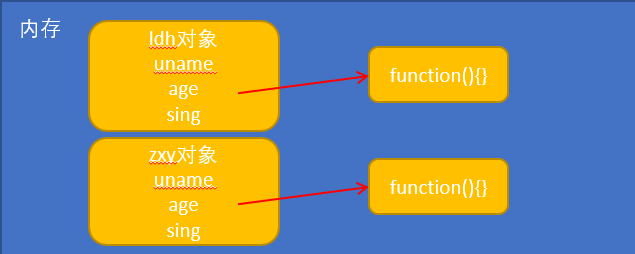
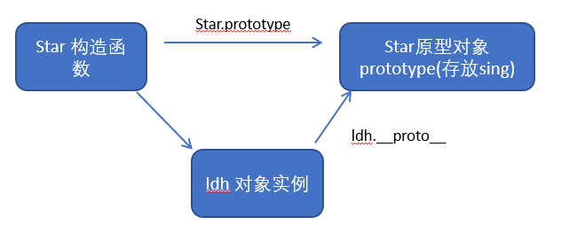
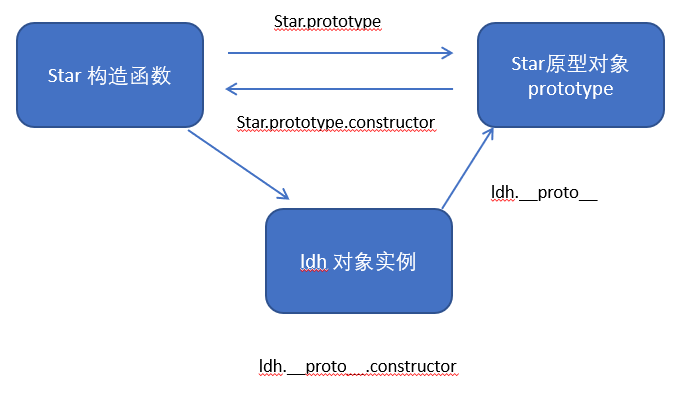
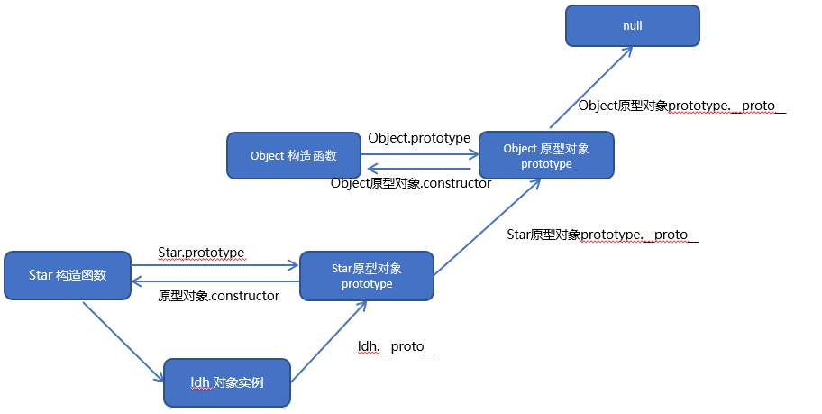
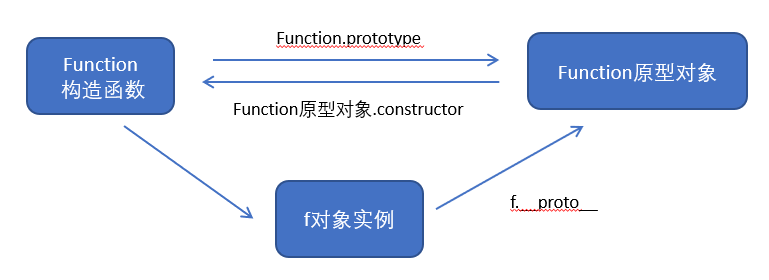
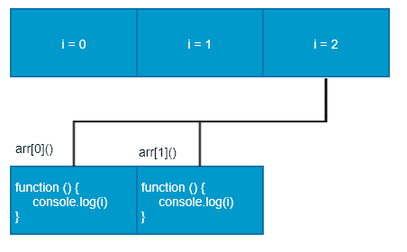
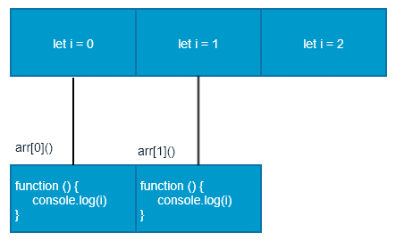

# JavaScript 高级
---

# 第一章 JavaScript 面向对象
---

## 1. 面向对象编程介绍

### 1.1 两大编程思想

- ==面向过程==
- ==面向对象==

### 1.2 面向过程编程 POP (Process-oriented programming)

==**面向过程**==就是分析出解决问题所需要的步骤，然后用函数把这些步骤一步一步实现，使用的时候再一个一个的依次调用就可以了。

==面向过程，就是按照我们分析好了的步骤，按照步骤解决问题==。

### 1.3 面向对象编程 OOP (Object Oriented Programming)

==**面向对象**==是把事务分解成为一个个对象，然后由对象之间分工与合作。

==面向对象是以对象功能来划分问题，而不是步骤==。

在面向对象程序开发思想中，每一个对象都是功能中心，具有明确分工。

面向对象编程具有灵活、代码可复用、容易维护和开发的优点，更适合多人合作的大型软件项目。

**面向对象的特性**：

- 封装性
- 继承性
- 多态性

### 1.4 面向过程和面向对象的对比

==**面向过程**==

- 优点：性能比面向对象高，适合跟硬件联系很紧密的东西，例如单片机就采用的面向过程编程。
- 缺点：没有面向对象易维护、易复用、易扩展

==**面向对象**==

- 优点：易维护、易复用、易扩展，由于面向对象有封装、继承、多态性的特性，可以设计出低耦合的系统，使系统 更加灵活、更加易于维护
- 缺点：性能比面向过程低

## 2. ES6 中的类和对象

**面向对象**

面向对象的思维特点: 

1. 抽取（抽象）对象共用的属性和行为组织(封装)成一个类(模板)
2. 对类进行实例化, 获取类的对象

面向对象编程我们考虑的是有哪些对象，按照面向对象的思维特点,不断的创建对象,使用对象,指挥对象做事情.

### 2.1 对象

现实生活中：万物皆对象，对象是==一个具体的事物==，看得见摸得着的实物。例如，一本书、一辆汽车、一个人可以是“对象”，一个数据库、一张网页、一个与远程服务器的连接也可以是“对象”。

==在 JavaScript 中，对象是一组无序的相关属性和方法的集合，所有的事物都是对象==，例如字符串、数值、数组、函数等。

对象是由==属性==和==方法==组成的：

- 属性：事物的==特征==，在对象中用==属性==来表示（常用名词）
- 方法：事物的==行为==，在对象中用==方法==来表示（常用动词）

### 2.2 类 class

在 ES6 中新增加了类的概念，可以使用 ==class== 关键字声明一个类，之后以这个类来实例化对象。

==类==抽象了对象的公共部分，它**泛指**某一大类（class）

==对象==**特指**某一个，通过类实例化一个具体的对象

面向对象的思维特点: 

1. 抽取（抽象）对象共用的属性和行为组织(封装)成一个**类**(模板)
2. 对类进行实例化, 获取类的**对象**

### 2.3 创建类

**语法**：

```js
class name {
    // class body
}
```

**创建实例**：

```js
var xx = new name();
```

**注意**： ==类必须使用 new 实例化对象==

### 2.4 类 constructor 构造函数

==constructor()== 方法是类的构造函数(默认方法)，==用于传递参数,返回实例对象==，通过 new 命令生成对象实例时，自动调用该方法。如果没有显示定义, 类内部会自动给我们创建一个 ==constructor()== 。

**语法**：

```js
class Person {
    constructor(name,age) { // constructor 构造方法或者构造函数
        this.name = name;
        this.age = age;
    }
}
```

**创建实例**：

```js
var ldh = new Person('刘德华', 18);
console.log(ldh.name)
```

**注意事项**：

1. 通过class 关键字创建类, 类名我们还是习惯性定义首字母大写
2. 类里面有个 constructor 函数,可以接受传递过来的参数,同时返回实例对象
3. constructor 函数 只要 new 生成实例时,就会自动调用这个函数, 如果我们不写这个函数,类也会自动生成这个函数
4. 生成实例 new 不能省略
5. 最后注意语法规范, 创建类 类名后面不要加小括号,生成实例 类名后面加小括号, 构造函数不需要加 function

### 2.5 类添加方法

**语法**：

```js
class Person {
    constructor(name,age) { // constructor 构造器或者构造函数
        is.name = name;
        this.age = age;
    }
    say() {
        console.log(this.name + '你好');
    }
}
```

**创建实例**：

```js
var ldh = new Person('刘德华', 18);
ldh.say()
```

**注意**： 

1. ==方法之间不能加逗号分隔，同时方法不需要添加 function 关键字。==
2. ==多个函数方法之间不需要添加逗号分隔==

## 3. 类的继承

### 3.1 继承

现实中的继承：子承父业，比如我们都继承了父亲的姓。

程序中的继承：子类可以继承父类的一些属性和方法。

**语法**：

```js
class Father{ // 父类
}
class Son extends Father { // 子类继承父类
}
```

**实例**：

```js
class Father {
    constructor(surname) {
        this.surname= surname;
    }
    say() {
        console.log('你的姓是' + this.surname);
    }
}
class Son extends Father{ // 这样子类就继承了父类的属性和方法

}
var damao= new Son('刘');
damao.say();
```

### 3.2 super 关键字

==super 关键字==用于==访问和调用对象父类上的函数==。可以==调用父类的构造函数==，也可以调用父类的普通函数。

**语法**：

```js
class Person { // 父类
    constructor(surname){
        this.surname = surname;
    }
}
class Student extends Person { // 子类继承父类
    constructor(surname,firstname){
        super(surname); // 调用父类的 constructor(surname)
        this.firstname = firstname; // 定义子类独有的属性
    }
}
```

**注意**: ==子类在构造函数中使用 super, 必须放到 this 前面 (必须先调用父类的构造方法,在使用子类构造方法)==

**案例**：

```js
class Father {
    constructor(surname) {
        this.surname = surname;
    }
    saySurname() {
        console.log('我的姓是' + this.surname);
    }
}
class Son extends Father { // 这样子类就继承了父类的属性和方法
    constructor(surname, fristname) {
        super(surname); // 调用父类的constructor(surname)
        this.fristname = fristname;
    }
    sayFristname() {
        console.log("我的名字是：" + this.fristname);
    }
}
var damao = new Son('刘', "德华");
damao.saySurname();
damao.sayFristname();
```

==super关键字== 用于访问和调用对象父类上的函数。可以调用父类的构造函数，==也可以调用父类的普通函数==。

**语法**：

```js
class Father {
    say() {
        return '我是爸爸';
    }
}
class Son extends Father { // 这样子类就继承了父类的属性和方法
    say() {
        // super.say() super 调用父类的方法
        return super.say() + '的儿子';
    }
}
var damao = new Son();
console.log(damao.say());
```

**三个注意点**:

1. 在 ES6 中类没有变量提升，所以必须先定义类，才能通过类实例化对象.
2. ==类里面的共有属性和方法一定要加 this 使用==.
3. 类里面的 this 指向问题. 
4. ==constructor 里面的 this 指向实例对象, 方法里面的 this 指向这个方法的调用者==

## 4. 面向对象案例

### 面向对象版 tab 栏切换

功能需求:

1. 点击 tab 栏,可以切换效果.
2. 点击 + 号, 可以添加 tab 项和内容项.
3. 点击 x 号, 可以删除当前的 tab 项和内容项.
4. 双击 tab 项文字或者内容项文字,可以修改里面的文字内容.

**案例分析**：

抽象对象: Tab 对象

1. 该对象具有切换功能
2. 该对象具有添加功能
3. 该对象具有删除功能
4. 该对象具有修改功能

### 面向对象版 tab 栏切换 添加功能

1. 点击 + 可以实现添加新的选项卡和内容
2. 第一步: 创建新的选项卡 li 和 新的 内容 section
3. 第二步: 把创建的两个元素追加到对应的父元素中.
4. 以前的做法: 动态创建元素 createElement , 但是元素里面内容较多, 需要 innerHTML 赋值,再 appendChild 追加到父元素里面.
5. 现在高级做法: 利用 insertAdjacentHTML() 可以直接把字符串格式元素添加到父元素中
6. appendChild 不支持追加字符串的子元素, insertAdjacentHTML 支持追加字符串的元素
7. ==insertAdjacentHTML(追加的位置, ‘要追加的字符串元素’)==
8. 追加的位置有: beforeend 插入元素内部的最后一个子节点之后
9. 该方法地址: [https://developer.mozilla.org/zh-CN/docs/Web/API/Element/insertAdjacentHTML](https://developer.mozilla.org/zh-CN/docs/Web/API/Element/insertAdjacentHTML)

### 面向对象版 tab 栏切换 删除功能

1. 点击 × 可以删除当前的li选项卡和当前的 section
2. X 是没有索引号的, 但是它的父亲 li 有索引号, 这个索引号正是我们想要的索引号
3. 所以核心思路是: 点击 x 号可以删除这个索引号对应的 li 和 section
4. 但是,当我们动态删除新的 li 和索引号时,也需要重新获取 x 这个元素. 需要调用 init() 方法

### 面向对象版 tab 栏切换 编辑功能

1. 双击选项卡 li 或者 section 里面的文字,可以实现修改功能
2. 双击事件是: ondblclick
3. 如果双击文字,会默认选定文字,此时需要双击禁止选中文字
4. window.getSelection ? window.getSelection().removeAllRanges() : document.selection.empty();
5. 核心思路: 双击文字的时候, 在 里面生成一个文本框, 当失去焦点或者按下回车然后把文本框输入的值给原先元素即可.

```js
var that;
class Tab {
    constructor(id) {
        // 获取元素
        that = this;
        this.main = document.querySelector(id);
        this.add = this.main.querySelector('.tabadd');
        // li 的父元素
        this.ul = this.main.querySelector('.fisrstnav ul:first-child');
        // section 父元素
        this.fsection = this.main.querySelector('.tabscon');
        this.init();
    }
    init() {
            this.updateNode();
            // init 初始化操作 让相关的元素绑定事件
            this.add.onclick = this.addTab;
            for (var i = 0; i < this.lis.length; i++) {
                this.lis[i].index = i;
                this.lis[i].onclick = this.toggleTab;
                this.remove[i].onclick = this.removeTab;
                this.spans[i].ondblclick = this.editTab;
                this.sections[i].ondblclick = this.editTab;
            }
        }
        // 因为我们动态添加元素 需要重新获取对应的元素
    updateNode() {
            this.lis = this.main.querySelectorAll('li');
            this.sections = this.main.querySelectorAll('section');
            this.remove = this.main.querySelectorAll('.icon-guanbi');
            this.spans = this.main.querySelectorAll('.fisrstnav li span:first-child');
        }
        // 1. 切换功能
    toggleTab() {
            // console.log(this.index);
            that.clearClass();
            this.className = 'liactive';
            that.sections[this.index].className = 'conactive';
        }
        // 清除所有 li 和 section 的类
    clearClass() {
            for (var i = 0; i < this.lis.length; i++) {
                this.lis[i].className = '';
                this.sections[i].className = '';
            }
        }
        // 2. 添加功能
    addTab() {
            that.clearClass();
            // (1) 创建 li 元素和 section 元素 
            var random = Math.random();
            var li = '<li class="liactive"><span>新选项卡</span><span class="iconfont icon-guanbi"></span></li>';
            var section = '<section class="conactive">测试 ' + random + '</section>';
            // (2) 把这两个元素追加到对应的父元素里面
            that.ul.insertAdjacentHTML('beforeend', li);
            that.fsection.insertAdjacentHTML('beforeend', section);
            that.init();
        }
        // 3. 删除功能
    removeTab(e) {
            e.stopPropagation(); // 阻止冒泡 防止触发 li 的切换点击事件
            var index = this.parentNode.index;
            console.log(index);
            // 根据索引号删除对应的 li 和 section   remove()方法可以直接删除指定的元素
            that.lis[index].remove();
            that.sections[index].remove();
            that.init();
            // 当我们删除的不是选中状态的 li 的时候,原来的选中状态 li 保持不变
            if (document.querySelector('.liactive')) return;
            // 当我们删除了选中状态的这个 li 的时候, 让它的前一个 li 处于选定状态
            index--;
            // 手动调用我们的点击事件  不需要鼠标触发
            that.lis[index] && that.lis[index].click();
        }
        // 4. 修改功能
    editTab() {
        var str = this.innerHTML;
        // 双击禁止选定文字
        window.getSelection ? window.getSelection().removeAllRanges() : document.selection.empty();
        // alert(11);
        this.innerHTML = '<input type="text" />';
        var input = this.children[0];
        input.value = str;
        input.select(); // 文本框里面的文字处于选定状态
        // 当我们离开文本框就把文本框里面的值给 span 
        input.onblur = function() {
            this.parentNode.innerHTML = this.value;
        };
        // 按下回车也可以把文本框里面的值给 span
        input.onkeyup = function(e) {
            if (e.keyCode === 13) {
                // 手动调用表单失去焦点事件  不需要鼠标离开操作
                this.blur();
            }
        }
    }
}
new Tab('#tab');
```

# 第二章 构造函数和原型
---

## 1. 构造函数和原型

### 1.1 概述

在典型的 OOP 的语言中（如 Java），都存在类的概念，类就是对象的模板，对象就是类的实例，但在 ES6之前，

JS 中并没用引入类的概念。

ES6， 全称 ECMAScript 6.0 ，2015.06 发版。但是目前浏览器的 JavaScript 是 ES5 版本，大多数高版本的浏览器也支持 ES6，不过只实现了 ES6 的部分特性和功能。

在 ES6之前 ，对象不是基于类创建的，而是用一种称为==构建函数==的特殊函数来定义对象和它们的特征。

创建对象可以通过以下三种方式：

1. 对象字面量
2. new Object()
3. 自定义构造函数

### 1.2 构造函数

==**构造函数**==是一种特殊的函数，主要用来初始化对象，即为对象成员变量赋初始值，它总与 new 一起使用。我们可以把对象中一些公共的属性和方法抽取出来，然后封装到这个函数里面。

在 JS 中，使用构造函数时要注意以下两点：

1. 构造函数用于创建某一类对象，其首字母要大写
2. 构造函数要和 new 一起使用才有意义

**new 在执行时会做四件事情**：

1. 在内存中创建一个新的空对象。
2. 让 this 指向这个新的对象。
3. 执行构造函数里面的代码，给这个新对象添加属性和方法。
4. 返回这个新对象（所以构造函数里面不需要 return ）。

JavaScript 的构造函数中可以添加一些成员，可以在构造函数本身上添加，也可以在构造函数内部的 this 上添加。通过这两种方式添加的成员，就分别称为==静态成员==和==实例成员==。

- 静态成员：在构造函数本身上添加的成员称为==静态成员==，==只能由构造函数本身来访问==
- 实例成员：在构造函数内部创建的对象成员称为==实例成员==，==只能由实例化的对象来访问==

```js
// 构造函数中的属性和方法我们称为成员, 成员可以添加
function Star(uname, age) {
    this.uname = uname;
    this.age = age;
    this.sing = function() {
        console.log('我会唱歌');
    }
}
var ldh = new Star('刘德华', 18);
// 1.实例成员就是构造函数内部通过this添加的成员 uname age sing 就是实例成员
// 实例成员只能通过实例化的对象来访问
console.log(ldh.uname);
ldh.sing();
// console.log(Star.uname); // 不可以通过构造函数来访问实例成员
// 2. 静态成员 在构造函数本身上添加的成员  sex 就是静态成员
Star.sex = '男';
// 静态成员只能通过构造函数来访问
console.log(Star.sex);
console.log(ldh.sex); // 不能通过对象来访问
```

### 1.3 构造函数的问题

构造函数方法很好用，但是==存在浪费内存的问题==。

```js
function Star(uname, age) {
    this.uname = uname;
    this.age = age;
    this.sing = function() {
        console.log('我会唱歌');
    }
}
var ldh = new Star('刘德华', 18);
var zxy = new Star('张学友', 19);
```


### 1.4 构造函数原型 prototype

构造函数通过原型分配的函数是所有对象所==**共享的**==。

JavaScript 规定，==每一个构造函数都有一个 prototype 属性==，指向另一个对象。注意这个 prototype 就是一个对象，这个对象的所有属性和方法，都会被构造函数所拥有。

==我们可以把那些不变的方法，直接定义在 prototype 对象上，这样所有对象的实例就可以共享这些方法。==

**问答？**

1. 原型是什么 ？
    - 一个对象，我们也称为 prototype 为==原型对象==。
2. 原型的作用是什么 ？
    - ==共享方法==。

### 1.5 对象原型 \_\_proto__

==对象都会有一个属性 \_\_proto__== 指向构造函数的 prototype 原型对象，之所以我们对象可以使用构造函数 prototype 原型对象的属性和方法，就是因为对象有 \_\_proto__ 原型的存在。

- \_\_proto__ 对象原型和原型对象 prototype 是等价的
- \_\_proto__ 对象原型的意义就在于为对象的查找机制提供一个方向，或者说一条路线，但是它是一个非标准属性，因此实际开发中，不可以使用这个属性，它只是内部指向原型对象 prototype



### 1.6 constructor 构造函数

==对象原型（\_\_proto__）==和==构造函数（prototype）原型对象==里面都有一个属性 ==constructor== 属性 ，constructor 我们称为构造函数，因为它指回构造函数本身。

constructor 主要用于记录该对象引用于哪个构造函数，它可以让原型对象重新指向原来的构造函数。

==一般情况下，对象的方法都在构造函数的原型对象中设置==。如果有多个对象的方法，我们可以给原型对象采取对象形式赋值，但是这样就会覆盖构造函数原型对象原来的内容，这样修改后的原型对象 constructor 就不再指向当前构造函数了。

此时，我们可以在修改后的原型对象中，添加一个 constructor 指向原来的构造函数。

### 1.7 构造函数、实例、原型对象三者之间的关系



### 1.8 原型链



### 1.9 JavaScript 的成员查找机制(规则)

1. 当访问一个对象的属性（包括方法）时，首先查找这个==对象自身==有没有该属性。
2. 如果没有就查找它的原型（也就是 \_\_proto__ 指向的 ==prototype 原型对象==）。
3. 如果还没有就查找原型对象的原型（==Object的原型对象==）。
4. 依此类推一直找到 Object 为止（==null==）。
5. \_\_proto__ 对象原型的意义就在于为对象成员查找机制提供一个方向，或者说一条路线。

### 1.10 原型对象 this 指向

==构造函数中的 this 指向==我们==实例对象==.

原型对象里面放的是方法, 这个==方法里面的 this 指向的是这个方法的调用者==, 也就是这个==实例对象==.

### 1.11 扩展内置对象

可以通过原型对象，对原来的内置对象进行扩展自定义的方法。比如给数组增加自定义求偶数和的功能。

**注意**：==数组和字符串内置对象不能给原型对象覆盖操作 Array.prototype = {} ，**只能是 Array.prototype.xxx = function(){} 的方式**。==

```js
Array.prototype.sum = function() {
    var sum = 0;
    for (var i = 0; i < this.length; i++) {
        sum += this[i];
    }
    return sum;
}
```

## 2. 继承

ES6 之前并没有给我们提供 extends 继承。我们可以通过==构造函数+原型对象==模拟实现继承，被称为==组合继承==。

### 2.1 call()

调用这个函数, 并且修改函数运行时的 this 指向

```js
fun.call(thisArg, arg1, arg2, ...)
```

- thisArg ：当前调用函数 this 的指向对象
- arg1，arg2：传递的其他参数

### 2.2 借用构造函数继承父类型属性

**核心原理**： 通过 call() 把父类型的 this 指向子类型的 this ，这样就可以实现子类型继承父类型的属性。

```js
// 父类
function Person(name, age, sex) {
    this.name = name;
    this.age = age;
    this.sex = sex;
}
// 子类
function Student(name, age, sex, score) {
    Person.call(this, name, age, sex); // 此时父类的 this 指向子类的 this，同时调用这个函数
    this.score = score;
}
var s1 = new Student('zs', 18, '男', 100);
console.dir(s1);
```

### 2.3 借用原型对象继承父类型方法

==一般情况下，对象的方法都在构造函数的原型对象中设置，通过构造函数无法继承父类方法。==

**核心原理**：

1. 将子类所共享的方法提取出来，让子类的 ==prototype 原型对象 = new 父类()==
2. 本质：子类原型对象等于是实例化父类，因为父类实例化之后另外开辟空间，就不会影响原来父类原型对象
3. 将子类的 constructor 从新指向子类的构造函数

```js
// 借用父构造函数继承属性
// 1. 父构造函数
function Father(uname, age) {
    // this 指向父构造函数的对象实例
    this.uname = uname;
    this.age = age;
}
Father.prototype.money = function() {
    console.log(100000);
};
// 2 .子构造函数 
function Son(uname, age, score) {
    // this 指向子构造函数的对象实例
    Father.call(this, uname, age);
    this.score = score;
}
// Son.prototype = Father.prototype;  这样直接赋值会有问题,如果修改了子原型对象,父原型对象也会跟着一起变化
Son.prototype = new Father();
// 如果利用对象的形式修改了原型对象,别忘了利用constructor 指回原来的构造函数
Son.prototype.constructor = Son;
// 这个是子构造函数专门的方法
Son.prototype.exam = function() {
    console.log('孩子要考试');
}
var son = new Son('刘德华', 18, 100);
console.log(son);
console.log(Father.prototype);
console.log(Son.prototype.constructor);
```

### 2.4 类的本质

1. class 本质还是 function.
2. 类的所有方法都定义在类的 prototype 属性上
3. 类创建的实例,里面也有 \_\_proto__ 指向类的 prototype 原型对象
4. 所以 ES6 的类它的绝大部分功能，ES5 都可以做到，新的 class 写法只是让对象原型的写法更加清晰、更像面向对象编程的语法而已。
5. 所以 ES6 的类其实就是语法糖.
6. 语法糖: 语法糖就是一种便捷写法. 简单理解, 有两种方法可以实现同样的功能, 但是一种写法更加清晰、方便,那么这个方法就是语法糖

## 3. ES5 中的新增方法

### 3.1 ES5 新增方法概述

ES5 中给我们新增了一些方法，可以很方便的操作数组或者字符串，这些方法主要包括：

- 数组方法
- 字符串方法
- 对象方法

### 3.2 数组方法

迭代(遍历)方法：==forEach()、map()、filter()、some()、every()==；

#### forEach() 方法

```js
array.forEach(function(currentValue, index, arr))
```

- currentValue：数组当前项的值
- index：数组当前项的索引
- arr：数组对象本身

```js
// forEach 迭代(遍历) 数组
var arr = [1, 2, 3];
var sum = 0;
arr.forEach(function(value, index, array) {
    console.log('每个数组元素' + value);
    console.log('每个数组元素的索引号' + index);
    console.log('数组本身' + array);
    sum += value;
})
console.log(sum);
```

#### filter() 方法

```js
array.filter(function(currentValue, index, arr))
```

- filter() 方法创建一个新的数组，新数组中的元素是通过检查指定数组中符合条件的所有元素,==主要用于筛选数组==
- ==注意它直接返回一个新数组==
- currentValue: 数组当前项的值
- index：数组当前项的索引
- arr：数组对象本身

```js
// filter 筛选数组
var arr = [12, 66, 4, 88, 3, 7];
var newArr = arr.filter(function(value, index) {
    // return value >= 20;
    return value % 2 === 0;
});
console.log(newArr);
```

#### some() 方法

```js
array.some(function(currentValue, index, arr))
```

- some() 方法用于检测数组中的元素是否满足指定条件. 通俗点 查找数组中是否有满足条件的元素
- ==注意它返回值是布尔值, 如果查找到这个元素, 就返回 true , 如果查找不到就返回 false==.
- ==如果找到第一个满足条件的元素,则终止循环. 不再继续查找==.
- currentValue: 数组当前项的值
- index：数组当前项的索引
- arr：数组对象本身

```js
// some 查找数组中是否有满足条件的元素 
// var arr = [10, 30, 4];
// var flag = arr.some(function(value) {
//     // return value >= 20;
//     return value < 3;
// });
// console.log(flag);
var arr1 = ['red', 'pink', 'blue'];
var flag1 = arr1.some(function(value) {
    return value == 'pink';
});
console.log(flag1);
// 1. filter 也是查找满足条件的元素 返回的是一个数组 而且是把所有满足条件的元素返回回来
// 2. some 也是查找满足条件的元素是否存在  返回的是一个布尔值 如果查找到第一个满足条件的元素就终止循环
```

#### forEach() 和 some() 区别

```js
var arr = ['red', 'green', 'blue', 'pink'];
// 1. forEach迭代 遍历
// arr.forEach(function(value) {
//     if (value == 'green') {
//         console.log('找到了该元素');
//         return true; // 在 forEach 里面 return 不会终止迭代
//     }
//     console.log(11);
// })

// 如果查询数组中唯一的元素, 用 some 方法更合适,
arr.some(function(value) {
    if (value == 'green') {
        console.log('找到了该元素');
        return true; //  在 some 里面 遇到 return true 就是终止遍历 迭代效率更高
    }
    console.log(11);
});

// arr.filter(function(value) {
//     if (value == 'green') {
//         console.log('找到了该元素');
//         return true; //  // filter 里面 return 不会终止迭代
//     }
//     console.log(11);
// });
```

### 查询商品案例

1. 把数据渲染到页面中 (forEach)
2. 根据价格显示数据 (filter)
3. 根据商品名称显示数据 (some)

```js
// 利用新增数组方法操作数据
var data = [{
    id: 1,
    pname: '小米',
    price: 3999
}, {
    id: 2,
    pname: 'oppo',
    price: 999
}, {
    id: 3,
    pname: '荣耀',
    price: 1299
}, {
    id: 4,
    pname: '华为',
    price: 1999
}, ];

// 1. 获取相应的元素
var tbody = document.querySelector('tbody');
var search_price = document.querySelector('.search-price');
var start = document.querySelector('.start');
var end = document.querySelector('.end');
var product = document.querySelector('.product');
var search_pro = document.querySelector('.search-pro');
setDate(data);

// 2. 把数据渲染到页面中
function setDate(mydata) {
    // 先清空原来tbody 里面的数据
    tbody.innerHTML = '';
    mydata.forEach(function(value) {
        // console.log(value);
        var tr = document.createElement('tr');
        tr.innerHTML = '<td>' + value.id + '</td><td>' + value.pname + '</td><td>' + value.price + '</td>';
        tbody.appendChild(tr);
    });
}

// 3. 根据价格查询商品
// 当我们点击了按钮,就可以根据我们的商品价格去筛选数组里面的对象
search_price.addEventListener('click', function() {
    // alert(11);
    var newDate = data.filter(function(value) {
        return value.price >= start.value && value.price <= end.value;
    });
    console.log(newDate);
    // 把筛选完之后的对象渲染到页面中
    setDate(newDate);
});

// 4. 根据商品名称查找商品
// 如果查询数组中唯一的元素, 用 some 方法更合适,因为它找到这个元素,就不再进行循环,效率更高
search_pro.addEventListener('click', function() {
    var arr = [];
    data.some(function(value) {
        if (value.pname === product.value) {
            // console.log(value);
            arr.push(value);
            return true; // return 后面必须写  true  
        }
    });
    // 把拿到的数据渲染到页面中
    setDate(arr);
})
```

### 3.3 字符串方法

trim() 方法会从一个字符串的两端删除空白字符。

```js
str.trim()
```

trim() 方法并不影响原字符串本身，它返回的是一个新的字符串。

### 3.4 对象方法

#### Object.keys() 用于获取对象自身所有的属性

```js
Object.keys(obj)
```

- 效果类似 for…in
- 返回一个由属性名组成的数组

```js
// 用于获取对象自身所有的属性
var obj = {
    id: 1,
    pname: '小米',
    price: 1999,
    num: 2000
};
var arr = Object.keys(obj);
console.log(arr);
arr.forEach(function(value) {
    console.log(value);
})
```

#### Object.defineProperty() 定义对象中新属性或修改原有的属性。(了解)

```js
Object.defineProperty(obj, prop, descriptor)
```

- obj：必需。目标对象
- prop：必需。需定义或修改的属性的名字
- descriptor：必需。目标属性所拥有的特性

Object.defineProperty() 第三个参数 descriptor 说明： 以对象形式 { } 书写

- value: 设置属性的值 默认为 undefined
- writable: 值是否可以重写。true | false 默认为false
- enumerable: 目标属性是否可以被枚举。true | false 默认为 false
- configurable: 目标属性是否可以被删除或是否可以再次修改特性 true | false 默认为false

```js
// Object.defineProperty() 定义新属性或修改原有的属性
var obj = {
    id: 1,
    pname: '小米',
    price: 1999
};

// 1. 以前的对象添加和修改属性的方式
// obj.num = 1000;
// obj.price = 99;
// console.log(obj);

// 2. Object.defineProperty() 定义新属性或修改原有的属性
Object.defineProperty(obj, 'num', {
    value: 1000,
    enumerable: true
});
console.log(obj);
Object.defineProperty(obj, 'price', {
    value: 9.9
});
console.log(obj);
Object.defineProperty(obj, 'id', {
    // 如果值为 false 不允许修改这个属性值 默认值也是 false
    writable: false,
});
obj.id = 2;
console.log(obj);
Object.defineProperty(obj, 'address', {
    value: '中国山东蓝翔技校xx单元',
    // 如果值为 false 不允许修改这个属性值 默认值也是 false
    writable: false,
    // enumerable 如果值为 false 则不允许遍历, 默认的值是 false
    enumerable: false,
    // configurable 如果为 false 则不允许删除这个属性 不允许再修改第三个参数里面的特性 默认为 false
    configurable: false
});
console.log(obj);
console.log(Object.keys(obj));
delete obj.address;
console.log(obj);
delete obj.pname;
console.log(obj);
Object.defineProperty(obj, 'address', {
    value: '中国山东蓝翔技校xx单元',
    // 如果值为 false 不允许修改这个属性值 默认值也是 false
    writable: true,
    // enumerable 如果值为 false 则不允许遍历, 默认的值是 false
    enumerable: true,
    // configurable 如果为 false 则不允许删除这个属性 默认为 false
    configurable: true
});
console.log(obj.address);
```

# 第三章 函数进阶
---

## 1. 函数的定义和调用

### 1.1 函数的定义方式

1. 函数声明方式 function 关键字 (命名函数)
2. 函数表达式 (匿名函数)
3. new Function() 

```js
var fn = new Function('参数1','参数2'..., '函数体')
```

- Function 里面参数都必须是字符串格式
- 第三种方式执行效率低，也不方便书写，因此较少使用
- 所有函数都是 Function 的实例(对象) 
- 函数也属于对象



### 1.2 函数的调用方式

1. 普通函数
   
   ```js
    function fn() {

    }
    fn();
    fn.call();
   ```

2. 对象的方法
   
   ```js
    var o = {
        sayHi: function() {

        }
    }
    o.sayHi();
   ```

3. 构造函数
   
   ```js
    function Star() {};
    new Star();
   ```

4. 绑定事件函数
   
   ```js
    btn.onclick = function() {}; // 点击了按钮就可以调用这个函数
   ```

5. 定时器函数
   
   ```js
    setInterval(function() {}, 1000); // 这个函数是定时器自动每隔一秒钟调用一次
   ```

6. 立即执行函数
   
   ```js
    (function() {

    })() // 立即执行函数是自动调用
   ```

## 2. this

### 2.1 函数内 this 的指向

这些 this 的指向，是当我们调用函数的时候确定的。 调用方式的不同决定了 this 的指向不同，一般指向我们的调用者.

|   调用方式   |                 this 指向                  |
| :----------: | :----------------------------------------: |
| 普通函数调用 |                   window                   |
| 构造函数调用 | 实例对象  原型对象里面的方法也指向实例对象 |
| 对象方法调用 |               该方法所属对象               |
| 事件绑定方法 |                绑定事件对象                |
|  定时器函数  |                   window                   |
| 立即执行函数 |                   window                   |

### 2.2 改变函数内部 this 指向

JavaScript 为我们专门提供了一些函数方法来帮我们更优雅的处理函数内部 this 的指向问题，常用的有 bind()、call()、apply() 三种方法。

#### 1. call() 方法

call() 方法==调用==一个对象。简单理解为调用函数的方式，但是它可以改变函数的 this 指向。

```js
fun.call(thisArg, arg1, arg2, ...) 
```

- thisArg：在 fun 函数运行时指定的 this 值
- arg1，arg2：传递的其他参数
- 返回值就是函数的返回值，因为它就是调用函数
- 因此当我们想改变 this 指向，同时想调用这个函数的时候，可以使用 call，比如继承

```js
// call 的主要作用可以实现继承
function Father(uname, age, sex) {
    this.uname = uname;
    this.age = age;
    this.sex = sex;
}

function Son(uname, age, sex) {
    Father.call(this, uname, age, sex);
}
var son = new Son('刘德华', 18, '男');
console.log(son);
```

#### 2. apply() 方法

apply() 方法==调用==一个函数。简单理解为调用函数的方式，但是它可以改变函数的 this 指向。

```js
fun.apply(thisArg, [argsArray])
```

- thisArg：在 fun 函数运行时指定的 this 值
- argsArray：传递的值，必须包含在==数组==里面
- 返回值就是函数的返回值，因为它就是调用函数
- 因此 apply 主要跟数组有关系，比如使用 Math.max() 求数组的最大值

    ```js
    var arr = [1, 66, 3, 99, 4];
    var max = Math.max.apply(Math, arr);
    console.log(max);  // 99
    ```

#### 3. bind() 方法

bind() 方法不会调用函数。但是能改变函数内部 this 指向

```js
fun.bind(thisArg, arg1, arg2, ...)
```

- thisArg：在 fun 函数运行时指定的 this 值
- arg1，arg2：传递的其他参数
- 返回由指定的 this 值和初始化参数改造的==原函数拷贝==
- 因此当我们只是想改变 this 指向，并且不想调用这个函数的时候，可以使用 bind

```js
btns.onclick = function() {
    this.disabled = true;
    setTimeout(function() {
        this.disabled = false;
    }.bind(this), 2000);
}
```

### 2.3 call() apply() bind() 总结

**相同点**：

都可以改变函数内部 this 的指向。

**区别点**: 

1. call 和 apply 会调用函数, 并且改变函数内部this指向.
2. call 和 apply 传递的参数不一样, call 传递参数 aru1, aru2..形式 apply 必须数组形式 [arg]
3. bind 不会调用函数, 可以改变函数内部 this 指向.

**主要应用场景**: 

1. call 经常做继承. 
2. apply 经常跟数组有关系. 比如借助于数学对象实现数组最大值最小值
3. bind 不调用函数,但是还想改变 this 指向. 比如改变定时器内部的 this 指向

## 3. 严格模式

### 3.1 什么是严格模式

JavaScript 除了提供正常模式外，还提供了==严格模式（strict mode）==。ES5 的严格模式是采用具有限制性 JavaScript 变体的一种方式，即在严格的条件下运行 JS 代码。

严格模式在 IE10 以上版本的浏览器中才会被支持，旧版本浏览器中会被忽略。

严格模式对正常的 JavaScript 语义做了一些更改：

1. 消除了 Javascript 语法的一些不合理、不严谨之处，减少了一些怪异行为。
2. 消除代码运行的一些不安全之处，保证代码运行的安全。
3. 提高编译器效率，增加运行速度。
4. 禁用了在 ECMAScript 的未来版本中可能会定义的一些语法，为未来新版本的 Javascript 做好铺垫。比如一些保留字如：class, enum, export, extends, import, super 不能做变量名

### 3.2 开启严格模式

严格模式可以应用到==整个脚本==或==个别函数==中。因此在使用时，我们可以将严格模式分为==为脚本开启严格模式==和==为函数开启严格模式==两种情况。

#### 1. 为脚本开启严格模式

为整个脚本文件开启严格模式，需要==在所有语句之前放一个特定语句“use strict”;（或‘use strict’;）==。

```js
"use strict";
console.log("这是严格模式。");
```

因为"use strict"加了引号，所以老版本的浏览器会把它当作一行普通字符串而忽略。

有的 script 基本是严格模式，有的 script 脚本是正常模式，这样不利于文件合并，所以可以将整个脚本文件放在一个立即执行的匿名函数之中。这样独立创建一个作用域而不影响其他 script 脚本文件。

```js
(function () {
    "use strict";
    var num = 10;
    function fn() {}
}) ();
```

#### 2. 为函数开启严格模式

要给某个函数开启严格模式，需要==把“use strict”; (或 'use strict'; ) 声明放在函数体所有语句之前==。

```js
function fn(){
    "use strict";
    return "这是严格模式。";
}
```

"use strict" 放在函数体的==第一行==，则整个函数以 "严格模式" 运行。

### 3.3 严格模式中的变化

严格模式对 Javascript 的语法和行为，都做了一些改变。

#### 1. 变量规定

1. 在正常模式中，如果一个变量没有声明就赋值，默认是全局变量。严格模式禁止这种用法，变量都必须先用 var 命令声明，然后再使用。
2. 严禁删除已经声明变量。例如，delete x; 语法是错误的。

#### 2. 严格模式下 this 指向问题

1. 以前在全局作用域函数中的 this 指向 window 对象。
2. ==**严格模式下全局作用域中函数中的 this 是 undefined**==。
3. 以前构造函数时不加 new 也可以调用,当普通函数，this 指向全局对象
4. **严格模式下,如果 构造函数不加 new 调用, this 指向的是 undefined 如果给他赋值则会报错**
5. **new 实例化的构造函数指向创建的对象实例**。
6. **定时器 this 还是指向 window**。
7. **事件、对象还是指向调用者**。

#### 3. 函数变化

1. **函数不能有重名的==参数==**。
2. **函数必须声明在顶层**.新版本的 JavaScript 会引入“块级作用域”（ ES6 中已引入）。为了与新版本接轨，不允许在非函数的代码块内声明函数。

更多严格模式要求参考：[https://developer.mozilla.org/zh-CN/docs/Web/JavaScript/Reference/Strict_mode](https://developer.mozilla.org/zh-CN/docs/Web/JavaScript/Reference/Strict_mode)

## 4. 高阶函数

==**高阶函数**==是对其他函数进行操作的函数，它==接收函数作为参数==或==将函数作为返回值输出==。

```js
function fn(callback) {
    callback && callback();
}
fn(function() {alert('hi')})
```

```js
function fn() {
    return function() {}
}
fn();
```

此时 fn 就是一个高阶函数

函数也是一种数据类型，同样可以作为参数，传递给另外一个参数使用。 最典型的就是作为回调函数。

同理函数也可以作为返回值传递回来。

## 5. 闭包

### 5.1 变量作用域

变量根据作用域的不同分为两种：全局变量和局部变量。

1. 函数内部可以使用全局变量。
2. 函数外部不可以使用局部变量。
3. 当函数执行完毕，本作用域内的局部变量会销毁。

### 5.2 什么是闭包

==闭包（closure）==指有权**访问**另一个函数作用域中**变量**的==函数==。 ----- JavaScript 高级程序设计

简单理解就是 ，一个作用域可以访问另外一个函数内部的局部变量。

```js
function fn1(){ // fn1 就是闭包函数
    var num = 10;
    function fn2() {
        console.log(num); // 10
    }
    fn2()
}
fn1();
```

### 5.3 在 chrome 中调试闭包

1. 打开浏览器，按 F12 键启动 chrome 调试工具。
2. 设置断点。
3. 找到 Scope 选项（Scope 作用域的意思）。
4. 当我们重新刷新页面，会进入断点调试，Scope 里面会有两个参数（global 全局作用域、local 局部作用域）。
5. 当执行到 fn2() 时，Scope 里面会多一个 Closure 参数 ，这就表明产生了闭包。

### 5.4 闭包的作用

**提问：我们怎么能在 fn() 函数外面访问 fn() 中的局部变量 num 呢 ？**

```js
function fn() {
    var num = 10;
    return function {
        console.log(num); // 10 
    }
}
var f = fn();
f();
```

==**闭包作用：延伸变量的作用范围。**==

### 5.5 闭包案例

1. 循环注册点击事件。
   
   ```js
    // 闭包应用-点击li输出当前 li 的索引号
    // 1. 我们可以利用动态添加属性的方式
    var lis = document.querySelector('.nav').querySelectorAll('li');
    for (var i = 0; i < lis.length; i++) {
        lis[i].index = i;
        lis[i].onclick = function() {
            // console.log(i);
            console.log(this.index);
        }
    }
    
    // 2. 利用闭包的方式得到当前小 li 的索引号
    for (var i = 0; i < lis.length; i++) {
        // 利用for循环创建了 4 个立即执行函数
        // 立即执行函数也成为小闭包因为立即执行函数里面的任何一个函数都可以使用它的 i 这变量
        (function(i) {
            // console.log(i);
            lis[i].onclick = function() {
                console.log(i);
            }
        })(i);
    }
   ```

2. 循环中的 setTimeout()。
   
   ```js
    // 闭包应用 -3 秒钟之后,打印所有 li 元素的内容
    var lis = document.querySelector('.nav').querySelectorAll('li');
    for (var i = 0; i < lis.length; i++) {
        (function(i) {
            setTimeout(function() {
                console.log(lis[i].innerHTML);
            }, 3000)
        })(i);
    }
   ```

3. 计算打车价格。
   
    ```js
    // 闭包应用-计算打车价格 
    // 打车起步价 13(3公里内),  之后每多一公里增加 5 块钱.  用户输入公里数就可以计算打车价格
    // 如果有拥堵情况,总价格多收取 10 块钱拥堵费
    // function fn() {};
    // fn();
    var car = (function() {
        var start = 13; // 起步价  局部变量
        var total = 0; // 总价  局部变量
        return {
            // 正常的总价
            price: function(n) {
                if (n <= 3) {
                    total = start;
                } else {
                    total = start + (n - 3) * 5
                }
                return total;
            },
            // 拥堵之后的费用
            yd: function(flag) {
                return flag ? total + 10 : total;
            }
        }
    })();
    console.log(car.price(5)); // 23
    console.log(car.yd(true)); // 33
    console.log(car.price(1)); // 13
    console.log(car.yd(false)); // 13
    ```

### 5.6 闭包总结

1. **闭包是什么？**
   - 闭包是一个函数 （一个作用域可以访问另外一个函数的局部变量）
2. **闭包的作用是什么？**
    - 延伸变量的作用范围

## 6. 递归

### 6.1 什么是递归？

如果==一个函数在内部可以调用其本身==，那么这个函数就是==递归函数==。

简单理解:函数内部自己调用自己, 这个函数就是递归函数

递归函数的作用和循环效果一样

由于递归很容易发生“栈溢出”错误（stack overflow），所以==必须要加退出条件 return==。

### 6.2 利用递归求数学题

1. 求 1 * 2 *3 ... * n 阶乘。
   
   ```js
    // 利用递归函数求1~n的阶乘 1 * 2 * 3 * 4 * ..n
    function fn(n) {
        if (n == 1) {
            return 1;
        }
        return n * fn(n - 1);
    }
    console.log(fn(3));
    console.log(fn(4));
    // 详细思路 假如用户输入的是3
    //return  3 * fn(2)
    //return  3 * (2 * fn(1))
    //return  3 * (2 * 1)
    //return  3 * (2)
    //return  6
   ```

2. 求斐波那契数列 。

    ```js
    // 利用递归函数求斐波那契数列(兔子序列)  1、1、2、3、5、8、13、21...
    // 用户输入一个数字 n 就可以求出 这个数字对应的兔子序列值
    // 我们只需要知道用户输入的n 的前面两项(n-1 n-2)就可以计算出n 对应的序列值
    function fb(n) {
        if (n === 1 || n === 2) {
            return 1;
        }
        return fb(n - 1) + fb(n - 2);
    }
    console.log(fb(3));
    console.log(fb(6));
    ```

3. 根据 id 返回对应的数据对象

    ```js
    var data = [{
        id: 1,
        name: '家电',
        goods: [{
            id: 11,
            gname: '冰箱',
            goods: [{
                id: 111,
                gname: '海尔'
            }, {
                id: 112,
                gname: '美的'
            }, ]
        }, {
            id: 12,
            gname: '洗衣机'
        }]
    }, {
        id: 2,
        name: '服饰'
    }];
    // 我们想要做输入id号,就可以返回的数据对象
    // 1. 利用 forEach 去遍历里面的每一个对象
    function getID(json, id) {
        var o = {};
        json.forEach(function(item) {
            // console.log(item); // 2个数组元素
            if (item.id == id) {
                // console.log(item);
                o = item;
                // 2. 我们想要得里层的数据 11 12 可以利用递归函数
                // 里面应该有goods这个数组并且数组的长度不为 0 
            } else if (item.goods && item.goods.length > 0) {
                o = getID(item.goods, id);
            }
        });
        return o;
    }
    console.log(getID(data, 1));
    console.log(getID(data, 2));
    console.log(getID(data, 11));
    console.log(getID(data, 12));
    console.log(getID(data, 111));
    ```

### 6.3 浅拷贝和深拷贝

1. 浅拷贝只是拷贝一层, 更深层次对象级别的只拷贝引用.
   
   ```js
    // 浅拷贝只是拷贝一层, 更深层次对象级别的只拷贝引用.
    // 深拷贝拷贝多层, 每一级别的数据都会拷贝.
    var obj = {
        id: 1,
        name: 'andy',
        msg: {
            age: 18
        }
    };
    var o = {};
    // for (var k in obj) {
    //     // k 是属性名   obj[k] 属性值
    //     o[k] = obj[k];
    // }
    // console.log(o);
    // o.msg.age = 20;
    // console.log(obj);

    console.log('--------------');
    Object.assign(o, obj);
    console.log(o);
    o.msg.age = 20;
    console.log(obj);
   ```

2. 深拷贝拷贝多层, 每一级别的数据都会拷贝.
   
   ```js
    // 深拷贝拷贝多层, 每一级别的数据都会拷贝.
    var obj = {
        id: 1,
        name: 'andy',
        msg: {
            age: 18
        },
        color: ['pink', 'red']
    };
    var o = {};
    // 封装函数 
    function deepCopy(newobj, oldobj) {
        for (var k in oldobj) {
            // 判断我们的属性值属于那种数据类型
            // 1. 获取属性值  oldobj[k]
            var item = oldobj[k];
            // 2. 判断这个值是否是数组
            if (item instanceof Array) {
                newobj[k] = [];
                deepCopy(newobj[k], item)
            } else if (item instanceof Object) {
                // 3. 判断这个值是否是对象
                newobj[k] = {};
                deepCopy(newobj[k], item)
            } else {
                // 4. 属于简单数据类型
                newobj[k] = item;
            }
        }
    }
    deepCopy(o, obj);
    console.log(o);

    var arr = [];
    console.log(arr instanceof Object);
    o.msg.age = 20;
    console.log(obj);
   ```

3. Object.assign(target, ...sources) es6 新增方法可以浅拷贝

# 第四章 正则表达式
---

## 1. 正则表达式概述

### 1.1 什么是正则表达式

==正则表达式（ Regular Expression ）==是用于匹配字符串中字符组合的模式。在 JavaScript中，正则表达式也是对象。

正则表通常被用来检索、替换那些符合某个模式（规则）的文本，例如验证表单：用户名表单只能输入英文字母、数字或者下划线， 昵称输入框中可以输入中文(==匹配==)。此外，正则表达式还常用于过滤掉页面内容中的一些敏感词(==替换==)，或从字符串中获取我们想要的特定部分(==提取==)等 。

其他语言也会使用正则表达式，本阶段我们主要是利用 JavaScript 正则表达式完成表单验证。

### 1.2 正则表达式的特点

1. 灵活性、逻辑性和功能性非常的强。
2. 可以迅速地用极简单的方式达到字符串的复杂控制。
3. 对于刚接触的人来说，比较晦涩难懂。比如： ^\w+([-+.]\w+)\*@\w+([-.]\w+)*\.\w+([-.]\w+)*$
4. 实际开发,一般都是直接复制写好的正则表达式. 但是要求会使用正则表达式并且根据实际情况修改正则表达式. 比如用户名: /\^[a-z0-9_-]{3,16}$/

## 2. 正则表达式在 JavaScript 中的使用

### 2.1 创建正则表达式

在 JavaScript 中，可以通过两种方式创建一个正则表达式。

#### 1. 通过调用 RegExp 对象的构造函数创建

```js
var 变量名 = new RegExp(/表达式/);
```

#### 2. 通过字面量创建

```js
var 变量名 = /表达式/;
```

// 注释中间放表达式就是正则字面量

### 2.2 测试正则表达式 test()

test() 正则对象方法，用于检测字符串是否符合该规则，该对象会返回 true 或 false，其参数是测试字符串。

```js
regexObj.test(str)
```

1. regexObj 是写的正则表达式
2. str 我们要测试的文本
3. 就是检测 str 文本是否符合我们写的正则表达式规范.

## 3. 正则表达式中的特殊字符

### 3.1 正则表达式的组成

一个正则表达式==可以由简单的字符构成==，比如 /abc/，==也可以是简单和特殊字符的组合==，比如 /ab*c/ 。其中特殊字符也被称为==元字符==，在正则表达式中是==具有特殊意义的专用符号==，如 ^ 、$ 、+ 等。

特殊字符非常多，可以参考：

- MDN：[https://developer.mozilla.org/zh-CN/docs/Web/JavaScript/Guide/Regular_Expressions](https://developer.mozilla.org/zh-CN/docs/Web/JavaScript/Guide/Regular_Expressions)
- jQuery 手册：正则表达式部分
- 正则测试工具: [http://tool.oschina.net/regex](http://tool.oschina.net/regex)

这里我们把元字符划分几类学习 。

### 3.2 边界符

正则表达式中的边界符（位置符）用来==提示字符所处的位置==，主要有两个字符。

| 边界符 |              说明              |
| :----: | :----------------------------: |
|  \^.   | 表示匹配行首的文本（以谁开始） |
|   $    | 表示匹配行尾的文本（以谁结束） |

如果 ^ 和 $ 在一起，表示必须是精确匹配。

### 3.3 字符类

字符类表示有一系列字符可供选择，只要匹配其中一个就可以了。==所有可供选择的字符都放在方括号内==。

#### 1. [] 方括号

```js
/[abc]/.test('andy') // true 
```

后面的字符串只要包含 abc 中==任意一个字符==，都返回 true 。

#### 2. [-] 方括号内部 范围符 - 

```js
/^[a-z]$/.test(c') // true
```

方括号内部加上 - 表示==范围==，这里表示 ==a 到 z== 26个英文字母都可以。

#### 3. [^] 方括号内部 取反符 ^ 

```js
/[^abc]/.test('andy') // false
```

方括号内部加上 ^ 表示==取反==，只要==包含方括号内的字符==，都返回 ==false== 。

==注意和边界符 ^ 区别，边界符写到方括号外面==。

#### 4. 字符组合

```js
/[a-z1-9]/.test('andy') // true
```

方括号内部可以使用字符组合，这里表示包含 a 到 z 的 26 个英文字母和 1 到 9 的数字都可以。

### 3.4 量词符

量词符用来==设定某个模式出现的次数==。

| 量词  |       说明        |
| :---: | :---------------: |
|   *   | 重复零次或更多次  |
|   +   | 重复一次或更多次  |
|   ?   |  重复零次或一次   |
|  {n}  |     重复 n 次     |
| {n,}  | 重复 n 次或更多次 |
| {n,m} |  重复 n 到 m 次   |

### 案例：用户名验证

**功能需求**:

1. 如果用户名输入合法, 则后面提示信息为 : 用户名合法,并且颜色为绿色
2. 如果用户名输入不合法, 则后面提示信息为: 用户名不符合规范, 并且颜色为绿色

**分析**:

1. 用户名只能为英文字母,数字,下划线或者短横线组成, 并且用户名长度为 6~16 位.
2. 首先准备好这种正则表达式模式 /$[a-zA-Z0-9-_]{6,16}^/
3. 当表单失去焦点就开始验证. 
4. 如果符合正则规范, 则让后面的 span 标签添加 right 类.
5. 如果不符合正则规范, 则让后面的 span 标签添加 wrong 类.

```js
//  量词是设定某个模式出现的次数
var reg = /^[a-zA-Z0-9_-]{6,16}$/; // 这个模式用户只能输入英文字母 数字 下划线 短横线但是有边界符和 [] 这就限定了只能多选 1
// {6,16}  中间不要有空格
var uname = document.querySelector('.uname');
var span = document.querySelector('span');
uname.onblur = function() {
    if (reg.test(this.value)) {
        console.log('正确的');
        span.className = 'right';
        span.innerHTML = '用户名格式输入正确';
    } else {
        console.log('错误的');
        span.className = 'wrong';
        span.innerHTML = '用户名格式输入不正确';
    }
}
```

### 3.5 括号总结

1. 大括号  量词符. 里面表示重复次数
2. 中括号  字符集合。匹配方括号中的任意字符. 
3. 小括号  表示优先级

可以在线测试: [https://c.runoob.com/](https://c.runoob.com/)

```js
// 中括号 字符集合.匹配方括号中的任意字符. 
var reg = /^[abc]$/; // a 也可以 b 也可以 c 可以  a || b || c

// 大括号  量词符. 里面表示重复次数
var reg = /^abc{3}$/; // 它只是让c重复三次   abccc

// 小括号 表示优先级
var reg = /^(abc){3}$/; // 它是让abcc重复三次    abcabcabc
```

### 3.6 预定义类

预定义类指的是==某些常见模式的简写方式==。

| 预定义类 |                             说明                              |
| :------: | :-----------------------------------------------------------: |
|    \d    |             匹配 0-9 之间的任一数字，相当于 [0-9]             |
|    \D    |            匹配所有 0-9 以外的字符，相当于 [^0-9]             |
|    \w    |       匹配任意的字母、数字和下划线，相当于 [A-Za-z0-9_]       |
|    \W    |   除所有字母、数字和下划线以外的字符，相当于 [^A-Za-z0-9_]    |
|    \s    | 匹配空格（包括换行符、制表符、空格符等），相等于 [\t\r\n\v\f] |
|    \S    |            匹配非空格的字符，相当于 [^\t\r\n\v\f]             |

### 案例：座机号码验证

```js
// 座机号码验证:  全国座机号码  两种格式: 010-12345678  或者  0530-1234567
// 正则里面的或者 符号  |  
// var reg = /^\d{3}-\d{8}|\d{4}-\d{7}$/;
var reg = /^\d{3,4}-\d{7,8}$/;
```

### 案例：表单验证

**分析**:

1. 手机号码: /^1[3|4|5|7|8][0-9]{9}$/
2. QQ: [1-9][0-9]{4,} (腾讯QQ号从10000开始)
3. 昵称是中文: ^\[\u4e00-\u9fa5]{2,8}$

```js
window.onload = function() {
    var regtel = /^1[3|4|5|7|8]\d{9}$/; // 手机号码的正则表达式
    var regqq = /^[1-9]\d{4,}$/; // 10000
    var regnc = /^[\u4e00-\u9fa5]{2,8}$/;
    var regmsg = /^\d{6}$/;
    var regpwd = /^[a-zA-Z0-9_-]{6,16}$/;
    var tel = document.querySelector('#tel');
    var qq = document.querySelector('#qq');
    var nc = document.querySelector('#nc');
    var msg = document.querySelector('#msg');
    var pwd = document.querySelector('#pwd');
    var surepwd = document.querySelector('#surepwd');
    regexp(tel, regtel); // 手机号码
    regexp(qq, regqq); // qq号码
    regexp(nc, regnc); // 昵称
    regexp(msg, regmsg); // 短信验证
    regexp(pwd, regpwd); // 密码框
    // 表单验证的函数
    function regexp(ele, reg) {
        ele.onblur = function() {
            if (reg.test(this.value)) {
                // console.log('正确的');
                this.nextElementSibling.className = 'success';
                this.nextElementSibling.innerHTML = '<i class="success_icon"></i> 恭喜您输入正确';
            } else {
                // console.log('不正确');
                this.nextElementSibling.className = 'error';
                this.nextElementSibling.innerHTML = '<i class="error_icon"></i> 格式不正确，请从新输入 ';
            }
        }
    };

    surepwd.onblur = function() {
        if (this.value == pwd.value) {
            this.nextElementSibling.className = 'success';
            this.nextElementSibling.innerHTML = '<i class="success_icon"></i> 恭喜您输入正确';
        } else {
            this.nextElementSibling.className = 'error';
            this.nextElementSibling.innerHTML = '<i class="error_icon"></i> 两次密码输入不一致';
        }
    }
}
```

## 4. 正则表达式中的替换

### 4.1 replace() 替换

replace() 方法可以实现替换字符串操作，用来替换的参数可以是一个字符串或是一个正则表达式。

```js
stringObject.replace(regexp/substr, replacement)
```

1. 第一个参数: 被替换的字符串 或者 正则表达式
2. 第二个参数: 替换为的字符串
3. 返回值是一个替换完毕的新字符串

### 4.2 正则表达式参数

```js
/表达式/[switch]
```

switch(也称为修饰符) 按照什么样的模式来匹配. 有三种值：

- **g：全局匹配**
- **i：忽略大小写**
- **gi：全局匹配 + 忽略大小写**

### 案例：敏感词过滤

```js
var text = document.querySelector('textarea');
var btn = document.querySelector('button');
var div = document.querySelector('div');
btn.onclick = function() {
    div.innerHTML = text.value.replace(/激情|gay/g, '**');
}
```

# 第五章 ES6 
---

## ES6 简介

### 什么是 ES6 ?

ES 的全称是 ECMAScript , 它是由 ECMA 国际标准化组织,制定的==一项脚本语言的标准化规范==。

|   年份    |  版本  |
| :-------: | :----: |
| 2015年6月 | ES2015 |
| 2016年6月 | ES2016 |
| 2017年6月 | ES2017 |
| 2018年6月 | ES2018 |
|    ...    |  ...   |

ES6 实际上是一个泛指，泛指 ES2015 及后续的版本。

### 为什么使用 ES6 ?

每一次标准的诞生都意味着语言的完善，功能的加强。JavaScript 语言本身也有一些令人不满意的地方。

- 变量提升特性增加了程序运行时的不可预测性
- 语法过于松散，实现相同的功能，不同的人可能会写出不同的代码

## ES6 的新增语法

### let

ES6 中新增的用于==声明变量==的关键字。

- **let 声明的变量只在所处于的块级有效**

```js
if (true) {
    let a = 10;
}
console.log(a) // a is not defined
```

**注意**：==使用 let 关键字声明的变量才具有块级作用域，使用 var 声明的变量不具备块级作用域特性==。

-  **不存在变量提升**

```js
console.log(a); // a is not defined 
let a = 20;
```

- **暂时性死区**

```js
var tmp = 123;
if (true) {
    tmp = 'abc';
    let tmp;
} 
```

#### 经典面试题

```js
var arr = [];
for (var i = 0; i < 2; i++) {
    arr[i] = function () {
        onsole.log(i);
    }
}
arr[0](); // 2
arr[1](); // 2
```



经典面试题图解：此题的关键点在于变量 i 是全局的，函数执行时输出的都是全局作用域下的i值。

---

```js
let arr = [];
for (let i = 0; i < 2; i++) {
    arr[i] = function () {
        console.log(i);
}
}
arr[0](); // 0
arr[1](); // 1
```



经典面试题图解：此题的关键点在于每次循环都会产生一个块级作用域，每个块级作用域中的变量都是不同的，函数执行时输出的是自己上一级（循环产生的块级作用域）作用域下的i值.

### const

**作用**：==声明常量==，常量就是**值**（==内存地址==）**不能变化**的量。

- **具有块级作用域**

```js
if (true) {
    const a = 10;
}
console.log(a) // a is not defined
```

- **声明常量时必须赋值**

```js
const PI; // Missing initializer in const declaration
```

- **常量赋值后，值不能修改。**

```js
const PI = 3.14;
PI = 100; // Assignment to constant variable. 
```

```js
const ary = [100, 200];
ary[0] = 'a';
ary[1] = 'b';
console.log(ary); // ['a', 'b']; 
ary = ['a', 'b']; // Assignment to constant variable.
```

### let、const、var 的区别

1. 使用 ==var== 声明的变量，其作用域为==该语句所在的函数内，且存在变量提升现象==。
2. 使用 ==let== 声明的变量，其作用域为==该语句所在的代码块内，不存在变量提升==。
3. 使用 ==const== 声明的是常量，在后面出现的代码中==不能再修改该常量的值==。

|     var      |      let       |     const      |
| :----------: | :------------: | :------------: |
| 函数级作用域 |   块级作用域   |   块级作用域   |
|   变量提升   | 不存在变量提升 | 不存在变量提升 |
|   值可更改   |    值可更改    |   值不可更改   |

### 解构赋值

ES6 中允许从数组中提取值，按照对应位置，对变量赋值。对象也可以实现解构。

#### 数组解构

```js
let [a, b, c] = [1, 2, 3];
console.log(a)
console.log(b)
console.log(c) 
```

如果解构不成功，变量的值为 undefined。

```js
let [foo] = [];
let [bar, foo] = [1];
```

按照一定模式，从数组中或对象中提取值，将提取出来的值赋值给另外的变量。

#### 对象解构

```js
let person = { name: 'zhangsan', age: 20 };
let { name, age } = person;
console.log(name); // 'zhangsan' 
console.log(age); // 20
```

```js
let {name: myName, age: myAge} = person; // myName myAge 属于别名
console.log(myName); // 'zhangsan' 
console.log(myAge); // 20
```

### 箭头函数

ES6 中新增的定义函数的方式。

```js
() => {} 
const fn = () => {}
```

==函数体中只有一句代码，且代码的执行结果就是**返回值**，可以省略大括号和 return 关键字==。

```js
function sum(num1, num2) {
    return num1 + num2;
}
const sum = (num1, num2) => num1 + num2;
```

==如果形参只有一个，可以省略小括号==。

```js
function fn (v) {
    return v;
}
const fn = v => v;
```

箭头函数不绑定 this 关键字，箭头函数中的 this，指向的是==函数定义位置的上下文 this，即箭头函数定义处的 this==。

```js
const obj = { name: '张三'}
function fn () {
    console.log(this);
    return () => {
        console.log(this)
    }
}
const resFn = fn.call(obj);
resFn();
```

### 剩余参数

**剩余参数**语法允许我们==将一个不定数量的参数表示为一个数组==。

```js
function sum (first, ...args) {
    console.log(first); // 10
    console.log(args); // [20, 30] 
}
sum(10, 20, 30)
```

剩余参数和解构配合使用

```js
let students = ['wangwu', 'zhangsan', 'lisi'];
let [s1, ...s2] = students;
console.log(s1); // 'wangwu' 
console.log(s2); // ['zhangsan', 'lisi']
```

## ES6 的内置对象扩展

### Array 的扩展方法

#### 扩展运算符（展开语法）

扩展运算符可以将数组或者对象转为用逗号分隔的参数序列。

```js
let ary = [1, 2, 3];
...ary // 1, 2, 3
console.log(...ary); // 1 2 3
console.log(1, 2, 3) // 1 2 3
```

扩展运算符可以应用于==合并数组==。

```js
// 方法一
let ary1 = [1, 2, 3];
let ary2 = [3, 4, 5];
let ary3 = [...ary1, ...ary2];
// 方法二
ary1.push(...ary2);
```

==将类数组或可遍历对象转换为真正的数组==

```js
let oDivs = document.getElementsByTagName('div');
oDivs = [...oDivs];
```

#### 构造函数方法：Array.from()

==将类数组或可遍历对象转换为真正的数组==

```js
let arrayLike = {
    '0': 'a',
    '1': 'b',
    '2': 'c',
    length: 3
};
let arr2 = Array.from(arrayLike); // ['a', 'b', 'c']
```

方法还可以接收第二个参数，作用类似于数组的 map 方法，==用来对每个元素进行处理，将处理后的值放入返回的数组==。

```js
let arrayLike = {
    "0": 1,
    "1": 2,
    "length": 2
}
let newAry = Array.from(aryLike, item => item *2)
```

#### 实例方法：find()

用于找出==第一个符合条件的数组成员==，如果没有找到返回 **undefined**

```js
let ary = [{
    id: 1,
    name: '张三‘
}, {
    id: 2,
    name: '李四‘
}];
let target = ary.find((item, index) => item.id == 2);
```

#### 实例方法：findIndex()

用于找出==第一个符合条件的数组成员的位置==，如果没有找到返回 **-1**

```js
let ary = [1, 5, 10, 15];
let index = ary.findIndex((value, index) => value > 9);
console.log(index); // 2
```

#### 实例方法：includes()

表示某个==数组是否包含给定的值==，返回**布尔值**。

```js
[1, 2, 3].includes(2) // true 
[1, 2, 3].includes(4) // false
```

### String 的扩展方法

#### 模板字符串

ES6 新增的创建字符串的方式，使用==反引号(``)==定义。

```js
let name = `zhangsan`;
```

模板字符串中可以==解析变量==。

```js
let name = '张三';
let sayHello = `hello,my name is ${name}`; // hello, my name is zhangsan
```

模板字符串中可以==换行==

```js
let result = {
    name: 'zhangsan',
    age: 20,
    sex: '男'
}
let html = ` <div>
    <span>${result.name}</span>
    <span>${result.age}</span>
    <span>${result.sex}</span>
</div> `;
```

在模板字符串中可以==调用函数==。

```js
const sayHello = function () {
    return '哈哈哈哈 追不到我吧 我就是这么强大';
};
let greet = `${sayHello()} 哈哈哈哈`;
console.log(greet); // 哈哈哈哈 追不到我吧 我就是这么强大 哈哈哈哈
```

#### 实例方法：startsWith() 和 endsWith()

- ==startsWith()==：表示==参数字符串是否在原字符串的头部==，返回**布尔值**
- ==endsWith()==：表示==参数字符串是否在原字符串的尾部==，返回**布尔值**

```js
let str = 'Hello world!';
str.startsWith('Hello') // true 
str.endsWith('!') // true
```

#### 实例方法：repeat()

repeat 方法表示==将原字符串重复 n 次==，**返回一个新字符串**。

```js
'x'.repeat(3) // "xxx" 
'hello'.repeat(2) // "hellohello"
```

### Set 数据结构

ES6 提供了新的数据结构 **Set**。它类似于**数组**，但是==成员的值都是唯一的，没有重复的值==。

**Set** 本身是一个**构造函数**，用来生成 Set 数据结构。

```js
const s = new Set();
```

Set 函数==可以接收一个**数组**作为参数，用来初始化==。

```js
const set = new Set([1, 2, 3, 4, 4]);
```

利用 Set 数据结构做**数组去重**

```js
const s1 = new Set(["a", "a", "b", "b"]);
const ary = [...s1];
console.log(ary) // ["a", "b"]
```

#### 实例方法

- ==add(value)==：添加某个值，返回 Set 结构本身
- ==delete(value)==：删除某个值，返回一个布尔值，表示删除是否成功
- ==has(value)==：返回一个布尔值，表示该值是否为 Set 的成员
- ==clear()==：清除所有成员，没有返回值

```js
const s = new Set();
s.add(1).add(2).add(3); // 向 set 结构中添加值
s.delete(2) // 删除 set 结构中的 2 值
s.has(1) // 表示 set 结构中是否有 1 这个值 返回布尔值
s.clear() // 清除 set 结构中的所有值
```

#### 遍历

Set 结构的实例与数组一样，也拥有 **forEach** 方法，用于对每个成员执行某种操作，==没有返回值==。

```js
s.forEach(value => console.log(value))
```