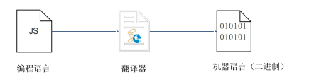
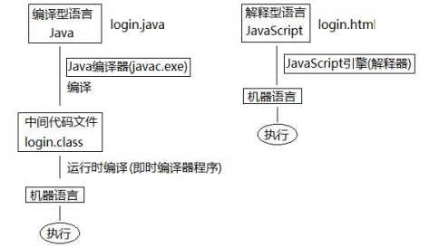
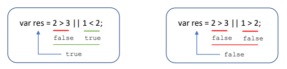
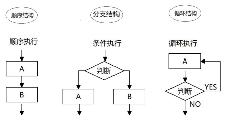
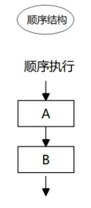
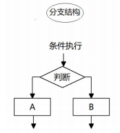
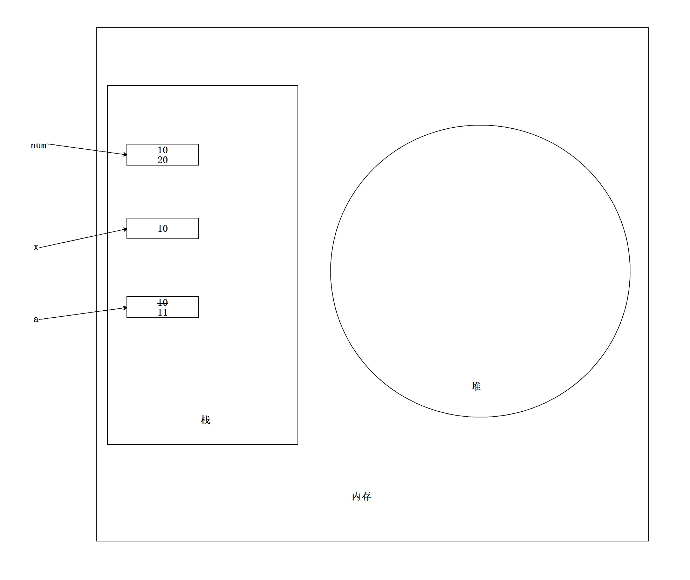
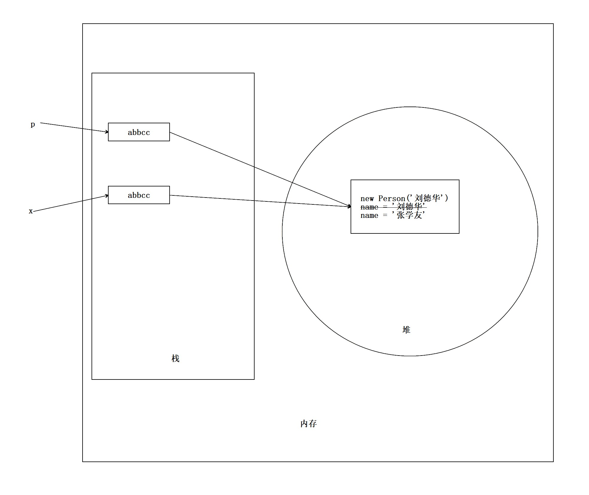

# JavaScript 学习笔记

---

# 1、计算机编程基础

---

## 1.1、编程语言

### 1.1.1、编程

==**编程**==：就是让计算机为解决某个问题而使用某种程序设计语言编写程序代码，并最终得到结果的过程。

==**计算机程序**==：就是计算机所执行的一系列的==指令集和==，而程序全都是用我们所掌握的语言来编写的，所以人们要控制计算机一定要通过计算机语言向计算机发出指令。

注意：上面所定义的计算机指的是==任何能够执行代码的设备==，可能是智能手机、ATM 机、黑莓 PI、服务器等等。

### 1.1.2、计算机语言

==**计算机语言**==指用于==人与计算机之间通讯的语言==，他是人与计算机之间传递信息的==媒介==。

计算机语言的种类非常多，总的来说可以分成==机器语言==、==汇编语言==和==高级语言==三大类。

实际上计算机最终所执行的都是==机器语言==，它是由“0”和“1”组成的二进制数，==二进制是计算机语言的基础==。

### 1.1.3、编程语言

可以通过类似人类语言的“语言”来控制计算机，让计算机为我们做事情，这样的语言就叫做编程语言（Programming Language）。

编程语言是用来控制计算机的一系列指令，它有固定的格式和词汇（不同编程语言的格式和词汇不一样），必须遵守。

如今通用的编程语言有两种形式：==汇编语言==和==高级语言==。

- ==汇编语言==和机器语言实质是相同的，都是直接对硬件操作，只不过指令采用了英文缩写的标识符，容易识别和记忆。

- ==高级语言==主要是相对于低级语言而言的，它并不是特指某一种具体的语言，而是包括了很多编程语言，常用的有 C 语言、C++、Java、C#、Python、JavaScript、Go 语言、PHP、Objective-C、Swift 等

### 1.1.4、翻译器

高级语言所编制的程序不能直接被计算机识别，必须经过转换才能被执行，为此，我们需要一个翻译器。

翻译器可以将我们所编写的源代码转换为机器语言，这也被称为二进制化。

### 1.1.5、编程语言和标记语言的区别

- ==编程语言==有很强的逻辑和行为能力，在编程语言里，你会看到很多 if else、for、while 等具有逻辑性和行为能力的指令，这是主动的
- ==标记语言==（html）不用于向计算机发出指令，常用语格式化和链接。标记语言的存在是用来被读取的，它是被动的

## 1.2、计算机基础

### 1.2.1、计算机组成


### 1.2.2、数据存储

1.  计算机内部使用二进制 0 和 1 来表示数据
2.  所有数据，包括文件、图片等最终都是以二进制数据（0 和 1）的形式存放在硬盘中的
3.  所有程序，包括操作系统，本质都是各种数据，也以二进制数据的形式存放在硬盘中。平时我们所说的安装软件，其实就是把程序文件复制到硬盘中
4.  硬盘、内存都是保存的二进制数据

### 1.2.3、数据存储单位

bit < byte < kb < GB < TB < …

- 位（bit）：1bit 可以保存一个 0 或者 1
- 字节（Byte）：1B=8b
- 千字节（KB）：1KB=1024B
- 兆字节（MB）：1MB=1024KB
- 吉字节（GB）：1GB=1024MB
- 太字节（TB）：1TB=1024GB
- ……

### 1.2.4、程序运行

1.  打开某个程序时，先从硬盘中把程序的代码加载到内存中
2.  CPU 执行内存中的代码

注意：之所以要用内存的一个重要原因，是因为 CPU 运行太快了，如果只从硬盘中读数据，会浪费 CPU 性能，才使用存取速度更快的内存来保存运行时的数据。

# 2、初识 JavaScript

---

## 2.1、初识 JavaScript

### 2.1.1、JavaScript 历史

- 布兰登·艾奇（Brendan Eich，1961 年~）
- 在 1995 年利用 10 天的时间完成 JavaScript 设计
- 网景公司最初命名为 LiveScript，后来与 Sun 公司合作之后将其改名为 JavaScript

### 2.1.2、JavaScript 是什么

- JavaScript 是世界上最流行的语言之一，是一种运行在客户端的脚本语言（Script 是脚本的意思）
- 脚本语言：不需要编译，运行过程中由 js 解释器（js 引擎）逐行来进行解释并执行
- 现在也可以基于 Node. js 技术进行服务器端编程

### 2.1.3、JavaScript 的使用

- 表单动态校验（密码强度检测）（JS 产生最初的目的）
- 网页特效
- 服务端开发（Node. js）
- 桌面程序（Electron）
- App（Cordova）
- 控制硬件-物联网（Ruff）
- 游戏开发（cocos2d-js）

### 2.1.4、浏览器执行 JS 简介

浏览器分成两部分：渲染引擎和 JS 引擎

- ==渲染引擎==：用来解析 html 和 css，俗称内核，比如 Chrome 浏览器的 blink，老版本的 webkit
- ==JS 引擎==：也称为 JS 解释器，用来读取网页中的 JavaScript 代码，对其处理后运行，比如 Chrome 浏览器的 V8

==浏览器本身并不会执行 JS 代码，而是通过内置 JavaScript 引擎（解释器）来执行 JS 代码，JS 引擎执行代码时逐行解释每一句源码（转换为机器语言），然后由计算机去执行，所以 JavaScript 语言归为脚本语言，会逐行解释执行。==

### 2.1.5、JS 的组成

JavaScript 由三部分组成：==ECMAScript（JavaScript 语法）、DOM（页面文档对象模型）、BOM（浏览器对象模型）==

**1、**==ECMAScript==是由 ECMA 国际（原欧洲计算机制造商协会）进行标准化的一门语言，这种语言在万维网上应用广泛，它往往被称为 JavaScript 或 JScript，但实际上两者都是 ECMAScript 语言的实现和扩展。

==ECMAScript 规定了 JS 的编程语法和基础核心知识，是所有浏览器厂商共同遵守的一套 JS 语法工业标准。==

**2、DOM——文档对象模型**
==文档对象模型==（Document Object Model，简称 DOM），是 W3C 组织推荐的处理可扩展标记语言的标准编程接口。

通过 DOM 提供的接口可以对页面上的各种元素进行操作（大小、位置、颜色等）。

**3、BOM——浏览器对象模型**
==BOM==（Browser Object Model，简称 BOM）是指浏览器对象模型，它提供了独立于内容的、可以与浏览器窗口进行互动的对象结构。

通过 BOM 可以操作浏览器窗口，比如弹出框、控制浏览器跳转、获取分辨率等。

### 2.1.6、JS 初体验

JS 有三种书写位置，分别为==行内==、==内嵌==和==外部==。
**1、行内式 JS**

```javascript
<input type="button" value="点我试试" onclick="alert('Hello World')" />
```

- 可以将单行或少量 JS 代码写在 HTML 标签的事件属性中（以 on 开头的属性），如 onclick
- 注意单双引号的使用，在 HTML 中我们推荐使用双引号，JS 中我们推荐使用单引号
- 可读性差，在 html 中编写大量 js 代码时，不方便阅读
- 引号易错，引号多层嵌套匹配时，非常容易弄混
- 特殊情况下使用

**2、内嵌式 JS**

```javascript
<script>
    alert('Hello World~!')
</script>
```

- 可以将多行 js 代码写到 <script> 标签中
- 内嵌 JS 是学习时常用的方式

**3、外部 JS 文件**

```javascript
<script src="my.js"></script>
```

- 利于 html 页面代码结构化，把大段 JS 代码独立到 HTML 页面之外，既美观，也方便文件级别的复用
- 引用外部 JS 文件的 script 标签中间不可以写代码
- 适合于 JS 代码量比较大的情况

## 2.2、JavaScript 注释

单行注释快捷键：Ctrl+/    样式：//
多行注释快捷键：Ctrl+Shift+/    样式：/**/

## 2.3、JavaScript 输入输出语句

为了方便信息的输入输出，JS 提供了一些输入输出语句，其常用的语句如下：

| 方法                 | 说明              | 归属  |
| ------------------ | --------------- | --- |
| alert (msg)        | 浏览器弹出警示框        | 浏览器 |
| console. log (msg) | 浏览器控制台打印输出信息    | 浏览器 |
| prompt (info)      | 浏览器弹出输入框，用户可以输入 | 浏览器 |

# 3、变量

---

## 3.1、变量概述

### 3.1.1、什么是变量

白话：变量就是一个装东西的盒子。

通俗：变量是用于存放数据的==容器==，我们通过==变量名==获取数据，甚至可以修改数据。

### 3.1.2、变量在内存中的存储

本质：变量是程序内存中申请的一块用来存放数据的空间。

## 3.2、变量的使用

变量在使用时分为两步：1. 声明变量  2. 赋值
**1、声明变量**

```javascript
 //声明变量
 var age; //声明一个名称为age的变量
```

- var 是一个 JS 关键字，用来声明变量 (variable 变量的意思)。使用该关键字声明变量后，计算机会自动为变量分配内存空间，不需要程序员管
- age 是程序员定义的变量名，我们要通过变量名来访问内存中分配的空间

**2、赋值**

```javascript
age = 10; //给age这个变量赋值为10
```

- = 用来把右边的值赋给左边的变量空间中，此处代表赋值的意思
- 变量值是程序员保存到变量空间里的值

**3、变量的初始化**

```javascript
 var age = 18; //声明变量同时赋值给18
```

声明一个变量并赋值，我们称之为==变量的初始化==。

### 案例：变量的使用

```html
<!DOCTYPE html>
<html lang="en">
 
<head>
     <meta charset="UTF-8">
     <meta name="viewport" content="width=device-width, initial-scale=1.0">
     <meta http-equiv="X-UA-Compatible" content="ie=edge">
     <title>Document</title>
     <script>
         var myname = '旗木卡卡西';
         var address = '火影村';
         var age = 30;
         var email = 'kakaxi@itcast.cn';
         var gz = 2000;
         console.log(myname);
         console.log(address);
         console.log(age);
         console.log(email);
         console.log(gz);
     </script>
</head>
 
<body>
 
</body>
</html>
```

```html
<!DOCTYPE html>
<html lang="en">

<head>
    <meta charset="UTF-8">
    <meta name="viewport" content="width=device-width, initial-scale=1.0">
    <meta http-equiv="X-UA-Compatible" content="ie=edge">
    <title>Document</title>
    <script>
        // 1. 用户输入姓名  存储到一个 myname的变量里面
        var myname = prompt('请输入您的名字');
        // 2. 输出这个用户名
        alert(myname);
    </script>
</head>
<body>
</body>
</html>
```

## 3.3、变量语法扩展

### 3.3.1、更新变量

一个变量被重新赋值后，它原有的值就会被覆盖，变量值将以最后一次赋的值为准。

```javascript
var age = 18;
age = 81; //最后的结果就是81，因为18被覆盖掉了
```

### 3.3.2、同时声明多个变量

同时声明多个变量时，只需要写一个 var，多个变量名之间使用英文逗号隔开。

```javascript
var age = 10,
        name = 'zs',
        sex = 2;
```

### 3.3.3、声明变量特殊情况

| 情况                            | 说明     | 结果        |    |
| ----------------------------- | ------ | --------- | -- |
| var age; console. log (age);  | 只声明不赋值 | undefined |    |
| console. log (age)            | 不声明不赋值 | 直接使用      | 报错 |
| age = 10; console. log (age); | 不声明只赋值 | 10        |    |

## 3.4、变量命名规范

- 由字母 (A-Z, a-z)、数字 (0-9)、下划线 (\_)、美元符号 ($) 组成，如 usrAge, num01,\_name
- 严格区分大小写，var app; 和 var App; 是两个变量
- 不能以数字开头，18age 是错误的
- 不能是关键字、保留字，例如：var、for、while
- 变量名必须有意义，MMD  BBD    nl  age
- 遵守驼峰命名法，首字母小写，后面单词的首字母要大写，如 myFirstName
- 推荐翻译网站：有道、爱词霸

### 案例：交换两个变量的值

```html
<!DOCTYPE html>
<html lang="en">

<head>
    <meta charset="UTF-8">
    <meta name="viewport" content="width=device-width, initial-scale=1.0">
    <meta http-equiv="X-UA-Compatible" content="ie=edge">
    <title>Document</title>
    <script>
        // js 是编程语言有很强的逻辑性在里面： 实现这个要求的思路 先怎么做后怎么做
        // 1. 我们需要一个临时变量帮我们
        // 2. 把apple1 给我们的临时变量 temp
        // 3. 把apple2 里面的苹果给 apple1
        // 4. 把临时变量里面的值 给 apple2
        var temp; // 声明了一个临时变量为空
        var apple1 = '青苹果';
        var apple2 = '红苹果';
        temp = apple1; // 把右边给左边
        apple1 = apple2;
        apple2 = temp;
        console.log(apple1);
        console.log(apple2);
    </script>
</head>

<body>

</body>

</html>
```

# 4、数据类型

---

## 4.1、数据类型简介

### 4.1.1、为什么需要数据类型

在计算机中，不同的数据类型所占用的存储空间是不同的，为了便于把数据分成所需内存大小不同的数据，充分利用存储空间，于是定义了不同的数据类型。

简单来说，数据类型就是数据的类别型号。比如姓名“张三”，年龄 18，这些数据的类型是不一样的。

### 4.1.2、变量的数据类型

变量是用来存储值的所在处，它们有名字和数据类型。变量的数据类型决定了如何将代表这些值的位存储到计算机的内存中。JavaScript 是一种弱类型或者说动态语言。这意味着不用提前声明变量的类型，在程序运行过程中，类型会被自动确定。

```javascript
var age = 10; // 这是一个数字型
var areYouOk = '是的'; // 这是一个字符串 
```

在代码运行时，变量的数据类型是由 JS 引擎 ==根据 = 右边变量值的数据类型来判断==的，运行完毕之后，变量就确定了数据类型。

==JavaScript 拥有动态类型，同时也意味着相同的变量可用作不同的类型：==

```javascript
var x = 6; // x 为数字
var x = "Bill"; // x 为字符串
```

### 4.1.3、数据类型的分类

JS 把数据类型分为两类：

- 简单数据类型 （Number, String, Boolean, Undefined, Null）
- 复杂数据类型 （object)

## 4.2、简单数据类型

### 4.2.1、简单数据类型（基本数据类型）

JavaScript 中的简单数据类型及其说明如下：

| 简单数据类型    | 说明                                   | 默认值       |
| --------- | ------------------------------------ | --------- |
| Number    | 数字型，包含整型值和浮点型值，如 21、0.21             | 0         |
| Boolean   | 布尔值类型，如 true、false，等价于 1 和 0         | false     |
| String    | 字符串类型，如“张三”，注意在 JS 中，字符串都要带引号        | ""        |
| Undefined | var a; 声明了变量 a 但是没有给值，此时 a=undefined | undefined |
| Null      | var a = null; 声明了变量 a 为空值            | null      |

### 4.2.2、数字型 Number

JavaScript 数字类型既可以用来保存整数值，也可以保存小数 (浮点数）。

```js
var age = 21; // 整数
var Age = 21.3747; // 小数
```

**1. 数字型进制**
最常见的进制有==二进制、八进制、十进制、十六进制==。

```javascript
// 1.八进制数字序列范围：0~7
var num1 = 07; // 对应十进制的7
var num2 = 019; // 对应十进制的19
var num3 = 08; // 对应十进制的8
// 2.十六进制数字序列范围：0~9以及A~F
var num = 0xA; 
```

现阶段我们只需要记住，==在 JS 中八进制前面加 0，十六进制前面加 0x==

**2. 数字型范围**
JavaScript 中数值的最大和最小值

```javascript
alert(Number.MAX_VALUE); // 1.7976931348623157e+308
alert(Number.MIN_VALUE); // 5e-324
```

- 最大值：Number. MAX_VALUE，这个值为： 1.7976931348623157e+308
- 最小值：Number. MIN_VALUE，这个值为：5e-32

**1. 数字型三个特殊值**

```javascript
alert(Infinity); // Infinity
alert(-Infinity); // -Infinity
alert(NaN); // NaN
```

- Infinity ，代表无穷大，大于任何数值
- -Infinity ，代表无穷小，小于任何数值
- NaN ，Not a number，代表一个非数值

**4. isNaN () **

用来判断一个变量是否为非数字的类型，返回 true 或者 false

```js
var usrAge = 21;
var isOk = isNaN(userAge);
console.log (isNum); // false ，21 不是一个非数字
var usrName = "andy";
console.log (isNaN(userName)); // true ，"andy"是一个非数字
```

### 4.2.3、字符串型 String

字符串型可以是引号中的任意文本，其语法为 ==双引号 ""== 和 ==单引号''==

```javascript
var strMsg = "我爱北京天安门~"; // 使用双引号表示字符串
var strMsg2 = '我爱吃猪蹄~'; // 使用单引号表示字符串
// 常见错误
var strMsg3 = 我爱大肘子; // 报错，没使用引号，会被认为是js代码，但js没有这些语法
```

因为 HTML 标签里面的属性使用的是双引号，JS 这里我们==更推荐使用单引号==。

1.  字符串引号嵌套

JS 可以用==单引号嵌套双引号== ，或者==用双引号嵌套单引号 (外双内单，外单内双)==

```javascript
var strMsg = '我是"高帅富"程序猿'; // 可以用''包含""
var strMsg2 = "我是'高帅富'程序猿"; // 也可以用"" 包含'' // 常见错误
var badQuotes = 'What on earth?"; // 报错，不能 单双引号搭配
```

2.  字符串转义符

类似 HTML 里面的特殊字符，字符串中也有特殊字符，我们称之为转义符。
转义符都是 \ 开头的，常用的转义符及其说明如下：

| 转义符  | 解释说明                |
| ---- | ------------------- |
| \n   | 换行符，n 是 newline 的意思 |
| \ \\ | 斜杠 \\               |
| ' '  | 单引号                 |
| " ”  | 双引号                 |
| \t   | tab 缩进              |
| \b   | 空格，b 是 blank 的意思    |

### 案例：弹出网页警示框

```html
<!DOCTYPE html>
<html lang="en">

<head>
    <meta charset="UTF-8">
    <meta name="viewport" content="width=device-width, initial-scale=1.0">
    <meta http-equiv="X-UA-Compatible" content="ie=edge">
    <title>Document</title>
    <script>
        alert('酷热难耐，火辣的太阳底下，我挺拔的身姿，成为了最为独特的风景。\n我审视四周，这里，是我的舞台，我就是天地间的王者。\n这一刻，我豪气冲天，终于大喊一声："收破烂啦～"');
    </script>
</head>

<body>

</body>

</html>
```

**3. 字符串长度**
字符串是由若干字符组成的，这些字符的数量就是字符串的长度。通过字符串的 length 属性可以获取整个字符串的长度。

```javascript
var strMsg = "我是帅气多金的程序猿！";
alert(strMsg.length); // 显示 11
```

**4. 字符串拼接**

- 多个字符串之间可以使用 + 进行拼接，其拼接方式为 ==字符串 + 任何类型 = 拼接之后的新字符串==
- 拼接前会把与字符串相加的任何类型转成字符串，再拼接成一个新的字符串

```JavaScript
//1.1 字符串 "相加" 
alert('hello' + ' ' + 'world'); // hello world
//1.2 数值字符串 "相加" 
alert('100' + '100'); // 100100
//1.3 数值字符串 + 数值
alert('11' + 12); // 1112 
```

==**+ 号总结口诀：数值相加，字符相连**==

**5. 字符串拼接加强**

```javascript
console.log('pink老师' + 18); // 只要有字符就会相连
var age = 18;
// console.log('pink老师age岁啦'); // 这样不行哦
console.log('pink老师' + age); // pink老师18
console.log('pink老师' + age + '岁啦'); // pink老师18岁啦
```

- 我们经常会将字符串和变量来拼接，因为变量可以很方便地修改里面的值
- 变量是不能添加引号的，因为加引号的变量会变成字符串
- 如果变量两侧都有字符串拼接，口诀“==引引加加==”，删掉数字，变量写加中间

### 案例：显示年龄

```javascript
// 弹出一个输入框（prompt)，让用户输入年龄（用户输入）
// 把用户输入的值用变量保存起来,把刚才输入的年龄与所要输出的字符串拼接 （程序内部处理）
// 使用alert语句弹出警示框（输出结果）
var age = prompt('请输入您的年龄');
var str = '您今年已经' + age + '岁了';
alert(str);
```

### 4.2.5、布尔型 Boolean

布尔类型有两个值：true 和 false ，其中 true 表示真（对），而 false 表示假（错）。
布尔型和数字型相加的时候， true 的值为 1 ，false 的值为 0。

```javascript
console.log(true + 1); // 2
console.log(false + 1); // 1
```

### 4.2.6、Undefined 和 Null

一个声明后没有被赋值的变量会有一个默认值 undefined ( 如果进行相连或者相加时，注意结果）

```javascript
var variable;
console.log(variable); // undefined
console.log('你好' + variable); // 你好undefined
console.log(11 + variable); // NaN
console.log(true + variable); // NaN
```

一个声明变量给 null 值，里面存的值为空（学习对象时，我们继续研究 null)

```javascript
var vari = null;
console.log('你好' + vari); // 你好null
console.log(11 + vari); // 11
console.log(true + vari); // 1
```

## 4.3、获取变量数据类型

### 4.3.1、获取检测变量的数据类型

typeof 可用来获取检测变量的数据类型

```javascript
var num = 18;
console.log(typeof num) // 结果 number
```

**不同类型的返回值**

| 类型        | 案例               | 结果          |
| --------- | ---------------- | ----------- |
| String    | typeof "小白"      | "string"    |
| Number    | typeof 18        | "number"    |
| Boolean   | typeof true      | "boolean"   |
| Undefined | typeof undefined | "undefined" |
| Null      | typeof null      | "object"    |

### 4.3.2、字面量

字面量是在源代码中一个固定值的表示法，通俗来说，就是字面量表示如何表达这个值。

- 数字字面量：8,9, 10
- 字符串字面量：'黑马程序员', "大前端"
- 布尔字面量：true，false

## 4.4、数据类型转换

### 4.4.1、什么是数据类型转换

使用表单、prompt 获取过来的数据默认是字符串类型的，此时就不能直接简单的进行加法运算，而需要转换变量的数据类型。通俗来说，就是==把一种数据类型的变量转换成另外一种数据类型==。
我们通常会实现 3 种方式的转换：

- 转换为字符串类型
- 转换为数字型
- 转换为布尔型

### 4.4.2、转换为字符串

| 方式          | 说明             | 案例                                     |
| ----------- | -------------- | -------------------------------------- |
| toString () | 转成字符串          | var num = 1; alert (num. toString ()); |
| String ()   | 强制转换转成字符串      | var num = 1; alert (String (num));     |
| ==加号拼接字符串== | 和字符串拼接的结果都是字符串 | var num = 1; alert (num + "我是字符串");    |

- toString () 和 String () 使用方式不一样。
- 三种转换方式，我们更喜欢用第三种加号拼接字符串转换方式，这一种方式也称之为隐式转换。

### 4.4.3、转换为数字型

| 方式                                      | 说明                      | 案例                   |
| --------------------------------------- | ----------------------- | -------------------- |
| parseInt (string)                       | 函数将 string 类型转成整数数值型    | parselnt ("78")      |
| parseFloat (string)                     | 将 string 类型转换成浮点数数值型    | parseFloat ("78,21") |
| Number ()                               | 强制转换函数将 string 类型转换为数值型 | Number ('12')        |
| js 隐式转换(- * /)| 利用算术运算隐式转换为数值型| '12' - 0 |                         |                      |

- 注意 parseInt 和 parseFloat ==单词的大小写==，这 2 个是重点
- 隐式转换是我们在进行算数运算的时候，JS 自动转换了数据类型

### 案例 1：计算年龄

此案例要求在页面中弹出一个输入框，我们输入出生年份后，能计算出我们的年龄

```javascript
// 1. 弹出输入框，输入出生年份，并存储在变量中
var year = prompt('请输入您的出生年份：'); // 用户输入
// 2. 用今年减去刚才输入的年份 
var result = 2019 - year; // 程序内部处理
// 3. 弹出提示框 
alert('您的年龄是:' + result + '岁'); // 输出结果
```

### 案例 2：简单加法器

计算两个数的值，用户输入第一个值后，继续弹出第二个输入框并输入第二个值，最后通过弹出窗口显示出两次输入值相加的结果。

```javascript
// 1. 先弹出第一个输入框，提示用户输入第一个值
var num1 = prompt('请输入第一个值：');
// 2. 再弹出第二个框，提示用户输入第二个值
var num2 = prompt('请输入第二个值：');
// 3. 将输入的值转换为数字型后，把这两个值相加，并将结果赋给新的变量 var result = parseFloat(num1) + parseFloat(num2);
// 4. 弹出结果
alert('结果是:' + result);
```

### 4.4.4、转换为布尔型

| 方式            | 说明         | 案例                |
| ------------- | ---------- | ----------------- |
| Boolean () 函数 | 将其他类型转成布尔值 | Boolean ('true'); |

- 代表空、否定的值会被转换为 false ，如 ''、0、NaN、null、undefined
- 其余值都会被转换为 true

```javascript
console.log(Boolean('')); // false
console.log(Boolean(0)); // false
console.log(Boolean(NaN)); // false
console.log(Boolean(null)); // false
console.log(Boolean(undefined)); // false
console.log(Boolean('小白')); // true
console.log(Boolean(12)); // true
```

# 5、扩展阅读

---

## 5.1、解释型语言和编译型语言

### 5.1.1、概述

计算机不能直接理解任何除机器语言以外的语言，所以必须要把程序员所写的程序语言翻译成机器语言才能执行程序。程序语言翻译成机器语言的工具，被称为翻译器。


- 翻译器翻译的方式有两种：一个是==编译==，另外一个是==解释==。两种方式之间的区别在于==翻译的时间点不同==
- 编译器是在==代码执行之前进行编译==，生成中间代码文件
- 解释器是在==运行时进行及时解释=，并立即执行 (当编译器以解释方式运行的时候，也称之为解释器)

### 5.1.2、执行过程


类似于请客吃饭：

- 编译语言：首先把所有菜做好，才能上桌吃饭
- 解释语言：好比吃火锅，边吃边涮，同时进行

## 5.2、标识符、关键字、保留字

### 4.2.1、标识符

标识 (zhi) 符：就是指开发人员为变量、属性、函数、参数取的名字。
==标识符不能是关键字或保留字==。

### 5.2.2、关键字

关键字：是指 JS 本身已经使用了的字，不能再用它们充当变量名、方法名。

包括：break、case、catch、continue、default、delete、do、else、finally、for、function、if、in、instanceof、new、return、switch、this、throw、try、typeof、var、void、while、with 等。

### 5.2.3、保留字

保留字：实际上就是预留的“关键字”，意思是现在虽然还不是关键字，但是未来可能会成为关键字，同样不能使用它们当变量名或方法名。

包括：boolean、byte、char、class、const、debugger、double、enum、export、extends、fimal、float、goto、implements、import、int、interface、long、mative、package、private、protected、public、short、static、super、synchronized、throws、transient、volatile 等。

==注意==：如果将保留字用作变量名或函数名，那么除非将来的浏览器实现了该保留字，否则很可能收不到任何错误消息。当浏览器将其实现后，该单词将被看做关键字，如此将出现关键字错误。

# 6、JavaScript 运算符

---

## 6.1、运算符

运算符（operator）也被称为==操作符==，是用于实现赋值、比较和执行算数运算等功能的符号。

JavaScript 中常用的运算符有：

- 算数运算符
- 递增和递减运算符
- 比较运算符
- 逻辑运算符
- 赋值运算符

## 6.2、算数运算符

### 6.2.1、算术运算符概述

概念：算术运算使用的符号，用于执行两个变量或值的算术运算。

| 操作符 |        描述        |       实例      |
| :-: | :--------------: | :-----------: |
|  +  |         加        |  10 + 20 = 30 |
|  -  |         减        |  10-20 = -10  |
|  *  |         乘        | 10 * 20 = 200 |
|  /  |         除        | 10 / 20 = 0.5 |
|  %  | 取余数 (取模) 返回除法的余数 |    9% 2 = 1   |

### 6.2.2、浮点数的精度问题

浮点数值的最高精度是 17 位小数，但在进行算术计算时其精确度远远不如整数。

```javascript
var result = 0.1 + 0.2; // 结果不是 0.3，而是：0.30000000000000004
console.log(0.07 * 100); // 结果不是 7， 而是：7.000000000000001
```

所以：==**不要直接判断两个浮点数是否相等 !**==

### 6.2.3、课堂提问

**1. 我们怎么判断一个数能够被整除呢？**
==它的余数是 0 就说明这个数能被整除，这就是 % 取余运算符的主要用途==

**2. 请问 1 + 2 * 3 结果是？**
==结果是 7 ，注意算术运算符优先级的，先乘除，后加减，有小括号先算小括号里面的==

### 6.2.4、表达式和返回值

表达式：是由数字、运算符、变量等以能求得数值的有意义排列方法所得的组合

简单理解：是由数字、运算符、变量等组成的式子

==表达式最终都会有一个结果，返回给我们，我们称为返回值==

## 6.3、递增和递减运算符

### 6.3.1、递增和递减运算符概述

如果需要反复给数字变量添加或减去 1，可以使用==递增（++）==和==递减（ -- ）==运算符来完成。

在 JavaScript 中，递增（++）和递减（ -- ）既可以==放在变量前面==，也可以放在变量后面。放在变量前面时，我们可以称为==前置递增（递减）运算符==，==放在变量后面==时，我们可以称为==后置递增（递减）运算符==。

==注意：递增和递减运算符必须和变量配合使用==。

### 6.3.2、递增运算符

**1. 前置递增运算符**
==++num== 前置递增，就是自加 1，类似于 num = num + 1，但是 ++num 写起来更简单。

使用口诀：==**先自加，后返回值**==

```javascript
var num = 10;
alert(++num + 10); // 21
```

**2. 后置递增运算符**
==num++== 后置递增，就是自加 1，类似于 num = num + 1 ，但是 num++ 写起来更简单。

使用口诀：==**先返回原值，后自加**==

```javascript
var num = 10;
alert(10 + num++); // 20
```

### 练习

```javascript
var a = 10;
++a;
var b = ++a + 2;
console.log(b);
var c = 10;
c++;
var d = c++ + 2;
console.log(d);
var e = 10;
var f = e++ + ++e;
console.log(f);
```

### 6.3.3、前置递增和后置递增小结

- 前置递增和后置递增运算符可以简化代码的编写，让变量的值 + 1 比以前写法更简单
- 单独使用时，运行结果相同
- 与其他代码联用时，执行结果会不同
- 后置：先原值运算，后自加（先人后己）
- 前置：先自加，后运算（先已后人）
- 开发时，大多使用后置递增/减，并且代码独占一行，例如：num++; 或者 num--;

## 6.4、比较运算符

### 6.4.1、比较运算符概述

概念：比较运算符（关系运算符）是两个数据进行比较时所使用的运算符，比较运算后，会返回一个布尔值（true / false）作为比较运算的结果。

|    运算符名称   |       说明       |         案例        |  结果 |
| :--------: | :------------: | :---------------: | :-: |
| < |       小于号      |     1 < 2| true    |
|     >.     |       大于号      |    1 > 2| false    |
|     >=     | 大于等于号 (大于或者等于) |    2 >= 2| true    |
|     <=     | 小于等于号 (小于或者等于) |    3 <= 2 |false   |
|     ==     |    判等号 (会转型)   |   37 == 37 |true   |
|     !=     |       不等号      |   37 != 37 |false  |
| \===    \!== |  全等要求值和数据类型都一致 | 37 === '37'| false |

### 6.4.2、= 小结

|  符号 |  作用 |          用法          |
| :-: | :-: | :------------------: |
|  =  |  赋值 |        把右边赋给左边       |
|  == |  判断 | 判断两边值是否相等（注意此时有隐式转换） |
| === |  全等 |   判断两边的值和数据类型是否完全相同  |

```javascript
console.log(18 == '18');
console.log(18 === '18'); 
```

### 练习

```javascript
var num1 = 10;
var num2 = 100;
var res1 = num1 > num2; 
var res2 = num1 == 11; 
var res3 = num1 != num2; 
```

## 6.5、逻辑运算符

### 6.5.1、逻辑运算符概述

概念：逻辑运算符是用来进行布尔值运算的运算符，其返回值也是布尔值。后面开发中经常用于多个条件的判断

| 逻辑运算符 |        说明       |       案例      |
| :---: | :-------------: | :-----------: |
|   &&  | "逻辑与"，简称"与" and |  true &&false |
|   \|\|    |  "逻辑或"，简称"或”or | true \|\| false|
|   !   |   "逻辑非"，简称"非"   |   not ! true  |

### 6.5.2、逻辑与&&

==**两边都是 true 才返回 true，否则返回 false**==


### 6.5.3、逻辑或 ||

==**两边都为 false 才返回 false，否则都为 true**==


### 6.5.4、逻辑非 ！

逻辑非（!）也叫作==取反符==，用来取一个布尔值相反的值，如 true 的相反值是 false

```javascript
var isOk = !true;
console.log(isOk); // false
```

### 练习

```javascript
var num = 7;
var str = "我爱你~中国~";
console.log(num > 5 && str.length >= num); // true   true    true
console.log(num < 5 && str.length >= num); // false  true  false
console.log(!(num < 10)); // !true  false
console.log(!(num < 10 || str.length == num)); // !(true || true)   false
```

### 6.5.5、短路运算（逻辑中断）

**短路运算的原理**：==当有多个表达式（值）时, 左边的表达式值可以确定结果时, 就不再继续运算右边的表达式的值==;
**1. 逻辑与**

- 语法： ==表达式 1 && 表达式 2==
- 如果第一个表达式的值为真，则返回表达式 2
- 如果第一个表达式的值为假，则返回表达式 1

```javascript
console.log( 123 && 456 ); // 456
console.log( 0 && 456 ); // 0
console.log( 123 && 456&& 789 ); // 789
// 0  ''  null  undefined  NaN 这些为假，其余都为真
console.log( '' && 456&& 789 ); // ''
```

**2. 逻辑或**

- 语法： ==表达式 1 || 表达式 2==
- 如果第一个表达式的值为真，则返回表达式 1
- 如果第一个表达式的值为假，则返回表达式 2

```javascript
console.log( 123 || 456 ); // 123
console.log( 0 || 456 ); // 456
console.log( 123 || 456 || 789 ); // 123
var num = 0;
console.log(123 || num++); // 123   后面不会执行
console.log(num);  // 0
```

## 6.6、赋值运算符

概念：用来把数据赋值给变量的运算符。

|   赋值运算符  |     说明     |               案例              |
| :------: | :--------: | :---------------------------: |
|     =    |    直接赋值    |      var usrName = '我是值'；     |
|   +=、-=  | 加、减一个数后在赋值 | var age = 10; age += 5; // 15 |
| \*=、/=、%= | 乘、除、取模后在赋值 |  var age = 2; age \*= 5; // 10 |

```javascript
var age = 10;
age += 5; // 相当于 age = age + 5;
age -= 5; // 相当于 age = age - 5;
age *= 10; // 相当于 age = age* 10;
```

## 6.7、运算符优先级

| 优先级 |  运算符  |        顺序        |
| :-: | :---: | :--------------: |
|  1  |  小括号  |        ()        |
|  2  | 一元运算符 |     ++  --  !    |
|  3  | 算数运算符 |    先* / % 后+ -   |
|  4  | 关系运算符 |     >>= < <=     |
|  5  | 相等运算符 | \==  \!=  \===  \!== |
|  6  | 逻辑运算符 |      先 && 后      |
|  7  | 赋值运算符 |         =        |
|  8  | 逗号运算符 |         ,        |

- 一元运算符里面的==逻辑非优先级很高==
- 逻辑与比逻辑或优先级高

### 练习 1

```javascript
console.log( 4 >= 6 || '人' != '阿凡达' && !(12 *2 == 144) && true); // false || true && true && true   ------>   true
var num = 10;
console.log( 5 == num / 2 && (2 + 2* num).toString() ===‘22’)；// true && true ------>  true

练习2
var a = 3 > 5 && 2 < 7 && 3 == 4;  // false && true && false
console.log(a);  // false
var b = 3 <= 4 || 3 > 1 || 3 != 2;  // true || true || true
console.log(b);  // true
var c = 2 === "2";  // false
console.log(c);  // false
var d = !c || b && a ; // true || true && false
console.log(d); // true
```

# 7、JavaScript 流程控制-分支

---

## 7.1、流程控制

在一个程序执行的过程中，各条代码的执行顺序对程序的结果是有直接影响的。很多时候我们要通过控制代码的执行顺序来实现我们要完成的功能。

简单理解： 流程控制就是来控制我们的代码按照什么结构顺序来执行

流程控制主要有三种结构，分别是顺序结构、分支结构和循环结构，这三种结构代表三种代码执行的顺序。


## 7.2、顺序流程控制

顺序结构是程序中最简单、最基本的流程控制，它没有特定的语法结构，程序会==按照代码的先后顺序，依次执行==，程序中大多数的代码都是这样执行的。


## 7.3、分支流程控制 if 语句

### 7.3.1、分支结构

由上到下执行代码的过程中，根据不同的条件，执行不同的路径代码（执行代码多选一的过程），从而得到不同的结果

JS 语言提供了两种分支结构语句

- if 语句
- switch 语句

### 7.3.2、if 语句

**1. 语法结构**

```javascript
// 条件成立执行代码，否则什么也不做
if (条件表达式) {
    // 条件成立执行的代码语句
}
```

语句可以理解为一个行为，循环语句和分支语句就是典型的语句。一个程序由很多个语句组成，一般情况下，会分割成一个一个的语句。

**2. 执行流程**


### 案例：进入网吧

弹出一个输入框，要求用户输入年龄，如果年龄大于等于 18 岁，允许进网吧。

```javascript
var usrAge = prompt('请输入您的年龄：');
if(usrAge >= 18){
    alert('您的年龄合法，欢迎来天际网吧享受学习的乐趣！');
}
```

### 7.3.3、if else 语句（双分支语句）

**1. 语法结构**

```javascript
// 条件成立 执行 if 里面代码，否则执行else 里面的代码
if (条件表达式) {
    // [如果] 条件成立执行的代码
} else {
    // [否则] 执行的代码
}
```

**2. 执行流程**


### 案例：判断闰年

接收用户输入的年份，如果是闰年就弹出闰年，否则弹出是平年

```javascript
if (year % 4 == 0 && year % 100 != 0 || year % 400 == 0) {
    alert("这个年份是闰年");
} else { // 剩下的是平年
    alert("这个年份是平年");
}
```

### 案例：判断是否中奖

接收用户输入的姓名，来判断是否中奖，如果输入的是刘德华，则提示中了 5 块钱，否则提示没有中奖。

```javascript
// 算法 如果你叫刘德华 恭喜您中奖了，否则没有中奖
// 获得用户名
var username = prompt("请输入您的姓名："); 
    if( username == "刘德华") {
        alert("恭喜发财");
    } else {
        alert("谢谢惠顾,欢迎下次再来");
}
```

### 7.3.4、if else if 语句 (多分支语句)

**1. 语法结构**

```javascript
// 适合于检查多重条件。
if (条件表达式1) {
    语句1；
} else if (条件表达式2) {
    语句2；
} else if (条件表达式3) {
    语句3；
    ....
} else {
    // 上述条件都不成立执行此处代码
}
```

**2. 执行流程**


### 案例：判断成绩级别

要求：接收用户输入的分数，根据分数输出对应的等级字母 A、B、C、D、E。

其中：

1.  90 分 (含) 以上，输出：A
2.  80 分 (含)~ 90 分 (不含)，输出：B
3.  70 分 (含)~ 80 分 (不含)，输出：C
4.  60 分 (含)~ 70 分 (不含)，输出：D
5.  60 分 (不含) 以下，输出： E

```javascript
var score = prompt('请您输入分数:');
if (score >= 90) {
    alert('宝贝，你是我的骄傲');
} else if (score >= 80) {
    alert('宝贝，你已经很出色了');
} else if (score >= 70) {
    alert('你要继续加油喽');
} else if (score >= 60) {
    alert('孩子，你很危险');
} else {
    alert('熊孩子，我不想和你说话，我只想用鞭子和你说话');
```

## 7.4、三元表达式

三元表达式也能做一些简单的条件选择。有三元运算符组成的式子称为三元表达式

**1. 语法结构**

```javascript
表达式1 ? 表达式2 : 表达式3;
```

**2. 执行思路**

- 如果表达式 1 为 true ，则返回表达式 2 的值，如果表达式 1 为 false，则返回表达式 3 的值
- 简单理解： 就类似于 if else （双分支） 的简写

### 案例：数字补 0

用户输入数字，如果数字小于 10，则在前面补 0 ，比如 01，09 ，如果数字大于 10，则不需要补，比如 20。

```javascript
var time = prompt('请您输入一个 0 ~ 59 之间的一个数字');
// 三元表达式 表达式 ？ 表达式1 ：表达式2
var result = time < 10 ? '0' + time : time; // 把返回值赋值给一个变量
alert(result);
```

## 7.5、分支流程控制 switch 语句

### 7.5.1、语法结构

switch 语句也是多分支语句，它用于基于不同的条件来执行不同的代码。当要针对变量设置一系列的特定值的选项时，就可以使用 switch。

```javascript
switch( 表达式 ){
    case value1:
        // 表达式 等于 value1 时要执行的代码
        break;
    case value2:
        // 表达式 等于 value2 时要执行的代码
        break;
    default:
            // 表达式 不等于任何一个 value 时要执行的代码
}
```

- switch ：开关转换， case ：小例子选项
- 关键字 switch 后面括号内可以是表达式或值，通常是一个变量
- 关键字 case , 后跟一个选项的表达式或值，后面跟一个冒号
- switch 表达式的值会与结构中的 case 的值做比较
- 如果存在匹配全等 (===) ，则与该 case 关联的代码块会被执行，并在遇到 break 时停止，整个 switch 语句代码执行结束
- 如果所有的 case 的值都和表达式的值不匹配，则执行 default 里的代码

==**注意： 执行 case 里面的语句时，如果没有 break，则继续执行下一个 case 里面的语句。**==

### 案例：查询水果

用户在弹出框里面输入一个水果，如果有就弹出该水果的价格，如果没有该水果就弹出“没有此水果”。

```javascript
var fruit = prompt('请您输入查询的水果:');
switch (fruit) {
    case '苹果':
        alert('苹果的价格是 3.5/斤');
        break;
    case '榴莲':
        alert('榴莲的价格是 35/斤');
        break;
    default:
        alert('没有此水果');
}
```

### 7.5.2、switch 语句和 if else if 语句的区别

1.  一般情况下，它们两个语句可以相互替换
2.  switch... case 语句通常处理 case 为比较确定值的情况，而 if…else…语句更加灵活，常用于范围判断 (大于、等于某个范围)
3.  switch 语句进行条件判断后直接执行到程序的条件语句，效率更高。而 if…else 语句有几种条件，就得判断多少次。
4.  当分支比较少时，if… else 语句的执行效率比 switch 语句高。
5.  当分支比较多时，switch 语句的执行效率比较高，而且结构更清晰。

# 8、JavaScript 流程控制-循环

---

## 8.1、循环

**循环目的**
在实际问题中，有许多==具有规律性的重复操作==，因此在程序中要完成这类操作就需要==重复执行某些语句==

**JS 中的循环**
在 Js 中，主要有三种类型的循环语句：

- for 循环
- while 循环
- do... while 循环

## 8.2、for 循环

在程序中，一组被重复执行的语句被称之为==循环体==，能否继续重复执行，取决于循环的==终止条件==。由循环体及循环的终止条件组成的语句，被称之为==循环语句==。

### 8.2.1、语法结构

for 循环主要用于把某些代码循环若干次，通常跟计数有关系。其语法结构如下：

```javascript
for(初始化变量; 条件表达式; 操作表达式 ){
    //循环体
}
```

- ==初始化变量==：通常被用于初始化一个计数器，该表达式可以使用 var 关键字声明新的变量，这个变量帮我们来记录次数。
- ==条件表达式==：用于确定每一次循环是否能被执行。如果结果是 true 就继续循环，否则退出循环。
- ==操作表达式==：每次循环的最后都要执行的表达式。通常被用于更新或者递增计数器变量。当然，递减变量也是可以的。

```javascript
for( 初始化变量; 条件表达式; 操作表达式 ){
    //循环体语句
}
```

**执行过程：**

1.  初始化变量，==**初始化操作在整个 for 循环只会执行一次**==。
2.  执行条件表达式，如果为 true，则执行循环体语句，否则退出循环，循环结束。
3.  执行操作表达式，此时第一轮结束。
4.  第二轮开始，直接去执行条件表达式（不再初始化变量），如果为 true ，则去执行循环体语句，否则退出循环。
5.  继续执行操作表达式，第二轮结束。
6.  后续跟第二轮一致，直至条件表达式为假，结束整个 for 循环。

**断点调试：**
断点调试是指自己在程序的某一行设置一个断点，调试时，程序运行到这一行就会停住，然后你可以一步一步往下调试，调试过程中可以看各个变量当前的值，出错的话，调试到出错的代码行即显示错误，停下。

==**断点调试可以帮我们观察程序的运行过程**==
浏览器中按 F12--> sources -->找到需要调试的文件-->在程序的某一行设置断点

Watch: 监视，通过 watch 可以监视变量的值的变化，非常的常用。

F11: 程序单步执行，让程序一行一行的执行，这个时候，观察 watch 中变量的值的变化。

### 8.2.2、for 循环重复相同的代码

for 循环可以重复相同的代码，比如我们要输出 10 句“媳妇我错了”

```javascript
// 基本写法
for (var i = 1; i <= 10; i++) {
    console.log('媳妇我错了~');
}
// 用户输入次数
var num = prompt('请输入次数:')；
for (var i = 1; i <= num; i++) {
    console.log('媳妇我错了~');
}
```

### 8.2.3、for 循环重复不相同的代码

for 循环还可以重复不同的代码，这主要是因为使用了计数器，计数器在每次循环过程中都会有变化。

例如，求输出一个人 1 到 100 岁：

```javascript
// 基本写法
for (var i = 1; i <= 100; i++) {
    console.log('这个人今年' + i + '岁了');
}
```

for 循环还可以重复不同的代码，这主要是因为使用了计数器，计数器在每次循环过程中都会有变化。

例如，求输出一个人 1 到 100 岁：

```javascript
// for 里面是可以添加其他语句的
for (var i = 1; i <= 100; i++) {
    if (i == 1) {
        console.log('这个人今年1岁了， 它出生了');
    } else if (i == 100) {
        console.log('这个人今年100岁了，它死了');
    } else {
        console.log('这个人今年' + i + '岁了');
    }
}
```

### 8.2.4、for 循环重复某些相同操作

for 循环因为有了计数器的存在，我们还可以重复的执行某些操作，比如做一些算术运算。

### 案例 1：求 1-100 之间所有整数的累加和

```javascript
var sum = 0;
for (var i = 1; i <= 100; i++) {
    sumNum += i;
}
console.log('1-100之间整数的和 = ' + sum);
```

### 案例 2：求学生成绩

要求用户输入班级人数，之后依次输入每个学生的成绩，最后打印出该班级总的成绩以及平均成绩。

```javascript
var num = prompt('请输入班级总的人数:'); // num 班级总的人数
var sum = 0; // 总成绩
var average = 0; // 平均成绩
for (var i = 1; i <= num; i++) {
    var score = prompt('请输入第' + i + '个学生的成绩');
    sum = sum + parseFloat(score);
}
average = sum / num;
alert('班级总的成绩是：' + sum);
alert('班级总的平均成绩是：' + average);
```

### 案例 3：一行打印五个星星


我们采取追加字符串的方式，这样可以打印到控制台上。

```javascript
var star = '';
for (var i = 1; i <= 5; i++) {
    star += '☆'
}
console.log(star);
```

## 8.3、双重 for 循环

### 8.3.1、双重 for 循环概述

很多情况下，单层 for 循环并不能满足我们的需求，比如我们要打印一个 5 行 5 列的图形、打印一个倒直角三角形等，此时就可以通过循环嵌套来实现。

循环嵌套是指在一个循环语句中再定义一个循环语句的语法结构，例如在 for 循环语句中，可以再嵌套一个 for 循环，这样的 for 循环语句我们称之为双重 for 循环。

### 8.3.2、双重 for 循环语法

```javascript
for (外循环的初始;外循环的条件;外循环的操作表达式) {
    for (内循环的初始;内循环的条件;内循环的操作表达式) {需执行的代码;
    }
}
```

- 内层循环可以看做外层循环的语句
- 内层循环执行的顺序也要遵循 for 循环的执行顺序
- 外层循环执行一次，内层循环要执行全部次数

### 8.3.3、打印五行五列星星

核心：

1.  内层循环负责一行打印五个星星
2.  外层循环负责打印五行

```javascript
var star = '';
for (var j = 1; j <= 3; j++) {
    for (var i = 1; i <= 3; i++) {
        star += '☆'
    }
    // 每次满 5个星星 就 加一次换行
    star += '\n'
}
console.log(star);
```

### 案例 1：打印 n 行 n 列的星星

要求用户==输入行数和列数==，之后在控制台打印出用户输入行数和列数的星星。

```javascript
var row = prompt('请输入您打印几行星星:');
var col = prompt('请输入您打印几列星星:');
var str = '';
for (var i = 1; i <= row; i++) {
    for (j = 1; j <= col; j++) {
        str += '☆';
    }
    str += '\n';
}
console.log(str);
```

### 案例 2：打印倒三角形


```javascript
var row = prompt('请输入您打印几行星星:');
var col = prompt('请输入您打印几列星星:');
var str = '';
for (var i = 1; i <= row; i++) {
    for (j = 1; j <= col; j++) {
        str += '☆';
    }
    str += '\n';
}
console.log(str);

案例3：打印九九乘法表  
var str = ''
for (var i = 1; i <= 9; i++) { // 外层for控制 行数 9行
    for (var j = 1; j <= i; j++) { // j 控制列数 列数和行数是一样的 j <= i 
        str += j + " × " + i + " = " + i * j + '\t';
    }
    str += '\n';
}
console.log(str);
```

### 8.3.5、for 循环小结

- for 循环可以重复执行某些相同代码
- for 循环可以重复执行些许不同的代码，因为我们有计数器
- for 循环可以重复执行某些操作，比如算术运算符加法操作
- 随着需求增加，双重 for 循环可以做更多、更好看的效果
- 双重 for 循环，外层循环一次，内层 for 循环全部执行
- for 循环是循环条件和数字直接相关的循环
- 分析要比写代码更重要
- 一些核心算法想不到，但是要学会，分析它执行过程
- 举一反三，自己经常总结，做一些相似的案例

## 8.4、while 循环

while 语句可以在条件表达式为真的前提下，循环执行指定的一段代码，直到表达式不为真时结束循环。

```javascript
while语句的语法结构如下：
while (条件表达式) {
    // 循环体代码
}
```

**执行思路：**
1.  先执行条件表达式，如果结果为 true，则执行循环体代码；如果为 false，则退出循环，执行后面代码
2.  执行循环体代码
3.  循环体代码执行完毕后，程序会继续判断执行条件表达式，如条件仍为 true，则会继续执行循环体，直到循
环条件为 false 时，整个循环过程才会结束

**注意：**
1.  使用 while 循环时一定要注意，它必须要有退出条件，否则会成为死循环
2.  while 循环和 for 循环的不同之处在于 while 循环可以做较为复杂的条件判断，比如判断用户名和密码

### 案例 1

1.  打印人的一生，从 1 岁到 100 岁
2.  计算 1 ~ 100 之间所有整数的和

```javascript
var i = 1;
while (i <= 100) {
    console.log('这个人今年' + i + '岁了');
    i++;
}

var sum = 0;
var j = 1;
while (j <= 100) {
    sum += j;
    j++
}
```

### 案例 2：询问你爱我吗

弹出一个提示框，你爱我吗？ 如果输入我爱你，就提示结束，否则，一直询问。

```javascript
var message = prompt('你爱我吗?');
while (message !== '我爱你') {
    message = prompt('你爱我吗?');
}
alert('我也爱你啊！');
```

## 8.5、 do while 循环

do... while 语句其实是 while 语句的一个变体。该循环会先执行一次代码块，然后对条件表达式进行判断，如果条件为真，就会重复执行循环体，否则退出循环。

**do... while 语句的语法结构如下：**

```javascript
do {
    // 循环体代码 - 条件表达式为 true 时重复执行循环体代码
} while (条件表达式);
```

**执行思路：**
1.  先执行一次循环体代码
2.  再执行条件表达式，如果结果为 true，则继续执行循环体代码，如果为 false，则退出循环，继续执行后面代码

==**注意**：先再执行循环体，再判断，我们会发现 do…while 循环语句至少会执行一次循环体代码==

### 案例 1：

1.  打印人的一生，从 1 岁到 100 岁
2.  计算 1 ~ 100 之间所有整数的和

```javascript
var i = 1;
do {
    console.log('这个人今年' + i + '岁了');
    i++;
} while ( i <= 100 )
```

```javascript
var sum = 0;
var j = 1;
do {
    sum += j;
    j++;
} while ( j <= 100 ) console.log(sum);
```

### 案例 2：询问你爱我吗

弹出一个提示框，你爱我吗？ 如果输入我爱你，就提示结束，否则，一直询问。

```javascript
do {
    var love = prompt('你爱我吗？');
} while ( love != '我爱你') alert('登录成功');
```

## 循环小结

- JS 中循环有 for 、while 、 do while
- 三个循环很多情况下都可以相互替代使用
- 如果是用来计次数，跟数字相关的，三者使用基本相同，但是我们更喜欢用 for
- while 和 do…while 可以做更复杂的判断条件，比 for 循环灵活一些
- while 和 do…while 执行顺序不一样，while 先判断后执行，do…while 先执行一次，再判断执行
- while 和 do…while 执行次数不一样，do…while 至少会执行一次循环体，而 while 可能一次也不执行
- 实际工作中，我们更常用 for 循环语句，它写法更简洁直观，所以这个要重点学习

## 8.6、continue break

### 8.6.1、 continue 关键字

==continue 关键字==用于==立即跳出本次循环，继续下一次循环==（本次循环体中 continue 之后的代码就会少执行一次）。

例如，吃 5 个包子，第 3 个有虫子，就扔掉第 3 个，继续吃第 4 个第 5 个包子，其代码实现如下：

```javascript
for (var i = 1; i <= 5; i++) {
    if (i == 3) {
        console.log('这个包子有虫子，扔掉');
        continue; // 跳出本次循环，跳出的是第3次循环
    }
    console.log('我正在吃第' + i + '个包子呢');
}
```

### 8.6.2、break 关键字

==break 关键字==用于==立即跳出整个循环==（循环结束）。

例如，吃 5 个包子，吃到第 3 个发现里面有半个虫子，其余的不吃了，其代码实现如下：

```javascript
for (var i = 1; i <= 5; i++) {
    if (i == 3) {
        break; // 直接退出整个for 循环，跳到整个for下面的语句
    }
    console.log('我正在吃第' + i + '个包子呢');
}
```

# 9、JavaScript 命名规范及语法格式

---

## 9.1、标识符命名规范

- 变量、函数的命名必须要有意义
- 变量的名称一般用名词
- 函数的名称一般用动词

## 9.2、操作符规范

- 操作符的左右两侧各保留一个空格
- 单行注释注意前面有个空格

# 10、JavaScript 数组

---

## 10.1、数组的概念

数组是指==一组数据的集合==，其中的每个数据被称作==元素==，在数组中可以==存放任意类型的元素==。

数组是一种==将一组数据存储在单个变量名下==的优雅方式。

```javascript
// 普通变量一次只能存储一个值
var num = 10;
// 数组一次可以存储多个值
var arr = [1, 2, 3, 4, 5];
```

## 10.2、创建数组

### 10.2.1、数组的创建方式

JS 中创建数组有两种方式：

- 利用 new 创建数组
- 利用数组字面量创建数组

### 10.2.2、利用 new 创建数组

```javascript
var 数组名 = new Array();
var arr = new Array(); // 创建一个新的空数组
```

### 10.2.3、利用数组字面量创建数组

```javascript
// 1、使用数组字面量方式创建空的数组
var 数组名 = [];
// 2、使用数组字面量方式创建带初始值的数组
var 数组名 = ['小白', '小黑', '大黄', '瑞奇'];
```

- 数组的字面量是方括号[]
- 声明数组并赋值称为数组的初始化
- 这种字面量的方式也是我们以后==使用最多的方式==

### 10.2.4、数组元素类型

数组中可以存放==任意类型==的数据，例如字符串、数字、布尔值等。

```javascript
var arr = ['小白', 12, true, 28.9];
```

## 10.3、获取数组元素

### 10.3.1、数组的索引

==**索引 (下标)**==：用来访问数组元素的序号（数组下标从 0 开始）

数组可以通过==索引==来访问、设置、修改对应的数组元素，我们可以通过“==数组名[索引]==”的形式来获取数组中的元素。

这里的==访问==就是获取、得到的意思。

```javascript
// 定义数组
var arrStus = [1, 2, 3];
// 获取该数组中的第2个元素
alert(arrStus[1]);
```

## 10.4、遍历数组

==**遍历**==：就是把数组中的每个元素从头到尾都访问一次。

```javascript
var arr = ['关羽', '张飞', '马超', '赵云', '黄忠', '刘备', '姜维'];
for (var i = 0; i < 7; i++) {
    console.log(arr[i]);
}
```

### 10.4.1、数组的长度

使用'==数组名. length=='可以访问数组元素的数量（数组长度）。

```javascript
var arr = ['关羽', '张飞', '马超', '赵云', '黄忠', '刘备', '姜维'];
for (var i = 0; i < arr.length; i++) {
    console.log(arr[i]);
}
```

### 案例：数组求和及平均值

求数组\[2,6, 1,7, 4]里面所有元素的和以及平均值。

```javascript
var arr = [2, 6, 1, 7, 4];
var sum = 0;
var average = 0;
for (var i = 0; i < arr.length; i++) {
    sum += arr[i];
}
average = sum / arr.length;
console.log(sum, average); // 想要输出多个变量，用逗号分隔即可
```

### 案例：数组最大值

求数组\[2,6, 1,77,52,25,7]中的最大值。

```javascript
var arr = [2, 6, 1, 77, 52, 25, 7];
var max = arr[0];
for (var i = 1; i < arr.length; i++) {
    if (arr[i] > max) {
        max = arr[i];
    }
}
console.log('该数组里面的最大值是：' + max);
```

### 案例：数组转换为分割字符串

要求：将数组\['red', 'green', 'blue', 'pink']转换为字符串，并且用|或其他符号分割

输出：'red|green|blue|pink|'

```javascript
var arr = ['red', 'green', 'blue', 'pink'];
var str = '';
var sep = '|';
for (var i = 0; i < arr.length; i++) {
    str = arr[i] + sep;
}
console.log(str);
```

## 10.5、数组中新增元素

可以通过修改 length 长度以及索引号增加数组元素

### 10.5.1、通过修改 length 长度新增数组元素

- 可以通过修改 length 长度来实现数组扩容的目的
- length 属性是可读写的

```javascript
var arr = ['red', 'green', 'blue'];
arr.length = 5; // 把数组的长度修改为了5，里面应该有5个元素
console.log(arr[3]); // undefined
console.log(arr[4]); // undefined
```

### 10.5.2、通过修改数组索引新增数组元素

- 可以通过修改数组索引的方式追加数组元素

```javascript
var arr = ['red', 'green', 'blue'];
arr[3] = 'pink';
console.log(arr); // ['red', 'green', 'blue', 'pink']
arr[4] = 'hotpink';
console.log(arr); // ['red', 'green', 'blue', 'pink', 'hotpink']
arr[0] = 'yellow'; // 替换原来的数组元素
console.log(arr); // ['yellow', 'green', 'blue', 'pink', 'hotpink']
arr = '有点意思';
console.log(arr); // ['有点意思']  不要直接给数组名赋值，否则里面的数组元素就都没有了
```

### 案例：数组新增元素

新建一个数组，里面存放 10 个整数 (1~10)

```javascript
var arr = [];
for (var i = 0; i < 10; i++) {
    arr[i] = i + 1;
}
console.log(arr); // [1, 2, 3, 4, 5, 6, 7, 8, 9, 10]
```

### 案例：筛选数组

要求：将数组\[2,0, 6,1, 77,0, 52,0, 25,7]中大于等于 10 的元素选出来，放入新数组。

**方法 1：**

```javascript
var arr = [2, 0, 6, 1, 77, 0, 52, 0, 25, 7];
var newArr = [];
var j = 0;
for (var i = 0; i < arr.length; i++) {
    if (arr[i] > 10) {
        newArr[j] = arr[i];
        j++;
    }
}
console.log(newArr); // [77, 52, 25]
```

**方法 2：**

```javascript
var arr = [2, 0, 6, 1, 77, 0, 52, 0, 25, 7];
var newArr = [];
for (var i = 0; i < arr.length; i++) {
    if (arr[i] > 10) {
        newArr[newArr.length] = arr[i];
    }
}
console.log(newArr); // [77, 52, 25]
```

## 数组案例

### 案例 1：删除指定数组元素

要求：将数组\[2,0, 6,1, 77,0, 52,0, 25,7]中的 0 去掉后，形成一个不包含 0 的新数组。

```javascript
var arr = [2, 0, 6, 1, 77, 0, 52, 0, 25, 7];
var newArr = [];
for (var i = 0; i < arr.length; i++) {
    if (arr[i] != 0) {
        newArr[newArr.length] = arr[i];
    }
}
console.log(newArr);
```

### 案例 2：翻转数组

要求：将数组\['red', 'green', 'blue', 'pink', 'purple']的内容反过来存放。

输出：\['purple', 'pink', 'blue', 'green', 'red']

```javascript
var arr = ['red', 'green', 'blue', 'pink', 'purple'];
var newArr = [];
for (var i = arr.length - 1; i >= 0; i--) {
    newArr[newArr.length] = arr[i];
}
console.log(newArr);
```

### 案例 3：数组排序（冒泡排序）

冒泡排序：是一种算法，把一系列的数据按照一定的顺序进行排列显示（从小到大或从大到小）。

```javascript
var arr = [5, 4, 3, 2, 1];
for (var i = 0; i <= arr.length; i++) {
    for (var j = 0; j <= arr.length - i - 1; j++) {
        if (arr[j] > arr[j + 1]) {
            var temp = arr[j];
            arr[j] = arr[j + 1];
            arr[j + 1] = temp;
        }
    }
}
console.log(arr); // [1, 2, 3, 4, 5]
```

# 11、JavaScript 函数

---

## 11.1、函数的概念

在 JS 里面，可能会定义非常多的相同代码或者功能相似的代码，这些代码可能需要大量重复使用。

虽然 for 循环语句也能实现一些简单的重复操作，但是比较具有局限性，此时我们就可以使用 JS 中的函数。

==**函数**==：就是封装了一段==可被重复调用执行的代码块==。通过此代码块可以实现大量代码的重复使用。

## 11.2、函数的使用

函数在使用时分为两步：==声明函数==和==调用函数==。

### 11.2.1、声明函数

```javascript
// 声明函数
function 函数名() {
    //函数体代码
}
```

- function 是声明函数的关键字, 必须小写
- 由于函数一般是为了实现某个功能才定义的，所以通常我们将函数名命名为动词，比如 getSum

### 11.2.2、调用函数

```javascript
// 调用函数
函数名(); // 通过调用函数名来执行函数体代码
```

- 调用的时候==千万不要忘记添加小括号==
- 口诀：函数不调用，自己不执行。

==注意：声明函数本身并不会执行代码，只有调用函数时才会执行函数体代码==。

### 11.2.3、函数的封装

- 函数的封装是把一个或者多个功能通过函数的方式封装起来，对外只提供一个简单的函数接口
- 简单理解：封装类似于将电脑配件整合组装到机箱中 ( 类似快递打包）

### 案例：利用函数计算 1-100 之间的累加和

```javascript
/*
计算1-100之间值的函数
*/
// 声明函数
function getSum() {
   var sumNum = 0; // 准备一个变量，保存数字和
   for (var i = 1; i <= 100; i++) {
       sumNum += i; // 把每个数值 都累加 到变量中
   }
   alert(sumNum);
}
// 调用函数
getSum();
```

## 11.3、函数的参数

### 11.3.1、形参和实参

在==声明函数==时，可以在函数名称后面的小括号中添加一些参数，这些参数被称为==形参==，而在==调用该函数==时，同样也需要传递相应的参数，这些参数被称为==实参==。

|  参数 |              说明             |
| :-: | :-------------------------: |
|  形参 | 形式上的参数函数定义的时候传递的参数当前并不知道是什么 |
|  实参 | 实际上的参数函数调用的时候传递的参数实参是传递给形参的 |

==参数的作用== : 在==函数内部==某些值不能固定，我们可以通过参数在==调用函数时传递==不同的值进去。

```javascript
// 带参数的函数声明
function 函数名(形参1, 形参2 , 形参3...) { // 可以定义任意多的参数，用逗号分隔
// 函数体
}
// 带参数的函数调用
函数名(实参1, 实参2, 实参3...);
```

### 案例：利用函数求任意两个数的和

```javascript
function getSum(num1, num2) {
    console.log(num1 + num2);
}
getSum(1, 3); // 4
getSum(6, 5); // 11
```

### 11.3.2、函数参数的传递过程

```javascript
// 声明函数
function getSum(num1, num2) {
console.log(num1 + num2);
}
// 调用函数
getSum(1, 3); // 4
getSum(6, 5); // 11
```

1.  调用的时候实参值是传递给形参的
2.  形参简单理解为：==不用声明的变量==
3.  实参和形参的多个参数之间用逗号（,）分隔

### 11.3.3、函数形参和实参个数不匹配问题

|    参数个数    |             说明             |
| :--------: | :------------------------: |
|  实参个等于形参个数 |           输出正确结果           |
| 实参个数多于形参个数 |          只取到形参的个数          |
| 实参个数小于形参个数 | 多的形参定义为 undefined, 结果为 NaN |

```javascript
function sum (num1, num2) {
console. log (num1 + num2);
}
sum (100, 200); // 形参和实参个数相等，输出正确结果
sum (100, 400, 500, 700); // 实参个数多于形参，只取到形参的个数
sum (200); // 实参个数少于形参，多的形参定义为 undefined，结果为 NaN
```

==**注意**==：在 JavaScript 中，形参的默认值是==undefined==。

### 11.3.4、小结

- 函数可以带参数也可以不带参数
- 声明函数的时候，函数名括号里面的是形参，形参的默认值为 undefined
- 调用函数的时候，函数名括号里面的是实参
- 多个参数中间用逗号分隔
- 形参的个数可以和实参个数不匹配，但是结果不可预计，我们尽量要匹配

## 11.4、函数的返回值

### 11.4.1、return 语句

有的时候，我们会希望函数将值返回给调用者，此时通过使用 return 语句就可以实现。

return 语句的语法格式如下：

```JavaScript
// 声明函数
function 函数名（）{
    ...
    return 需要返回的值；
}
// 调用函数
函数名 (); // 此时调用函数就可以得到函数体内 return 后面的值
```

- 在使用 return 语句时，函数会停止执行，并返回指定的值
- 如果函数没有 return ，返回的值是 undefined

### 案例 1：利用函数求任意两个数的最大值

```javascript
function getMax(num1, num2) {
    return num1 > num2 ? num1 : num2;
}
console.log(getMax(1, 2));
console.log(getMax(11, 2));
```

### 案例 2：利用函数求任意一个数组中的最大值

求数组 \[5,2, 99,101,67,77] 中的最大数值。

```javascript
//定义一个获取数组中最大数的函数
function getMaxFromArr(numArray){
    var maxNum = 0;
    for(var i =0;i < numArray.length;i++){
        if(numArray[i] > maxNum){
            maxNum = numArray[i];
        }
    }
    return maxNum;
}
var arrNum = [5,2,99,101,67,77];
var maxN = getMaxFromArr(arrNum); // 这个实参是个数组
alert('最大值为：'+ maxN);
```

### 11.4.2、return 终止函数

==return 语句之后的代码不被执行==。

```javascript
function add(num1，num2){
    //函数体
    return num1 + num2; // 注意：return 后的代码不执行
    alert('我不会被执行，因为前面有 return');
}
var resNum = add(21,6); // 调用函数，传入两个实参，并通过 resNum 接收函数返回值
alert(resNum); // 27
```

### 11.4.3、return 的返回值

==**return 只能返回一个值**==。如果用逗号隔开多个值，以最后一个为准。

```javascript
function add(num1，num2){
    //函数体
    return num1，num2;
}
var resNum = add(21,6); // 调用函数，传入两个实参，并通过 resNum 接收函数返回值
alert(resNum); // 6
```

### 案例：创建一个函数，实现两个数之间的加减乘除运算，并将结果返回

```javascript
var a = parseFloat(prompt('请输入第一个数'));
var b = parseFloat(prompt('请输入第二个数'));
function count(a, b) {
    var arr = [a + b, a - b, a * b, a / b];
    return arr;
}
var result = count(a, b);
console.log(result);
```

### 11.4.4、函数没有 return 返回 undefined

函数都是有返回值的：

1.  如果有 return 则返回 return 后面的值
2.  如果没有 return 则返回 undefined

### 11.4.5、break , continue , return 的区别

- break ：结束当前的循环体（如 for、while）
- continue ：跳出本次循环，继续执行下次循环（如 for、while）
- return ：不仅可以退出循环，还能够返回 return 语句中的值，同时还可以结束当前的函数体内的代码

## 11.5、arguments 的使用

当我们不确定有多少个参数传递的时候，可以用 ==arguments== 来获取。在 JavaScript 中，arguments 实际上它是当前函数的一个==内置对象==。所有函数都内置了一个 arguments 对象，arguments 对象中存储了传递的==所有实参==。

==**arguments 展示形式是一个伪数组**==，因此可以进行遍历。伪数组具有以下特点：

- 具有 length 属性
- 按索引方式储存数据
- 不具有数组的 push , pop 等方法

### 案例：利用函数求任意个数的最大值

```javascript
function maxValue() {
    var max = arguments[0];
    for (var i = 0; i < arguments.length; i++) {
        if (max < arguments[i]) {
            max = arguments[i];
        }
    }
    return max;
}
console.log(maxValue(2, 4, 5, 9));
console.log(maxValue(12, 4, 9));
```

## 11.6、函数案例

### 案例 1： 利用函数封装方式，翻转任意一个数组

```javascript
function reverse(arr) {
    var newArr = [];
    for (var i = arr.length - 1; i >= 0; i--) {
        newArr[newArr.length] = arr[i];
    }
    return newArr;
}
var arr1 = reverse([1, 3, 4, 6, 9]);
console.log(arr1);
```

### 案例 2： 利用函数封装方式，对数组排序 -- 冒泡排序

```javascript
function sort(arr) {
    for (var i = 0; i < arr.length - 1; i++) {
        for (var j = 0; j < arr.length - i - 1; j++) {
            if (arr[j] > arr[j + 1]) {
                var temp = arr[j];
                arr[j] = arr[j + 1];
                arr[j + 1] = temp;
            }
        }
    }
    return arr;
}
```

### 案例 3： 判断闰年

要求：输入一个年份，判断是否是闰年（闰年：能被 4 整除并且不能被 100 整数，或者能被 400 整除）

```javascript
function isRun(year) {
    var flag = false;
    if (year % 4 === 0 && year % 100 !== 0 || year % 400 === 0) {
        flag = true;
    }
    return flag;
}
console.log(isRun(2010));
console.log(isRun(2012));
```

### 函数可以调用另外一个函数

因为每个函数都是独立的代码块，用于完成特殊任务，因此经常会用到函数相互调用的情况。

```javascript
function fn1() {
    console.log(111);
    fn2();
    console.log('fn1');
}
function fn2() {
    console.log(222);
    console.log('fn2');
}
fn1();
```

### 案例 4： 用户输入年份，输出当前年份 2 月份的天数

如果是闰年，则 2 月份是 29 天，如果是平年，则 2 月份是 28 天

```javascript
function backDay() {
    var year = prompt('请您输入年份：');
    if(isRun(year)) {
        alert('当前年份是闰年，2月份有29天');
    } else {
        alert('当前年份是平年，2月份有28天');
    }
}

function isRun(year) {
    var flag = false;
    if (year % 4 === 0 && year % 100 !== 0 || year % 400 === 0) {
        flag = true;
    }
    return flag;
}

backDay();
```

## 11.7、函数的两种声明方式

### 1. 自定义函数方式 (命名函数)

利用函数关键字 function 自定义函数方式。

```javascript
// 声明定义方式
function fn() {...}
// 调用 
fn(); 
```

- 因为有名字，所以也被称为==命名函数==
- 调用函数的代码既可以放到声明函数的前面，也可以放在声明函数的后面

### 2. 函数表达式方式 (匿名函数）

利用函数表达式方式的写法如下：

```javascript
// 这是函数表达式写法，匿名函数后面跟分号结束
var fn = function(){...}；
// 调用的方式，函数调用必须写到函数体下面
fn();
```

- 因为函数没有名字，所以也被称为==匿名函数==
- 这个 fn 里面存储的是一个函数  函数表达式方式原理跟声明变量方式是一致的
- 函数调用的代码必须写到函数体后面

# 12、javascript 作用域

---

## 12.1、作用域

### 12.1.1、作用域概述

通常来说，一段程序代码中所用到的名字并不总是有效和可用的，而限定这个名字的==可用性的代码范围==就是这个名字的==作用域==。

作用域的使用提高了程序逻辑的局部性，增强了程序的可靠性，减少了名字冲突。

js 作用域（es6 之前）分为两类：==全局作用域==和==局部作用域==

**全局作用域**：整个 script 标签或者是一个单独的 js 文件

**局部作用域**（函数作用域）：在函数内部就是局部作用域，这个函数的名字只在函数内部起效果和作用

### 12.1.2、块级作用域

js 在 es6 中新增了块级作用域，即用大括号{}括起来的作用域。

在外面不能调用在块级作用域中定义的变量。

## 12.2、变量的作用域

### 12.2.1、变量作用域的分类

在 JavaScript 中，根据作用域的不同，变量可以分为两种：

- 全局变量
- 局部变量

全局变量：在全局作用域下用 var 声明的变量，在全局下都可以使用

==**注意：在函数内部没有用 var 声明直接赋值的变量也是全局变量**==

局部变量：在局部作用域下用 var 声明的变量，或者在函数内部的变量就是局部变量

==**注意：函数的形参也可以看做是局部变量**==

1.  全局变量只有浏览器关闭的时候才会销毁，比较占内存资源
2.  局部变量在程序执行完毕就会销毁，比较节约内存资源

## 12.3、作用域链

- 只要是代码，就至少有一个作用域
- 写在函数内部的是局部作用域
- 如果函数中还有函数，那么在这个作用域中就又可以诞生一个作用域
- 根据内部函数可以访问外部函数的机制，用链式查找决定哪些数据能被内部函数访问，就称作作用域链
- 遵循==就近原则==

### 案例分析

```JavaScript
function f1() {
    var num = 123;

    function f2() {
        console.log(num);
    }
    f2();
}
var num = 456;
f1(); // 最终输出123
```

```javascript
var a = 1;
function fn1() {
    var a = 2;
    var b = '22';
    fn2();

    function fn2() {
        var a = 3;
        fn3();

        function fn3() {
            var a = 4;
            console.log(a); // 4
            console.log(b); // '22'
        }
    }
}
fn1();
```

# 13、JavaScript 预解析

---

## 13.1、预解析

JavaScript 代码是由浏览器中的 JavaScript 解析器来执行的，JavaScript 解析器在运行 JavaScript 代码的时候分为两步：**预解析** 和 **代码执行**。

**预解析**：JS 引擎会把 JS 里面所有的 var 和 function 提升到当前作用域的最前面

**代码执行**：按照代码书写顺序从上往下执行

## 13.2、变量预解析和函数预解析

预解析分为==变量预解析（变量提升）== 和 ==函数预解析（函数提升）==

1.  **变量提升**：把所有的变量声明提升到当前作用域的最前面，不提升赋值操作
2.  **函数提升**：把所有的函数声明提升到当前作用域的最前面，不调用函数

```javascript
console.log(num); // undefined
var num = 10;

// 相当于执行了以下代码
var num;
console.log(num);
num = 10;
```

```JavaScript
fun(); // 报错 fun is not a function
var fun = function() {
    console.log(22);
}

// 相当于执行了以下代码
var fun;
fun();
fun = function() {
    console.log(22);
}
```

```javascript
fn();
function fn() {
    console.log(11);
}

// 相当于执行了以下代码
function fn() {
    console.log(11);
}
fn();
```

## 13.3、预解析案例

### 案例 1

```javascript
var num = 10;
fun();

function fun() {
    console.log(num);
    var num = 20;
}

// 相当于执行了以下代码
var num;
function fun() {
    var num;
    console.log(num);
    num = 20;
}
num = 10;
fun(); // 结果是undefined
```

### 案例 2

```JavaScript
var num = 10;
function fn() {
    console.log(num);
    var num = 20;
    console.log(num);
}
fn();

// 相当于执行了以下代码
var num;
function fn() {
    var num;
    console.log(num);
    num = 20;
    console.log(num);
}
num = 10;
fn(); // 结果是undefined  20
```

### 案例 3

```JavaScript
var a = 18;
f1();
function f1() {
    var b = 9;
    console.log(a);
    console.log(b);
    var a = '123';
}

// 相当于执行了以下代码
var a;
function f1() {
    var b;
    var a;
    b = 9;
    console.log(a);
    console.log(b);
    a = '123';
}
a = 18;
f1(); // 结果是undefined  9
```

### 案例 4

```JavaScript
f1();
console.log(c);
console.log(b);
console.log(a);

function f1() {
    var a = b = c = 9; // 相当于 var a = 9; b = 9; c = 9; b和c直接赋值，没有var声明
    console.log(a);
    console.log(b);
    console.log(c);
}

// 相当于执行了以下代码
function f1() {
    var a;
    a = b = c = 9;
    console.log(a);
    console.log(b);
    console.log(c);
}
f1();
console.log(c); // 9
console.log(b); // 9
console.log(a); // 报错
```

```JavaScript
// 集体声明
var a = 9, b = 9, c = 9; // 相当于 var a = 9; var b = 9; var c = 9;
```

# 14、JavaScript 对象

---

## 14.1、对象

### 14.1.1、什么是对象？

现实生活中：万物皆对象，对象是==一个具体的事物==，看得见摸得着的实物。例如，一本书、一辆汽车、一个人可以是“对象”，一个数据库、一张网页、一个与远程服务器的连接也可以是“对象”。

在 JavaScript 中，对象是一组无序的相关属性和方法的集合，所有的事物都是对象，例如字符串、数值、数组、函数等。

对象是由==属性== 和 ==方法==组成的。

- 属性：事物的==特征==，在对象中用==属性==来表示（常用名词）
- 方法：事物的==行为==，在对象中用==方法==来表示（常用动词）

### 14.1.2、为什么需要对象

保存一个值时，可以使用==变量==，保存多个值（一组值）时，可以使用==数组==。如果要保存一个人的完整信息呢？

例如，将“张三疯”的个人的信息保存在数组中的方式为：

```JavaScript
var arr = [‘张三疯’, ‘男', 128,154];
```

JS 中的对象表达结构更清晰，更强大。张三疯的个人信息在对象中的表达结构如下：

```markdown
张三疯.姓名 = ‘张三疯';
张三疯.性别 = ‘男';
张三疯.年龄 = 128;
张三疯.身高 = 154；
```

```javascript
person.name = ‘张三疯';
person.sex = ‘男';
person.age = 128;
person.height = 154；
```

## 14.2、创建对象的三种方式

在 JavaScript 中，现阶段我们可以采用三种方式创建对象（object）：

- 利用==字面量==创建对象
- 利用 ==new Object== 创建对象
- 利用==构造函数==创建对象

### 14.2.1、利用字面量创建对象

==**对象字面量**==：就是花括号 { } 里面包含了表达这个具体事物（对象）的属性和方法。

{ } 里面采取==键值对==的形式表示

- 键：相当于属性名
- 值：相当于属性值，可以是任意类型的值（数字类型、字符串类型、布尔类型，函数类型等）

```JavaScript
var star = {
 name : 'pink',
 age : 18,
 sex : '男',
 sayHi : function(){
 alert('大家好啊~');
 }
};
```

### 对象的调用

- 对象里面的属性调用 : ==对象. 属性名== ，这个小点 . 就理解为“ ==的== ”
- 对象里面属性的另一种调用方式 : ==对象[‘属性名’]==，注意方括号里面的属性==必须加引号==，我们后面会用
- 对象里面的方法调用：==对象. 方法名 ()== ，注意这个方法名字后面==一定加括号==

```JavaScript
console.log(star.name) // 调用名字属性
console.log(star['name']) // 调用名字属性
star.sayHi(); // 调用 sayHi 方法,注意，一定不要忘记带后面的括号
```

### 练习： 请按照要求写出对象

请用对象字面量的形式创建一个名字为可可的狗对象。

具体信息如下：

- 姓名：可可
- 类型 (type)：阿拉斯加犬
- 年龄：5 岁，
- 颜色：棕红色。
- 技能：汪汪汪 (bark) ，演电影 (showFilm)

```JavaScript
var dogKeKe {
    name: '可可',
    type: '阿拉斯加犬',
    age: 5,
    skill: bark, showFilm
}
```

### 变量、属性、函数、方法总结

- 变量：单独声明赋值，单独存在
- 属性：对象里面的变量称为属性，不需要声明，用来描述该对象的特征
- 函数：单独存在的，通过“函数名 ()”的方式就可以调用
- 方法：对象里面的函数称为方法，方法不需要声明，使用“对象. 方法名 ()”的方式就可以调用，方法用来描述该对象的行为和功能。

### 14.2.2、利用 new Object 创建对象

跟我们前面学的 new Array () 原理一致

```JavaScript
var andy = new Obect();
    andy.name = 'pink';
    andy.age = 18;
    andy.sex = '男';
    andy.sayHi = function(){
    alert('大家好啊~');
}
```

- Object () ：第一个字母大写
- new Object () ：需要 new 关键字
- 使用的格式：==对象. 属性 = 值==;

### 练习： 请按照要求写出对象

请用 new Object 形式创建一个鸣人对象。
具体信息如下：

- 姓名：鸣人
- 性别：男
- 年龄：19 岁
- 技能（skill）：影分身术

```javascript
var mingRen = new Object();
mingRen.name = '鸣人';
mingRen.sex = '男';
mingRen.age = 19;
mingRen.skill = '影分身术';
```

### 14.2.3、利用构造函数创建对象

==构造函数== ：是一种特殊的函数，主要用来初始化对象，即为对象成员变量赋初始值，它总与 new 运算符一起使用。我们可以把对象中一些公共的属性和方法抽取出来，然后封装到这个函数里面。

在 js 中，使用构造函数要时要注意以下两点：

- 构造函数用于创建某一类对象，其首字母要大写
- 构造函数要和 new 一起使用才有意义

```javascript
function Person(name, age, sex) {
    this.name = name;
    this.age = age;
    this.sex = sex;
    this.sayHi = function() {
        alert('我的名字叫：' + this.name + '，年龄：' + this.age + '，性别：' + this.sex);
    }
}
var bigbai = new Person('大白', 100, '男');
var smallbai = new Person('小白', 21, '男');
console.log(bigbai.name);
console.log(smallbai.name);
```

注意:

1.  构造函数约定==首字母大写==。
2.  函数内的==属性和方法前面==需要添加 ==this== ，表示当前对象的属性和方法。
3.  构造函数中==不需要 return== 返回结果。
4.  当我们创建对象的时候，==必须用 new== 来调用构造函数。

### 练习： 请按照要求创建对象

利用构造函数创建两个英雄对象。函数中的公共部分包括：姓名属性 (name)，类型属性（type），血量属性（blood）和攻击方式（attack）。

英雄对象的信息如下 ：

- 廉颇力量型 500 血量攻击 ：近战
- 后羿射手型 100 血量攻击： 远程

```JavaScript
function hero(name, type, blood, attack) {
    this.name = name;
    this.type = type;
    this.blood = blood;
    this.attack = attack;
    alert('英雄姓名：' + this.name + '，类型为：' + this.type + '，血量为：' + this.blood + '，攻击方式为：' + this.attack)
}
var lianPo = new hero('廉颇', '力量型', 500, 近战)
var houYi = new hero('后羿', '射手型', 100, 远程)
```

### 14.2.4、构造函数和对象

- 构造函数，如 Stars ()，抽象了对象的公共部分，封装到了函数里面，它泛指某一大类（class）
- 创建对象，如 new Stars ()，特指某一个，通过 new 关键字创建对象的过程我们也称为对象实例化

## 14.3、new 关键字

new 在执行时会做四件事情：

1.  在内存中创建一个新的空对象。
2.  让 this 指向这个新的对象。
3.  执行构造函数里面的代码，给这个新对象添加属性和方法。
4.  返回这个新对象（所以构造函数里面不需要 return）。

## 14.4、遍历对象属性

for... in 语句用于对数组或者对象的属性进行循环操作。

其语法如下：

```JavaScript
for (变量 in 对象名字) {
    // 在此执行代码
}
```

语法中的变量是自定义的，它需要符合命名规范，通常我们会将这个变量写为 ==k== 或者 ==key==。

```JavaScript
for (var k in obj) {
    console.log(k); // 这里的 k 是属性名
    console.log(obj[k]); // 这里的 obj[k] 是属性值
}
```

## 小结

1.  对象可以让代码结构更清晰
2.  对象复杂数据类型 object。
3.  本质：对象就是一组无序的相关属性和方法的集合。
4.  构造函数泛指某一大类，比如苹果，不管是红色苹果还是绿色苹果，都统称为苹果。
5.  对象实例特指一个事物，比如这个苹果、正在给你们讲课的 pink 老师等。
6.  for... in 语句用于对对象的属性进行循环操作。

# 15、JavaScript 内置对象

---

## 15.1、内置对象

- JavaScript 中的对象分为 3 种：自定义对象、内置对象、浏览器对象
- 前面两种对象是 JS 基础内容，属于 ECMAScript；第三个浏览器对象属于我们 JS 独有的，我们 JS API 讲解
- ==内置对象==就是指 JS 语言自带的一些对象，这些对象供开发者使用，并提供了一些常用的或是最基本而必要的功能（属性和方法）
- 内置对象最大的优点就是帮助我们快速开发
- JavaScript 提供了多个内置对象：Math、 Date 、Array、String 等

## 15.2、查文档

### 15.2.1、MDN

学习一个内置对象的使用，只要学会其常用成员的使用即可，我们可以通过查文档学习，可以通过 MDN/W3C 来查询。

Mozilla 开发者网络（MDN）提供了有关开放网络技术（Open Web）的信息，包括 HTML、CSS 和万维网及 HTML5 应用的 API。

MDN: <https://developer.mozilla.org/zh-CN/>

### 15.2.2、如何学习对象中的方法

1.  查阅该方法的功能
2.  查看里面参数的意义和类型
3.  查看返回值的意义和类型
4.  通过 demo 进行测试

## 15.3、Math 对象

### 15.3.1、Math 概述

Math 对象不是构造函数，它具有数学常数和函数的属性和方法。跟数学相关的运算（求绝对值，取整、最大值等）可以使用 Math 中的成员。

```JavaScript
Math.PI // 圆周率
Math.floor() // 向下取整 floor: 地板
Math.ceil() // 向上取整 ceil: 天花板
Math.round() // 四舍五入版 就近取整 注意 -3.5 结果是 -3  其他数字都是四舍五入，但是 .5 特殊，它会往大了取
Math.abs() // 绝对值
Math.max()/Math.min() // 求最大和最小值
```

注意：上面的==方法必须带括号==

### 案例：封装自己的数学对象

利用对象封装自己的数学对象里面有 PI 最大值和最小值

```javascript
var myMath = {
    PI: 3.141592653,
    max: function() {
        var max = arguments[0];
        for (var i = 1; i < arguments.length; i++) {
            if (arguments[i] > max) {
                max = arguments[i];
            }
        }
        return max;
    },
    min: function() {
        var min = arguments[0];
        for (var i = 1; i < arguments.length; i++) {
            if (arguments[i] < min) {
                min = arguments[i];
            }
        }
        return min;
    }
}
console.log(myMath.PI);
console.log(myMath.max(1, 5, 9));
console.log(myMath.min(1, 5, 9));
```

### 15.3.2、随机数方法 random ()

random () 方法可以随机返回一个==小数==，其取值范围是 \[0，1)，左闭右开 0 <= x < 1

得到一个两数之间的随机整数，包括两个数在内

```JavaScript
function getRandom(min, max) {
    return Math.floor(Math.random() * (max - min + 1)) + min; 
}
```

### 案例：猜数字游戏

程序随机生成一个 1~ 10 之间的数字，并让用户输入一个数字，

1.  如果大于该数字，就提示，数字大了，继续猜；
2.  如果小于该数字，就提示数字小了，继续猜；
3.  如果等于该数字，就提示猜对了，结束程序。

```JavaScript
function getRandom(min, max) {
    return Math.floor(Math.random() * (max - min + 1)) + min; 
}
var random = getRandom(1, 10);
while(true) {
    var num = prompt('你来猜？ 请输入1~10之间的一个数字：')
    if (num > random) {
        alert('你猜大了');
    } else if (num < random) {
        alert('你猜小了');
    } else {
        alert('你猜对了！');
        break;
    }
}
```

## 15.4、日期对象

### 15.4.1、Date 概述

- Date 对象和 Math 对象不一样，他是一个==构造函数==，所以我们==需要实例化后才能使用==
- Date 实例用来处理日期和时间

### 15.4.2、Date () 方法的使用

#### 1、获取当前时间必须实例化

```JavaScript
var now = new Date();
console.log(now);
```

#### 2. Date () 构造函数的参数

如果括号里面有时间，就返回参数里面的时间。例如日期格式字符串为‘2019-5-1’，可以写成 new Date ('2019-5-1') 或者 new Date ('2019/5/1')

- ==如果 Date () 不写参数，就返回当前时间==
- ==如果 Date () 里面写参数，就返回括号里面输入的时间==

### 15.4.3、日期格式化

|       方法名      |         说明        |          代码          |
| :------------: | :---------------: | :------------------: |
| getFullYear () |        获取当年       | dObj. getFullYear () |
|   getMonth ()  |    获取当月 (0-11)    |   dObj. getMonth ()  |
|   getDate ()   |       获取当天日期      |   dObj. getDate ()   |
|    getDay ()   | 获取星期几（周日 0 到周六 6） |    dObj. getDay ()   |
|   getHours ()  |       获取当前小时      |   dObj-getHours ()   |
|  getMinutes () |       获取当前分钟      |  dObj. getMinutes () |
|  getSeconds () |       获取当前秒钟      |  dObj. getSeconds () |

### 案例： 输出当前日期

请写出这个格式的日期：2019 年 8 月 8 日星期四

```JavaScript
var date = new Date();
var year = date.getFullYear();
var month = date.getMonth() + 1;
var dates = date,getDate();
vae arr = ['星期日', '星期一', '星期二', '星期三', '星期四', '星期五', '星期六']
var day = arr[date.getDay()];
console.log('今天是：' + year + '年' + month + '月' + dates + '日 ' + day)
```

### 案例： 输出当前时间

写一个函数，格式化日期对象，成为 HH : mm: ss 的形式比如 00:10:45

```JavaScript
var date = new Date();
var hour = date.getHours();
hour = hour < 10 ? '0' + hour : hour;
var min = date.getMinutes();
min = min < 10 ? '0' + min : min;
var sec = date.getSeconds();
sec = sec < 10 ? '0' + sec : sec;
caonsole.log('当前时间是：' + hour + ':' + min + ':' + sec)
```

### 15.4.4、获取日期的总的毫秒形式（时间戳）

Date 对象是==基于 1970 年 1 月 1 日（世界标准时间）起的毫秒数==。

我们经常利用总的毫秒数来计算时间，因为它更精确。

```JavaScript
// 实例化Date对象
var now = new Date();
// 1. 用于获取对象的原始值
console.log(date.valueOf()) // 返回现在距 1970.1.1 总的毫秒数
console.log(date.getTime())
// 2. 简单写可以这么做
var now = +new Date(); // + new Date() 返回的就是总的毫秒数
console.log(now);
// 3. HTML5中提供的方法，有兼容性问题
var now = Date.now();
console.log(now);
```

### 案例：倒计时效果

1.  核心算法：输入的时间减去现在的时间就是剩余的时间，即倒计时，但是不能拿着时分秒
相减，比如 05 分减去 25 分，结果会是负数的。
2.  用时间戳来做。用户输入时间总的毫秒数减去现在时间的总的毫秒数，得到的就是剩余时
间的毫秒数。
3.  把剩余时间总的毫秒数转换为天、时、分、秒 （时间戳转换为时分秒）
转换公式如下：

- d = parseInt (总秒数 / 60 / 60 / 24); // 计算天数
- h = parseInt (总秒数 / 60 / 60%24) // 计算小时
- m = parseInt (总秒数 / 60% 60 ); // 计算分数
- s = parseInt (总秒数 % 60); // 计算当前秒数

```javascript
function countDown(time) {
    var nowTime = +new Date(); // 返回当前时间总的毫秒数
    var inputTime = +new Date(time); // 返回用户输入的时间的总的毫秒数
    var times = inputTime - nowTime; // times是剩余时间总的毫秒数
    var sec = times / 1000;
    var d = parseInt(sec / 60 / 60 / 24);
    var h = parseInt(sec / 60 / 60 % 24);
    var m = parseInt(sec / 60 / 60);
    var s = parseInt(sec / 60 % 60);
    return d + '天' + h + '时' + m + '分' + s + '秒';
}
console.log(countDown('2019-5-1 18:00:00'));
```

## 15.5、数组对象

### 15.5.1、数组对象的创建

创建数组对象的两种方式:

- 字面量方式

```javascript
var arr = [];
```

- new Array ()

```javascript
var arr = new Array();
var arr1 = new Array(2);  // 数组长度为2，创建2个空的数组元素
var arr2 = new Array(2, 3); // 等价于[2, 3]，这样写表示里面有两个数组元素，分别为 2 和 3 
```

### 15.5.2、检测是否为数组

- instanceof 运算符，可以判断一个对象是否属于某种类型
- Array. isArray () 用于判断一个对象是否为数组，isArray () 是 HTML5 中提供的方法，IE 9+ 才支持

```JavaScript
var arr = [1, 2, 3];
var obj = {};
console.log(arr instanceof Array); // true
console.log(obj instanceof Array); // false
console.log(Array.isArray(arr)); // true
console.log(Array.isArray(obj)); // false
```

### 15.5.3、添加删除数组元素的方法

|        方法名        |                 说明                 |     返回值    |
| :---------------: | :--------------------------------: | :--------: |
|   push (参数 1...)  |         末尾添加一个或多个元素，注意修改原数组        |  并返回数组的长度  |
|       pop ()      | 删除数组最后一个元素，把数组长度减 1 <br> 无参数、修改原数组 | 返回它删除的元素的值 |
| unshift (参数 1...) |       向数组的开头添加一个或更多元素，注意修改原数组      |  并返回新数组的长度 |
|      shift ()     |  删除数组的第一个元素，数组长度减 1 <br> 无参数、修改原数组 | 并返回第一个元素的值 |

### 案例： 筛选数组

有一个包含工资的数组\[1500,1200,2000,2100,1800]，要求把数组中工资超过 2000 的删除，剩余的放到新数组里面

```JavaScript
var arr = [1500, 1200, 2000, 2100, 1800];
var newArr = [];
for (var i = 0; i < arr.length; i++) {
    if (arr[i] < 2000) {
    newArr.push(arr[i]);
    }
}
console.log(newArr);
```

### 15.5.4、数组排序

|     方法名    |       说明       |      是否修改原数组      |
| :--------: | :------------: | :---------------: |
| reverse () | 颠倒数组中元素的顺序，无参数 | 该方法会改变原来的数组，返回新数组 |
|   sort ()  |   对数组的元素进行排序   |  该方法会改变原来的数组返回新数组 |

```JavaScript
var arr = [1, 64, 9, 6]; 
arr. sort (function (a, b) {
return b - a; // 降序
// return a - b; // 升序
});
console. log (arr);
```

### 15.5.5、数组索引方法

|       方法名      |            说明           |           返回值          |
| :------------: | :---------------------: | :--------------------: |
|   indexOf ()   | 数组中查找给定元素的第一个索引，从前面开始查找 | 如果存在返回索引号；如果不存在，则返回-1。 |
| lastIndexOf () |   在数组中的最后一个的索引，从后面开始查找  | 如果存在返回索引号；如果不存在，则返回-1。 |

### 案例： 数组去重（重点案例）

有一个数组\[‘c’, ‘a’, ‘z’, ‘a’, ‘x’, ‘a’, ‘x’, ‘c’, ‘b’]，要求去除数组中重复的元素。

1.  目标：把旧数组里面不重复的元素选取出来放到新数组中，重复的元素只保留一个，放到新数组中去重。
2.  核心算法：我们遍历旧数组，然后拿着旧数组元素去查询新数组，如果该元素在新数组里面没有出现过，我们就添加，否则不添加。
3.  我们怎么知道该元素没有存在？ 利用新数组. indexOf (数组元素) 如果返回时 -1 就说明新数组里面没有改元素

旧数组\[‘c’, ‘a’, ‘z’, ‘a’, ‘x’, ‘a’, ‘x’, ‘c’, ‘b’]

新数组\[ ]

```JavaScript
function unique (arr) {
    var newArr = [];
    for (var i = 0; i < arr. length; i++) {
        if (newArr. indexOf (arr[i]) === -1) {
            newArr. push (arr[i]);
        }
    }
    return newArr;
}
var demo = unique (['c', 'a', 'z', 'a', 'x', 'a', 'x', 'c', 'b']);
```

### 15.5.6、数组转换为字符串

|     方法名     |           说明          |   返回值   |
| :---------: | :-------------------: | :-----: |
| toString () |   把数组转换成字符串，逗号分隔每一项   | 返回一个字符串 |
|  join (分隔符) | 方法用于把数组中的所有元素转换为一个字符串 | 返回一个字符串 |

```javascript
var arr = [1, 2, 3]; 
caonsole. log (arr. toString ()); // 1, 2, 3 |                                       
var arr1 = ['red', 'green', 'blue'];
console. log (arr1. join ()); // red, green, blue
console. log (arr1. join ('-')); // red-green-blue
console. log (arr1. join ('&')); // red&green&blue
```

### 15.5.7、课下查询

|    方法名    |             说明            |           返回值          |
| :-------: | :-----------------------: | :--------------------: |
| concat () |      连接两个或多个数组不影响原数组      |        返回一个新的数组        |
|  slice () |  数组截取 slice (begin, end)  |       返回被截取项目的新数组      |
| splice () | 数组删除 splice (第几个开始，要删除个数) | 返回被删除项目的新数组注意，这个会影响原数组 |

## 15.6、字符串对象

### 15.6.1、基本包装类型

为了方便操作基本数据类型，JavaScript 还提供了三个特殊的引用类型：String、Number 和 Boolean。

==基本包装类型==就是把简单数据类型包装成为复杂数据类型，这样基本数据类型就有了属性和方法。

```javascript
// 下面代码有什么问题？
var str = 'andy';
console. log (str. length);
```

按道理基本数据类型是没有属性和方法的，而对象才有属性和方法，但上面代码却可以执行，这是因为 js 会把基本数据类型包装为复杂数据类型，其执行过程如下 ：

```javascript
// 1. 生成临时变量，把简单类型包装为复杂数据类型
var temp = new String ('andy');
// 2. 赋值给我们声明的字符变量
str = temp;
// 3. 销毁临时变量
temp = null;
```

### 15.6.2、字符串的不可变

指的是里面的值不可变，虽然看上去可以改变内容，但其实是地址变了，内存中新开辟了一个内存空间。

```JavaScript
var str = 'abc';
str = 'hello';
// 当重新给 str 赋值的时候，常量'abc'不会被修改，依然在内存中
// 重新给字符串赋值，会重新在内存中开辟空间，这个特点就是字符串的不可变
// 由于字符串的不可变，在大量拼接字符串的时候会有效率问题
var str = '';
for (var i = 0; i < 100000; i++) {
    str += i;
}
console.log(str); // 这个结果需要花费大量时间来显示，因为需要不断的开辟新的空间
```

### 15.6.3、根据字符返回位置

字符串所有的方法，都不会修改字符串本身 (字符串是不可变的)，操作完成会返回一个新的字符串。

|            方法名           |                      说明                     |
| :----------------------: | :-----------------------------------------: |
| indexOf ('要查找的字符'，开始的位置) | 返回指定内容在元字符串中的位置，如果找不到就返回-1，开始的位置是 index 索引号 |
|      lastIndexOf ()      |                从后往前找，只找第一个匹配的               |

### 案例：返回字符位置

查找字符串"abcoefoxyozzopp"中所有 o 出现的位置以及次数

```javascript
var str = "abcoefoxyozzopp";
var index = str.indexOf('o');
var num = 0;
// console.log(index);
while(index !== -1) {
    console.log(index);
    num++;
    index = str.indexOf('o', index + 1);
}
console.log('o出现的次数是：' + num + '次');
```

### 15.6.4、根据位置返回字符（重点）

|         方法名        |               说明               |              使用              |
| :----------------: | :----------------------------: | :--------------------------: |
|   charAt (index)   |    返回指定位置的字符 (index 字符串的索引号)   |        str. charAt (0)       |
| charCodeAt (index) | 获取指定位置处字符的 ASCI 码 (index: 索引号) |      str. charCodeAt (0)     |
|     str\[index]     |            获取指定位置处字符           | HTML5, IE8+支持和 charAt (0) 等效 |

### 案例：返回字符位置

判断一个字符串 'abcoefoxyozzopp' 中出现次数最多的字符，并统计其次数。

```javascript
var str = 'abcoefoxyozzopp';
var o = {};
for (var i = 0; i < str.length; i++) {
    var charts = str.charAt(i); // charts 是字符串中的每一个字符
    if (o[charts]) { // o[charts] 得到的是属性值
        o[charts]++;
    } else {
        o[charts] = 1;
    }
}
console.log(o);
var max = 0;
var ch = '';
for (var k in o) {
    // k 得到的是属性名
    // o[k] 得到的是属性值
    if (o[k] > max) {
        max = o[k];
        ch = k;
    }
}
console.log('出现次数最多的字符是：' + k + '，出现了' + max + '次');
```

### 15.6.5、字符串操作方法（重点）

|              方法名             |                            说明                            |
| :--------------------------: | :------------------------------------------------------: |
| concat (str1, str2, str3...) |         concat (0 方法用于连接两个或多个字符串。拼接字符串，等效于+，+更常用         |
|  ==substr (start, length)==  |            从 start 位置开始（索引号），length 取的个数重点记住这个           |
|      slice (start, end)      |         从 start 位置开始，截取到 end 位置，end 取不到（他们俩都是索引号）        |
|    substring (start, end)    | 从 start 位置开始，截取到 end 位置，end 取不到 <br> 基本和 slice 相同但是不接受负值 |

### 15.6.6、replace () 方法

==replace ()== 方法用于在字符串中用一些字符==替换==另一些字符。

==只会替换第一个字符==

其使用格式如下：

```JavaScript
replace(被替换的字符串， 要替换为的字符串)；
```

```javascript
var str = 'andyandy';
console. log (str. replace ('a', 'b')); // bndyandy

// 有一个字符串 'abcoefoxyozzopp' 要求把里面所有的 o 替换成 *
var str1 = 'abcoefoxyozzopp';
while (str1. indexOf ('o')) {
    str1 = str1. replace ('o', '*');
}
console. log (str1);
```

### 15.6.7、split () 方法

split () 方法用于切分字符串，它可以==将字符串切分为数组==。在切分完毕之后，==返回的是一个新数组==。

例如下面代码：

```JavaScript
var str = 'a,b,c,d';
console.log(str.split(',')); // 返回的是一个数组 [a, b, c, d]

var str1 = 'red&pink&blue';
console.log(str1.split('&')); // 返回数组 [red, pink, blue]
```

### 15.6.8、课下查阅

- toUpperCase () //转换大写
- toLowerCase () //转换小写

# 16、JavaScript 简单类型与复杂类型

---

## 16.1、简单类型与复杂类型

简单类型又叫做基本数据类型或者==值类型==，复杂类型又叫做==引用类型==。

- 值类型：简单数据类型/基本数据类型，在存储时变量中存储的是值本身，因此叫做值类型

  - string ，number，boolean，undefined，null

- 引用类型：复杂数据类型，在存储时变量中存储的仅仅是地址（引用），因此叫做引用数据类型

  - 通过 new 关键字创建的对象（系统对象、自定义对象），如 Object、Array、Date 等

==null 返回的是空对象，如果有个变量我们以后打算存储为对象，暂时没想好放啥，这个时候就可以给个 null==

## 16.2、堆和栈

堆栈空间分配区别：

1.  **栈（操作系统）**：由操作系统自动分配释放存放函数的参数值、局部变量的值等。其操作方式类似于数据结构中的栈；

==简单数据类型存放到栈里面==

2.  **堆（操作系统）**：存储复杂类型 (对象)，一般由程序员分配释放，若程序员不释放，由垃圾回收机制回收。

==复杂数据类型存放到堆里面==

==注意：JavaScript 中没有堆栈的概念，通过堆栈的方式，可以让大家更容易理解代码的一些执行方式，便于将来学习其他语言。==

## 16.3、简单类型的内存分配

- 值类型（简单数据类型）： string ，number，boolean，undefined，null
- 值类型变量的数据直接存放在变量（栈空间）中

## 16.4、复杂类型的内存分配

- 引用类型（复杂数据类型）：通过 new 关键字创建的对象（系统对象、自定义对象），如 Object、Array、Date 等
- 引用类型变量（栈空间）里存放的是地址，真正的对象实例存放在堆空间中

## 16.5、简单类型传参

函数的形参也可以看做是一个变量，当我们把一个值类型变量作为参数传给函数的形参时，其实是把变量在栈空间里的值复制了一份给形参，那么在方法内部对形参做任何修改，都不会影响到的外部变量。

```JavaScript
function fn (a) {
    a++;
    console. log (a); 
}
var x = 10;
fn (x);
console. log (x)；
```



## 16.6、复杂类型传参

函数的形参也可以看做是一个变量，当我们把引用类型变量传给形参时，其实是把变量在栈空间里保存的堆地址复制给了形参，形参和实参其实保存的是同一个堆地址，所以操作的是同一个对象。

```JavaScript
    function Person (name) {
    this. name = name;
}
function f1 (x) { // x = p
    console. log (x. name); // 2. 这个输出什么 ?  刘德华
    x. name = "张学友";
    console. log (x. name); // 3. 这个输出什么 ?  张学友
}
var p = new Person ("刘德华");
console. log (p. name); // 1. 这个输出什么 ?  刘德华
f1 (p);
console. log (p. name); // 4. 这个输出什么 ?  张学友
```


