# Web APIs 学习笔记

---

# 1、Web APIs 简介

---

## 1.1、Web APIs 和 JS 基础关联性

### 1.1.1、JS 的组成

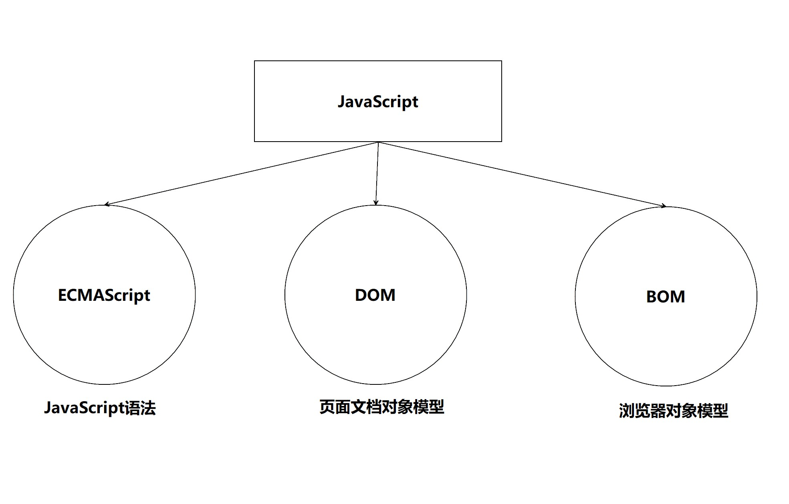

### 1.1.2、JS 基础阶段以及 Web APIs 阶段

==JS 基础阶段==：

- 我们学习的是 ECMAScript 标准规定的基本语法
- 要求掌握 JS 基础语法
- 只学习基本语法，做不了常用的网页交互效果
- 目的是为了 JS 后面的课程打基础、做铺垫

==Web APIs 阶段==：

- Web APIs 是 W3C 组织的标准
- Web APIs 主要学习 DOM 和 BOM
- Web APIs 是 JS 所独有的部分
- 我们主要学习页面交互功能
- 需要使用 JS 基础的内容

## 1.2、API 和 Web API

### 1.2.1、API

==API (Application Programming Interface，应用程序编程接口)==是一些预先定义的函数，目的是提供应用程序与开发人员基于某软件或硬件得以访问一组例程的能力，而又无需访问源码，或理解内部工作机制的细节。

简单理解：==**API 是给程序员提供一种工具，以便能更轻松地实现想要完成的功能。**==

### 1.2.2、Web API

==**Web API 是浏览器**==提供的一套操作==浏览器功能==和==页面元素==的==API==（BOM 和 DOM）。

现阶段主要针对于浏览器讲解常用的 API，主要针对浏览器做交互效果。

比如我们想要浏览器弹出一个警示框，直接使用 alert ('弹出')

MDN 详细 API ：<http://developer.mozilla.org/zh-CN/docs/Web/API>

因为 Web API 很多，所以称这个阶段为 Web APIs。

### 1.2.3、API 和 Web API 总结

1.  ==API 是为程序员提供的一个接口，帮助程序员实现某种功能，会使用就可以了，不必纠结内部如何实现==
2.  Web API 主要是针对于浏览器提供的接口，主要针对于浏览器做交互效果
3.  Web API 一般都有输入和输出（函数的传参和返回值），因为 Web API 很多都是方法（函数）
4.  学习 Web API 可以结合前面学习内置对象方法的思路学习

# 2、DOM

---

## 2.1、DOM 简介

### 2.1.1、什么是 DOM

文档对象模型（Document Object Model，简称 ==DOM==），是 W3C 组织推荐的处理可扩展标记语言（HTML 或者 XML）的标准==编程接口==。

W3C 已经定义了一系列的 DOM 接口，通过这些 DOM 接口可以改变网页的内容、结构和样式。

### 2.1.2、DOM 树

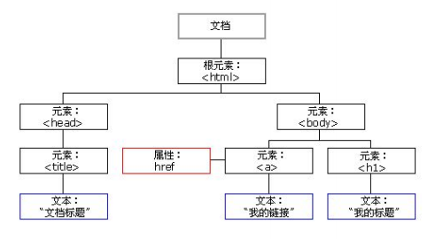

- 文档：一个页面就是一个文档，DOM 中使用 document 表示
- 元素：页面中的所有标签都是元素，DOM 中使用 element 表示
- 节点：网页中的所有内容都是节点（标签、属性、文本、注释等），DOM 中使用 node 表示

==DOM 把以上内容都看做是对象==

## 2.2、获取元素

### 2.2.1、如何获取页面元素

DOM 在我们实际开发中主要用来操作元素。

我们如何来获取页面中的元素呢?

获取页面中的元素可以使用以下几种方式:

- 根据 ID 获取
- 根据标签名获取
- 通过 HTML5 新增的方法获取
- 特殊元素获取

### 2.2.2、根据 ID 获取

使用 ==getElementById ()== 方法可以获取带有 ID 的元素对象。

```JavaScript
 document.getElementById ('id');
```

```html
<body>
    <div id="time"> 2019-9-9 </div>
    <script>
        // 1. 因为我们文档页面从上往下加载，所以先得有标签所以我们 script 写到标签的下面
        // 2. get 获得 element 元素 by 通过驼峰命名法 
        // 3. 参数 id 是大小写敏感的字符串
        // 4. 返回的是一个元素对象
        var timer = document.getElementById ('time');
        console. log (timer);
        console. log (typeof timer);
        // 5. console. dir 打印我们返回的元素对象更好的查看里面的属性和方法
        console.dir (timer);
    </script>
</body>
```

==使用 console. dir () 可以打印我们获取的元素对象，更好的查看对象里面的属性和方法==。

### 2.2.3、根据标签名获取

使用 ==getElementsByTagName ()== 方法可以返回带有指定标签名的==对象的集合==。

```JavaScript
document.getElementsByTagName ('标签名');
```

还可以获取某个元素（父元素）内部所有指定标签名的子元素。

```JS
element.getElementsByTagName ('标签名');
```

注意：父元素必须是==单个对象 (必须指明是哪一个元素对象)==，获取的时候不包括父元素自己。

```html
<body>
    <ul>
        <li> 知否知否，应是等你好久 11 </li>
        <li> 知否知否，应是等你好久 11 </li>
        <li> 知否知否，应是等你好久 11 </li>
        <li> 知否知否，应是等你好久 11 </li>

    </ul>
    <ol id="ol">
        <li> 生僻字 </li>
        <li> 生僻字 </li>
        <li> 生僻字 </li>
        <li> 生僻字 </li>

    </ol>

    <script>
        // 1. 返回的是获取过来元素对象的集合以伪数组的形式存储的
        var lis = document.getElementsByTagName ('li');
        console. log (lis);
        console. log (lis[0]);
        // 2. 我们想要依次打印里面的元素对象我们可以采取遍历的方式
        for (var i = 0; i < lis. length; i++) {
            console. log (lis[i]);
        }
        // 3. 如果页面中只有一个 li 返回的还是伪数组的形式 
        // 4. 如果页面中没有这个元素返回的是空的伪数组的形式
        // 5. element. getElementsByTagName ('标签名'); 父元素必须是指定的单个元素
        // var ol = document. getElementsByTagName ('ol'); // [ol]
        // console. log (ol[0]. getElementsByTagName ('li'));
        var ol = document.getElementById ('ol');
        console. log (ol.getElementsByTagName ('li'));
    </script>
</body>
```

==注意==：

1.  ==因为得到的是一个对象的集合，所以我们想要操作里面的元素就需要遍历==。
2.  ==得到元素对象是动态的==

### 2.2.4、通过 HTML5 新增的方法获取

```JavaScript
document.getElementsByClassName (‘类名’)；// 根据类名返回元素对象集合
```

```JavaScript
document.querySelector ('选择器'); // 根据指定选择器返回第一个元素对象
```

```JavaScript
document.querySelectorAll ('选择器'); // 根据指定选择器返回
```

==注意==：

- querySelector 和 querySelectorAll 里面的选择器需要加==符号==, 比如: document.querySelector ('==#==nav');

```html
<body>
    <div class="box"> 盒子 1 </div>
    <div class="box"> 盒子 2 </div>
    <div id="nav">
        <ul>
            <li> 首页 </li>
            <li> 产品 </li>
        </ul>
    </div>
    <script>
        // 1. getElementsByClassName 根据类名获得某些元素集合
        var boxs = document. getElementsByClassName ('box');
        console. log (boxs);
        // 2. querySelector 返回指定选择器的第一个元素对象切记里面的选择器需要加符号 . box  #nav
        var firstBox = document. querySelector ('. box');
        console. log (firstBox);
        var nav = document. querySelector ('#nav');
        console. log (nav);
        var li = document. querySelector ('li');
        console. log (li);
        // 3. querySelectorAll () 返回指定选择器的所有元素对象集合
        var allBox = document. querySelectorAll ('. box');
        console. log (allBox);
        var lis = document. querySelectorAll ('li');
        console. log (lis);
    </script>
</body>
```

### 2.2.5、获取特殊元素（body，html）

#### 获取 body 元素

```JavaScript
doucumnet. body // 返回 body 元素对象
```

#### 获取 html 元素

```JavaScript
document. documentElement // 返回 html 元素对象
```

```html
<body>
    <script>
        // 1.获取body 元素
        var bodyEle = document.body;
        console.log(bodyEle);
        console.dir(bodyEle);
        
        // 2.获取html 元素
        // var htmlEle = document.html; // undefined
        var htmlEle = document.documentElement;
        console.log(htmlEle);
    </script>
</body>
```

## 2.3、事件基础

### 2.3.1、事件概述

JavaScript 使我们有能力创建动态页面，而事件是可以被 JavaScript 侦测到的行为。

简单理解： 触发--- 响应机制。

网页中的每个元素都可以产生某些可以触发 JavaScript 的事件，例如，我们可以在用户点击某按钮时产生一个事件，然后去执行某些操作。

### 2.3.2、事件三要素

1.  事件源 （谁）
2.  事件类型 （什么事件）
3.  事件处理程序 （做啥）

### 案例：点击按钮弹出警示框

页面中有一个按钮，当鼠标点击按钮的时候，弹出“你好”警示框。

```JavaScript
var btn = document. getElementById ('btn');
    btn. onclick = function () {
    alert ('你好吗'); 
};
```

### 2.3.3、执行事件的步骤

1.  获取事件源
2.  注册事件（绑定事件）
3.  添加事件处理程序（采取函数赋值形式）

### 2.3.4、常见的鼠标事件

|     鼠标事件    |   触发条件   |
| :---------: | :------: |
|   onclick   | 鼠标点击左键触发 |
| onmouseover |  鼠标经过触发  |
|  onmouseout |  鼠标离开触发  |
|   onfocus   | 获得鼠标焦点触发 |
|    onblur   | 失去鼠标焦点触发 |
| onmousemove |  鼠标移动触发  |
|  onmouseup  |  鼠标弹起触发  |
| onmousedown |  鼠标按下触发  |

### 2.3.5、分析事件三要素

下拉菜单三要素

关闭广告三要素

## 2.4、操作元素

JavaScript 的 DOM 操作可以改变网页内容、结构和样式，我们可以利用 DOM 操作元素来改变元素里面的内容、属性等。注意以下都是属性

### 2.4.1、改变元素内容

```JavaScript
element.innerText
```

从起始位置到终止位置的内容, 但它==去除 html 标签==，同时==空格和换行也会去掉==

```JavaScript
element.innerHTML
```

起始位置到终止位置的全部内容，==包括 html 标签==，同时==保留空格和换行==

```js
<body>
    <div> </div>
    <p>
        我是文字
        <span> 123 </span>
    </p>
    <script>
        // innerText 和 innerHTML 的区别 
        // 1. innerText 不识别 html 标签非标准去除空格和换行
        var div = document.querySelector('div');
        // div. innerText = ' <strong> 今天是：</strong> 2019';
        // 2. innerHTML 识别 html 标签 W3C 标准保留空格和换行的
        div.innerHTML = ' <strong> 今天是：</strong> 2019';
        // 这两个属性是可读写的可以获取元素里面的内容
        var p = document. querySelector('p');
        console.log(p.innerText);
        console.log(p.innerHTML);
    </script>
</body>
```

==日常使用 element.innerHTML 会更多==。

### 2.4.2、常用元素的属性操作

1.  innerText、innerHTML 改变元素内容
2.  src、href
3.  id、alt、title

#### 案例： 分时显示不同图片, 显示不同问候语

根据不同时间，页面显示不同图片，同时显示不同的问候语。

1.  如果上午时间打开页面，显示上午好，显示上午的图片。
2.  如果下午时间打开页面，显示下午好，显示下午的图片。
3.  如果晚上时间打开页面，显示晚上好，显示晚上的图片。

```html
<head>
    <style>
        img {
            width: 300px;
        }
    </style>
</head>
<body>
    
    <div>上午好</div>
    <script>
        var img = document.querySelector('img');
        var div = document.querySelector('div');
        var date = new Date();
        var h = date.getHours();
        if (h < 12) {
            img.src = 'images/s.gif';
            div.innerHTML = '上午好！';
        } else if (h < 18) {
            img.src = 'images/x.gif';
            div.innerHTML = '下午好！';
        } else {
            img.src = 'images/w.gif';
            div.innerHTML = '晚上好！';
        };
    </script>
</body>
```

### 2.4.3、表单元素的属性操作

利用 DOM 可以操作如下表单元素的属性：

```text
type、value、checked、selected、disabled
```

```html
<body>
    <button> 按钮 </button>
    <input type="text" value="输入内容">
    <script>
        // 1. 获取元素
        var btn = document.querySelector ('button');
        var input = document.querySelector ('input');
        // 2. 注册事件处理程序
        btn.onclick = function () {
            // input. innerHTML = '点击了';  这个是普通盒子比如 div 标签里面的内容
            // 表单里面的值文字内容是通过 value 来修改的
            input.value = '被点击了';
            // 如果想要某个表单被禁用不能再点击 disabled  我们想要这个按钮 button 禁用
            // btn. disabled = true;
            this.disabled = true;
            // this 指向的是事件函数的调用者 btn
        }
    </script>
</body>
```

#### 案例：仿京东显示密码

点击按钮将密码框切换为文本框，并可以查看密码明文。

```html
<head>
    <style>
        .box {
            position: relative;
            width: 400px;
            border-bottom: 1px solid #ccc;
            margin: 100px auto;
        }
        .box input {
            width: 370px;
            height: 30px;
            border: 0;
            outline: none;
        }
        .box img {
            position: absolute;
            top: 2px;
            right: 2px;
            width: 24px;
        }
    </style>
</head>
<body>
    <div class="box">
        <label for="">
            
        </label>
        <input type="password" name="" id="pwd">
    </div>
    <script>
        // 1. 获取元素
        var eye = document.getElementById('eye');
        var pwd = document.getElementById('pwd');
        // 2. 注册事件 处理程序
        var flag = 0;
        eye. onclick = function () {
            // 点击一次之后， flag 一定要变化
            if (flag == 0) {
                pwd. type = 'text';
                eye. src = 'images/open. png';
                flag = 1; // 赋值操作
            } else {
                pwd. type = 'password';
                eye. src = 'images/close. png';
                flag = 0;
            }
        }
    </script>
</body>
```

### 2.4.4、样式属性操作

我们可以通过 JS 修改元素的大小、颜色、位置等样式。

~~~text
1.  element.style 行内样式操作
2.  element.className 类名样式操作
~~~

~~~html
<style>
        div {
            width: 200px;
            height: 200px;
            background-color: pink;
        }
    </style>
</head>

<body>
    <div></div>
    <script>
        // 1. 获取元素
        var div = document.querySelector('div');
        // 2. 注册事件 处理程序
        div.onclick = function() {
            // div.style 里面的属性 采取驼峰命名法
            this.style.backgroundColor = 'purple';
            this.style.width = '250px';
        }
    </script>
~~~

==注意==：
1.==JS 里面的样式采取驼峰命名法比如 fontSize、 backgroundColor==
2.==JS 修改 style 样式操作，产生的是行内样式，CSS 权重比较高==

~~~html
<head>
    <style>
        div {
            width: 100px;
            height: 100px;
            background-color: pink;
        }

        .change {
            background-color: purple;
            color: #fff;
            font-size: 25px;
            margin-top: 100px;
        }
    </style>
</head>

<body>
    <div class="first">文本</div>
    <script>
        // 1. 使用 element.style 获得修改元素样式  如果样式比较少 或者 功能简单的情况下使用
        var test = document.querySelector('div');
        test.onclick = function() {
            // this.style.backgroundColor = 'purple';
            // this.style.color = '#fff';
            // this.style.fontSize = '25px';
            // this.style.marginTop = '100px';
            // 让我们当前元素的类名改为了 change

            // 2. 我们可以通过 修改元素的 className 更改元素的样式 适合于样式较多或者功能复杂的情况
            // 3. 如果想要保留原先的类名，我们可以这么做 多类名选择器
            this.className = 'change';
            // 保留原先的类名，同时添加新类名
            this.className = 'first change';
        }
    </script>
</body>
~~~

==注意==：
1.  ==如果样式修改较多，可以采取操作类名方式更改元素样式==
2.  ==class 因为是个保留字，因此使用 className 来操作元素类名属性==
3.  ==className 会直接更改元素的类名，会覆盖原先的类名==

#### 案例： 淘宝点击关闭二维码

当鼠标点击二维码关闭按钮的时候，则关闭整个二维码。

```js
var btn = document.querySelector ('.close-btn');
var box = document.querySelector ('.box');
// 2. 注册事件程序处理
btn.onclick = function () {
    box.style.display = 'none';
};
```

#### 案例： 循环精灵图背景

可以利用 for 循环设置一组元素的精灵图背景
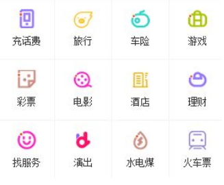

```javascript
var lis = document.querySelectorAll ('li');
for (var i = 0; i < lis.length; i++) {
    // 让索引号乘以 44 就是每个 li 的背景 y 坐标 index 就是我们的 y 坐标
    var index = i * 44;
    lis[i].style.backgroundPosition = '0 -' + index + 'px';
}
```

#### 案例：显示隐藏文本框内容

当鼠标点击文本框时，里面的默认文字隐藏，当鼠标离开文本框时，里面的文字显示。

```html
<head>
    <style>
        input {
            color: #999;
        }
    </style>
</head>
<body>
    <input type="text" value="手机">
    <script>
        // 1.获取元素
        var text = document.querySelector('input');
        // 2.注册事件 获得焦点事件 onfocus 
        text.onfocus = function() {
                // console.log('得到了焦点');
                if (this.value === '手机') {
                    this.value = '';
                }
                // 获得焦点需要把文本框里面的文字颜色变黑
                this.style.color = '#333';
            }
            // 3. 注册事件 失去焦点事件 onblur
        text.onblur = function() {
            // console.log('失去了焦点');
            if (this.value === '') {
                this.value = '手机';
            }
            // 失去焦点需要把文本框里面的文字颜色变浅色
            this.style.color = '#999';
        }
    </script>
</body>
```

#### 案例： 密码框格式提示错误信息

用户如果离开密码框，里面输入个数不是 6~16，则提示错误信息，否则提示输入正确信息

```html
<head>
    <style>
        div {
            width: 600px;
            margin: 100px auto;
        }
        
        .message {
            display: inline-block;
            font-size: 12px;
            color: #999;
            background: url(images/mess.png) no-repeat left center;
            padding-left: 20px;
        }
        
        .wrong {
            color: red;
            background-image: url(images/wrong.png);
        }
        
        .right {
            color: green;
            background-image: url(images/right.png);
        }
    </style>
</head>

<body>
    <div class="register">
        <input type="password" class="ipt">
        <p class="message">请输入6~16位密码</p>
    </div>
    <script>
        // 首先判断的事件是表单失去焦点 onblur
        // 如果输入正确则提示正确的信息颜色为绿色小图标变化
        // 如果输入不是6到16位，则提示错误信息颜色为红色 小图标变化
        // 因为里面变化样式较多，我们采取className修改样式
        // 1.获取元素
        var ipt = document.querySelector('.ipt');
        var message = document.querySelector('.message');
        //2. 注册事件 失去焦点
        ipt.onblur = function() {
            // 根据表单里面值的长度 ipt.value.length
            if (this.value.length < 6 || this.value.length > 16) {
                // console.log('错误');
                message.className = 'message wrong';
                message.innerHTML = '您输入的位数不对要求6~16位';
            } else {
                message.className = 'message right';
                message.innerHTML = '您输入的正确';
            }
        }
    </script>
</body>
```

### 2.4.5、操作元素总结

操作元素是 DOM 核心内容

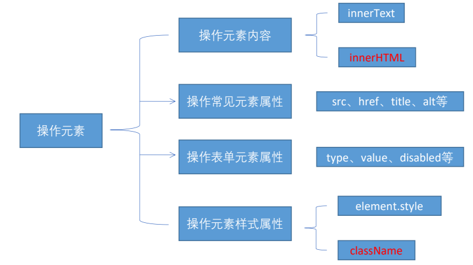

### 2.4.6、排他思想

如果有同一组元素，我们想要某一个元素实现某种样式，需要用到循环的排他思想算法：
1.  所有元素全部清除样式（干掉其他人）
2.  给当前元素设置样式 （留下我自己）
3.  注意顺序不能颠倒，首先干掉其他人，再设置自己

~~~html
<body>
    <button>按钮 1</button>
    <button>按钮 2</button>
    <button>按钮 3</button>
    <button>按钮 4</button>
    <button>按钮 5</button>
    <script>
        // 1. 获取所有按钮元素
        var btns = document.getElementsByTagName('button');
        // btns 得到的是伪数组  里面的每一个元素 btns[i]
        for (var i = 0; i < btns.length; i++) {
            btns[i].onclick = function() {
                // (1) 我们先把所有的按钮背景颜色去掉  干掉所有人
                for (var i = 0; i < btns.length; i++) {
                    btns[i].style.backgroundColor = '';
                }
                // (2) 然后才让当前的元素背景颜色为 pink 留下我自己
                this.style.backgroundColor = 'pink';
            }
        }
        //2. 首先先排除其他人，然后才设置自己的样式 这种排除其他人的思想我们成为排他思想
    </script>
</body>
~~~

#### 案例：百度换肤

```JavaScript
// 1. 获取元素
var imgs = document.querySelector ('.baidu').querySelectorAll ('img');
// 2. 循环注册事件
for (var i = 0; i < imgs.length; i++) {
    // imgs 得到的是伪数组，里面的每一个元素 imgs[i]
    imgs[i].onclick = function () {
        // this.src 得到图片路径，再把它给 body 即可
        document.body.style.backgroundImage = 'url(' + this.src + ')';
    }
}
```

#### 案例：表格隔行变色
==鼠标经过 onmouseover, 鼠标离开 onmouseout==

```html
<head>
    <style>
        table {
            width: 800px;
            margin: 100px auto;
            text-align: center;
            border-collapse: collapse;
            font-size: 14px;
        }
        
        thead tr {
            height: 30px;
            background-color: skyblue;
        }
        
        tbody tr {
            height: 30px;
        }
        
        tbody td {
            border-bottom: 1px solid #d7d7d7;
            font-size: 12px;
            color: blue;
        }
        
        .bg {
            background-color: pink;
        }
    </style>
</head>

<body>
    <table>
        <thead>
            <tr>
                <th>代码</th>
                <th>名称</th>
                <th>最新公布净值</th>
                <th>累计净值</th>
                <th>前单位净值</th>
                <th>净值增长率</th>
            </tr>
        </thead>
        <tbody>
            <tr>
                <td>003526</td>
                <td>农银金穗3个月定期开放债券</td>
                <td>1.075</td>
                <td>1.079</td>
                <td>1.074</td>
                <td>+0.047%</td>
            </tr>
            <tr>
                <td>003526</td>
                <td>农银金穗3个月定期开放债券</td>
                <td>1.075</td>
                <td>1.079</td>
                <td>1.074</td>
                <td>+0.047%</td>
            </tr>
            <tr>
                <td>003526</td>
                <td>农银金穗3个月定期开放债券</td>
                <td>1.075</td>
                <td>1.079</td>
                <td>1.074</td>
                <td>+0.047%</td>
            </tr>
            <tr>
                <td>003526</td>
                <td>农银金穗3个月定期开放债券</td>
                <td>1.075</td>
                <td>1.079</td>
                <td>1.074</td>
                <td>+0.047%</td>
            </tr>
            <tr>
                <td>003526</td>
                <td>农银金穗3个月定期开放债券</td>
                <td>1.075</td>
                <td>1.079</td>
                <td>1.074</td>
                <td>+0.047%</td>
            </tr>
            <tr>
                <td>003526</td>
                <td>农银金穗3个月定期开放债券</td>
                <td>1.075</td>
                <td>1.079</td>
                <td>1.074</td>
                <td>+0.047%</td>
            </tr>
        </tbody>
    </table>
    <script>
        // 1.获取元素 获取的是 tbody 里面所有的行
        var trs = document.querySelector('tbody').querySelectorAll('tr');
        // 2. 利用循环绑定注册事件
        for (var i = 0; i < trs.length; i++) {
            // 3. 鼠标经过事件 onmouseover
            trs[i].onmouseover = function() {
                    // console.log(11);
                    this.className = 'bg';
                }
                // 4. 鼠标离开事件 onmouseout
            trs[i].onmouseout = function() {
                this.className = '';
            }
        }
    </script>
</body>
```

#### 案例：表单全选取消全选案例

业务需求：
1.  点击上面全选复选框，下面所有的复选框都选中（全选）
2.  再次点击全选复选框，下面所有的复选框都不中选（取消全选）
3.  如果下面复选框全部选中，上面全选按钮就自动选中
4.  如果下面复选框有一个没有选中，上面全选按钮就不选中
5.  所有复选框一开始默认都没选中状态

**案例分析**：
1.  全选和取消全选做法： 让下面所有复选框的 checked 属性（选中状态） 跟随全选按钮即可
2.  下面复选框需要全部选中，上面全选才能选中做法： 给下面所有复选框绑定点击事件，每次点击，都要循环查看下面所有的复选框是否有没选中的，如果有一个没选中的，上面全选就不选中。
3.  可以设置一个变量，来控制全选是否选中

~~~html
<head>
    <style>
        - {
            padding: 0;
            margin: 0;
        }

        .wrap {
            width: 300px;
            margin: 100px auto 0;
        }

        table {
            border-collapse: collapse;
            border-spacing: 0;
            border: 1px solid #c0c0c0;
            width: 300px;
        }

        th,
        td {
            border: 1px solid #d0d0d0;
            color: #404060;
            padding: 10px;
        }

        th {
            background-color: #09c;
            font: bold 16px "微软雅黑";
            color: #fff;
        }

        td {
            font: 14px "微软雅黑";
        }

        tbody tr {
            background-color: #f0f0f0;
        }

        tbody tr: hover {
            cursor: pointer;
            background-color: #fafafa;
        }
    </style>
</head>

<body>
    <div class="wrap">
        <table>
            <thead>
                <tr>
                    <th>
                        <input type="checkbox" id="j_cbAll" />
                    </th>
                    <th>商品</th>
                    <th>价钱</th>
                </tr>
            </thead>
            <tbody id="j_tb">
                <tr>
                    <td>
                        <input type="checkbox" />
                    </td>
                    <td>iPhone8</td>
                    <td>8000</td>
                </tr>
                <tr>
                    <td>
                        <input type="checkbox" />
                    </td>
                    <td>iPad Pro</td>
                    <td>5000</td>
                </tr>
                <tr>
                    <td>
                        <input type="checkbox" />
                    </td>
                    <td>iPad Air</td>
                    <td>2000</td>
                </tr>
                <tr>
                    <td>
                        <input type="checkbox" />
                    </td>
                    <td>Apple Watch</td>
                    <td>2000</td>
                </tr>

            </tbody>
        </table>
    </div>
    <script>
        // 1. 全选和取消全选做法：  让下面所有复选框的 checked 属性（选中状态） 跟随 全选按钮即可
        // 获取元素
        var j_cbAll = document.getElementById('j_cbAll'); // 全选按钮
        var j_tbs = document.getElementById('j_tb').getElementsByTagName('input'); // 下面所有的复选框
        // 注册事件
        j_cbAll.onclick = function() {
                // this.checked 它可以得到当前复选框的选中状态如果是 true 就是选中，如果是 false 就是未选中
                console.log(this.checked);
                for (var i = 0; i < j_tbs.length; i++) {
                    j_tbs[i].checked = this.checked;
                }
            }
            // 2. 下面复选框需要全部选中， 上面全选才能选中做法： 给下面所有复选框绑定点击事件，每次点击，都要循环查看下面所有的复选框是否有没选中的，如果有一个没选中的， 上面全选就不选中。
        for (var i = 0; i < j_tbs.length; i++) {
            j_tbs[i].onclick = function() {
                // flag 控制全选按钮是否选中
                var flag = true;
                // 每次点击下面的复选框都要循环检查者 4 个小按钮是否全被选中
                for (var i = 0; i < j_tbs.length; i++) {
                    if (!j_tbs[i].checked) {
                        flag = false;
                        break; // 退出 for 循环 这样可以提高执行效率 因为只要有一个没有选中，剩下的就无需循环判断了
                    }
                }
                j_cbAll.checked = flag;
            }
        }
    </script>
</body>
~~~

### 2.4.7、自定义属性的操作

#### 1. 获取属性值

- ==element. 属性== 获取属性值。
- element. getAttribute ('属性');

**区别**：
- ==element. 属性== 获取内置属性值（元素本身自带的属性）
- element.getAttribute (‘属性’); 主要获得自定义的属性 （标准） 我们程序员自定义的属性

#### 2. 设置属性值
- ==element. 属性 = ‘值’== 设置内置属性值。
- element. setAttribute ('属性', '值');

**区别**：
- ==element. 属性== 设置内置属性值
- element. setAttribute (‘属性’); 主要设置自定义的属性 （标准）

~~~html
<body>
    <div id="demo" index="1" class="nav"></div>
    <script>
        var div = document.querySelector('div');
        // 1. 获取元素的属性值
        // (1) element.属性
        console.log(div.id);
        //(2) element.getAttribute('属性')  get 得到获取 attribute 属性的意思 我们程序员自己添加的属性我们称为自定义属性 index
        console.log(div.getAttribute('id'));
        console.log(div.getAttribute('index'));
        // 2. 设置元素属性值
        // (1) element.属性= '值'
        div.id = 'test';
        div.className = 'navs';
        // (2) element.setAttribute('属性', '值');  主要针对于自定义属性
        div.setAttribute('index', 2); // 将 index 的值改为 2
        div.setAttribute('class', 'footer'); // class 特殊  这里面写的就是 class 不是 className
        // 3 移除属性 removeAttribute(属性)
        div.removeAttribute('index');
    </script>
</body>
~~~

#### 3. 移除属性
- element. removeAttribute ('属性');

#### 案例：tab 栏切换（重点案例）
当鼠标点击上面相应的选项卡（tab），下面内容跟随变化

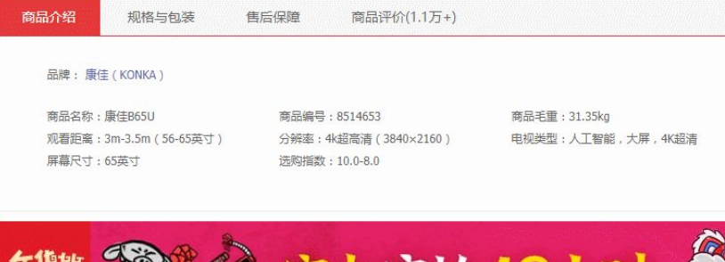

```html
<head>
    <meta charset="UTF-8">
    <meta name="viewport" content="width=device-width, initial-scale=1.0">
    <meta http-equiv="X-UA-Compatible" content="ie=edge">
    <title>Document</title>
    <style>
        * {
            margin: 0;
            padding: 0;
        }
        
        li {
            list-style-type: none;
        }
        
        .tab {
            width: 978px;
            margin: 100px auto;
        }
        
        .tab_list {
            height: 39px;
            border: 1px solid #ccc;
            background-color: #f1f1f1;
        }
        
        .tab_list li {
            float: left;
            height: 39px;
            line-height: 39px;
            padding: 0 20px;
            text-align: center;
            cursor: pointer;
        }
        
        .tab_list .current {
            background-color: #c81623;
            color: #fff;
        }
        
        .item_info {
            padding: 20px 0 0 20px;
        }
        
        .item {
            display: none;
        }
    </style>
</head>

<body>
    <div class="tab">
        <div class="tab_list">
            <ul>
                <li class="current">商品介绍</li>
                <li>规格与包装</li>
                <li>售后保障</li>
                <li>商品评价（50000）</li>
                <li>手机社区</li>
            </ul>
        </div>
        <div class="tab_con">
            <div class="item" style="display: block;">
                商品介绍模块内容
            </div>
            <div class="item">
                规格与包装模块内容
            </div>
            <div class="item">
                售后保障模块内容
            </div>
            <div class="item">
                商品评价（50000）模块内容
            </div>
            <div class="item">
                手机社区模块内容
            </div>

        </div>
    </div>
    <script>
        // 获取元素
        var tab_list = document.querySelector('.tab_list');
        var lis = tab_list.querySelectorAll('li');
        var items = document.querySelectorAll('.item');
        // for循环绑定点击事件
        for (var i = 0; i < lis.length; i++) {
            // 开始给5个小li 设置索引号 
            lis[i].setAttribute('index', i);
            lis[i].onclick = function() {
                // 1. 上的模块选项卡，点击某一个，当前这一个底色会是红色，其余不变（排他思想） 修改类名的方式

                // 干掉所有人 其余的li清除 class 这个类
                for (var i = 0; i < lis.length; i++) {
                    lis[i].className = '';
                }
                // 留下我自己 
                this.className = 'current';
                // 2. 下面的显示内容模块
                var index = this.getAttribute('index');
                console.log(index);
                // 干掉所有人 让其余的item 这些div 隐藏
                for (var i = 0; i < items.length; i++) {
                    items[i].style.display = 'none';
                }
                // 留下我自己 让对应的item 显示出来
                items[index].style.display = 'block';
            }
        }
    </script>
</body>
```

### 2.4.8、H5 自定义属性

==**自定义属性目的：是为了保存并使用数据。有些数据可以保存到页面中而不用保存到数据库中**==。

自定义属性获取是通过 ==getAttribute (‘属性’)== 获取。

~~~html
<body>
    <div getTime="20" data-index="2" data-list-name="andy"></div>
    <script>
        var div = document.querySelector('div');
        // console.log(div.getTime);
        console.log(div.getAttribute('getTime'));
        div.setAttribute('data-time', 20);
        console.log(div.getAttribute('data-index'));
        console.log(div.getAttribute('data-list-name'));
        // h5 新增的获取自定义属性的方法 它只能获取 data-开头的
        // dataset 是一个集合里面存放了所有以 data 开头的自定义属性
        console.log(div.dataset);
        console.log(div.dataset.index);
        console.log(div.dataset['index']);
        // 如果自定义属性里面有多个-链接的单词，我们获取的时候采取 驼峰命名法
        console.log(div.dataset.listName);
        console.log(div.dataset['listName']);
    </script>
</body>
~~~

但是有些自定义属性很容易引起歧义，不容易判断是元素的内置属性还是自定义属性。

H5 给我们新增了自定义属性：

1.  **设置 H5 自定义属性**
    - H5 规定自定义属性 data-开头做为属性名并且赋值。
    - ==比如 \<div data-index=“1”>\</div> 或者使用 JS 设置 element.setAttribute (‘data-index’, 2)==
1.  **获取 H5 自定义属性**
    1.  兼容性获取 element. getAttribute (‘data-index’);
    2.  H5 新增 ==element. dataset. index== 或者 ==element. dataset[‘index’]== IE 11 才开始支持

## 2.5、节点操作
### 2.5.1、为什么学节点操作
获取元素通常使用两种方式：
1.  ==利用 DOM 提供的方法获取元素==
- document.getElementById ()
- document.getElementsByTagName ()
- document.querySelector 等
- 逻辑性不强、繁琐

2.  ==利用节点层级关系获取元素==
- 利用父子兄节点关系获取元素
- 逻辑性强，但是兼容性稍差

这两种方式都可以获取元素节点，我们后面都会使用，但是节点操作更简单

### 2.5.2、节点概述

网页中的所有内容都是节点（标签、属性、文本、注释等），在 DOM 中，节点使用 node 来表示。

HTML DOM 树中的所有节点均可通过 JavaScript 进行访问，所有 HTML 元素（节点）均可被修改，也可以创建或删除。

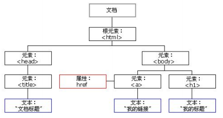

一般地，节点至少拥有 nodeType（节点类型）、nodeName（节点名称）和 nodeValue（节点值）这三个基本属性。

- 元素节点 nodeType 为 1
- 属性节点 nodeType 为 2
- 文本节点 nodeType 为 3 （文本节点包含文字、空格、换行等）

==我们在实际开发中，节点操作主要操作的是元素节点==

### 2.5.3、节点层级

利用 DOM 树可以把节点划分为不同的层级关系，常见的是==父子兄层级关系==。

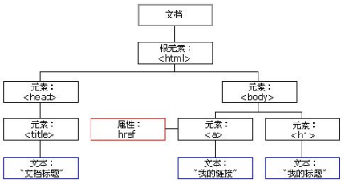

#### 1. 父级节点

```javascript
node.parentNode 
```

- parentNode 属性可返回某节点的父节点，注意是==最近的一个父节点==
- 如果指定的节点没有父节点则返回 null

~~~html
<body>
    <!-- 节点的优点 -->
    <div>我是 div</div>
    <span>我是 span</span>
    <ul>
        <li>我是 li</li>
        <li>我是 li</li>
        <li>我是 li</li>
        <li>我是 li</li>
    </ul>
    <div class="demo">
        <div class="box">
            <span class="erweima">×</span>
        </div>
    </div>

    <script>
        // 1. 父节点 parentNode
        var erweima = document.querySelector('.erweima');
        // var box = document.querySelector('.box');
        // 得到的是离元素最近的父级节点(亲爸爸) 如果找不到父节点就返回为 null
        console.log(erweima.parentNode);
    </script>
</body>
~~~

#### 2. 子节点
##### 1、parentNode.childNodes（标准）
parentNode.childNodes 返回包含指定节点的子节点的集合，该集合为即时更新的集合。

==注意：返回值里面包含了所有的子节点，包括元素节点，文本节点等==。

==如果只想要获得里面的元素节点，则需要专门处理。所以我们一般不提倡使用 childNodes==

```javascript
var ul = document.querySelector (‘ul’);
for (var i = 0; i < ul. childNodes.length; i++) {
    if (ul.childNodes[i].nodeType == 1) {
        // ul. childNodes[i] 是元素节点
        console.log (ul.childNodes[i]);
    }
}
```

##### 2、parentNode.children（非标准）
==parentNode.children== 是一个只读属性，返回所有的子元素节点。它只返回子元素节点，其余节点不返回 （==这个是我们重点掌握的==）。

虽然 children 是一个非标准，但是得到了各个浏览器的支持，因此我们可以放心使用

##### 3、parentNode.firstChild
firstChild 返回第一个子节点，找不到则返回 null。同样，也是包含所有的节点。

##### 4、parentNode.lastChild
astChild 返回最后一个子节点，找不到则返回 null。同样，也是包含所有的节点。

##### 5、parentNode.firstElementChild
firstElementChild 返回第一个子元素节点，找不到则返回 null。

##### 6、parentNode.lastElementChild
lastElementChild 返回最后一个子元素节点，找不到则返回 null。

==注意：这两个方法有兼容性问题，IE9 以上才支持==。

实际开发中，firstChild 和 lastChild 包含其他节点，操作不方便，而 firstElementChild 和
lastElementChild 又有兼容性问题，那么我们如何获取第一个子元素节点或最后一个子元素节点呢？

==解决方案（实际开发写法）==：
1.  ==如果想要第一个子元素节点，可以使用 parentNode.chilren[0]==
2.  ==如果想要最后一个子元素节点，可以使用 parentNode.chilren[parentNode.chilren.length - 1]==

#### 案例：下拉菜单

```javascript
var nav = document.querySelector ('. nav');
var lis = nav.children; // 得到 4 个小 li
for (var i = 0; i < lis.length; i++) {
    lis[i].onmouseover = function () {
        this. children[1].style.display = 'block';
    }
    lis[i].onmouseout = function () {
        this. children[1].style.display = 'none';
    }
}
```

#### 3. 兄弟节点
##### 1、node.nextSibling
nextSibling 返回当前元素的下一个兄弟元素节点，找不到则返回 null。同样，也是包含所有的节点。

##### 2、node.previousSibling
previousSibling 返回当前元素上一个兄弟元素节点，找不到则返回 null。同样，也是包含所有的节点。

##### 3、node.nextElementSibling
nextElementSibling 返回当前元素下一个兄弟元素节点，找不到则返回 null。

##### 4、node.previousElementSibling
previousElementSibling 返回当前元素上一个兄弟节点，找不到则返回 null。

==注意：这两个方法有兼容性问题， IE9 以上才支持==。

==问：如何解决兼容性问题 ？==

答：自己封装一个兼容性的函数

```javascript
function getNextElementSibling (element) {
     var el = element;
     while (el = el. nextSibling) {
         if (el.nodeType === 1) {
             return el;
         }
     }
     return null;
} 
```

### 2.5.4、创建节点
#### 1、document.createElement ('tagName')
document. createElement () 方法创建由 tagName 指定的 HTML 元素。因为这些元素原先不存在，是根据我们的需求动态生成的，所以我们也称为==动态创建元素节点==。

### 2.5.5、添加节点
#### 1、node.appendChild (child)
node. appendChild () 方法将一个节点添加到指定父节点的子节点列表==末尾==。类似于 CSS 里面的 after 伪元素。

#### 2、node.insertBefore (child, 指定元素)
node. insertBefore () 方法将一个节点添加到父节点的指定子节点==前面==。类似于 CSS 里面的 before 伪元素。

#### 案例：简单版发布留言案例

```html
<head>
    <style>
        * {
            margin: 0;
            padding: 0;
        }
        
        body {
            padding: 100px;
        }
        
        textarea {
            width: 200px;
            height: 100px;
            border: 1px solid pink;
            outline: none;
            resize: none;
        }
        
        ul {
            margin-top: 50px;
        }
        
        li {
            width: 300px;
            padding: 5px;
            background-color: rgb(245, 209, 243);
            color: red;
            font-size: 14px;
            margin: 15px 0;
        }
    </style>
</head>

<body>
    <textarea name="" id=""></textarea>
    <button>发布</button>
    <ul>

    </ul>
    <script>
        // 1. 获取元素
        var btn = document.querySelector('button');
        var text = document.querySelector('textarea');
        var ul = document.querySelector('ul');
        // 2. 注册事件
        btn.onclick = function() {
            if (text.value == '') {
                alert('您没有输入内容');
                return false;
            } else {
                // console.log(text.value);
                // (1) 创建元素
                var li = document.createElement('li');
                // 先有li 才能赋值
                li.innerHTML = text.value;
                // (2) 添加元素
                // ul.appendChild(li);
                ul.insertBefore(li, ul.children[0]);
            }
        }
    </script>
</body>
```

### 2.5.6、删除节点
#### 1、node.removeChild (child)
node. removeChild () 方法从 DOM 中删除一个子节点，返回删除的节点。

#### 案例：删除留言案例
==案例分析==：
1.  当我们把文本域里面的值赋值给 li 的时候，多添加一个删除的链接
2.  需要把所有的链接获取过来，当我们点击当前的链接的时候，删除当前链接所在的 li
3.  阻止链接跳转需要添加==javascript: void(0);== 或者 ==javascript:;==

```html
<head>
    <style>
        * {
            margin: 0;
            padding: 0;
        }
        
        body {
            padding: 100px;
        }
        
        textarea {
            width: 200px;
            height: 100px;
            border: 1px solid pink;
            outline: none;
            resize: none;
        }
        
        ul {
            margin-top: 50px;
        }
        
        li {
            width: 300px;
            padding: 5px;
            background-color: rgb(245, 209, 243);
            color: red;
            font-size: 14px;
            margin: 15px 0;
        }
        
        li a {
            float: right;
        }
    </style>
</head>

<body>
    <textarea name="" id=""></textarea>
    <button>发布</button>
    <ul>
    </ul>
    <script>
        // 1. 获取元素
        var btn = document.querySelector('button');
        var text = document.querySelector('textarea');
        var ul = document.querySelector('ul');
        // 2. 注册事件
        btn.onclick = function() {
            if (text.value == '') {
                alert('您没有输入内容');
                return false;
            } else {
                // console.log(text.value);
                // (1) 创建元素
                var li = document.createElement('li');
                // 先有li 才能赋值
                li.innerHTML = text.value + "<a href='javascript:;'>删除</a>";
                // (2) 添加元素
                // ul.appendChild(li);
                ul.insertBefore(li, ul.children[0]);
                // (3) 删除元素 删除的是当前链接的li  它的父亲
                var as = document.querySelectorAll('a');
                for (var i = 0; i < as.length; i++) {
                    as[i].onclick = function() {
                        // node.removeChild(child); 删除的是 li 当前a所在的li  this.parentNode;
                        ul.removeChild(this.parentNode);
                    }
                }
            }
        }
    </script>
</body>
```

### 2.5.7、复制节点 (克隆节点)
#### 1、node.cloneNode ()
node.cloneNode () 方法返回调用该方法的节点的一个副本。也称为克隆节点/拷贝节点

~~~html
<body>
    <ul>
        <li>1111</li>
        <li>2</li>
        <li>3</li>
    </ul>
    <script>
        var ul = document.querySelector('ul');
        // 1. node.cloneNode(); 括号为空或者里面是 false 浅拷贝 只复制标签不复制里面的内容
        // 2. node.cloneNode(true); 括号为 true 深拷贝 复制标签复制里面的内容
        var lili = ul.children[0].cloneNode(true);
        ul.appendChild(lili);
    </script>
</body>
~~~

==注意==：
1.  如果括号参数为==空或者为 false ==，则是==浅拷贝==，即只克隆复制节点本身，不克隆里面的子节点。
2.  如果括号参数为 ==true== ，则是==深度拷贝==，会复制节点本身以及里面所有的子节点。

#### 案例：动态生成表格

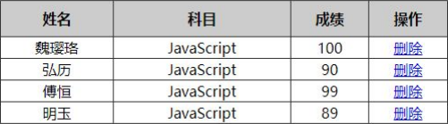

```html
<head>
    <style>
        table {
            width: 500px;
            margin: 100px auto;
            border-collapse: collapse;
            text-align: center;
        }
        
        td,
        th {
            border: 1px solid #333;
        }
        
        thead tr {
            height: 40px;
            background-color: #ccc;
        }
    </style>
</head>

<body>
    <table cellspacing="0">
        <thead>
            <tr>
                <th>姓名</th>
                <th>科目</th>
                <th>成绩</th>
                <th>操作</th>
            </tr>
        </thead>
        <tbody></tbody>
    </table>
    <script>
        // 1.先去准备好学生的数据
        var datas = [{
            name: '魏璎珞',
            subject: 'JavaScript',
            score: 100
        }, {
            name: '弘历',
            subject: 'JavaScript',
            score: 98
        }, {
            name: '傅恒',
            subject: 'JavaScript',
            score: 99
        }, {
            name: '明玉',
            subject: 'JavaScript',
            score: 88
        }, {
            name: '大猪蹄子',
            subject: 'JavaScript',
            score: 0
        }];
        // 2. 往tbody 里面创建行： 有几个人（通过数组的长度）我们就创建几行
        var tbody = document.querySelector('tbody');
        for (var i = 0; i < datas.length; i++) { // 外面的for循环管行 tr
            // 1. 创建 tr行
            var tr = document.createElement('tr');
            tbody.appendChild(tr);
            // 2. 行里面创建单元格(跟数据有关系的3个单元格) td 单元格的数量取决于每个对象里面的属性个数  for循环遍历对象 datas[i]
            for (var k in datas[i]) { // 里面的for循环管列 td
                // 创建单元格 
                var td = document.createElement('td');
                // 把对象里面的属性值 datas[i][k] 给 td  
                // console.log(datas[i][k]);
                td.innerHTML = datas[i][k];
                tr.appendChild(td);
            }
            // 3. 创建有删除2个字的单元格 
            var td = document.createElement('td');
            td.innerHTML = '<a href="javascript:;">删除 </a>';
            tr.appendChild(td);
        }
        // 4. 删除操作 开始 
        var as = document.querySelectorAll('a');
        for (var i = 0; i < as.length; i++) {
            as[i].onclick = function() {
                // 点击a 删除 当前a 所在的行(链接的爸爸的爸爸)  node.removeChild(child) 
                tbody.removeChild(this.parentNode.parentNode)
            }
        }
        // for(var k in obj) {
        //     k 得到的是属性名
        //     obj[k] 得到是属性值
        // }
    </script>
</body>
```

### 2.5.8、三种动态创建元素区别

- document.write()
- element.innerHTML
- document.createElement()

**区别**：
1.  document.write 是直接将内容写入页面的内容流，==但是文档流执行完毕，则它会导致页面全部重绘==
2.  innerHTML 是将内容写入某个 DOM 节点，不会导致页面全部重绘
3.  innerHTML 创建多个元素效率更高（不要拼接字符串，采取数组形式拼接），结构稍微复杂
4.  createElement() 创建多个元素效率稍低一点点，但是结构更清晰

==总结：不同浏览器下，innerHTML 效率要比 creatElement 高==

## 2.6、DOM 重点核心

文档对象模型（Document Object Model，简称 ==DOM==），是 W3C 组织推荐的处理可扩展标记语言（HTML 或者 XML）的标准==编程接口==。

W3C 已经定义了一系列的 DOM 接口，通过这些 DOM 接口可以改变网页的内容、结构和样式。

1.  对于 JavaScript，为了能够使 JavaScript 操作 HTML，JavaScript 就有了一套自己的 dom 编程接口。
2.  对于 HTML，dom 使得 html 形成一棵 dom 树. 包含文档、元素、节点

我们获取过来的 DOM 元素是一个对象（object），所以称为文档对象模型。

关于 dom 操作，我们主要针对于元素的操作。主要有==创建、增、删、改、查、属性操作、事件操作==。

### 2.6.1、创建

1.  document.write
2.  innerHTML
3.  createElement

### 2.6.2、增

1.  appendChild
2.  insertBefore

### 2.6.3、删

1.  removeChild

### 2.6.4、改

主要修改 dom 的元素属性，dom 元素的内容、属性, 表单的值等

1.  修改元素属性： src、href、title 等
2.  修改普通元素内容： innerHTML 、innerText
3.  修改表单元素： value、type、disabled 等
4.  修改元素样式： style、className

### 2.6.5、查

主要获取查询 dom 的元素

1.  DOM 提供的 API 方法： getElementById、getElementsByTagName 古老用法不太推荐
2.  H5 提供的新方法： querySelector、querySelectorAll 提倡
3.  利用节点操作获取元素： 父 (parentNode)、子 (children)、兄 (previousElementSibling、nextElementSibling) 提倡

### 2.6.6、属性操作

主要针对于自定义属性。

1.  setAttribute：设置 dom 的属性值
2.  getAttribute：得到 dom 的属性值
3.  removeAttribute 移除属性

### 2.6.7、事件操作

给元素注册事件，采取事件源. 事件类型 = 事件处理程序

|  鼠标事件   |     触发条件     |
|:-----------:|:----------------:|
|   onclick   | 鼠标点击左键触发 |
| onmouseover |   鼠标经过触发   |
| onmouseout  |   鼠标离开触发   |
|   onfocus   | 获得鼠标焦点触发 |
|   onblur    | 失去鼠标焦点触发 |
| onmousemove |   鼠标移动触发   |
|  onmouseup  |   鼠标弹起触发   |
| onmousedown |   鼠标按下触发   |

# 3、事件高级
---
## 3.1、注册事件（绑定事件）
### 3.1.1、注册事件概述
给元素添加事件，称为==注册事件==或者==绑定事件==。
注册事件有两种方式：==传统方式和方法监听注册方式==

#### 传统注册方式
- 利用 on 开头的事件 onclick
- \<button onclick=“alert('hi~')”>\</button>
- btn.onclick = function() {}
- 特点： 注册事件的==唯一性==
- 同一个元素同一个事件只能设置一个处理函数，最后注册的处理函数将会覆盖前面注册的处理函数

#### 方法监听注册方式
- w3c 标准 推荐方式
- addEventListener() 它是一个方法
- IE9 之前的 IE 不支持此方法，可使用 attachEvent() 代替
- 特点：同一个元素同一个事件可以注册多个监听器
- 按注册顺序依次执行

### 3.1.2、addEventListener 事件监听方式

~~~JavaScript
eventTarget.addEventListener(type, listener[, useCapture])
~~~

eventTarget.addEventListener()方法将指定的监听器注册到 eventTarget（目标对象）上，当该对
象触发指定的事件时，就会执行事件处理函数。

该方法接收三个参数：
- ==type==：事件类型==字符串==，比如 click 、mouseover ，注意==这里不要带 on==
- ==listener==：事件处理函数，事件发生时，会调用该监听函数
- ==useCapture==：可选参数，是一个布尔值，默认是 false。

### 3.1.3、attachEvent 事件监听方式

~~~JavaScript
eventTarget.attachEvent(eventNameWithOn, callback)
~~~

eventTarget.attachEvent()方法将指定的监听器注册到 eventTarget（目标对象） 上，当该对象触
发指定的事件时，指定的回调函数就会被执行。

该方法接收两个参数：
- ==eventNameWithOn==：事件类型==字符串==，比如 onclick 、onmouseover ，==这里要带 on==
- ==callback==： 事件处理函数，当目标触发事件时回调函数被调用

==注意：IE8 及早期版本支持==

### 3.1.4、注册事件兼容性解决方案

~~~JS
function addEventListener(element, eventName, fn) {
 // 判断当前浏览器是否支持 addEventListener 方法
    if (element.addEventListener) {
         element.addEventListener(eventName, fn); // 第三个参数 默认是 false
 } else if (element.attachEvent) {
         element.attachEvent('on' + eventName, fn);
 } else {
     // 相当于 element.onclick = fn;
         element['on' + eventName] = fn;
 }
~~~

==兼容性处理的原则： 首先照顾大多数浏览器，再处理特殊浏览器==

## 3.2、删除事件（解绑事件）
### 3.2.1、删除事件的方式
#### 1、传统注册方式

~~~js
eventTarget.onclick = null;
~~~

#### 2、方法监听注册方式

~~~js
eventTarget.removeEventListener(type, listener[, useCapture]);

eventTarget.detachEvent(eventNameWithOn, callback);
~~~

### 3.2.2、删除事件兼容性解决方案

~~~js
function removeEventListener(element, eventName, fn) {
     // 判断当前浏览器是否支持 removeEventListener 方法
     if (element.removeEventListener) {
         element.removeEventListener(eventName, fn); // 第三个参数 默认是 false
 } else if (element.detachEvent) {
         element.detachEvent('on' + eventName, fn);
 } else {
         element['on' + eventName] = null;
 }
~~~

## 3.3、DOM 事件流
==事件流==描述的是从页面中接收事件的顺序。

==事件==发生时会在元素节点之间按照特定的顺序传播，这个==传播过程==即 ==DOM 事件流==。

比如我们给一个 div 注册了点击事件：

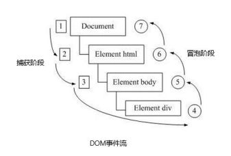

DOM 事件流分为 3 个阶段：
1.  捕获阶段
2.  当前目标阶段
3.  冒泡阶段

- 事件冒泡： IE 最早提出，事件开始时由最具体的元素接收，然后逐级向上传播到到 DOM 最顶层节点的过程。
- 事件捕获： 网景最早提出，由 DOM 最顶层节点开始，然后逐级向下传播到到最具体的元素接收的过程。

我们向水里面扔一块石头，首先它会有一个下降的过程，这个过程就可以理解为从最顶层向事件发生的最具体元素（目标点）的捕获过程；之后会产生泡泡，会在最低点（ 最具体元素）之后漂浮到水面上，这个过程相当于事件冒泡。

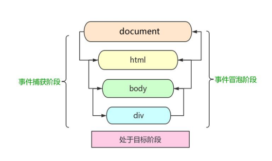

注意
1.  JS 代码中只能执行捕获或者冒泡其中的一个阶段。
2.  onclick 和 attachEvent 只能得到冒泡阶段。
3.  addEventListener(type, listener[, useCapture])第三个参数如果是 true，表示在事件捕获阶段调用事件处理程序；如果是 false（不写默认就是 false），表示在事件冒泡阶段调用事件处理程序。
4.  ==实际开发中我们很少使用事件捕获，我们更关注事件冒泡==。
5.  ==有些事件是没有冒泡的，比如 onblur、onfocus、onmouseenter、onmouseleave==
6.  ==事件冒泡有时候会带来麻烦，有时候又会帮助很巧妙的做某些事件，我们后面讲解==。

## 3.4、事件对象
### 3.4.1、什么是事件对象

~~~js
eventTarget.onclick = function(event) {}
eventTarget.addEventListener('click', function(event) {}）
// 这个 event 就是事件对象，我们还喜欢的写成 e 或者 evt
~~~

官方解释：event 对象代表事件的状态，比如键盘按键的状态、鼠标的位置、鼠标按钮的状态。

简单理解：事件发生后，==跟事件相关的一系列信息数据的集合==都放到这个对象里面，这个对象就是==事件对象 event==，它有很多属性和方法。

比如：
1.  谁绑定了这个事件。
2.  鼠标触发事件的话，会得到鼠标的相关信息，如鼠标位置。
3.  键盘触发事件的话，会得到键盘的相关信息，如按了哪个键。

### 3.4.2、事件对象的使用语法

~~~js
eventTarget.onclick = function(event) {
     // 这个 event 就是事件对象，我们还喜欢的写成 e 或者 evt
}
eventTarget.addEventListener('click', function(event) {
     // 这个 event 就是事件对象，我们还喜欢的写成 e 或者 evt
}）
~~~

这个 event 是个形参，系统帮我们设定为事件对象，不需要传递实参过去。

当我们注册事件时， event 对象就会被系统自动创建，并依次传递给事件监听器（事件处理函数）。

### 3.4.3、事件对象的兼容性方案
事件对象本身的获取存在兼容问题：
1.  标准浏览器中是浏览器给方法传递的参数，只需要定义形参 e 就可以获取到。
2.  在 IE6~8 中，浏览器不会给方法传递参数，如果需要的话，需要到 window.event 中获取查找。

解决:

~~~js
e = e || window.event;
~~~

### 3.4.4、事件对象的常见属性和方法
==e.target 和 this 的区别==：
- ==this 是事件绑定的元素， 这个函数的调用者（绑定这个事件的元素）==
- ==e.target 是事件触发的元素。==

| 事件对象属性方法 | 说明 |
| :----------------: | :----: |
e.target|返回触发事件的对象  标准
e.srcElement|返回触发事件的对象  非标准 ie6-8 使用
e.type|返回事件的类型比如 click mouseover 不带 on
e.cancelBubble|该属性阻止冒泡非标准 ie6-8 使用
e.returnValue|该属性阻止默认事件（默认行为）非标准 ie6-8 使用比如不让链接跳转
e.preventDefault()|该方法阻止默认事件（默认行为）标准比如不让链接跳转
e.stopPropagation()|阻止冒泡标准

~~~html
<body>
    <div>123</div>
    <a href="http://www.baidu.com">百度</a>
    <form action="http://www.baidu.com">
        <input type="submit" value="提交" name="sub">
    </form>
    <script>
        // 常见事件对象的属性和方法
        // 1. 返回事件类型
        var div = document.querySelector('div');
        div.addEventListener('click', fn);
        div.addEventListener('mouseover', fn);
        div.addEventListener('mouseout', fn);

        function fn(e) {
            console.log(e.type);

        }
        // 2. 阻止默认行为（事件） 让链接不跳转 或者让提交按钮不提交
        var a = document.querySelector('a');
        a.addEventListener('click', function(e) {
                e.preventDefault(); //  dom 标准写法
            })
            // 3. 传统的注册方式
        a.onclick = function(e) {
            // 普通浏览器 e.preventDefault();  方法
            // e.preventDefault();
            // 低版本浏览器 ie678  returnValue  属性
            // e.returnValue;
            // 我们可以利用 return false 也能阻止默认行为 没有兼容性问题 特点： return 后面的代码不执行了， 而且只限于传统的注册方式
            return false;
            alert(11);
        }
    </script>
</body>
~~~

## 3.5、阻止事件冒泡
### 3.5.1、阻止事件冒泡的两种方式
事件冒泡：开始时由最具体的元素接收，然后逐级向上传播到到 DOM 最顶层节点。

事件冒泡本身的特性，会带来的坏处，也会带来的好处，需要我们灵活掌握。

#### 阻止事件冒泡
- 标准写法：利用事件对象里面的 stopPropagation()方法

~~~js
e.stopPropagation()
~~~

- 非标准写法：IE 6-8 利用事件对象 cancelBubble 属性

~~~js
e.cancelBubble = true;
~~~

### 3.5.2、阻止事件冒泡的兼容性解决方案

~~~js
if (e && e.stopPropagation) {
        e.stopPropagation();
 } else {
        window.event.cancelBubble = true;
}
~~~

## 3.6、事件委托（代理、委派）
事件冒泡本身的特性，会带来的坏处，也会带来的好处，需要我们灵活掌握。生活中有如下场景：

咱们班有 100 个学生， 快递员有 100 个快递， 如果一个个的送花费时间较长。同时每个学生领取的时候，也需要排队领取，也花费时间较长，何如？

**解决方案**： 快递员把 100 个快递，委托给班主任，班主任把这些快递放到办公室，同学们下课自行领取即可。

**优势**： 快递员省事，委托给班主任就可以走了。 同学们领取也方便，因为相信班主任。

事件冒泡本身的特性，会带来的坏处，也会带来的好处，需要我们灵活掌握。程序中也有如此场景：

~~~html
<ul>
    <li>知否知否，应该有弹框在手</li>
    <li>知否知否，应该有弹框在手</li>
    <li>知否知否，应该有弹框在手</li>
    <li>知否知否，应该有弹框在手</li>
    <li>知否知否，应该有弹框在手</li>
</ul>
~~~

点击每个 li 都会弹出对话框，以前需要给每个 li 注册事件，是非常辛苦的，而且访问 DOM 的次数越多，这就会延长整个页面的交互就绪时间。

#### 事件委托
事件委托也称为事件代理， 在 jQuery 里面称为事件委派。

#### 事件委托的原理
==不是每个子节点单独设置事件监听器，而是事件监听器设置在其父节点上，然后利用冒泡原理影响设置每个子节点。==

以上案例：给 ul 注册点击事件，然后利用事件对象的 target 来找到当前点击的 li，因为点击 li，事件会冒泡到 ul 上，ul 有注册事件，就会触发事件监听器。

#### 事件委托的作用
我们只操作了一次 DOM ，提高了程序的性能。

## 3.7、常用的鼠标事件
### 3.7.1、常用的鼠标事件

| 鼠标事件 | 触发条件 |
| :--------: | :--------: |
onclick|鼠标点击左键触发
onmouseover|鼠标经过触发
onmouseout|鼠标离开触发
onfocus|获得鼠标焦点触发
onblur|失去鼠标焦点触发
onmousemove|鼠标移动触发
onmouseup|鼠标弹起触发
onmousedown|鼠标按下触发

#### 1.禁止鼠标右键菜单
contextmenu 主要控制应该何时显示上下文菜单，主要用于程序员取消默认的上下文菜单

~~~js
document.addEventListener('contextmenu', function(e) {
    e.preventDefault();
})
~~~

#### 2.禁止鼠标选中（selectstart 开始选中）

~~~js
document.addEventListener('selectstart', function(e) {
    e.preventDefault();
})
~~~

### 3.7.2、鼠标事件对象
==event== 对象代表事件的状态，跟事件相关的一系列信息的集合。现阶段我们主要是用鼠标事件对象 ==MouseEvent== 和键盘事件对象 ==KeyboardEvent==。

| 鼠标事件对象 | 说明 |
| :------------: | :----: |
e.clientX|返回鼠标相对于浏览器窗口可视区的 X 坐标
e.clientY|返回鼠标相对于浏览器窗口可视区的 Y 坐标
e.pagex|返回鼠标相对于文档页面的 X 坐标 E9+支持
e.pageY|返回鼠标相对于文档页面的 Y 坐标 E9+支持
e.screenX|返回鼠标相对于电脑屏幕的 X 坐标
e.screenY|返回鼠标相对于电脑屏幕的 Y 坐标

### 案例： 跟随鼠标的天使
天使图片一直跟随鼠标移动。

~~~js
var pic = document.querySelector('img');
document.addEventListener('mousemove', function(e) {
    var x = e.pageX;
    var y = e.pageY;
    pic.style.top = y - 40 + 'px';
    pic.style.left = x - 50 + 'px';
})
~~~

## 3.8、常用的键盘事件
### 3.8.1、常用键盘事件
事件除了使用鼠标触发，还可以使用键盘触发。

| 键盘事件 | 触发条件 |
| :--------: | :--------: |
onkeyup|某个键盘按键被松开时触发
onkeydown|某个键盘按键被按下时触发
onkeypress|某个键盘按键被按下时触发  ==但是它不识别功能键比如 ctrl shift 箭头等==

==注意==：
1.  ==如果使用 addEventListener 不需要加 on==
2.  ==onkeypress 和前面 2 个的区别是，它不识别功能键，比如左右箭头，shift 等。==
3.  ==三个事件的执行顺序是： keydown -- keypress --- keyup==

### 3.8.2、键盘事件对象

| 键盘事件对象属性 | 说明 |
| :----------------: | :----: |
keyCode|返回该键的 ASCII 值

==注意： onkeydown 和 onkeyup 不区分字母大小写，onkeypress 区分字母大小写。==

==在我们实际开发中，我们更多的使用 keydown 和 keyup， 它能识别所有的键（包括功能键）==

==Keypress 不识别功能键，但是 keyCode 属性能区分大小写，返回不同的 ASCII 值==

### 3.8.3、ASCII 表

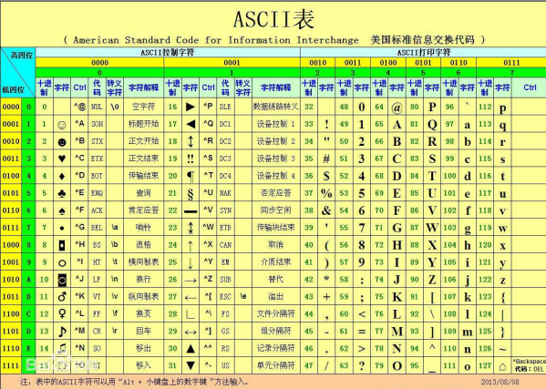

### 案例： 模拟京东按键输入内容
当我们按下 s 键， 光标就定位到搜索框

~~~js
var search = document.querySelector('input');
document.addEventListener('keyup', function(e) {
    // console.log(e.keyCode);
    if (e.keyCode === 83) {
        search.focus();
    }
})
~~~

### 案例： 模拟京东快递单号查询
**要求**：当我们在文本框中输入内容时，文本框上面自动显示大字号的内容。

**案例分析**
- 快递单号输入内容时， 上面的大号字体盒子（con）显示(这里面的文字
- 同时把快递单号里面的值（value）获取过来赋值给 con 盒子（innerText）做为内容
- 如果快递单号里面内容为空，则隐藏大号字体盒子(con)盒子
- ==注意： keydown 和 keypress 在文本框里面的特点： 他们两个事件触发的时候，文字还没有落入文本框中。==
- ==keyup 事件触发的时候， 文字已经落入文本框里面了==
- 当我们失去焦点，就隐藏这个 con 盒子
- 当我们获得焦点，并且文本框内容不为空，就显示这个 con 盒子

~~~html
<head>
    <style>
        - {
            margin: 0;
            padding: 0;
        }

        .search {
            position: relative;
            width: 178px;
            margin: 100px;
        }

        .con {
            display: none;
            position: absolute;
            top: -40px;
            width: 171px;
            border: 1px solid rgba(0,0, 0, .2);
            box-shadow: 0 2px 4px rgba(0,0, 0, .2);
            padding: 5px 0;
            font-size: 18px;
            line-height: 20px;
            color: #333;
        }

        .con:: before {
            content: '';
            width: 0;
            height: 0;
            position: absolute;
            top: 28px;
            left: 18px;
            border: 8px solid #000;
            border-style: solid dashed dashed;
            border-color: #fff transparent transparent;
        }
    </style>
</head>

<body>
    <div class="search">
        <div class="con">123</div>
        <input type="text" placeholder="请输入您的快递单号" class="jd">
    </div>
    <script>
        // 快递单号输入内容时， 上面的大号字体盒子（con）显示(这里面的字号更大）
        // 表单检测用户输入： 给表单添加键盘事件
        // 同时把快递单号里面的值（value）获取过来赋值给 con 盒子（innerText）做为内容
        // 如果快递单号里面内容为空，则隐藏大号字体盒子(con)盒子
        var con = document.querySelector('.con');
        var jd_input = document.querySelector('.jd');
        jd_input.addEventListener('keyup', function() {
                // console.log('输入内容啦');
                if (this.value == '') {
                    con.style.display = 'none';
 } else {
                    con.style.display = 'block';
                    con.innerText = this.value;
                }
            })
            // 当我们失去焦点，就隐藏这个 con 盒子
        jd_input.addEventListener('blur', function() {
                con.style.display = 'none';
            })
            // 当我们获得焦点，就显示这个 con 盒子
        jd_input.addEventListener('focus', function() {
            if (this.value !== '') {
                con.style.display = 'block';
            }
        })
    </script>
</body>
~~~

# 4、BOM 浏览器对象模型
---
## 4.1、BOM 概述
### 4.1.1、什么是 BOM
BOM（Browser Object Model）即==浏览器对象模型==，它提供了独立于内容而与==浏览器窗口进行交互的对象==，其核心对象是 window。

BOM 由一系列相关的对象构成，并且每个对象都提供了很多方法与属性。

BOM 缺乏标准，JavaScript 语法的标准化组织是 ECMA，DOM 的标准化组织是 W3C，BOM 最初是 Netscape 浏览器标准的一部分。

#### DOM
- 文档对象模型
- DOM 就是把「==文档==」当做一个「==对象==」来看待
- DOM 的顶级对象是 ==document==
- DOM 主要学习的是操作页面元素
- DOM 是 W3C 标准规范

#### BOM
- 浏览器对象模型
- 把「==浏览器==」当做一个「==对象==」来看待
- BOM 的顶级对象是 ==window==
- BOM 学习的是浏览器窗口交互的一些对象
- BOM 是浏览器厂商在各自浏览器上定义的，兼容性较差

### 4.1.2、BOM 的构成
BOM 比 DOM 更大，它包含 DOM。

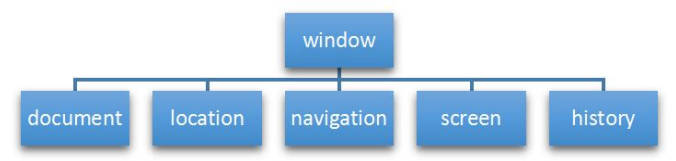

==window 对象是浏览器的顶级对象==，它具有双重角色。
1.  它是 JS 访问浏览器窗口的一个接口。
2.  它是一个全局对象。定义在全局作用域中的变量、函数都会变成 window 对象的属性和方法。

在调用的时候可以省略 window，前面学习的对话框都属于 window 对象方法，如 alert()、prompt() 等。

==注意：window 下的一个特殊属性 window.name==

## 4.2、window 对象的常见事件
### 4.2.1、窗口加载事件

~~~js
window.onload = function(){}
或者
window.addEventListener("load",function(){});
~~~

window.onload 是窗口 (页面）加载事件,当文档内容完全加载完成会触发该事件(包括图像、脚本文件、CSS 文件等), 就调用的处理函数。

==注意==：
1.  有了 window.onload 就可以把 JS 代码写到页面元素的上方，因为 onload 是等页面内容全部加载完毕，再去执行处理函数。
2.  window.onload 传统注册事件方式 只能写一次，如果有多个，会以最后一个 window.onload 为准。
3.  如果使用 addEventListener 则没有限制

~~~js
document.addEventListener('DOMContentLoaded',function(){})
~~~

DOMContentLoaded 事件触发时，仅当 DOM 加载完成，不包括样式表，图片，flash 等等。

Ie9 以上才支持

如果页面的图片很多的话, 从用户访问到 onload 触发可能需要较长的时间, 交互效果就不能实现，必然影响用户的体验，此时用 DOMContentLoaded 事件比较合适。

### 4.2.2、调整窗口大小事件

~~~js
window.onresize = function(){}

window.addEventListener("resize",function(){});
~~~

window.onresize 是调整窗口大小加载事件, 当触发时就调用的处理函数。

==注意==：
1.  只要窗口大小发生像素变化，就会触发这个事件。
2.  我们经常利用这个事件完成响应式布局。 window.innerWidth 当前屏幕的宽度  window.innerHeight 当前屏幕的宽度

## 4.3、定时器
### 4.3.1、两种定时器
window 对象给我们提供了 2 个非常好用的方法——==定时器==。
- setTimeout()
- setInterval()

### 4.3.2、setTimeout() 定时器

~~~js
 window.setTimeout(调用函数, [延迟的毫秒数]);
~~~

setTimeout() 方法用于设置一个定时器，该定时器在定时器到期后执行调用函数。

==注意==：
1.  window 可以省略。
2.  这个调用函数可以==直接写函数，或者写函数名==或者采取字符串==‘函数名()'==三种形式。第三种不推荐
3.  延迟的毫秒数省略默认是 0，如果写，必须是毫秒。
4.  因为定时器可能有很多，所以我们经常给定时器赋值一个标识符

~~~js
window.setTimeout(调用函数, [延迟的毫秒数]);
~~~

setTimeout() 这个调用函数我们也称为==回调函数 callback==

普通函数是按照代码顺序直接调用。

而这个函数，==需要等待==时间，时间到了才去调用这个函数，因此称为==回调函数==。

简单理解： 回调，就是回头调用的意思。上一件事干完，==再回头再调用这个函数==。

以前我们讲的 element.onclick = function(){} 或者 element.addEventListener(“click”, fn); 里面的 函数也是回调函数。

### 案例：5 秒后自动关闭的广告

~~~html
<body>
    
    <script>
        var ad = document.querySelector('.ad');
        setTimeout(function() {
            ad.style.display = 'none';
        }, 5000);
    </script>
</body>
~~~

### 4.3.3、停止 setTimeout() 定时器

~~~js
window.clearTimeout(timeoutID)
~~~

clearTimeout()方法取消了先前通过调用 setTimeout() 建立的定时器。

==注意==：
1.  window 可以省略。
2.  里面的参数就是定时器的标识符 。

### 4.3.4、setInterval() 定时器

~~~js
window.setInterval(回调函数, [间隔的毫秒数]);
~~~

setInterval() 方法重复调用一个函数，每隔这个时间，就去调用一次回调函数。

==注意==：
1.  window 可以省略。
2.  这个调用函数可以==直接写函数，或者写函数名==或者采取字符串 =='函数名()'== 三种形式。
3.  间隔的毫秒数省略默认是 0，如果写，必须是毫秒，表示每隔多少毫秒就自动调用这个函数。
4.  因为定时器可能有很多，所以我们经常给定时器赋值一个标识符。
5.  第一次执行也是间隔毫秒数之后执行，之后每隔毫秒数就执行一次。

### 案例： 倒计时

~~~html
<head>
    <style>
        div {
            margin: 200px;
        }

        span {
            display: inline-block;
            width: 40px;
            height: 40px;
            background-color: #333;
            font-size: 20px;
            color: #fff;
            text-align: center;
            line-height: 40px;
        }
    </style>
</head>

<body>
    <div>
        <span class="hour">1</span>
        <span class="minute">2</span>
        <span class="second">3</span>
    </div>
    <script>
        // 1. 获取元素
        var hour = document.querySelector('.hour'); // 小时的黑色盒子
        var minute = document.querySelector('.minute'); // 分钟的黑色盒子
        var second = document.querySelector('.second'); // 秒数的黑色盒子
        var inputTime = +new Date('2019-5-1 18:00:00'); // 返回的是用户输入时间总的毫秒数
        countDown(); // 我们先调用一次这个函数，防止第一次刷新页面有空白
        // 2. 开启定时器
        setInterval(countDown, 1000);

        function countDown() {
            var nowTime = +new Date(); // 返回的是当前时间总的毫秒数
            var times = (inputTime - nowTime) / 1000; // times 是剩余时间总的秒数
            var h = parseInt(times / 60 / 60% 24); //时
            h = h < 10 ? '0' + h : h;
            hour.innerHTML = h; // 把剩余的小时给 小时黑色盒子
            var m = parseInt(times / 60% 60); // 分
            m = m < 10 ? '0' + m : m;
            minute.innerHTML = m;
            var s = parseInt(times % 60); // 当前的秒
            s = s < 10 ? '0' + s : s;
            second.innerHTML = s;
        }
    </script>
</body>
~~~

### 4.3.5、停止 setInterval() 定时器

~~~js
window.clearInterval(intervalID);
~~~

clearInterval()方法取消了先前通过调用 setInterval()建立的定时器。

==注意==：
1.  window 可以省略。
2.  里面的参数就是定时器的标识符 。

### 案例： 发送短信
点击按钮后，该按钮 60 秒之内不能再次点击，防止重复发送短信

~~~html
<body>
    手机号码： <input type="number"> <button>发送</button>
    <script>
        // 按钮点击之后，会禁用 disabled 为 true
        // 同时按钮里面的内容会变化， 注意 button 里面的内容通过 innerHTML 修改
        // 里面秒数是有变化的，因此需要用到定时器
        // 定义一个变量，在定时器里面，不断递减
        // 如果变量为 0 说明到了时间，我们需要停止定时器，并且复原按钮初始状态
        var btn = document.querySelector('button');
        var time = 3; // 定义剩下的秒数
        btn.addEventListener('click', function() {
            btn.disabled = true;
            var timer = setInterval(function() {
                if (time == 0) {
                    // 清除定时器和复原按钮
                    clearInterval(timer);
                    btn.disabled = false;
                    btn.innerHTML = '发送';
                    time = 3; // 这个 3 需要重新开始
 } else {
                    btn.innerHTML = '还剩下' + time + '秒';
                    time--;
                }
            }, 1000);
        })
    </script>
</body>
~~~

### 4.3.6、this
this 的指向在函数定义的时候是确定不了的，只有函数执行的时候才能确定 this 到底指向谁，一般情况下 this 的最终指向的是那个调用它的对象。

现阶段，我们先了解一下几个 this 指向：
1.  全局作用域或者普通函数中 this 指向全局对象 window（注意定时器里面的 this 指向 window）
2.  方法调用中谁调用 this 指向方法的调用者
3.  构造函数中 this 指向构造函数的实例

## 4.4、JS 执行机制
### 4.4.1、JS 是单线程
JavaScript 语言的一大特点就是==单线程==，也就是说，==同一个时间只能做一件事==。这是因为 Javascript 这门脚本语言诞生的使命所致——JavaScript 是为处理页面中用户的交互，以及操作 DOM 而诞生的。比如我们对某个 DOM 元素进行添加和删除操作，不能同时进行。 应该先进行添加，之后再删除。

单线程就意味着，所有任务需要排队，前一个任务结束，才会执行后一个任务。这样所导致的问题是： 如果 JS 执行的时间过长，这样就会造成页面的渲染不连贯，导致页面渲染加载阻塞的感觉。

### 4.4.2、两个问题
以下代码执行的结果是什么？

~~~js
console.log(1);
setTimeout(function () {
    console.log(3);
}, 1000);
console.log(2);
~~~

结果是 1；2；3

那么以下代码执行的结果又是什么？

~~~js
console.log(1);
setTimeout(function () {
    console.log(3);
}, 0);
console.log(2);
~~~

结果是 1；2；3

### 4.4.3、同步和异步
为了解决这个问题，利用多核 CPU 的计算能力，HTML5 提出 Web Worker 标准，允许 JavaScript 脚本创建多个线程。于是，JS 中出现了==同步==和==异步==。

#### 同步
前一个任务结束后再执行后一个任务，程序的执行顺序与任务的排列顺序是一致的、同步的。比如做饭的同步做法：我们要烧水煮饭，等水开了（10 分钟之后），再去切菜，炒菜。

#### 异步
你在做一件事情时，因为这件事情会花费很长时间，在做这件事的同时，你还可以去处理其他事情。比如做饭的异步做法，我们在烧水的同时，利用这 10 分钟，去切菜，炒菜。

==**他们的本质区别： 这条流水线上各个流程的执行顺序不同。**==

#### 同步任务
同步任务都在主线程上执行，形成一个==执行栈==。

#### 异步任务
JS 的异步是通过回调函数实现的。

一般而言，异步任务有以下三种类型:
1、普通事件，如 click、resize 等
2、资源加载，如 load、error 等
3、定时器，包括 setInterval、setTimeout 等

异步任务相关==回调函数==添加到==任务队列==中（任务队列也称为消息队列）。

### 4.4.4、JS 执行机制
1.  先执行==执行栈中的同步任务==。
2.  异步任务（回调函数）放入任务队列中。
3.  一旦执行栈中的所有同步任务执行完毕，系统就会按次序读取==任务队列==中的异步任务，于是被读取的异步任务结束等待状态，进入执行栈，开始执行。

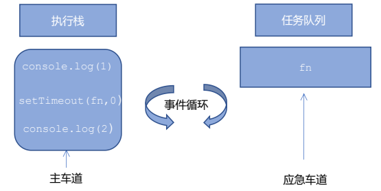

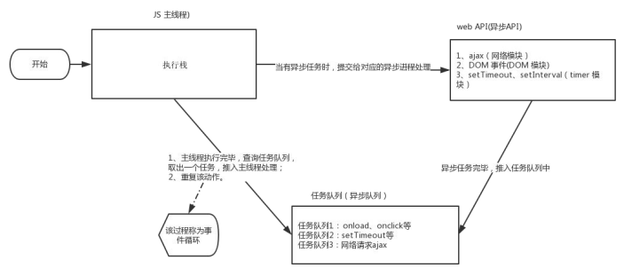

由于主线程不断的重复获得任务、执行任务、再获取任务、再执行，所以这种机制被称为事件循环==（ event loop）==。

## 4.5、location 对象
### 4.5.1、什么是 location 对象
window 对象给我们提供了一个 ==location 属性==用于==获取或设置窗体的 URL==，并且可以用于==解析 URL== 。 因为这个属性返回的是一个对象，所以我们将这个属性也称为 ==location 对象==。

### 4.5.2、URL
==统一资源定位符 (Uniform Resource Locator, URL)== 是互联网上标准资源的地址。互联网上的每个文件都有一个唯一的 URL，它包含的信息指出文件的位置以及浏览器应该怎么处理它。

URL 的一般语法格式为：

~~~js
protocol://host[: port]/path/[?query]#fragment

http://www.itcast.cn/index.html?name=andy&age=18#link
~~~

| 组成 | 说明 |
| :----: | :----: |
protocol|通信协议常用的 http,ftp,maito 等
host|主机（域名） www.itheima.com
port|端口号可选，省略时使用方案的默认端口如 ttp 的默认端口为 80
path|路径由零或多个'/符号隔开的字符串，一般用来表示主机上的一个目录或文件地址
query|参数  以键值对的形式，通过&符号分隔开来
fragment|片段  \#后面内容常见于链接锚点

### 4.5.3、location 对象的属性

| location 对象属性 | 返回值 |
| :----------------: | :------: |
location.href|获取或者设置整个 URL
location.host|返回主机（域名） www.itheima.com
location.port|返回端口号如果未写返回空字符串
location.pathname|返回路径
location.search|返回参数
location.hash|返回片段  \#后面内容常见于链接锚点

==重点记住： href 和 search==

### 案例： 5 秒钟之后自动跳转页面

~~~html
<body>
    <button>点击</button>
    <div></div>
    <script>
        var btn = document.querySelector('button');
        var div = document.querySelector('div');
        btn.addEventListener('click', function() {
            // console.log(location.href);
            location.href = 'http://www.itcast.cn';
        })
        var timer = 5;
        setInterval(function() {
            if (timer == 0) {
                location.href = 'http://www.itcast.cn';
 } else {
                div.innerHTML = '您将在' + timer + '秒钟之后跳转到首页';
                timer--;
            }
        }, 1000);
    </script>
</body>
~~~

### 案例： 获取 URL 参数数据
主要练习数据在不同页面中的传递。

**index.heml**

~~~html
<body>
    <div></div>
    <script>
        console.log(location.search); // ?uname=ANDY
        // 1.先去掉？  substr('起始的位置'，截取几个字符);
        var params = location.search.substr(1); // uname=ANDY
        console.log(params);
        // 2. 利用 = 把字符串分割为数组 split('=');
        var arr = params.split('=');
        console.log(arr); // ["uname", "ANDY"]
        var div = document.querySelector('div');
        // 3.把数据写入 div 中
        div.innerHTML = arr[1] + '欢迎您';
    </script>
</body>
~~~

**login.html**

~~~html
<body>
    <form action="index.html">
        用户名： <input type="text" name="uname"> // 有 name 才能提交
        <input type="submit" value="登录">
    </form>
</body>
~~~

### 4.5.4、location 对象的方法

| location 对象方法 | 返回值 |
| :----------------: | :------: |
location.assign()|跟 href 一样，可以跳转页面（也称为重定向页面），记录历史，可后退
location.replace()|替换当前页面，因为不记录历史，所以不能后退页面
location.reload()|重新加载页面，如果参数为空或 false ，相当于刷新按钮或者 f5 ；如果参数为 true， 强制刷新，相当于 ctrl+f5

## 4.6、navigator 对象
navigator 对象包含有关浏览器的信息，它有很多属性，我们最常用的是 userAgent，该属性可以返回由客户机发送服务器的 user-agent 头部的值。

下面前端代码可以判断用户那个终端打开页面，实现跳转：

~~~js
if((navigator.userAgent.match(/(phone|pad|pod|iPhone|iPod|ios|iPad|Android|
Mobile|BlackBerry|IEMobile|MQQBrowser|JUC|Fennec|wOSBrowser|BrowserNG|WebOS
|Symbian|Windows Phone)/i))) {
    window.location.href = ""; //手机
} else {
    window.location.href = ""; //电脑
}
~~~

## 4.7、history 对象
window 对象给我们提供了一个 history 对象，与浏览器历史记录进行交互。该对象包含用户（在浏览器窗口中）访问过的 URL。

| history 对象方法 | 作用 |
| :---------------: | :----: |
back()|可以后退功能
forward()|前进功能
go(参数)|前进后退功能，参数如果是 1，前进 1 个页面；如果是-1，后退 1 个页面

history 对象一般在实际开发中比较少用，但是会在一些 OA 办公系统中见到。

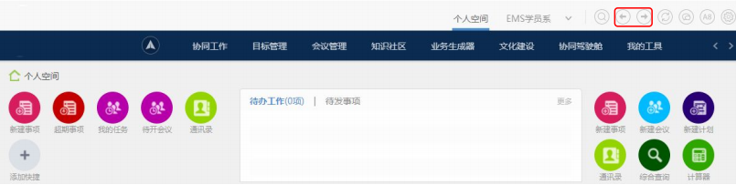

# 5、PC 端网页特效
---
## 5.1、元素偏移量 offset 系列
### 5.1.1、offset 概述
offset 翻译过来就是偏移量， 我们使用 offset 系列相关属性可以==动态的==得到该元素的位置（偏移）、大小等。
- 获得元素距离==带有定位父元素==的位置
- 获得元素自身的大小（宽度高度）
- 注意： 返回的数值都不带单位

offset 系列常用属性：

| offset:系列属性 | 作用 |
| :---------------: | :----: |
element.offsetParent|返回作为该元素==带有定位的父级元素==，如果父级都没有定位则返回 boy
element.offsetTop|返回元素相对==带有定位父元素==上方的偏移
element.offsetLeft|返回元素相对==带有定位父元素==左边框的偏移
element.offsetWidth|返回自身包括 padding、边框、内容区的宽度，返回数值不带单位
element.offsetHeight|返回自身包括 padding、边框、内容区的高度，返回数值不带单位

### 5.1.2、offset 与 style 区别
#### offset
- offset 可以得到任意样式表中的样式值
- offset 系列获得的数值是没有单位的
- offsetWidth 包含 padding+border+width
- offsetWidth 等属性是只读属性，只能获取不能赋值
- ==所以，我们想要获取元素大小位置，用 offset 更合适==

#### style
- style 只能得到==行内样式表==中的样式值
- style.width 获得的是带有单位的字符串
- style.width 获得不包含 padding 和 border 的值
- style.width 是可读写属性，可以获取也可以赋值
- ==所以，我们想要给元素更改值，则需要用 style 改变==

### 5.1.3、offset 概述
offset 翻译过来就是偏移量， 我们使用 offset 系列相关属性可以动态的得到该元素的位置（偏移）、大小等。
- 获得元素距离带有定位父元素的位置
- 获得元素自身的大小（宽度高度）

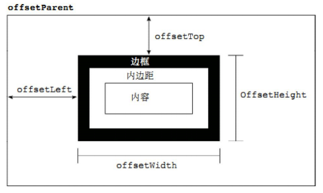

### 案例：获取鼠标在盒子内的坐标

~~~js
var box = document.querySelector('.box');
box.addEventListener('mousemove', function(e) {
    var x = e.pageX - this.offsetLeft;
    var y = e.pageY - this.offsetTop;
    this.innerHTML = 'x 坐标是' + x + ' y 坐标是' + y;
})
~~~

### 案例：模态框拖拽
弹出框，我们也称为模态框。
1.  点击弹出层， 会弹出模态框， 并且显示灰色半透明的遮挡层。
2.  点击关闭按钮，可以关闭模态框，并且同时关闭灰色半透明遮挡层。
3.  鼠标放到模态框最上面一行，可以按住鼠标拖拽模态框在页面中移动。
4.  鼠标松开，可以停止拖动模态框移动。

**案例分析**:
1.  点击弹出层， 模态框和遮挡层就会显示出来 display: block;
2.  点击关闭按钮，模态框和遮挡层就会隐藏起来 display: none;
3.  在页面中拖拽的原理： 鼠标按下并且移动， 之后松开鼠标
4.  触发事件是鼠标按下 mousedown， 鼠标移动 mousemove 鼠标松开 mouseup
5.  拖拽过程: 鼠标移动过程中，获得最新的值赋值给模态框的 left 和 top 值， 这样模态框可以跟着鼠标走了
6.  鼠标按下触发的事件源是 最上面一行，就是 id 为 title
7.  鼠标的坐标 减去 鼠标在盒子内的坐标， 才是模态框真正的位置。
8.  ==鼠标按下==，我们要得到鼠标在盒子的坐标。
9.  ==鼠标移动==，就让模态框的坐标 设置为 ： 鼠标坐标 减去盒子坐标即可，注意移动事件写到按下事件里面。
10. ==鼠标松开==，就停止拖拽，就是可以让鼠标移动事件解除

~~~html
<!DOCTYPE html>
<html>

<head lang="en">
    <meta charset="UTF-8">
    <title></title>
    <style>
        .login-header {
            width: 100%;
            text-align: center;
            height: 30px;
            font-size: 24px;
            line-height: 30px;
        }

        ul,
        li,
        ol,
        dl,
        dt,
        dd,
        div,
        p,
        span,
        h1,
        h2,
        h3,
        h4,
        h5,
        h6,
        a {
            padding: 0px;
            margin: 0px;
        }

        .login {
            display: none;
            width: 512px;
            height: 280px;
            position: fixed;
            border: #ebebeb solid 1px;
            left: 50%;
            top: 50%;
            background: #ffffff;
            box-shadow: 0px 0px 20px #ddd;
            z-index: 9999;
            transform: translate(-50%, -50%);
        }

        .login-title {
            width: 100%;
            margin: 10px 0px 0px 0px;
            text-align: center;
            line-height: 40px;
            height: 40px;
            font-size: 18px;
            position: relative;
            cursor: move;
        }

        .login-input-content {
            margin-top: 20px;
        }

        .login-button {
            width: 50%;
            margin: 30px auto 0px auto;
            line-height: 40px;
            font-size: 14px;
            border: #ebebeb 1px solid;
            text-align: center;
        }

        .login-bg {
            display: none;
            width: 100%;
            height: 100%;
            position: fixed;
            top: 0px;
            left: 0px;
            background: rgba(0,0, 0, .3);
        }

        a {
            text-decoration: none;
            color: #000000;
        }

        .login-button a {
            display: block;
        }

        .login-input input.list-input {
            float: left;
            line-height: 35px;
            height: 35px;
            width: 350px;
            border: #ebebeb 1px solid;
            text-indent: 5px;
        }

        .login-input {
            overflow: hidden;
            margin: 0px 0px 20px 0px;
        }

        .login-input label {
            float: left;
            width: 90px;
            padding-right: 10px;
            text-align: right;
            line-height: 35px;
            height: 35px;
            font-size: 14px;
        }

        .login-title span {
            position: absolute;
            font-size: 12px;
            right: -20px;
            top: -30px;
            background: #ffffff;
            border: #ebebeb solid 1px;
            width: 40px;
            height: 40px;
            border-radius: 20px;
        }
    </style>
</head>

<body>
    <div class="login-header"><a id="link" href="javascript:;">点击，弹出登录框</a></div>
    <div id="login" class="login">
        <div id="title" class="login-title">登录会员
            <span><a id="closeBtn" href="javascript: void(0);" class="close-login">关闭</a></span>
        </div>
        <div class="login-input-content">
            <div class="login-input">
                <label>用户名：</label>
                <input type="text" placeholder="请输入用户名" name="info[username]" id="username" class="list-input">
            </div>
            <div class="login-input">
                <label>登录密码：</label>
                <input type="password" placeholder="请输入登录密码" name="info[password]" id="password" class="list-input">
            </div>
        </div>
        <div id="loginBtn" class="login-button"><a href="javascript: void(0);" id="login-button-submit">登录会员</a></div>
    </div>
    <!-- 遮盖层 -->
    <div id="bg" class="login-bg"></div>
    <script>
        // 1. 获取元素
        var login = document.querySelector('.login');
        var mask = document.querySelector('.login-bg');
        var link = document.querySelector('#link');
        var closeBtn = document.querySelector('#closeBtn');
        var title = document.querySelector('#title');
        // 2. 点击弹出层这个链接 link  让 mask 和 login 显示出来
        link.addEventListener('click', function() {
                mask.style.display = 'block';
                login.style.display = 'block';
            })
            // 3. 点击 closeBtn 就隐藏 mask 和 login
        closeBtn.addEventListener('click', function() {
                mask.style.display = 'none';
                login.style.display = 'none';
            })
            // 4. 开始拖拽
            // (1) 当我们鼠标按下， 就获得鼠标在盒子内的坐标
        title.addEventListener('mousedown', function(e) {
            var x = e.pageX - login.offsetLeft;
            var y = e.pageY - login.offsetTop;
            // (2) 鼠标移动的时候，把鼠标在页面中的坐标，减去 鼠标在盒子内的坐标就是模态框的 left 和 top 值
            document.addEventListener('mousemove', move)

            function move(e) {
                login.style.left = e.pageX - x + 'px';
                login.style.top = e.pageY - y + 'px';
            }
            // (3) 鼠标弹起，就让鼠标移动事件移除
            document.addEventListener('mouseup', function() {
                document.removeEventListener('mousemove', move);
            })
        })
    </script>
</body>

</html>
~~~

### 案例：仿京东放大镜
**案例分析**:
整个案例可以分为三个功能模块
1.  鼠标经过小图片盒子， 黄色的遮挡层 和 大图片盒子显示，离开隐藏 2 个盒子功能
    - 就是显示与隐藏
2.  黄色的遮挡层跟随鼠标功能。
    - 把鼠标坐标给遮挡层不合适。因为遮挡层坐标以父盒子为准。
    - 首先是获得鼠标在盒子的坐标。
    - 之后把数值给遮挡层做为 left 和 top 值
    - 此时用到鼠标移动事件，但是还是在小图片盒子内移动。
    - 发现，遮挡层位置不对，需要再减去盒子自身高度和宽度的一半。
    - 遮挡层不能超出小图片盒子范围。
    - 如果小于零，就把坐标设置为 0
    - 如果大于遮挡层最大的移动距离，就把坐标设置为最大的移动距离
    - 遮挡层的最大移动距离： 小图片盒子宽度 减去 遮挡层盒子宽度
3.  移动黄色遮挡层，大图片跟随移动功能。
    - 移动黄色遮挡层，大图片跟随移动功能
    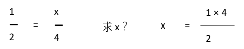
    - 求大图片的移动距离公式
    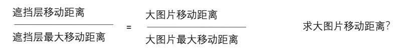
    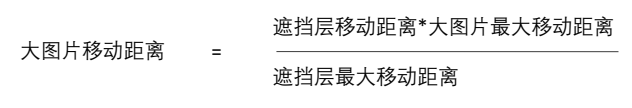

~~~css
.preview_img {
    position: relative;
    height: 398px;
    border: 1px solid #ccc;
}

.mask {
    display: none;
    position: absolute;
    top: 0;
    left: 0;
    width: 300px;
    height: 300px;
    background: #FEDE4F;
    opacity: .5;
    border: 1px solid #ccc;
    cursor: move;
}

.big {
    display: none;
    position: absolute;
    left: 410px;
    top: 0;
    width: 500px;
    height: 500px;
    background-color: pink;
    z-index: 999;
    border: 1px solid #ccc;
    overflow: hidden;
}

.big img {
    position: absolute;
    top: 0;
    left: 0;
}
~~~

~~~js
window.addEventListener('load', function() {
    var preview_img = document.querySelector('.preview_img');
    var mask = document.querySelector('.mask');
    var big = document.querySelector('.big');
    // 1. 当我们鼠标经过 preview_img 就显示和隐藏 mask 遮挡层 和 big 大盒子
    preview_img.addEventListener('mouseover', function() {
        mask.style.display = 'block';
        big.style.display = 'block';
    })
    preview_img.addEventListener('mouseout', function() {
            mask.style.display = 'none';
            big.style.display = 'none';
        })
        // 2. 鼠标移动的时候，让黄色的盒子跟着鼠标来走
    preview_img.addEventListener('mousemove', function(e) {
        // (1). 先计算出鼠标在盒子内的坐标
        var x = e.pageX - this.offsetLeft;
        var y = e.pageY - this.offsetTop;
        // console.log(x, y);
        // (2) 减去盒子高度 300 的一半 是 150 就是我们 mask 的最终 left 和 top 值了
        // (3) 我们 mask 移动的距离
        var maskX = x - mask.offsetWidth / 2;
        var maskY = y - mask.offsetHeight / 2;
        // (4) 如果 x 坐标小于了 0 就让他停在 0 的位置
        // 遮挡层的最大移动距离
        var maskMax = preview_img.offsetWidth - mask.offsetWidth;
        if (maskX <= 0) {
            maskX = 0;
 } else if (maskX >= maskMax) {
            maskX = maskMax;
        }
        if (maskY <= 0) {
            maskY = 0;
 } else if (maskY >= maskMax) {
            maskY = maskMax;
        }
        mask.style.left = maskX + 'px';
        mask.style.top = maskY + 'px';
        // 3. 大图片的移动距离 = 遮挡层移动距离 * 大图片最大移动距离 / 遮挡层的最大移动距离
        // 大图
        var bigIMg = document.querySelector('.bigImg');
        // 大图片最大移动距离
        var bigMax = bigIMg.offsetWidth - big.offsetWidth;
        // 大图片的移动距离 X Y
        var bigX = maskX * bigMax / maskMax;
        var bigY = maskY * bigMax / maskMax;
        bigIMg.style.left = -bigX + 'px';
        bigIMg.style.top = -bigY + 'px';
    })
})
~~~

## 5.2、元素可视区 client 系列
==client== 翻译过来就是客户端，我们使用 client 系列的相关属性来获取元素可视区的相关信息。通过 client 系列的相关属性可以动态的得到该元素的边框大小、元素大小等。

| client 系列属性 | 作用 |
| :--------------: | :----: |
element.clientTop|返回元素上边框的大小
element.clientLeft|返回元素左边框的大小
element.clientWidth|返回自身包括 padding、内容区的宽度，不含边框，返回数值不带单位
element.clientHeight|返回自身包括 padding、内容区的高度，不含边框，返回数值不带单位

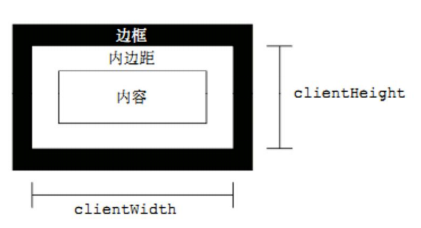

### 案例： 淘宝 flexible.js 源码分析
立即执行函数 ==(function() {})()== 或者 ==(function(){}())==

主要作用： 创建一个独立的作用域。 避免了命名冲突问题

~~~js
(function flexible(window, document) {
    // 获取的 html 的根元素
    var docEl = document.documentElement
        // dpr 物理像素比
    var dpr = window.devicePixelRatio || 1

    // adjust body font size  设置我们 body 的字体大小
    function setBodyFontSize() {
        // 如果页面中有 body 这个元素 就设置 body 的字体大小
        if (document.body) {
            document.body.style.fontSize = (12 * dpr) + 'px'
 } else {
            // 如果页面中没有 body 这个元素，则等着 我们页面主要的 DOM 元素加载完毕再去设置 body 的字体大小
            document.addEventListener('DOMContentLoaded', setBodyFontSize)
        }
    }
    setBodyFontSize();

    // set 1rem = viewWidth / 10    设置我们 html 元素的文字大小
    function setRemUnit() {
        var rem = docEl.clientWidth / 10
        docEl.style.fontSize = rem + 'px'
    }

    setRemUnit()

    // reset rem unit on page resize  当我们页面尺寸大小发生变化的时候，要重新设置下 rem 的大小
    window.addEventListener('resize', setRemUnit)
        // pageshow 是我们重新加载页面触发的事件
    window.addEventListener('pageshow', function(e) {
        // e.persisted 返回的是 true 就是说如果这个页面是从缓存取过来的页面，也需要从新计算一下 rem 的大小
        if (e.persisted) {
            setRemUnit()
        }
    })

    // detect 0.5px supports  有些移动端的浏览器不支持 0.5 像素的写法
    if (dpr >= 2) {
        var fakeBody = document.createElement('body')
        var testElement = document.createElement('div')
        testElement.style.border = '.5px solid transparent'
        fakeBody.appendChild(testElement)
        docEl.appendChild(fakeBody)
        if (testElement.offsetHeight === 1) {
            docEl.classList.add('hairlines')
        }
        docEl.removeChild(fakeBody)
    }
}(window, document))
~~~

下面三种情况都会刷新页面都会触发 load 事件。
1.  a 标签的超链接
2.  F5 或者刷新按钮（强制刷新）
3.  前进后退按钮

但是 火狐中，有个特点，有个“往返缓存”，这个缓存中不仅保存着页面数据，还保存了 DOM 和 JavaScript 的状态；实际上是将整个页面都保存在了内存里。

所以此时后退按钮不能刷新页面。

此时可以使用 pageshow 事件来触发。，这个事件在页面显示时触发，无论页面是否来自缓存。在重新加载页面中，pageshow 会在 load 事件触发后触发；根据事件对象中的 persisted 来判断是否是缓存中的页面触发的 pageshow 事件，==注意这个事件给 window 添加==。

## 5.3、元素滚动 scroll 系列
### 5.3.1、元素 scroll 系列属性
==scroll== 翻译过来就是滚动的，我们使用 scroll 系列的相关属性可以动态的得到该元素的大小、滚动距离等。

| scroll 系列属性 | 作用 |
| :--------------: | :----: |
element.scrollTop|返回被卷去的上侧距离，返回数值不带单位
element.scrollLeft|返回被卷去的左侧距离，返回数值不带单位
element.scrollWidth|返回自身实际的宽度，不含边框，返回数值不带单位
element.scrollHeight|返回自身实际的高度，不含边框，返回数值不带单位

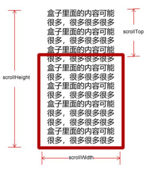

### 5.3.2、页面被卷去的头部
如果浏览器的高（或宽）度不足以显示整个页面时，会自动出现滚动条。当滚动条向下滚动时，页面上面被隐藏掉的高度，我们就称为页面被卷去的头部。滚动条在滚动时会触发 onscroll 事件。

### 案例：仿淘宝固定右侧侧边栏
1.原先侧边栏是绝对定位
2.  当页面滚动到一定位置，侧边栏改为固定定位
3.  页面继续滚动，会让返回顶部显示出来

**案例分析**：
1.  需要用到页面滚动事件 scroll 因为是页面滚动，所以事件源是 document
2.  滚动到某个位置，就是判断页面被卷去的上部值。
3.  ==页面被卷去的头部：可以通过 window.pageYOffset 获得==，如果是被卷去的左侧 window.pageXOffset
4.  注意，元素被卷去的头部是 ==element.scrollTop== , 如果是页面被卷去的头部 则是 ==window.pageYOffset==
5.  其实这个值 可以通过盒子的 offsetTop 可以得到，如果大于等于这个值，就可以让盒子固定定位了

~~~html
<!DOCTYPE html>
<html lang="en">

<head>
    <meta charset="UTF-8">
    <meta name="viewport" content="width=device-width, initial-scale=1.0">
    <meta http-equiv="X-UA-Compatible" content="ie=edge">
    <title>Document</title>
    <style>
        .slider-bar {
            position: absolute;
            left: 50%;
            top: 300px;
            margin-left: 600px;
            width: 45px;
            height: 130px;
            background-color: pink;
        }

        .w {
            width: 1200px;
            margin: 10px auto;
        }

        .header {
            height: 150px;
            background-color: purple;
        }

        .banner {
            height: 250px;
            background-color: skyblue;
        }

        .main {
            height: 1000px;
            background-color: yellowgreen;
        }

        span {
            display: none;
            position: absolute;
            bottom: 0;
        }
    </style>
</head>

<body>
    <div class="slider-bar">
        <span class="goBack">返回顶部</span>
    </div>
    <div class="header w">头部区域</div>
    <div class="banner w">banner 区域</div>
    <div class="main w">主体部分</div>
    <script>
        //1. 获取元素
        var sliderbar = document.querySelector('.slider-bar');
        var banner = document.querySelector('.banner');
        // banner.offestTop 就是被卷去头部的大小 一定要写到滚动的外面
        var bannerTop = banner.offsetTop
            // 当我们侧边栏固定定位之后应该变化的数值
        var sliderbarTop = sliderbar.offsetTop - bannerTop;
        // 获取 main 主体元素
        var main = document.querySelector('.main');
        var goBack = document.querySelector('.goBack');
        var mainTop = main.offsetTop;
        // 2. 页面滚动事件 scroll
        document.addEventListener('scroll', function() {
            // console.log(11);
            // window.pageYOffset 页面被卷去的头部
            // console.log(window.pageYOffset);
            // 3 .当我们页面被卷去的头部大于等于了 172 此时 侧边栏就要改为固定定位
            if (window.pageYOffset >= bannerTop) {
                sliderbar.style.position = 'fixed';
                sliderbar.style.top = sliderbarTop + 'px';
 } else {
                sliderbar.style.position = 'absolute';
                sliderbar.style.top = '300px';
            }
            // 4. 当我们页面滚动到 main 盒子，就显示 goback 模块
            if (window.pageYOffset >= mainTop) {
                goBack.style.display = 'block';
 } else {
                goBack.style.display = 'none';
            }
        })
    </script>
</body>
</html>
~~~

### 5.3.3、页面被卷去的头部兼容性解决方案
需要注意的是，页面被卷去的头部，有兼容性问题，因此被卷去的头部通常有如下几种写法：
1.  声明了 DTD，使用 document.documentElement.scrollTop
2.  未声明 DTD，使用 document.body.scrollTop
3.  新方法 window.pageYOffset 和 window.pageXOffset，IE9 开始支持

~~~js
function getScroll() {
    return {
        left: window.pageXOffset || document.documentElement.scrollLeft || document.body.scrollLeft||0,
        top: window.pageYOffset || document.documentElement.scrollTop || document.body.scrollTop || 0
    };
}
使用的时候 getScroll().left
~~~

### 三大系列总结

| 三大系列大小对比 | 作用 |
| :----------------: | :----: |
element.offsetWidth|返回自身包括 padding、边框、内容区的宽度，返回数值不带单位
element.clientWidth|返回自身包括 padding、内容区的宽度，不含边框，返回数值不带单位
element.scrollWidth|返回自身实际的宽度，不含边框，返回数值不带单位

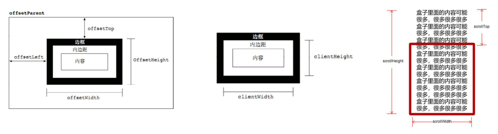

他们主要用法：
1.  offset 系列经常用于获得元素位置 ==offsetLeft offsetTop==
2.  client 经常用于获取元素大小 ==clientWidth clientHeight==
3.  scroll 经常用于获取滚动距离 ==scrollTop scrollLeft==
4.  ==注意页面滚动的距离通过== window.pageXOffset 获得

### mouseenter 和 mouseover 的区别
#### mouseenter 鼠标事件
- 当鼠标移动到元素上时就会触发 mouseenter 事件
- 类似 mouseover，它们两者之间的差别是
- mouseover 鼠标经过自身盒子会触发，经过子盒子还会触发。 mouseenter 只会经过自身盒子触发
- 之所以这样，就是因为 mouseenter 不会冒泡
- 跟 mouseenter 搭配 鼠标离开 mouseleave 同样不会冒泡

## 5.4、动画函数封装
### 5.4.1、动画实现原理
==核心原理==：通过定时器 setInterval() 不断移动盒子位置。

实现步骤：
1.  获得盒子当前位置
2.  让盒子在当前位置加上 1 个移动距离
3.  利用定时器不断重复这个操作
4.  加一个结束定时器的条件
5.  注意此元素需要添加定位，才能使用 element.style.left

~~~html
<head>
    <style>
        div {
            position: absolute;
            left: 0;
            width: 100px;
            height: 100px;
            background-color: pink;
        }
    </style>
</head>

<body>
    <div></div>
    <script>
        // 动画原理
        // 1. 获得盒子当前位置  
        // 2. 让盒子在当前位置加上1个移动距离
        // 3. 利用定时器不断重复这个操作
        // 4. 加一个结束定时器的条件
        // 5. 注意此元素需要添加定位， 才能使用element.style.left
        var div = document.querySelector('div');
        var timer = setInterval(function() {
            if (div.offsetLeft >= 400) {
                // 停止动画 本质是停止定时器
                clearInterval(timer);
            }
            div.style.left = div.offsetLeft + 1 + 'px';
        }, 30);
    </script>
</body>
~~~

### 5.4.2、动画函数简单封装
注意函数需要传递 2 个参数，==动画对象==和==移动到的距离==。

~~~html
<head>
    <style>
        div {
            position: absolute;
            left: 0;
            width: 100px;
            height: 100px;
            background-color: pink;
        }
        
        span {
            position: absolute;
            left: 0;
            top: 200px;
            display: block;
            width: 150px;
            height: 150px;
            background-color: purple;
        }
    </style>
</head>

<body>
    <div></div>
    <span>夏雨荷</span>
    <script>
        // 简单动画函数封装obj目标对象 target 目标位置
        function animate(obj, target) {
            var timer = setInterval(function() {
                if (obj.offsetLeft >= target) {
                    // 停止动画 本质是停止定时器
                    clearInterval(timer);
                }
                obj.style.left = obj.offsetLeft + 1 + 'px';

            }, 30);
        }

        var div = document.querySelector('div');
        var span = document.querySelector('span');
        // 调用函数
        animate(div, 300);
        animate(span, 200);
    </script>
</body>

~~~

### 5.4.3、动画函数给不同元素记录不同定时器
如果多个元素都使用这个动画函数，每次都要 var 声明定时器。我们可以给不同的元素使用不同的定时器（自己专门用自己的定时器）。

核心原理：利用 JS 是一门动态语言，可以很方便的给当前对象添加属性。

~~~html
<head>
    <style>
        div {
            position: absolute;
            left: 0;
            width: 100px;
            height: 100px;
            background-color: pink;
        }
        
        span {
            position: absolute;
            left: 0;
            top: 200px;
            display: block;
            width: 150px;
            height: 150px;
            background-color: purple;
        }
    </style>
</head>

<body>
    <button>点击夏雨荷才走</button>
    <div></div>
    <span>夏雨荷</span>
    <script>
        // var obj = {};
        // obj.name = 'andy';
        // 简单动画函数封装obj目标对象 target 目标位置
        // 给不同的元素指定了不同的定时器
        function animate(obj, target) {
            // 当我们不断的点击按钮，这个元素的速度会越来越快，因为开启了太多的定时器
            // 解决方案就是 让我们元素只有一个定时器执行
            // 先清除以前的定时器，只保留当前的一个定时器执行
            clearInterval(obj.timer);
            obj.timer = setInterval(function() {
                if (obj.offsetLeft >= target) {
                    // 停止动画 本质是停止定时器
                    clearInterval(obj.timer);
                }
                obj.style.left = obj.offsetLeft + 1 + 'px';

            }, 30);
        }

        var div = document.querySelector('div');
        var span = document.querySelector('span');
        var btn = document.querySelector('button');
        // 调用函数
        animate(div, 300);
        btn.addEventListener('click', function() {
            animate(span, 200);
        })
    </script>
</body>
~~~

### 5.4.4、缓动效果原理
缓动动画就是让元素运动速度有所变化，最常见的是让速度慢慢停下来

思路：
1.  让盒子每次移动的距离慢慢变小，速度就会慢慢落下来。
2.  核心算法： ==(目标值 - 现在的位置 ) / 10== 做为每次移动的距离 步长
3.  停止的条件是： 让当前盒子位置等于目标位置就停止定时器 4. 注意步长值需要取整

~~~js
// 缓动动画函数封装obj目标对象 target 目标位置
        // 思路：
        // 1. 让盒子每次移动的距离慢慢变小， 速度就会慢慢落下来。
        // 2. 核心算法：(目标值 - 现在的位置) / 10 做为每次移动的距离 步长
        // 3. 停止的条件是： 让当前盒子位置等于目标位置就停止定时器
        function animate(obj, target) {
            // 先清除以前的定时器，只保留当前的一个定时器执行
            clearInterval(obj.timer);
            obj.timer = setInterval(function() {
                // 步长值写到定时器的里面
                var step = (target - obj.offsetLeft) / 10;
                if (obj.offsetLeft == target) {
                    clearInterval(obj.timer);
                }
                // 把每次加1 这个步长值改为一个慢慢变小的值  步长公式：(目标值 - 现在的位置) / 10
                obj.style.left = obj.offsetLeft + step + 'px';

            }, 15);
        }
        var span = document.querySelector('span');
        var btn = document.querySelector('button');

        btn.addEventListener('click', function() {
                animate(span, 500);
		})
            // 匀速动画 就是 盒子是当前的位置 +  固定的值 10 
            // 缓动动画就是  盒子当前的位置 + 变化的值(目标值 - 现在的位置) / 10）
~~~

### 5.4.5、动画函数多个目标值之间移动
可以让动画函数从 800 移动到 500。

当我们点击按钮时候，判断步长是正值还是负值:
1.  如果是正值，则步长 往大了取整
2.  如果是负值，则步长 向小了取整

~~~js
        function animate(obj, target) {
            clearInterval(obj.timer);
            obj.timer = setInterval(function() {
                // 把我们步长值改为整数 不要出现小数的问题
                // var step = Math.ceil((target - obj.offsetLeft) / 10);
                var step = (target - obj.offsetLeft) / 10;
                step = step > 0 ? Math.ceil(step) : Math.floor(step);
                if (obj.offsetLeft == target) {
                    clearInterval(obj.timer);
                }
                obj.style.left = obj.offsetLeft + step + 'px';
            }, 15);
        }
        var span = document.querySelector('span');
        var btn500 = document.querySelector('.btn500');
        var btn800 = document.querySelector('.btn800');

        btn500.addEventListener('click', function() {
            animate(span, 500);
        })
        btn800.addEventListener('click', function() {
                animate(span, 800);
            })
~~~

### 5.4.6、动画函数添加回调函数
==回调函数原理==：函数可以作为一个参数。将这个函数作为参数传到另一个函数里面，当那个函数执行完之后，再执行传进去的这个函数，这个过程就叫做==回调==。

回调函数写的位置：定时器结束的位置。

~~~js
function animate(obj, target, callback) {
            // console.log(callback);  callback = function() {}  调用的时候 callback()
            clearInterval(obj.timer);
            obj.timer = setInterval(function() {
                var step = (target - obj.offsetLeft) / 10;
                step = step > 0 ? Math.ceil(step) : Math.floor(step);
                if (obj.offsetLeft == target) {
                    clearInterval(obj.timer);
                    // 回调函数写到定时器结束里面
                    if (callback) {
                        // 调用函数
                        callback();
                    }
                obj.style.left = obj.offsetLeft + step + 'px';
            }, 15);
        }
        var span = document.querySelector('span');
        var btn500 = document.querySelector('.btn500');
        var btn800 = document.querySelector('.btn800');

        btn500.addEventListener('click', function() {
            animate(span, 500);
        })
        btn800.addEventListener('click', function() {
                animate(span, 800, function() {
                    // alert('你好吗');
                    span.style.backgroundColor = 'red';
                });
            })
~~~

### 5.4.7、动画函数封装到单独 JS 文件里面
因为以后经常使用这个动画函数，可以单独封装到一个 JS 文件里面，使用的时候引用这个 JS 文件即可。
1.  单独新建一个 JS 文件。
2.  HTML 文件引入 JS 文件。

**animate.js**

~~~js
function animate(obj, target, callback) {
    // console.log(callback);  callback = function() {}  调用的时候 callback()
    // 先清除以前的定时器，只保留当前的一个定时器执行
    clearInterval(obj.timer);
    obj.timer = setInterval(function() {
        // 步长值写到定时器的里面
        // 把我们步长值改为整数 不要出现小数的问题
        // var step = Math.ceil((target - obj.offsetLeft) / 10);
        var step = (target - obj.offsetLeft) / 10;
        step = step > 0 ? Math.ceil(step) : Math.floor(step);
        if (obj.offsetLeft == target) {
            // 停止动画 本质是停止定时器
            clearInterval(obj.timer);
            // 回调函数写到定时器结束里面
            // if (callback) {
            //     // 调用函数
            //     callback();
            // }
            callback && callback();
        }
        // 把每次加1 这个步长值改为一个慢慢变小的值  步长公式：(目标值 - 现在的位置) / 10
        obj.style.left = obj.offsetLeft + step + 'px';
    }, 15);
}
~~~

## 5.5、常见网页特效案例
### 案例：网页轮播图
轮播图也称为焦点图，是网页中比较常见的网页特效。

功能需求：
1.  鼠标经过轮播图模块，左右按钮显示，离开隐藏左右按钮。
2.  点击右侧按钮一次，图片往左播放一张，以此类推， 左侧按钮同理。
3.  图片播放的同时，下面小圆圈模块跟随一起变化。
4.  点击小圆圈，可以播放相应图片。
5.  鼠标不经过轮播图， 轮播图也会自动播放图片。
6.  鼠标经过，轮播图模块， 自动播放停止。

#### 案例分析
1.  因为 js 较多，我们单独新建 js 文件夹，再新建 js 文件， 引入页面中。
2.  此时需要添加 load 事件。
3.  ==鼠标经过轮播图模块，左右按钮显示，离开隐藏左右按钮。==
4.  显示隐藏 display 按钮。

####  动态生成小圆圈
1.  核心思路：小圆圈的个数要跟图片张数一致
2.  所以首先先得到 ul 里面图片的张数（图片放入 li 里面，所以就是 li 的个数）
3.  利用循环动态生成小圆圈（这个小圆圈要放入 ol 里面）
4.  创建节点 createElement(‘li’)
5.  插入节点 ol. appendChild(li)
6.  第一个小圆圈需要添加 current 类

#### 小圆圈的排他思想
1.  点击当前小圆圈，就添加 current 类
2.  其余的小圆圈就移除这个 current 类
3.  注意： 我们在刚才生成小圆圈的同时，就可以直接绑定这个点击事件了。

#### 点击小圆圈滚动图片
1.  此时用到 animate 动画函数，将 js 文件引入（注意，因为 index.js 依赖 animate.js 所以，animate.js 要写到 index.js 上面）
2.  使用动画函数的前提，该元素必须有定位
3.  注意是 ul 移动 而不是小 li
4.  滚动图片的核心算法： 点击某个小圆圈 ， 就让图片滚动 小圆圈的==索引号乘以图片的宽度==做为 ul 移动距离
5.  此时需要知道小圆圈的索引号， 我们可以在生成小圆圈的时候，给它设置一个自定义属性，点击的时候获取这个自定义属性即可。

#### 点击右侧按钮一次，就让图片滚动一张。
1.  声明一个变量 num， 点击一次，自增 1， 让这个变量乘以图片宽度，就是 ul 的滚动距离。
2.  图片无缝滚动原理
3.  把 ul 第一个 li 复制一份，放到 ul 的最后面
4.  当图片滚动到克隆的最后一张图片时， 让 ul 快速的、不做动画的跳到最左侧： left 为 0
5.  同时 num 赋值为 0，可以从新开始滚动图片了

####  克隆第一张图片
1.  克隆 ul 第一个 li cloneNode() 加 true 深克隆 复制里面的子节点 false 浅克隆
2.  添加到 ul 最后面 appendChild

####  点击右侧按钮， 小圆圈跟随变化
1.  最简单的做法是再声明一个变量 circle，每次点击自增 1，注意，左侧按钮也需要这个变量，因此要声明全局变量。
2.  但是图片有 5 张，我们小圆圈只有 4 个少一个，必须加一个判断条件
3.  如果 circle == 4 就 从新复原为 0

####  自动播放功能
1.  添加一个定时器
2.  自动播放轮播图，实际就类似于点击了右侧按钮
3.  此时我们使用==手动调用==右侧按钮==点击事件== arrow_r.click()
4.  鼠标经过 focus 就停止定时器
5.  鼠标离开 focus 就开启定时器

~~~js
window.addEventListener('load', function() {
    // 1. 获取元素
    var arrow_l = document.querySelector('.arrow-l');
    var arrow_r = document.querySelector('.arrow-r');
    var focus = document.querySelector('.focus');
    var focusWidth = focus.offsetWidth;
    // 2. 鼠标经过focus 就显示隐藏左右按钮
    focus.addEventListener('mouseenter', function() {
        arrow_l.style.display = 'block';
        arrow_r.style.display = 'block';
        clearInterval(timer);
        timer = null; // 清除定时器变量
    });
    focus.addEventListener('mouseleave', function() {
        arrow_l.style.display = 'none';
        arrow_r.style.display = 'none';
        timer = setInterval(function() {
            //手动调用点击事件
            arrow_r.click();
        }, 2000);
    });
    // 3. 动态生成小圆圈  有几张图片，我就生成几个小圆圈
    var ul = focus.querySelector('ul');
    var ol = focus.querySelector('.circle');
    // console.log(ul.children.length);
    for (var i = 0; i < ul.children.length; i++) {
        // 创建一个小li 
        var li = document.createElement('li');
        // 记录当前小圆圈的索引号 通过自定义属性来做 
        li.setAttribute('index', i);
        // 把小li插入到ol 里面
        ol.appendChild(li);
        // 4. 小圆圈的排他思想 我们可以直接在生成小圆圈的同时直接绑定点击事件
        li.addEventListener('click', function() {
            // 干掉所有人 把所有的小li 清除 current 类名
            for (var i = 0; i < ol.children.length; i++) {
                ol.children[i].className = '';
            }
            // 留下我自己  当前的小li 设置current 类名
            this.className = 'current';
            // 5. 点击小圆圈，移动图片 当然移动的是 ul 
            // ul 的移动距离 小圆圈的索引号 乘以 图片的宽度 注意是负值
            // 当我们点击了某个小li 就拿到当前小li 的索引号
            var index = this.getAttribute('index');
            // 当我们点击了某个小li 就要把这个li 的索引号给 num  
            num = index;
            // 当我们点击了某个小li 就要把这个li 的索引号给 circle  
            circle = index;
            // num = circle = index;
            console.log(focusWidth);
            console.log(index);

            animate(ul, -index * focusWidth);
        })
    }
    // 把ol里面的第一个小li设置类名为 current
    ol.children[0].className = 'current';
    // 6. 克隆第一张图片(li)放到ul 最后面
    var first = ul.children[0].cloneNode(true);
    ul.appendChild(first);
    // 7. 点击右侧按钮， 图片滚动一张
    var num = 0;
    // circle 控制小圆圈的播放
    var circle = 0;
    // flag 节流阀
    var flag = true;
    arrow_r.addEventListener('click', function() {
        if (flag) {
            flag = false; // 关闭节流阀
            // 如果走到了最后复制的一张图片，此时 我们的ul 要快速复原 left 改为 0
            if (num == ul.children.length - 1) {
                ul.style.left = 0;
                num = 0;
            }
            num++;
            animate(ul, -num * focusWidth, function() {
                flag = true; // 打开节流阀
            });
            // 8. 点击右侧按钮，小圆圈跟随一起变化 可以再声明一个变量控制小圆圈的播放
            circle++;
            // 如果circle == 4 说明走到最后我们克隆的这张图片了 我们就复原
            if (circle == ol.children.length) {
                circle = 0;
            }
            // 调用函数
            circleChange();
        }
    });

    // 9. 左侧按钮做法
    arrow_l.addEventListener('click', function() {
        if (flag) {
            flag = false;
            if (num == 0) {
                num = ul.children.length - 1;
                ul.style.left = -num * focusWidth + 'px';
            }
            num--;
            animate(ul, -num * focusWidth, function() {
                flag = true;
            });
            // 点击左侧按钮，小圆圈跟随一起变化 可以再声明一个变量控制小圆圈的播放
            circle--;
            // 如果circle < 0  说明第一张图片，则小圆圈要改为第4个小圆圈（3）
            // if (circle < 0) {
            //     circle = ol.children.length - 1;
            // }
            circle = circle < 0 ? ol.children.length - 1 : circle;
            // 调用函数
            circleChange();
        }
    });

    function circleChange() {
        // 先清除其余小圆圈的current类名
        for (var i = 0; i < ol.children.length; i++) {
            ol.children[i].className = '';
        }
        // 留下当前的小圆圈的current类名
        ol.children[circle].className = 'current';
    }
    // 10. 自动播放轮播图
    var timer = setInterval(function() {
        //手动调用点击事件
        arrow_r.click();
    }, 2000);
})
~~~

### 5.5.1 节流阀
防止轮播图按钮连续点击造成播放过快。

节流阀目的：当上一个函数动画内容执行完毕，再去执行下一个函数动画，让事件无法连续触发。

核心实现思路：利用回调函数，添加一个变量来控制，锁住函数和解锁函数。

==开始设置一个变量 var flag = true;==

==If(flag) {flag = false; do something} 关闭水龙头==

利用回调函数 动画执行完毕， ==flag = true 打开水龙头==

### 案例：返回顶部
滚动窗口至文档中的特定位置。

==window.scroll(x, y)==

注意，里面的 ==x 和 y 不跟单位，直接写数字==

~~~html
<!DOCTYPE html>
<html lang="en">

<head>
    <meta charset="UTF-8">
    <meta name="viewport" content="width=device-width, initial-scale=1.0">
    <meta http-equiv="X-UA-Compatible" content="ie=edge">
    <title>Document</title>
    <style>
        .slider-bar {
            position: absolute;
            left: 50%;
            top: 300px;
            margin-left: 600px;
            width: 45px;
            height: 130px;
            background-color: pink;
        }
        
        .w {
            width: 1200px;
            margin: 10px auto;
        }
        
        .header {
            height: 150px;
            background-color: purple;
        }
        
        .banner {
            height: 250px;
            background-color: skyblue;
        }
        
        .main {
            height: 1000px;
            background-color: yellowgreen;
        }
        
        span {
            display: none;
            position: absolute;
            bottom: 0;
        }
    </style>
</head>

<body>
    <div class="slider-bar">
        <span class="goBack">返回顶部</span>
    </div>
    <div class="header w">头部区域</div>
    <div class="banner w">banner区域</div>
    <div class="main w">主体部分</div>
    <script>
        //1. 获取元素
        var sliderbar = document.querySelector('.slider-bar');
        var banner = document.querySelector('.banner');
        // banner.offestTop 就是被卷去头部的大小 一定要写到滚动的外面
        var bannerTop = banner.offsetTop
            // 当我们侧边栏固定定位之后应该变化的数值
        var sliderbarTop = sliderbar.offsetTop - bannerTop;
        // 获取main 主体元素
        var main = document.querySelector('.main');
        var goBack = document.querySelector('.goBack');
        var mainTop = main.offsetTop;
        // 2. 页面滚动事件 scroll
        document.addEventListener('scroll', function() {
                // console.log(11);
                // window.pageYOffset 页面被卷去的头部
                // console.log(window.pageYOffset);
                // 3 .当我们页面被卷去的头部大于等于了 172 此时 侧边栏就要改为固定定位
                if (window.pageYOffset >= bannerTop) {
                    sliderbar.style.position = 'fixed';
                    sliderbar.style.top = sliderbarTop + 'px';
                } else {
                    sliderbar.style.position = 'absolute';
                    sliderbar.style.top = '300px';
                }
                // 4. 当我们页面滚动到main盒子，就显示 goback模块
                if (window.pageYOffset >= mainTop) {
                    goBack.style.display = 'block';
                } else {
                    goBack.style.display = 'none';
                }

            })
            // 3. 当我们点击了返回顶部模块，就让窗口滚动的页面的最上方
        goBack.addEventListener('click', function() {
            // 里面的x和y 不跟单位的 直接写数字即可
            // window.scroll(0, 0);
            // 因为是窗口滚动 所以对象是window
            animate(window, 0);
        });
        // 动画函数
        function animate(obj, target, callback) {
            // console.log(callback);  callback = function() {}  调用的时候 callback()

            // 先清除以前的定时器，只保留当前的一个定时器执行
            clearInterval(obj.timer);
            obj.timer = setInterval(function() {
                // 步长值写到定时器的里面
                // 把我们步长值改为整数 不要出现小数的问题
                // var step = Math.ceil((target - obj.offsetLeft) / 10);
                var step = (target - window.pageYOffset) / 10;
                step = step > 0 ? Math.ceil(step) : Math.floor(step);
                if (window.pageYOffset == target) {
                    // 停止动画 本质是停止定时器
                    clearInterval(obj.timer);
                    // 回调函数写到定时器结束里面
                    // if (callback) {
                    //     // 调用函数
                    //     callback();
                    // }
                    callback && callback();
                }
                // 把每次加1 这个步长值改为一个慢慢变小的值  步长公式：(目标值 - 现在的位置) / 10
                // obj.style.left = window.pageYOffset + step + 'px';
                window.scroll(0, window.pageYOffset + step);
            }, 15);
        }
    </script>
</body>

</html>
~~~

### 案例：筋头云案例
鼠标经过某个小 li， 筋斗云跟着到当前小 li 位置

鼠标离开这个小 li， 筋斗云复原为原来的位置

鼠标点击了某个小 li， 筋斗云就会留在点击这个小 li 的位置

~~~html
<!DOCTYPE html>
<html>

<head lang="en">
    <meta charset="UTF-8">
    <title></title>
    <style>
        * {
            margin: 0;
            padding: 0
        }
        
        ul {
            list-style: none;
        }
        
        body {
            background-color: black;
        }
        
        .c-nav {
            width: 900px;
            height: 42px;
            background: #fff url(images/rss.png) no-repeat right center;
            margin: 100px auto;
            border-radius: 5px;
            position: relative;
        }
        
        .c-nav ul {
            position: absolute;
        }
        
        .c-nav li {
            float: left;
            width: 83px;
            text-align: center;
            line-height: 42px;
        }
        
        .c-nav li a {
            color: #333;
            text-decoration: none;
            display: inline-block;
            height: 42px;
        }
        
        .c-nav li a:hover {
            color: white;
        }
        
        .c-nav li.current a {
            color: #0dff1d;
        }
        
        .cloud {
            position: absolute;
            left: 0;
            top: 0;
            width: 83px;
            height: 42px;
            background: url(images/cloud.gif) no-repeat;
        }
    </style>
    <script src="animate.js"></script>
    <script>
        window.addEventListener('load', function() {
            // 1. 获取元素
            var cloud = document.querySelector('.cloud');
            var c_nav = document.querySelector('.c-nav');
            var lis = c_nav.querySelectorAll('li');
            // 2. 给所有的小li绑定事件 
            // 这个current 做为筋斗云的起始位置
            var current = 0;
            for (var i = 0; i < lis.length; i++) {
                // (1) 鼠标经过把当前小li 的位置做为目标值
                lis[i].addEventListener('mouseenter', function() {
                    animate(cloud, this.offsetLeft);
                });
                // (2) 鼠标离开就回到起始的位置 
                lis[i].addEventListener('mouseleave', function() {
                    animate(cloud, current);
                });
                // (3) 当我们鼠标点击，就把当前位置做为目标值
                lis[i].addEventListener('click', function() {
                    current = this.offsetLeft;
                });
            }
        })
    </script>
</head>

<body>
    <div id="c_nav" class="c-nav">
        <span class="cloud"></span>
        <ul>
            <li class="current"><a href="#">首页新闻</a></li>
            <li><a href="#">师资力量</a></li>
            <li><a href="#">活动策划</a></li>
            <li><a href="#">企业文化</a></li>
            <li><a href="#">招聘信息</a></li>
            <li><a href="#">公司简介</a></li>
            <li><a href="#">我是佩奇</a></li>
            <li><a href="#">啥是佩奇</a></li>
        </ul>
    </div>
</body>

</html>
~~~

# 6、移动端网页特效
---
## 6.1、触屏事件
### 6.1.1、触屏事件概述
移动端浏览器兼容性较好，我们不需要考虑以前 JS 的兼容性问题，可以放心的使用原生 JS 书写效果，但是移动端也有自己独特的地方。比如==触屏事件 touch==（也称触摸事件），Android 和 IOS 都有。

touch 对象代表一个触摸点。触摸点可能是一根手指，也可能是一根触摸笔。触屏事件可响应用户手指（或触控笔）对屏幕或者触控板操作。

常见的触屏事件如下：

| 触屏 touch 事件 | 说明 |
| :-------------: | :----: |
touchstart|手指触摸到一个 DOM 元素时触发
touchmove|手指在一个 DOM 元素上滑动时触发
touchend|手指从一个 DOM 元素上移开时触发

### 6.1.2、触摸事件对象（TouchEvent）
TouchEvent 是一类描述手指在触摸平面（触摸屏、触摸板等）的状态变化的事件。这类事件用于描述一个或多个触点，使开发者可以检测触点的移动，触点的增加和减少，等等

touchstart、touchmove、touchend 三个事件都会各自有事件对象。

触摸事件对象重点我们看三个常见对象列表：

| 触摸列表 | 说明 |
| :--------: | :----: |
touches|正在触摸屏幕的所有手指的一个列表
targetTouches|正在摸当前 DOM 元素上的手指的一个列表
changedTouches|手指状态发生了改变的列表，从无到有，从有到无变化

==因为平时我们都是给元素注册触摸事件，所以重点记住 targetTocuhes==

### 6.1.3、移动端拖动元素
1.  touchstart、touchmove、touchend 可以实现拖动元素
2.  但是拖动元素需要当前手指的坐标值 我们可以使用 targetTouches[0] 里面的 pageX 和 pageY
3.  移动端拖动的原理： 手指移动中，计算出手指移动的距离。然后用盒子原来的位置 + 手指移动的距离
4.  手指移动的距离： 手指滑动中的位置 减去 手指刚开始触摸的位置

拖动元素三步曲：
1.  触摸元素 touchstart： 获取手指初始坐标，同时获得盒子原来的位置
2.  移动手指 touchmove： 计算手指的滑动距离，并且移动盒子
3.  离开手指 touchend:

==注意： 手指移动也会触发滚动屏幕所以这里要阻止默认的屏幕滚动 e.preventDefault();==

~~~html
<!DOCTYPE html>
<html lang="en">

<head>
    <meta charset="UTF-8">
    <meta name="viewport" content="width=device-width, initial-scale=1.0">
    <meta http-equiv="X-UA-Compatible" content="ie=edge">
    <title>Document</title>
    <style>
        div {
            position: absolute;
            left: 0;
            width: 100px;
            height: 100px;
            background-color: pink;
        }
    </style>
</head>

<body>
    <div></div>
    <script>
        // （1） 触摸元素 touchstart：  获取手指初始坐标，同时获得盒子原来的位置
        // （2） 移动手指 touchmove：  计算手指的滑动距离，并且移动盒子
        // （3） 离开手指 touchend:
        var div = document.querySelector('div');
        var startX = 0; //获取手指初始坐标
        var startY = 0;
        var x = 0; //获得盒子原来的位置
        var y = 0;
        div.addEventListener('touchstart', function(e) {
            //  获取手指初始坐标
            startX = e.targetTouches[0].pageX;
            startY = e.targetTouches[0].pageY;
            x = this.offsetLeft;
            y = this.offsetTop;
        });

        div.addEventListener('touchmove', function(e) {
            //  计算手指的移动距离： 手指移动之后的坐标减去手指初始的坐标
            var moveX = e.targetTouches[0].pageX - startX;
            var moveY = e.targetTouches[0].pageY - startY;
            // 移动我们的盒子 盒子原来的位置 + 手指移动的距离
            this.style.left = x + moveX + 'px';
            this.style.top = y + moveY + 'px';
            e.preventDefault(); // 阻止屏幕滚动的默认行为
        });
    </script>
</body>

</html>
~~~

## 6.2、移动端常见特效
### 案例：移动端轮播图
移动端轮播图功能和基本 PC 端一致。
1.  可以自动播放图片
2.  手指可以拖动播放轮播图

~~~js
window.addEventListener('load', function() {
    // alert(1);
    // 1. 获取元素 
    var focus = document.querySelector('.focus');
    var ul = focus.children[0];
    // 获得focus 的宽度
    var w = focus.offsetWidth;
    var ol = focus.children[1];
    // 2. 利用定时器自动轮播图图片
    var index = 0;
    var timer = setInterval(function() {
        index++;
        var translatex = -index * w;
        ul.style.transition = 'all .3s';
        ul.style.transform = 'translateX(' + translatex + 'px)';
    }, 2000);
    // 等着我们过渡完成之后，再去判断 监听过渡完成的事件 transitionend 
    ul.addEventListener('transitionend', function() {
        // 无缝滚动
        if (index >= 3) {
            index = 0;
            // console.log(index);
            // 去掉过渡效果 这样让我们的ul 快速的跳到目标位置
            ul.style.transition = 'none';
            // 利用最新的索引号乘以宽度 去滚动图片
            var translatex = -index * w;
            ul.style.transform = 'translateX(' + translatex + 'px)';
        } else if (index < 0) {
            index = 2;
            ul.style.transition = 'none';
            // 利用最新的索引号乘以宽度 去滚动图片
            var translatex = -index * w;
            ul.style.transform = 'translateX(' + translatex + 'px)';
        }
        // 3. 小圆点跟随变化
        // 把ol里面li带有current类名的选出来去掉类名 remove
        ol.querySelector('.current').classList.remove('current');
        // 让当前索引号 的小li 加上 current   add
        ol.children[index].classList.add('current');
    });

    // 4. 手指滑动轮播图 
    // 触摸元素 touchstart： 获取手指初始坐标
    var startX = 0;
    var moveX = 0; // 后面我们会使用这个移动距离所以要定义一个全局变量
    var flag = false;
    ul.addEventListener('touchstart', function(e) {
        startX = e.targetTouches[0].pageX;
        // 手指触摸的时候就停止定时器
        clearInterval(timer);
    });
    // 移动手指 touchmove： 计算手指的滑动距离， 并且移动盒子
    ul.addEventListener('touchmove', function(e) {
        // 计算移动距离
        moveX = e.targetTouches[0].pageX - startX;
        // 移动盒子：  盒子原来的位置 + 手指移动的距离 
        var translatex = -index * w + moveX;
        // 手指拖动的时候，不需要动画效果所以要取消过渡效果
        ul.style.transition = 'none';
        ul.style.transform = 'translateX(' + translatex + 'px)';
        flag = true; // 如果用户手指移动过我们再去判断否则不做判断效果
        e.preventDefault(); // 阻止滚动屏幕的行为
    });
    // 手指离开 根据移动距离去判断是回弹还是播放上一张下一张
    ul.addEventListener('touchend', function(e) {
        if (flag) {
            // (1) 如果移动距离大于50像素我们就播放上一张或者下一张
            if (Math.abs(moveX) > 50) {
                // 如果是右滑就是 播放上一张 moveX 是正值
                if (moveX > 0) {
                    index--;
                } else {
                    // 如果是左滑就是 播放下一张 moveX 是负值
                    index++;
                }
                var translatex = -index * w;
                ul.style.transition = 'all .3s';
                ul.style.transform = 'translateX(' + translatex + 'px)';
            } else {
                // (2) 如果移动距离小于50像素我们就回弹
                var translatex = -index * w;
                ul.style.transition = 'all .1s';
                ul.style.transform = 'translateX(' + translatex + 'px)';
            }
        }
        // 手指离开的时候就重新开启定时器
        clearInterval(timer);
        timer = setInterval(function() {
            index++;
            var translatex = -index * w;
            ul.style.transition = 'all .3s';
            ul.style.transform = 'translateX(' + translatex + 'px)';
        }, 2000);
    });
~~~

### 6.2.1、classList 属性
classList 属性是 HTML5 新增的一个属性，返回元素的类名。但是 ie10 以上版本支持。

该属性用于在元素中添加，移除及切换 CSS 类。有以下方法:

#### 添加类
==**element.classList.add（’类名’）；**==

~~~js
focus.classList.add(‘current’);
~~~

#### 移除类
==**element.classList.remove（’类名’）;**==

~~~js
focus.classList.remove(‘current’);
~~~

#### 切换类
==**element.classList.toggle（’类名’）；**==

==判断是否存在某一类名，若存在则删除，没有则添加。==

~~~js
focus.classList.toggle(‘current’);
~~~

==注意以上方法里面，所有类名都不带点==

### 案例：返回顶部
当页面滚动某个地方，就显示，否则隐藏

点击可以返回顶部

~~~JS
// 返回顶部模块制作
    var goBack = document.querySelector('.goBack');
    var nav = document.querySelector('nav');
    window.addEventListener('scroll', function() {
        if (window.pageYOffset >= nav.offsetTop) {
            goBack.style.display = 'block';
        } else {
            goBack.style.display = 'none';
        }
    });
    goBack.addEventListener('click', function() {
        window.scroll(0, 0);
    })
})
~~~

### 6.2.2、click 延时解决方案
移动端 click 事件会有 300ms 的延时，原因是移动端屏幕双击会缩放 (double tap to zoom) 页面。

**解决方案**：
1.  禁用缩放。 浏览器禁用默认的双击缩放行为并且去掉 300ms 的点击延迟。
    ~~~html
     <meta name="viewport" content="user-scalable=no">
    ~~~
2.  利用 touch 事件自己封装这个事件解决 300ms 延迟。

原理就是：
1.  当我们手指触摸屏幕，记录当前触摸时间
2.  当我们手指离开屏幕， 用离开的时间减去触摸的时间
3.  如果时间小于 150ms，并且没有滑动过屏幕， 那么我们就定义为点击

~~~js
//封装 tap，解决 click 300ms 延时
function tap (obj, callback) {
     var isMove = false;
     var startTime = 0; // 记录触摸时候的时间变量
     obj.addEventListener('touchstart', function (e) {
         startTime = Date.now(); // 记录触摸时间
     });
     obj.addEventListener('touchmove', function (e) {
         isMove = true; // 看看是否有滑动，有滑动算拖拽，不算点击
     });
     obj.addEventListener('touchend', function (e) {
         if (!isMove && (Date.now() - startTime) < 150) { // 如果手指触摸和离开时间小于 150ms 算点击
             callback && callback(); // 执行回调函数
         }
         isMove = false; // 取反 重置
         startTime = 0;
     });
}
//调用
tap(div, function(){ // 执行代码 });
~~~

移动端 click 事件会有 300ms 的延时，原因是移动端屏幕双击会缩放(double tap to zoom) 页面。

解决方案：
3.  使用插件。 fastclick 插件解决 300ms 延迟。

## 6.3、移动端常用开发插件
### 6.3.1、什么是插件
移动端要求的是快速开发，所以我们经常会借助于一些插件来帮我完成操作，那么什么是插件呢？
==JS 插件是 js 文件==，它遵循一定规范编写，方便程序展示效果，拥有特定功能且方便调用。如轮播图和瀑布流插件。

特点：它一般是为了解决某个问题而专门存在，其功能单一，并且比较小。
我们以前写的 animate.js 也算一个最简单的插件。

### 6.3.2、插件的使用
1.  引入 js 插件文件。
2.  按照规定语法使用。

fastclick 插件解决 300ms 延迟。 使用延时

GitHub 官网地址： https://github.com/ftlabs/fastclick

~~~js
if ('addEventListener' in document) {
     document.addEventListener('DOMContentLoaded', function() {
         FastClick.attach(document.body);
     }, false);
}
~~~

### 6.3.3、Swiper 插件的使用
中文官网地址： https://www.swiper.com.cn/

1.  引入插件相关文件
2.  按照规定语法使用

### 6.3.4、其他移动端常见插件

- superslide： http://www.superslide2.com/
- iscroll： https://github.com/cubiq/iscroll

### 6.3.5、插件的使用总结
1.  确认插件实现的功能
2.  去官网查看使用说明
3.  下载插件
4.  打开 demo 实例文件，查看需要引入的相关文件，并且引入
5.  复制 demo 实例文件中的结构 html，样式 css 以及 js 代码

### 6.3.6、练习-移动端视频插件 zy.media.js
H5 给我们提供了 video 标签，但是浏览器的支持情况不同。

不同的视频格式文件，我们可以通过 source 解决。

但是外观样式，还有暂停，播放，全屏等功能我们只能自己写代码解决。

这个时候我们可以使用插件方式来制作。

## 6.4、移动端常用开发框架
### 6.4.1、框架概述
框架，顾名思义就是一套架构，它会基于自身的特点向用户提供==一套==较为完整的解决方案。框架的控制权在框架本身，使用者要按照框架所规定的某种规范进行开发。

插件一般是为了解决某个问题而专门存在，其功能单一，并且比较小。

前端常用的框架有 ==Bootstrap、Vue、Angular、React== 等。既能开发 PC 端，也能开发移动端。

前端常用的移动端插件有 ==swiper、superslide、iscroll== 等。

框架： 大而全，一整套解决方案

插件： 小而专一，某个功能的解决方案

### 6.4.2、Bootstrap
Bootstrap 是一个简洁、直观、强悍的前端开发框架，它让 web 开发更迅速、简单。

它能开发 PC 端，也能开发移动端

Bootstrap JS 插件使用步骤：
1.  引入相关 js 文件
2.  复制 HTML 结构
3.  修改对应样式
4.  修改相应 JS 参数

# 7、本地存储
---
随着互联网的快速发展，基于网页的应用越来越普遍，同时也变的越来越复杂，为了满足各种各样的需求，会经常性在本地存储大量的数据，HTML5 规范提出了相关解决方案。

**本地存储特性**
1.  数据存储在用户浏览器中
2.  设置、读取方便、甚至页面刷新不丢失数据
3.  容量较大，sessionStorage 约 5M、localStorage 约 20M
4.  只能存储字符串，可以将对象 JSON.stringify() 编码后存储

## 7.1、window.sessionStorage
1.  生命周期为关闭浏览器窗口
2.  在同一个窗口(页面)下数据可以共享
3.  以键值对的形式存储使用

### 存储数据

~~~js
sessionStorage.setItem(key, value)
~~~

### 获取数据

~~~js
sessionStorage.getItem(key)
~~~

### 删除数据

~~~js
sessionStorage.removeItem(key)
~~~

### 删除所有数据

~~~js
sessionStorage.clear()
~~~

~~~html
<body>
    <input type="text">
    <button class="set">存储数据</button>
    <button class="get">获取数据</button>
    <button class="remove">删除数据</button>
    <button class="del">清空所有数据</button>
    <script>
        console.log(localStorage.getItem('username'));
        var ipt = document.querySelector('input');
        var set = document.querySelector('.set');
        var get = document.querySelector('.get');
        var remove = document.querySelector('.remove');
        var del = document.querySelector('.del');
        set.addEventListener('click', function() {
            // 当我们点击了之后，就可以把表单里面的值存储起来
            var val = ipt.value;
            sessionStorage.setItem('uname', val);
            sessionStorage.setItem('pwd', val);
        });
        get.addEventListener('click', function() {
            // 当我们点击了之后，就可以把表单里面的值获取过来
            console.log(sessionStorage.getItem('uname'));
        });
        remove.addEventListener('click', function() {
            sessionStorage.removeItem('uname');
        });
        del.addEventListener('click', function() {
            // 当我们点击了之后，清除所有的
            sessionStorage.clear();
        });
    </script>
</body>
~~~

## 7.2、window.localStorage
1.  声明周期永久生效，除非手动删除，否则关闭页面也会存在
2.  可以多窗口（页面）共享（同一浏览器可以共享）
3.  以键值对的形式存储使用

### 存储数据

~~~js
localStorage.setItem(key, value)
~~~

### 获取数据

~~~js
localStorage.getItem(key)
~~~

### 删除数据

~~~js
localStorage.removeItem(key)
~~~

### 删除所有数据

~~~js
localStorage.clear()
~~~

~~~html
<body>
    <input type="text">
    <button class="set">存储数据</button>
    <button class="get">获取数据</button>
    <button class="remove">删除数据</button>
    <button class="del">清空所有数据</button>
    <script>
        var ipt = document.querySelector('input');
        var set = document.querySelector('.set');
        var get = document.querySelector('.get');
        var remove = document.querySelector('.remove');
        var del = document.querySelector('.del');
        set.addEventListener('click', function() {
            var val = ipt.value;
            localStorage.setItem('username', val);
        })
        get.addEventListener('click', function() {
            console.log(localStorage.getItem('username'));
        })
        remove.addEventListener('click', function() {
            localStorage.removeItem('username');
        })
        del.addEventListener('click', function() {
            localStorage.clear();
        })
    </script>
</body>
~~~

## 案例：记住用户名
如果勾选记住用户名， 下次用户打开浏览器，就在文本框里面自动显示上次登录的用户名

~~~html
<body>
    <input type="text" id="username"> <input type="checkbox" name="" id="remember"> 记住用户名
    <script>
        var username = document.querySelector('#username');
        var remember = document.querySelector('#remember');
        if (localStorage.getItem('username')) {
            username.value = localStorage.getItem('username');
            remember.checked = true;
        }
        remember.addEventListener('change', function() {
            if (this.checked) {
                localStorage.setItem('username', username.value)
            } else {
                localStorage.removeItem('username');
            }
        })
    </script>
</body>
~~~
