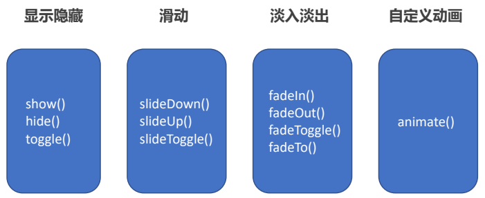

 # 1、jQuery 入门
---
## 1.1、jQuery 概述
### 1.1.1、JavaScript 库
**JavaScript 库**：即 library ，是一个==封装==好的特定的==集合==（方法和函数）。从封装一大堆函数的角度理解库，就是在这个库中，封装了很多预先定义好的函数在里面，比如 animate 、hide、show，比如获取元素等。

简单理解：就是一个 JS 文件，里面对我们原生 js 代码进行了封装，存放到里面。这样我们可以快速高效的使用这些封装好的功能了。

比如 jQuery，就是为了快速方便的操作 DOM，里面基本都是函数（方法）。

#### 常见的 JavaScript 库
- jQuery
- Prototype
- YUI
- Dojo
- Ext JS
- 移动端的 zepto

这些库都是对原生 JavaScript 的封装，==内部都是用 JavaScript 实现的==，我们主要学习的是 ==jQuery==。

### 1.1.2、jQuery 的概念
==jQuery== 是一个快速、简洁的 ==JavaScript 库==，其设计的宗旨是 “Write Less，Do More”，即倡导写更少的代码，做更多的事情。

j 就是 JavaScript；Query 查询；意思就是查询 JS，把 JS 中的 DOM 操作进行了封装，我们可以快速的查询使用里面的功能。

==jQuery 封装了 JavaScript 常用的代码功能==，优化了 DOM 操作、事件处理、动画设计和 Ajax 交互。

==学习 jQuery 本质：就是学习调用这些函数（方法）。==

#### jQuery 的优点
- 轻量级，核心文件才几十 kb，不会影响页面加载速度
- 跨浏览器兼容，基本兼容了现在主流的浏览器
- 链式编程、隐式迭代
- 对事件、样式、动画支持，大大简化了 DOM 操作
- 支持插件扩展开发，有着丰富的第三方插件，例如：树形菜单、日期控件、轮播图等
- 免费、开源

## 1.2、jQuery 的基本使用
### 1.2.1、jQuery 的下载
官网地址： [https://jquery.com/](https://jquery.com/)

版本：
- 1X：兼容 IE 678 等低版本浏览器，官网不再更新
- 2X：不兼容 IE 678 等低版本浏览器，官网不再更新
- 3X：不兼容 IE 678 等低版本浏览器，是官方主要更新维护的版本

各个版本的下载： [https://code.jquery.com/](https://code.jquery.com/)

### 1.2.2、jQuery 的使用步骤
1.  引入 jQuery 文件
    ~~~html
    
    ~~~
2.  使用即可

### 1.2.3、jQuery 的入口函数

~~~js
$(function() {
    // 此处是页面 DOM 加载完成的入口
});
~~~

~~~js
$(document).ready(function() {
    // 此处是页面 DOM 加载完成的入口
});
~~~

1.  等着 DOM 结构渲染完毕即可执行内部代码，不必等到所有外部资源加载完成，jQuery 帮我们完成了封装。
2.  相当于原生 js 中的 DOMContentLoaded。
3.  不同于原生 js 中的 load 事件是等页面文档、外部的 js 文件、css 文件、图片加载完毕才执行内部代码。
4.  更推荐使用第一种方式。

### 1.2.4、jQuery 顶级对象 $
1.  $ 是 jQuery 的别称，在代码中可以使用 jQuery 代替 $，但一般为了方便，通常都直接使用 $。
2.  $ 是 jQuery 的顶级对象，相当于原生 JavaScript 中的 window。把元素利用 $ 包装成 jQuery 对象，就可以调用 jQuery 的方法。

### 1.2.5、jQuery 对象和 DOM 对象
1.  用原生 JS 获取来的对象就是 DOM 对象
2.  用 jQuery 方法获取的元素就是 jQuery 对象
3.  jQuery 对象本质是：利用 $ 对 DOM 对象包装后产生的对象（伪数组形式存储）

~~~html
<body>
    

    
    
</body>
~~~

### 1.2.6、DOM 对象和 jQuery 对象相互转换
因为原生 JS 比 jQuery 更大，原生的一些属性和方法 jQuery 没有给我们封装，要想使用这些属性和方法需要把 jQuery 对象转换为 DOM 对象才能使用。

1.  DOM 对象转换为 jQuery 对象：==$(DOM 对象)==
    ~~~js
    $('div')
    ~~~
2.  jQuery 对象转换为 DOM 对象（两种方式）
    ~~~js
    $('div')[index] // index 是索引号
    ~~~

    ~~~js
    $('div').get(index) // index 是索引号
    ~~~

~~~html
<body>
    <video src="mov.mp4" muted></video>
    
</body>
~~~

# 2、jQuery 常用 API
---
## 2.1、jQuery 选择器
### 2.1.1、jQuery 基础选择器
原生 JS 获取元素方式很多，很杂，而且兼容性情况不一致，因此 jQuery 给我们做了封装，使获取元素统一标准。

~~~js
$(“选择器”) // 里面选择器直接写 CSS 选择器即可，但是要加引号
~~~

| 名称 | 用法 | 描述 |
| :----: | :----: | :----: |
ID 选择器|$("#id"|获取指定 ID 的元素
全选选择器|$('\*')|匹配所有元素
类选择器|$(".class")|获取同一类 class 的元素
标签选择器|$("div")|获取同一类标签的所有元素
并集选择器|$("div,p,li")|选取多个元素
交集选择器|$("li.current")|交集元素

~~~html
<body>
    
我是 div

    
我是 nav div

    
我是 p

    <ol>
        <li>我是 ol 的</li>
        <li>我是 ol 的</li>
        <li>我是 ol 的</li>
        <li>我是 ol 的</li>
    </ol>
    <ul>
        <li>我是 ul 的</li>
        <li>我是 ul 的</li>
        <li>我是 ul 的</li>
        <li>我是 ul 的</li>
    </ul>
    
</body>
~~~

### 2.1.2、jQuery 层级选择器

| 名称 | 用法 | 描述 |
| :----: | :----: | :----: |
子代选择器|$("ul>li");|使用>号，获取亲儿子层级的元素；注意，并不会获取孙子层级的元素
后代选择器|$("ul li");|使用空格，代表后代选择器，获取 u 下的所有元素，包括孙子等

#### 知识铺垫
jQuery 设置样式

~~~js
$('div').css('属性', '值')
~~~

### 2.1.3、隐式迭代（重要）
遍历内部 DOM 元素（伪数组形式存储）的过程就叫做==**隐式迭代**==。

简单理解：给匹配到的所有元素进行循环遍历，执行相应的方法，而不用我们再进行循环，简化我们的操作，方便我们调用。

~~~html
<body>
    
惊喜不，意外不

    
惊喜不，意外不

    
惊喜不，意外不

    
惊喜不，意外不

    <ul>
        <li>相同的操作</li>
        <li>相同的操作</li>
        <li>相同的操作</li>
    </ul>
    
</body>
~~~

### 2.1.4、jQuery 筛选选择器

| 语法 | 用法 | 描述 |
| :----: | :----: | :----: |
: first|$('li: first')|获取第一个元素
: last|$(li: last')|获取最后一个元素
: eq(index)|$("li: eq(2)")|获取到的 i 元素中，选择索引号为 2 的元素，索引号 index 从 0 开始。
: odd|$("li: odd")|获取到的元素中，选择索引号为奇数的元素
: even|$("li: even")|获取到的元素中，选择索引号为偶数的元素

~~~html
<body>
    <ul>
        <li>多个里面筛选几个</li>
        <li>多个里面筛选几个</li>
        <li>多个里面筛选几个</li>
        <li>多个里面筛选几个</li>
        <li>多个里面筛选几个</li>
        <li>多个里面筛选几个</li>
    </ul>
    <ol>
        <li>多个里面筛选几个</li>
        <li>多个里面筛选几个</li>
        <li>多个里面筛选几个</li>
        <li>多个里面筛选几个</li>
        <li>多个里面筛选几个</li>
        <li>多个里面筛选几个</li>
    </ol>
    
</body>
~~~

### 2.1.5、jQuery 筛选方法（重点）

| 语法 | 用法 | 说明 |
| :----: | :----: | :----: |
parent()|$("li").parent();|查找父级
children(selector)|\$("ul").children("li")|相当于$("u1>li"),最近一级（亲儿子）
find(selector)|\$("ul").find("li");|相当于$("u"),后代选择器
siblings(selector)|$(".first").siblings("li");|查找兄弟节点，不包括自己本身
nextAll([expr])|$(".first").nextAll()|查找当前元素之后所有的同辈元素
prevtAll([expr])|$(".last").prevAll()|查找当前元素之前所有的同辈元素
hasClass(class)|$('div').hasclass("protected")|检查当前的元素是否含有某个特定的类，如果有，则返回 true
eq(index)|\$("1i").eq(2);|相当于$("li: eq(2)"),index 从 0 开始

==重点记住： parent() children() find() siblings() eq()==

~~~html
<body>
    

        

            
儿子

        

    

    

        
我是屁

        

            
我是 p

        

    

    
</body>
~~~

~~~html
<body>
    <ol>
        <li>我是 ol 的 li</li>
        <li>我是 ol 的 li</li>
        <li class="item">我是 ol 的 li</li>
        <li>我是 ol 的 li</li>
        <li>我是 ol 的 li</li>
        <li>我是 ol 的 li</li>
    </ol>
    <ul>
        <li>我是 ol 的 li</li>
        <li>我是 ol 的 li</li>
        <li>我是 ol 的 li</li>
        <li>我是 ol 的 li</li>
        <li>我是 ol 的 li</li>
        <li>我是 ol 的 li</li>
    </ul>
    
俺有 current

    
俺木有 current

    
</body>
~~~

### 案例：新浪下拉菜单

~~~html
<!DOCTYPE html>
<html lang="en">

<head>
    <meta charset="UTF-8">
    <meta name="viewport" content="width=device-width, initial-scale=1.0">
    <meta http-equiv="X-UA-Compatible" content="ie=edge">
    <title>Document</title>
    
    
</head>

<body>
    <ul class="nav">
        <li>
            <a href="#">微博</a>
            <ul>
                <li>
                    <a href="">私信</a>
                </li>
                <li>
                    <a href="">评论</a>
                </li>
                <li>
                    <a href="">@我</a>
                </li>
            </ul>
        </li>
        <li>
            <a href="#">微博</a>
            <ul>
                <li>
                    <a href="">私信</a>
                </li>
                <li>
                    <a href="">评论</a>
                </li>
                <li>
                    <a href="">@我</a>
                </li>
            </ul>
        </li>
        <li>
            <a href="#">微博</a>
            <ul>
                <li>
                    <a href="">私信</a>
                </li>
                <li>
                    <a href="">评论</a>
                </li>
                <li>
                    <a href="">@我</a>
                </li>
            </ul>
        </li>
        <li>
            <a href="#">微博</a>
            <ul>
                <li>
                    <a href="">私信</a>
                </li>
                <li>
                    <a href="">评论</a>
                </li>
                <li>
                    <a href="">@我</a>
                </li>
            </ul>
        </li>
    </ul>
    
</body>

</html>
~~~

### 2.1.6、jQuery 里面的排他思想
想要多选一的效果，排他思想：当前元素设置样式，其余的兄弟元素清除样式。

~~~js
$(this).css(“color”,”red”);
$(this).siblings(). css(“color”,””);
~~~

### 案例：淘宝服饰精品案例

**案例分析**：
1.  核心原理：鼠标经过左侧盒子某个小 li，就让内容区盒子相对应图片显示，其余的图片隐藏。
2.  需要得到当前小 li 的索引号，就可以显示对应索引号的图片
3.  jQuery 得到当前元素索引号 ==$(this).index()==
4.  中间对应的图片，可以通过 eq(index) 方法去选择
5.  显示元素 show() 隐藏元素 hide()

~~~js
$(function() {
    // 1. 鼠标经过左侧的小 li
    $("#left li").mouseover(function() {
        // 2. 得到当前小 li 的索引号
        var index = $(this).index();
        console.log(index);
        // 3. 让我们右侧的盒子相应索引号的图片显示出来就好了
        // $("#content div").eq(index).show();
        // 4. 让其余的图片（就是其他的兄弟）隐藏起来
        // $("#content div").eq(index).siblings().hide();
        // 链式编程
        $("#content div").eq(index).show().siblings().hide();
    })
})
~~~

### 2.1.7、链式编程
链式编程是为了节省代码量，看起来更优雅。

~~~js
$(this).css('color', 'red').sibling().css('color', '');
~~~

## 2.2、jQuery 样式操作
### 2.2.1、操作 css 方法
jQuery 可以使用 css 方法来修改简单元素样式； 也可以操作类，修改多个样式。

1.  参数只写属性名，则是返回属性值
    ~~~js
    $(this).css("color");
    ~~~
2.  参数是==属性名，属性值，逗号分隔==，是设置一组样式，属性必须加引号，值如果是数字可以不用跟单位和引号
    ~~~js
    $(this).css("color", "red");
    ~~~
3.  参数可以是对象形式，方便设置多组样式。属性名和属性值用冒号隔开， 属性可以不用加引号，
    ~~~js
    $(this).css({ "color":"white","font-size":"20px"});
    ~~~

### 2.2.2、设置类样式方法
作用等同于以前的 classList，可以操作类样式， 注意操作类里面的参数不要加点。

1.  添加类
    ~~~js
    $(“div”).addClass(''current'');
    ~~~
2.  移除类
    ~~~js
    $(“div”).removeClass(''current'');
    ~~~
3.  切换类
    ~~~js
    $(“div”).toggleClass(''current'');
    ~~~

### 案例：tab 栏切换

~~~html
<head>
   
    
</head>

<body>
    

        

            <ul>
                <li class="current">商品介绍</li>
                <li>规格与包装</li>
                <li>售后保障</li>
                <li>商品评价（50000）</li>
                <li>手机社区</li>
            </ul>
        

        

            

                商品介绍模块内容
            

            

                规格与包装模块内容
            

            

                售后保障模块内容
            

            

                商品评价（50000）模块内容
            

            

                手机社区模块内容
            

        

    

    
</body>

</html>
~~~

### 2.2.3、类操作与 className 区别
原生 JS 中 className 会覆盖元素原先里面的类名。

jQuery 里面类操作只是对指定类进行操作，不影响原先的类名。

## 2.3、jQuery 效果
jQuery 给我们封装了很多动画效果，最为常见的如下：

### 2.3.1、显示隐藏效果
#### 1. 显示语法规范

~~~js
show([speed,[easing],[fn]])
~~~

#### 2. 显示参数
1.  参数都可以省略， 无动画直接显示。
2.  speed：三种预定速度之一的字符串(“slow”,“normal”, or “fast”)或表示动画时长的毫秒数值(如：1000)。
3.  easing：(Optional) 用来指定切换效果，默认是“swing”，可用参数“linear”。
4.  fn: 回调函数，在动画完成时执行的函数，每个元素执行一次。

#### 1. 隐藏语法规范

~~~js
hide([speed,[easing],[fn]])
~~~

#### 2. 隐藏参数
1.  参数都可以省略， 无动画直接显示。
2.  speed：三种预定速度之一的字符串(“slow”,“normal”, or “fast”)或表示动画时长的毫秒数值(如：1000)。
3.  easing：(Optional) 用来指定切换效果，默认是 “swing”，可用参数 “linear”。
4.  fn: 回调函数，在动画完成时执行的函数，每个元素执行一次。

#### 1. 切换语法规范

~~~js
toggle([speed,[easing],[fn]])
~~~

#### 2. 切换参数
1.  参数都可以省略， 无动画直接显示。
2.  speed：三种预定速度之一的字符串(“slow”,“normal”, or “fast”)或表示动画时长的毫秒数值(如：1000)。
3.  easing：(Optional) 用来指定切换效果，默认是“swing”，可用参数“linear”。
4.  fn: 回调函数，在动画完成时执行的函数，每个元素执行一次。

==建议：平时一般不带参数，直接显示隐藏即可。==

### 2.3.2、滑动效果
#### 1. 下滑效果语法规范

~~~js
slideDown([speed,[easing],[fn]])
~~~

#### 2. 下滑效果参数
1.  参数都可以省略。
2.  speed:三种预定速度之一的字符串(“slow”,“normal”, or “fast”)或表示动画时长的毫秒数值(如：1000)。
3.  easing:(Optional) 用来指定切换效果，默认是“swing”，可用参数“linear”。
4.  fn: 回调函数，在动画完成时执行的函数，每个元素执行一次。

#### 1. 上滑效果语法规范

~~~js
slideUp([speed,[easing],[fn]])
~~~

#### 2. 上滑效果参数
1.  参数都可以省略。
2.  speed：三种预定速度之一的字符串(“slow”,“normal”, or “fast”)或表示动画时长的毫秒数值(如：1000)。
3.  easing：(Optional) 用来指定切换效果，默认是“swing”，可用参数“linear”。
4.  fn: 回调函数，在动画完成时执行的函数，每个元素执行一次。

#### 1. 滑动切换效果语法规范

~~~js
slideToggle([speed,[easing],[fn]])
~~~

#### 2. 滑动切换效果参数
1.  参数都可以省略。
2.  speed：三种预定速度之一的字符串(“slow”,“normal”, or “fast”)或表示动画时长的毫秒数值(如：1000)。
3.  easing：(Optional) 用来指定切换效果，默认是“swing”，可用参数“linear”。
4.  fn: 回调函数，在动画完成时执行的函数，每个元素执行一次。

### 2.3.3、事件切换

~~~js
hover([over,]out)
~~~

1.  over:鼠标移到元素上要触发的函数（相当于 mouseenter）
2.  out:鼠标移出元素要触发的函数（相当于 mouseleave）
3.  如果只写一个函数，则鼠标经过和离开都会触发它

### 2.3.4、动画队列及其停止排队方法
#### 1. 动画或效果队列
动画或者效果一旦触发就会执行，如果多次触发，就造成多个动画或者效果排队执行。

#### 2. 停止排队

~~~js
stop()
~~~

1.  stop() 方法用于停止动画或效果。
2.  注意： stop() 写到动画或者效果的==前面==， ==相当于停止结束上一次的动画==。

### 2.3.5、淡入淡出效果
#### 1. 淡入效果语法规范

~~~js
fadeIn([speed,[easing],[fn]])
~~~

#### 2. 淡入效果参数
1.  参数都可以省略。
2.  speed：三种预定速度之一的字符串(“slow”,“normal”, or “fast”)或表示动画时长的毫秒数值(如：1000)。
3.  easing：(Optional) 用来指定切换效果，默认是“swing”，可用参数“linear”。
4.  fn: 回调函数，在动画完成时执行的函数，每个元素执行一次。

#### 1. 淡出效果语法规范

~~~js
fadeOut([speed,[easing],[fn]])
~~~

#### 2. 淡出效果参数
1.  参数都可以省略。
2.  speed：三种预定速度之一的字符串(“slow”,“normal”, or “fast”)或表示动画时长的毫秒数值(如：1000)。
3.  easing：(Optional) 用来指定切换效果，默认是“swing”，可用参数“linear”。
4.  fn: 回调函数，在动画完成时执行的函数，每个元素执行一次。

#### 1. 淡入淡出切换效果语法规范

~~~js
fadeToggle([speed,[easing],[fn]])
~~~

#### 2. 淡入淡出切换效果参数
1.  参数都可以省略。
2.  speed：三种预定速度之一的字符串(“slow”,“normal”, or “fast”)或表示动画时长的毫秒数值(如：1000)。
3.  easing：(Optional) 用来指定切换效果，默认是“swing”，可用参数“linear”。
4.  fn: 回调函数，在动画完成时执行的函数，每个元素执行一次。

#### 1. 渐进方式调整到指定的不透明度

~~~js
fadeTo([[speed],opacity,[easing],[fn]])
~~~

#### 2. 效果参数
1.  ==opacity 透明度必须写，取值 0~1 之间。==
2.  ==speed==：三种预定速度之一的字符串(“slow”,“normal”, or “fast”)或表示动画时长的毫秒数值(如：1000)。==必须写==
3.  easing：(Optional) 用来指定切换效果，默认是“swing”，可用参数“linear”。
4.  fn: 回调函数，在动画完成时执行的函数，每个元素执行一次。

### 案例：突出显示

~~~js
$(function() {
    //鼠标进入的时候,其他的 li 标签透明度：0.5
    $(".wrap li").hover(function() {
        $(this).siblings().stop().fadeTo(400,0.5);
    }, function() {
        // 鼠标离开，其他 li 透明度改为 1
        $(this).siblings().stop().fadeTo(400,1);
    })
});
~~~

### 2.3.6、自定义动画 animate
#### 1. 语法

~~~js
animate(params,[speed],[easing],[fn])
~~~

#### 2. 参数
1.  ==params: 想要更改的样式属性，以对象形式传递，必须写。 属性名可以不用带引号， 如果是复合属性则需要采取驼峰命名法 borderLeft。==其余参数都可以省略。
2.  speed：三种预定速度之一的字符串(“slow”,“normal”, or “fast”)或表示动画时长的毫秒数值(如：1000)。
3.  easing：(Optional) 用来指定切换效果，默认是“swing”，可用参数“linear”。
4.  fn: 回调函数，在动画完成时执行的函数，每个元素执行一次。

~~~html
<!DOCTYPE html>
<html lang="en">

<head>
    <meta charset="UTF-8">
    <meta name="viewport" content="width=device-width, initial-scale=1.0">
    <meta http-equiv="X-UA-Compatible" content="ie=edge">
    <title>Document</title>
    
    
</head>

<body>
    <button>动起来</button>
    

    
</body>

</html>
~~~

### 案例：王者荣耀手风琴效果

~~~js
$(function() {
    // 鼠标经过某个小 li 有两步操作：
    $(".king li").mouseenter(function() {
        // 1.当前小 li 宽度变为 224px， 同时里面的小图片淡出，大图片淡入
        $(this).stop().animate({
            width: 224
        }).find(".small").stop().fadeOut().siblings(".big").stop().fadeIn();
        // 2.其余兄弟小 li 宽度变为 69px， 小图片淡入， 大图片淡出
        $(this).siblings("li").stop().animate({
            width: 69
        }).find(".small").stop().fadeIn().siblings(".big").stop().fadeOut();
    })
});
~~~

## 2.4、jQuery 属性操作
### 2.4.1、设置或获取元素固有属性值 prop()
所谓元素固有属性就是元素本身自带的属性，比如 \<a> 元素里面的 href ，比如 \<input> 元素里面的 type。

#### 1. 获取属性语法

~~~js
prop(''属性'')
~~~

#### 2. 设置属性语法

~~~js
prop(''属性'', ''属性值'')
~~~

~~~html
<body>
    <a href="http://www.itcast.cn" title="都挺好">都挺好</a>
    <input type="checkbox" name="" id="" checked>
    
</body>
~~~

### 2.4.2、设置或获取元素自定义属性值 attr()
用户自己给元素添加的属性，我们称为自定义属性。 比如给 div 添加 index =“1”。

#### 1. 获取属性语法

~~~js
attr(''属性'') // 类似原生 getAttribute()
~~~

#### 2. 设置属性语法

~~~js
attr(''属性'', ''属性值'') // 类似原生 setAttribute()
~~~

该方法也可以获取 H5 自定义属性

~~~html
<body>
    
我是 div

    
</body>
~~~

### 2.4.3、数据缓存 data()
data() 方法可以在指定的元素上存取数据，并不会修改 DOM 元素结构。一旦页面刷新，之前存放的数据都将被移除。

#### 1. 附加数据语法

~~~js
data(''name'',''value'') // 向被选元素附加数据
~~~

#### 2. 获取数据语法

~~~js
date(''name'') // 向被选元素获取数据
~~~

~~~html
<body>
    123
    
</body>
~~~

### 案例：购物车案例模块-全选

~~~js
$(function() {
    // 1. 全选 全不选功能模块
    // 就是把全选按钮（checkall）的状态赋值给 三个小的按钮（j-checkbox）就可以了
    // 事件可以使用 change
    $(".checkall").change(function() {
        // console.log($(this).prop("checked"));
        $(".j-checkbox, .checkall").prop("checked", $(this).prop("checked"));
        if ($(this).prop("checked")) {
            // 让所有的商品添加 check-cart-item 类名
            $(".cart-item").addClass("check-cart-item");
 } else {
            // check-cart-item 移除
            $(".cart-item").removeClass("check-cart-item");
        }
    });
    // 2. 如果小复选框被选中的个数等于 3 就应该把全选按钮选上，否则全选按钮不选。
    $(".j-checkbox").change(function() {
        // if(被选中的小的复选框的个数 === 3) {
        //     就要选中全选按钮
        // } else {
        //     不要选中全选按钮
        // }
        // console.log($(".j-checkbox: checked").length);
        // $(".j-checkbox").length 这个是所有的小复选框的个数
        // $(".j-checkbox: checked").length 这个是被选中的小复选框的个数
        if ($(".j-checkbox: checked").length === $(".j-checkbox").length) {
            $(".checkall").prop("checked", true);
 } else {
            $(".checkall").prop("checked", false);
        }
    });
})
~~~

## 2.5、jQuery 内容文本值
主要针对元素的==内容==还有==表单的值==操作。

#### 1. 普通元素内容 html()（ 相当于原生 inner HTML)

~~~js
html() // 获取元素的内容
~~~

~~~js
html("内容") // 设置元素的内容
~~~

#### 2. 普通元素文本内容 text() (相当与原生 innerText)

~~~js
text() // 获取元素的文本内容
~~~

~~~js
text("文本内容") // 设置元素的文本内容
~~~

#### 3. 表单的值 val()（ 相当于原生 value)

~~~js
val() // 获取表单的值
~~~

~~~js
val("内容") // 设置表单的值
~~~

### 案例：购物车案例模块-增减商品数量

~~~js
$(function() {
    // 3. 增减商品数量模块 首先声明一个变量，当我们点击+号（increment），就让这个值++，然后赋值给文本框。
    $(".increment").click(function() {
        // 得到当前兄弟文本框的值
        var n = $(this).siblings(".itxt").val();
        // console.log(n);
        n++;
        $(this).siblings(".itxt").val(n);
    });
    $(".decrement").click(function() {
        // 得到当前兄弟文本框的值
        var n = $(this).siblings(".itxt").val();
        if (n == 1) {
            return false;
        }
        // console.log(n);
        n--;
        $(this).siblings(".itxt").val(n);
    });
})
~~~

### 案例：购物车案例模块-修改商品小计

~~~js
$(function() {
    $(".increment").click(function() {
        var n = $(this).siblings(".itxt").val();
        // console.log(n);
        n++;
        $(this).siblings(".itxt").val(n);
        // 3. 计算小计模块 根据文本框的值 乘以 当前商品的价格  就是 商品的小计
        // 当前商品的价格 p
        var p = $(this).parents(".p-num").siblings(".p-price").html();
        // console.log(p);
        p = p.substr(1);
        console.log(p);
        var price = (p * n).toFixed(2);
        // 小计模块
        // toFixed(2) 可以让我们保留 2 位小数
        $(this).parents(".p-num").siblings(".p-sum").html("￥" + price);
    });
    $(".decrement").click(function() {
        var n = $(this).siblings(".itxt").val();
        if (n == 1) {
            return false;
        }
        // console.log(n);
        n--;
        $(this).siblings(".itxt").val(n);
        // var p = $(this).parent().parent().siblings(".p-price").html();
        // parents(".p-num") 返回指定的祖先元素
        var p = $(this).parents(".p-num").siblings(".p-price").html();
        // console.log(p);
        p = p.substr(1);
        console.log(p);
        // 小计模块
        $(this).parents(".p-num").siblings(".p-sum").html("￥" + (p * n).toFixed(2));
    });
    //  4. 用户修改文本框的值 计算 小计模块
    $(".itxt").change(function() {
        // 先得到文本框的里面的值 乘以 当前商品的单价
        var n = $(this).val();
        // 当前商品的单价
        var p = $(this).parents(".p-num").siblings(".p-price").html();
        // console.log(p);
        p = p.substr(1);
        $(this).parents(".p-num").siblings(".p-sum").html("￥" + (p * n).toFixed(2));
    });
})
~~~

## 2.6、jQuery 元素操作
主要是==遍历、创建、添加、删除==元素操作。

### 2.6.1、遍历元素
jQuery 隐式迭代是对同一类元素做了同样的操作。 如果想要给同一类元素做不同操作，就需要用到遍历。

#### 语法 1

~~~js
$("div").each(function (index, domEle) { xxx; }）
~~~

1.  each() 方法遍历匹配的每一个元素。主要用 DOM 处理。 each 每一个
2.  里面的回调函数有 2 个参数： index 是每个元素的索引号; demEle 是每个==DOM 元素对象，不是 jquery 对象==
3.  ==所以要想使用 jquery 方法，需要给这个 dom 元素转换为 jquery 对象 $(domEle)==

~~~html
<body>
    
1

    
2

    
3

    
</body>
~~~

#### 语法 2

~~~js
$.each(object，function (index, element) { xxx; }）
~~~

1.  $.each()方法可用于遍历任何对象。==主要用于数据处理==，比如数组，对象
2.  里面的函数有 2 个参数： index 是每个元素的索引号; element 遍历内容

~~~html
<body>
    
1

    
2

    
3

    
</body>
~~~

### 案例：购物车案例模块-计算总计和总额

~~~js

$(function() {
    // 3. 增减商品数量模块 首先声明一个变量，当我们点击+号（increment），就让这个值++，然后赋值给文本框。
    $(".increment").click(function() {
        // 得到当前兄弟文本框的值
        var n = $(this).siblings(".itxt").val();
        // console.log(n);
        n++;
        $(this).siblings(".itxt").val(n);
        // 3. 计算小计模块 根据文本框的值 乘以 当前商品的价格  就是 商品的小计
        // 当前商品的价格 p
        var p = $(this).parents(".p-num").siblings(".p-price").html();
        // console.log(p);
        p = p.substr(1);
        console.log(p);
        var price = (p * n).toFixed(2);
        // 小计模块
        // toFixed(2) 可以让我们保留 2 位小数
        $(this).parents(".p-num").siblings(".p-sum").html("￥" + price);
        getSum();
    });
    $(".decrement").click(function() {
        // 得到当前兄弟文本框的值
        var n = $(this).siblings(".itxt").val();
        if (n == 1) {
            return false;
        }
        // console.log(n);
        n--;
        $(this).siblings(".itxt").val(n);
        // var p = $(this).parent().parent().siblings(".p-price").html();
        // parents(".p-num") 返回指定的祖先元素
        var p = $(this).parents(".p-num").siblings(".p-price").html();
        // console.log(p);
        p = p.substr(1);
        console.log(p);
        // 小计模块
        $(this).parents(".p-num").siblings(".p-sum").html("￥" + (p * n).toFixed(2));
        getSum();
    });
    //  4. 用户修改文本框的值 计算 小计模块
    $(".itxt").change(function() {
        // 先得到文本框的里面的值 乘以 当前商品的单价
        var n = $(this).val();
        // 当前商品的单价
        var p = $(this).parents(".p-num").siblings(".p-price").html();
        // console.log(p);
        p = p.substr(1);
        $(this).parents(".p-num").siblings(".p-sum").html("￥" + (p * n).toFixed(2));
        getSum();
    });
    // 5. 计算总计和总额模块
    getSum();

    function getSum() {
        var count = 0; // 计算总件数
        var money = 0; // 计算总价钱
        $(".itxt").each(function(i, ele) {
            count += parseInt($(ele).val());
        });
        $(".amount-sum em").text(count);
        $(".p-sum").each(function(i, ele) {
            money += parseFloat($(ele).text().substr(1));
        });
        $(".price-sum em").text("￥" + money.toFixed(2));
    }
})
~~~

### 2.6.2、创建元素
**语法**：

~~~js
$("<li></li>");
~~~

动态的创建了一个 \<li>

### 2.6.3、添加元素
#### 1. 内部添加

~~~js
element.append("内容")
~~~

把内容放入匹配元素内部==最后面==，类似原生 appendChild。

~~~js
element.prepend("内容")
~~~

把内容放入匹配元素内部==最前面==。

#### 2. 外部添加

~~~js
element.after("内容") // 把内容放入目标元素后面
~~~

~~~js
element.before("内容") // 把内容放入目标元素前面
~~~

1.  ==内部添加元素，生成之后，它们是父子关系==
2.  ==外部添加元素，生成之后，他们是兄弟关系==

### 2.6.4、删除元素

~~~js
element.remove() // 删除匹配的元素（本身）
~~~

~~~js
element.empty() // 删除匹配的元素集合中所有的子节点
~~~

~~~js
element.html("") // 清空匹配的元素内容
~~~

1.  ==remove 删除元素本身==
2.  ==empt() 和 html('''') 作用等价，都可以删除元素里面的内容，只不过 html 还可以设置内容==

~~~html
<body>
    <ul>
        <li>原先的 li</li>
    </ul>
    
我是原先的 div

    
</body>
~~~

### 案例：购物车案例模块-删除商品模块

~~~js
$(function() {
    // 6. 删除商品模块
    // (1) 商品后面的删除按钮
    $(".p-action a").click(function() {
        // 删除的是当前的商品
        $(this).parents(".cart-item").remove();
        getSum();
    });
    // (2) 删除选中的商品
    $(".remove-batch").click(function() {
        // 删除的是小的复选框选中的商品
        $(".j-checkbox: checked").parents(".cart-item").remove();
        getSum();
    });
    // (3) 清空购物车 删除全部商品
    $(".clear-all").click(function() {
        $(".cart-item").remove();
        getSum();
    })
})
~~~

### 案例：购物车案例模块-选中商品添加背景

~~~js
$(function() {
    // 1. 全选 全不选功能模块
    // 就是把全选按钮（checkall）的状态赋值给 三个小的按钮（j-checkbox）就可以了
    // 事件可以使用 change
    $(".checkall").change(function() {
        // console.log($(this).prop("checked"));
        $(".j-checkbox, .checkall").prop("checked", $(this).prop("checked"));
        if ($(this).prop("checked")) {
            // 让所有的商品添加 check-cart-item 类名
            $(".cart-item").addClass("check-cart-item");
 } else {
            // check-cart-item 移除
            $(".cart-item").removeClass("check-cart-item");
        }
    });
    // 2. 如果小复选框被选中的个数等于 3 就应该把全选按钮选上，否则全选按钮不选。
    $(".j-checkbox").change(function() {
        // if(被选中的小的复选框的个数 === 3) {
        //     就要选中全选按钮
        // } else {
        //     不要选中全选按钮
        // }
        // console.log($(".j-checkbox: checked").length);
        // $(".j-checkbox").length 这个是所有的小复选框的个数
        if ($(".j-checkbox: checked").length === $(".j-checkbox").length) {
            $(".checkall").prop("checked", true);
 } else {
            $(".checkall").prop("checked", false);
        }
        if ($(this).prop("checked")) {
            // 让当前的商品添加 check-cart-item 类名
            $(this).parents(".cart-item").addClass("check-cart-item");
 } else {
            // check-cart-item 移除
            $(this).parents(".cart-item").removeClass("check-cart-item");
        }
    });
})
~~~

## 2.7、jQuery 尺寸、位置操作
### 2.7.1、jQuery 尺寸

| 语法 | 用法 |
| :----: | :----: |
width()/height()|取得匹配元素宽度和高度值只算 width / height
innerWidth()/innerHieght()|取得匹配元素完度和高度值包含 padding
outerWidth()/outerHeight()|取得匹配元素宽度和高度值包含 padding、border
outerWidth(true)/outerHeight(true)|取得匹配元素宽度和高度值包含 padding、borde、margin

- 以上参数为空，则是获取相应值，==返回的是数字型==
- 如果参数为数字，则是修改相应值
- 参数可以==不必写单位==

### 2.7.2、jQuery 位置
位置主要有三个： ==offset()、position()、scrollTop()/scrollLeft()==

#### 1. offset() 设置或获取元素偏移
1.  offset() 方法设置或返回被选元素相对于==文档==的偏移坐标，跟父级没有关系。
2.  该方法有 2 个属性 left、top 。offset().top 用于获取距离文档顶部的距离，offset().left 用于获取距离文档左侧的距离。
3.  可以设置元素的偏移：offset({ top: 10, left: 30 });

#### 2.position() 获取元素偏移
1.  position() 方法用于返回被选元素相对于==带有定位的父级==偏移坐标，如果父级都没有定位，则以文档为准。
2.  该方法有 2 个属性 left、top。position().top 用于获取距离定位父级顶部的距离，position().left 用于获取距离定位父级左侧的距离。
3.  ==该方法只能获取==。

#### 3.scrollTop()/scrollLeft() 设置或获取元素被卷去的头部和左侧
1.  scrollTop() 方法设置或返回被选元素被卷去的头部。
2.  不跟参数是获取，参数为不带单位的数字则是设置被卷去的头部。

### 案例：带有动画的返回顶部

~~~html
<!DOCTYPE html>
<html lang="en">
<head>
    <meta charset="UTF-8">
    <meta name="viewport" content="width=device-width, initial-scale=1.0">
    <meta http-equiv="X-UA-Compatible" content="ie=edge">
    <title>Document</title>
    
    
</head>

<body>
    
返回顶部

    

    

    
</body>
</html>
~~~

### 案例： 品优购电梯导航

~~~js
$(function() {
    // 当我们点击了小 li 此时不需要执行 页面滚动事件里面的 li 的背景选择 添加 current
    // 节流阀  互斥锁
    var flag = true;
    // 1.显示隐藏电梯导航
    var toolTop = $(".recommend").offset().top;
    toggleTool();

    function toggleTool() {
        if ($(document).scrollTop() >= toolTop) {
            $(".fixedtool").fadeIn();
 } else {
            $(".fixedtool").fadeOut();
        };
    }

    $(window).scroll(function() {
        toggleTool();
        // 3. 页面滚动到某个内容区域，左侧电梯导航小 li 相应添加和删除 current 类名
        if (flag) {
            $(".floor .w").each(function(i, ele) {
                if ($(document).scrollTop() >= $(ele).offset().top) {
                    console.log(i);
                    $(".fixedtool li").eq(i).addClass("current").siblings().removeClass();
                }
            })
        }
    });
    // 2. 点击电梯导航页面可以滚动到相应内容区域
    $(".fixedtool li").click(function() {
        flag = false;
        console.log($(this).index());
        // 当我们每次点击小 li 就需要计算出页面要去往的位置
        // 选出对应索引号的内容区的盒子 计算它的.offset().top
        var current = $(".floor .w").eq($(this).index()).offset().top;
        // 页面动画滚动效果
        $("body, html").stop().animate({
            scrollTop: current
        }, function() {
            flag = true;
        });
        // 点击之后，让当前的小 li 添加 current 类名 ，姐妹移除 current 类名
        $(this).addClass("current").siblings().removeClass();
    })
})
~~~

# 3、jQuery 事件
---
## 3.1、jQuery 事件注册
### 单个事件注册
**语法**：

~~~js
element.事件(function(){})
~~~

~~~js
$(“div”).click(function(){ 事件处理程序 })
~~~

其他事件和原生基本一致。

比如 mouseover、mouseout、blur、focus、change、keydown、keyup、resize、scroll 等

## 3.2、jQuery 事件处理
### 3.2.1、事件处理 on() 绑定事件
on() 方法在匹配元素上绑定一个或多个事件的事件处理函数

**语法**：

~~~js
element.on(events,[selector],fn)
~~~

1.  events:一个或多个用空格分隔的事件类型，如"click"或"keydown" 。
2.  selector: 元素的子元素选择器 。
3.  fn:回调函数 即绑定在元素身上的侦听函数。

#### on() 方法优势 1
可以绑定多个事件，多个处理事件处理程序。

~~~js
$(“div”).on({
    mouseover: function(){},
    mouseout: function(){},
    click: function(){}
});
~~~

如果事件处理程序相同

~~~js
$(“div”).on(“mouseover mouseout”, function() {
    $(this).toggleClass(“current”);
});
~~~

#### on() 方法优势 2
可以事件委派操作 。事件委派的定义就是，把原来加给子元素身上的事件绑定在父元素身上，就是把事件委派给父元素。

~~~js
$('ul').on('click', 'li', function() {
    alert('hello world!');
});
~~~

在此之前有 bind(), live() delegate()等方法来处理事件绑定或者事件委派，最新版本的请用==on==替代他们。

#### on() 方法优势 3
动态创建的元素，click() 没有办法绑定事件， on() 可以给动态生成的元素绑定事件

~~~js
$(“div").on("click",”p”, function(){
    alert("俺可以给动态生成的元素绑定事件")
});
~~~

~~~js
$("div").append($("
我是动态创建的 p
"));
~~~

### 案例：发布微博案例
1.  点击发布按钮， 动态创建一个小 li，放入文本框的内容和删除按钮， 并且添加到 ul 中。
2.  点击的删除按钮，可以删除当前的微博留言。

~~~html
<!DOCTYPE html>
<html>
<head lang="en">
    <meta charset="UTF-8">
    <title></title>
    
    
    
</head>

<body>
    

        微博发布
        <textarea name="" class="txt" cols="30" rows="10"></textarea>
        <button class="btn">发布</button>
        <ul>
        </ul>
    

</body>
</html>
~~~

### 3.2.2、事件处理 off() 解绑事件
off() 方法可以移除通过 on() 方法添加的事件处理程序。

~~~js
$("p").off() // 解绑 p 元素所有事件处理程序

$("p").off( "click") // 解绑 p 元素上面的点击事件 后面的 foo 是侦听函数名

$("ul").off("click", "li"); // 解绑事件委托
~~~

如果有的事件只想触发一次， 可以使用 ==one()== 来绑定事件。

~~~html
<head>
    
    
    
</head>
<body>
    

    <ul>
        <li>我们都是好孩子</li>
        <li>我们都是好孩子</li>
        <li>我们都是好孩子</li>
    </ul>
    
我是屁

</body>
~~~

### 3.2.3、自动触发事件 trigger()
有些事件希望自动触发, 比如轮播图自动播放功能跟点击右侧按钮一致。可以利用定时器自动触发右侧按钮点击事件，不必鼠标点击触发。

~~~js
element.click() // 第一种简写形式
~~~

~~~js
element.trigger("type") // 第二种自动触发模式
~~~

~~~js
$("p").on("click", function () {
    alert("hi~");
});

$("p").trigger("click"); // 此时自动触发点击事件，不需要鼠标点击
~~~

~~~js
element.triggerHandler(type) // 第三种自动触发模式
~~~

triggerHandler 模式不会触发元素的默认行为，这是和前面两种的区别。

~~~html
<head>
    
    
    
</head>
<body>
    

    <input type="text">
</body>
~~~

## 3.3、jQuery 事件对象
事件被触发，就会有事件对象的产生。

~~~js
element.on(events,[selector],function(event) {})
~~~

阻止默认行为：==event.preventDefault()== 或者 ==return false==

阻止冒泡： ==event.stopPropagation()==

~~~html
<head>
    
    
    
</head>

<body>
    

</body>
~~~

# 4、jQuery 其他方法
---
## 4.1、jQuery 对象拷贝
如果想要把某个对象拷贝（合并） 给另外一个对象使用，此时可以使用 $.extend() 方法

**语法**：

~~~js
$.extend([deep], target, object1, [objectN])
~~~

1.  deep: 如果设为 true 为深拷贝， 默认为 false 浅拷贝
2.  target: 要拷贝的目标对象
3.  object1:待拷贝到第一个对象的对象。
4.  objectN:待拷贝到第 N 个对象的对象。
5.  浅拷贝是把被拷贝的对象==复杂数据类型中的地址==拷贝给目标对象，修改目标对象==会影响==被拷贝对象。
6.  深拷贝，前面加 true， 完全克隆(拷贝的对象,而不是地址)，修改目标对象==不会影响==被拷贝对象。

~~~js
$(function() {
            // var targetObj = {};
            // var obj = {
            //     id: 1,
            //     name: "andy"
            // };
            // // $.extend(target, obj);
            // $.extend(targetObj, obj);
            // console.log(targetObj);
            // var targetObj = {
            //     id: 0
            // };
            // var obj = {
            //     id: 1,
            //     name: "andy"
            // };
            // // $.extend(target, obj);
            // $.extend(targetObj, obj);
            // console.log(targetObj); // 会覆盖targetObj 里面原来的数据
            var targetObj = {
                id: 0,
                msg: {
                    sex: '男'
                }
            };
            var obj = {
                id: 1,
                name: "andy",
                msg: {
                    age: 18
                }
            };
            // // $.extend(target, obj);
            // $.extend(targetObj, obj);
            // console.log(targetObj); // 会覆盖targetObj 里面原来的数据
            // // 1. 浅拷贝把原来对象里面的复杂数据类型地址拷贝给目标对象
            // targetObj.msg.age = 20;
            // console.log(targetObj);
            // console.log(obj);
            // 2. 深拷贝把里面的数据完全复制一份给目标对象 如果里面有不冲突的属性,会合并到一起 
            $.extend(true, targetObj, obj);
            // console.log(targetObj); // 会覆盖targetObj 里面原来的数据
            targetObj.msg.age = 20;
            console.log(targetObj); // msg :{sex: "男", age: 20}
            console.log(obj);
        })
~~~

## 4.2、jQuery 多库共存
**问题概述**：

jQuery 使用\$作为标示符，随着 jQuery 的流行,其他 js 库也会用这$作为标识符， 这样一起使用会引起冲突。

**客观需求**：

需要一个解决方案，让 jQuery 和其他的 js 库不存在冲突，可以同时存在，这就叫做多库共存。

**jQuery 解决方案**：

1.  ==把里面的 $ 符号 统一改为 jQuery。 比如 jQuery(''div'')==
2.  ==jQuery 变量规定新的名称：$.noConflict()，var xx = $.noConflict();==

~~~html
<head>
    
    
</head>

<body>
    

    
</body>
~~~

## 3.3、jQuery 插件
jQuery 功能比较有限，想要更复杂的特效效果，可以借助于 jQuery 插件完成。

注意: 这些插件也是依赖于 jQuery 来完成的，所以必须要先引入 jQuery 文件，因此也称为 jQuery 插件。

**jQuery 插件常用的网站**：
1.  jQuery 插件库 http://www.jq22.com/
2.  jQuery 之家 http://www.htmleaf.com/

**jQuery 插件使用步骤**：
1.  引入相关文件。（jQuery 文件 和 插件文件）
2.  复制相关 html、css、js (调用插件)。

**jQuery 插件演示**：
1.  瀑布流
2.  图片懒加载（图片使用延迟加载在可提高网页下载速度。它也能帮助减轻服务器负载）
    - 当我们页面滑动到可视区域，再显示图片。
    - 我们使用 jquery 插件库 EasyLazyload。 注意，此时的 js 引入文件和 js 调用必须写到 DOM 元素（图片）最后面
1.  全屏滚动（fullpage.js）
    - gitHub： https://github.com/alvarotrigo/fullPage.js
    - 中文翻译网站： http://www.dowebok.com/demo/2014/77/

**bootstrap JS 插件**：

bootstrap 框架也是依赖于 jQuery 开发的，因此里面的 js 插件使用 ，也必须引入 jQuery 文件。

### 案例：toDoList
1.  文本框里面输入内容，按下回车，就可以生成待办事项。
2.  点击待办事项复选框，就可以把当前数据添加到已完成事项里面。
3.  点击已完成事项复选框，就可以把当前数据添加到待办事项里面。
4.  ==但是本页面内容刷新页面不会丢失。==

[toDolist](D:/Obsidian/学习笔记/javascript/资料/todolist)

### 案例：toDoList 分析
1.  刷新页面不会丢失数据，因此需要用到本地存储 localStorage
2.  ==核心思路： 不管按下回车，还是点击复选框，都是把本地存储的数据加载到页面中，这样保证刷新关闭页面不会丢失数据==
3.  存储的数据格式：var todolist = \[{ title : ‘xxx’, done: false}]
4.  注意点 1： 本地存储 localStorage 里面只能存储字符串格式 ，因此需要把对象转换为字符串 JSON.stringify(data)。
5.  注意点 2： 获取本地存储数据，需要把里面的字符串转换为对象格式 JSON.parse() 我们才能使用里面的数据。

### 案例：toDoList 按下回车把新数据添加到本地存储里面
1.  切记： 页面中的数据，都要从本地存储里面获取，这样刷新页面不会丢失数据，所以先要把数据保存到本地存储里面。
2.  利用事件对象.keyCode 判断用户按下回车键（13）。
3.  声明一个数组，保存数据。
4.  先要读取本地存储原来的数据（声明函数 getData()），放到这个数组里面。
5.  之后把最新从表单获取过来的数据，追加到数组里面。
6.  最后把数组存储给本地存储 (声明函数 savaDate())

### 案例：toDoList 本地存储数据渲染加载到页面
1.  因为后面也会经常渲染加载操作，所以声明一个函数 load，方便后面调用
2.  先要读取本地存储数据。（数据不要忘记转换为对象格式）
3.  之后遍历这个数据（$.each()），有几条数据，就生成几个小 li 添加到 ol 里面。
4.  每次渲染之前，先把原先里面 ol 的==内容==清空，然后渲染加载最新的数据。

### 案例：toDoList 删除操作
1.  点击里面的 a 链接，不是删除的 li，而是删除本地存储对应的数据。
2.  ==核心原理：先获取本地存储数据，删除对应的数据，保存给本地存储，重新渲染列表 li==
3.  我们可以给链接自定义属性记录当前的索引号
4.  根据这个索引号删除相关的数据----数组的 splice(i, 1)方法
5.  存储修改后的数据，然后存储给本地存储
6.  重新渲染加载数据列表
7.  因为 a 是动态创建的，我们使用 on 方法绑定事件

### 案例：toDoList 正在进行和已完成选项操作
1. 当我们点击了小的复选框，修改本地存储数据，再重新渲染数据列表。
2. 点击之后，获取本地存储数据。
3. 修改对应数据属性 done 为当前复选框的checked状态。
4. 之后保存数据到本地存储
5. 重新渲染加载数据列表
6. load 加载函数里面，新增一个条件,如果当前数据的done为true 就是已经完成的，就把列表渲染加载到 ul 里面
7. 如果当前数据的done 为false， 则是待办事项，就把列表渲染加载到 ol 里面

### 案例：toDoList 统计正在进行个数和已经完成个数
1. 在我们load 函数里面操作
2. 声明2个变量 ：todoCount 待办个数 doneCount 已完成个数
3. 当进行遍历本地存储数据的时候， 如果 数据done为 false， 则 todoCount++, 否则 doneCount++
4. 最后修改相应的元素 text() 