# 协议
---

# HTTP / HTTPS 协议
---
## 第一课 协议简介
### HTTP 理解

- HTTP 是一个协议，它确立了计算机之间交流通信的规范，以及相关的各种控制和错误处理方式（**协议**）
- HTTP 专门用来在两点之间传输数据，不能用于广播、寻址或路由（**传输**）
- HTTP 传输的是文字、图片、音频、视频等超文本数据（**超文本**）

~~~txt
http 和 https 的本质区别：htps 加密，http 不加密 https=http+应用层的加密
https 的端口：443
htp 的端口：80
~~~

### 网络分层模型
- TCP/ IP 分为四层，核心是二层的 IP 和三层的 TCP,HTTP 在第四层（应用层）
- OS 分为七层，基本对应 TCP/IP,TCP 在第四层，HTTP 在第七层（应用层）

### HTTP 流程
1.  TCP 三次握手
2.  浏览器发送 HTTP 请求报文
3.  Web 服务器接收后回复 ACK
4.  Web 服务器发送 HTTP 响应报文
5.  浏览器接收后回复 ACK
6.  ...

### 请求方法

~~~txt
出现频率：POST>GET>PUT>HEAD

GET:
参数拼接到 URL 上面
https://baidu.com/?data=aaaaaaa

POST:
放到主体 URL 不可见参数
~~~

| 方法 | 描述 |
| :----: | :----: |
GET|请求指定的页面信惠，并返回实体主体
HEAD|类似于 GET 请求，只不过返回的响应中没有具体的内容，用于获取报头
POST|向指定资源提交数据进行处理请求（例如提交表单或者上传文件）。数据被包含在请求体中。POST 请求可能会导致新的资源的建立和/或已有资源的修改。
PUT|从客户端向服务器传送的数据取代指定的文档的内容。
DELETE|请求服务器别除指定的页面。
CONNECT|HTTP/1.1 协议中预留给能够将连接改为管道方式的代理服务器。
OPTIONS|允许客户端查看服务器的性能。
TRACE|回显服务器收到的请求，主要用于测试或诊断。
PATCH|是对 PUT 方法的补充，用来对已知资源进行局部更新。

### URI
- URI 包含 URL and URN
- URI 最常见的形式是 URL,它也被称为 Web 地址。
    - https://developer.ozilla.org
    - https://baidu.com
    - https://developer.mozilla.org/en-US/docs/Learn/
    - https://developer.mozilla.org/en-US/Search?q=URL
- UR 的另一种形式是 URL,它通过特定命名空间中的唯一名称来标示资源。
    - urn: isbn:9780141036144
    - urn: ietf: rfc:7230
- 统一资源标识符的语法(URI)
    - 方案或协议
    - http:∥告诉浏览器使用何种协议。通常使用 HTTP 协议或者其安全版本，HTTPS 协议

| data | Data URIs |
| :----: | :---------: |
file|指定主机上的文件名称
ftp|文件传输协议
http/https|超文本传输协议安全的超文本传输协议
mailto|电子邮件地址
ssh|安全的 shell
tel|电话
trn|统一资源名称
view-source|资源的源代码
ws/wss|WebSocket 连接

## 第二课：HTTP 之 POST GET 请求
### POST
现在我们常用的接口中，如果是 ost 请求，主要有两种数据格式
- json 格式
~~~json
Content-type: application/json
{"data":"hello"}
~~~
- x-www-formurlencoded 表单格式不指定时为默认
~~~txt
Content-type: application/x-www-form-urlencoded
data=hello&id=1&p=123
~~~
- 其他
~~~txt
multipart/form-data
text/xml
~~~

### GET
**请求参数**：get 请求参数是通过 url 传递的，多个参数以&连接且首个参数用 ？连接；
- https://bilibili.com/?spm_id_from=333.1007.0.0#/love&id=1
- https://baidu.com/?id=123&data=hello&p=789

#### header(协议头)
分为请求 header 和返回 header 标记了客户端的请求标识和服务端返回标识

#### API 测试请求工具 APIPOST
下载地址： [https://www.apipost.cn/](https://www.apipost.cn/)

==客户端以什么方式请求服务端是由服务端决定的！==

## 第三课 Fiddler 抓包工具的使用
### fiddler 简介
1.  fiddler 是位于客户端和服务器之间的代理
2.  最常用的 ==http==(sokcet、tcp 抓不了) websockes 抓包工具之
3.  fiddler 的使用场景
    a. 在做接口测试和接口调试的时候，没有接口文档，可以通过抓包获取接口信息
    b. 定位 bug (判断前后端的 bug)
    c. 查看客户端和服务端的交互
    d. 断点调试

### fiddler 工作原理

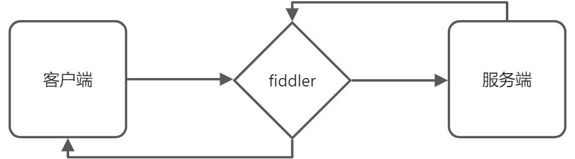

### fiddler 配置
打开 fildder 选项设置

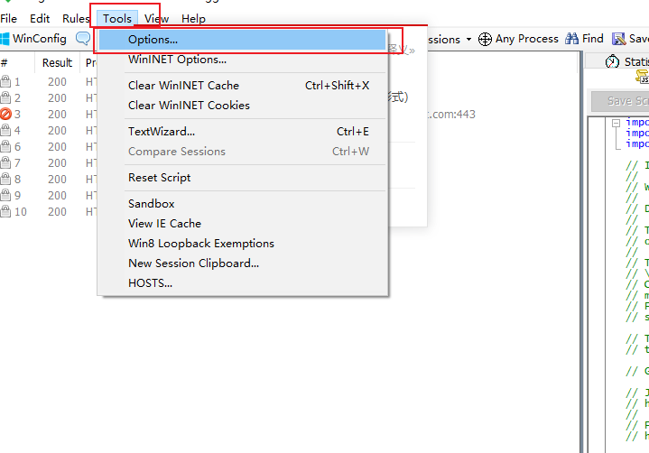

设置 https

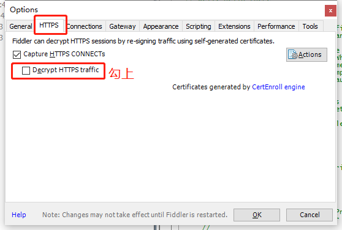

下载 ca 证书

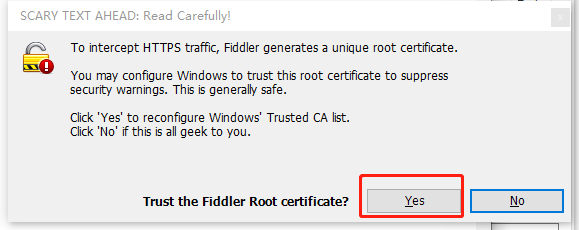

安装证书

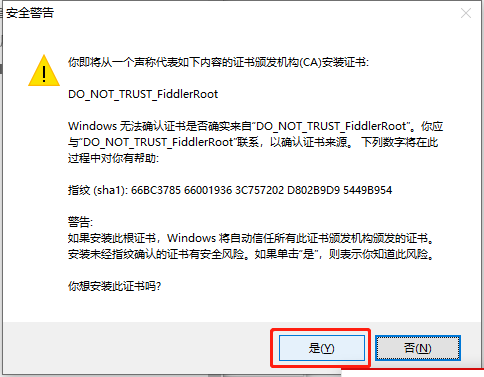

安装，点击是

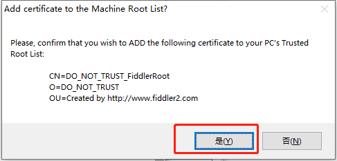

点击确定

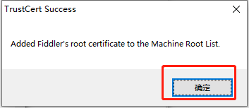

https 设置

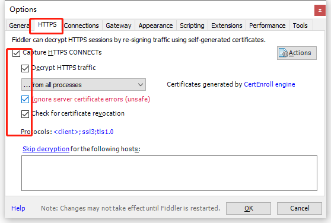

connections 配置

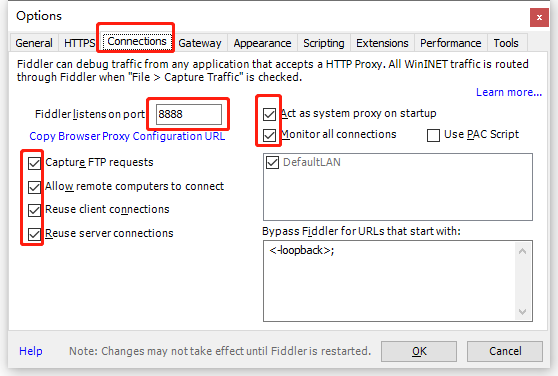

### fiddler 基本使用
- 开始抓包功能和关闭抓包功能
- 勾选上就是开启抓包功能
- 去掉勾选就是关闭抓包功能

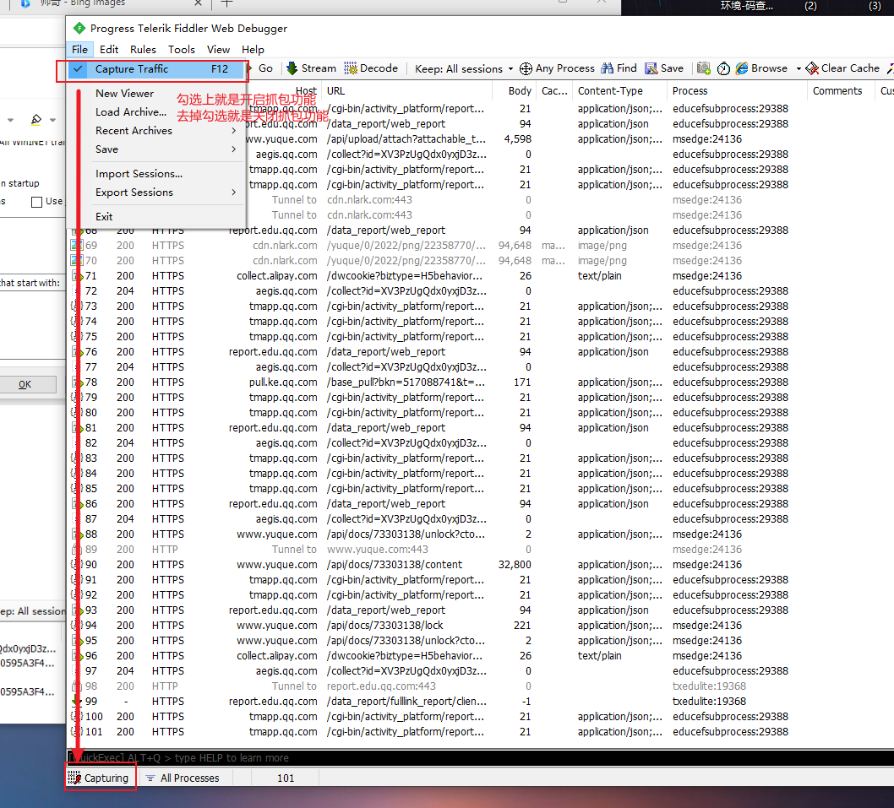

- 显示工具栏

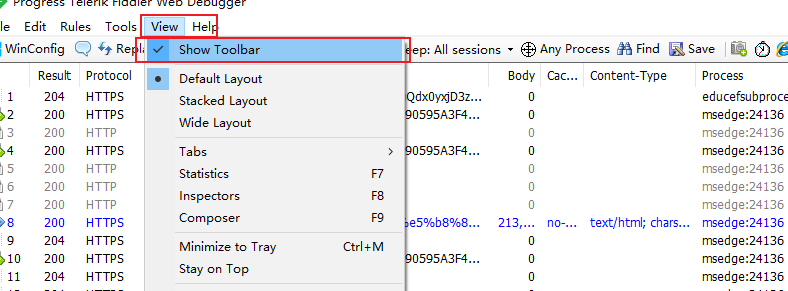

- 清空抓取到的请求

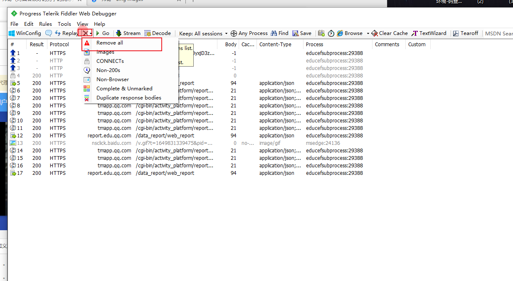

- 抓到的包（包）

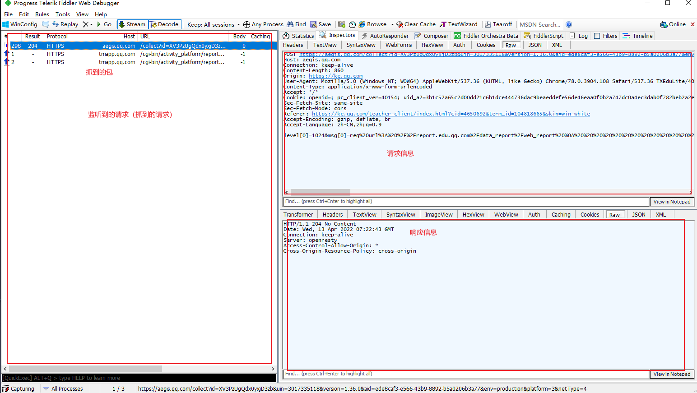

### 过滤器
抓包的时候，会抓到本地电脑的所有请求，如果只要抓某个特定网站的包，可以通过过滤器来实现。

### 过滤网页
用 fiddler 只抓取百度的请求

~~~txt
www.baidu.com;
~~~

==网站只需要输入网站的域名就可以了==，不需要输入 http://

==每个网站之间用；隔开==

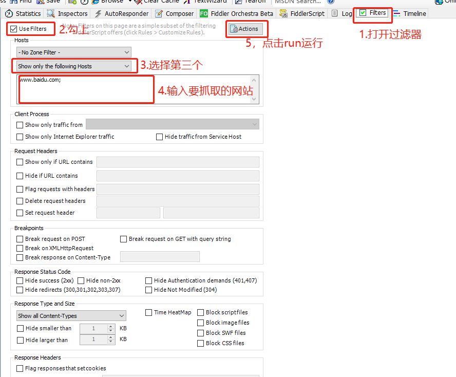

